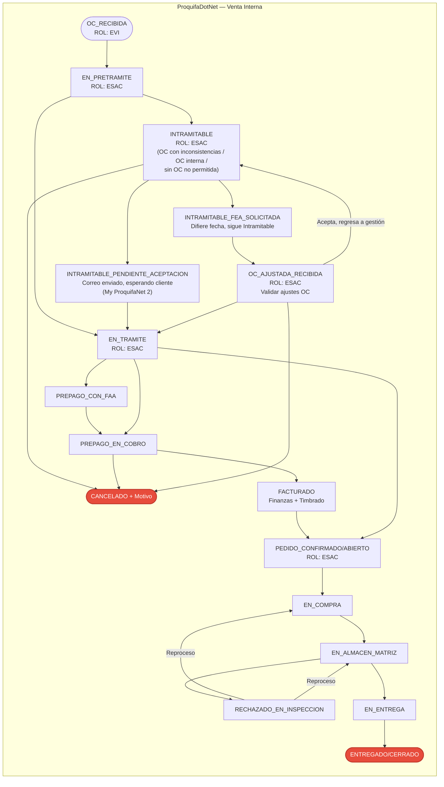

# catEstadoPedido — Estados Propuestos

**Referencia:** OBS-027 (bloqueante RE-FU-015) — desbloqueo de tareas T7 (BD) y T8 (Back).
**Alcance:** Catálogo del ciclo de vida del pedido (`tpPedido.IdCatEstadoPedido`), derivado del rastreo de flujos reales del aplicativo ProquifaDotNet, del diagrama de Venta Interna aportado por negocio y de la nueva arquitectura R16 (Facturas, Proforma, Validar Cobro, CFDI y transferencias a Legacy migran a **ProquifaDotNet.Finanzas** a partir del RE-FU-016).
**Fecha:** 2026-08-11 · **Actualizado 12/08/2026 (reunión de revisión de estatus):**

- **Renombres alineados con el lenguaje de negocio:** `EN_PRETRAMITAR` → **`EN_PRETRAMITE`**; `EN_VALIDAR_AJUSTE` → **`OC_AJUSTADA_RECIBIDA`**; `EN_VALIDAR_COBRO` → **`PREPAGO_EN_COBRO`**; `PEDIDO_CONFIRMADO` mantiene la clave pero se documenta con el alias `PEDIDO_ABIERTO`; `ENTREGADO` mantiene la clave con alias `PEDIDO_CERRADO`.
- **Nuevo estado intermedio `EN_TRAMITE`:** representa el momento entre "resolución de Pretramitar / Intramitable" y la confirmación final del pedido (`PEDIDO_CONFIRMADO/ABIERTO`). Se alcanza tras Pretramitar directo, tras aceptación del cliente en Intramitable o tras la OC ajustada validada.
- **Cancelaciones consolidadas en un único estado `CANCELADO + Motivo`:** desaparecen `CANCELADO_INTRAMITABLE` y `CANCELADO_POR_FALTA_PAGO` como estados separados; la trazabilidad del origen se guarda en un campo/catálogo `MotivoCancelacion` (por definir — ver obs. #1, sección 7).
- **Se eliminan estados obsoletos:** `PEDIDO_GENERADO` (subsumido por `OC_RECIBIDA` → `EN_PRETRAMITE`), `INTRAMITABLE_OC_ACEPTADA` e `INTRAMITABLE_TRAMITADO_CON_ERRORES` (ambos van directo a `EN_TRAMITE` desde `INTRAMITABLE_PENDIENTE_ACEPTACION`), `TRANSFERIDO_A_LEGACY` (deja de ser estado observable en el catálogo — se maneja como bandera derivada), y `FINALIZADO` (queda cubierto por el terminal `ENTREGADO/CERRADO`).
- **Se pospone `FOLIO_APARTADO` (prepagos):** no aparece en el diagrama acordado; se mantiene como observación pendiente (ver obs. #6, sección 7).
- **Nuevo orden del ciclo tras confirmación:** `EN_TRAMITE` puede pasar por la rama de facturación (`PREPAGO_CON_FAA` → `PREPAGO_EN_COBRO` → `FACTURADO`) **antes** de llegar a `PEDIDO_CONFIRMADO/ABIERTO`, o llegar directo si no aplica prepago; desde `PEDIDO_CONFIRMADO/ABIERTO` arranca la cadena logística.

---

## 1. Contexto

El catálogo `catEstadoPedido` está pendiente de propuesta del cliente desde el diseño del RE-FU-015. Los tres catálogos existentes en BD (`catEstadoPedido`, `catEstadoPartidaPedido`, `catEstadoPretramitacionPedido`) están vacíos en el código, sin FK a `tpPedido` y sin datos sembrados en el dump verificado (`ProquifaDotNet.sql`).

### Cambio de propietario por la arquitectura R16

A partir del **RE-FU-016**, las piezas de facturación, proforma, validar cobro, CFDI y transferencias a Legacy dejan de vivir en ProquifaDotNet (Venta Interna, .NET Framework 4.8) y pasan a **ProquifaDotNet.Finanzas** (.NET Core 10). Como consecuencia, el ciclo de vida del pedido se reparte entre dos aplicativos:

| Aplicativo | Etapas del ciclo | Requisitos R16 |
|---|---|---|
| **ProquifaDotNet** (Venta Interna) | Atender Promesa de Compra → Pretramitar → Intramitable → OC Ajustada → En Trámite → Confirmado/Abierto → Logística | Legacy + RE-FU-013 / 014 / 015 |
| **ProquifaDotNet.Finanzas** | Prepago con FAA → Prepago en Cobro → Facturado (CFDI) → Transferencia a Legacy (bandera) | RE-FU-016, 019, 020, 023, 024–029, 028, 030, 032, LegacySync |
| **ProquifaDotNet.Timbrado** | Timbrado del CFDI (fase interna de Facturación) | RE-FU-018, 028, 030, 032 |

Aunque el ciclo se ejecuta en dos aplicativos, la **fuente única de la verdad del estado del pedido cabecera** es `tpPedido.IdCatEstadoPedido` en la BD `ProquifaDotNet`. Finanzas **escribe este campo** mediante los servicios de Prepago en Cobro y Facturación (Scaffold EF Core sobre `tpPedido`, con guardias de idempotencia).

---

## 2. Fuente de la propuesta

Los estados se derivaron del diagrama de Venta Interna aportado por negocio en la reunión del 12/08/2026, del rastreo de flujos en el aplicativo `ProquifaDotNet-R14` y del alcance funcional documentado en los requisitos R16:

| Módulo / Aplicativo | Ubicación | Aporte al ciclo |
|---|---|---|
| ProquifaDotNet · L03 Atender Promesa de Compra | `PretramitarPromesaDeCompraTransaccionBO.cs` | Recepción de OC / OC interna / sin OC — `OC_RECIBIDA` (rol EVI) |
| ProquifaDotNet · L04 Pretramitar Pedido | `ppPedidoBO.cs`, `PretramitarPedidoTransaccionBO.cs`, `TramitarPedidoBO.cs` | `EN_PRETRAMITE`, `INTRAMITABLE`, transición a `EN_TRAMITE` (rol ESAC) |
| ProquifaDotNet · L04 Gestionar Intramitables (correo previo al cliente) | `ppPedidoIncidenciaCorreoTransaccionBO.cs`, `ppPedidoOcNoAmparadaCorreoTransaccioBO.cs` | Correo de aceptación enviado al cliente (`INTRAMITABLE_PENDIENTE_ACEPTACION`); interacción del cliente vía **My ProquifaNet 2** (aceptar tramitar con errores / aceptar OC interna) — pasa directo a `EN_TRAMITE` |
| ProquifaDotNet · L04 Gestionar Intramitables (diferimiento) | `ppPedidosSolicitarFEATransaccionBO.cs` | Solicitud de **FEA** (Fecha Estimada de Ajuste) — `INTRAMITABLE_FEA_SOLICITADA` |
| ProquifaDotNet · L04 Validar OC Ajustada | *(entrada desde Buzones — OC ajustada del cliente; BO por identificar)* | Pantalla **"Validar ajustes OC"** — `OC_AJUSTADA_RECIBIDA` (rol ESAC): ESAC revisa la OC ajustada que el cliente envió y la acepta (→ `EN_TRAMITE`), la regresa a `INTRAMITABLE`, o cancela |
| ProquifaDotNet · L05 Tramitar Pedido | `tpPedidoTramitarTransaccionBO.cs`, `tpPedidoBO.cs` | `EN_TRAMITE` → `PEDIDO_CONFIRMADO/ABIERTO` (folio interno + confirmación de pedido; rol ESAC) |
| **Finanzas · RE-FU-015 / 019 / 020 Prepago con FAA** | `fccFactura` + `fccFacturaPartida` (nuevas R16) | `PREPAGO_CON_FAA` — Factura por Adelantado emitida sin cobro |
| **Finanzas · RE-FU-016 / 023 / 024–027 Prepago en Cobro** | `tpProformaPedido`, `fccPagoCliente` | `PREPAGO_EN_COBRO` — cobro pendiente de aplicar |
| **Finanzas · RE-FU-028 Facturación MEX / RE-029 Perú** | `CFDIGenerada`, `fccDocumentoFiscalCobro` | `FACTURADO` — CFDI timbrado; transición a `PEDIDO_CONFIRMADO/ABIERTO` |
| **Finanzas · RE-FU-030 Complemento de Pago** | `PaymentComplementCalculationService` | CP timbrado dentro de la fase `FACTURADO` |
| **LegacySync** | ETLs E1–E8 (RE-FU-028) | Transferencia a Legacy — se maneja como **bandera derivada**, no como estado observable en el catálogo |
| ProquifaDotNet · L06–L09 | OrdenDeCompra, Importaciones, Inspección, Embalar | Cadena logística: `EN_COMPRA` → `EN_ALMACEN_MATRIZ` → (`RECHAZADO_EN_INSPECCION`) → `EN_ENTREGA` → `ENTREGADO/CERRADO` |
| ProquifaDotNet · `ServicioLegacyBO` + `ExternalAppSettings.config` (`SeguimientoPedidoVD`) | Claves publicadas al cliente en Venta Digital | `encompra`, `almacenmatriz`, `rechazadoeninspeccion`, `enentrega`, `pedidoentregado` |
| ProquifaDotNet · Cancelación (cualquier fuente) | `tpPedidoCancelacionController` + orquestador RE-FU-023 | Estado terminal único `CANCELADO` — motivo se guarda en campo/catálogo `MotivoCancelacion` (por definir) |

---

## 3. Estados propuestos

| # | Clave | Descripción (`EstadoPedido`) | Rol | Aplicativo que lo escribe | Requisito R16 | Bandeja / evento | Terminal |
|---|---|---|---|---|---|---|---|
| 1  | `OC_RECIBIDA`                       | OC recibida — pedido apenas llegó a Atender Promesa de Compra (con OC, sin OC u OC interna) | EVI  | ProquifaDotNet (L03) | RE-FU-013 / 014 | Alta en bandeja de Atender Promesa de Compra | No |
| 2  | `EN_PRETRAMITE`                     | En Pretramitar Pedido | ESAC | ProquifaDotNet (L04) | RE-FU-013 / 014 | `ppPedido` con `Tramitado=false, Intramitable=null` | No |
| 3  | `INTRAMITABLE`                      | Intramitable — requiere gestión (OC con inconsistencias en partidas/fletes, cliente con OC interna, cliente sin OC cuando no está permitido tramitar sin OC) | ESAC | ProquifaDotNet (L04) | RE-FU-013 / 014 | `ppPedido.Intramitable=true` | No |
| 4  | `INTRAMITABLE_PENDIENTE_ACEPTACION` | Correo enviado al cliente para aceptar tramitar con errores o aceptar OC interna vía **My ProquifaNet 2** | ESAC → CLIENTE | ProquifaDotNet (L04) | RE-FU-013 / 014 | `ppPedidoAceptacionConError.Enviado=true, Aceptada=false` | No |
| 5  | `INTRAMITABLE_FEA_SOLICITADA`       | Solicitud de FEA (Fecha Estimada de Ajuste) enviada — sigue Intramitable, solo se difiere/ajusta fecha | ESAC | ProquifaDotNet (L04) | RE-FU-013 / 014 | `ppPedido.FechaEstimadaAjuste` actualizada (`Intramitable` sin cambio) | No |
| 6  | `OC_AJUSTADA_RECIBIDA`              | ESAC valida la OC ajustada que el cliente envió por Buzones/My ProquifaNet 2 en respuesta a la FEA (pantalla "Validar ajustes OC") | ESAC | ProquifaDotNet (L04) | RE-FU-013 / 014 | Alta en bandeja de Validar ajustes OC (evento de OC ajustada por Buzones) | No |
| 7  | `EN_TRAMITE`                        | En Trámite — pedido resuelto de Pretramitar/Intramitable/OC ajustada, listo para pasar por facturación (si aplica prepago) y confirmarse | ESAC | ProquifaDotNet (L05) | RE-FU-013 / 014 / 015 | `ppPedido.Tramitado=true` sin `Liberado` aún | No |
| 8  | `PREPAGO_CON_FAA`                   | Prepago con Factura por Adelantado emitida pendiente de cobro | — | **Finanzas** | RE-FU-015 / 019 / 020 | `fccFactura` con estado `EMITIDA_SIN_COBRO` — dispara pendiente en Validar Cobro | No |
| 9  | `PREPAGO_EN_COBRO`                  | Prepago en Cobro (proforma con saldo pendiente / cobro recibido no aplicado) | — | **Finanzas** | RE-FU-016 / 023 / 024–027 | Proforma con `MontoPendiente > 0` **o** correo de cobro en Buzón sin aplicar | No |
| 10 | `FACTURADO`                         | Facturado — CFDI timbrado; Complemento de Pago timbrado si aplica | — | **Finanzas** (llama Timbrado) | RE-FU-028 / 029 / 030 | `CFDIGenerada` timbrado y (si PPD) CP timbrado | No |
| 11 | `PEDIDO_CONFIRMADO`                 | Pedido confirmado / abierto — folio de pedido interno emitido y confirmación de pedido generada (alias operativo: `PEDIDO_ABIERTO`) | ESAC | ProquifaDotNet (L05) | RE-FU-013 / 014 / 015 | `tpPedido.Tramitado=true`, `FechaTramitacion` seteada, `Liberado=true` | No |
| 12 | `EN_COMPRA`                         | En Compra (OC generada, seguimiento del proveedor) | — | ProquifaDotNet (L06/L07) | Legacy | `catSeguimientoPartidaPedido.Clave='encompra'` | No |
| 13 | `EN_ALMACEN_MATRIZ`                 | En Almacén Matriz | — | ProquifaDotNet (L07/L08) | Legacy | `Clave='almacenmatriz'` | No |
| 14 | `RECHAZADO_EN_INSPECCION`           | Rechazado en Inspección — reproceso a `EN_COMPRA` o `EN_ALMACEN_MATRIZ` según motivo | — | ProquifaDotNet (L08) | Legacy | `Clave='rechazadoeninspeccion'` | No |
| 15 | `EN_ENTREGA`                        | En Entrega (en ruta al cliente) | — | ProquifaDotNet (L09) | Legacy | `Clave='enentrega'`, `tpPedidoVD.MostrarEnRuta=true` | No |
| 16 | `ENTREGADO`                         | Entregado al cliente — pedido cerrado (alias operativo: `PEDIDO_CERRADO`) | — | ProquifaDotNet (L09) | Legacy | `Clave='pedidoentregado'` | **Sí** |
| 17 | `CANCELADO`                         | Cancelado — estado terminal único; el motivo se registra en campo/catálogo `MotivoCancelacion` (Intramitable, OC no ajustada, falta de pago, operativo, etc.) | ESAC / Finanzas / Ops | ProquifaDotNet (L04/L10) + Finanzas (RE-FU-023 para falta de pago) | RE-FU-013 / 014 / 023 / Legacy | `ppPedido.Cancelada=true` o `tpPedido.FechaCancelacionPorFaltaPago` seteada, según origen | **Sí** |

> **Cambio principal respecto a v2:** las tres cancelaciones (`CANCELADO_INTRAMITABLE`, `CANCELADO_POR_FALTA_PAGO`, `CANCELADO`) se fusionan en un único estado terminal `CANCELADO` con un campo/catálogo `MotivoCancelacion` que preserva la trazabilidad del origen para auditoría (ver obs. #1). También se eliminan `INTRAMITABLE_OC_ACEPTADA`, `INTRAMITABLE_TRAMITADO_CON_ERRORES` (van directo a `EN_TRAMITE` desde `INTRAMITABLE_PENDIENTE_ACEPTACION`), `TRANSFERIDO_A_LEGACY` (bandera derivada), `FINALIZADO` (queda cubierto por `ENTREGADO`) y el intermedio `PEDIDO_GENERADO` (subsumido).

---

## 4. Transiciones observadas



> **Notas de flujo:**
> - `EN_TRAMITE` es el pivote entre la fase de Venta Interna y la fase de facturación de Finanzas: puede saltar a `PEDIDO_CONFIRMADO/ABIERTO` directamente (pedido sin prepago) o pasar por la rama `PREPAGO_CON_FAA` / `PREPAGO_EN_COBRO` → `FACTURADO` → `PEDIDO_CONFIRMADO/ABIERTO`.
> - La cancelación es un estado terminal único con motivo — se alcanza desde `INTRAMITABLE`, `OC_AJUSTADA_RECIBIDA` y `PREPAGO_EN_COBRO` según el diagrama acordado. Otras cancelaciones operativas (post-confirmación, en logística) deben confirmarse con negocio (ver obs. #2).
> - `TRANSFERIDO_A_LEGACY` se maneja como bandera derivada (booleana) sobre `tpPedido` o `fccFactura`, no como estado observable en el catálogo.

---

## 5. Matriz de transiciones permitidas

Legenda: **✅** permitida · **✋** requiere autorización especial · **⛔** no permitida

| Origen \ Destino | 2 | 3 | 4 | 5 | 6 | 7 | 8 | 9 | 10 | 11 | 12 | 13 | 14 | 15 | 16 | 17 |
|---|---|---|---|---|---|---|---|---|---|---|---|---|---|---|---|---|
| 1. OC_RECIBIDA | ✅ | ⛔ | ⛔ | ⛔ | ⛔ | ⛔ | ⛔ | ⛔ | ⛔ | ⛔ | ⛔ | ⛔ | ⛔ | ⛔ | ⛔ | ⛔ |
| 2. EN_PRETRAMITE | — | ✅ | ⛔ | ⛔ | ⛔ | ✅ | ⛔ | ⛔ | ⛔ | ⛔ | ⛔ | ⛔ | ⛔ | ⛔ | ⛔ | ⛔ |
| 3. INTRAMITABLE | ⛔ | — | ✅ | ✅ | ⛔ | ⛔ | ⛔ | ⛔ | ⛔ | ⛔ | ⛔ | ⛔ | ⛔ | ⛔ | ⛔ | ✅ |
| 4. INTRAMITABLE_PENDIENTE_ACEPTACION | ⛔ | ⛔ | — | ⛔ | ⛔ | ✅ | ⛔ | ⛔ | ⛔ | ⛔ | ⛔ | ⛔ | ⛔ | ⛔ | ⛔ | ⛔ |
| 5. INTRAMITABLE_FEA_SOLICITADA | ⛔ | ⛔ | ⛔ | — | ✅ | ⛔ | ⛔ | ⛔ | ⛔ | ⛔ | ⛔ | ⛔ | ⛔ | ⛔ | ⛔ | ⛔ |
| 6. OC_AJUSTADA_RECIBIDA | ⛔ | ✅ | ⛔ | ⛔ | — | ✅ | ⛔ | ⛔ | ⛔ | ⛔ | ⛔ | ⛔ | ⛔ | ⛔ | ⛔ | ✅ |
| 7. EN_TRAMITE | ⛔ | ⛔ | ⛔ | ⛔ | ⛔ | — | ✅ | ✅ | ⛔ | ✅ | ⛔ | ⛔ | ⛔ | ⛔ | ⛔ | ⛔ |
| 8. PREPAGO_CON_FAA | ⛔ | ⛔ | ⛔ | ⛔ | ⛔ | ⛔ | — | ✅ | ⛔ | ⛔ | ⛔ | ⛔ | ⛔ | ⛔ | ⛔ | ✋ |
| 9. PREPAGO_EN_COBRO | ⛔ | ⛔ | ⛔ | ⛔ | ⛔ | ⛔ | ⛔ | — | ✅ | ⛔ | ⛔ | ⛔ | ⛔ | ⛔ | ⛔ | ✅ |
| 10. FACTURADO | ⛔ | ⛔ | ⛔ | ⛔ | ⛔ | ⛔ | ⛔ | ⛔ | — | ✅ | ⛔ | ⛔ | ⛔ | ⛔ | ⛔ | ⛔ |
| 11. PEDIDO_CONFIRMADO | ⛔ | ⛔ | ⛔ | ⛔ | ⛔ | ⛔ | ⛔ | ⛔ | ⛔ | — | ✅ | ⛔ | ⛔ | ⛔ | ⛔ | ✋ |
| 12. EN_COMPRA | ⛔ | ⛔ | ⛔ | ⛔ | ⛔ | ⛔ | ⛔ | ⛔ | ⛔ | ⛔ | — | ✅ | ⛔ | ⛔ | ⛔ | ✋ |
| 13. EN_ALMACEN_MATRIZ | ⛔ | ⛔ | ⛔ | ⛔ | ⛔ | ⛔ | ⛔ | ⛔ | ⛔ | ⛔ | ⛔ | — | ✅ | ✅ | ⛔ | ✋ |
| 14. RECHAZADO_EN_INSPECCION | ⛔ | ⛔ | ⛔ | ⛔ | ⛔ | ⛔ | ⛔ | ⛔ | ⛔ | ⛔ | ✅ | ✅ | — | ⛔ | ⛔ | ✋ |
| 15. EN_ENTREGA | ⛔ | ⛔ | ⛔ | ⛔ | ⛔ | ⛔ | ⛔ | ⛔ | ⛔ | ⛔ | ⛔ | ⛔ | ⛔ | — | ✅ | ⛔ |
| 16. ENTREGADO | ⛔ | ⛔ | ⛔ | ⛔ | ⛔ | ⛔ | ⛔ | ⛔ | ⛔ | ⛔ | ⛔ | ⛔ | ⛔ | ⛔ | — | ⛔ |
| 17. CANCELADO | ⛔ | ⛔ | ⛔ | ⛔ | ⛔ | ⛔ | ⛔ | ⛔ | ⛔ | ⛔ | ⛔ | ⛔ | ⛔ | ⛔ | ⛔ | — |

> **Nota sobre cancelaciones:** en la propuesta acordada, `CANCELADO` es un estado terminal único parametrizado por `MotivoCancelacion`. La matriz refleja los orígenes visibles en el diagrama (`INTRAMITABLE`, `OC_AJUSTADA_RECIBIDA`, `PREPAGO_EN_COBRO`) con ✅, y marca con ✋ los orígenes que operativamente pueden cancelar pero requieren autorización explícita (`PREPAGO_CON_FAA` para reversa de FAA, `PEDIDO_CONFIRMADO` en adelante para cancelaciones operativas de logística) — confirmar con negocio (ver obs. #2).

---

## 6. Responsabilidades por aplicativo — escritura de `tpPedido.IdCatEstadoPedido`

| Aplicativo | Estados que escribe | Mecanismo |
|---|---|---|
| **ProquifaDotNet** (Venta Interna) | 1, 2, 3, 4, 5, 6, 7, 11, 12, 13, 14, 15, 16, 17 (motivos: Intramitable, OC no ajustada, operativo) | Escritura directa desde los BOs de L03–L10 con `Core.Pqf.ProquifaDotNetContext`. |
| **ProquifaDotNet.Finanzas** | 8, 9, 10, 17 (motivo: falta de pago — RE-FU-023) | Scaffold EF Core sobre `tpPedido` (patrón declarado en `Base de datos nombramiento ProquifaDotNet.md`). En RE-FU-023 el orquestador de cancelación distribuida escribe también `tpProformaPedido.IdcatEstadoProforma = Cancelada` y el motivo correspondiente. |
| **ProquifaDotNet.Timbrado** | — (no escribe) | Solo cancela el CFDI ante el SAT (RE-FU-023 endpoint `POST /api/v1/invoices/{invoiceId}/cancel`); no toca `tpPedido`. |

> **Consistencia entre aplicativos:** los cambios de estado desde Finanzas usan la misma guardia de idempotencia que el orquestador de RE-FU-023 (leer estado actual, comparar, escribir solo si aplica la transición permitida). No hay transacciones cross-aplicativo únicas — la consistencia se logra por orquestación.

---

## 7. Observaciones y decisiones pendientes del cliente

1. **`MotivoCancelacion` — diseño pendiente (nuevo):** con la consolidación de las tres cancelaciones en un único estado `CANCELADO`, se necesita definir dónde y cómo se guarda el motivo. Alternativas:
   - **(A)** Campo `MotivoCancelacion varchar(50)` directamente en `tpPedido` con un enum controlado por código.
   - **(B)** Nuevo catálogo `catMotivoCancelacion` con FK `tpPedido.IdCatMotivoCancelacion`. Recomendado por trazabilidad y para que negocio pueda administrar los motivos sin release. Motivos iniciales: `INTRAMITABLE`, `OC_NO_AJUSTADA`, `FALTA_PAGO`, `OPERATIVO`, `SOLICITUD_CLIENTE`.
2. **Cancelaciones desde estados posteriores (post-confirmación):** el diagrama de la reunión no cubre explícitamente cancelaciones desde `PEDIDO_CONFIRMADO`, `EN_COMPRA`, `EN_ALMACEN_MATRIZ`, `RECHAZADO_EN_INSPECCION`. En la práctica existen cancelaciones operativas (`tpPedidoCancelacionController` en Logística). Confirmar si se permiten con `✋` (autorización especial) o si el diagrama excluye estos escenarios a propósito.
3. **`OC_AJUSTADA_RECIBIDA` — evento de entrada desde Buzones:** la OC ajustada llega por Buzones (o por My ProquifaNet 2), en respuesta a la FEA solicitada. Falta documentar el disparador exacto (evento del Mailbot, botón en el buzón, etc.) y el BO que lo procesa. `EN_VALIDAR_AJUSTE` del catálogo v2 se renombra a `OC_AJUSTADA_RECIBIDA` para reflejar mejor el semántico (la pantalla se llama "Validar ajustes OC").
4. **Ámbito del campo `IdCatEstadoPedido`:** confirmar si aplica solo en `tpPedido`, también en `ppPedido`, o en ambas. Los estados 1–7 (fase Pretramitar/Intramitable) son propios de `ppPedido`; los 8–16 y el terminal 17 aplican a `tpPedido`. Alternativas:
   - **(A)** Un solo catálogo, agregar `IdCatEstadoPedido` a ambas tablas.
   - **(B)** Un catálogo por tabla — reutilizar `catEstadoPretramitacionPedido` para `ppPedido` (1–7) y `catEstadoPedido` para `tpPedido` (7–17). El estado 7 (`EN_TRAMITE`) sería el puente.
5. **Reutilización de `catSeguimientoPartidaPedido`:** los estados 12–16 usan claves ya publicadas al cliente en Venta Digital (`SeguimientoPedidoVD`). Conviene mantener las mismas claves para no romper esa integración; o bien dejar `catSeguimientoPartidaPedido` para el detalle por partida y `catEstadoPedido` para la cabecera con las mismas claves espejadas.
6. **Prepagos — paso "folio apartado" antes de `PEDIDO_CONFIRMADO` (heredado, sigue abierto):** el coordinador señaló previamente que en prepagos existe un paso intermedio en Tramitar Pedido donde se **aparta el folio de pedido interno** pero aún **no se genera la confirmación**. El nuevo estado `EN_TRAMITE` **podría** cubrir esa fase, pero falta confirmar explícitamente con negocio. Si es un estado propio distinto, se agregaría como #7-bis entre `EN_TRAMITE` y `PEDIDO_CONFIRMADO`.
7. **`TRANSFERIDO_A_LEGACY` como bandera derivada:** se elimina del catálogo como estado observable. Se registra como flag booleano (`tpPedido.TransferidoLegacy bit` o similar) actualizado por LegacySync post-ETL. Confirmar con negocio que no pierden visibilidad operativa.
8. **`ENTREGADO/CERRADO` como estado terminal único:** desaparece `FINALIZADO` como estado separado. `ENTREGADO` cierra el ciclo (alias operativo `PEDIDO_CERRADO`); cualquier post-cierre (garantías, devoluciones) sería un flujo aparte, fuera de este catálogo. Confirmar.

---

## 8. Impacto DDL (una vez aprobado)

> **Nota:** el catálogo `dbo.catEstadoPedido` **ya existe** en BD `ProquifaDotNet` con columnas `IdCatEstadoPedido uniqueidentifier`, `EstadoPedido varchar(50)`, `Clave varchar(150)`, `Activo bit`, `FechaUltimaActualizacion datetime` (verificado en `ProquifaDotNet.sql` líneas 29278–29289). Está vacío y sin FK desde `tpPedido`. Se requiere: (a) extender con las columnas `Orden`, `EsTerminal`, `Aplicativo` y `AliasOperativo`; (b) sembrar los 17 estados; (c) agregar FK en `tpPedido`; (d) crear el catálogo `catMotivoCancelacion` y su FK.

```sql
-- 1. Extender el catálogo existente
ALTER TABLE dbo.catEstadoPedido
    ADD Orden int NULL,
        EsTerminal bit NOT NULL CONSTRAINT DF_catEstadoPedido_EsTerminal DEFAULT (0),
        Aplicativo varchar(30) NULL, -- 'ProquifaDotNet' | 'Finanzas' | 'Distribuido'
        AliasOperativo varchar(50) NULL; -- ej. 'PEDIDO_ABIERTO' para PEDIDO_CONFIRMADO

ALTER TABLE dbo.catEstadoPedido
    ADD CONSTRAINT UQ_catEstadoPedido_Clave UNIQUE (Clave);

-- 2. FK en tpPedido
ALTER TABLE dbo.tpPedido
    ADD IdCatEstadoPedido uniqueidentifier NULL
        CONSTRAINT FK_tpPedido_catEstadoPedido
            FOREIGN KEY REFERENCES dbo.catEstadoPedido (IdCatEstadoPedido);

-- 3. Nuevo catálogo de motivo de cancelación (opción B de obs. #1)
CREATE TABLE dbo.catMotivoCancelacion (
    IdCatMotivoCancelacion uniqueidentifier NOT NULL
        CONSTRAINT PK_catMotivoCancelacion PRIMARY KEY CLUSTERED,
    Clave varchar(50) NOT NULL,
    Descripcion varchar(200) NOT NULL,
    Aplicativo varchar(30) NULL,
    Activo bit NOT NULL CONSTRAINT DF_catMotivoCancelacion_Activo DEFAULT (1),
    FechaUltimaActualizacion datetime NOT NULL CONSTRAINT DF_catMotivoCancelacion_Fecha DEFAULT (GETDATE()),
    CONSTRAINT UQ_catMotivoCancelacion_Clave UNIQUE (Clave)
);

ALTER TABLE dbo.tpPedido
    ADD IdCatMotivoCancelacion uniqueidentifier NULL
        CONSTRAINT FK_tpPedido_catMotivoCancelacion
            FOREIGN KEY REFERENCES dbo.catMotivoCancelacion (IdCatMotivoCancelacion);

-- 4. Seed catEstadoPedido (17 estados) — asume que la tabla está vacía
INSERT INTO dbo.catEstadoPedido (Clave, EstadoPedido, Orden, EsTerminal, Aplicativo, AliasOperativo, FechaUltimaActualizacion, Activo) VALUES
 ('OC_RECIBIDA',                       'OC recibida en Atender Promesa de Compra',                           1, 0, 'ProquifaDotNet', NULL,             GETDATE(), 1),
 ('EN_PRETRAMITE',                     'En Pretramite',                                                       2, 0, 'ProquifaDotNet', NULL,             GETDATE(), 1),
 ('INTRAMITABLE',                      'Intramitable',                                                        3, 0, 'ProquifaDotNet', NULL,             GETDATE(), 1),
 ('INTRAMITABLE_PENDIENTE_ACEPTACION', 'Intramitable — correo de aceptación enviado, pendiente de respuesta', 4, 0, 'ProquifaDotNet', NULL,             GETDATE(), 1),
 ('INTRAMITABLE_FEA_SOLICITADA',       'Intramitable — solicitud de FEA (Fecha Estimada de Ajuste) enviada',  5, 0, 'ProquifaDotNet', NULL,             GETDATE(), 1),
 ('OC_AJUSTADA_RECIBIDA',              'OC ajustada recibida — Validar ajustes OC',                           6, 0, 'ProquifaDotNet', NULL,             GETDATE(), 1),
 ('EN_TRAMITE',                        'En Tramite',                                                          7, 0, 'ProquifaDotNet', NULL,             GETDATE(), 1),
 ('PREPAGO_CON_FAA',                   'Prepago con Factura por Adelantado',                                  8, 0, 'Finanzas',       NULL,             GETDATE(), 1),
 ('PREPAGO_EN_COBRO',                  'Prepago en Cobro',                                                    9, 0, 'Finanzas',       NULL,             GETDATE(), 1),
 ('FACTURADO',                         'Facturado',                                                          10, 0, 'Finanzas',       NULL,             GETDATE(), 1),
 ('PEDIDO_CONFIRMADO',                 'Pedido Confirmado / Abierto',                                        11, 0, 'ProquifaDotNet', 'PEDIDO_ABIERTO', GETDATE(), 1),
 ('EN_COMPRA',                         'En Compra',                                                          12, 0, 'ProquifaDotNet', NULL,             GETDATE(), 1),
 ('EN_ALMACEN_MATRIZ',                 'En Almacen Matriz',                                                  13, 0, 'ProquifaDotNet', NULL,             GETDATE(), 1),
 ('RECHAZADO_EN_INSPECCION',           'Rechazado en Inspeccion',                                            14, 0, 'ProquifaDotNet', NULL,             GETDATE(), 1),
 ('EN_ENTREGA',                        'En Entrega',                                                         15, 0, 'ProquifaDotNet', NULL,             GETDATE(), 1),
 ('ENTREGADO',                         'Entregado / Cerrado',                                                16, 1, 'ProquifaDotNet', 'PEDIDO_CERRADO', GETDATE(), 1),
 ('CANCELADO',                         'Cancelado (motivo en catMotivoCancelacion)',                         17, 1, 'Distribuido',    NULL,             GETDATE(), 1);

-- 5. Seed catMotivoCancelacion
INSERT INTO dbo.catMotivoCancelacion (IdCatMotivoCancelacion, Clave, Descripcion, Aplicativo, FechaUltimaActualizacion, Activo) VALUES
 (NEWID(), 'INTRAMITABLE',       'Cancelado desde Gestionar Intramitable',              'ProquifaDotNet', GETDATE(), 1),
 (NEWID(), 'OC_NO_AJUSTADA',     'Cancelado en Validar ajustes OC (cliente no ajustó)', 'ProquifaDotNet', GETDATE(), 1),
 (NEWID(), 'FALTA_PAGO',         'Cancelado por falta de pago (RE-FU-023)',             'Finanzas',       GETDATE(), 1),
 (NEWID(), 'OPERATIVO',          'Cancelacion operativa desde Logistica',               'ProquifaDotNet', GETDATE(), 1),
 (NEWID(), 'SOLICITUD_CLIENTE',  'Cancelacion a solicitud del cliente',                 'ProquifaDotNet', GETDATE(), 1);
```

> **Nota sobre GUIDs del seed:** en implementación se deben reemplazar los `NEWID()` por GUIDs hardcodeados en el script para homologar entre ambientes (Dev/QA/Prod), conforme al estándar de identificadores para catálogos.

---

## 9. Requisitos R16 que consumen `catEstadoPedido`

| Requisito | Aplicativo | Uso |
|---|---|---|
| RE-FU-013 / RE-FU-014 | ProquifaDotNet | Recepción en Atender Promesa (1); tramitar pedido normal (1 → 2 → 7 → 11); gestión de intramitables (3 → 4/5 → 6 → 7); cancelación (17 con motivo `INTRAMITABLE` u `OC_NO_AJUSTADA`) |
| RE-FU-015 | ProquifaDotNet + Finanzas | Prepago con FAA (7 → 8); ver obs. #6 sobre paso intermedio "folio apartado" |
| RE-FU-016 | Finanzas | `PREPAGO_EN_COBRO` cuando la proforma se emite con `MontoPendiente > 0` (7 → 9) |
| RE-FU-019 / RE-FU-020 | Finanzas | Emisión de FAA MEX / Perú (`PREPAGO_CON_FAA`) |
| RE-FU-023 | Finanzas (orquestador) + ProquifaDotNet + Timbrado | Cancelación por falta de pago (8/9 → 17 con motivo `FALTA_PAGO`), lectura de estado para el listado principal |
| RE-FU-024 – RE-FU-027 | Finanzas | Consumo del estado para wizard Validar Cobro; cierre del pendiente (9 → 10) al confirmar cobro |
| RE-FU-028 / RE-FU-029 | Finanzas (llama Timbrado) | Transición a `FACTURADO` al timbrar CFDI |
| RE-FU-030 | Finanzas (llama Timbrado) | Complemento de Pago timbrado dentro de `FACTURADO` |
| LegacySync | Finanzas | Bandera `TransferidoLegacy` post-ETL (ya no es estado del catálogo) |

---

## 10. Referencias

**Requisitos R16:**
- `Requisitos/R16A-RE-FU-015/R16A-RE-FU-015_BD.md` — OBS-027 bloqueante.
- `Requisitos/R16A-RE-FU-015/R16A-RE-FU-015-Tareas.md` — T7 (BD) y T8 (Back).
- `Requisitos/R16A-RE-FU-016/*` — Proforma MEX en Finanzas.
- `Requisitos/R16A-RE-FU-023/[R16A-RE-FU-023][DIS-SOL] Diseño de la solución.md` — cancelación distribuida.
- `Requisitos/R16A-RE-FU-024/*` — Wizard Validar Cobro Paso 1.
- `Requisitos/R16A-RE-FU-028/R16A-RE-FU-028-Back.md` — ETLs Facturación E1–E8.
- `Requisitos/R16A-RE-FU-030/DIS-SOL-backend-complemento-pago.md` — Complemento de Pago.

**Análisis y arquitectura:**
- `Analisis/Curacion-Datos-R16.md` — fila 5, backfill masivo bloqueante.
- `Database/Base de datos nombramiento ProquifaDotNet.md` — patrón Scaffold EF Core desde Finanzas sobre `tpPedido`.
- `Database/ER-Finanzas.md` — modelo de datos Finanzas.

**Fuente en aplicativos:**
- `Database/ProquifaDotNet.sql` — DDL de `catEstadoPedido`, `catEstadoPartidaPedido`, `catEstadoPretramitacionPedido`, `catSeguimientoPartidaPedido`, `tpPedido`.
- `ProquifaDotNet-R14/Logic.Pqf.Logistica/L04.PretramitarPedido/` y `L05.TramitarPedido/` — flujos observados.
- `ProquifaDotNet-R14/WebApi.Logistica/ExternalAppSettings.config` — claves `SeguimientoPedidoVD`.
- Diagrama de Venta Interna (reunión 12/08/2026) — flujo canónico consensuado con negocio.
