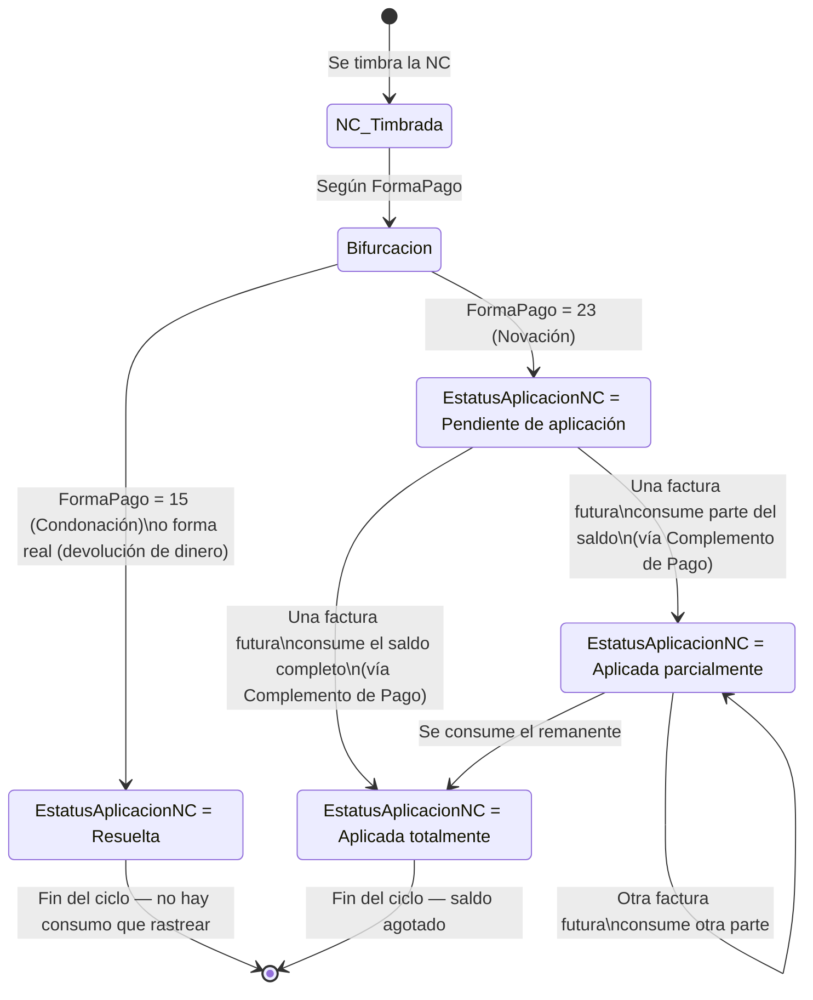

# Guía Técnica — Notas de Crédito (CFDI de Egreso) México

**Alcance:** esta guía cubre exclusivamente Notas de Crédito para México (CFDI 4.0, tipo de comprobante "E"), adaptada específicamente a los escenarios y decisiones ya tomadas para la operación de PROQUIFA — no es una guía genérica del SAT. No cubre Perú (Nota de Crédito/Débito SUNAT tiene reglas propias, documentadas aparte).

**Estado de las fuentes:** las reglas duras están fundamentadas en el Anexo 20 (Apéndice 5, Guía de llenado de CFDI de Egresos) o en el catálogo `c_TipoRelacion` publicado por el SAT. Las decisiones de arquitectura marcadas como "decisión de PROQUIFA" combinan mecanismos oficiales del SAT de la forma que el equipo (con validación del contador) decidió aplicarlos a esta operación específica — no son necesariamente el único camino documentado por el SAT, son el camino que PROQUIFA va a construir.

---

## 0. Glosario rápido (para quien no ha trabajado con CFDI antes)

| Término | Qué es |
|---|---|
| **CFDI** | Comprobante Fiscal Digital por Internet — el XML que ampara cualquier operación ante el SAT (factura, nota de crédito, etc.) |
| **Timbrar** | El proceso de enviar el XML a un PAC (Proveedor Autorizado de Certificación) para que el SAT lo valide, le asigne un folio fiscal (UUID) y quede legalmente vigente. Una vez timbrado, **es inmutable** — no se puede editar, solo corregir con otro documento (NC, sustitución, o cancelación) |
| **UUID / Folio fiscal** | Identificador único de un CFDI ya timbrado, asignado por el SAT. Es lo que se usa para relacionar documentos entre sí |
| **PAC** | Proveedor Autorizado de Certificación — empresa certificada por el SAT que timbra los CFDI en nombre del contribuyente |
| **Nota de Crédito** | Nombre común para el CFDI de tipo "E" (Egreso) que reduce el valor de una factura previa |
| **CfdiRelacionados** | Nodo del XML que declara que este comprobante está relacionado con uno o varios CFDI previos, mediante su UUID y un `TipoRelacion` |
| **Complemento de Pago** | CFDI de tipo "P" (Pago) que documenta un evento de pago contra una factura emitida en PPD. Una factura PPD puede tener varios Complementos de Pago a lo largo del tiempo, cada uno documentando una parte del pago |

---

## 1. Qué es una Nota de Crédito (concepto)

Una Nota de Crédito **no es dinero ni una promesa de dinero** — es un documento fiscal que corrige retroactivamente el valor de una factura ya timbrada. Le dice al SAT: *"la factura X que emití por $Y en realidad debe valer menos, por esta razón."*

Lo que pasa con el dinero (si se devuelve, si queda a favor del cliente, o si simplemente se cobra menos) es una decisión de negocio **posterior y separada** de la existencia de la NC en sí.

En CFDI, la Nota de Crédito es un comprobante de **Tipo de Comprobante = "E" (Egreso)**. La factura original **no se cancela ni se invalida** — ambos documentos coexisten en el expediente fiscal; el efecto es puramente contable (reduce el ingreso declarado).

---

## 2. Diagrama maestro — el ciclo completo de una Nota de Crédito

**Este diagrama es la referencia principal del documento, no un resumen decorativo.** Cada nodo usa el nombre exacto de un estatus, valor de catálogo o campo definido en el resto de la guía. 2 matices importantes que el diagrama ya refleja: (1) el estatus de una NC en realidad son **2 campos independientes**, no uno solo — `EstatusAplicacionNC` (lo controla este sistema, es el eje principal del diagrama) y `EstatusSAT` (lo decide el SAT; su cancelación es un evento **externo**, fuera de este sistema, que soporte actualiza manualmente cuando ocurre — ver el detalle completo en la sección 13); y (2) el **Excedente** (sección 6) es un dato distinto del `Total` que declara el CFDI — es el único monto que realmente se devuelve o se guarda como saldo a favor, y casi nunca coincide con el monto total de la NC. El texto de las secciones siguientes explica el detalle de cada nodo; el diagrama es el mapa completo de decisiones, del cual el texto es el desarrollo.

```mermaid
flowchart TD
    A[Factura ya emitida] --> B{¿Hubo una operación real?\nSección 11}
    B -- No ocurrió / error de datos --> C[Cancelación de CFDI\nfuera de alcance de esta guía]
    B -- Sí, hay que ajustar su valor --> D{Motivo — captura manual\ndel usuario, Sección 4}

    D -- Devolución física\nde mercancía --> E1[Modalidad 4.1: partidas reales\nTipoRelacion = 03]
    D -- Producto o piezas\nno entregados --> E2[Modalidad 4.1: partidas reales\nTipoRelacion = 01]
    D -- Descuento / Bonificación\ngeneral --> E3[Modalidad 4.2: genérico\n84111506 / ACT, TipoRelacion = 01]

    E1 --> F[SaldoPendiente = Factura.TotalNeto\nmenos Factura.TotalCobrado\nSección 6]
    E2 --> F
    E3 --> F

    F --> G{NC.Monto vs SaldoPendiente}
    G -- NC menor o igual\na SaldoPendiente --> H1[FormaPago = 15\nCondonación — automático\nNo hay Excedente]
    G -- NC mayor a\nSaldoPendiente --> EXC[Excedente = NC.Monto menos SaldoPendiente\nEste es el único monto real que existe\nNO es el Total de la NC — Sección 6]

    EXC --> I{Decisión de negocio, Sección 7:\n¿se devuelve el Excedente o\nqueda como saldo a favor?}

    I -- Se devuelve\nel Excedente --> H2[FormaPago = forma real\ncapturada por el usuario\nMonto devuelto = Excedente]
    I -- El Excedente queda\ncomo saldo a favor --> H3[FormaPago = 23\nNovación]

    H1 --> J[Timbrar la NC\nTotal del CFDI = NC.Monto completo]
    H2 --> J
    H3 --> J

    J --> JT[Factura.TotalNCCondonada += NC.Monto\nFactura.TotalNeto = Total − TotalNCCondonada\nFactura.Total NUNCA se sobrescribe\nSección 6]

    JT --> K{¿FormaPago fue 23?}
    K -- No, fue 15\no forma real --> L[EstatusAplicacionNC = Resuelta]
    K -- Sí --> M0[NotaCredito.TotalDisponibleOriginal = Excedente\nNotaCredito.TotalAplicado = 0\nNotaCredito.TotalDisponibleReal = TotalDisponibleOriginal\nSección 8]
    M0 --> M[EstatusAplicacionNC = Pendiente de aplicación]

    L --> LFIN[Fin del ciclo]

    M --> MC{Validar: la factura futura\n¿es la misma Moneda\nque la NC? Sección 8}

    MC -- No coincide --> MCX[Bloqueado por el sistema\nno se permite aplicar]
    MC -- Sí coincide --> N[Factura futura: MetodoPago = PPD,\nFormaPago = 99,\nTipoRelacion = 02 hacia la NC\nSección 8]

    N --> O[Complemento de Pago:\nFormaPago = 23\npor el TotalDisponibleReal que se consume]
    O --> P{¿Sobra remanente\nreal por cobrar?}
    P -- Sí --> P1[Otro Complemento de Pago\ncon la forma real, por el remanente]
    P -- No --> Q[NotaCredito.TotalAplicado += MontoConsumido\nNotaCredito.TotalDisponibleReal = TotalDisponibleOriginal − TotalAplicado]
    P1 --> Q

    Q --> R{¿TotalDisponibleReal\nllegó a $0?}
    R -- No, queda\nremanente --> S1[EstatusAplicacionNC = Aplicada parcialmente]
    R -- Sí --> S2[EstatusAplicacionNC = Aplicada totalmente]

    S1 --> S1A{¿Se consume el resto\nen otra factura futura?}
    S1A -- Sí --> MC
    S1A -- No, por ahora --> S1FIN[Sigue pendiente\nde consumir]

    S2 --> S2FIN[Fin del ciclo\nsaldo agotado]

    L -.-> EXT[Cancelación ante SAT/PAC:\nevento EXTERNO, fuera de este sistema.\nSoporte actualiza EstatusSAT\nmanualmente cuando ocurre — Sección 13]
    M -.-> EXT
    S1 -.-> EXT
    S2 -.-> EXT
```



---

## 3. Por qué se genera — los 3 escenarios de origen

| Escenario | Ejemplo | Uso CFDI | Tipo de Relación |
|---|---|---|---|
| **Devolución de mercancía** | El cliente recibió físicamente el producto y lo regresó (parcial o total) | `G02` — Devoluciones, descuentos o bonificaciones | **`03`** — Devolución de mercancías sobre facturas o traslados previos |
| **Producto o piezas no entregados** (ocurre casi siempre en facturación anticipada, ver sección 12) | El proveedor no surtió, se descontinuó, se perdió en tránsito, o hubo error de captura en la cantidad — en cualquier caso, esas unidades nunca llegaron a manos del cliente | `G02` | **`01`** — no es devolución física, ver nota en sección 12 |
| **Descuento o bonificación general** (incluye correcciones de precio unitario) | Se negoció bajar el precio después de facturado, o se corrige un precio mal capturado, sin devolución física | `G02` | **`01`** — Nota de crédito de los documentos relacionados |

**Regla dura:** el `TipoRelacion` **no es el mismo** para devolución de mercancía (03) que para los demás motivos (01) — son motivos legales distintos y el SAT los distingue. El propio catálogo `c_TipoRelacion` valida que, si usas clave `03`, no se registre contra comprobantes de tipo E/P/N — debe ser siempre contra un CFDI de Ingreso (I).

**Nota:** el `TipoRelacion` depende del motivo de negocio, no de si la NC usa partidas reales o el genérico `84111506` — ver la matriz completa de modalidad de captura x motivo en la sección 4.

---

## 4. Las dos modalidades de captura

**El campo `Motivo` es de captura manual (dropdown), no un dato que el sistema pueda inferir.** No existe ninguna señal en el sistema (aduana, almacén, logística) que le diga si un producto llegó y se devolvió, si nunca llegó, o si el ajuste es puramente comercial — esa distinción vive en quien arma la NC, así que el sistema siempre pregunta, nunca asume. A partir de la respuesta, todo lo demás (modalidad de captura, `TipoRelacion`) se deriva automáticamente y deja de ser editable.

| Motivo (el usuario elige, dropdown editable) | Modalidad de captura (derivada, no editable) | TipoRelacion (derivado, no editable) |
|---|---|---|
| Devolución física de mercancía | Partidas reales (4.1) | `03` |
| Producto o piezas no entregados | Partidas reales (4.1) | `01` |
| Descuento / bonificación general, sin producto específico | Genérico `84111506`/`ACT` (4.2) | `01` |

**Qué engloba "Producto o piezas no entregados":** nunca llegó nada del producto, llegó incompleto (parcial), o hubo un error de captura en la cantidad facturada — en los 3 casos la característica común es que esas unidades específicas nunca llegaron a manos del cliente, sin devolución física de por medio. `ValorUnitario` se hereda fijo de la factura origen; `Cantidad` es lo único editable (las unidades que se están acreditando, sea parcial o total).

**Nota importante sobre el alcance de este motivo:** cubre exclusivamente casos donde el precio unitario era correcto — si el error fue en el **precio unitario** (cantidad correcta, precio equivocado — ej. se facturó a $100/u cuando el precio correcto era $80/u), **no se usa este motivo** — se captura como "Descuento / bonificación general" (4.2), indicando en la `Descripción` libre a qué producto corresponde la corrección. Esto evita tener que volver editable `ValorUnitario` en la modalidad de partidas reales, que hoy es una regla limpia y sin excepciones (heredado, fijo).

### 4.1 Con partidas reales — producto específico identificable

Se usa siempre que la NC esté atada a un producto concreto de la factura origen — devolución física, o producto/piezas no entregados. En ambos casos, la partida debe reflejar `ClaveProdServ`, `ClaveUnidad` y precio unitario reales de la factura original (`ValorUnitario` heredado, fijo, no editable en ningún caso de esta modalidad), con la `Cantidad` que corresponda al ajuste (esta sí es editable). Aquí el usuario sí elige **cuál** producto/línea de la factura origen está ajustando (selecciona la partida de la factura, no la teclea a mano) — pero no elige el `TipoRelacion`, ese ya quedó fijado por el `Motivo`.

```
Factura origen: 10 Suero Fisiológico $1,200 c/u
NC: Cant. NC = 2 → Subtotal NC = $2,400 (2 × $1,200)
```

**Lo único que cambia entre estos 2 motivos es el `TipoRelacion`, no la modalidad de captura:**
- Devolución física real → `03`.
- Producto o piezas no entregados (sin devolución física) → `01`.

### 4.2 Sin partidas — descuento/bonificación general, sin producto específico

Se usa solo cuando el ajuste no está atado a un producto identificable — por ejemplo, un descuento comercial que aplica sobre el total de la venta sin distinguir por partida. Aquí sí aplica la partida genérica que recomienda el Apéndice 5:

| Campo | Valor |
|---|---|
| `ClaveProdServ` | `84111506` — Servicios de facturación |
| `ClaveUnidad` | `ACT` — Actividad |
| `ObjetoImp` | Heredado de la factura origen (ver "espejo" en sección 5) — normalmente `02`, Sí objeto de impuesto, igual que la partida que se está ajustando |
| Descripción | Texto libre explicando el motivo |
| Importe | El monto del descuento/bonificación (antes de impuestos) |

`TipoRelacion = 01` — nunca puede ser `03` aquí, porque no hay nada que devolver físicamente.

### 4.2.2 Regla fiscal obligatoria — tasas mixtas en la factura origen

**Esto es una regla fiscal, no una mejora de reportería interna.** El esquema del CFDI exige que cada Concepto (partida) declare una sola tasa de IVA — no existe forma válida de declarar "una partida con parte a 16% y parte a 0%". Si la factura origen mezcla partidas con distinta tasa (por ejemplo, productos al 16% y publicaciones al 0% en la misma factura — sí ocurre en PROQUIFA), la modalidad "sin partidas" no puede seguir siendo un solo monto:

```
Factura origen con una sola tasa de IVA en todas sus partidas:
   → El formulario captura 1 solo monto — sin cambios respecto a lo anterior

Factura origen con 2 o más tasas de IVA distintas entre sus partidas:
   → El sistema agrupa las partidas de la factura origen por tasa
   → El formulario muestra 1 campo de monto POR CADA tasa presente
   → Se generan 2 (o más) partidas genéricas en la NC, una por tasa:
       Partida 1: ClaveProdServ=84111506, ACT, Importe=[monto grupo 16%], IVA=16%
       Partida 2: ClaveProdServ=84111506, ACT, Importe=[monto grupo 0%], IVA=0%
```

**Validaciones obligatorias:**
- La suma de los montos capturados por tasa debe ser igual al Monto Total de la NC.
- Ningún monto por tasa puede exceder lo que esa tasa representa en la factura origen (ej. si "productos al 16%" en la factura origen suman $2,000, el descuento a esa tasa no puede ser mayor a $2,000).
- La tasa de IVA de cada partida generada es heredada, nunca la captura el usuario.
- El reparto entre tasas queda a criterio del usuario — es el único que sabe si el descuento negociado aplicó parejo o solo a un grupo de productos. Por eso el formulario expone los 2 campos (uno por tasa) en vez de calcular el reparto de forma automática/proporcional.

### 4.2.1 ClaveProdServ y ClaveUnidad en la NC manual (sin partidas)

Siempre `84111506`/`ACT` — recomendación del propio SAT (Apéndice 5), fijo, no editable por el usuario.

**Fuera de alcance:** capturar la `ClaveProdServ` real del producto en este motivo, para trazabilidad por producto en reportería. Es técnicamente válido ante el SAT, pero no se construye en este sistema.

---

## 5. Relación con el documento origen

- La NC **siempre** tiene exactamente **una relación formal**: hacia su **documento de origen** (`CfdiRelacionados`, con el UUID de la factura y el `TipoRelacion` de la sección 3).
- **Decisión de PROQUIFA: siempre 1 sola factura de origen por NC — el mecanismo 1 a N (varias facturas relacionadas en una misma NC) se descarta.** El SAT sí lo permite (Apéndice 5, para descuentos/bonificaciones globales aplicados a varias facturas del mismo receptor a la vez), pero se descarta porque `FormaPago` es un solo campo por documento: si la NC combinada tocara facturas en distinto estado de cobro (unas pagadas, otras no), no hay forma de declarar un `FormaPago` único correcto para todas a la vez. El resultado final es idéntico generando varias NCs, una por factura (cada una resolviendo su propio `SaldoPendiente` de forma independiente, con la lógica de la sección 6-7) — sin ese problema y sin construir complejidad adicional en el sistema.
- **No existe** una segunda relación "de aplicación" dentro de la NC misma — ver sección 7.
- **Validación dura:** la NC no puede emitirse contra el RFC genérico de público en general (`XAXX010101000`). Si necesitas ajustar una venta hecha a ese RFC genérico, el único camino es cancelación, no NC — este caso no debería presentarse en PROQUIFA dado que facturan con RFC real del cliente, pero el sistema debe bloquearlo si llegara a intentarse. (Nota: esto es distinto del RFC genérico de **extranjero** `XEXX010101000` que sí vimos en las facturas reales de exportación — ese sí admite NC con normalidad.)
- **Espejo con la factura origen:** la NC debe usar la misma **moneda** y, si aplica, el mismo **tipo de cambio** que la factura original — no se puede timbrar una NC en MXN contra una factura en USD, ni con un tipo de cambio distinto al del día de la factura origen. Los impuestos de la NC (tasa de IVA, retenciones si las hubiera) deben reflejar exactamente la misma estructura que tenían las partidas afectadas en la factura original — no se inventan tasas nuevas ni se omiten las que existían.
- **Recomendación de temporalidad:** emitir la NC dentro del mismo ejercicio fiscal que la factura original.

---

## 6. Cómo se determina si la NC "aplica" — la regla del Saldo Pendiente y el Excedente

El concepto clave, y el que determina **todo lo demás** (FormaPago incluido), es comparar el monto de la NC contra el **Saldo Pendiente** de la factura — no contra su Total, y no con un chequeo binario "pagada/no pagada".

```
SaldoPendiente = Factura.TotalNeto − Factura.TotalCobrado   (antes de aplicar ESTA NC)

SI NotaCredito.Monto <= SaldoPendiente:
    → Toda la NC "come" dinero que nunca se cobró
    → FormaPago = 15 (Condonación), SIEMPRE, automático — no se pregunta nada al usuario
    → Nuevo SaldoPendiente = SaldoPendiente − NC.Monto
    → No existe Excedente — no hay dinero real de por medio, nada que devolver ni dejar como saldo a favor
    → EstatusAplicacionNC = Resuelta (sección 13) — nace así, sin ciclo de consumo posterior

SI NotaCredito.Monto > SaldoPendiente:
    → Se activa la decisión de negocio (sección 7): ¿se devuelve el dinero, o queda como saldo a favor?
    → Nuevo SaldoPendiente = $0 (se agota, no puede quedar negativo)
    → Excedente = NotaCredito.Monto − SaldoPendiente
    → El Excedente — NO el Monto Total de la NC — es el único dinero real que existe
      para devolver o dejar como saldo a favor
    → EstatusAplicacionNC = Resuelta si se devuelve el dinero (forma real)
                           = Pendiente de aplicación si queda como saldo a favor (FormaPago=23)
```

### Los montos de la factura — qué se guarda, qué se calcula, y qué nunca se sobrescribe

`Factura.Total` **es inmutable** — es el espejo del monto que se timbró en el CFDI original, y se queda así para siempre, aunque después se le apliquen una o varias NC. No se sobrescribe, por la misma razón por la que la NC no cancela la factura (sección 12): el valor timbrado ya se declaró en su propio periodo fiscal, y una NC posterior ajusta el efecto contable en **el periodo de la NC**, no reescribe retroactivamente el periodo original.

El ajuste sí se refleja, pero en campos aparte:

```sql
ALTER TABLE Factura ADD TotalNCCondonada DECIMAL(18,2) NOT NULL DEFAULT 0;
-- Se incrementa cada vez que se timbra una NC cuyo ORIGEN es esta factura
-- (TipoRelacion=01 o 03 apuntando hacia ella — sección 3)

ALTER TABLE Factura ADD TotalNeto DECIMAL(18,2) NOT NULL DEFAULT 0;
-- Cuánto vale la factura HOY (Total − TotalNCCondonada). Es un valor calculable,
-- pero se guarda igual que TotalCobrado (que también podría derivarse sumando
-- CobroFactura en vivo, y sin embargo ya se guarda como columna): se consulta
-- con mucha más frecuencia de la que se actualiza — listados, dashboards,
-- detalle de factura — así que persistirlo evita recalcularlo en cada lectura.
-- Se recalcula y sobrescribe en el mismo momento en que se actualiza TotalNCCondonada,
-- nunca por separado.

-- SaldoPendiente sí sigue siendo calculado en tiempo real, no se persiste, porque
-- depende también de TotalCobrado, que cambia por eventos de cobro (más frecuentes
-- y menos centralizados que los eventos de NC):
-- SaldoPendiente = MAX(0, Factura.TotalNeto − Factura.TotalCobrado)
```

**`TotalNCCondonada` es exclusivo del caso donde esta factura es el origen de la NC — nunca se alimenta del caso contrario.** Cuando esta misma factura es la que **consume** el saldo a favor de una NC ajena (`TipoRelacion=02`, sección 8-9), eso es un evento de **cobro**, no de valor — la factura sigue valiendo exactamente lo que se timbró, solo que una parte (o todo) ya está pagada con ese saldo. Ese caso ya lo resuelve el mecanismo de Complementos de Pago (`Saldo Insoluto`) que se construyó en la sección 8-9 — no toca `TotalNCCondonada` ni `TotalNeto` de esa factura, porque confundir ambos casos en el mismo campo generaría el error de decir "esta factura vale menos" cuando en realidad solo está "más pagada".

**Si la factura ya tiene una NC previa y recibe una segunda:** la fórmula de `SaldoPendiente` de arriba ya lo cubre, porque parte de `TotalNeto`, que ya refleja el acumulado de todas las NC anteriores, no solo de la que se está generando ahora.

### El Excedente es un dato distinto del Total de la NC — no son lo mismo

`NotaCredito.Monto` (el `Total` que declara el CFDI) y `Excedente` (lo que realmente se mueve como dinero) **casi nunca son el mismo número**, y confundirlos es el error más fácil de cometer al implementar esto:

```
Excedente = NotaCredito.Monto − SaldoPendiente(antes de la NC)
```

- **Todo lo que la NC "come" del Saldo Pendiente es condonación pura** — el cliente nunca había pagado ese dinero, así que no hay nada que devolverle ni dejarle como crédito por esa parte, aunque esa parte sí forme parte del `Total` de la NC.
- **Solo lo que sobra después de agotar el Saldo Pendiente (el Excedente) es dinero real** — porque esa parte corresponde a algo que el cliente **ya pagó** y que, tras el ajuste, resultó ser un pago de más.

**Ejemplo completo, con números reales:**

```
Factura: Total $1000, ya pagado $500 → Saldo Pendiente = $500
NC = $600

Saldo Pendiente se agota:        $500  → esto es condonación, no hay dinero real aquí
Excedente = 600 − 500 =          $100  → esto SÍ es dinero real (ya pagado, sobrante tras el ajuste)

El CFDI de la NC declara Total = $600 (esto no cambia — es el ajuste fiscal completo)
Lo que se mueve como dinero real (se devuelve o se guarda como saldo a favor) = $100, no $600
```

**Sí es correcto y esperado que el cliente vea una NC por $600 en su CFDI, y que solo le lleguen (o se le acrediten) $100 reales** — no es un error ni una inconsistencia. El `Total` del CFDI y el Excedente son 2 datos con propósitos distintos: uno es el ajuste fiscal declarado ante el SAT, el otro es el movimiento de dinero real, que vive únicamente en el control interno de PROQUIFA, nunca en el XML.

### Tabla de ejemplos (cubre los 4 casos posibles)

| Total | Cobrado | Saldo Pendiente | NC (Total del CFDI) | ¿NC ≤ Saldo Pendiente? | Nuevo `TotalNCCondonada` | Nuevo Saldo Pendiente | Excedente | FormaPago | `EstatusAplicacionNC` inicial (sección 13) |
|---|---|---|---|---|---|---|---|---|---|
| $1000 | $0 | $1000 | $300 | Sí | $300 | $700 | No aplica | `15` | Resuelta |
| $1000 | $400 | $600 | $500 | Sí | $500 | $100 | No aplica | `15` | Resuelta |
| $1000 | $500 | $500 | $600 | No | $600 | $0 | **$100** | Forma real o `23` (sección 7) | Resuelta (forma real) o Pendiente de aplicación (`23`) |
| $1000 | $1000 | $0 | $300 | No | $300 | $0 | **$300** (= NC completa, porque no había Saldo Pendiente que agotar) | Forma real o `23` (sección 7) | Resuelta (forma real) o Pendiente de aplicación (`23`) |

**Nota sobre `TotalNCCondonada`:** estos 4 ejemplos asumen que es la primera NC de esa factura (`TotalNCCondonada` previo = $0). Si ya tuviera NC previas, el "Nuevo `TotalNCCondonada`" sería el acumulado anterior más el `NC.Monto` de esta nueva NC — y el `Saldo Pendiente` de arranque de la fórmula ya reflejaría ese acumulado (sección 6).

**Nota sobre la última fila:** cuando la factura ya estaba pagada al 100% antes de la NC (`SaldoPendiente=$0`), el Excedente coincide con el Total completo de la NC — es el único caso donde ambos números son iguales. En cualquier otro caso donde hay pago parcial, van a ser distintos, como en la tercera fila.

**Mapeo directo entre `FormaPago` y `EstatusAplicacionNC` inicial — se determina en este mismo momento, no después:**

| FormaPago resultante | `EstatusAplicacionNC` con el que nace la NC |
|---|---|
| `15` (Condonación) | Resuelta |
| Forma real (devolución de dinero) | Resuelta |
| `23` (Novación) | Pendiente de aplicación |

**`EstatusAplicacionNC` es independiente del tamaño del Excedente — no lo confundas con "cuánto se convirtió en saldo a favor".** "Pendiente de aplicación" no significa "todo el monto de la NC es saldo disponible" — significa "el Excedente que se calculó (sea $100 o $600) todavía no se ha consumido contra ninguna factura futura". El tamaño del Excedente y el estatus de consumo son 2 preguntas completamente distintas (ver más detalle en sección 8 y 13).

**Este cálculo debe ejecutarse siempre antes de generar la NC** — es un paso bloqueante, no informativo. El botón de confirmación no debería habilitarse hasta que `FormaPago`, el Excedente y, con ellos, `EstatusAplicacionNC` inicial, estén resueltos por esta lógica.

---

## 7. La decisión de negocio — devolver dinero vs. saldo a favor

Cuando la comparación de la sección 6 activa la decisión, hay exactamente 2 caminos — y en ambos, lo que se devuelve o se guarda como saldo a favor es el **Excedente**, no el Total de la NC:

| Opción | Monto que se mueve | FormaPago | ¿Quién decide el valor de FormaPago? |
|---|---|---|---|
| Se devuelve el dinero al cliente | El **Excedente** (sección 6) — no el Total de la NC | La forma real en que se devuelve (ej. `03` Transferencia, `01` Efectivo, `04`/`28` Tarjeta) | **Usuario** — es el único dato que el sistema no puede inferir solo |
| Queda como saldo a favor para compras futuras | El **Excedente** (sección 6) — no el Total de la NC | **`23` — Novación** | Sistema, fijo — no se pregunta nada más |

**`MetodoPago` en la NC es siempre `PUE`** — nunca `PPD`, sin excepción. Esto es lo que hace que `FormaPago=99` sea **siempre incorrecto en una NC**, en cualquiera de sus modalidades: `99` exige `MetodoPago=PPD`, y una NC nunca lleva PPD.

### Resumen de valores válidos de FormaPago en una NC (nunca hay un cuarto valor válido fuera de estos 3 casos)

| Caso | FormaPago |
|---|---|
| NC ≤ Saldo Pendiente | `15` — Condonación |
| NC > Saldo Pendiente, se devuelve dinero | Forma real de la devolución (01, 02, 03, 04, 28...) |
| NC > Saldo Pendiente, queda como saldo a favor | `23` — Novación |

---

## 8. Consumo del saldo a favor — mecanismo único para PROQUIFA (PPD + Complementos de Pago)

Cuando la NC queda como saldo a favor (`FormaPago=23`), ese saldo se consume después, contra una o varias ventas futuras. **Esta es la decisión de arquitectura adoptada para PROQUIFA — un solo mecanismo, sin excepciones ni casos especiales según el monto:**

```
1. La factura futura que va a consumir el saldo (total o parcialmente) SIEMPRE se emite así,
   sin importar si el saldo cubre el 100% de su valor o no:

   MetodoPago = PPD
   FormaPago  = 99
   CfdiRelacionados: UUID de la NC, TipoRelacion = 02 (Nota de débito de los documentos relacionados)
   — el producto se factura completo, real, sin fragmentar partidas ni prorratear cantidades

2. Esa factura se salda con uno o varios Complementos de Pago:

   Complemento de Pago — aplicación del saldo a favor:
       FormaPago = 23 (Novación)
       Importe   = lo que se cubre con `NotaCredito.TotalDisponibleReal` (ver más abajo)
       Saldo Anterior → Saldo Insoluto se reduce por ese importe

   Complemento de Pago — remanente real, si lo hay (evento posterior, cuando llega el dinero):
       FormaPago = forma real (03 Transferencia, 01 Efectivo, etc.)
       Importe   = el diferencial restante
       Saldo Insoluto llega a $0
```

**Por qué se estandarizó así, en vez de usar `FormaPago=23` directamente sobre la factura (que es el ejemplo más simple que aparece en el Apéndice 5, para cuando el monto de la NC coincide exactamente con el de la factura futura):** usar siempre PPD + Complemento(s) de Pago evita tener que distinguir casos según si el saldo cubre exacto, de más, o de menos — es un solo camino de desarrollo para todos los escenarios, el producto de la venta nunca se fragmenta, y el Complemento de Pago es exactamente el mecanismo diseñado para documentar pagos que llegan en más de un evento.

**No se parte la venta en 2 facturas de Ingreso** en ningún caso — eso fragmentaría partidas de un producto que se vendió como una sola unidad y genera problemas de conciliación de inventario. Esa ruta queda descartada para PROQUIFA.

**Nota sobre `Factura.TotalNCCondonada` (sección 6):** la factura futura que consume el saldo (este proceso) **no** incrementa su propio `TotalNCCondonada` — su valor no cambió, solo se está pagando con un medio distinto al efectivo. Ese campo es exclusivo de cuando la factura es el **origen** de una NC, no cuando la **recibe** como forma de pago.

### Los campos que rastrean el saldo — viven en `NotaCredito`

| Campo | Qué es | ¿Cuándo se fija/actualiza? |
|---|---|---|
| `Total` | El monto que se timbró en el CFDI de la NC | Fijo desde que se timbra, nunca cambia |
| `TotalDisponibleOriginal` | El Excedente calculado en la sección 6 — la porción de `Total` que realmente es dinero movible | Una sola vez, al crear la NC — nunca vuelve a cambiar |
| `TotalAplicado` | Acumulador — cuánto de ese saldo ya se consumió en facturas futuras | Se incrementa con cada Complemento de Pago que lo usa |
| `TotalDisponibleReal` | `TotalDisponibleOriginal − TotalAplicado` — cuánto queda disponible hoy | Se recalcula y sobrescribe en cada consumo, igual que `Factura.TotalNeto` |

Estos últimos 3 campos solo se llenan cuando `FormaPago=23` (Novación) — en cualquier otro caso quedan sin valor, porque no hay saldo que rastrear.

**`Excedente` es el nombre del cálculo de la sección 6** — al persistirse, es el mismo número que `TotalDisponibleOriginal`.

**Regla crítica, la más fácil de implementar mal:** `TotalDisponibleOriginal` **NO es `NotaCredito.Total`** — es el Excedente de la sección 6. Si la factura origen ya estaba pagada al 100% antes de la NC, ambos números coinciden y el error pasa desapercibido en pruebas — pero en cualquier caso de pago parcial (el más común), usar `NotaCredito.Total` en vez del Excedente le da al cliente saldo a favor por dinero que nunca pagó, sobregirando el crédito real que existe.

### El saldo a favor se puede consumir en más de una factura futura — confirmado con el contador

El SAT no valida montos entre documentos relacionados a nivel de esquema. Confirmado con el contador de PROQUIFA: el saldo de una NC puede fraccionarse y aplicarse contra varias facturas futuras distintas, cada una con su propio Complemento de Pago documentando la porción que consume. Este es el comportamiento que el sistema debe construir.

El control de que no se sobregire es 100% responsabilidad del sistema — el SAT nunca va a avisar si se rompe:

```sql
ALTER TABLE NotaCredito ADD Moneda CHAR(3) NULL;                       -- heredada de la factura origen (sección 5); el cruce de monedas al consumir el saldo está permitido, ver más abajo
ALTER TABLE NotaCredito ADD TotalDisponibleOriginal DECIMAL(18,2) NULL; -- = Excedente, NUNCA = NotaCredito.Total
ALTER TABLE NotaCredito ADD TotalAplicado DECIMAL(18,2) NOT NULL DEFAULT 0;
ALTER TABLE NotaCredito ADD TotalDisponibleReal DECIMAL(18,2) NULL;    -- TotalDisponibleOriginal − TotalAplicado
-- Estos 3 campos solo se llenan cuando FormaPago=23 (Novación); quedan NULL en cualquier otro caso

CREATE TABLE ConsumoSaldoAFavor (
    ConsumoId INT IDENTITY(1,1) PRIMARY KEY,
    NotaCreditoId INT NOT NULL REFERENCES NotaCredito(NotaCreditoId),
    FacturaFuturaId INT NOT NULL,           -- factura PPD que declara TipoRelacion=02 hacia la NC
    ComplementoPagoId INT NOT NULL,         -- el CP específico con FormaPago=23 que documenta este consumo
    MontoConsumido DECIMAL(18,2) NOT NULL
);
```

**Validación obligatoria del motor de facturación:** antes de dejar consumir saldo, `SUM(MontoConsumido) <= TotalDisponibleReal` (que a su vez nunca puede exceder `TotalDisponibleOriginal`, nunca el `Total` de la NC).

### Cruce de monedas al aplicar el saldo — permitido, usando el TipoCambio/FactorUSD de la NC

**Decisión de PROQUIFA:** el saldo a favor de una NC **sí puede aplicarse** contra facturas futuras en una moneda distinta a la suya — no hay bloqueo. La conversión usa datos que la NC ya tiene, sin necesitar captura nueva:

```
SI NotaCredito.Moneda ≠ MXN → usa NotaCredito.TipoCambio (heredado de la factura origen, sección 5)
SI NotaCredito.Moneda = MXN → usa NotaCredito.FactorUSD (siempre presente, sección 8 de la guía de Facturas)
```

`FactorUSD` es el mismo campo que ya se guarda de forma universal en Pedido, Factura, Complemento de Pago y Cobro (guía de Facturas, sección 8) — se alimenta de Banxico y existe sin importar la moneda del documento. Aplicarlo también a `NotaCredito` no agrega un mecanismo nuevo, solo extiende un patrón que ya existe en todos los demás objetos.

```sql
ALTER TABLE NotaCredito ADD FactorUSD DECIMAL(18,6) NULL;  -- siempre presente, igual que en Pedido/Factura/Cobro/CP
```

**Por qué se usa el `TipoCambio`/`FactorUSD` heredado de la NC, y no uno "del día en que se aplica":** una NC representa un crédito que quedó fijo en los términos económicos de la venta original — no es dinero nuevo llegando el día que se consume (a diferencia de un Cobro, que sí es dinero fresco y por eso usa el tipo de cambio del día que llega al banco, guía de Facturas sección 8). Usar el tipo de cambio del momento de aplicación le inventaría a la NC una referencia temporal que no corresponde a lo que ese crédito realmente representa.

**Implicación a tener presente, no un error a corregir:** si una NC queda sin consumirse durante mucho tiempo, su tipo de cambio heredado puede no reflejar el valor de mercado al momento de aplicarse — es el comportamiento esperado dado lo anterior, no una inconsistencia; solo conviene que quede claro para quien lea reportes que esperen ver "el tipo de cambio actual" en vez del heredado.

**Cómo se traduce esto al Complemento de Pago que consume el saldo (guía de Facturas, sección 7.5):** es el mismo mecanismo `EquivalenciaDR` que ya se usa para convertir un Cobro a la moneda de la factura que cubre — solo que aquí la fuente de la conversión es el `TipoCambio`/`FactorUSD` de la NC, no el de un Cobro.

---

## 9. Catálogos SAT involucrados (resumen de referencia rápida)

| Catálogo | Dónde aplica | Valores relevantes para NC |
|---|---|---|
| `c_TipoDeComprobante` | Tipo de documento | `E` — Egreso |
| `c_UsoCFDI` | Uso que le da el receptor | `G02` — Devoluciones, descuentos o bonificaciones |
| `c_TipoRelacion` | Relación con el documento origen | `01` Nota de crédito de los documentos relacionados / `03` Devolución de mercancías / `02` Nota de débito de los documentos relacionados (usado por la factura futura que consume saldo) |
| `c_MetodoPago` | Siempre `PUE` en la NC; `PPD` en la factura futura que consume saldo | `PUE` en la NC / `PPD` en la factura futura (sección 8) |
| `c_FormaPago` | Ver sección 7; también aplica dentro de los Complementos de Pago (sección 8) | `15` Condonación / forma real (01-31, excluye 99) / `23` Novación / `99` (en la factura futura, siempre) |
| `c_ClaveProdServ` | Partidas de la NC | Producto real (si hay devolución de mercancía) o `84111506` genérico (si no hay partidas físicas) |
| `c_ClaveUnidad` | Unidad de las partidas | Unidad real, o `ACT` (Actividad) si se usa la clave genérica |
| `c_Moneda` | Moneda de la NC | Debe coincidir con la factura origen (sección 5) y con la factura futura que consuma su saldo (sección 8) |

---

## 10. Referencia técnica — campos del XML de una NC, campo por campo

| Campo (nodo) | Valor en una NC de PROQUIFA | Editable por el usuario? |
|---|---|---|
| `Motivo` (campo de negocio, no es un nodo del XML — determina el resto de la tabla) | Devolución física de mercancía / Producto o piezas no entregados / Descuento-bonificación general (incluye correcciones de precio unitario, sección 4) | **Sí — el sistema no tiene forma de inferirlo, siempre es selección manual** |
| `TipoDeComprobante` | `E` | No — fijo por tipo de documento |
| `MetodoPago` | `PUE` | No — fijo, nunca PPD (sección 7) |
| `FormaPago` | `15` / forma real / `23` | Depende del caso (sección 6-7) — nunca lo captura libremente el usuario, se resuelve por regla, salvo la forma real de devolución |
| `UsoCFDI` | `G02` | No — fijo para este tipo de operación |
| `Moneda` | Igual a la factura origen | No — heredado |
| `TipoCambio` | Igual a la factura origen (si Moneda ≠ MXN) | No — heredado |
| `CfdiRelacionados > TipoRelacion` | `01` o `03` según `Motivo` (sección 4) | No — derivado del `Motivo`, nunca se elige directamente |
| `CfdiRelacionados > CfdiRelacionado > UUID` | UUID de la factura origen | No — se selecciona la factura, no se teclea el UUID a mano |
| `Conceptos > ClaveProdServ` | Real (si `Motivo` implica producto específico) o `84111506` (descuento general) | Si el `Motivo` implica partidas reales, el usuario elige **cuál** partida de la factura origen (sección 4.1); si es descuento general, no editable salvo trazabilidad por producto (sección 4.2.1) |
| `Conceptos > ClaveUnidad` | Real o `ACT` | Igual que ClaveProdServ — heredado de la partida seleccionada, o fijo si es genérico |
| `Conceptos > Impuestos` | Misma tasa/retención que la factura origen para esa partida | No — heredado, no se recalcula desde cero |

---

## 11. Cancelación de CFDI vs. Nota de Crédito — son mecanismos mutuamente excluyentes

Son 2 caminos fiscales alternativos para una misma factura — **nunca se combinan, nunca conviven sobre el mismo documento**.

| | Cancelación de CFDI | Nota de Crédito |
|---|---|---|
| Qué le pasa a la factura original | Se anula por completo — deja de tener efectos fiscales, como si nunca hubiera existido | Sigue vigente — ambos documentos coexisten, la NC solo reduce su valor |
| Para qué se usa | La operación no ocurrió realmente, o la factura tiene errores de datos y aún no fue usada por el receptor | La operación sí ocurrió (se vendió, se entregó, o al menos se comprometió la venta), y después hay que ajustar su valor |

**Regla de decisión:** si hubo una operación real (aunque después falle), el camino es Nota de Crédito. Cancelación se reserva para cuando la factura, de origen, nunca debió reflejar una venta real, y casi nunca aplica al flujo de facturación anticipada de PROQUIFA — ver sección 12.

### La propuesta de finanzas que se descartó: NC al 100% + Cancelación de la misma factura origen

Se evaluó y **se descarta** — no es una decisión de estilo, es una contradicción técnica y conceptual:

- Cuando la NC se timbra, queda relacionada al UUID de la factura original. Intentar cancelar esa factura después deja un expediente fiscal roto (una NC vigente apuntando a una factura que ya no existe), y en la práctica muchos PAC simplemente rechazan la cancelación en ese estado.
- El motivo de cancelación propuesto (`01 — Comprobante emitido con errores con relación`) exige que exista un CFDI **sustituto** que reemplace a la factura — una NC no es un sustituto, es un ajuste de valor. Es el motivo equivocado para lo que se está intentando lograr.
- Y la razón de fondo: una NC al 100% **ya deja la factura en saldo neto cero** — ese es su propósito. Cancelar después no aporta ningún efecto fiscal adicional; es resolver el mismo hecho dos veces con dos mecanismos que se contradicen entre sí (uno dice "la venta existió pero ya no vale nada", el otro dice "la venta nunca existió").

**Lo que probablemente se busca con esa propuesta no es un efecto fiscal — es que la factura deje de verse como "pendiente/abierta" en algún reporte o conciliación interna.** Ese es un problema de presentación/estatus dentro del sistema, no algo que deba tocarse ante el SAT. La resolución conceptual es identificar esas facturas mediante un **estatus interno** (ver sección 13), no mediante una segunda acción fiscal.

---

## 12. Escenarios de facturación anticipada — dónde se concentra el riesgo de NC

La operación tiene 3 modalidades de cliente (Prepago, Contra Entrega, Crédito) y, dentro de las 3, existe el camino alterno de **"factura anticipada"**: a petición del cliente, se factura antes de siquiera enviar la Orden de Compra al proveedor — principalmente para que el cliente pueda usarla en su cierre fiscal. Es en este camino donde casi toda la casuística de NC ocurre, porque al momento de facturar todavía no hay certeza de que el proveedor vaya a surtir el pedido completo.

**En el flujo normal (sin factura anticipada)**, la factura se genera después de la inspección en almacén, con solo lo que llegó bien — por lo tanto casi no genera NC por faltantes (nace correcta). La única NC legítima en este flujo es una devolución real posterior a la entrega (cliente recibió el producto y lo regresa).

### Matriz de escenarios — facturación anticipada

| Escenario | ¿Afecta la factura ya emitida? | Camino |
|---|---|---|
| Proveedor confirma y entrega bien, aunque tarde | No — solo cambia cuándo se entrega | Ninguno |
| Producto llega dañado → reposición del proveedor exitosa (aunque tarde más) | No | Ninguno |
| Reposición falla → nueva OC a otro proveedor, esta sí exitosa | No | Ninguno |
| El producto nunca va a llegar, y era una de varias partidas de la factura | Sí, parcialmente | Nota de Crédito parcial |
| El producto nunca va a llegar, y era la única partida de la factura | Sí, totalmente | Nota de Crédito al 100% — **no cancelación** (ver sección 11) |

**Nota sobre `TipoRelacion` en estos casos:** cuando el motivo es Producto o piezas no entregados (las últimas 2 filas de la tabla), no hay una devolución física — el cliente nunca recibió nada. Conceptualmente corresponde a `TipoRelacion=01` (Nota de crédito de los documentos relacionados), no a `03` (Devolución de mercancía), que se reserva para cuando el cliente sí recibió el producto físicamente y lo regresa.

**Por qué casi nunca cabe la excepción de "cancelar en vez de NC" aquí:** el propósito declarado de la factura anticipada es el cierre fiscal del cliente — es razonable presumir que la usa/declara casi de inmediato, no que espera semanas. Eso cierra la ventana de "factura aún no usada" que sería el único caso legítimo para cancelar en vez de emitir NC.

**Decisión de alcance:** las Notas de Crédito se generan siempre por decisión manual del usuario, nunca en automático por el sistema — para cuando el usuario entra a la pantalla de "Nueva Nota de Crédito", ya decidió operativamente que ese es el camino correcto (no cancelación). Por esta razón, no se construye una excepción de "cancelación el mismo día" dentro del flujo de facturación anticipada — el camino siempre es Nota de Crédito para este flujo, sin excepción, lo cual simplifica el diseño y reduce el riesgo de "cancelación encubierta".

---

## 13. Catálogo de estatus interno de la Nota de Crédito

Este catálogo aplica **solo a Notas de Crédito**. Un catálogo de estatus para facturas está **fuera de alcance** de esta guía.

**Son 2 campos independientes, no uno solo.** No se debe modelar como un único enum combinado (algo como `Vigente – Pendiente de aplicación`) porque son 2 hechos de naturaleza distinta, que cambian por separado y no siempre al mismo tiempo:

| Campo | Quién lo define | Qué responde |
|---|---|---|
| `EstatusSAT` | El SAT — es el resultado de su servicio de "Consulta de CFDI", PROQUIFA no lo decide | ¿Este CFDI sigue siendo válido ante la autoridad, o fue cancelado? |
| `EstatusAplicacionNC` | PROQUIFA — control interno de negocio | ¿En qué punto va el consumo del saldo a favor de esta NC (si aplica)? |

**Por qué combinarlos en un solo valor es un error, no solo de estilo:** si una NC con saldo ya parcialmente consumido se cancela externamente (fuera del sistema, ver más abajo), un solo campo `Cancelada` **pierde el dato de que ya tenía consumo antes de cancelarse** — información que sí importa para entender qué tan grave fue esa cancelación. Con 2 campos separados, ese caso se representa sin perder nada: `EstatusSAT = Cancelado`, `EstatusAplicacionNC = Aplicada parcialmente` — ambos hechos conviven, porque son independientes.

```sql
EstatusSAT           VARCHAR(20)  -- 'Vigente' / 'Cancelado'
                                  -- Idealmente ni se guarda: se consulta en vivo al SAT
                                  -- cuando se necesita, porque la fuente de verdad es el SAT,
                                  -- no una copia local que se puede desactualizar

EstatusAplicacionNC  VARCHAR(30)  -- 'Pendiente de aplicación' / 'Aplicada parcialmente' /
                                  -- 'Aplicada totalmente' / 'Resuelta'
                                  -- Este SÍ es 100% de PROQUIFA, y sigue existiendo
                                  -- sin importar lo que diga EstatusSAT
```

**Un matiz importante: el ciclo de "aplicación/consumo" solo existe para las NC que quedan como saldo a favor (`FormaPago=23`, Novación).** Las NC que resultan en Condonación (`15`) o en devolución de dinero no tienen un ciclo de vida posterior — quedan resueltas en el momento en que se timbran.

### Catálogo de `EstatusAplicacionNC`

| Estatus | Aplica a | Cuándo se usa |
|---|---|---|
| **Pendiente de aplicación** | Solo NC con saldo a favor (Novación) | Recién timbrada, aún no se ha usado nada del saldo en ninguna factura futura |
| **Aplicada parcialmente** | Solo NC con saldo a favor (Novación) | Parte del saldo ya se consumió en alguna factura futura, queda remanente disponible |
| **Aplicada totalmente** | Solo NC con saldo a favor (Novación) | El saldo a favor se consumió por completo |
| **Resuelta** | NC de Condonación o devolución de dinero | Timbrada y sin ningún evento posterior — no hay "aplicación" que rastrear en estos casos |

La diferencia entre "Aplicada totalmente" y "Resuelta" es información real: distingue si el saldo se consumió en otra factura o si nunca hubo saldo que consumir. Homologarlos en un mismo valor final (por ejemplo, forzando que toda NC nazca "Aplicada totalmente") generaría una inconsistencia entre lo que dice el estatus y lo que muestran los datos reales, lo cual es más deuda técnica, no menos.

**`EstatusAplicacionNC` es independiente del tamaño del Excedente (sección 6) — no lo confundas con "cuánto se convirtió en saldo a favor".** Una NC de $600 cuyo Excedente calculado fue solo $100 nace igual de "Pendiente de aplicación" que una NC de $600 cuyo Excedente fue $600 completos — el estatus no mide cuánto dinero hay de por medio, mide si ese saldo (sea cual sea su tamaño) ya se consumió o no contra alguna factura futura. Son 2 datos completamente distintos: el tamaño del saldo vive en `NotaCredito.TotalDisponibleOriginal` (sección 8); el estatus de consumo vive aquí.

### Catálogo de `EstatusSAT`

| Estatus | Cuándo se usa |
|---|---|
| **Vigente** | El CFDI está activo ante el SAT — es el estado normal desde que se timbra |
| **Cancelado** | El CFDI fue cancelado ante el SAT — ver siguiente punto, es un evento externo al sistema |

### La cancelación de una NC queda fuera de este sistema — decisión de alcance

**El sistema no ofrece ninguna función para cancelar una Nota de Crédito.** Si PROQUIFA necesita cancelar una NC ante el SAT, se hace por fuera — directamente en el portal del SAT o a través del PAC — no desde este sistema.

**Consecuencia que hay que documentar, no resolver con lógica de sistema:** como la cancelación ocurre por fuera, **el sistema no se entera automáticamente cuando pasa.** El campo `EstatusSAT` que quedó registrado internamente puede desactualizarse en el momento en que alguien cancela una NC directamente en el SAT — el sistema seguirá mostrando `Vigente` hasta que alguien lo corrija a mano.

**Proceso definido:** cuando esto ocurra, PROQUIFA debe pedir soporte para que `EstatusSAT` se actualice manualmente a `Cancelado` en el registro correspondiente. Este es un proceso administrativo fuera del flujo normal de negocio, no una pantalla de autoservicio para el usuario.

**Riesgo a documentar, no a bloquear:** si la NC cancelada externamente ya tenía `EstatusAplicacionNC` en `Aplicada parcialmente` o `Aplicada totalmente` (es decir, ya había financiado una o varias facturas futuras vía `TipoRelacion=02`), esas facturas futuras quedan referenciando un documento que el SAT ya no reconoce como vigente — es una inconsistencia real del expediente fiscal. El sistema no puede prevenir esto porque la cancelación no pasa por él; lo único que puede hacer es que, una vez que soporte actualice `EstatusSAT=Cancelado` a mano, quede visible la combinación de campos (`Cancelado` + `Aplicada parcialmente`/`Aplicada totalmente`) para que alguien la revise — no como un bloqueo automático, solo como una señal visible en el registro.

### Diagrama de flujo de estatus

El camino completo del diagrama es exclusivamente `EstatusAplicacionNC` — es lo único que el sistema controla y transiciona. `EstatusSAT` no aparece como parte del flujo interno porque no es un evento que el sistema dispare; es un dato externo que puede cambiar en cualquier momento, por fuera, y que soporte actualiza manualmente cuando se entera:



**Nota fuera del diagrama, no representada como transición:** en cualquiera de estos 4 estados, `EstatusSAT` puede pasar a `Cancelado` sin que el sistema lo sepa — es un evento externo, actualizado después por soporte, no una rama que el sistema controle o decida.

---

## 14. Checklist maestro de validaciones que el sistema debe forzar

- [ ] `Motivo` es siempre un campo de captura manual (dropdown con 3 opciones, sección 4) — el sistema nunca lo infiere, no hay señal de negocio disponible para deducirlo.
- [ ] `TipoRelacion` se determina automáticamente por el `Motivo` seleccionado (`01` para producto o piezas no entregados / descuento general, `03` solo para devolución de mercancía real) — el usuario no lo elige a mano, es derivado.
- [ ] `MetodoPago` de la NC siempre es `PUE` — no editable.
- [ ] `FormaPago` de la NC **nunca** puede ser `99` — bloquear en validación previa al timbrado.
- [ ] `FormaPago` se resuelve por la comparación `NC.Monto` vs `SaldoPendiente` (sección 6) antes de habilitar la confirmación.
- [ ] Si se activa la decisión de negocio (NC > Saldo Pendiente), el formulario debe forzar la elección devolución/saldo a favor antes de continuar.
- [ ] El **Excedente** (`NC.Monto − SaldoPendiente`, sección 6) se calcula siempre que se active la decisión de negocio — nunca se confunde con el `Total` de la NC en ningún cálculo posterior.
- [ ] `NotaCredito.TotalDisponibleOriginal` (sección 8) se llena con el **Excedente**, nunca con `NotaCredito.Total` — validar explícitamente en pruebas con casos de pago parcial (donde ambos números son distintos), no solo con casos de factura 100% pagada (donde coinciden y el error pasa desapercibido).
- [ ] `Factura.Total` **nunca se sobrescribe** al aplicar una NC — el ajuste se refleja en `Factura.TotalNCCondonada` (sección 6), un campo aparte que se acumula.
- [ ] `Factura.TotalNCCondonada` se incrementa solo cuando la factura es el **origen** de la NC (Caso A) — nunca cuando la factura consume saldo a favor de una NC ajena como forma de pago (Caso B, sección 8), que se rastrea vía Complementos de Pago, no vía este campo.
- [ ] `Factura.TotalNeto` se recalcula y sobrescribe (`Total − TotalNCCondonada`) en la misma operación en que se actualiza `TotalNCCondonada` — nunca queda desincronizado entre los 2 campos.
- [ ] Si es descuento/bonificación general (sin partidas): partida única con `ClaveProdServ=84111506`, `ClaveUnidad=ACT` como default (ver sección 4.2.1 para el caso de trazabilidad por producto).
- [ ] Si es producto o piezas no entregados: partidas reales de la factura origen (mismo `ClaveProdServ`/`ClaveUnidad`/`ValorUnitario` que la línea afectada, `ValorUnitario` nunca editable), aunque el `TipoRelacion` sea `01` y no `03`.
- [ ] Si el error fue de precio unitario (no de cantidad): capturar como Descuento/bonificación general, nunca como Producto o piezas no entregados — no volver editable `ValorUnitario` en la modalidad de partidas reales.
- [ ] Si es devolución de mercancía real: partidas reales, cantidades ≤ cantidad facturada por línea.
- [ ] Bloquear NC contra RFC genérico de público en general (`XAXX010101000`).
- [ ] `Moneda` y `TipoCambio` de la NC deben heredarse de la factura origen, no capturarse de nuevo.
- [ ] Los impuestos de cada partida de la NC deben heredar la tasa/retención de la partida correspondiente en la factura origen.
- [ ] `EstatusSAT` y `EstatusAplicacionNC` se modelan como 2 campos independientes, nunca como un solo valor combinado (sección 13).
- [ ] Toda factura futura que consuma saldo a favor se emite como `MetodoPago=PPD`, `FormaPago=99`, con `TipoRelacion=02` hacia la NC — nunca se parte la venta en 2 facturas de Ingreso (sección 8).
- [ ] El consumo del saldo siempre se documenta vía Complemento(s) de Pago — uno con `FormaPago=23` por lo que cubre la NC, y otro con la forma real si queda remanente.
- [ ] Consumo de saldo a favor: validar `SUM(MontoConsumido) <= TotalDisponibleReal` antes de permitir que una factura futura lo use — el fraccionamiento en múltiples facturas futuras está confirmado con el contador, constrúyelo como comportamiento estándar.
- [ ] El cruce de monedas al aplicar saldo a favor de NC está permitido — la conversión usa `NotaCredito.TipoCambio` (si `Moneda≠MXN`) o `NotaCredito.FactorUSD` (si `Moneda=MXN`), nunca un tipo de cambio del día en que se aplica (sección 8).
- [ ] `NotaCredito.FactorUSD` se guarda siempre, igual que en Pedido/Factura/Complemento de Pago/Cobro (guía de Facturas, sección 8) — no es un campo condicional.
- [ ] Nunca ofrecer, en la misma pantalla/acción, la opción de generar NC y cancelar la misma factura origen (sección 11).
- [ ] El sistema **no ofrece ninguna función para cancelar una NC** — no debe existir botón/acción de "cancelar" en el módulo de Notas de Crédito (sección 13).
- [ ] Debe existir un mecanismo de soporte (no de autoservicio del usuario) para actualizar manualmente `EstatusSAT` a `Cancelado` cuando una NC se cancele externamente ante el SAT/PAC.
- [ ] El registro debe hacer visible cuando `EstatusSAT=Cancelado` coincide con `EstatusAplicacionNC` en `Aplicada parcialmente` o `Aplicada totalmente` — como señal para revisión manual, no como bloqueo automático (sección 13).

---

## 15. Pendientes conocidos y hallazgos de ejemplos reales (no resueltos aún, dejar rastro)

**Del mockup (Imágenes 1 y 2 de la conversación de diseño):**

1. `TipoRelacion` mostraba `01` para un motivo de "Devolución de mercancía" — debe ser `03`. (Ya reportado a los devs.)
2. `FormaPago = 99` aparecía como valor por default — debe reemplazarse por la lógica condicional de la sección 6 antes de habilitar el timbrado. (Ya reportado a los devs.)

**Del ejemplo real de producción (NC Serie B, Folio 128, UUID `39c2e930-4a2a-f389-32ca-296e3db1836a`), generado por el timbrador legado de SAP (el sistema anterior de PROQUIFA, in-house):**

3. **Defecto conocido del timbrador legado — no replicar en el sistema nuevo.** El PDF de representación impresa de esa NC muestra `USO DE CFDI: G02`, pero el XML timbrado real (verificado directamente) tiene `UsoCFDI="G03"` — el generador de PDF del sistema legado no refleja fielmente el dato real del XML. El sistema nuevo debe construir el PDF siempre a partir del XML ya timbrado (nunca de un valor calculado aparte o cacheado), para que esto no se repita.
4. Esta misma NC usa `TipoRelacion=01` con partida real (`ClaveProdServ=41116132`, cantidad y precio unitario reales, sin diferencia en el precio) — esto es válido según la matriz de la sección 4 (partida real + `01` = producto o piezas no entregados, no devolución física). No es un error, se descarta como hallazgo.
5. Esta NC confirma en producción real el comportamiento de la sección 6-7: factura origen con `CondicionesDePago="PREPAGO 100%"` (ya pagada) → activa la decisión de negocio → se usó `FormaPago=03` (Transferencia, devolución real de dinero). Sirve como caso de referencia/prueba para validar la implementación del sistema nuevo.
