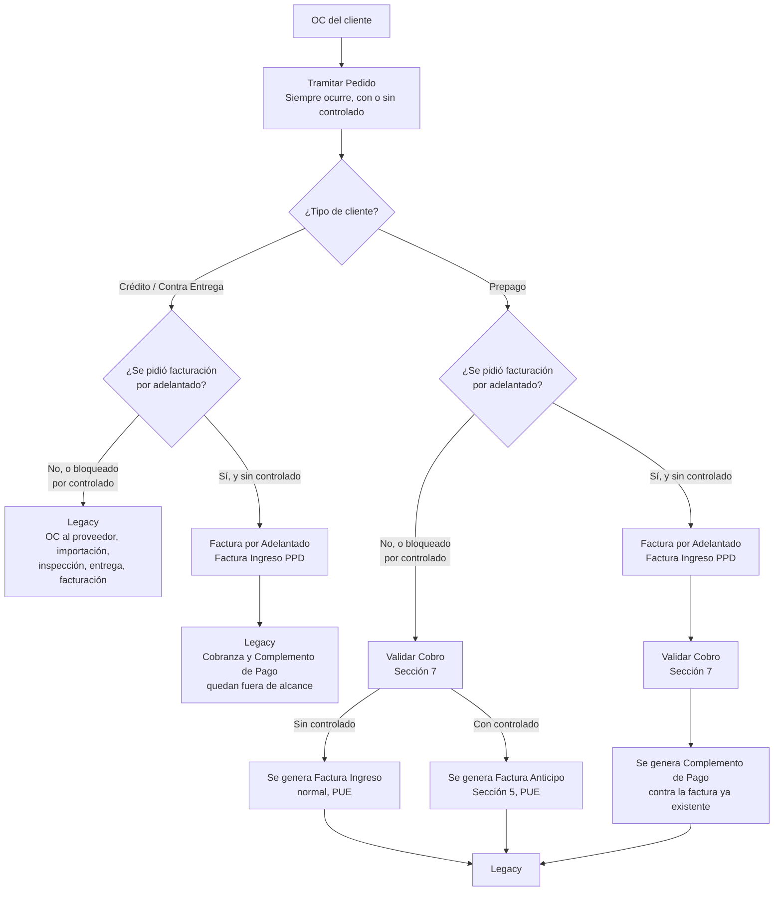

# Guía Técnica — Facturas de Ingreso (CFDI de Ingreso, Anticipo y Complemento de Pago) México

**Alcance:** esta guía cubre exclusivamente la facturación de Ingreso para México (CFDI 4.0), adaptada específicamente a los escenarios y decisiones ya tomadas para la operación de PROQUIFA — no es una guía genérica del SAT. Es la contraparte de la guía de Notas de Crédito (que cubre el CFDI de Egreso); ambas comparten catálogos y principios base, pero cada una documenta su propio flujo.

**Estado de las fuentes:** las reglas duras están fundamentadas en el Anexo 20 (Apéndice 1 para el CFDI de Ingreso, Apéndice 6 para el procedimiento de anticipos, Apéndice sobre Complemento de Pago) o en los catálogos publicados por el SAT. Las decisiones de arquitectura marcadas como "decisión de PROQUIFA" reflejan cómo el equipo decidió aplicar esos mecanismos a esta operación específica.

---

## 0. Glosario rápido

| Término | Qué es |
|---|---|
| **OC** | Orden de Compra — documento que envía el cliente después de recibir la cotización de PROQUIFA |
| **Confirmación de Pedido** | El resultado de tramitar la OC dentro del sistema — existe con o sin factura, es el paso que siempre ocurre |
| **Proforma** | Documento no fiscal que se le entrega al cliente de Prepago para que pague contra él, antes de que exista cualquier factura |
| **Factura por Adelantado** | Pantalla/acción donde se genera la factura por adelantado durante el proceso de tramitación de la Orden de Compra — aplica al favor de "facturación por adelantado" para los 3 tipos de cliente |
| **Validar Cobro** | Pantalla donde se registra el comprobante de pago del cliente de Prepago — su comportamiento cambia según si ya existe una factura previa o no (sección 7) |
| **Cobro** | Objeto que se genera cuando se recibe un comprobante de pago del cliente — es la "materia prima" de dinero disponible que `Validar Cobro` aplica contra Proformas/Facturas |
| **Legacy** | SAP — el sistema anterior de PROQUIFA (in-house, no relacionado con el SAP comercial) — punto de salida universal después de facturar (o de tramitar sin facturar) para los 4 escenarios en alcance; todo lo posterior (OC al proveedor, importación, inspección, entrega) vive ahí |
| **Producto controlado** | Producto sujeto a regulación especial, con tiempos de entrega largos (hasta 6-12 meses) y riesgo real de que la venta no se concrete tal como se cotizó |
| **Prepago normal** | Cliente de Prepago que **no** pidió facturación por adelantado — sigue la secuencia proforma → paga → comprobante → factura |
| **Prepago adelantado** | Cliente de Prepago que **sí** pidió facturación por adelantado — la factura se genera antes de que el cliente pague |
| **Crédito normal** | Cliente de Crédito que **no** pidió facturación por adelantado |
| **Crédito adelantado** | Cliente de Crédito que **sí** pidió facturación por adelantado |
| **Contra Entrega normal** | Cliente de Contra Entrega que **no** pidió facturación por adelantado |
| **Contra Entrega adelantado** | Cliente de Contra Entrega que **sí** pidió facturación por adelantado |

**Nota sobre esta terminología:** "normal" y "adelantado" no son 2 tipos de cliente distintos — son el mismo tipo de cliente (Prepago, Crédito o Contra Entrega), diferenciado únicamente por si pidió o no el favor de facturación por adelantado. Esta guía usa "normal"/"adelantado" solo como atajo para referirse a qué flujo siguió esa venta, no como una categoría de negocio aparte.

---

## 1. Qué son estos documentos

### Factura de Ingreso (CFDI tipo "I")

Es el documento que declara ante el SAT que una venta ocurrió — es el hecho generador original: aquí nace la obligación de IVA sobre esa venta, y aquí se registra el ingreso para efectos de ISR.

Lleva `MetodoPago` (PUE o PPD) y `FormaPago`, que juntos le dicen al SAT si ya se cobró por completo al momento de timbrar (PUE) o si el cobro va a llegar después, en uno o varios eventos (PPD) — esa distinción determina si va a necesitar Complemento de Pago.

### Factura Anticipo (Complemento de Anticipos)

Es una Factura de Ingreso especial, para cuando se recibe dinero de un cliente antes de tener certeza sobre los detalles finales de la venta — no se sabe todavía el producto exacto, la cantidad exacta, o si la venta se va a poder concretar tal como se cotizó.

No declara el producto real — usa una clave genérica de anticipo, porque en este punto solo se está declarando "se recibió este dinero", no "se vendió este producto". Cuando la venta se concreta de verdad, se genera una segunda factura — la Factura Final — que sí declara el producto real y se relaciona hacia la Factura Anticipo para no declarar el mismo ingreso dos veces ante el SAT.

### Complemento de Pago (CFDI tipo "P")

Es el documento que declara que un pago ya ocurrió, contra una factura que se emitió como PPD. Existe como documento aparte (no un campo dentro de la factura) porque una factura PPD puede recibir el pago en varios eventos a lo largo del tiempo — cada Complemento de Pago documenta uno de esos eventos, sin tocar la factura original (que, una vez timbrada, es inmutable).

Es el mismo mecanismo que ya se usa para el consumo de saldo a favor de una Nota de Crédito (ver guía de NC, sección 8-9): cada Complemento de Pago referencia la factura que está saldando, lleva su propio `FormaPago`, y va bajando el "Saldo Insoluto" de esa factura hasta llegar a $0.

---

## 2. Alcance de ProquifaNet 2 — los 6 escenarios

ProquifaNet 2 hoy cubre desde Cotización/OC hasta Confirmación de Pedido — no llega al tramo de OC al proveedor, importación, inspección ni entrega. Eso determina qué se factura en ProquifaNet 2 y qué se va a Legacy.

**No es un corte por tipo de cliente — son 2 condiciones independientes que se cruzan:**

| Tipo de cliente | Con producto controlado | Sin producto controlado |
|---|---|---|
| **Prepago** | Facturación por adelantado **bloqueada** por regla de negocio → sigue la secuencia normal (proforma → paga → comprobante), pero el documento que se timbra es **Factura Anticipo**, no Factura normal | Facturación por adelantado es **opcional** (favor al cliente) — con o sin ella, factura en ProquifaNet 2 |
| **Crédito** | Facturación por adelantado **bloqueada** → Confirmación de Pedido se genera igual, pero sin factura — la OC sigue su curso a Legacy | Facturación por adelantado es **opcional** — si se pide, factura en ProquifaNet 2 (cobranza fuera de alcance); si no, todo el escenario va a Legacy |
| **Contra Entrega** | Facturación por adelantado **bloqueada** → mismo caso que Crédito | Facturación por adelantado es **opcional** — mismo patrón que Crédito |

**Por qué Crédito/Contra Entrega normal (sin factura por adelantado) quedan fuera de alcance:** su factura se genera después de la inspección en almacén, con solo lo que llegó bien — ProquifaNet 2 no llega a ese tramo todavía.

**Por qué la regla de controlados bloquea solo la opción "por adelantado", no la Confirmación de Pedido:** la Confirmación de Pedido se genera siempre, con o sin controlado — lo único que el controlado bloquea es la posibilidad de comprometerse fiscalmente (facturar) antes de tener certeza sobre ese producto.

---

## 3. Diagrama maestro — qué documento se genera en cada escenario

**Disclaimer importante:** este diagrama tiene como único objetivo mostrar **qué documento fiscal se genera en cada escenario** — no describe fielmente el flujo real de pantallas, ni el punto exacto en el que cada documento se genera dentro de ese flujo. Para eso existen los diagramas entregados por el equipo de análisis y las maquetas — esta guía no los reemplaza ni pretende tener ese nivel de detalle de UX/proceso.



**Lectura del diagrama:** hay exactamente 4 rutas en alcance (las que no terminan directo en `Legacy` desde `Tramitar Pedido`), y todas convergen en `Legacy` al final — es el punto de salida universal, sin importar el escenario, porque todo lo que sigue (OC al proveedor, importación, inspección, entrega) está fuera de alcance por igual para los 4.

---

## 4. Los mecanismos de facturación — matriz consolidada

| Escenario                                                                           | Documento que se genera | MetodoPago | ¿Editable? / Por qué ese MetodoPago                                                                                        | ¿Requiere Complemento de Pago?                  |
| ----------------------------------------------------------------------------------- | ----------------------- | ---------- | -------------------------------------------------------------------------------------------------------------------------- | ----------------------------------------------- |
| Prepago normal (sin controlado)                                                     | Factura de Ingreso      | `PUE`      | No — el pago ya se recibió antes de timbrar (la secuencia lo garantiza), así que no hay nada que quede pendiente de cobrar | No                                              |
| Prepago normal (con controlado)                                                     | **Factura Anticipo**    | `PUE`      | No — mismo motivo que la fila anterior; el anticipo ya está cobrado al momento de timbrar                                  | No                                              |
| Prepago adelantado (sin controlado; con controlado no aplica, cae al caso anterior) | Factura de Ingreso      | `PPD`      | No — se timbra antes de que el cliente pague, por definición de "adelantado"; no hay forma de que sea PUE                  | Sí — se genera en `Validar Cobro` (sección 7)   |
| Crédito adelantado (sin controlado; con controlado no aplica, va a Legacy)          | Factura de Ingreso      | `PPD`      | No — mismo motivo: se timbra antes del cobro (que llega según días de crédito)                                             | Sí — pero se genera en Legacy, fuera de alcance |
| Contra Entrega adelantado (sin controlado; con controlado no aplica, va a Legacy)   | Factura de Ingreso      | `PPD`      | No — mismo motivo: se timbra antes del cobro (que llega contra la entrega)                                                 | Sí — mismo caso que Crédito adelantado          |

**El criterio que determina PUE vs. PPD no es el tipo de cliente — es si el pago ya se recibió antes de timbrar o no.** Prepago normal (con o sin controlado) es el único caso donde la secuencia obliga a que el cliente ya pagó y envió comprobante antes de que exista la factura — de ahí que sea el único PUE de los 5. Los otros 4 timbran primero y cobran después, por eso son PPD.

**Excepción a "Prepago normal siempre PUE":** esta tabla asume que la Proforma se cubre solo con Cobro(s) reales. Si en `Validar Cobro` participa una Nota de Crédito con saldo a favor, la factura de Prepago normal **también nace en PPD**, no PUE — ver el detalle completo y el porqué en la sección 7.1.

---

## 5. Datos y catálogos de la Factura de Ingreso

### 5.1 Datos del producto — `ClaveProdServ`, `ClaveUnidad` y `PerfilFiscal`

#### 5.1.1 `ClaveProdServ` y `ClaveUnidad`

Catálogos oficiales del SAT (`c_ClaveProdServ`, con ~55,000 claves; `c_ClaveUnidad`, basado en el estándar internacional UN/ECE). Se cargan como tablas de referencia completas (import del catálogo oficial), no se administran fila por fila a mano. Cada producto de PROQUIFA tiene asignada la clave que le corresponde de cada catálogo.

#### 5.1.2 `PerfilFiscal` — qué es y cómo se construye

Es el mecanismo que traduce la tasa de IVA de un producto (16% general, 0%, o exento) a las claves técnicas que exige el XML del CFDI — sin este mecanismo, no hay forma determinística de saber qué declarar en el nodo `Impuestos` de cada partida.

**Nivel 1 — los 3 catálogos SAT de base (seed data, casi nunca cambian):**

```sql
CREATE TABLE SatImpuesto (
    Code CHAR(3) PRIMARY KEY,        -- '001' ISR, '002' IVA, '003' IEPS
    Description NVARCHAR(50) NOT NULL
);

CREATE TABLE SatTipoFactor (
    Code VARCHAR(10) PRIMARY KEY,    -- 'Tasa', 'Cuota', 'Exento'
    Description NVARCHAR(50) NOT NULL
);

CREATE TABLE SatObjetoImp (
    Code CHAR(2) PRIMARY KEY,        -- '01' No objeto, '02' Sí objeto, '03' Sí objeto y no obligado
                                      -- al desglose, '04' Sí objeto y no causa impuesto
    Description NVARCHAR(100) NOT NULL
);
```

Estas 3 tablas no las ve ni las mantiene el usuario de negocio — son catálogo maestro de sistema, cargado una sola vez, y solo se toca si el SAT deroga o agrega una clave (poco frecuente).

**Nivel 2 — el catálogo `PerfilFiscal` (catálogo de negocio, 3-4 filas, este sí lo administra PROQUIFA):**

```sql
CREATE TABLE PerfilFiscal (
    PerfilFiscalId INT IDENTITY(1,1) PRIMARY KEY,
    Nombre NVARCHAR(100) NOT NULL,            -- 'IVA General 16%', 'IVA Tasa 0%', 'Exento'
    SatImpuestoCode CHAR(3) NOT NULL REFERENCES SatImpuesto(Code),
    SatTipoFactorCode VARCHAR(10) NOT NULL REFERENCES SatTipoFactor(Code),
    SatObjetoImpCode CHAR(2) NOT NULL REFERENCES SatObjetoImp(Code),
    TasaOCuota DECIMAL(6,6) NULL,              -- NULL únicamente si SatTipoFactorCode = 'Exento'
    Fundamento NVARCHAR(200) NULL,             -- referencia legal, ej. 'Art. 2-A LIVA'
    CONSTRAINT CK_TasaOCuota_Exento CHECK (
        (SatTipoFactorCode = 'Exento' AND TasaOCuota IS NULL) OR
        (SatTipoFactorCode <> 'Exento' AND TasaOCuota IS NOT NULL)
    )
);
```

**Filas iniciales del catálogo, ya conocidas para la operación de PROQUIFA:**

| `PerfilFiscalId` | Nombre | `TasaOCuota` | `SatTipoFactorCode` | `SatObjetoImpCode` | Fundamento |
|---|---|---|---|---|---|
| 1 | IVA General 16% | 0.160000 | Tasa | 02 | Art. 1 LIVA |
| 2 | IVA Tasa 0% | 0.000000 | Tasa | 02 | Art. 2-A LIVA |
| 3 | Exento | NULL | Exento | 02 | Art. 9 LIVA |

Una cuarta fila (IEPS) queda pendiente de agregar únicamente si el cliente confirma que algún producto lo requiere — no se crea sin esa confirmación.

**Por qué 3-4 filas son suficientes y no se crea una fila por cada motivo legal:** el número que se timbra es idéntico para todos los productos que caen en "IVA Tasa 0%", sin importar si la razón es que son publicaciones, medicinas de patente, o exportación — la única diferencia es la justificación legal, que es dato informativo (columna `Fundamento`), no algo que cambie el cálculo.

#### 5.1.3 Nivel de configuración — Producto o Familia, con precedencia

Los 3 campos (`ClaveProdServ`, `ClaveUnidad`, `PerfilFiscalId`) pueden configurarse a 2 niveles posibles, con una regla de precedencia si se usan ambos:

```
SI el producto tiene su propio valor capturado (override específico) → se usa ese
SI NO → se hereda el valor configurado a nivel de la Familia/Categoría a la que pertenece
```

Esto permite definir "todos los productos de la Familia X tributan al 16%" una sola vez, y solo capturar una excepción puntual a nivel producto cuando algún artículo específico de esa familia se comporte distinto (como el caso de publicaciones dentro de una familia que normalmente no las tiene).

```
Ninguno de estos 3 campos es editable por el usuario al momento de facturar
— siempre se resuelven por la jerarquía Producto→Familia antes de llegar a la factura.
```

**⚠️ Pregunta pendiente de confirmar con el cliente antes de construir esto:** ¿la captura de `ClaveProdServ`, `ClaveUnidad` y `PerfilFiscalId` se hará a nivel Producto, a nivel Familia, o con la precedencia Producto→Familia descrita arriba (Producto como excepción, Familia como default)? Cada uno de los 3 campos podría incluso tener un nivel distinto (ej. `PerfilFiscalId` a nivel Familia porque suele ser homogéneo dentro de una familia, pero `ClaveProdServ` siempre a nivel Producto porque cada artículo puede tener una clasificación SAT distinta) — no asumir que los 3 comparten el mismo nivel sin confirmarlo.

### 5.2 `UsoCFDI`

**Fuente del dato:** se toma por default del catálogo de clientes (cada cliente tiene un `UsoCFDI` preferido guardado en su ficha), pero **es editable** por el usuario al momento de facturar — el cliente puede pedir un uso distinto para una operación puntual.

**Confirmado — la Factura Anticipo también lleva `UsoCFDI`**, con el mismo mecanismo (dato del cliente, editable) que cualquier otra Factura de Ingreso. No existe una regla especial para el caso de anticipo.

**Regla dura del SAT — validación de compatibilidad:** el `UsoCFDI` declarado debe ser compatible con el `RegimenFiscalReceptor` del cliente; si no lo es, el PAC rechaza el timbrado (error típico: "el RegimenFiscalReceptor no es válido para el UsoCFDI declarado"). El sistema debe validar esta compatibilidad **antes** de intentar timbrar, no dejar que el rechazo del PAC sea la primera señal de error.

**Catálogo de referencia — los valores relevantes para PROQUIFA (venta de productos físicos, B2B):**

| Clave | Descripción | Cuándo aplica |
|---|---|---|
| `G01` | Adquisición de mercancías | El default más probable — PROQUIFA vende productos, no servicios |
| `G02` | Devoluciones, descuentos o bonificaciones | Exclusivo de Notas de Crédito (guía de NC) |
| `G03` | Gastos en general | Comodín, válido para casi cualquier régimen si `G01` no aplica |
| `S01` | Sin efectos fiscales | Receptor con RFC genérico de extranjero (`XEXX010101000`) o régimen `616` (sin obligaciones fiscales) |
| `CP01` | Pagos | Obligatorio en el CFDI "cascarón" de cada Complemento de Pago (sección 7) — no es una opción, es fijo para ese tipo de documento |

### 5.3 Otros campos de cabecera obligatorios

| Campo                                                               | De dónde sale                                                                                                                                                                   | ¿Editable?                                                                                                                |
| ------------------------------------------------------------------- | ------------------------------------------------------------------------------------------------------------------------------------------------------------------------------- | ------------------------------------------------------------------------------------------------------------------------- |
| `RegimenFiscalReceptor` / `DomicilioFiscalReceptor` (código postal) | Ficha del cliente                                                                                                                                                               | No — el usuario no lo captura a mano al facturar                                                                          |
| `LugarExpedicion`                                                   | Domicilio de la `EmpresaEmisora` (ver 5.3.1)                                                                                                                                    | No                                                                                                                        |
| `Exportacion`                                                       | Por default `01` (No aplica) para estos escenarios                                                                                                                              | No se ha visto evidencia de operaciones de exportación dentro de este alcance — si aparece un caso real, se revisa aparte |
| `Confirmacion`                                                      | Campo del catálogo del SAT que existe para casos específicos (por ejemplo, cuando `ClaveProdServ` no se encuentra en el catálogo oficial y se usa la clave genérica `01010101`) | Pendiente verificar si algún escenario de PROQUIFA lo dispara — no se debe asumir que nunca aplica sin confirmarlo        |

#### 5.3.1 `EmpresaEmisora` — quién factura (RFC emisor)

PROQUIFA opera bajo varias razones sociales — cada Factura de Ingreso se timbra con el RFC de una de ellas, nunca con un RFC genérico de la operación. Cada `EmpresaEmisora` tiene su propio RFC, `RegimenFiscal` (emisor), domicilio (`LugarExpedicion`), y Certificado de Sello Digital para timbrar.

```sql
CREATE TABLE EmpresaEmisora (
    EmpresaEmisoraId INT IDENTITY(1,1) PRIMARY KEY,
    RazonSocial NVARCHAR(200) NOT NULL,
    Rfc VARCHAR(13) NOT NULL,
    RegimenFiscalEmisorCode VARCHAR(3) NOT NULL,
    LugarExpedicion CHAR(5) NOT NULL      -- código postal
);
```

**Importante — esto es un eje independiente de `PerfilFiscal` (sección 5.1), no hay que confundirlos:** que un producto tribute al 0% (publicaciones, por ejemplo) es una propiedad del **producto** (`PerfilFiscal`), no de qué `EmpresaEmisora` lo facture. No se debe asumir "existe una empresa que solo factura al 0%" como regla del sistema — la tasa siempre se resuelve por producto/familia, sin importar cuál `EmpresaEmisora` emite el documento. Son 2 decisiones que pueden coincidir en la práctica de PROQUIFA por estrategia comercial, pero el sistema no debe acoplarlas.

**⚠️ Pregunta pendiente, no resuelta en esta guía:** ¿cómo determina el sistema qué `EmpresaEmisora` factura un Pedido dado? Opciones típicas — asignación fija por cliente, por familia de producto, o selección manual del usuario al momento de facturar. Ninguna de las 4 rutas en alcance (sección 3) define hoy esta regla; se necesita antes de poder timbrar cualquier Factura de Ingreso real.

### 5.4 Totales, decimales y redondeo

Reglas duras del Anexo 20 que el sistema debe respetar en cualquier Factura de Ingreso:

- **No se permiten valores negativos** en ningún campo del CFDI 4.0 — ni importes, ni cantidades, ni descuentos.
- `ValorUnitario` y `TipoCambio` admiten hasta 6 decimales.
- `Importe`, `Subtotal` y `Total` deben respetar los decimales propios de la moneda declarada (`c_Moneda`) — normalmente 2, tanto para MXN como para USD.
- El PAC valida que `Cantidad × ValorUnitario ≈ Importe`, que `Subtotal = SUM(Importe)` y que `Total = Subtotal + Impuestos`, con una tolerancia de redondeo mínima — si no cuadra, rechaza el timbrado.

Estas reglas aplican a la Factura en sí — no involucran ninguna conversión de moneda, porque la Factura siempre se timbra en una sola moneda fija (sección 8). La conversión de moneda entre un Cobro y la Factura/Proforma que cubre se define en la sección 7.5, regla 6.

### 5.5 Pendiente — número de pedimento (pregunta para el cliente, no resuelta aquí)

El Art. 29-A fracción VIII del CFF exige incluir el número y fecha del pedimento en la venta de primera mano de mercancía importada — que es exactamente lo que hace PROQUIFA (importan y venden). El campo correspondiente (`InformacionAduanera > NumeroPedimento`, a nivel de Concepto) requiere un dato que, en los escenarios en alcance, **no existe todavía al momento de facturar** — la factura se genera antes de que exista la OC al proveedor, y el pedimento solo existe después de la importación.

**No se resuelve en esta guía — se solicitan al cliente 2 cosas antes de definir el mecanismo:**
1. Ejemplos reales de **Facturas por Adelantado** ya generadas hoy en Legacy (si existen), para ver cómo se está resolviendo (o no) el campo de pedimento actualmente.
2. Ejemplos reales de **Facturas de Prepago** normales de Legacy, para el mismo propósito.

Con esos ejemplos se puede determinar si este es un problema ya resuelto de alguna forma en la práctica actual, o si es un hueco de cumplimiento nuevo que la facturación por adelantado introduce.

### 5.6 Referencia técnica — campos de la Factura de Ingreso, campo por campo

Tabla consolidada de todo lo definido en las secciones 4-5, en un solo lugar, para construir una Factura de Ingreso de principio a fin sin tener que cruzar varias secciones:

| Campo (nodo)                                        | Valor                                                                                                                                                                                     | Editable por el usuario?                                                        |
| --------------------------------------------------- | ----------------------------------------------------------------------------------------------------------------------------------------------------------------------------------------- | ------------------------------------------------------------------------------- |
| `TipoDeComprobante`                                 | `I`                                                                                                                                                                                       | No — fijo                                                                       |
| `Serie` / `Folio`                                   | Pendiente de definir (sección 3, foliador)                                                                                                                                                | —                                                                               |
| `MetodoPago`                                        | `PUE` o `PPD` según el escenario (sección 4) — `PPD` también si participa una NC (sección 7.1)                                                                                            | No — derivado                                                                   |
| `FormaPago`                                         | Forma real, `99` (si PPD), o `23` (si NC participa en un caso PUE que por eso se vuelve PPD)                                                                                              | No — derivado, salvo la forma real que sí captura el usuario en `Validar Cobro` |
| `Moneda` / `TipoCambio`                             | Hereda de la Proforma si existe; si no, TC del día (sección 8)                                                                                                                            | No — heredado o derivado                                                        |
| `LugarExpedicion`                                   | De la `EmpresaEmisora` (sección 5.3.1)                                                                                                                                                    | No                                                                              |
| `RegimenFiscalReceptor` / `DomicilioFiscalReceptor` | Ficha del cliente                                                                                                                                                                         | No                                                                              |
| `UsoCFDI`                                           | Ficha del cliente (default)                                                                                                                                                               | Sí — el usuario puede cambiarlo (sección 5.2)                                   |
| `Exportacion`                                       | `01` por default                                                                                                                                                                          | No, salvo que aparezca un caso real de exportación                              |
| `Confirmacion`                                      | Pendiente de confirmar si algún escenario lo dispara (sección 5.3)                                                                                                                        | —                                                                               |
| `CfdiRelacionados`                                  | No aplica a una Factura de Ingreso normal — solo aparece si consume saldo a favor de una NC (`TipoRelacion=02`, guía de NC) o si aplica un anticipo (`TipoRelacion=07`, fuera de alcance) | No                                                                              |
| `Conceptos > ClaveProdServ` / `ClaveUnidad`         | Del catálogo de productos, con precedencia Producto→Familia (sección 5.1)                                                                                                                 | No                                                                              |
| `Conceptos > Impuestos`                             | Del `PerfilFiscal` del producto (sección 5.1.2)                                                                                                                                           | No                                                                              |
| `Total` / `Subtotal`                                | Calculados de las partidas reales — nunca el valor de lo cobrado (sección 5.4)                                                                                                            | No                                                                              |

---

## 6. Factura Anticipo — detalle técnico

Se genera cuando una OC de Prepago trae al menos un producto controlado. Sigue el procedimiento del Apéndice 6 del Anexo 20:

| Campo                       | Valor                                                                                                                                                                    |
| --------------------------- | ------------------------------------------------------------------------------------------------------------------------------------------------------------------------ |
| `TipoDeComprobante`         | `I` — Ingreso                                                                                                                                                            |
| `MetodoPago`                | `PUE` — el dinero ya está en la cuenta al momento de timbrar                                                                                                             |
| `FormaPago`                 | La forma real en que se recibió el pago                                                                                                                                  |
| `Moneda` / `TipoCambio`     | Hereda de la Proforma (sección 8) — la secuencia de Prepago con controlado siempre pasa por Proforma, no es un caso especial                                             |
| `Conceptos > ClaveProdServ` | `84111506` — Servicios de facturación                                                                                                                                    |
| `Conceptos > ClaveUnidad`   | `ACT` — Actividad                                                                                                                                                        |
| `Conceptos > Cantidad`      | `1`                                                                                                                                                                      |
| `Conceptos > Descripcion`   | `"Anticipo del bien o servicio"` — no se menciona el producto controlado real, porque a este nivel no hay certeza de que la venta se vaya a concretar tal como se cotizó |
| `Conceptos > ValorUnitario` | El monto recibido como anticipo, antes de impuestos                                                                                                                      |

**Fuera de alcance — la Factura Final.** Cuando el producto controlado finalmente se libera/autoriza y la venta se concreta, se debe emitir una Factura Final por el valor total real, relacionada hacia la Factura Anticipo vía `TipoRelacion=07` (CFDI por aplicación de anticipo). Esa Factura Final depende de que el controlado ya haya pasado por todo el proceso regulatorio y de importación — el mismo tramo que ya está fuera de alcance de ProquifaNet 2. Se genera en Legacy.

---

## 7. Pantalla "Validar Cobro"

### 7.1 Comportamiento dual — según si ya existe una factura previa, y si participa una NC

No es una sola acción fija — se comporta distinto según 2 condiciones: si ya existe una factura previa para ese pedido, y si una Nota de Crédito participa en el reparto (sección 7.4).

```
SI NO existe una factura previa para este pedido (Prepago sin adelantada)
Y la Proforma se cubre SOLO con Cobro(s), sin ninguna NC:
    → Validar el comprobante de pago DISPARA la creación de la factura
    → Factura normal (PUE) si no hay controlado
    → Factura Anticipo (PUE) si sí hay controlado
    → El pago y la factura nacen en la misma acción
    → Si participa más de 1 Cobro, ver la regla de "monto mayor" más abajo

SI NO existe una factura previa para este pedido (Prepago sin adelantada)
Y la Proforma se cubre con al menos 1 NC (total o parcial):
    → La factura nace directamente en PPD, FormaPago=99
    → Se generan de inmediato el/los Complemento(s) de Pago correspondientes
      (uno con FormaPago=23 por la porción de NC, otro con la forma real
      si además hay Cobro cubriendo el resto) — mismo mecanismo que el
      caso "factura ya existía", no hay una tercera ruta distinta

SI YA existe una factura PPD previa (Prepago con adelantada):
    → Validar el comprobante de pago DISPARA un Complemento de Pago
      contra esa factura que ya existía
    → La factura no se toca — solo se agrega el evento de pago
    → Aplica sin importar si el Complemento usa Cobro, NC, o ambos
```

**Por qué la NC cambia el `MetodoPago` aunque la factura sea nueva:** una Novación (`FormaPago=23`) nunca puede combinarse con otra forma de pago dentro del `FormaPago` único de una factura PUE — esa mezcla solo es válida a través de Complementos de Pago independientes contra una factura PPD (mismo principio ya establecido en la guía de NC, sección 9). Por eso, en cuanto una NC participa, la factura converge al mismo comportamiento que "Prepago con adelantada", aunque nazca en ese mismo instante.

**Validación que el sistema debe forzar:** antes de ejecutar la acción de `Validar Cobro`, el sistema debe resolver primero el algoritmo de reparto (sección 7.4) para saber si alguna NC participó — esa es la segunda condición (junto con "¿ya existe factura?") que determina cuál de las 3 rutas ejecutar, nunca una elección manual del usuario.

### 7.1.1 Regla de "monto mayor" — cuando 2 o más Cobros reales cubren una misma Proforma en PUE

Cuando una Proforma se cubre con varios Cobros y **ninguno de ellos es NC** (todos son formas de pago reales), la factura sigue siendo PUE — pero solo admite **una** `FormaPago`, así que se aplica la misma regla ya usada en la guía de NC: se registra la forma de pago del Cobro que aportó el **monto mayor** a esa Proforma.

```
Proforma $1,000
Cobro A: aportó $600 a esta Proforma, Transferencia
Cobro B: aportó $400 a esta Proforma, Tarjeta

→ Factura PUE, FormaPago = 03 (Transferencia) — porque $600 > $400
```

**Importante — la comparación es sobre el monto asignado a ESA Proforma, no sobre el monto total del Cobro.** Si un Cobro de $2,000 solo aportó $300 a esta Proforma (porque el resto se repartió a otra Proforma en la misma operación de `Validar Cobro`), son esos $300 los que entran a la comparación de "monto mayor" — nunca los $2,000 completos del Cobro.

**Esta regla deja de aplicar en cuanto una NC participa** — ver la rama correspondiente arriba, donde el mecanismo cambia por completo a PPD+Complementos de Pago.

### 7.2 Selección N:M — varios Cobros y NC contra varias Proformas/Facturas a la vez

`Validar Cobro` no está limitado a 1 Cobro cubriendo 1 Proforma/Factura. El usuario puede seleccionar varios **Cobros** y varias **Notas de Crédito con saldo a favor disponible** del mismo cliente, y aplicarlos contra varias Proformas/Facturas seleccionadas en la misma operación.

**Regla dura de la operación:** la suma de los fondos seleccionados (Cobros + NC) debe ser **igual o mayor** a la suma de las Proformas/Facturas seleccionadas — nunca menor. No está permitido dejar una Proforma/Factura parcialmente pagada; si los fondos no alcanzan para cubrir alguna por completo, la operación se bloquea hasta que se ajuste la selección.

```
SUM(Cobros seleccionados + NC seleccionadas) >= SUM(Proformas/Facturas seleccionadas)
Ninguna Proforma/Factura puede quedar parcialmente cubierta al terminar el reparto
```

### 7.2.1 Excepción — `MontoAplazable` (regla de negocio, mecanismo aún no resuelto)

**Existe una regla de negocio que modifica la comparación anterior:** se permite cerrar la operación aunque falte un monto pequeño por cubrir, sin condonarlo — el faltante queda pendiente de cobro, no se perdona.

```
SUM(Cobros seleccionados + NC seleccionadas) >= SUM(Proformas/Facturas seleccionadas) − MontoAplazable
```

Parámetros ya definidos:
- `MontoAplazable` es configurable, valor por default $100 MXN.
- Se evalúa **por operación completa** de `Validar Cobro`, no por Proforma/Factura individual.
- No existe (por ahora) un tope acumulado por cliente.
- Aplica tanto al crear la factura en `Validar Cobro` como al saldarla después vía Complemento de Pago — no hay otra pantalla de cobranza en ProquifaNet 2 donde pudiera aplicar.
- Si en el futuro se reciben tipos de cambio oficiales por moneda, el umbral se ajusta a esas cifras; mientras tanto, se usa el equivalente de $100 MXN convertido a la moneda de la operación.

**Camino de implementación elegido:** al aplicar esta excepción, la factura se marca como cobrada (o el estatus que se defina) para permitir tramitar el pedido — desaparece de `Validar Cobro`, y el monto faltante se traslada a un auxiliar contable (CROE) para su cobro posterior fuera de este flujo.

**⚠️ El mecanismo para resolver esto de forma consistente todavía no está definido — esto es una decisión pendiente, no una solución cerrada.** Al marcar la factura como cobrada y hacerla desaparecer de `Validar Cobro`, el sistema pierde el único lugar donde ese saldo pendiente podría generar su Complemento de Pago cuando el cliente finalmente lo cubra — hoy no existe otra pantalla de cobranza en ProquifaNet 2 a la que ese saldo pueda "reaparecer". Ante el SAT, además, la factura sigue siendo PPD con saldo insoluto real sin importar el estatus interno que se le asigne — si nunca se genera su Complemento de Pago correspondiente, queda abierta ante la autoridad de forma indefinida aunque el sistema la muestre como resuelta. Sumado a que la regla se evalúa por operación (no por documento) y sin tope acumulado por cliente, existe riesgo de que se convierta en una línea de crédito informal sin control. Estos puntos quedan pendientes de resolver antes de construir esta funcionalidad.

### 7.3 Fondos disponibles del cliente — 2 niveles, con prioridad fija

El usuario elige qué incluir en la operación, nunca cómo se reparte — eso lo resuelve el algoritmo (sección 7.4). Los fondos disponibles tienen 2 niveles con **prioridad fija entre ellos**:

| Nivel | Qué incluye | Prioridad |
|---|---|---|
| 1 — Notas de Crédito | Saldo a favor disponible de NC del cliente (`TotalDisponibleReal > 0`, ver guía de NC sección 8) | Se consume **primero**, completo, antes de tocar el nivel 2 |
| 2 — Cobros | Comprobantes de pago del cliente, cada uno con su `TotalDisponible` propio (sección 7.6) — incluye tanto Cobros sin usar como Cobros con `TotalDisponible` parcial de operaciones anteriores | Se consume después, sin distinguir si el `TotalDisponible` de ese Cobro es el original completo o un remanente — todos al mismo nivel |

**Dentro de cada nivel, el orden es por antigüedad** (la NC o el Cobro más antiguo se consume primero). El remanente de un Cobro anterior no tiene prioridad sobre un Cobro fresco — compite por su propia fecha, igual que cualquier otro Cobro.

**Nota de diseño para la maqueta actual:** hoy el mockup de `Validar Cobro` muestra un selector de NC dentro de cada fila de Proforma/Factura (asignación manual por el usuario). Esto ya no es consistente con el algoritmo FIFO — si el sistema decide el reparto, el usuario no debe elegir manualmente qué NC va a qué fila. Las NC deberían vivir como una lista seleccionable en el mismo panel donde hoy están los Cobros, y la columna de NC en el panel de Proformas/Facturas pasa a ser solo informativa (muestra el resultado del algoritmo, no un selector).

### 7.4 El algoritmo de reparto — cascada FIFO en 2 niveles

```
1. Ordenar las Proformas/Facturas seleccionadas: más antigua primero
2. Ordenar los fondos disponibles en 2 listas separadas, cada una por antigüedad
   (la moneda NO influye en este orden — el orden es siempre solo por fecha):
   Nivel 1: Notas de Crédito seleccionadas
   Nivel 2: Cobros seleccionados (incluye remanentes de Cobros anteriores)
3. Recorrer las Proformas/Facturas en orden; para cada una, ir consumiendo
   fondos del Nivel 1 completo antes de tocar el Nivel 2, hasta cubrir
   su Saldo Pendiente por completo:

   - Si el fondo actual está en una moneda distinta a la Proforma/Factura actual,
     se convierte el TotalDisponible del fondo a la moneda de la Proforma/Factura
     usando el TipoCambio del fondo (nunca el de la Proforma/Factura — sección 8),
     ANTES de comparar cuánto cubre. Esta conversión es la misma que después
     se declara como EquivalenciaDR al empaquetar (sección 7.5, bloque "Conversión de moneda") — no es un
     cálculo aparte, se reutiliza.
   - Si el fondo actual (ya convertido, si aplica) alcanza para cubrir toda
     la Proforma/Factura actual:
       → se cubre completa, el fondo sigue con lo que le sobró, avanza a la siguiente
   - Si el fondo actual NO alcanza:
       → se agota por completo sobre esa Proforma/Factura, se pasa al siguiente fondo
         (dentro del mismo nivel, o al Nivel 2 si el Nivel 1 ya se agotó)

4. Al terminar de cubrir todas las Proformas/Facturas seleccionadas, si queda
   remanente en el último Cobro usado → ese remanente es el saldo a favor
   de ESE Cobro (sección 7.6), expresado en la moneda propia del Cobro (no en
   la moneda de la última Proforma/Factura que cubrió). Las NC no generan
   remanente nuevo — si sobra saldo de una NC, simplemente sigue disponible
   en su propio TotalDisponibleReal.
```

**Ejemplo verificado contra un mockup real (Proforma $1,000, NC-12345 con $350 disponibles, Cobro con $1,000 disponibles):**

```
Nivel 1 (NC) se consume primero: NC-12345 aporta $350 completos → NC se agota
Nivel 2 (Cobro) cubre el resto: $650 de los $1,000 del Cobro → Proforma queda cubierta ($1,000)
Remanente del Cobro: $1,000 − $650 = $350 → se convierte en saldo a favor de ese Cobro
```

### 7.5 Empaquetado en Complementos de Pago

#### 7.5.0 La estructura base — el "cascarón" del Complemento de Pago

Antes de la lógica de negocio (reglas 1-6 abajo), un Complemento de Pago es, en su nivel más básico, un CFDI de tipo `P` con una estructura fija que no cambia entre PROQUIFA y cualquier otro contribuyente — esto es lo que exige el Anexo 20 para cualquier Complemento de Pago, independientemente del caso de uso:

| Campo del comprobante contenedor | Valor |
|---|---|
| `TipoDeComprobante` | `P` — Pago |
| `Moneda` | `XXX` — valor fijo reservado del catálogo `c_Moneda` para el comprobante contenedor (no es la moneda de ningún pago en particular, esa vive dentro de cada nodo `Pago`) |
| `SubTotal` / `Total` | `0` — el cascarón no declara ningún importe propio |
| `UsoCFDI` | `CP01` — fijo (sección 5.2) |
| `Conceptos` (partida única, genérica) | `ClaveProdServ=84111506`, `ClaveUnidad=ACT`, `Cantidad=1`, `ValorUnitario=0`, `Importe=0` |

**Dentro de ese cascarón vive el nodo `Pagos`, con uno o más nodos `Pago` — ahí es donde sí hay datos reales** (`FormaPago`, `FechaPago`, `MonedaP`, `Monto`), y dentro de cada `Pago`, uno o más `DoctoRelacionado` con estos atributos (más allá de `ImpPagado`/`EquivalenciaDR` ya definidos más abajo en esta misma sección):

| Atributo de `DoctoRelacionado` | Qué es |
|---|---|
| `IdDocumento` | UUID de la Factura/Proforma-ya-facturada que se está pagando |
| `Serie` / `Folio` | De esa Factura |
| `MonedaDR` | Moneda de esa Factura (puede diferir de `MonedaP`, ver bloque "Conversión de moneda" más abajo) |
| `NumParcialidad` | Número consecutivo de este pago contra esa Factura (1, 2, 3...) |
| `ImpSaldoAnt` | Saldo Insoluto de la Factura antes de este pago |
| `ImpSaldoInsoluto` | Saldo Insoluto después de este pago (`ImpSaldoAnt − ImpPagado`) |
| `ObjetoImpDR` | Heredado del `ObjetoImp` de la Factura original |

El resultado del algoritmo (sección 7.4) — qué Cobro o NC cubrió qué Proforma/Factura, y cuánto — se traduce al contenido de `Pagos` con 6 reglas de negocio:

1. **1 nodo `Pago` por cada Cobro usado**, con su propia `FormaPago`, `FechaPago` y `Monto`.
2. **1 nodo `DoctoRelacionado` dentro de ese `Pago`, por cada Proforma/Factura que ese Cobro haya cubierto**, con el `ImpPagado` correspondiente — un mismo `Pago` puede tener varios `DoctoRelacionado` si ese Cobro se repartió entre varias Facturas.
3. **Las NC sí tienen su propio nodo `Pago`, igual que un Cobro** — la diferencia es su `FormaPago`, que es `23` (Novación) en vez del código real de pago (mismo mecanismo de la guía de NC, sección 8). Lo que **no** genera una NC es un Complemento de Pago aparte por default — su nodo `Pago` se incluye dentro del mismo documento que ya se esté armando para el mes que le corresponde (ver regla 5).
4. **Corte obligatorio por mes:** si los Cobros seleccionados tienen `FechaPago` en meses distintos, se genera **1 Complemento de Pago por cada mes representado** — nunca uno solo que mezcle meses (regla 2.7.1.32 RMF).
5. **`FechaPago` de la Novación (NC) siempre es la fecha de la operación de `Validar Cobro` (hoy), nunca la fecha de creación original de la NC.** No es un dato que el SAT documente explícitamente para este caso — es la interpretación más consistente con lo que la Novación representa (el acto de aplicar el crédito ocurre hoy, no cuando la NC se timbró), y queda pendiente de validar formalmente con el contador, igual que el resto de este mecanismo híbrido. Como consecuencia práctica, la NC **siempre** cae en el Complemento de Pago del mes actual: se une al que ya exista para ese mes si hay Cobros del mismo mes en la operación, o genera su propio Complemento (solo con su nodo `Pago`) si todos los Cobros de la operación son de meses anteriores.
6. **Conversión de moneda entre un `DoctoRelacionado` y el `Pago` que lo cubre** — ver definición completa abajo.

**El mecanismo del SAT está diseñado para esto — no se generan Complementos separados solo por tener formas de pago distintas.** Varios Cobros con formas de pago distintas, del mismo mes, van en el **mismo** Complemento de Pago, cada uno en su propio nodo `Pago`.

**Pregunta pendiente de confirmar con el cliente:** el cliente había pedido originalmente "1 Complemento de Pago por cada forma de pago distinta" — es decir, documentos separados. Lo que se documentó arriba (1 solo Complemento con varios nodos `Pago`, uno por forma de pago) es el mecanismo que el propio SAT recomienda para consolidar varios pagos de un mismo periodo — cumple el mismo objetivo de trazabilidad por forma de pago (cada una queda en su propio nodo, identificable) con menos documentos, y sin generar Complementos duplicados o redundantes que no aportan nada distinto ante el SAT. **Se necesita que el cliente confirme si este mecanismo (1 Complemento, varios nodos `Pago`) satisface su petición original, o si tienen una razón de negocio específica para requerir Complementos completamente separados por forma de pago** (por ejemplo, alguna necesidad de conciliación bancaria o de reportería que no hayamos contemplado).

#### Conversión de moneda entre un Cobro y la Proforma/Factura que cubre (`EquivalenciaDR`)

Cuando la moneda del Cobro (`MonedaP`) es distinta a la moneda de la Proforma/Factura que cubre (`MonedaDR`), cada nodo `DoctoRelacionado` del Complemento de Pago declara un campo `EquivalenciaDR` — el tipo de cambio del Cobro respecto a la moneda de esa Factura (sección 8: el `TipoCambio` que gobierna esta conversión es el del Cobro, no el de la Factura). Con ese factor, el importe que se aplica a cada Factura se calcula así:

```
ImpPagado (en la moneda de la Factura) = MontoAsignadoDelCobro (en la moneda del Cobro) × EquivalenciaDR
```

**Regla de redondeo:** `ImpPagado` se redondea a los decimales de la moneda de la Factura (2 para MXN/USD), con redondeo estándar (mitad hacia arriba), aplicado de la misma forma en todos los cálculos del sistema — nunca un criterio distinto entre una conversión y otra.

**Regla de cierre cuando un mismo Cobro se reparte entre varias Facturas (sección 7.4):** el redondeo se calcula línea por línea, un `DoctoRelacionado` a la vez. El sistema valida que la suma de todos los `ImpPagado` ya redondeados sea igual al monto total convertido del Cobro; si la suma de redondeos individuales deja un residuo de centavos (por acumulación), ese residuo se ajusta en el **último** `DoctoRelacionado` del reparto — nunca se deja como diferencia suelta, porque ninguna Factura puede quedar con saldo pendiente residual (regla de cobertura completa, sección 7.2).

**Ejemplo:**

```
Cobro de $1,000 USD, EquivalenciaDR=18.0537, se reparte entre 3 Facturas de $6,018.23 MXN cada una
(el total exacto es $18,054.70 MXN = $1,000 × 18.0537)

DoctoRelacionado 1: ImpPagado = $6,018.23 (redondeado)
DoctoRelacionado 2: ImpPagado = $6,018.23 (redondeado)
DoctoRelacionado 3: ImpPagado = $6,018.24 (ajustado en el último, para que la suma
                                            cierre exacto en $18,054.70)
```

#### Ejemplo 1 — 1 NC + 1 Cobro, mismo mes, cubriendo 1 sola Factura

Retomando el ejemplo de la sección 7.4: Proforma $1,000, NC-12345 con $350 disponibles, Cobro con $1,000 disponibles (Transferencia), ambos aplicados el mismo mes.

```
Reparto que ya calculó el algoritmo:
   NC-12345 aporta:  $350  (se agota)
   Cobro aporta:     $650  (de sus $1,000 — le quedan $350 disponibles para el futuro)

Se genera 1 Complemento de Pago (mismo mes, mismo cliente):

   Pago 1: FormaPago=23 (Novación), Monto=$350
       └── DoctoRelacionado → Factura, ImpPagado=$350

   Pago 2: FormaPago=03 (Transferencia), Monto=$650
       └── DoctoRelacionado → Factura, ImpPagado=$650

   Suma de ambos Pago = $1,000 = Total de la Factura → Saldo Insoluto = $0
```

Un solo documento, 2 nodos `Pago`, cada uno con 1 sola Factura relacionada.

#### Ejemplo 2 — 2 Cobros de meses distintos, cubriendo 2 Facturas (corte por mes + reparto cruzado)

Factura A ($700, más antigua) y Factura B ($300), cubiertas por Cobro 1 ($600, pagado 28-nov) y Cobro 2 ($400, pagado 02-dic) — el mismo caso de la sección 7.4, ahora empaquetado.

```
Reparto que ya calculó el algoritmo (FIFO — Factura A primero, Cobro 1 primero):
   Factura A ($700): Cobro 1 aporta $600 (se agota) + Cobro 2 aporta $100
   Factura B ($300): Cobro 2 aporta los $300 restantes (se agota, sin remanente)

Como Cobro 1 (noviembre) y Cobro 2 (diciembre) son de meses distintos,
se generan 2 Complementos de Pago — NUNCA uno solo:

   Complemento de Pago #1 (Noviembre):
      Pago 1: FormaPago=[la de Cobro 1], Monto=$600
          └── DoctoRelacionado → Factura A, ImpPagado=$600
                (Factura A queda con Saldo Insoluto=$100 al cierre de ESTE Complemento)

   Complemento de Pago #2 (Diciembre):
      Pago 1: FormaPago=[la de Cobro 2], Monto=$400
          ├── DoctoRelacionado → Factura A, ImpPagado=$100 (Saldo Insoluto de A llega a $0)
          └── DoctoRelacionado → Factura B, ImpPagado=$300 (Saldo Insoluto de B llega a $0)
```

Este ejemplo muestra las 2 reglas que suelen generar dudas al implementarlo: **un solo `Pago` puede repartirse entre varias Facturas** (Pago 1 del Complemento de diciembre cubre A y B a la vez), y **una misma Factura puede aparecer en más de un Complemento de Pago** a lo largo del tiempo, hasta llegar a Saldo Insoluto $0 (Factura A aparece en ambos).

### 7.6 Saldo disponible de un Cobro — mismo patrón que las Notas de Crédito, presente desde su creación

Un Cobro nace con los mismos 3 campos que ya usamos en `Factura` y en `NotaCredito` — no se "generan" después, existen desde el momento en que el Cobro se crea:

| Campo | Qué es |
|---|---|
| `TotalOriginal` | El monto del comprobante de pago recibido — fijo desde que el Cobro se crea |
| `TotalAplicado` | Acumulador — cuánto de ese monto ya se consumió en Proformas/Facturas, en esta operación de `Validar Cobro` o en operaciones futuras |
| `TotalDisponible` | `TotalOriginal − TotalAplicado` — cuánto queda disponible hoy |

Un Cobro recién creado tiene `TotalAplicado=$0` y `TotalDisponible=TotalOriginal` — al usarse (total o parcialmente), `TotalAplicado` sube y `TotalDisponible` baja, exactamente igual que cualquier otro objeto de esta guía con este patrón. No hay un momento distinto en el que "se convierte" en saldo disponible — siempre lo fue.

**Única diferencia real frente al mismo patrón en las NC:** en la NC estos 3 campos son **condicionales** — solo existen cuando `FormaPago=23` (Novación), porque una NC de Condonación o devolución de dinero no tiene saldo que rastrear (guía de NC, sección 8). En un Cobro son **incondicionales** — todo Cobro los tiene desde que nace, porque el monto de un comprobante de pago siempre es, por definición, dinero disponible; no depende de ninguna decisión de negocio previa.

Cuando `TotalDisponible` de un Cobro no llega a $0 al terminar una operación de `Validar Cobro`, ese remanente entra, en operaciones futuras, al Nivel 2 del pool de fondos (sección 7.3) — compite por antigüedad con los demás Cobros, sin prioridad especial.

### 7.7 La relación con Notas de Crédito — decisión: nunca se declara en la factura

**Decisión de PROQUIFA:** cuando una Proforma/Factura se cubre (total o parcialmente) con saldo a favor de una NC, esa relación **nunca** se declara como `CfdiRelacionados > TipoRelacion=02` en la factura misma — se documenta únicamente a través del Complemento de Pago (`FormaPago=23`) y del control interno (`ConsumoSaldoAFavor`, guía de NC sección 8).

**Por qué, aunque el Apéndice 5 documente esa relación como posible:** declarar `TipoRelacion=02` solo es técnicamente posible cuando la factura **nace después** de saber que una NC específica la va a cubrir (caso Prepago normal, donde la factura se genera en el mismo momento que `Validar Cobro`). En Prepago adelantado, la factura ya está timbrada (es inmutable) antes de que exista la oportunidad de aplicar una NC — ahí es estructuralmente imposible declararla, siempre, sin excepción. Mantener 2 comportamientos distintos según el escenario (a veces se declara, a veces no) agrega complejidad de desarrollo sin un beneficio real — se unifica a un solo camino: la trazabilidad NC↔Factura vive siempre en el control interno, nunca en el XML de la factura.

**Validar con el contador:** dado que este mecanismo combina piezas oficiales del SAT de una forma que el Apéndice 5 no documenta literalmente (igual que el resto del mecanismo híbrido PPD+Complemento de Pago ya señalado en la guía de NC), esta decisión de nunca declarar la relación conviene confirmarla formalmente antes de construirla.

### 7.8 Catálogo de estatus de Factura (propuesta) — independiente del estatus del SAT

**Propuesta, pendiente de confirmar** — mismo patrón y estilo que el catálogo `catCobroEstatus` ya definido para el objeto Cobro, aplicado a la Factura de Ingreso:

```sql
INSERT INTO dbo.catFacturaEstatus (Clave, Descripcion, Orden) VALUES
    ('PENDIENTE_COBRO',        'Factura PPD recién timbrada, sin ningún Complemento de Pago aplicado',          1),
    ('PARCIALMENTE_COBRADA',   'Factura PPD con al menos 1 Complemento de Pago aplicado, Saldo Insoluto > 0',   2),
    ('COBRADA',                'Saldo Insoluto en $0 — PUE de nacimiento, PPD ya saldada, o Anticipo recibido', 3),
    ('CANCELACION_SOLICITADA', 'Solicitud de cancelación enviada al SAT/PAC, pendiente de confirmar resultado', 4),
    ('CANCELADA',              'Cancelación confirmada — actualizado manualmente tras verificar en el SAT/PAC', 5);
```

**`CON_INCONSISTENCIA` no aplica a este catálogo — es un estatus de `Cobro` (`catCobroEstatus`), no de `Factura`.** El Cobro es el que se marca con inconsistencia; la Factura no necesita ese valor.

**Nota de diseño, para que se decida con conocimiento de causa:** este catálogo mezcla en un solo campo el estatus de cobranza (interno, que sí controla el sistema) con `CANCELADA`/`CANCELACION_SOLICITADA` (un evento en parte externo al SAT, según ya se resolvió en la guía de NC — sección 13, donde se separó en 2 campos independientes precisamente para no perder el dato de "qué tan cobrada estaba" una NC al momento de cancelarse). Aquí se propone en un solo catálogo para mantener el mismo estilo que `catCobroEstatus`; si se prefiere no perder esa misma información en la Factura, la alternativa es replicar el modelo de 2 campos de la guía de NC. Queda a decisión de PROQUIFA cuál estilo mantener — no se asume ninguno de los 2 como definitivo.

**No hace falta un estatus adicional para cuando una NC cubre la Factura.** Sea que se pague con Cobro, con NC, o con ambos, la transición es la misma (`PENDIENTE_COBRO` → `PARCIALMENTE_COBRADA` → `COBRADA`) — el **cómo** ya queda documentado aparte, en los nodos `Pago` del Complemento de Pago y en `ConsumoSaldoAFavor` (guía de NC). Agregar un estatus tipo "Cobrada con NC" duplicaría información que ya vive en otro lado.

**`COBRADA` en una Factura Anticipo significa únicamente "el dinero ya está recibido"** — no implica que ese anticipo ya se haya aplicado contra la venta final. El seguimiento de si el anticipo sigue disponible o ya se consumió pertenece a la Factura Final (`TipoRelacion=07`), que está fuera de alcance de ProquifaNet 2 (sección 6) — no se construye un tracking parcial de algo que el sistema no va a terminar de resolver.

#### Cancelación de Factura — solo en `Validar Cobro`, exclusiva de Prepago con adelantada

**Alcance:** la cancelación de una Factura de Ingreso solo existe como acción del sistema dentro de `Validar Cobro`, y solo aplica a **Prepago con adelantada** — es el único escenario donde la Factura ya existe (PPD) en ProquifaNet 2 antes de saber si el cliente va a pagar. Para Crédito/Contra Entrega adelantado no hay dónde detonarla (no pasan por `Validar Cobro`, sección 2) — queda fuera de alcance.

**Motivo de negocio:** el cliente de Prepago no pagó y no va a pagar. Dado que nunca se permite cobro parcial (regla dura, sección 7.2), la Factura en este escenario solo puede estar en `PENDIENTE_COBRO` (nada pagado) o `COBRADA` (todo pagado) — la cancelación por impago solo aplica sobre `PENDIENTE_COBRO`.

**El Pedido manda — es una sola acción con 2 efectos, sin rama de reversión:**

```
Botón "Cancelar" en Validar Cobro
(solo visible/habilitado si Factura.Estatus = PENDIENTE_COBRO):

   → Pedido.Estatus = CANCELADO (catálogo propio del Pedido)
   → Se envía la solicitud de cancelación al PAC/SAT
   → Factura.Estatus = CANCELACION_SOLICITADA
```

**El sistema solicita la cancelación, no rastrea su resultado ante el SAT.** El seguimiento del ciclo de aceptación/rechazo lo lleva el usuario por fuera del sistema, en el portal del SAT/PAC. Cuando lo confirme, actualiza manualmente:

```
→ Factura.Estatus = CANCELADA (una vez confirmado en el SAT/PAC)
```

**No existe una rama de "reversión" si el SAT llegara a rechazar la cancelación.** El Pedido ya se decidió cancelado, y no hay un escenario de negocio legítimo donde revivirlo sea correcto (el cliente de Prepago no pagó y no va a pagar) — cualquier caso excepcional de rechazo se gestiona manualmente, por fuera del sistema, sin lógica automática de reversión.

#### Catálogo de estatus de Proforma — relacionado, pero independiente

La Proforma y la Factura son documentos de naturaleza distinta (uno no fiscal, otro fiscal) con ciclos de vida propios — no comparten catálogo, se conectan por una relación 1 a 1 cuando la Proforma se convierte en Factura:

```sql
CREATE TABLE catProformaEstatus (
    Clave VARCHAR(30) PRIMARY KEY,
    Descripcion NVARCHAR(200),
    Orden INT
);
-- PENDIENTE_PAGO   → generada, entregada al cliente, esperando el comprobante
-- FACTURADA        → ya se generó su Factura correspondiente (estado terminal)
-- VENCIDA          → nunca se pagó dentro del plazo (si PROQUIFA maneja esa regla)

ALTER TABLE Proforma ADD FacturaId INT NULL REFERENCES Factura(FacturaId);
-- Se llena únicamente cuando Proforma.Estatus = 'FACTURADA'
```

**Por qué no comparten catálogo:** en cuanto la Proforma se convierte en Factura (misma acción de `Validar Cobro`, sección 7.1), el trabajo de la Proforma termina — todo el tracking de cobranza pasa a vivir exclusivamente en `catFacturaEstatus`. La Proforma solo necesita saber que ya se convirtió, y a cuál Factura.

**Aplica solo a Prepago con Proforma (normal, con o sin controlado).** Prepago con adelantada nunca tiene Proforma — la Factura por Adelantado la sustituye desde el origen (sección 2) — así que para ese caso no hay nada que relacionar.

---

## 8. Monedas en la facturación

**Regla base — el sistema maneja 2 monedas distintas, no una sola:**

| Moneda | Qué cubre |
|---|---|
| **Moneda de Oferta** | Cotización, OC y Pedido — los 3 comparten siempre la misma |
| **Moneda de Facturación** | Proforma y Factura — puede ser distinta a la Moneda de Oferta, es la opción que PROQUIFA le da al cliente |

**La Factura hereda Moneda y `TipoCambio` de la Proforma, cuando existe.** La Proforma es, en la práctica, casi la Factura sin efecto fiscal — nace de ella, así que hereda sus datos, no vuelve a capturarlos ni permite elegir de nuevo.

**Cuando no hay Proforma (exclusivo de Crédito/Contra Entrega con Factura por Adelantado):** no hay ningún documento previo del cual heredar — la Factura toma el `TipoCambio` del día en que ella misma se genera.

**La Factura Anticipo sí tiene Proforma (Prepago siempre pasa por proforma → paga → comprobante, con o sin controlado — sección 2), así que hereda Moneda y `TipoCambio` de esa Proforma igual que cualquier otra Factura de Prepago — no es un caso "sin Proforma".**

```
Con Proforma (Prepago normal, Prepago con controlado → Factura Anticipo, Prepago con adelantada si aplica):
   Factura.Moneda = Proforma.Moneda
   Factura.TipoCambio = Proforma.TipoCambio    ← heredado, no se vuelve a capturar

Sin Proforma (Crédito/Contra Entrega adelantado):
   Factura.TipoCambio = TC del día en que se genera esa Factura
```

**Confirmado — un Cobro sí puede cubrir una Proforma/Factura en una moneda distinta a la suya.** A diferencia del saldo a favor de una NC (que no permite cruce de monedas, guía de NC sección 8), aquí sí está permitido — es un requisito explícito del cliente, y es justo la razón por la que cada objeto guarda su propio `TipoCambio`: para poder convertir correctamente cuando las monedas no coinciden.

**2 preguntas pendientes de confirmar con el cliente antes de construir el algoritmo de reparto (sección 7.4) — ver propuesta enviada:**

1. ¿El `TipoCambio` de un Cobro se fija con la fecha en que el dinero llega al banco, o la fecha en que llega el comprobante a PROQUIFA? — Recomendación: el día que llega al banco (consistente con la regla del SAT para `FechaPago` en el Complemento de Pago).
2. Cuando un Cobro cubre una Proforma/Factura en otra moneda, ¿la conversión usa el `TipoCambio` de la Proforma/Factura, o el del Cobro? — Recomendación: el del Cobro (refleja el valor real recibido el día que se recibió, no un tipo de cambio fijado semanas antes).

---

## 9. Catálogos SAT involucrados (resumen de referencia rápida)

| Catálogo              | Dónde aplica                                          | Valores relevantes                                                                              |
| --------------------- | ----------------------------------------------------- | ----------------------------------------------------------------------------------------------- |
| `c_TipoDeComprobante` | Tipo de documento                                     | `I` — Ingreso / `P` — Pago                                                                      |
| `c_UsoCFDI`           | Uso que el cliente le dará a la factura (sección 5.2) | `G01` (default más probable) / `G03` / `S01` / `CP01` (obligatorio en Complementos de Pago)     |
| `c_MetodoPago`        | Ver sección 4                                         | `PUE` (Prepago normal y Factura Anticipo) / `PPD` (los demás)                                   |
| `c_FormaPago`         | Forma real del pago recibido                          | Catálogo completo (01-31); `99` solo en facturas PPD antes de cobrarse                          |
| `c_TipoRelacion`      | Relación con documentos previos                       | `07` — CFDI por aplicación de anticipo (Factura Final hacia Factura Anticipo, fuera de alcance) |
| `c_ClaveProdServ`     | Partidas de la factura                                | Producto real (Factura normal) o `84111506` genérico (Factura Anticipo)                         |
| `c_ClaveUnidad`       | Unidad de las partidas                                | Unidad real, o `ACT` (Actividad) en Factura Anticipo                                            |
| `c_Moneda`            | Moneda de la factura                                  | Hereda de la Proforma si existe; si no, toma la del día en que se genera la Factura (sección 8) |

---

## 10. Checklist maestro de validaciones que el sistema debe forzar

- [ ] El indicador de "producto controlado" del catálogo de productos debe consultarse al tramitar la OC, no después.
- [ ] Si la OC contiene al menos 1 producto controlado, la opción "Factura por Adelantado" se oculta/bloquea para los 3 tipos de cliente — no debe quedar disponible para que el usuario la elija por error.
- [ ] Prepago con controlado: el documento que se genera en `Validar Cobro` es Factura Anticipo, no Factura normal — la lógica debe distinguir esto automáticamente, no a elección del usuario.
- [ ] Factura Anticipo: `ClaveProdServ=84111506`, `ClaveUnidad=ACT`, `Cantidad=1`, `Descripcion="Anticipo del bien o servicio"` — sin mencionar el producto real.
- [ ] `ClaveProdServ`, `ClaveUnidad` y perfil fiscal (`PerfilFiscal`) de cada partida de la Factura de Ingreso se heredan del catálogo de productos — nunca editables por el usuario al facturar (sección 5.1).
- [ ] ⚠️ **PENDIENTE — no resuelto:** confirmar con el cliente si `ClaveProdServ`, `ClaveUnidad` y `PerfilFiscal` se configuran a nivel Producto, a nivel Familia, o con precedencia Producto→Familia — no asumir que los 3 comparten el mismo nivel (sección 5.1).
- [ ] `UsoCFDI` se precarga del catálogo de clientes pero es editable por el usuario al momento de facturar — no es fijo (sección 5.2).
- [ ] Validar la compatibilidad `UsoCFDI`/`RegimenFiscalReceptor` **antes** de intentar timbrar, no dejar que el rechazo del PAC sea la primera señal de error.
- [ ] `RegimenFiscalReceptor`/`DomicilioFiscalReceptor` vienen de la ficha del cliente; `LugarExpedicion` viene de la `EmpresaEmisora` — ninguno de los 2 se captura a mano al facturar.
- [ ] ⚠️ **PENDIENTE — no resuelto:** confirmar cómo el sistema determina qué `EmpresaEmisora` factura un Pedido dado (por cliente, por familia de producto, o selección manual) — ninguna de las 4 rutas en alcance lo define hoy (sección 5.3.1).
- [ ] La tasa de IVA (`PerfilFiscal`) de un producto es independiente de qué `EmpresaEmisora` lo facture — no acoplar ambos ejes (sección 5.3.1).
- [ ] No permitir valores negativos en ningún campo del CFDI; validar `Cantidad × ValorUnitario ≈ Importe` y `Total = Subtotal + Impuestos` antes de timbrar (sección 5.4).
- [ ] `EquivalenciaDR` y `ImpPagado` de cada `DoctoRelacionado` (sección 7.5, regla 6) se calculan y redondean con la regla definida (redondeo estándar a 2 decimales, ajuste del residuo en el último `DoctoRelacionado` del reparto) — nunca un criterio de redondeo distinto entre cálculos.
- [ ] ⚠️ **PENDIENTE — no resuelto:** el número de pedimento (`InformacionAduanera > NumeroPedimento`) requerido por el Art. 29-A fracción VIII CFF en venta de primera mano de mercancía importada no existe al momento de facturar en los escenarios en alcance — solicitar al cliente ejemplos reales de Facturas por Adelantado y de Prepago de Legacy antes de definir el mecanismo (sección 5.5).
- [ ] `Validar Cobro` debe consultar si el pedido ya tiene una factura PPD asociada antes de decidir si genera una factura nueva o un Complemento de Pago — nunca a elección manual del usuario.
- [ ] `SUM(Cobros seleccionados + NC seleccionadas) >= SUM(Proformas/Facturas seleccionadas)` — bloquear la operación si no se cumple; ninguna Proforma/Factura puede quedar parcialmente cubierta.
- [ ] ⚠️ **PENDIENTE, no implementar todavía:** la excepción `MontoAplazable` (sección 7.2.1) tiene un mecanismo de implementación aún sin resolver — no construir hasta que se defina cómo se preserva la trazabilidad del saldo pendiente al marcar la factura como cobrada.
- [ ] El usuario nunca elige manualmente qué Cobro o NC cubre qué Proforma/Factura — esa asignación la resuelve siempre el algoritmo de la sección 7.4.
- [ ] En Prepago normal, si alguna NC participa en el reparto de una Proforma (aunque sea parcial), la factura nace en `PPD`, no `PUE` — nunca se mezcla Novación dentro del `FormaPago` único de una factura PUE (sección 7.1).
- [ ] Cuando 2 o más Cobros reales (sin NC) cubren una misma Proforma en PUE, `FormaPago` se resuelve por el Cobro que aportó el monto mayor **a esa Proforma específica** — no por el monto total de cada Cobro (sección 7.1.1).
- [ ] El algoritmo de reparto consume primero el 100% de las NC seleccionadas (por antigüedad entre sí) antes de tocar los Cobros (por antigüedad entre sí, sin distinguir Cobros frescos de remanentes de Cobros anteriores).
- [ ] Los Cobros seleccionados se agrupan por mes de `FechaPago` antes de generar Complementos de Pago — 1 Complemento de Pago por cada mes representado, nunca uno solo que mezcle meses distintos.
- [ ] `FechaPago` del nodo `Pago` de una NC siempre es la fecha de la operación de `Validar Cobro` (hoy), nunca la fecha de creación de la NC — por eso la NC siempre cae en el Complemento de Pago del mes actual, nunca en uno de un mes anterior (sección 7.5, pendiente de validar con el contador).
- [ ] Dentro de un mismo Complemento de Pago, cada Cobro usado genera su propio nodo `Pago` (con su `FormaPago` real) — nunca se generan Complementos de Pago separados solo por tener formas de pago distintas.
- [ ] ⚠️ **PENDIENTE — no resuelto:** confirmar con el cliente que el mecanismo de 1 Complemento de Pago con varios nodos `Pago` (en vez de un Complemento separado por cada forma de pago, como se pidió originalmente) satisface su necesidad — no construir el mecanismo de "1 por forma de pago" sin antes tener esta confirmación (sección 7.5).
- [ ] Todo Cobro tiene `TotalOriginal`/`TotalAplicado`/`TotalDisponible` desde el momento en que se crea — no se generan como un evento aparte al usarse parcialmente (sección 7.6).
- [ ] La relación con una NC que cubre una Proforma/Factura **nunca** se declara como `TipoRelacion=02` en el XML de la factura — se documenta solo vía Complemento de Pago y control interno (sección 7.7), sin excepción según el escenario.
- [ ] ⚠️ **PENDIENTE — no resuelto:** confirmar el catálogo `catFacturaEstatus` propuesto en la sección 7.8 (o decidir si se separa en 2 campos, como en la guía de NC) antes de construirlo.
- [ ] `CON_INCONSISTENCIA` es un estatus de `catCobroEstatus`, no de `catFacturaEstatus` — no duplicarlo en el catálogo de Factura.
- [ ] La acción "Cancelar" en `Validar Cobro` solo se ofrece si la Factura está en `PENDIENTE_COBRO`, y solo para Prepago con adelantada — nunca para Crédito/Contra Entrega adelantado (fuera de alcance, sección 2).
- [ ] Cancelar dispara 2 efectos en una sola acción: `Pedido.Estatus = CANCELADO` y `Factura.Estatus = CANCELACION_SOLICITADA` — el sistema solicita, no rastrea el resultado ante el SAT/PAC (eso lo confirma manualmente el usuario después).
- [ ] No construir ninguna lógica automática de reversión del Pedido si el SAT llegara a rechazar la cancelación — se gestiona manualmente, por fuera del sistema.
- [ ] `catProformaEstatus` es un catálogo independiente de `catFacturaEstatus`, relacionado 1 a 1 vía `Proforma.FacturaId` — no comparten valores ni se fusionan (sección 7.8).
- [ ] No construir tracking de "anticipo aplicado/disponible" para Factura Anticipo — su aplicación futura contra la Factura Final es responsabilidad de Legacy, fuera de alcance (sección 7.8).
- [ ] Crédito/Contra Entrega adelantado: la factura PPD se genera en ProquifaNet 2, pero no debe construirse ninguna pantalla de cobranza/Complemento de Pago para estos casos — quedan en Legacy.
- [ ] `TipoCambio` del CFDI (cuando `Moneda≠MXN`) y `FactorUSD` ya existen como datos disponibles en ProquifaNet 2 (fuente Banxico) — esta guía no requiere diseñarlos, solo usarlos.
- [ ] Un Cobro sí puede cubrir una Proforma/Factura en moneda distinta (confirmado, a diferencia de la restricción de NC) — el algoritmo de reparto (sección 7.4) debe soportar esta conversión, no bloquearla.
- [ ] La conversión de moneda ocurre en el momento de la comparación dentro del algoritmo FIFO (sección 7.4), no se difiere al empaquetado del Complemento de Pago — el orden de la cascada (fecha) nunca se ve afectado por la moneda, solo la aritmética de cobertura.
- [ ] Antes de construir la conversión cruzada de monedas en el algoritmo: confirmar con el cliente las 2 preguntas pendientes de la sección 8 (fecha que fija el `TipoCambio` del Cobro, y cuál `TipoCambio` gobierna la conversión al cruzar monedas).
- [ ] Factura sin Proforma previa (exclusivo de Crédito/Contra Entrega adelantado): `TipoCambio` toma el del día en que esa Factura se genera — no hereda de ningún documento anterior porque no existe uno.
- [ ] Factura Anticipo: hereda Moneda/`TipoCambio` de su Proforma, igual que cualquier Factura de Prepago — no es un caso "sin Proforma".
- [ ] La Factura Final que aplica una Factura Anticipo (`TipoRelacion=07`) es una función de Legacy — ProquifaNet 2 no la construye.

---

## 11. Fuera de alcance — explícito

| Elemento                                                            | Por qué queda fuera                                                                                                                                                      |
| ------------------------------------------------------------------- | ------------------------------------------------------------------------------------------------------------------------------------------------------------------------ |
| Crédito normal (sin factura por adelantado)                         | Su factura depende de la inspección en almacén — tramo no construido                                                                                                     |
| Contra Entrega normal (sin factura por adelantado)                  | Mismo motivo que Crédito normal                                                                                                                                          |
| Crédito/Contra Entrega con producto controlado                      | La facturación por adelantado está bloqueada por regla de negocio, y el flujo normal tampoco está construido — no hay ningún camino disponible hoy para esta combinación |
| Cobranza y Complemento de Pago de Crédito/Contra Entrega adelantado | La factura sí se genera en ProquifaNet 2; su cobro se sigue en Legacy                                                                                                    |
| Factura Final que aplica una Factura Anticipo                       | Depende de que el producto controlado complete su proceso regulatorio/de importación — mismo tramo fuera de alcance                                                      |
| OC al proveedor, importación, inspección, entrega                   | Ningún escenario de ProquifaNet 2 llega a este tramo — todos convergen en Legacy después de facturar (o de tramitar sin facturar)                                        |
