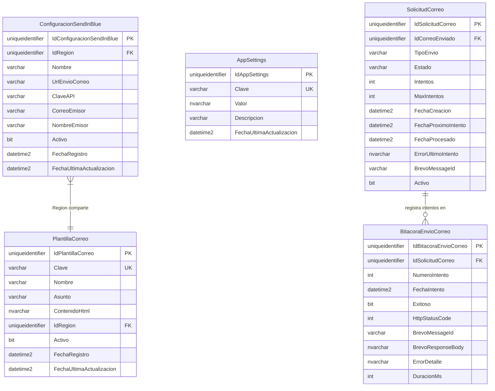

# EnvioCorreo — ProquifaDotNetSendInBlue

Servicio centralizado de notificaciones vía Brevo: ConfiguracionSendInBlue, PlantillaCorreo, SolicitudCorreo, BitacoraEnvioCorreo.

```mermaid
erDiagram
    ConfiguracionSendInBlue {
        uniqueidentifier IdConfiguracionSendInBlue PK
        uniqueidentifier IdRegion FK
        varchar Nombre
        varchar UrlEnvioCorreo
        varchar ClaveAPI
        varchar CorreoEmisor
        varchar NombreEmisor
        bit Activo
        datetime2 FechaRegistro
        datetime2 FechaUltimaActualizacion
    }
    AppSettings {
        uniqueidentifier IdAppSettings PK
        varchar Clave UK
        nvarchar Valor
        varchar Descripcion
        datetime2 FechaUltimaActualizacion
    }
    PlantillaCorreo {
        uniqueidentifier IdPlantillaCorreo PK
        varchar Clave UK
        varchar Nombre
        varchar Asunto
        nvarchar ContenidoHtml
        uniqueidentifier IdRegion FK
        bit Activo
        datetime2 FechaRegistro
        datetime2 FechaUltimaActualizacion
    }
    SolicitudCorreo {
        uniqueidentifier IdSolicitudCorreo PK
        uniqueidentifier IdCorreoEnviado FK
        varchar TipoEnvio
        varchar Estado
        int Intentos
        int MaxIntentos
        datetime2 FechaCreacion
        datetime2 FechaProximoIntento
        datetime2 FechaProcesado
        nvarchar ErrorUltimoIntento
        varchar BrevoMessageId
        bit Activo
    }
    BitacoraEnvioCorreo {
        uniqueidentifier IdBitacoraEnvioCorreo PK
        uniqueidentifier IdSolicitudCorreo FK
        int NumeroIntento
        datetime2 FechaIntento
        bit Exitoso
        int HttpStatusCode
        varchar BrevoMessageId
        nvarchar BrevoResponseBody
        nvarchar ErrorDetalle
        int DuracionMs
    }
    SolicitudCorreo ||--o{ BitacoraEnvioCorreo : "registra intentos en"
    ConfiguracionSendInBlue }|--|| PlantillaCorreo : "Region comparte"
```
