# ProquifaDotNet — Core Database (R16)

Entidades base del sistema operacional: Region, Empresa, Cliente, Archivo, DatosBancarios, Cartera de Cobranza, Correo, Pedidos y catálogos de pagos.

> **Migración (06/07/2026):** `tpProformaAdelanto` (abajo) se conserva como tabla legada — sigue existiendo físicamente, pero los flujos de Factura por Adelantado (RE-FU-012, 018, 019, 020, 026, 027, 028, 029, 030) ya no leen/escriben en ella. Esos flujos usan `fccFactura`/`fccFacturaPartida`/`fccFacturaReferenciaBancaria` (propiedad de ProquifaDotNet.Finanzas) — ver `ER-Finanzas.md` y `R16A-RE-FU-015_BD.md` ("Migración de `tpProformaAdelanto`").

> **Actualización (08/07/2026):** `tpProformaPedido` y `tpProformaPartidaPedido` **pasan al scope de ProquifaDotNet.Finanzas** (Scaffold EF Core en `Finanzas.Infrastructure`, lectura/escritura directa — dejan de consumirse vía API). Siguen existiendo físicamente en esta BD y se conservan aquí solo como referencia del vínculo con `tpPedido`; su modelo detallado y relaciones con `fcc*` viven en `ER-Finanzas.md`.

```mermaid
erDiagram
    Region {
        uniqueidentifier IdRegion PK
        varchar ClaveISO
        varchar Nombre
        bit Activo
    }
    Empresa {
        uniqueidentifier IdEmpresa PK
        varchar Prefijo
        varchar Nombre
        uniqueidentifier IdRegion FK
        bit Activo
    }
    EmpresaRegion {
        uniqueidentifier IdEmpresaRegion PK
        uniqueidentifier IdEmpresa FK
        uniqueidentifier IdRegion FK
        bit Activo
    }
    Cliente {
        uniqueidentifier IdCliente PK
        varchar Nombre
        uniqueidentifier IdRegion FK
        bit Activo
    }
    Usuario {
        uniqueidentifier IdUsuario PK
        varchar NombreUsuario
        uniqueidentifier IdRegion FK
        bit Activo
    }
    Archivo {
        uniqueidentifier IdArchivo PK
        varchar NombreArchivo
        varchar Ruta
        uniqueidentifier IdCatUsoArchivoSistema FK
        datetime2 FechaRegistro
    }
    catUsoArchivoSistema {
        uniqueidentifier IdCatUsoArchivoSistema PK
        varchar Clave
        varchar Descripcion
        bit Activo
    }
    ArchivoCliente {
        uniqueidentifier IdArchivoCliente PK
        uniqueidentifier IdCliente FK
        uniqueidentifier IdArchivo FK
        uniqueidentifier IdCatUsoArchivoSistema FK
        bit Activo
        datetime2 FechaRegistro
    }
    catBanco {
        uniqueidentifier IdCatBanco PK
        varchar Banco
        varchar Clave
        bit Deposito
        bit Transferencia
        bit Activo
    }
    catMoneda {
        uniqueidentifier IdCatMoneda PK
        varchar ClaveMoneda
        varchar Moneda
        bit Activo
    }
    DatosBancarios {
        uniqueidentifier IdDatosBancarios PK
        uniqueidentifier IdCatBanco FK
        varchar NumeroDeCuenta
        varchar CLABE
        varchar IdCatMoneda FK
        bit Activo
        datetime2 FechaRegistro
    }
    EmpresaDatosBancarios {
        uniqueidentifier IdEmpresaDatosBancarios PK
        uniqueidentifier IdDatosBancarios FK
        uniqueidentifier IdEmpresa FK
        uniqueidentifier IdRegion FK
        bit Activo
        datetime2 FechaRegistro
    }
    ClienteDatosBancarios {
        uniqueidentifier IdClienteDatosBancarios PK
        uniqueidentifier IdCliente FK
        uniqueidentifier IdDatosBancarios FK
        bit Activo
        datetime2 FechaRegistro
    }
    catMedioDePago {
        uniqueidentifier IdCatMedioDePago PK
        varchar MedioDePago
        varchar ClaveFormaDePago
        bit Activo
    }
    catMetodoDePagoCFDI {
        uniqueidentifier IdCatMetodoDePagoCFDI PK
        varchar MetodoDePagoCFDI
        varchar Clave
        bit Activo
    }
    catUsoCFDI {
        uniqueidentifier IdCatUsoCFDI PK
        varchar ClaveUso
        varchar Uso
        bit Activo
    }
    catCondicionesDePago {
        uniqueidentifier IdCatCondicionesDePago PK
        varchar Descripcion
        int DiasCredito
        bit Activo
    }
    ConfiguracionPagos {
        uniqueidentifier IdConfiguracionPagos PK
        uniqueidentifier IdEmpresa FK
        uniqueidentifier IdRegion FK
        uniqueidentifier IdCatMedioDePago FK
        uniqueidentifier IdCatMetodoDePagoCFDI FK
        uniqueidentifier IdCatCondicionesDePago FK
        bit Activo
        datetime2 FechaRegistro
    }
    DatosFacturacionCliente {
        uniqueidentifier IdDatosFacturacionCliente PK
        uniqueidentifier IdCliente FK
        uniqueidentifier IdCatUsoCFDI FK
        uniqueidentifier IdCatMetodoDePagoCFDI FK
        uniqueidentifier IdCatCondicionesDePago FK
        varchar RFC
        varchar RazonSocial
        bit Activo
        datetime2 FechaRegistro
    }
    ClienteCartera {
        uniqueidentifier IdClienteCartera PK
        varchar NombreCartera
        uniqueidentifier IdUsuarioCobrador FK
        uniqueidentifier IdRegion FK
        bit Activo
        datetime2 FechaRegistro
    }
    ClienteCarteraCliente {
        uniqueidentifier IdClienteCarteraCliente PK
        uniqueidentifier IdClienteCartera FK
        uniqueidentifier IdCliente FK
        uniqueidentifier IdRegion FK
        bit Activo
        datetime2 FechaRegistro
    }
    catProceso {
        uniqueidentifier IdCatProceso PK
        varchar Proceso
        varchar Clave
        bit Activo
    }
    catClasificacionCorreoRecibido {
        uniqueidentifier IdCatClasificacionCorreoRecibido PK
        uniqueidentifier IdCatProceso FK
        varchar Clasificacion
        bit EsCobro
        bit Activo
    }
    RegionConfiguracionMailBot {
        uniqueidentifier IdRegionConfiguracionMailBot PK
        uniqueidentifier IdRegion FK
        varchar CorreoMonitoreado
        varchar ServidorIMAP
        int PuertoIMAP
        bit Activo
        datetime2 FechaRegistro
    }
    CorreoRecibido {
        uniqueidentifier IdCorreoRecibido PK
        uniqueidentifier IdRegion FK
        varchar Asunto
        varchar CorreoEmisor
        datetime2 FechaRecepcion
        bit Procesado
        datetime2 FechaRegistro
    }
    CorreoRecibidoCliente {
        uniqueidentifier IdCorreoRecibidoCliente PK
        uniqueidentifier IdCorreoRecibido FK
        uniqueidentifier IdCliente FK
        uniqueidentifier IdCatClasificacionCorreoRecibido FK
        bit Procesado
        datetime2 FechaRegistro
    }
    tpPedido {
        uniqueidentifier IdTPPedido PK
        varchar FolioPedidoInterno
        uniqueidentifier IdCliente FK
        uniqueidentifier IdEmpresa FK
        uniqueidentifier IdRegion FK
        datetime2 FechaEstimadaEntrega
        datetime2 FechaCancelacionPorFaltaPago
        uniqueidentifier IdUsuarioCancelacion FK
        datetime2 FechaSolicitudCancelacion
        varchar EstadoCancelacionCFDI
        bit Activo
        datetime2 FechaRegistro
    }
    %% tpProformaPedido y tpProformaPartidaPedido: scope movido a ProquifaDotNet.Finanzas
    %% (08/07/2026, Scaffold directo) — modelo detallado en ER-Finanzas.md; aqui solo se
    %% conserva la entidad minima por su vinculo con tpPedido.
    tpProformaPedido {
        uniqueidentifier IdTpProformaPedido PK
        uniqueidentifier IdTPPedido FK
        decimal MontoPendiente
        decimal MontoTotal
        datetime2 FechaPromesaPagoMonitoreoCobros
        uniqueidentifier IdCFDIGenerada FK
        bit Activo
        datetime2 FechaRegistro
    }
    tpProformaAdelanto {
        uniqueidentifier IdTPProformaAdelanto PK
        uniqueidentifier IdTPPedido FK
        decimal Monto
        uniqueidentifier IdCFDIGenerada FK
        bit Enviada
        bit Activo
        datetime2 FechaRegistro
    }
    %% MIGRACIÓN (06/07/2026): tpProformaAdelanto queda como tabla legada, ya no es el
    %% destino de los flujos de Factura por Adelantado (RE-FU-012/018/019/020/026-030).
    %% Esos flujos ahora usan fccFactura/fccFacturaPartida/fccFacturaReferenciaBancaria,
    %% propiedad de ProquifaDotNet.Finanzas — ver ER-Finanzas.md y
    %% R16A-RE-FU-015_BD.md ("Migración de tpProformaAdelanto").
    Region ||--o{ Empresa : "tiene"
    Region ||--o{ EmpresaRegion : "tiene"
    Empresa ||--o{ EmpresaRegion : "pertenece a"
    Region ||--o{ Cliente : "tiene"
    Region ||--o{ ClienteCartera : "tiene"
    Region ||--o{ RegionConfiguracionMailBot : "tiene"
    Region ||--o{ CorreoRecibido : "tiene"
    Empresa ||--o{ EmpresaDatosBancarios : "tiene"
    Empresa ||--o{ ConfiguracionPagos : "tiene"
    Empresa ||--o{ tpPedido : "tiene"
    Cliente ||--o{ ArchivoCliente : "tiene"
    Cliente ||--o{ ClienteDatosBancarios : "tiene"
    Cliente ||--o{ DatosFacturacionCliente : "tiene"
    Cliente ||--o{ ClienteCarteraCliente : "tiene"
    Cliente ||--o{ CorreoRecibidoCliente : "tiene"
    Cliente ||--o{ tpPedido : "tiene"
    ClienteCartera ||--o{ ClienteCarteraCliente : "contiene"
    catBanco ||--o{ DatosBancarios : "clasifica"
    catMoneda ||--o{ DatosBancarios : "denomina"
    DatosBancarios ||--o{ EmpresaDatosBancarios : "es de"
    DatosBancarios ||--o{ ClienteDatosBancarios : "es de"
    catUsoArchivoSistema ||--o{ Archivo : "clasifica"
    catUsoArchivoSistema ||--o{ ArchivoCliente : "clasifica"
    Archivo ||--o{ ArchivoCliente : "vinculado a"
    catProceso ||--o{ catClasificacionCorreoRecibido : "clasifica"
    catClasificacionCorreoRecibido ||--o{ CorreoRecibidoCliente : "clasifica"
    CorreoRecibido ||--o{ CorreoRecibidoCliente : "tiene"
    catMedioDePago ||--o{ ConfiguracionPagos : "usa"
    catMetodoDePagoCFDI ||--o{ ConfiguracionPagos : "usa"
    catMetodoDePagoCFDI ||--o{ DatosFacturacionCliente : "usa"
    catUsoCFDI ||--o{ DatosFacturacionCliente : "usa"
    catCondicionesDePago ||--o{ ConfiguracionPagos : "usa"
    catCondicionesDePago ||--o{ DatosFacturacionCliente : "usa"
    tpPedido ||--o{ tpProformaPedido : "tiene"
    tpPedido ||--o{ tpProformaAdelanto : "tiene"
```

