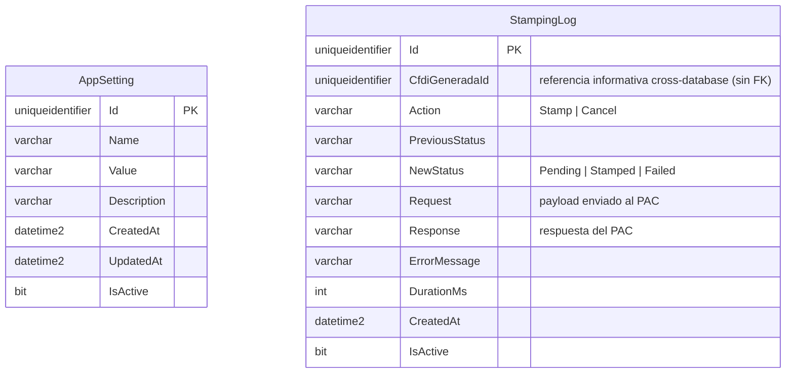

# Timbrado — ProquifaDotNetTimbrado

Base de datos de control técnico del servicio de timbrado (RE-FU-018): `AppSetting` (configuración: endpoints SAP, timeouts) y `StampingLog` (auditoría — 1 registro por solicitud de Finanzas, sin reintentos internos).

> **Actualización (07/07/2026):** `EmpresaFolio` **se movió a la BD `ProquifaDotNet`, propiedad de ProquifaDotNet.Finanzas** (ver `ER-Finanzas.md`) — Timbrado no gestiona folios. Las tablas `PeticionTimbrado`/`RespuestaPAC` del diseño previo quedaron sustituidas por `StampingLog` (corrección de arquitectura RE-FU-018: Timbrado es servicio técnico síncrono de un solo intento, sin tabla de negocio propia).

> `StampingLog.CfdiGeneradaId` referencia informativa a `CFDIGenerada.IdCFDIGenerada` (BD `ProquifaDotNet`, ver `ER-Finanzas.md`) — no es FK real por ser cross-database; se guarda solo para trazabilidad/soporte.
