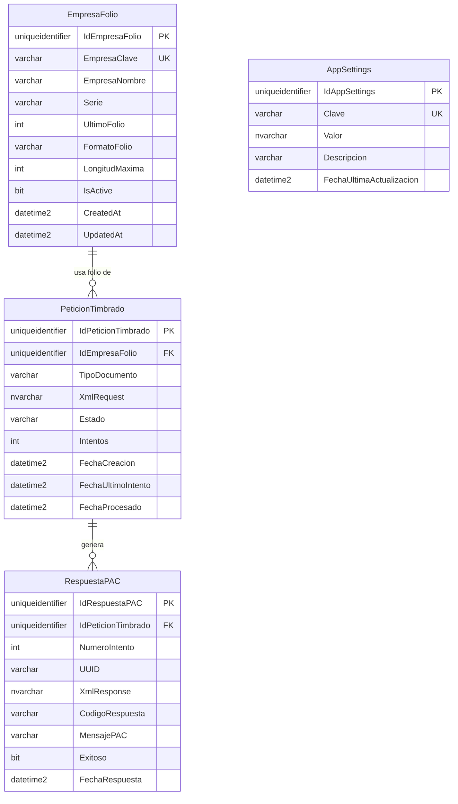

# Timbrado — ProquifaDotNetTimbrado

Base de datos dedicada al foliador fiscal: EmpresaFolio, AppSettings, PeticionTimbrado, RespuestaPAC.

```mermaid
erDiagram
    EmpresaFolio {
        uniqueidentifier IdEmpresaFolio PK
        varchar EmpresaClave UK
        varchar EmpresaNombre
        varchar Serie
        int UltimoFolio
        varchar FormatoFolio
        int LongitudMaxima
        bit IsActive
        datetime2 CreatedAt
        datetime2 UpdatedAt
    }
    AppSettings {
        uniqueidentifier IdAppSettings PK
        varchar Clave UK
        nvarchar Valor
        varchar Descripcion
        datetime2 FechaUltimaActualizacion
    }
    PeticionTimbrado {
        uniqueidentifier IdPeticionTimbrado PK
        uniqueidentifier IdEmpresaFolio FK
        varchar TipoDocumento
        nvarchar XmlRequest
        varchar Estado
        int Intentos
        datetime2 FechaCreacion
        datetime2 FechaUltimoIntento
        datetime2 FechaProcesado
    }
    RespuestaPAC {
        uniqueidentifier IdRespuestaPAC PK
        uniqueidentifier IdPeticionTimbrado FK
        int NumeroIntento
        varchar UUID
        nvarchar XmlResponse
        varchar CodigoRespuesta
        varchar MensajePAC
        bit Exitoso
        datetime2 FechaRespuesta
    }
    EmpresaFolio ||--o{ PeticionTimbrado : "usa folio de"
    PeticionTimbrado ||--o{ RespuestaPAC : "genera"
```
