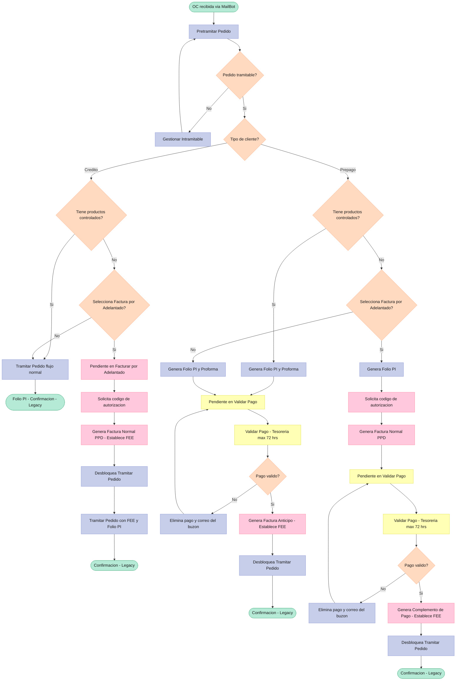

# 01 - Flujo General de Tramitacion de Pedidos

```mermaid
flowchart TD
    classDef inicio fill:#b5ead7,stroke:#6bbf9a,color:#1a1a1a
    classDef proceso fill:#c7ceea,stroke:#8a94d4,color:#1a1a1a
    classDef decision fill:#ffdac1,stroke:#ffaa7f,color:#1a1a1a
    classDef facturacion fill:#ffc8dd,stroke:#ff85a1,color:#1a1a1a
    classDef validacion fill:#ffffb5,stroke:#e0e045,color:#1a1a1a
    classDef fin fill:#b5ead7,stroke:#6bbf9a,color:#1a1a1a

    A([OC recibida via MailBot]):::inicio --> B[Pretramitar Pedido]:::proceso
    B --> C{Pedido tramitable?}:::decision
    C -- No --> D[Gestionar Intramitable]:::proceso
    D --> B
    C -- Si --> E{Tipo de cliente?}:::decision
    E -- Credito --> F{Tiene productos controlados?}:::decision
    E -- Prepago --> G{Tiene productos controlados?}:::decision
    F -- Si --> H[Tramitar Pedido flujo normal]:::proceso
    F -- No --> I{Selecciona Factura por Adelantado?}:::decision
    I -- No --> H
    I -- Si --> J[Pendiente en Facturar por Adelantado]:::facturacion
    H --> Z1([Folio PI - Confirmacion - Legacy]):::fin
    J --> K[Solicita codigo de autorizacion]:::facturacion
    K --> L[Genera Factura Normal PPD - Establece FEE]:::facturacion
    L --> M[Desbloquea Tramitar Pedido]:::proceso
    M --> N[Tramitar Pedido con FEE y Folio PI]:::proceso
    N --> Z2([Confirmacion - Legacy]):::fin
    G -- Si --> O[Genera Folio PI y Proforma]:::proceso
    O --> P[Pendiente en Validar Pago]:::validacion
    P --> Q[Validar Pago - Tesoreria max 72 hrs]:::validacion
    Q --> R{Pago valido?}:::decision
    R -- No --> S[Elimina pago y correo del buzon]:::proceso
    S --> P
    R -- Si --> T[Genera Factura Anticipo - Establece FEE]:::facturacion
    T --> T3[Desbloquea Tramitar Pedido]:::proceso
    T3 --> Z3([Confirmacion - Legacy]):::fin
    G -- No --> V{Selecciona Factura por Adelantado?}:::decision
    V -- No --> W[Genera Folio PI y Proforma]:::proceso
    W --> P
    V -- Si --> X[Genera Folio PI]:::proceso
    X --> Y2[Solicita codigo de autorizacion]:::facturacion
    Y2 --> Y3[Genera Factura Normal PPD]:::facturacion
    Y3 --> Y4[Pendiente en Validar Pago]:::validacion
    Y4 --> Q2[Validar Pago - Tesoreria max 72 hrs]:::validacion
    Q2 --> R2{Pago valido?}:::decision
    R2 -- No --> S2[Elimina pago y correo del buzon]:::proceso
    S2 --> Y4
    R2 -- Si --> T4[Genera Complemento de Pago - Establece FEE]:::facturacion
    T4 --> T6[Desbloquea Tramitar Pedido]:::proceso
    T6 --> Z4([Confirmacion - Legacy]):::fin
```
