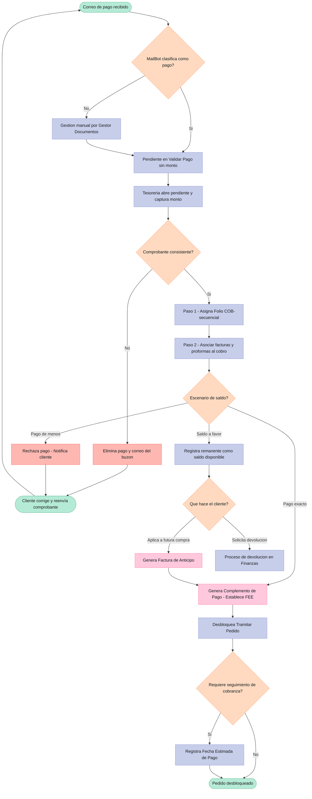

# 02 - Flujo de Cobranza Prepago - Validar Pago

```mermaid
flowchart TD
    classDef inicio fill:#b5ead7,stroke:#6bbf9a,color:#1a1a1a
    classDef proceso fill:#c7ceea,stroke:#8a94d4,color:#1a1a1a
    classDef decision fill:#ffdac1,stroke:#ffaa7f,color:#1a1a1a
    classDef alerta fill:#ffb7b2,stroke:#ff6b6b,color:#1a1a1a
    classDef facturacion fill:#ffc8dd,stroke:#ff85a1,color:#1a1a1a
    classDef fin fill:#b5ead7,stroke:#6bbf9a,color:#1a1a1a

    A([Correo de pago recibido]):::inicio --> B{MailBot clasifica como pago?}:::decision
    B -- Si --> C[Pendiente en Validar Pago sin monto]:::proceso
    B -- No --> D[Gestion manual por Gestor Documentos]:::proceso
    D --> C
    C --> E[Tesoreria abre pendiente y captura monto]:::proceso
    E --> F{Comprobante consistente?}:::decision
    F -- No --> H[Elimina pago y correo del buzon]:::alerta
    H --> J([Cliente corrige y reenvía comprobante]):::inicio
    J --> A
    F -- Si --> K[Paso 1 - Asigna Folio COB-secuencial]:::proceso
    K --> L[Paso 2 - Asociar facturas y proformas al cobro]:::proceso
    L --> M{Escenario de saldo?}:::decision
    M -- Pago exacto --> N[Genera Complemento de Pago - Establece FEE]:::facturacion
    M -- Pago de menos --> O[Rechaza pago - Notifica cliente]:::alerta
    O --> J
    M -- Saldo a favor --> P[Registra remanente como saldo disponible]:::proceso
    P --> Q{Que hace el cliente?}:::decision
    Q -- Aplica a futura compra --> R[Genera Factura de Anticipo]:::facturacion
    Q -- Solicita devolucion --> S[Proceso de devolucion en Finanzas]:::proceso
    R --> N
    N --> U[Desbloquea Tramitar Pedido]:::proceso
    U --> V{Requiere seguimiento de cobranza?}:::decision
    V -- No --> W([Pedido desbloqueado]):::fin
    V -- Si --> X[Registra Fecha Estimada de Pago]:::proceso
    X --> W
```
