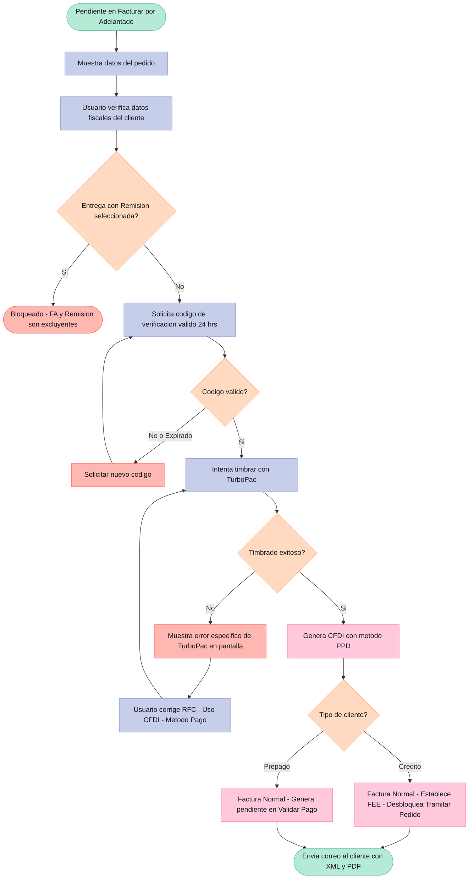

# 03 - Flujo de Factura por Adelantado

```mermaid
flowchart TD
    classDef inicio fill:#b5ead7,stroke:#6bbf9a,color:#1a1a1a
    classDef proceso fill:#c7ceea,stroke:#8a94d4,color:#1a1a1a
    classDef decision fill:#ffdac1,stroke:#ffaa7f,color:#1a1a1a
    classDef alerta fill:#ffb7b2,stroke:#ff6b6b,color:#1a1a1a
    classDef facturacion fill:#ffc8dd,stroke:#ff85a1,color:#1a1a1a
    classDef fin fill:#b5ead7,stroke:#6bbf9a,color:#1a1a1a

    A([Pendiente en Facturar por Adelantado]):::inicio --> B[Muestra datos del pedido]:::proceso
    B --> C[Usuario verifica datos fiscales del cliente]:::proceso
    C --> D{Entrega con Remision seleccionada?}:::decision
    D -- Si --> E([Bloqueado - FA y Remision son excluyentes]):::alerta
    D -- No --> F[Solicita codigo de verificacion valido 24 hrs]:::proceso
    F --> G{Codigo valido?}:::decision
    G -- No o Expirado --> H[Solicitar nuevo codigo]:::alerta
    H --> F
    G -- Si --> I[Intenta timbrar con TurboPac]:::proceso
    I --> J{Timbrado exitoso?}:::decision
    J -- No --> K[Muestra error especifico de TurboPac en pantalla]:::alerta
    K --> L[Usuario corrige RFC - Uso CFDI - Metodo Pago]:::proceso
    L --> I
    J -- Si --> M[Genera CFDI con metodo PPD]:::facturacion
    M --> N{Tipo de cliente?}:::decision
    N -- Credito --> O[Factura Normal - Establece FEE - Desbloquea Tramitar Pedido]:::facturacion
    N -- Prepago --> P[Factura Normal - Genera pendiente en Validar Pago]:::facturacion
    O --> S([Envia correo al cliente con XML y PDF]):::fin
    P --> S
```
