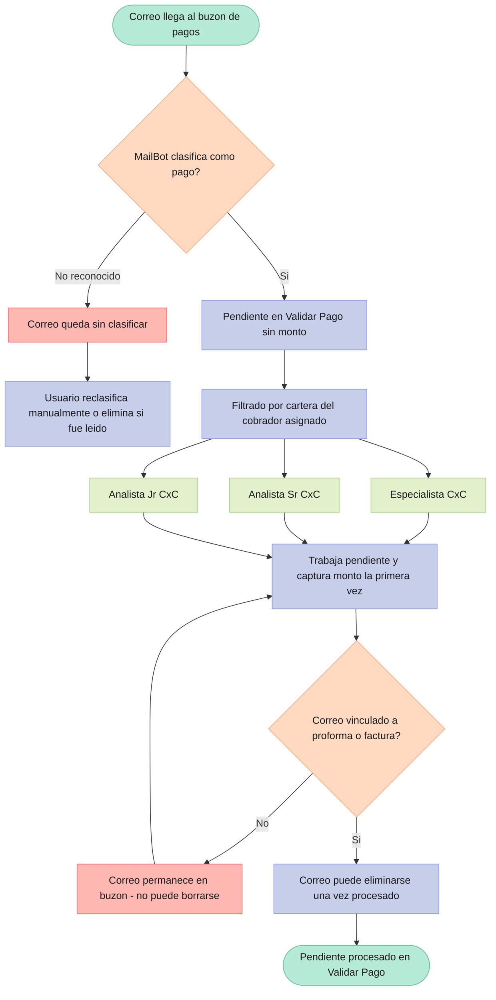

# 04 - Flujo del Buzon de Pagos

```mermaid
flowchart TD
    classDef inicio fill:#b5ead7,stroke:#6bbf9a,color:#1a1a1a
    classDef proceso fill:#c7ceea,stroke:#8a94d4,color:#1a1a1a
    classDef decision fill:#ffdac1,stroke:#ffaa7f,color:#1a1a1a
    classDef rol fill:#e2f0cb,stroke:#a8d08d,color:#1a1a1a
    classDef alerta fill:#ffb7b2,stroke:#ff6b6b,color:#1a1a1a
    classDef fin fill:#b5ead7,stroke:#6bbf9a,color:#1a1a1a

    A([Correo llega al buzon de pagos]):::inicio --> B{MailBot clasifica como pago?}:::decision
    B -- Si --> C[Pendiente en Validar Pago sin monto]:::proceso
    B -- No reconocido --> D[Correo queda sin clasificar]:::alerta
    D --> E[Usuario reclasifica manualmente o elimina si fue leido]:::proceso
    C --> F[Filtrado por cartera del cobrador asignado]:::proceso
    F --> G1[Especialista CxC]:::rol
    F --> G2[Analista Sr CxC]:::rol
    F --> G3[Analista Jr CxC]:::rol
    G1 --> H[Trabaja pendiente y captura monto la primera vez]:::proceso
    G2 --> H
    G3 --> H
    H --> I{Correo vinculado a proforma o factura?}:::decision
    I -- No --> J[Correo permanece en buzon - no puede borrarse]:::alerta
    I -- Si --> K[Correo puede eliminarse una vez procesado]:::proceso
    J --> H
    K --> L([Pendiente procesado en Validar Pago]):::fin
```
