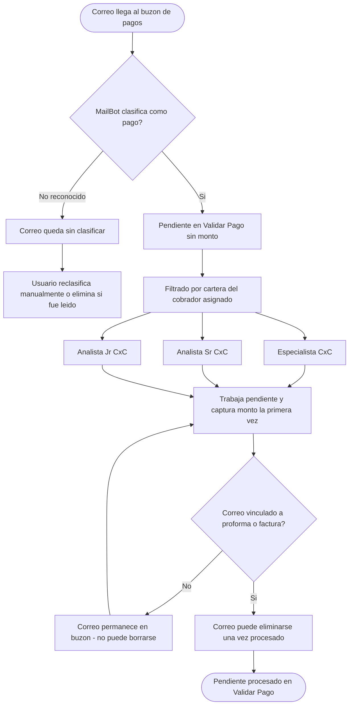

```mermaid
flowchart TD
    A([Correo llega al buzon de pagos]) --> B{MailBot clasifica como pago?}
    B -- Si --> C[Pendiente en Validar Pago sin monto]
    B -- No reconocido --> D[Correo queda sin clasificar]
    D --> E[Usuario reclasifica manualmente o elimina si fue leido]
    C --> F[Filtrado por cartera del cobrador asignado]
    F --> G1[Especialista CxC]
    F --> G2[Analista Sr CxC]
    F --> G3[Analista Jr CxC]
    G1 --> H[Trabaja pendiente y captura monto la primera vez]
    G2 --> H
    G3 --> H
    H --> I{Correo vinculado a proforma o factura?}
    I -- No --> J[Correo permanece en buzon - no puede borrarse]
    I -- Si --> K[Correo puede eliminarse una vez procesado]
    J --> H
    K --> L([Pendiente procesado en Validar Pago])
```
