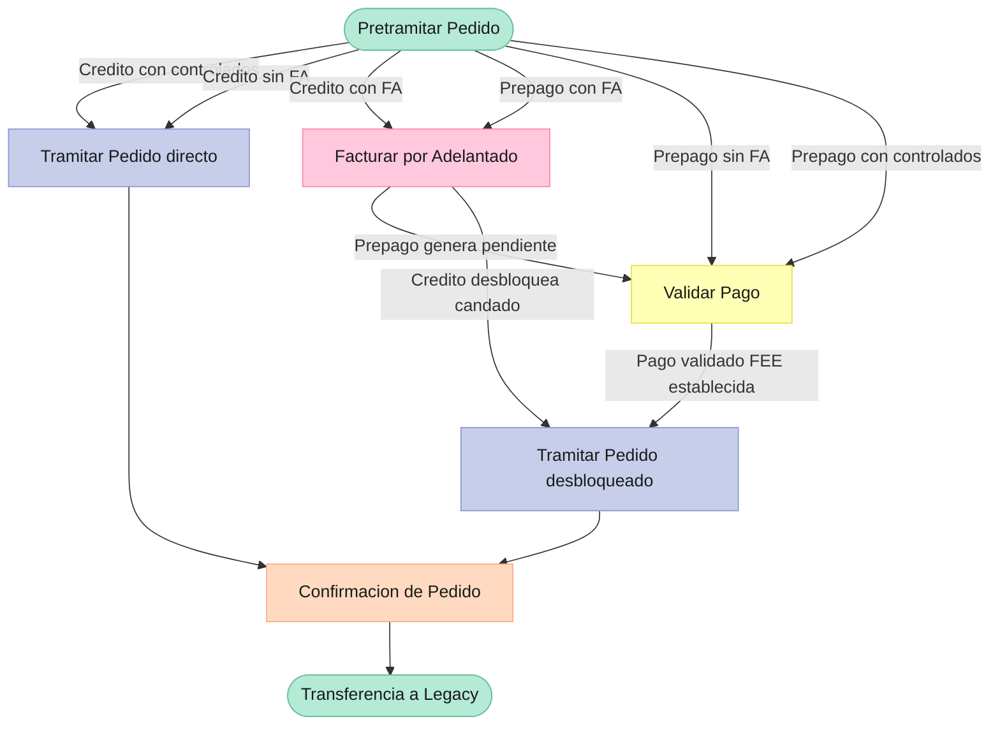

# 05 - Resumen de Rutas por Tipo de Cliente

```mermaid
flowchart TD
    classDef inicio fill:#b5ead7,stroke:#6bbf9a,color:#1a1a1a
    classDef credito fill:#c7ceea,stroke:#8a94d4,color:#1a1a1a
    classDef prepago fill:#ffdac1,stroke:#ffaa7f,color:#1a1a1a
    classDef facturacion fill:#ffc8dd,stroke:#ff85a1,color:#1a1a1a
    classDef validacion fill:#ffffb5,stroke:#e0e045,color:#1a1a1a
    classDef fin fill:#b5ead7,stroke:#6bbf9a,color:#1a1a1a

    PT([Pretramitar Pedido]):::inicio
    PT -->|Credito con controlados| TD1[Tramitar Pedido directo]:::credito
    PT -->|Credito sin FA| TD1
    PT -->|Credito con FA| FA[Facturar por Adelantado]:::facturacion
    PT -->|Prepago con FA| FA
    PT -->|Prepago sin FA| VP[Validar Pago]:::validacion
    PT -->|Prepago con controlados| VP
    FA -->|Prepago genera pendiente| VP
    FA -->|Credito desbloquea candado| TD2[Tramitar Pedido desbloqueado]:::credito
    VP -->|Pago validado FEE establecida| TD2
    TD1 --> CF[Confirmacion de Pedido]:::prepago
    TD2 --> CF
    CF --> LG([Transferencia a Legacy]):::fin
```
