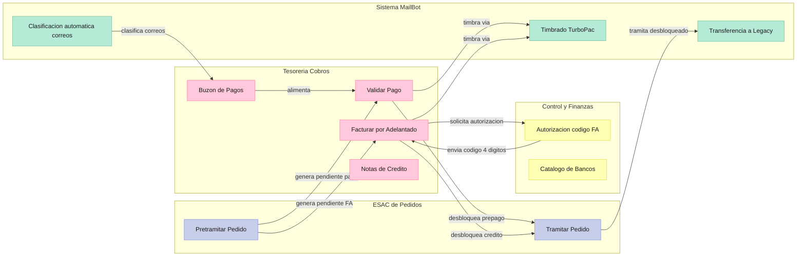

# 06 - Roles y Responsabilidades por Modulo

```mermaid
flowchart LR
    classDef esac fill:#c7ceea,stroke:#8a94d4,color:#1a1a1a
    classDef cobros fill:#ffc8dd,stroke:#ff85a1,color:#1a1a1a
    classDef finanzas fill:#ffffb5,stroke:#e0e045,color:#1a1a1a
    classDef sistema fill:#b5ead7,stroke:#6bbf9a,color:#1a1a1a

    subgraph ESAC["ESAC de Pedidos"]
        A1[Pretramitar Pedido]:::esac
        A2[Tramitar Pedido]:::esac
    end
    subgraph COBROS["Tesoreria Cobros"]
        B1[Buzon de Pagos]:::cobros
        B2[Validar Pago]:::cobros
        B3[Facturar por Adelantado]:::cobros
        B4[Notas de Credito]:::cobros
    end
    subgraph FINANZAS["Control y Finanzas"]
        C1[Autorizacion codigo FA]:::finanzas
        C2[Catalogo de Bancos]:::finanzas
    end
    subgraph SISTEMA["Sistema MailBot"]
        D1[Clasificacion automatica correos]:::sistema
        D2[Timbrado TurboPac]:::sistema
        D3[Transferencia a Legacy]:::sistema
    end
    A1 -->|genera pendiente FA| B3
    A1 -->|genera pendiente pago| B2
    A2 -->|tramita desbloqueado| D3
    D1 -->|clasifica correos| B1
    B1 -->|alimenta| B2
    B3 -->|solicita autorizacion| C1
    C1 -->|envia codigo 4 digitos| B3
    B2 -->|desbloquea prepago| A2
    B3 -->|desbloquea credito| A2
    B2 -->|timbra via| D2
    B3 -->|timbra via| D2
```
