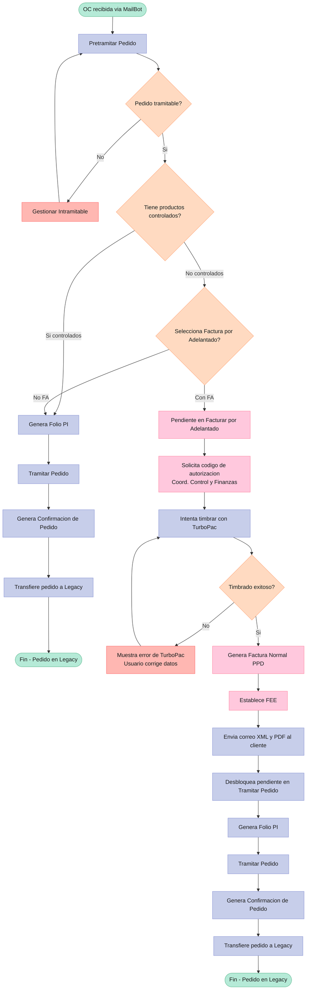

# 07 - Tramitacion de Pedidos - Credito

```mermaid
flowchart TD
    classDef inicio    fill:#b5ead7,stroke:#6bbf9a,color:#1a1a1a
    classDef proceso   fill:#c7ceea,stroke:#8a94d4,color:#1a1a1a
    classDef decision  fill:#ffdac1,stroke:#ffaa7f,color:#1a1a1a
    classDef factura   fill:#ffc8dd,stroke:#ff85a1,color:#1a1a1a
    classDef alerta    fill:#ffb7b2,stroke:#ff6b6b,color:#1a1a1a
    classDef fin       fill:#b5ead7,stroke:#6bbf9a,color:#1a1a1a

    A([OC recibida via MailBot]):::inicio --> B[Pretramitar Pedido]:::proceso
    B --> C{Pedido tramitable?}:::decision
    C -- No --> D[Gestionar Intramitable]:::alerta
    D --> B
    C -- Si --> E{Tiene productos controlados?}:::decision

    E -- Si controlados --> H[Genera Folio PI]:::proceso
    E -- No controlados --> I{Selecciona Factura por Adelantado?}:::decision
    I -- No FA --> H
    H --> J[Tramitar Pedido]:::proceso
    J --> K[Genera Confirmacion de Pedido]:::proceso
    K --> L[Transfiere pedido a Legacy]:::proceso
    L --> Z1([Fin - Pedido en Legacy]):::fin

    I -- Con FA --> M[Pendiente en Facturar por Adelantado]:::factura
    M --> N[Solicita codigo de autorizacion
Coord. Control y Finanzas]:::factura
    N --> O[Intenta timbrar con TurboPac]:::proceso
    O --> P{Timbrado exitoso?}:::decision
    P -- No --> Q[Muestra error de TurboPac
Usuario corrige datos]:::alerta
    Q --> O
    P -- Si --> R[Genera Factura Normal PPD]:::factura
    R --> S[Establece FEE]:::factura
    S --> T[Envia correo XML y PDF al cliente]:::proceso
    T --> U[Desbloquea pendiente en Tramitar Pedido]:::proceso
    U --> V[Genera Folio PI]:::proceso
    V --> W[Tramitar Pedido]:::proceso
    W --> X[Genera Confirmacion de Pedido]:::proceso
    X --> Y[Transfiere pedido a Legacy]:::proceso
    Y --> Z2([Fin - Pedido en Legacy]):::fin
```
