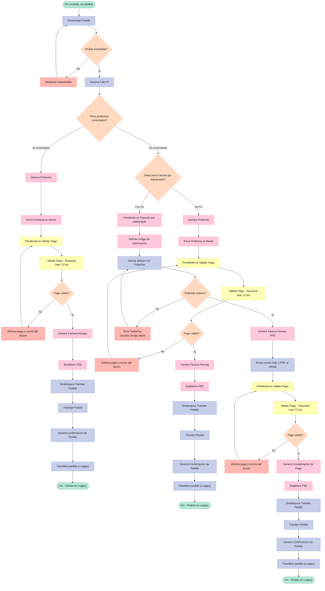

# 08 - Tramitacion de Pedidos - Prepago

```mermaid
flowchart TD
    classDef inicio    fill:#b5ead7,stroke:#6bbf9a,color:#1a1a1a
    classDef proceso   fill:#c7ceea,stroke:#8a94d4,color:#1a1a1a
    classDef decision  fill:#ffdac1,stroke:#ffaa7f,color:#1a1a1a
    classDef factura   fill:#ffc8dd,stroke:#ff85a1,color:#1a1a1a
    classDef validar   fill:#ffffb5,stroke:#e0e045,color:#1a1a1a
    classDef alerta    fill:#ffb7b2,stroke:#ff6b6b,color:#1a1a1a
    classDef fin       fill:#b5ead7,stroke:#6bbf9a,color:#1a1a1a

    A([OC recibida via MailBot]):::inicio --> B[Pretramitar Pedido]:::proceso
    B --> C{Pedido tramitable?}:::decision
    C -- No --> D[Gestionar Intramitable]:::alerta
    D --> B
    C -- Si --> E[Genera Folio PI]:::proceso
    E --> F{Tiene productos controlados?}:::decision
    F -- No controlados --> G{Selecciona Factura por Adelantado?}:::decision

    %% ESCENARIO A - Controlados
    F -- Si controlados --> H[Genera Proforma]:::factura
    H --> H2[Envia Proforma al cliente]:::factura
    H2 --> I[Pendiente en Validar Pago]:::validar
    I --> J[Validar Pago - Tesoreria max 72 hrs]:::validar
    J --> K{Pago valido?}:::decision
    K -- No --> L[Elimina pago y correo del buzon]:::alerta
    L --> I
    K -- Si --> M[Genera Factura Anticipo]:::factura
    M --> N[Establece FEE]:::factura
    N --> O[Desbloquea Tramitar Pedido]:::proceso
    O --> P[Tramitar Pedido]:::proceso
    P --> Q[Genera Confirmacion de Pedido]:::proceso
    Q --> R[Transfiere pedido a Legacy]:::proceso
    R --> Z1([Fin - Pedido en Legacy]):::fin

    %% ESCENARIO B - Sin FA
    G -- No FA --> S[Genera Proforma]:::factura
    S --> S2[Envia Proforma al cliente]:::factura
    S2 --> T[Pendiente en Validar Pago]:::validar
    T --> U[Validar Pago - Tesoreria max 72 hrs]:::validar
    U --> V{Pago valido?}:::decision
    V -- No --> W[Elimina pago y correo del buzon]:::alerta
    W --> T
    V -- Si --> X[Genera Factura Normal]:::factura
    X --> Y[Establece FEE]:::factura
    Y --> AA[Desbloquea Tramitar Pedido]:::proceso
    AA --> AB[Tramitar Pedido]:::proceso
    AB --> AC[Genera Confirmacion de Pedido]:::proceso
    AC --> AD[Transfiere pedido a Legacy]:::proceso
    AD --> Z2([Fin - Pedido en Legacy]):::fin

    %% ESCENARIO C - Con FA
    G -- Con FA --> BA[Pendiente en Facturar por Adelantado]:::factura
    BA --> BB[Solicita codigo de autorizacion]:::factura
    BB --> BC[Intenta timbrar con TurboPac]:::proceso
    BC --> BD{Timbrado exitoso?}:::decision
    BD -- No --> BE[Error TurboPac
Usuario corrige datos]:::alerta
    BE --> BC
    BD -- Si --> BF[Genera Factura Normal PPD]:::factura
    BF --> BG[Envia correo XML y PDF al cliente]:::proceso
    BG --> BH[Pendiente en Validar Pago]:::validar
    BH --> BI[Validar Pago - Tesoreria max 72 hrs]:::validar
    BI --> BJ{Pago valido?}:::decision
    BJ -- No --> BK[Elimina pago y correo del buzon]:::alerta
    BK --> BH
    BJ -- Si --> BL[Genera Complemento de Pago]:::factura
    BL --> BM[Establece FEE]:::factura
    BM --> BN[Desbloquea Tramitar Pedido]:::proceso
    BN --> BO[Tramitar Pedido]:::proceso
    BO --> BP[Genera Confirmacion de Pedido]:::proceso
    BP --> BQ[Transfiere pedido a Legacy]:::proceso
    BQ --> Z3([Fin - Pedido en Legacy]):::fin
```
