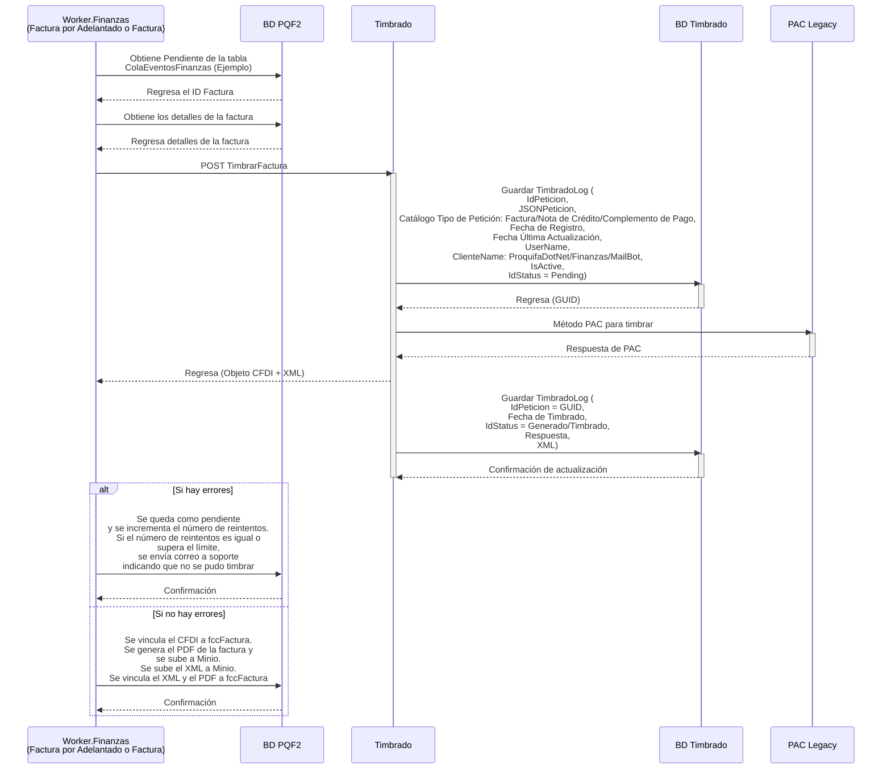

# Diagrama Secuencia Encolamiento Finanzas y Timbrado Factura

```mermaid
sequenceDiagram
    participant WF as Worker.Finanzas<br/>(Factura por Adelantado o Factura)
    participant BDPQF2 as BD PQF2
    participant T as Timbrado
    participant BDT as BD Timbrado
    participant PAC as PAC Legacy

    WF->>BDPQF2: Obtiene Pendiente de la tabla <br/>ColaEventosFinanzas (Ejemplo)
    BDPQF2-->>WF: Regresa el ID Factura

    WF->>BDPQF2: Obtiene los detalles de la factura
    BDPQF2-->>WF: Regresa detalles de la factura

    WF->>T: POST TimbrarFactura
    activate T

    T->>BDT: Guardar TimbradoLog (<br/>IdPeticion, <br/>JSONPeticion, <br/>Catálogo Tipo de Petición: Factura/Nota de Crédito/Complemento de Pago, <br/>Fecha de Registro, <br/>Fecha Última Actualización, <br/>UserName, <br/>ClienteName: ProquifaDotNet/Finanzas/MailBot, <br/>IsActive, <br/>IdStatus = Pending)
    activate BDT
    BDT-->>T: Regresa (GUID)
    deactivate BDT

    T->>PAC: Método PAC para timbrar
    activate PAC
    PAC-->>T: Respuesta de PAC
    deactivate PAC

    T-->>WF: Regresa (Objeto CFDI + XML)

    T->>BDT: Guardar TimbradoLog (<br/>IdPeticion = GUID, <br/>Fecha de Timbrado, <br/>IdStatus = Generado/Timbrado, <br/>Respuesta, <br/>XML)
    activate BDT
    BDT-->>T: Confirmación de actualización
    deactivate BDT
    deactivate T

    alt Si hay errores
        WF->>BDPQF2: Se queda como pendiente <br/>y se incrementa el número de reintentos. <br/>Si el número de reintentos es igual o <br/>supera el límite, <br/>se envía correo a soporte <br/>indicando que no se pudo timbrar
        BDPQF2-->>WF: Confirmación
    else Si no hay errores
        WF->>BDPQF2: Se vincula el CFDI a fccFactura. <br/>Se genera el PDF de la factura y<br/> se sube a Minio. <br/>Se sube el XML a Minio.<br/> Se vincula el XML y el PDF a fccFactura
        BDPQF2-->>WF: Confirmación
    end
```
