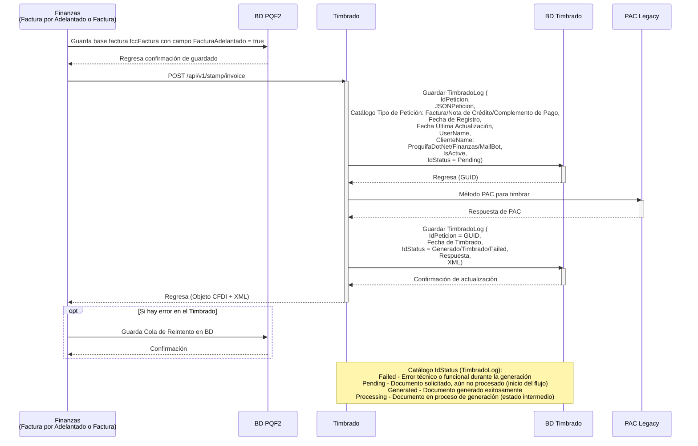

# Diagrama Secuencia Finanzas y Timbrado Factura

```mermaid
sequenceDiagram
    participant F as Finanzas<br/>(Factura por Adelantado o Factura)
    participant BDPQF2 as BD PQF2
    participant T as Timbrado
    participant BDT as BD Timbrado
    participant PAC as PAC Legacy

    F->>BDPQF2: Guarda base factura fccFactura con campo FacturaAdelantado = true
    BDPQF2-->>F: Regresa confirmación de guardado

    F->>T: POST /api/v1/stamp/invoice
    activate T

    T->>BDT: Guardar TimbradoLog (<br/>IdPeticion, <br/>JSONPeticion, <br/>Catálogo Tipo de Petición: Factura/Nota de Crédito/Complemento de Pago, <br/>Fecha de Registro, <br/>Fecha Última Actualización, <br/>UserName, <br/>ClienteName: <br/>ProquifaDotNet/Finanzas/MailBot, <br/>IsActive, <br/>IdStatus = Pending)
    activate BDT
    BDT-->>T: Regresa (GUID)
    deactivate BDT

    T->>PAC: Método PAC para timbrar
    activate PAC
    PAC-->>T: Respuesta de PAC
    deactivate PAC

    T->>BDT: Guardar TimbradoLog (<br/>IdPeticion = GUID, <br/>Fecha de Timbrado, <br/>IdStatus = Generado/Timbrado/Failed, <br/>Respuesta, <br/>XML)
    activate BDT
    BDT-->>T: Confirmación de actualización
    deactivate BDT

    T-->>F: Regresa (Objeto CFDI + XML)
    deactivate T

    opt Si hay error en el Timbrado
        F->>BDPQF2: Guarda Cola de Reintento en BD
        BDPQF2-->>F: Confirmación
    end

    Note over T,BDT: Catálogo IdStatus (TimbradoLog):<br/>Failed - Error técnico o funcional durante la generación<br/>Pending - Documento solicitado, aún no procesado (inicio del flujo)<br/>Generated - Documento generado exitosamente<br/>Processing - Documento en proceso de generación (estado intermedio)
```
