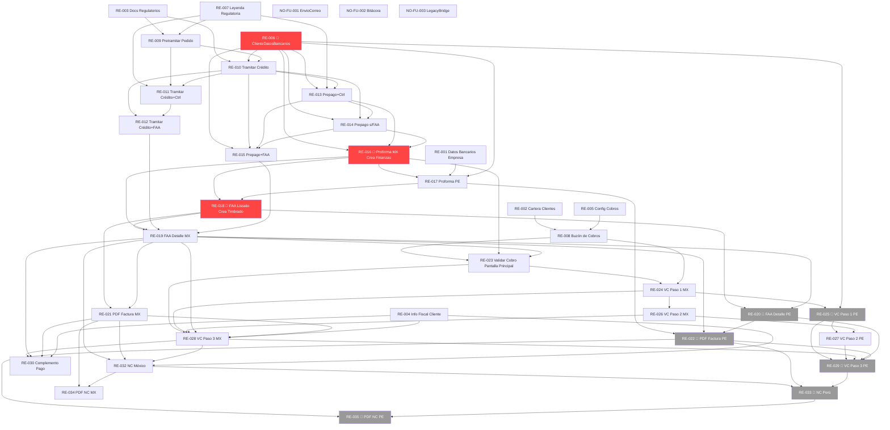

# Dependencias y Orden de Ejecución — Requisitos R16

Análisis de dependencias explícitas e implícitas entre todos los requisitos del proyecto R16 (ProquifaDotNet). Determina qué se puede desarrollar en paralelo, qué debe ir en secuencia y qué está bloqueado.

---

## Hitos Arquitectónicos Críticos

Tres requisitos que desbloquean la mayor cantidad de trabajo en cascada. Deben priorizarse.

| Hito  | Requisito  | Qué crea                                   | Desbloquea                                                         |
| ----- | ---------- | ------------------------------------------ | ------------------------------------------------------------------ |
| 🔴 H1 | **RE-006** | `ClienteDatosBancarios` + Código Validador | RE-013/014/015/016/017/025                                         |
| 🔴 H2 | **RE-016** | Solución `ProquifaDotNet.Finanzas`         | RE-017/018/019/020/023/024/025/026/027/028/029/030/032/033/034/035 |
| 🔴 H3 | **RE-018** | Solución `ProquifaDotNet.Timbrado`         | RE-019/020/030/032/033/034/035                                     |

---

## Requisitos Bloqueados (brechas pendientes)

| Requisito | Brecha | Desbloqueo |
|-----------|--------|------------|
| RE-020 | Datos producto SUNAT (`CodigoSUNAT`, `catAfectacionIGV`) + proveedor OSE no definido | PROQUIFA Perú + decisión de proveedor OSE |
| RE-022 | Mismas brechas que RE-020 (campos en PDF) | Igual que RE-020 |
| RE-025 | Cuentas bancarias GOLPERU no cargadas en BD | PROQUIFA Perú debe proporcionar datos |
| RE-029 | Modalidad OSE/SUNAT para timbrado no definida | Definir modalidad emisión electrónica Perú |
| RE-033 | Modalidad OSE/SUNAT (compartida con RE-029) | Igual que RE-029 |
| RE-035 | Modalidad OSE/SUNAT (compartida) | Igual que RE-029 |
| RE-028 (ETL) | Canal transferencia Legacy no definido (Brecha B3) | Arquitectura debe decidir: tabla ETL, RabbitMQ o API Legacy directa |

---

## Tabla de Dependencias por Requisito

### Grupo 1 — Catálogos y Configuración Base

| Req.      | Nombre                                     | Depende de                               | Bloquea a                               | Paralelo con                                           |
| --------- | ------------------------------------------ | ---------------------------------------- | --------------------------------------- | ------------------------------------------------------ |
| RE-001    | Datos Bancarios Empresa                    | —                                        | RE-017                                  | RE-002 al RE-007                                       |
| RE-002    | Cartera de Clientes / Cobrador             | —                                        | RE-008, RE-023                          | RE-001, RE-003 al RE-007                               |
| RE-003    | Documentos Regulatorios Cliente            | —                                        | RE-009                                  | RE-001, RE-002, RE-004 al RE-007                       |
| RE-004    | Información Fiscal Cliente                 | —                                        | RE-028, RE-029, RE-030, RE-032, RE-033  | RE-001 al RE-003, RE-005 al RE-007                     |
| RE-005    | Configuración de Cobros                    | —                                        | RE-008                                  | RE-001 al RE-004, RE-006, RE-007                       |
| RE-006 🔴 | Referencia de Pago / ClienteDatosBancarios | —                                        | RE-013/014/015/016/017/025              | RE-001 al RE-005, RE-007                               |
| RE-007    | Leyenda Regulatoria en Cotización          | —                                        | RE-009, RE-011, RE-013                  | RE-001 al RE-006                                       |
| RE-008    | Buzón de Cobros (Mailbot)                  | RE-002, RE-005                           | RE-023, RE-024, RE-028 (E1)             | RE-009 al RE-015                                       |
| NO-FU-001 | EnvioCorreo / SendInBlue                   | — (infraestructura)                      | RE-016, RE-019, RE-028, RE-032 (envíos) | Todos los RE funcionales                               |
| NO-FU-002 | Bitácora Transaccional                     | —                                        | —                                       | Todos los RE funcionales                               |
| NO-FU-003 | LegacyBridge                               | RE-002 al RE-006, RE-008, RE-010, RE-028 | —                                       | Todos los RE funcionales (infraestructura en paralelo) |

---

### Grupo 2 — Pedidos

| Req.   | Nombre                                      | Depende de             | Bloquea a              | Paralelo con           |
| ------ | ------------------------------------------- | ---------------------- | ---------------------- | ---------------------- |
| RE-009 | Pretramitar Pedido (Validación Regulatoria) | RE-003, RE-007         | RE-010, RE-011, RE-013 | RE-001 al RE-008       |
| RE-010 | Tramitar Pedido Crédito                     | RE-003, RE-006, RE-009 | RE-011, RE-012, RE-023 | RE-013, RE-014         |
| RE-011 | Tramitar Pedido Crédito con Controlados     | RE-007, RE-009, RE-010 | RE-012                 | RE-013, RE-014, RE-015 |
| RE-012 | Tramitar Pedido Crédito con FAA             | RE-010, RE-011         | RE-018 (pendiente FAA) | RE-013, RE-014, RE-015 |

---

### Grupo 3 — Prepago

| Req.   | Nombre                                  | Depende de                     | Bloquea a              | Paralelo con           |
| ------ | --------------------------------------- | ------------------------------ | ---------------------- | ---------------------- |
| RE-013 | Tramitar Pedido Prepago con Controlados | RE-006, RE-007, RE-010         | RE-014, RE-015, RE-016 | RE-010, RE-011, RE-012 |
| RE-014 | Tramitar Pedido Prepago sin Controlados | RE-006, RE-010, RE-013         | RE-015, RE-016         | RE-010, RE-011, RE-012 |
| RE-015 | Tramitar Pedido Prepago con FAA         | RE-006, RE-010, RE-013, RE-014 | RE-018 (pendiente FAA) | RE-010, RE-011, RE-012 |

---

### Grupo 4 — Proforma y Finanzas

| Req.      | Nombre                            | Depende de             | Bloquea a                                         | Paralelo con |
| --------- | --------------------------------- | ---------------------- | ------------------------------------------------- | ------------ |
| RE-016 🔴 | Proforma México — Crea Finanzas   | RE-006, RE-013, RE-014 | **Todo el ecosistema Finanzas** (RE-017 a RE-035) | —            |
| RE-017    | Proforma Perú (variante regional) | RE-016, RE-001, RE-006 | RE-020 (PDF Perú)                                 | RE-018       |

---

### Grupo 5 — Factura por Adelantado (FAA)

| Req.      | Nombre                            | Depende de                     | Bloquea a                                      | Paralelo con             |
| --------- | --------------------------------- | ------------------------------ | ---------------------------------------------- | ------------------------ |
| RE-018 🔴 | FAA Listado — Crea Timbrado       | RE-016                         | **Todo el timbrado** (RE-019 a RE-035)         | RE-017                   |
| RE-019    | FAA Detalle México (Generar CFDI) | RE-018, RE-016, RE-012, RE-015 | RE-020, RE-021, RE-023, RE-028, RE-030, RE-032 | RE-017, RE-020 (parcial) |
| RE-020    | FAA Detalle Perú (CPE SUNAT) 🚫   | RE-018, RE-019, RE-005, RE-022 | RE-022, RE-029, RE-033                         | RE-021                   |
| RE-021    | PDF Factura México                | RE-018, RE-019                 | RE-028, RE-030, RE-032, RE-034                 | RE-017, RE-020, RE-022   |
| RE-022    | PDF Factura Perú (CPE) 🚫         | RE-017, RE-019, RE-020, RE-005 | RE-029, RE-033, RE-035                         | RE-021                   |

---

### Grupo 6 — Validar Cobro

| Req.   | Nombre                                     | Depende de                                     | Bloquea a                                      | Paralelo con   |
| ------ | ------------------------------------------ | ---------------------------------------------- | ---------------------------------------------- | -------------- |
| RE-023 | Validar Cobro: Pantalla Principal          | RE-008, RE-016, RE-019                         | RE-024, RE-025, RE-026, RE-027, RE-028, RE-029 | RE-021, RE-022 |
| RE-024 | Validar Cobro: Paso 1 México               | RE-023, RE-008                                 | RE-026, RE-028                                 | RE-025         |
| RE-025 | Validar Cobro: Paso 1 Perú 🚫              | RE-024 (infra), RE-006 (datos Perú)            | RE-027, RE-029                                 | RE-024         |
| RE-026 | Validar Cobro: Paso 2 México               | RE-024                                         | RE-027, RE-028, RE-032                         | RE-025         |
| RE-027 | Validar Cobro: Paso 2 Perú                 | RE-025, RE-026                                 | RE-029, RE-033                                 | RE-026         |
| RE-028 | Validar Cobro: Paso 3 México (Facturación) | RE-023, RE-024, RE-026, RE-019, RE-021, RE-004 | RE-030, NO-FU-003 (E1/E2/E3/E6)                | RE-029, RE-032 |
| RE-029 | Validar Cobro: Paso 3 Perú 🚫              | RE-025, RE-027, RE-028 (infra), RE-020, RE-022 | RE-033                                         | RE-028, RE-030 |
| RE-030 | Complemento de Pago México                 | RE-028, RE-019, RE-021, RE-004                 | NO-FU-003 (E4/E7)                              | RE-029, RE-032 |

---

### Grupo 7 — Notas de Crédito

| Req.   | Nombre         | Depende de                                | Bloquea a                         | Paralelo con           |
| ------ | -------------- | ----------------------------------------- | --------------------------------- | ---------------------- |
| RE-032 | NC México      | RE-019, RE-021, RE-028 (catálogo), RE-004 | RE-033, RE-034, NO-FU-003 (E5/E8) | RE-028, RE-029, RE-030 |
| RE-033 | NC Perú 🚫     | RE-032 (ALTER tabla), RE-022, RE-029      | RE-035                            | RE-034                 |
| RE-034 | PDF NC México  | RE-021, RE-032                            | NO-FU-003 (E8)                    | RE-033, RE-035         |
| RE-035 | PDF NC Perú 🚫 | RE-022, RE-033                            | —                                 | RE-034                 |

---

## Oleadas de Ejecución Recomendadas

### 🌊 Ola 1 — Sin dependencias (todo en paralelo)

> Todos pueden arrancar el Día 1.

| Equipo A | Equipo B | Equipo C  | Equipo D               |
| -------- | -------- | --------- | ---------------------- |
| RE-001   | RE-003   | RE-005    | NO-FU-001              |
| RE-002   | RE-004   | RE-006 🔴 | NO-FU-002              |
| RE-007   |          |           | NO-FU-003 (infra base) |

---

### 🌊 Ola 2 — Tras completar RE-003, RE-005, RE-007

| Paralelo | Descripción             |
| -------- | ----------------------- |
| RE-008   | Requiere RE-002, RE-005 |
| RE-009   | Requiere RE-003, RE-007 |

---

### 🌊 Ola 3 — Tras completar RE-006, RE-009

| Paralelo | Descripción                                                                     |
| -------- | ------------------------------------------------------------------------------- |
| RE-010   | Requiere RE-003, RE-006, RE-009                                                 |
| RE-013   | Requiere RE-006, RE-007, RE-010 (T3) — iniciar cuando RE-010 T3 esté disponible |

---

### 🌊 Ola 4 — Tras completar RE-010

| Paralelo | Descripción |
|----------|-------------|
| RE-011 | Requiere RE-007, RE-009, RE-010 |
| RE-013 completo | Si no se completó en Ola 3 |
| RE-014 | Requiere RE-006, RE-010, RE-013 |

---

### 🌊 Ola 5 — Tras completar RE-011, RE-014

| Paralelo  | Descripción                                        |
| --------- | -------------------------------------------------- |
| RE-012    | Requiere RE-010, RE-011                            |
| RE-015    | Requiere RE-013, RE-014                            |
| RE-016 🔴 | Requiere RE-006, RE-013, RE-014 — **HITO CRÍTICO** |

---

### 🌊 Ola 6 — Tras completar RE-016 (HITO)

| Paralelo | Descripción |
|----------|-------------|
| RE-017 | Requiere RE-016, RE-001, RE-006 |
| RE-018 🔴 | Requiere RE-016 — **HITO CRÍTICO** |

---

### 🌊 Ola 7 — Tras completar RE-018 (HITO)

| Paralelo | Descripción |
|----------|-------------|
| RE-019 | Requiere RE-018, RE-016, pendientes de RE-012/015 |
| RE-020 🚫 | Iniciar (bloqueado parcialmente por datos SUNAT) |

---

### 🌊 Ola 8 — Tras completar RE-019

| Paralelo | Descripción |
|----------|-------------|
| RE-021 | Requiere RE-018, RE-019 |
| RE-023 | Requiere RE-008, RE-016, RE-019 |
| RE-020 continúa | Si se desbloquearon brechas SUNAT |

---

### 🌊 Ola 9 — Tras completar RE-021, RE-023

| Paralelo | Descripción |
|----------|-------------|
| RE-024 | Requiere RE-023, RE-008 |
| RE-032 | Requiere RE-019, RE-021, RE-028 catálogo |

---

### 🌊 Ola 10 — Tras completar RE-024

| Paralelo | Descripción |
|----------|-------------|
| RE-025 🚫 | Requiere RE-024 (infra) + datos Perú (brechas) |
| RE-026 | Requiere RE-024 |

---

### 🌊 Ola 11 — Tras completar RE-026

| Paralelo | Descripción |
|----------|-------------|
| RE-027 | Requiere RE-025, RE-026 |
| RE-028 | Requiere RE-023/024/026/019/021/004 |
| RE-032 completo | Si no se completó en Ola 9 |

---

### 🌊 Ola 12 — Tras completar RE-028, RE-032

| Paralelo  | Descripción                                |
| --------- | ------------------------------------------ |
| RE-030    | Requiere RE-028, RE-019, RE-021            |
| RE-034    | Requiere RE-021, RE-032                    |
| RE-029 🚫 | Requiere RE-027, RE-028 + desbloqueo SUNAT |
| RE-033 🚫 | Requiere RE-032, RE-029 + desbloqueo SUNAT |

---

### 🌊 Ola 13 — Al final (Perú completo, si se desbloquean brechas)

| Requisito | Descripción |
|-----------|-------------|
| RE-035 🚫 | Requiere RE-022, RE-033 |

---

## Diagrama de Dependencias

---

## Resumen Ejecutivo

| Categoría | Requisitos | Cantidad |
|-----------|-----------|---------|
| Sin dependencias (arrancan Día 1) | RE-001, RE-002, RE-003, RE-004, RE-005, RE-006, RE-007, NO-FU-001, NO-FU-002, NO-FU-003 | 10 |
| Hitos críticos (desbloquean cascadas) | RE-006, RE-016, RE-018 | 3 |
| Bloqueados por brechas Perú/SUNAT | RE-020, RE-022, RE-025, RE-029, RE-033, RE-035 | 6 |
| Bloqueado por decisión arquitectura ETL | RE-028 (componente ETL) | 1 |
| Resto (dependencias normales) | Todos los demás | ~20 |

> **Recomendación:** Priorizar RE-006 → RE-016 → RE-018 como cadena crítica. Resolver brechas SUNAT en paralelo con las olas 1-7 de México para evitar retrasos en la línea Perú.
