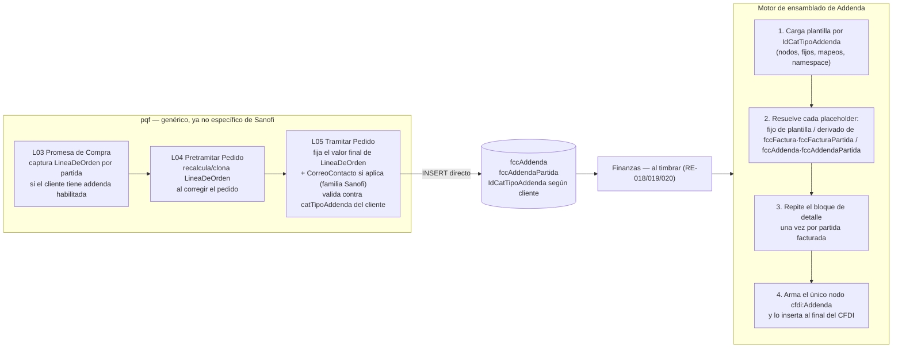

# Adenda de Factura — Impacto en Backend

**Referencia:** Continuación de `[PROPUESTA] Adenda de Factura.md` (Osmar) y de `[PROPUESTA] Adenda de Factura - Impacto en BD.md`.
**Fecha:** 2026-08-31
**Estado:** Propuesta — diseño de un proceso genérico en pqf (captura) y Finanzas (ensamblado) para integrar la addenda de cualquier cliente.

---

## 1. Objetivo

Definir el proceso genérico de backend para que **agregar la addenda de un cliente nuevo sea configuración, no desarrollo**: una fila de catálogo más una definición de plantilla, sin tocar el modelo de tablas ni reescribir transacciones de pqf.

Este documento asume el modelo de datos de `[PROPUESTA] Adenda de Factura - Impacto en BD.md` (`catTipoAddenda`, `fccAddenda`, `fccAddendaPartida`) y el **Camino 2** ahí recomendado: reemplazar las tablas específicas de Sanofi (`pp/tpPartidaPedidoAddendaSanofi`, `tpPedidoAddendaSanofi`) por el modelo genérico, escrito directamente por las transacciones de pqf.

---

## 2. Alcance

Dos componentes se ven afectados:

1. **pqf (ProquifaDotNet)** — las transacciones que hoy capturan/validan addenda de Sanofi (L03 Promesa de Compra, L04 Pretramitar Pedido, L05 Tramitar Pedido), que deben generalizarse a **cualquier** cliente con addenda habilitada.
2. **Finanzas** — el servicio de facturación/timbrado (RE-018/019/020) que hoy no ensambla ningún `cfdi:Addenda`, y que necesita un **motor de plantillas** capaz de armar el nodo correcto para cada uno de los 4 formatos (y los que se agreguen después) a partir de los datos de la factura y de `fccAddenda`/`fccAddendaPartida`.

Fuera de alcance de este documento: cambios de pantallas/UI (controllers CRUD de Sanofi, dashboard `vTramitarPedidoPartidaDetalle`) — quedan pendientes de un análisis de impacto en frontend si el negocio decide tocarlos en este mismo proyecto.

---

## 3. Diagrama de flujo propuesto



---

## 4. Cambios en pqf

### 4.1 Reemplazar el flag booleano por referencia al catálogo

Hoy `DatosFacturacionCliente` tiene dos flags: `AddendaDeLineaDeOrden` y `AddendaDeCorreo` (ambos inicializados en `false`). Se propone:

- Agregar `IdCatTipoAddenda` (nullable) a `DatosFacturacionCliente`, apuntando a `catTipoAddenda`. `null` = el cliente no usa addenda.
- Mantener (o derivar) las banderas finas a partir del catálogo: `catTipoAddenda.TieneDetallePorPartida` le dice a pqf si debe exigir `LineaDeOrden` por partida; una bandera equivalente a `AddendaDeCorreo` puede modelarse como una segunda columna en `catTipoAddenda` (`RequiereCorreoContacto bit`) en vez de vivir en el cliente, ya que hoy solo aplica a la familia Sanofi y es una característica del **formato**, no del cliente en particular.
- Esto es lo que permite que agregar un cliente nuevo con un formato **ya existente** (ej. otro cliente que también use el formato Sanofi) sea solo apuntar su `IdCatTipoAddenda` — cero código nuevo.

### 4.2 L03 — Promesa de Compra (`PretramitarPromesaDeCompraTransaccionBO.cs`)

- Donde hoy escribe `ppPartidaPedidoAddendaSanofi` solo si `AddendaDeLineaDeOrden=true`, cambiar la condición a "el cliente tiene `IdCatTipoAddenda` no nulo **y** `catTipoAddenda.TieneDetallePorPartida=true`".
- El INSERT deja de ir a la tabla Sanofi y va a `fccAddendaPartida` con `Clave='LineaDeOrden'`, `Valor=<línea calculada>`, `IdCatTipoAddenda=<el del cliente>`.
- Ya no depende de columnas específicas de Sanofi (`CuentaPuente`, correos) — esos campos, si el formato los requiere, se resuelven en L05 (ver 4.4), no en Promesa de Compra, igual que hoy.

### 4.3 L04 — Pretramitar Pedido (`PretramitarPedidoTransaccionBO.cs`, `ppPedidoCorregidoBO.cs`, `ppPedidoTramitacionConErroresTransaccionBO.cs`, `ppPedidoOcNoAmparadaCorreoTransaccioBO.cs`)

- Mismo cambio de condición que en 4.2.
- El clonado de addenda al corregir un pedido (`ppPedidoCorregidoBO.cs`) pasa a clonar filas de `fccAddendaPartida` (por `Clave`) en vez de filas de la tabla Sanofi.
- **Importante (hallazgo de Osmar, sigue vigente):** el valor de `LineaDeOrden` en esta etapa es intermedio — puede no coincidir con el valor final de Tramitar Pedido si hay reordenamiento de partidas. El modelo genérico no cambia esto: sigue siendo necesario que **L05 sea la fuente de verdad** del valor final (ver 4.4).

### 4.4 L05 — Tramitar Pedido (`tpPedidoTramitarTransaccionBO.cs`, método `ProcesarAddendaSanofi`)

Este método se **generaliza** (deja de llamarse `ProcesarAddendaSanofi`, pasa a ser p. ej. `ProcesarAddenda`):

1. Lee `catTipoAddenda` del cliente del pedido. Si `IdCatTipoAddenda` es `null`, no hace nada (comportamiento actual para clientes sin addenda).
2. Si `TieneDetallePorPartida=true`, recalcula y fija en `fccAddendaPartida` el valor final de `LineaDeOrden` por cada partida del pedido tramitado (mismo cálculo que hoy hace para Sanofi).
3. Si `RequiereCorreoContacto=true` (hoy solo la familia Sanofi), resuelve `CorreoContacto`: toma el correo de quien levantó la OC del cliente si existe; si no, usa el default definido en la plantilla de ese `IdCatTipoAddenda` (ej. `Paola.Espinoza@sanofi.com` para Sanofi) — y lo guarda en `fccAddenda`. Aplicar el default en pqf (al guardar) o en Finanzas (al ensamblar) es indistinto siempre que quede en un solo lugar; se recomienda resolverlo en Finanzas (el motor de plantillas ya necesita soportar valores por default para otros campos fijos, ver 5.3) para no duplicar la regla.
4. Mantiene la validación que ya existe hoy: si el cliente NO tiene addenda habilitada, ninguna partida debe traer valores de addenda.
5. El `INSERT`/`UPDATE` final es directo a `fccAddenda`/`fccAddendaPartida` — no hay tablas intermedias de Sanofi que sincronizar.

### 4.5 Eliminación de tablas y clases específicas de Sanofi

Una vez migrado (ver plan de rollout en sección 7), se retiran:

- Tablas `ppPartidaPedidoAddendaSanofi`, `tpPedidoAddendaSanofi`, `tpPartidaPedidoAddendaSanofi`.
- Cualquier entidad EF / `CrudBO<T>` específica de esas tablas.
- El método `ProcesarAddendaSanofi` se reemplaza por el genérico `ProcesarAddenda` (no se elimina, se generaliza).

---

## 5. Cambios en Finanzas — motor de ensamblado de Addenda

### 5.1 Por qué una plantilla declarativa y no una clase por cliente

Osmar proponía reconstruir en Finanzas algo equivalente a `AddendaFactory` + adaptadores por cliente (`AddendaAmeceFactory`, `AddendaAsofarmaFactory`, etc.) como **código nuevo**. Con el detalle exacto de los 4 formatos ya en mano, se propone ir un paso más allá: un **motor de plantillas data-driven**, donde agregar un cliente nuevo (o uno que reutiliza un formato existente) sea **agregar una definición**, no desplegar código.

Esto es viable precisamente porque la sección 3/4 del documento de BD mostró que la parte "difícil" de cada formato (namespaces, atributos fijos, nodos que se repiten) es siempre **estructura fija y conocida de antemano** — no requiere lógica condicional compleja en tiempo de ejecución, salvo un puñado de reglas simples (Serie I/P, TAX_CODE por tasa de IVA, noProveedor por empresa emisora) que son resolubles con un mapeo simple, no con código imperativo por cliente.

### 5.2 Forma de la definición de plantilla

Cada fila de `catTipoAddenda` tiene asociada una definición (puede vivir como un recurso versionado en Finanzas — archivo de configuración por `Clave` de catálogo, ej. `addenda-templates/MAVI.json`, `addenda-templates/SANOFI.json` — no en la base de datos de pqf, porque es responsabilidad de Finanzas, no de pqf). La definición declara:

- **Nodo raíz de la addenda** para ese cliente (nombre, si usa atributos o elementos hijos, namespace si aplica — ej. Pfizer y Asofarma serializan como atributos XML; Mavi y Sanofi como elementos hijos).
- **Bloque de cabecera:** lista de campos, cada uno con su origen: `fijo` (valor literal), `factura.<campo>` (tomado de `fccFactura`, ej. `factura.Moneda`, `factura.Folio`, `factura.Serie`), o `addenda.<Clave>` (tomado de `fccAddenda` por esa `Clave`, con `default` opcional).
- **Bloque de detalle** (si `TieneDetallePorPartida=true`): igual que cabecera pero con origen `partida.<campo>` (de `fccFacturaPartida`) o `addendaPartida.<Clave>` (de `fccAddendaPartida`), repetido una vez por cada partida facturada.
- **Reglas de mapeo simples** para los pocos casos condicionales (ej. `Serie`: `{"I": "A", "P": "P"}` sobre `factura.TipoComprobante`; `TAX_CODE`: `{"0": "F1", "default": "F2"}` sobre `partida.TasaImpuesto`; `noProveedor`: `{"PROVEEDORA": "220476", "GOLOCAER": "221961"}` sobre `factura.EmpresaEmisora`).

Con esto, los 4 formatos actuales se describen completos sin escribir una sola clase nueva por cliente — y agregar un cliente nuevo que reutilice, por ejemplo, el formato de Sanofi, es una fila en `catTipoAddenda` sin tocar la definición de plantilla existente.

### 5.3 Algoritmo de ensamblado (por factura, al timbrar)

1. Obtener `IdCatTipoAddenda` del pedido/cliente facturado. Si es `null`, no se agrega `cfdi:Addenda`.
2. Cargar la definición de plantilla correspondiente.
3. Resolver el bloque de cabecera: por cada campo, según su origen (fijo / `fccFactura` / `fccAddenda`), obtener el valor; aplicar `default` si el origen es `fccAddenda` y no hay fila.
4. Si `TieneDetallePorPartida=true`, por cada partida de `fccFacturaPartida` de esa factura, resolver el bloque de detalle de la misma forma (fijo / `fccFacturaPartida` / `fccAddendaPartida`).
5. Serializar según la forma declarada (atributos vs. elementos, namespace) y ensamblar el único nodo `cfdi:Addenda`, insertándolo al final del comprobante, después de `Conceptos` (y después de `Complemento`, según se ve en el ejemplo de Mavi del PDF).
6. Si el cliente no tiene `IdCatTipoAddenda`, el comportamiento es idéntico al actual (sin nodo de addenda).

### 5.4 Validación antes de timbrar

Antes de armar el XML, validar que existan todas las filas `addenda`/`addendaPartida` que la plantilla declara como **obligatorias sin default** (ej. `LineaDeOrden` por cada partida de un cliente con `TieneDetallePorPartida=true`). Si falta alguna, rechazar el timbrado con un mensaje claro en vez de generar un CFDI con addenda incompleta — esto reemplaza la validación que hoy hace `ProcesarAddendaSanofi` del lado de pqf, movida (o duplicada como defensa) al momento del ensamblado.

---

## 6. Casos de prueba sugeridos (usando los ejemplos reales del PDF como fixtures)

| Cliente                                            | Escenario                                              | Datos de ejemplo (del PDF)                                                                                   |
| -------------------------------------------------- | ------------------------------------------------------ | ------------------------------------------------------------------------------------------------------------ |
| Mavi                                               | Addenda de cabecera pura, sin detalle                  | Pedido `9586`, factura `A148237`, moneda `USD`, monto `953.52`, IVA `131.52`                                 |
| Pfizer                                             | 3 partidas, mismo `PO_NUMBER`                          | `PO_NUMBER=9501315099`, líneas 1–3, `TAX_CODE=F2` en las 3 (tasa de IVA ≠ 0)                                 |
| Pfizer                                             | Partida con tasa de IVA = 0                            | Verificar que `TAX_CODE` resuelva a `F1`                                                                     |
| Asofarma                                           | 4 partidas, emisor Proveedora                          | `folio=139732`, `ordenCompra=OC076015`, `noProveedor=220476`                                                 |
| Asofarma                                           | Emisor Golocaer                                        | Verificar que `noProveedor` resuelva a `221961`                                                              |
| Sanofi                                             | Cabecera + 1 detalle, con correo de contacto capturado | `NUM_ORDEN=C000191021`, `MONEDA=USD`, `CORREO_SANOFI=Paola.Espinoza@sanofi.com` (ejemplo trae el default)    |
| Sanofi                                             | Correo de contacto SÍ capturado (no usar default)      | Verificar que se use el correo real cuando `fccAddenda` tiene la fila `CorreoContacto`                       |
| Sanofi Pasteur / Azteca Vacunas                    | Mismo formato que Sanofi                               | Confirmar (pendiente #2 del doc de BD) si comparten o no los valores fijos (`NUM_PROVEEDOR`, correo default) |
| Cliente sin addenda                                | No debe generarse `cfdi:Addenda`                       | Cualquier cliente con `IdCatTipoAddenda=null`                                                                |
| Cliente con addenda pero falta un dato obligatorio | Debe rechazar el timbrado                              | Partida sin fila `LineaDeOrden` en `fccAddendaPartida` para un cliente con `TieneDetallePorPartida=true`     |

---

## 7. Plan de rollout sugerido

1. Crear `catTipoAddenda`, `fccAddenda`, `fccAddendaPartida` (esquema de BD, ver documento de BD) sin retirar aún las tablas Sanofi.
2. Generalizar L03/L04/L05 en pqf para escribir en **ambos** modelos (tablas Sanofi + tablas nuevas) durante un periodo de transición corto, para poder comparar resultados sin riesgo.
3. Construir el motor de plantillas en Finanzas y las 4 definiciones (Mavi, Pfizer, Asofarma, Sanofi) a partir de este documento.
4. Validar en un ambiente controlado que el XML generado por el motor coincide exactamente con los ejemplos del PDF (byte a byte en los nodos de addenda).
5. Resolver los pendientes de la sección 6 del documento de BD (Amece, catálogo por cliente vs. por formato, `CUENTA_PUENTE`, mapeo de unidad de medida, mapeo de emisor de Asofarma) antes de apagar la escritura dual.
6. Apagar la escritura a las tablas Sanofi, dejar solo el modelo genérico; retirar las tablas viejas en un cambio posterior una vez confirmado que no hay dependencias de reportes/consultas sobre ellas (recordar el dashboard `vTramitarPedidoPartidaDetalle` mencionado por Osmar).

---

## 8. Pendientes

- Definir dónde vive exactamente la definición de plantilla (¿archivo de configuración versionado en el repo de Finanzas, tabla de configuración propia de Finanzas, o motor externo?) — este documento asume un archivo de configuración por `Clave` de `catTipoAddenda`, pero es una decisión de arquitectura de Finanzas que no compete a pqf.
- Confirmar el mecanismo exacto de escritura de pqf hacia `fccAddenda`/`fccAddendaPartida` si estas tablas viven en la base de datos de Finanzas y no en la de pqf (¿INSERT directo cross-database, o vía un endpoint de Finanzas?) — mismo pendiente que dejó abierto Osmar.
- Impacto en frontend (pantallas/controllers CRUD de Sanofi) — queda fuera de este documento; requiere su propio análisis si se decide tocar UI en este proyecto.
- Validar con Finanzas el orden exacto de inserción del nodo `cfdi:Addenda` respecto a otros complementos, replicando el ejemplo de Mavi del PDF (aparece después de `cfdi:Complemento`).

---

## 9. Código de referencia (.NET 10)

Este código ilustra el diseño de la sección 5 con clases reales, siguiendo los estándares de
construcción de Ryndem (`ryndem-dotnet`: Domain sin dependencias externas, `Result`/`Result<T>` para
fallos esperados, catálogo de errores centralizado). Vive en la capa **Domain** — por eso está en
español, igual que el esquema de BD y el resto de este documento — y es la pieza central del diseño:
el resto de la implementación (DTOs, Entity Framework, el controller HTTP, las pruebas) es boilerplate
de la arquitectura, no parte específica de esta propuesta, así que no se incluye aquí para no diluir lo
importante. La solución de referencia completa, con todas las capas, quedó guardada en
`Codigo/Addenda-BackendCode.zip` dentro de esta misma carpeta, por si sirve como punto de partida al
integrarlo al repositorio real de Finanzas — **no se compiló en el entorno donde se generó** (sin SDK
de .NET disponible), así que antes de usarla hay que correr `dotnet build`/`dotnet test` normalmente.

### 9.1 Entidades (mapean 1:1 las tablas de la sección 5 del documento de BD)

```csharp
namespace Addenda.Domain.Entities;

/// <summary>
/// Catálogo de formatos de addenda soportados (<c>catTipoAddenda</c>). Identifica el formato de
/// un cliente y si tiene nivel de detalle por partida o requiere correo de contacto — lo que le
/// permite a pqf y al motor de ensamblado decidir sin adivinar.
/// </summary>
public class TipoAddenda
{
    public Guid IdCatTipoAddenda { get; set; }

    /// <summary>Clave corta del formato: MAVI, PFIZER, ASOFARMA, SANOFI.</summary>
    public required string Clave { get; set; }

    public required string Descripcion { get; set; }

    /// <summary>Si el formato repite un bloque de detalle una vez por partida.</summary>
    public bool TieneDetallePorPartida { get; set; }

    /// <summary>Si el formato exige un correo de contacto a nivel de pedido (con default).</summary>
    public bool RequiereCorreoContacto { get; set; }

    public bool Activo { get; set; } = true;
}
```

```csharp
namespace Addenda.Domain.Entities;

/// <summary>
/// Valor genérico de addenda a nivel pedido (<c>fccAddenda</c>). Un pedido puede tener varias
/// filas — una por <see cref="Clave"/> — porque el modelo guarda pares Clave/Valor atómicos y
/// agnósticos al cliente en lugar de columnas específicas.
/// </summary>
public class AddendaCabecera
{
    public Guid IdFccAddenda { get; set; }

    /// <summary>El pedido origen (tpPedido) al que pertenece este valor.</summary>
    public required Guid IdTPPedido { get; set; }

    public required Guid IdCatTipoAddenda { get; set; }

    /// <summary>Nombre del campo tal como lo espera la plantilla del cliente (p. ej. "CorreoContacto").</summary>
    public required string Clave { get; set; }

    /// <summary>El valor de ese campo, ya listo para insertarse en el XML.</summary>
    public required string Valor { get; set; }

    public DateTime? FechaGeneracion { get; set; }

    public DateTime FechaRegistro { get; set; }

    public DateTime FechaUltimaActualizacion { get; set; }
}
```

```csharp
namespace Addenda.Domain.Entities;

/// <summary>
/// Valor genérico de addenda a nivel partida (<c>fccAddendaPartida</c>). No depende de
/// <see cref="AddendaCabecera"/> — está anclada directo a la partida y al catálogo, porque una
/// partida puede existir sin que haya valores de cabecera para ese pedido (ver Mavi, que no usa
/// esta tabla en absoluto por no tener nivel de detalle).
/// </summary>
public class AddendaDetalle
{
    public Guid IdFccAddendaPartida { get; set; }

    /// <summary>La partida origen (tpPartidaPedido) a la que pertenece este valor.</summary>
    public required Guid IdTPPartidaPedido { get; set; }

    public required Guid IdCatTipoAddenda { get; set; }

    /// <summary>Nombre del campo tal como lo espera la plantilla del cliente (p. ej. "LineaDeOrden").</summary>
    public required string Clave { get; set; }

    /// <summary>El valor de ese campo para esa partida.</summary>
    public required string Valor { get; set; }

    public DateTime FechaRegistro { get; set; }

    public DateTime FechaUltimaActualizacion { get; set; }
}
```

### 9.2 Modelo de plantillas — lo que hace que agregar un cliente sea configuración, no código

```csharp
namespace Addenda.Domain.Templates;

/// <summary>
/// De dónde sale el valor de un campo de la plantilla de un cliente. Es la clasificación central
/// del análisis: la mayoría de los campos que exigen los formatos de addenda son <see cref="Fijo"/>
/// o <see cref="Derivado"/> — muy pocos son <see cref="Genuino"/> (datos que solo existen para la
/// addenda). Ver secciones 2 a 4 del documento de BD.
/// </summary>
public enum OrigenCampoAddenda
{
    /// <summary>Constante propia del formato del cliente. No cambia entre transacciones.</summary>
    Fijo,

    /// <summary>
    /// Ya existe en los datos de la factura o de la partida (fccFactura/fccFacturaPartida). El
    /// motor lo toma del contexto que se le entrega, no de una tabla de addenda.
    /// </summary>
    Derivado,

    /// <summary>
    /// No existe en ningún otro lado: requiere una fila en fccAddenda o fccAddendaPartida.
    /// Puede tener un valor por default para cuando no se capturó.
    /// </summary>
    Genuino,
}
```

```csharp
namespace Addenda.Domain.Templates;

/// <summary>
/// Cómo se serializa un campo dentro de su nodo XML. Pfizer y Asofarma usan atributos; Mavi y
/// Sanofi usan elementos hijos — el motor debe soportar ambas formas sin código distinto por
/// cliente.
/// </summary>
public enum FormaSerializacion
{
    Atributo,
    Elemento,
}
```

```csharp
namespace Addenda.Domain.Templates;

/// <summary>
/// Definición declarativa de un campo dentro de un nodo de la plantilla de un cliente. El motor de
/// ensamblado interpreta esta definición sin conocer al cliente concreto — la única parte
/// específica de cada cliente es la data, no el código.
/// </summary>
/// <param name="NombreCampo">Nombre del atributo o elemento en el XML final (p. ej. "LINE_NO").</param>
/// <param name="Origen">De dónde sale el valor.</param>
/// <param name="FormaSerializacion">Si se serializa como atributo o como elemento hijo.</param>
/// <param name="ValorFijo">Requerido cuando <paramref name="Origen"/> es <see cref="OrigenCampoAddenda.Fijo"/>.</param>
/// <param name="NombreOrigen">
/// Requerido cuando <paramref name="Origen"/> es <see cref="OrigenCampoAddenda.Derivado"/>: la clave
/// del campo dentro del contexto de factura o de partida que entrega la capa de aplicación.
/// </param>
/// <param name="ClaveGenuina">
/// Solo para <see cref="OrigenCampoAddenda.Genuino"/>: la Clave a buscar en fccAddenda/fccAddendaPartida.
/// Si es null, se usa <paramref name="NombreCampo"/> como Clave.
/// </param>
/// <param name="ValorPorDefecto">
/// Solo para <see cref="OrigenCampoAddenda.Genuino"/>: valor a usar si no se capturó. Si es null y el
/// valor no existe, el campo es obligatorio y su ausencia hace fallar el ensamblado.
/// </param>
/// <param name="Regla">
/// Mapeo condicional opcional aplicado sobre el valor ya resuelto (p. ej. tasa de IVA → TAX_CODE).
/// La clave <c>"*"</c> es el valor por default del mapeo cuando ningún otro caso coincide.
/// </param>
public sealed record AddendaCampoDefinicion(
    string NombreCampo,
    OrigenCampoAddenda Origen,
    FormaSerializacion FormaSerializacion,
    string? ValorFijo = null,
    string? NombreOrigen = null,
    string? ClaveGenuina = null,
    string? ValorPorDefecto = null,
    IReadOnlyDictionary<string, string>? Regla = null)
{
    public static AddendaCampoDefinicion Fijo(string nombreCampo, string valor, FormaSerializacion forma) =>
        new(nombreCampo, OrigenCampoAddenda.Fijo, forma, ValorFijo: valor);

    public static AddendaCampoDefinicion Derivado(
        string nombreCampo,
        string nombreOrigen,
        FormaSerializacion forma,
        IReadOnlyDictionary<string, string>? regla = null) =>
        new(nombreCampo, OrigenCampoAddenda.Derivado, forma, NombreOrigen: nombreOrigen, Regla: regla);

    public static AddendaCampoDefinicion Genuino(
        string nombreCampo,
        FormaSerializacion forma,
        string? claveGenuina = null,
        string? valorPorDefecto = null) =>
        new(nombreCampo, OrigenCampoAddenda.Genuino, forma, ClaveGenuina: claveGenuina, ValorPorDefecto: valorPorDefecto);
}
```

```csharp
namespace Addenda.Domain.Templates;

/// <summary>
/// Definición declarativa de un nodo XML dentro de la plantilla de un cliente. Un árbol de estos
/// nodos describe formatos tan distintos como Mavi (un solo nodo de cabecera, sin detalle) y Sanofi
/// (un nodo con namespace, un hijo de cabecera y un hijo que se repite por partida) con el mismo
/// modelo — la variación es de datos, no de código.
/// </summary>
/// <param name="Nombre">Nombre del nodo XML, con prefijo de namespace si aplica (p. ej. "sanofi:header").</param>
/// <param name="Campos">Campos propios de este nodo.</param>
/// <param name="Hijos">Nodos hijos, en el orden en que deben aparecer en el XML.</param>
/// <param name="AtributosFijosDeNodo">
/// Atributos siempre constantes de este nodo (típicamente declaraciones de namespace).
/// </param>
/// <param name="SeRepitePorPartida">
/// Si es verdadero, este nodo se genera una vez por cada partida de la factura, usando el contexto
/// de esa partida en lugar del contexto de cabecera para resolver sus campos.
/// </param>
public sealed record AddendaNodoDefinicion(
    string Nombre,
    IReadOnlyList<AddendaCampoDefinicion> Campos,
    IReadOnlyList<AddendaNodoDefinicion>? Hijos = null,
    IReadOnlyDictionary<string, string>? AtributosFijosDeNodo = null,
    bool SeRepitePorPartida = false);
```

```csharp
namespace Addenda.Domain.Templates;

/// <summary>
/// Plantilla completa de un formato de addenda: qué forma tiene el nodo raíz que va dentro de
/// <c>cfdi:Addenda</c> para un cliente dado. Corresponde una a una con una fila de
/// <c>catTipoAddenda</c>.
/// </summary>
/// <param name="ClaveTipoAddenda">La Clave del catálogo (MAVI, PFIZER, ASOFARMA, SANOFI).</param>
/// <param name="NodoRaiz">El nodo que se inserta directo bajo <c>cfdi:Addenda</c>.</param>
public sealed record AddendaTemplateDefinition(string ClaveTipoAddenda, AddendaNodoDefinicion NodoRaiz);
```

### 9.3 El motor de ensamblado

El contexto que arma la capa de aplicación a partir de la factura real (`fccFactura`/`fccFacturaPartida`)
y de los valores genuinos ya capturados (`fccAddenda`/`fccAddendaPartida`):

```csharp
namespace Addenda.Domain.Assembly;

/// <param name="IdTPPedido">El pedido facturado.</param>
/// <param name="CamposDerivados">
/// Valores de cabecera que ya existen en la factura (moneda, folio, serie, total, IVA, RFC
/// emisor...), indexados por el <c>NombreOrigen</c> que declara la plantilla.
/// </param>
/// <param name="ValoresGenuinos">
/// Valores de cabecera capturados específicamente para addenda en <c>fccAddenda</c> (p. ej.
/// "CorreoContacto"), indexados por <c>Clave</c>.
/// </param>
/// <param name="Partidas">El contexto de cada partida facturada, en el orden en que deben repetirse.</param>
public sealed record FacturaAddendaContexto(
    Guid IdTPPedido,
    IReadOnlyDictionary<string, string> CamposDerivados,
    IReadOnlyDictionary<string, string> ValoresGenuinos,
    IReadOnlyList<PartidaAddendaContexto> Partidas);

/// <param name="IdTPPartidaPedido">La partida origen.</param>
/// <param name="CamposDerivados">
/// Valores que ya existen en la partida facturada (importe, cantidad, unidad de medida, tasa de
/// IVA...), indexados por el <c>NombreOrigen</c> que declara la plantilla.
/// </param>
/// <param name="ValoresGenuinos">
/// Valores capturados específicamente para addenda en <c>fccAddendaPartida</c> para esta partida
/// (p. ej. "LineaDeOrden"), indexados por <c>Clave</c>.
/// </param>
public sealed record PartidaAddendaContexto(
    Guid IdTPPartidaPedido,
    IReadOnlyDictionary<string, string> CamposDerivados,
    IReadOnlyDictionary<string, string> ValoresGenuinos);
```

El árbol neutral que produce el motor (sin ninguna dependencia de `System.Xml`: eso lo resuelve un
serializador aparte, del lado de infraestructura):

```csharp
namespace Addenda.Domain.Assembly;

public sealed class AddendaXmlNodo
{
    public required string Nombre { get; init; }

    /// <summary>Contenido de texto del nodo, cuando el campo se serializa como elemento hoja.</summary>
    public string? Valor { get; init; }

    public IReadOnlyDictionary<string, string> Atributos { get; init; } = new Dictionary<string, string>();

    public IReadOnlyList<AddendaXmlNodo> Hijos { get; init; } = [];
}
```

El motor sigue el patrón `Result`/`Result<T>` de Ryndem: un flujo esperado (falta un dato
obligatorio, una regla sin mapeo) nunca es una excepción, es un `Result` fallido con un código de un
catálogo centralizado. Los 4 códigos que puede producir el motor:

```csharp
namespace Addenda.Domain.Errors;

public static class AddendaErrors
{
    public static class Cabecera
    {
        public static readonly ErrorDefinition FaltaValorObligatorio = new(
            Code: "ADD-003",
            Title: "Required addenda value is missing",
            Description: "La plantilla del cliente exige un valor de cabecera que no tiene default y no fue capturado.",
            Category: ErrorCategory.Business, Severity: ErrorSeverity.Medium, HttpStatusCode: 422);
    }

    public static class Partida
    {
        public static readonly ErrorDefinition FaltaValorObligatorio = new(
            Code: "ADD-004",
            Title: "Required addenda value is missing for a line item",
            Description: "La plantilla del cliente exige un valor de detalle que no tiene default y no fue capturado para una partida.",
            Category: ErrorCategory.Business, Severity: ErrorSeverity.Medium, HttpStatusCode: 422);
    }

    public static class Ensamblado
    {
        public static readonly ErrorDefinition DatosDeFacturaNoEncontrados = new(
            Code: "ADD-005",
            Title: "Invoice data not found for addenda assembly",
            Description: "No se encontraron los datos de factura/partida necesarios para ensamblar la addenda del pedido indicado.",
            Category: ErrorCategory.Resource, Severity: ErrorSeverity.Low, HttpStatusCode: 404);

        public static readonly ErrorDefinition ValorSinMapeoEnRegla = new(
            Code: "ADD-006",
            Title: "Addenda template rule has no mapping for the resolved value",
            Description: "La regla condicional de un campo de la plantilla no define un mapeo para el valor resuelto, ni tiene un valor por default (\"*\").",
            Category: ErrorCategory.Business, Severity: ErrorSeverity.Medium, HttpStatusCode: 422);
    }

    // Catálogo completo (incluye VAL-001, ADD-001, ADD-002, INF-001, UNX-001) en el código de referencia.
}
```

Y el motor mismo — la única pieza que sabe recorrer un árbol de plantilla, sin conocer a ningún
cliente en particular:

```csharp
using Addenda.Domain.Common;
using Addenda.Domain.Errors;
using Addenda.Domain.Templates;

namespace Addenda.Domain.Assembly;

/// <summary>
/// El motor genérico de ensamblado de addenda. Interpreta una <see cref="AddendaTemplateDefinition"/>
/// sin conocer al cliente concreto: resuelve cada campo según su origen (fijo, derivado o genuino),
/// repite el nodo de detalle una vez por partida y produce un árbol neutral
/// (<see cref="AddendaXmlNodo"/>) listo para que la infraestructura lo serialice.
/// </summary>
public static class AddendaAssembler
{
    public static Result<AddendaXmlNodo> Ensamblar(AddendaTemplateDefinition plantilla, FacturaAddendaContexto contexto) =>
        ResolverNodo(plantilla.NodoRaiz, contexto, partidaActual: null);

    /// <summary>
    /// Validación previa al timbrado (tarea BE-7): recorre la plantilla igual que
    /// <see cref="Ensamblar"/>, pero descarta el árbol resultante. Falla con el mismo código que
    /// fallaría el ensamblado real, para identificar el dato faltante antes de generar el XML.
    /// </summary>
    public static Result Validar(AddendaTemplateDefinition plantilla, FacturaAddendaContexto contexto)
    {
        var resultado = Ensamblar(plantilla, contexto);
        return resultado.IsSuccess ? Result.Ok() : Result.Fail(resultado.Error);
    }

    private static Result<AddendaXmlNodo> ResolverNodo(
        AddendaNodoDefinicion nodoDef,
        FacturaAddendaContexto factura,
        PartidaAddendaContexto? partidaActual)
    {
        var atributos = nodoDef.AtributosFijosDeNodo is null
            ? new Dictionary<string, string>()
            : new Dictionary<string, string>(nodoDef.AtributosFijosDeNodo);

        var hijosResultantes = new List<AddendaXmlNodo>();

        foreach (var campo in nodoDef.Campos)
        {
            var valorResuelto = ResolverCampo(campo, factura, partidaActual);
            if (valorResuelto.IsFailure)
            {
                return Result.Fail<AddendaXmlNodo>(valorResuelto.Error);
            }

            if (campo.FormaSerializacion == FormaSerializacion.Atributo)
            {
                atributos[campo.NombreCampo] = valorResuelto.Value;
            }
            else
            {
                hijosResultantes.Add(new AddendaXmlNodo { Nombre = campo.NombreCampo, Valor = valorResuelto.Value });
            }
        }

        foreach (var hijoDef in nodoDef.Hijos ?? [])
        {
            if (hijoDef.SeRepitePorPartida)
            {
                foreach (var partida in factura.Partidas)
                {
                    var resultadoHijo = ResolverNodo(hijoDef, factura, partida);
                    if (resultadoHijo.IsFailure)
                    {
                        return Result.Fail<AddendaXmlNodo>(resultadoHijo.Error);
                    }

                    hijosResultantes.Add(resultadoHijo.Value);
                }
            }
            else
            {
                var resultadoHijo = ResolverNodo(hijoDef, factura, partidaActual);
                if (resultadoHijo.IsFailure)
                {
                    return Result.Fail<AddendaXmlNodo>(resultadoHijo.Error);
                }

                hijosResultantes.Add(resultadoHijo.Value);
            }
        }

        return Result.Ok(new AddendaXmlNodo
        {
            Nombre = nodoDef.Nombre,
            Atributos = atributos,
            Hijos = hijosResultantes,
        });
    }

    private static Result<string> ResolverCampo(
        AddendaCampoDefinicion campo,
        FacturaAddendaContexto factura,
        PartidaAddendaContexto? partidaActual)
    {
        string valorBase;

        switch (campo.Origen)
        {
            case OrigenCampoAddenda.Fijo:
                valorBase = campo.ValorFijo
                    ?? throw new InvalidOperationException(
                        $"El campo '{campo.NombreCampo}' está declarado como Fijo pero no tiene ValorFijo.");
                break;

            case OrigenCampoAddenda.Derivado:
                var camposDerivados = partidaActual?.CamposDerivados ?? factura.CamposDerivados;
                if (campo.NombreOrigen is null || !camposDerivados.TryGetValue(campo.NombreOrigen, out var derivado))
                {
                    return Result.Fail<string>(AddendaErrors.Ensamblado.DatosDeFacturaNoEncontrados);
                }

                valorBase = derivado;
                break;

            case OrigenCampoAddenda.Genuino:
                var claveGenuina = campo.ClaveGenuina ?? campo.NombreCampo;
                var valoresGenuinos = partidaActual?.ValoresGenuinos ?? factura.ValoresGenuinos;
                if (valoresGenuinos.TryGetValue(claveGenuina, out var capturado))
                {
                    valorBase = capturado;
                }
                else if (campo.ValorPorDefecto is not null)
                {
                    valorBase = campo.ValorPorDefecto;
                }
                else
                {
                    // Es exactamente el hallazgo obligatorio-sin-default que valida BE-7: falta un
                    // dato genuino que la plantilla del cliente exige y que nadie capturó.
                    var errorFaltante = partidaActual is not null
                        ? AddendaErrors.Partida.FaltaValorObligatorio
                        : AddendaErrors.Cabecera.FaltaValorObligatorio;
                    return Result.Fail<string>(errorFaltante);
                }

                break;

            default:
                throw new ArgumentOutOfRangeException(nameof(campo), campo.Origen, "Origen de campo de addenda no reconocido.");
        }

        if (campo.Regla is not null)
        {
            if (campo.Regla.TryGetValue(valorBase, out var mapeado))
            {
                return Result.Ok(mapeado);
            }

            if (campo.Regla.TryGetValue("*", out var porDefecto))
            {
                return Result.Ok(porDefecto);
            }

            return Result.Fail<string>(AddendaErrors.Ensamblado.ValorSinMapeoEnRegla);
        }

        return Result.Ok(valorBase);
    }
}
```

### 9.4 Dos plantillas reales de ejemplo

Cada cliente es una definición de datos, no una clase de lógica — así se ven las 2 más distintas
entre sí: la más simple (Mavi) y la más completa (Sanofi, con namespace propio y detalle repetido).

**Mavi** — cabecera pura, sin detalle por partida, cero campos genuinos (ver sección 3.1 del
documento de BD):

```csharp
using Addenda.Domain.Assembly;
using Addenda.Domain.Templates;

namespace Addenda.Infrastructure.Templates.Definitions;

internal static class MaviAddendaTemplateFactory
{
    private const string Clave = "MAVI";

    public static AddendaTemplateDefinition Crear()
    {
        var nodoRaiz = new AddendaNodoDefinicion(
            Nombre: "Mavi",
            Campos:
            [
                AddendaCampoDefinicion.Derivado("RfcProveedor", ClavesDeCamposDerivados.Factura.RfcEmisor, FormaSerializacion.Elemento),
                AddendaCampoDefinicion.Fijo("NumProveedor", "704", FormaSerializacion.Elemento),
                AddendaCampoDefinicion.Derivado("FechaFacturacion", ClavesDeCamposDerivados.Factura.FechaFacturacion, FormaSerializacion.Elemento),
                AddendaCampoDefinicion.Derivado("NumPedido", ClavesDeCamposDerivados.Factura.NumeroOrdenCompraCliente, FormaSerializacion.Elemento),
                AddendaCampoDefinicion.Derivado("CodMoneda", ClavesDeCamposDerivados.Factura.Moneda, FormaSerializacion.Elemento),
                AddendaCampoDefinicion.Derivado("MontoTotal", ClavesDeCamposDerivados.Factura.Total, FormaSerializacion.Elemento),
                AddendaCampoDefinicion.Derivado("IVA", ClavesDeCamposDerivados.Factura.MontoIva, FormaSerializacion.Elemento),
                AddendaCampoDefinicion.Derivado("PorcentajeIVA", ClavesDeCamposDerivados.Factura.TasaIva, FormaSerializacion.Elemento),
                // NumFactura = serie concatenada con folio (p. ej. "A148237"): ya viaja armado en
                // Factura.NumeroFactura — el motor no concatena, así que ese valor debe llegar
                // ya formado desde Application.
                AddendaCampoDefinicion.Derivado("NumFactura", ClavesDeCamposDerivados.Factura.NumeroFactura, FormaSerializacion.Elemento),
                // Serie: "A" para Ingreso ("I"), "P" para Pago ("P") — regla fija de 2 valores
                // tomada literal del PDF. "*" cubre cualquier otro tipo con el default del legacy.
                AddendaCampoDefinicion.Derivado(
                    "Serie",
                    ClavesDeCamposDerivados.Factura.TipoComprobante,
                    FormaSerializacion.Elemento,
                    regla: new Dictionary<string, string> { ["I"] = "A", ["P"] = "P", ["*"] = "A" }),
                AddendaCampoDefinicion.Derivado("Folio", ClavesDeCamposDerivados.Factura.Folio, FormaSerializacion.Elemento),
            ]);

        return new AddendaTemplateDefinition(Clave, nodoRaiz);
    }
}
```

**Sanofi / Sanofi Pasteur / Azteca Vacunas** — namespace propio, cabecera + detalle repetido por
partida, y los 2 únicos campos genuinos de todo el análisis (`CorreoContacto`, `LineaDeOrden`) más el
pendiente de `CUENTA_PUENTE` (ver secciones 3.4, 4 y 6 del documento de BD):

```csharp
using Addenda.Domain.Assembly;
using Addenda.Domain.Templates;

namespace Addenda.Infrastructure.Templates.Definitions;

/// <remarks>
/// Recibe <paramref name="clave"/>/<paramref name="numeroProveedor"/>/<paramref name="correoContactoPorDefecto"/>
/// en vez de darlos por fijos para los 3 clientes: el doc de BD (pendiente #2) deja abierto si
/// Sanofi Pasteur y Azteca Vacunas usan un NUM_PROVEEDOR o correo default distintos.
/// </remarks>
internal static class SanofiAddendaTemplateFactory
{
    private const string NamespaceUri = "https://mexico.sanofi.com/schemas";
    private const string XsiNamespaceUri = "http://www.w3.org/2001/XMLSchema-instance";

    public static AddendaTemplateDefinition Crear(string clave, string numeroProveedor, string correoContactoPorDefecto)
    {
        var header = new AddendaNodoDefinicion(
            Nombre: "sanofi:header",
            Campos:
            [
                AddendaCampoDefinicion.Fijo("sanofi:TIPO_DOCTO", "01", FormaSerializacion.Elemento),
                AddendaCampoDefinicion.Derivado("sanofi:NUM_ORDEN", ClavesDeCamposDerivados.Factura.NumeroOrdenCompraCliente, FormaSerializacion.Elemento),
                AddendaCampoDefinicion.Fijo("sanofi:NUM_PROVEEDOR", numeroProveedor, FormaSerializacion.Elemento),
                AddendaCampoDefinicion.Fijo("sanofi:FCTCONV", "1.000", FormaSerializacion.Elemento),
                AddendaCampoDefinicion.Derivado("sanofi:MONEDA", ClavesDeCamposDerivados.Factura.Moneda, FormaSerializacion.Elemento),
                AddendaCampoDefinicion.Fijo("sanofi:CTA_CORREO", "credito@proquifa.com.mx", FormaSerializacion.Elemento),
                // El PDF exige el nodo siempre presente y vacío/autocerrado — cadena vacía, nunca null.
                AddendaCampoDefinicion.Fijo("sanofi:IMP_RETENCION", string.Empty, FormaSerializacion.Elemento),
                AddendaCampoDefinicion.Derivado("sanofi:IMP_TOTAL", ClavesDeCamposDerivados.Factura.Total, FormaSerializacion.Elemento),
                AddendaCampoDefinicion.Fijo("sanofi:DISPONIBLE_1", "0.00", FormaSerializacion.Elemento),
                AddendaCampoDefinicion.Fijo("sanofi:DISPONIBLE_2", "0.00", FormaSerializacion.Elemento),
                AddendaCampoDefinicion.Fijo("sanofi:DISPONIBLE_3", "0.00", FormaSerializacion.Elemento),
                AddendaCampoDefinicion.Fijo("sanofi:DISPONIBLE_4", "0.00", FormaSerializacion.Elemento),
                // Único campo genuino de cabecera de todo el análisis.
                AddendaCampoDefinicion.Genuino(
                    "sanofi:CORREO_SANOFI",
                    FormaSerializacion.Elemento,
                    claveGenuina: "CorreoContacto",
                    valorPorDefecto: correoContactoPorDefecto),
            ]);

        var details = new AddendaNodoDefinicion(
            Nombre: "sanofi:details",
            SeRepitePorPartida: true,
            Campos:
            [
                // Mismo concepto que "LineaDeOrden" en los demás formatos.
                AddendaCampoDefinicion.Genuino("sanofi:NUM_LINEA", FormaSerializacion.Elemento, claveGenuina: "LineaDeOrden"),
                AddendaCampoDefinicion.Fijo("sanofi:NUM_ENTRADA", "0000000000", FormaSerializacion.Elemento),
                // Doc de BD, pendiente #3: el PDF dice que siempre es "0000000000"; se modela como
                // Genuino con ese default para no perder la posibilidad de capturarlo si el
                // pendiente se resuelve a favor de que sí varía.
                AddendaCampoDefinicion.Genuino(
                    "sanofi:CUENTA_PUENTE",
                    FormaSerializacion.Elemento,
                    claveGenuina: "CuentaPuente",
                    valorPorDefecto: "0000000000"),
                AddendaCampoDefinicion.Derivado("sanofi:UNIDADES", ClavesDeCamposDerivados.Partida.Cantidad, FormaSerializacion.Elemento),
                AddendaCampoDefinicion.Derivado("sanofi:PRECIO_UNITARIO", ClavesDeCamposDerivados.Partida.PrecioUnitario, FormaSerializacion.Elemento),
                AddendaCampoDefinicion.Derivado("sanofi:IMPORTE", ClavesDeCamposDerivados.Partida.Importe, FormaSerializacion.Elemento),
                // Doc de BD, pendiente #4: espera el texto que usa Sanofi (p. ej. "Pieza"), no el
                // IdCatUnidad interno — ese mapeo de catálogo se asume resuelto antes de llegar aquí.
                AddendaCampoDefinicion.Derivado("sanofi:UNIDAD_MEDIDA", ClavesDeCamposDerivados.Partida.UnidadDeMedida, FormaSerializacion.Elemento),
                AddendaCampoDefinicion.Derivado("sanofi:TASA_IVA", ClavesDeCamposDerivados.Partida.TasaIva, FormaSerializacion.Elemento),
                AddendaCampoDefinicion.Derivado("sanofi:IMPORTE_IVA", ClavesDeCamposDerivados.Partida.MontoIva, FormaSerializacion.Elemento),
                AddendaCampoDefinicion.Fijo("sanofi:DISPONIBLE_1", "0", FormaSerializacion.Elemento),
                AddendaCampoDefinicion.Fijo("sanofi:DISPONIBLE_2", "0", FormaSerializacion.Elemento),
                AddendaCampoDefinicion.Fijo("sanofi:DISPONIBLE_3", "0", FormaSerializacion.Elemento),
                AddendaCampoDefinicion.Fijo("sanofi:DISPONIBLE_4", "0", FormaSerializacion.Elemento),
                AddendaCampoDefinicion.Fijo("sanofi:DISPONIBLE_5", "0", FormaSerializacion.Elemento),
                AddendaCampoDefinicion.Fijo("sanofi:DISPONIBLE_6", "0", FormaSerializacion.Elemento),
            ]);

        var raiz = new AddendaNodoDefinicion(
            Nombre: "sanofi:sanofi",
            Campos: [],
            Hijos: [header, details],
            AtributosFijosDeNodo: new Dictionary<string, string>
            {
                // Se declaran ambos namespaces (sanofi y xsi) directo en el nodo raíz: al ser un
                // fragmento que Finanzas inserta dentro de un cfdi:Comprobante ya existente, no se
                // puede depender de que "xsi" haya quedado en alcance más arriba.
                ["xmlns:sanofi"] = NamespaceUri,
                ["xmlns:xsi"] = XsiNamespaceUri,
                ["version"] = "1.0",
                ["xsi:schemaLocation"] = $"{NamespaceUri} {NamespaceUri}/sanofi.xsd",
            });

        return new AddendaTemplateDefinition(clave, raiz);
    }
}
```

Agregar un cliente nuevo que reutiliza el formato Sanofi (por ejemplo, si Sanofi Pasteur confirma
que usa los mismos valores fijos) es una línea más al registrar las plantillas —
`SanofiAddendaTemplateFactory.Crear("SANOFI_PASTEUR", "0001050470", "Paola.Espinoza@sanofi.com")` —
sin tocar ninguna clase existente. Pfizer y Asofarma siguen el mismo patrón que Mavi y Sanofi (una
factory por formato, campos declarados como Fijo/Derivado/Genuino) y están completas en el código de
referencia (`Codigo/Addenda-BackendCode.zip`), junto con el serializador XML, los DTOs de
Application, el controller HTTP, Entity Framework y las pruebas contra los ejemplos reales del PDF.
