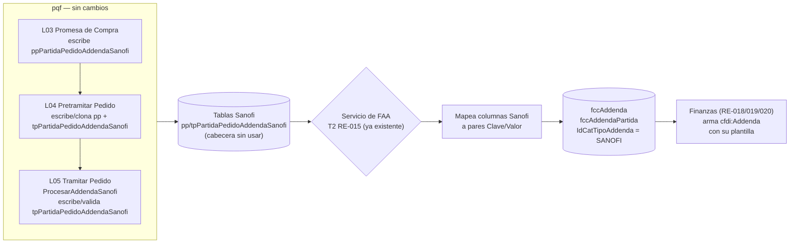
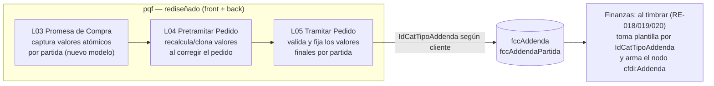

# Adenda de Factura — Hallazgos y Propuesta de Tabla

**Referencia:** R16A-RE-FU-015 (Prepago con Factura por Adelantado) — el hallazgo aplica también a RE-018/019/020 (módulo de facturación/timbrado), que es donde finalmente se consumiría.
**Fecha:** 2026-08-12
**Estado:** Propuesta — pendiente de decidir en qué requisito se implementa.

---

## 1. Qué es una adenda

Una **adenda** es un bloque de información adicional que se agrega al XML de un CFDI (factura electrónica), en el nodo `cfdi:Addenda` — siempre al final del comprobante, después de todos los `Conceptos`. El **SAT no valida su contenido** ni lo usa para nada fiscal; es información que el **receptor** (cliente) exige para sus propios procesos de conciliación (ERP, centros de costo, referencias internas, etc.). Cada cliente que la exige define su propio formato — no hay un catálogo oficial.

**Regla del estándar (confirmada en esta revisión):** en el CFDI solo puede existir **un** nodo `cfdi:Addenda` por comprobante — no hay una adenda por partida. Lo que sí puede pasar es que, **dentro** de ese único nodo, el esquema propio del cliente repita elementos por partida (ej. un bloque de cabecera + N bloques de detalle, uno por línea del pedido).

---

## 2. Hallazgos en el código actual (ProquifaDotNet)

### 2.1 Tablas actuales de adenda

No existe una tabla genérica de adenda en R14 — las únicas tablas reales (entidades EF, `CrudBO<T>`) son específicas de **Sanofi**:

| Tabla | Nivel | ¿Se usa actualmente? |
|---|---|---|
| `ppPartidaPedidoAddendaSanofi` | Partida | **Sí** — 1,231 filas en producción |
| `tpPedidoAddendaSanofi` | Cabecera (pedido) | **No** — el código la escribe, pero tiene **0 filas** en producción |
| `tpPartidaPedidoAddendaSanofi` | Partida | **Sí** — 1,221 filas en producción |

Los flags que disparan la generación viven en `DatosFacturacionCliente`: `AddendaDeLineaDeOrden` y `AddendaDeCorreo` (inicializados en `false` por `DatosFacturacionClienteFactory`).

**Columnas reales de las tablas Sanofi** (confirmadas por `INFORMATION_SCHEMA.COLUMNS`): `CuentaPuente`, `CorreoContactoClienteAddenda`, `CorreoEmpresaAddenda`, `LineaDeOrden`, `IdCatUnidad` (+ PK/FK/control).

### 2.2 Qué escribe cada transacción

Esto es lo que hace cada transacción sobre esas tablas:

| Transacción | Archivo / método | Qué escribe | Condición |
|---|---|---|---|
| **L03 Promesa de Compra** | `PretramitarPromesaDeCompraTransaccionBO.cs` (`#region Guarda Addenda si no viene nula`) | `ppPartidaPedidoAddendaSanofi` | Si `AddendaDeLineaDeOrden=true` en el cliente y la partida trae el objeto |
| **L04 Pretramitar Pedido** | `PretramitarPedidoTransaccionBO.cs` | `ppPartidaPedidoAddendaSanofi` **y** `tpPartidaPedidoAddendaSanofi` (esta última se adelanta, normalmente correspondería a L05) | Mismo flag del cliente |
| **L04 Pretramitar Pedido** (corrección) | `ppPedidoCorregidoBO.cs` | Clona el registro en `ppPartidaPedidoAddendaSanofi` al corregir el pedido | Si la partida original ya tenía addenda |
| **L04 Gestionar Intramitables** (resolución) | `ppPedidoTramitacionConErroresTransaccionBO.cs`, `ppPedidoOcNoAmparadaCorreoTransaccioBO.cs` | `tpPartidaPedidoAddendaSanofi` | Mismo flag del cliente |
| **L05 Tramitar Pedido** | `tpPedidoTramitarTransaccionBO.cs`, método `ProcesarAddendaSanofi` (invocado en 2 puntos del flujo) | `tpPartidaPedidoAddendaSanofi` | Además **valida**: si el cliente NO tiene `AddendaDeLineaDeOrden`, ninguna partida debe traer addenda |

### 2.3 Evidencia con datos reales de BD

| Consulta                                                                  | Resultado                                                                                                                                            |
| ------------------------------------------------------------------------- | ---------------------------------------------------------------------------------------------------------------------------------------------------- |
| Conteo de filas                                                           | `ppPartidaPedidoAddendaSanofi` = 1,231 · `tpPedidoAddendaSanofi` (**cabecera**) = **0** · `tpPartidaPedidoAddendaSanofi` (detalle) = 1,221           |
| Campos de correo (`CorreoEmpresaAddenda`, `CorreoContactoClienteAddenda`) | **NULL en el 100% de la muestra**, tanto en Promesa de Compra como en Tramitar Pedido — nunca se usan en la operación real                           |
| `LineaDeOrden` — Promesa de Compra vs. Tramitar Pedido, misma partida     | **No siempre coincide** (ej. `0034` en Promesa vs. `0030` en Tramitar) — se recalcula porque las partidas pueden reordenarse/eliminarse entre etapas |
| `IdCatUnidad`                                                             | Mismo valor fijo en toda la muestra (`02234CF0-230F-4F29-B686-E16E673CCE4B`) — constante para Sanofi                                                 |

**Conclusiones de esta evidencia:**
1. La tabla de **cabecera nunca se llena** en la práctica (0 filas), aunque el código la escribe — refuerza que este código está incompleto.
2. Los campos de **correo nunca se usan** — descarta la hipótesis de que `AddendaDeCorreo` implique un addenda alterno enviado por correo; son solo datos (direcciones de correo) que en teoría formarían parte del contenido de la adenda, pero que en los datos reales nunca se poblaron.
3. El valor **"final" de una partida solo es confiable después de Tramitar Pedido** — el de Promesa de Compra es intermedio y puede quedar obsoleto por reordenamientos.

---

## 3. Decisión de arquitectura

- **pqf (ProquifaDotNet) solo captura/calcula los valores atómicos** del addenda en sus transacciones (Promesa de Compra → Pretramitar Pedido → Tramitar Pedido) — un dato suelto por fila (ej. `OrdenCompra_Numero`, `Entrega_FolioRemision`), sin armar ningún XML. Es justo lo que ya hace hoy con Sanofi (`LineaDeOrden`, `IdCatUnidad`, correos, etc.).
- **Finanzas es dueña de cómo se arma el XML de cada cliente** — sabe qué valores van juntos en qué elemento/atributo, cómo se agrupan o repiten, el namespace y el nodo raíz.
- Se propone que Finanzas resuelva esto mediante **plantillas** por `IdCatTipoAddenda`: una plantilla define la forma del XML de addenda de ese cliente (nodos, atributos, repeticiones de cabecera/detalle) con marcadores que se rellenan con los pares `Clave`/`Valor` de `fccAddenda`/`fccAddendaPartida`. Agregar un cliente nuevo es agregar su plantilla, no tocar el esquema de las tablas.
- El diseño de las tablas es **agnóstico al cliente**: no modela columnas específicas de Sanofi ni de ningún otro — guarda pares `Clave`/`Valor` atómicos y genéricos, para que agregar un nuevo cliente con adenda no requiera cambios de esquema (solo agregar su forma de armar el XML del lado de Finanzas).

---

## 4. Propuesta de tablas

Tres tablas: un catálogo de tipo de addenda, y dos tablas de valores **independientes** entre sí (ninguna depende de la otra), ambas ancladas al pedido/partida de origen y al catálogo — porque cada pedido puede tener **varios** valores de cabecera (uno por `Clave`) y cada partida puede tener **varios** valores propios (también uno por `Clave`), igual que el patrón `<elemento tipo="" valor=""/>` que usan estos XML.

### `catTipoAddenda` (catálogo)

| Campo | Tipo | Nota |
|---|---|---|
| `IdCatTipoAddenda` | uniqueidentifier PK | — |
| `Clave` | varchar(30) | `SANOFI`, `ASOFARMA`, `MAVI`, `PFIZER`, `AMECE`… |
| `Descripcion` | varchar(100) | Nombre del cliente/formato |
| `Activo` | bit | — |

### `fccAddenda` (valores a nivel pedido — cabecera del addenda)

| Campo | Tipo | Nota |
|---|---|---|
| `IdFccAddenda` | uniqueidentifier PK | — |
| `IdTPPedido` | uniqueidentifier FK → `tpPedido` | El pedido origen. Puede haber varias filas por pedido (una por `Clave`) |
| `IdCatTipoAddenda` | uniqueidentifier FK → `catTipoAddenda` | Qué formato de cliente aplica |
| `Clave` | varchar(50) | Nombre del campo (ej. `OrdenCompra`, `Entrega`, `Contacto`) |
| `Valor` | nvarchar(max) | El valor de ese campo, ya listo para insertarse en el XML |
| `FechaGeneracion` | datetime | Cuándo se armó el valor (en Tramitar Pedido) |
| `FechaRegistro` | datetime | Control |
| `FechaUltimaActualizacion` | datetime | Control |

### `fccAddendaPartida` (valores a nivel partida — detalle repetido del addenda)

No depende de `fccAddenda` (no tiene FK hacia ella) — está anclada directo al pedido/partida y al catálogo, igual que la cabecera, porque una partida puede existir sin que haya valores de cabecera para ese pedido.

| Campo | Tipo | Nota |
|---|---|---|
| `IdFccAddendaPartida` | uniqueidentifier PK | — |
| `IdTPPartidaPedido` | uniqueidentifier FK → `tpPartidaPedido` | La partida origen. Puede haber varias filas por partida (una por `Clave`) |
| `IdCatTipoAddenda` | uniqueidentifier FK → `catTipoAddenda` | Qué formato de cliente aplica |
| `Clave` | varchar(50) | Nombre del campo (ej. `LineaDeOrden`, `IdCatUnidad`) |
| `Valor` | nvarchar(max) | El valor de ese campo para esa partida |
| `FechaRegistro` | datetime | Control |
| `FechaUltimaActualizacion` | datetime | Control |

### Cómo arma Finanzas el XML final

Las tablas guardan **valores atómicos** (un dato suelto por fila, ej. `OrdenCompra_Numero = OC-2026-9876`), no XML ni fragmentos armados. **Finanzas es quien sabe, por `IdCatTipoAddenda`, cómo ensamblarlos** — qué valores van juntos en qué elemento/atributo, cómo se agrupan o repiten, el namespace y el nodo raíz (ver sección 3). Al timbrar, Finanzas:

1. Lee todas las filas de `fccAddenda` para el `IdTPPedido` — son los valores de cabecera.
2. Lee todas las filas de `fccAddendaPartida` para cada `IdTPPartidaPedido` del pedido — son los valores que se repiten por línea.
3. Con la definición propia del `TipoAddenda` del pedido (una por cliente: Amece/Asofarma/Mavi/Pfizer/Sanofi), arma el **único** nodo `cfdi:Addenda` del CFDI a partir de esos valores.

Ejemplos:
- Un cliente cuya adenda es 100% cabecera (sin datos por línea) simplemente no tendrá filas en `fccAddendaPartida`.
- Sanofi, con datos por línea, tendrá filas en ambas tablas.

---

## 5. Dos caminos posibles

Sustituir las tablas actuales de Sanofi por las nuevas (`fccAddenda`/`fccAddendaPartida`) **es viable**, pero no es solo un cambio de modelo de datos — impacta tanto el front como puntos del back que hoy dependen de las tablas actuales (los controllers CRUD de Sanofi y el dashboard `vTramitarPedidoPartidaDetalle`, ver sección 2.1). Hay dos caminos:

### Camino 1 — Mantener las tablas actuales (limitadas) + que el servicio de FAA llene las nuevas

pqf sigue capturando/mostrando addenda como hoy (tablas Sanofi, con sus limitaciones — cabecera nunca usada, campos de correo siempre NULL). Al cierre de Tramitar Pedido, **no hace falta un servicio nuevo**: el mismo servicio que ya genera la Factura por Adelantado (T2 de RE-015 — `POST /api/v1/invoices/advance-invoice/create/{orderId}` en Finanzas, que hoy inserta `fccFactura`/`fccFacturaPartida`/`fccFacturaReferenciaBancaria`) también lee las tablas de addenda y llena `fccAddenda`/`fccAddendaPartida` con los valores atómicos correspondientes, en la misma transacción.

- **A favor:** no toca front ni las pantallas/endpoints que ya usan las tablas actuales — menor riesgo, menor alcance.
- **En contra:** conserva las limitaciones ya encontradas (cabecera nunca usada, campos que nunca se llenan) y agrega una pieza nueva (el servicio de sincronización) solo para traducir de un modelo a otro.

### Camino 2 — Reemplazar las tablas actuales y rediseñar cómo se maneja la addenda en pqf

Las 3 transacciones escriben **directo** en `fccAddenda`/`fccAddendaPartida` — ya no existen las tablas Sanofi. Implica rediseñar/mover el front (pantallas y los controllers CRUD actuales) y el back (las transacciones L03–L05) para trabajar sobre el modelo nuevo.

- **A favor:** un solo modelo, sin duplicidad ni pieza de sincronización; resuelve de raíz las limitaciones encontradas (cabecera vacía, etc.).
- **En contra:** mayor alcance — hay que tocar front y los puntos de back identificados en la sección anterior.

### En ambos casos, el punto de llegada es el mismo

Finanzas siempre termina leyendo `fccAddenda`/`fccAddendaPartida` y armando el XML con sus plantillas por cliente — la diferencia entre los dos caminos es **cómo llegan los datos ahí**, no qué hace Finanzas con ellos.

---

## 6. Pendiente por resolver

- **¿Camino 1 o camino 2?** (sección 5) — decidir si se mantienen las tablas actuales de Sanofi con un servicio de sincronización, o se reemplazan de raíz rediseñando front y back.
- **¿En qué requisito vive esta tabla?** — candidatos: RE-018/019/020 (facturación/timbrado de Finanzas, donde se consumiría al armar el CFDI) o un requisito/tarea propia de "Addenda". Falta decidir.
- **¿Quién y cuándo escribe `fccAddenda`/`fccAddendaPartida`?** — pqf, al cierre de Tramitar Pedido (L05), calculando los valores atómicos que hoy ya calcula para Sanofi (`LineaDeOrden`, `IdCatUnidad`, correos, etc.) y guardándolos como pares `Clave`/`Valor`. Falta detallar el mecanismo exacto de escritura (¿INSERT directo desde pqf a esta tabla en la BD de Finanzas, o vía un endpoint?).
- **¿Cómo se implementa en Finanzas el ensamblado del XML por cliente?** — equivale a reconstruir ahí lo que hoy son `AddendaFactory` y sus 5 adaptadores (`AddendaAmeceFactory`, `AddendaAsofarmaFactory`, `AddendaMaviFactory`, `AddendaPfizerFactory`, `AddendaSanofiFactory`), pero como código nuevo en Finanzas — no se migran. Falta diseñar esa pieza.
- **Validar con el cliente** si los 5 formatos existentes (Amece, Asofarma, Mavi, Pfizer, Sanofi) siguen siendo los vigentes, o si la lista cambió.
