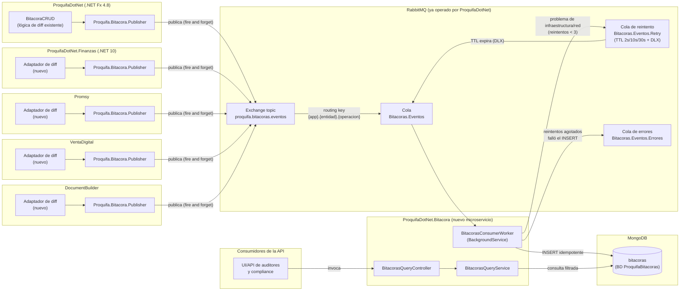
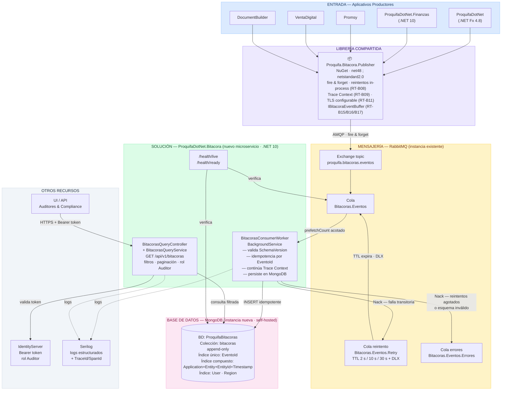
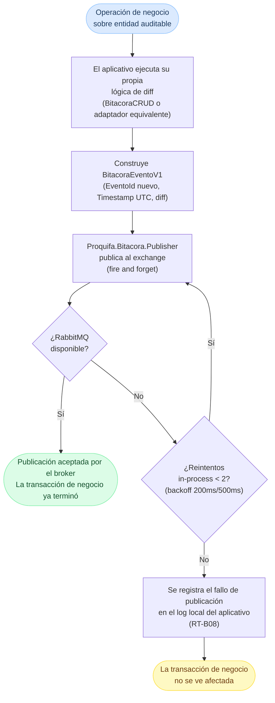
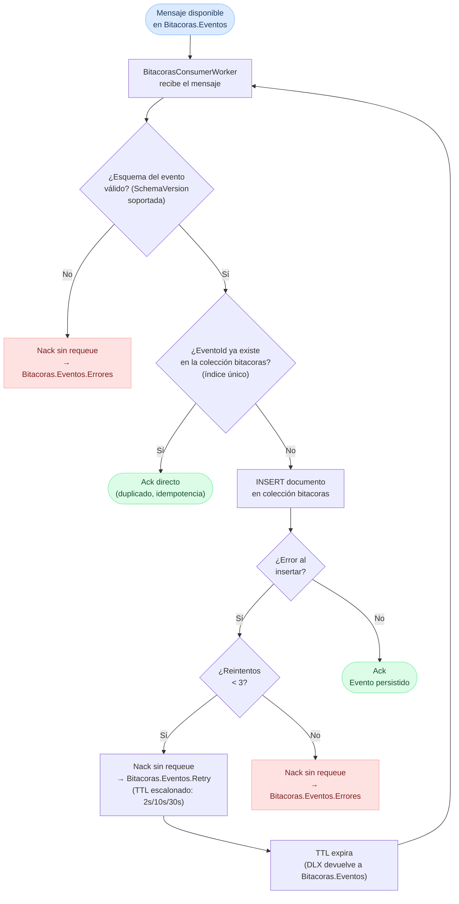
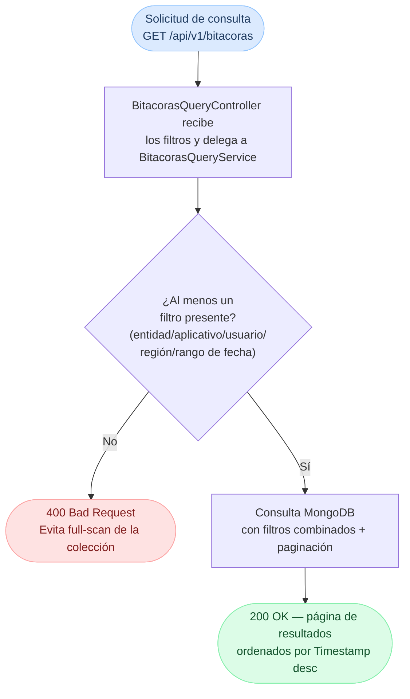
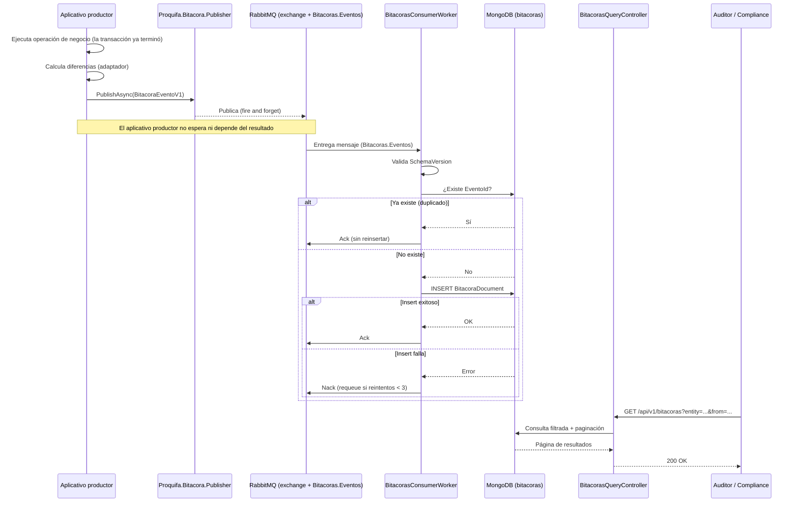

# **\[Bitacora\]\[DIS-SOL\] Diseño de la solución Bitacora**

## Bitácoras — Arquitectura de auditoría transversal del ecosistema Proquifa (Propuesta 3: Orientada a Eventos)

| FORMATO | N/A |
| :---- | :---- |
| **PROYECTO** | R16 \- Adquisiciones |
| **REFERENCIA** | [R16A-1802: R16A-RE-FU-019 - \[DIS\] - Diseño de la solución Parte 03](https://newryndem.atlassian.net/browse/R16A-1802) |
| **VERSIÓN** | 1.1 |
| **FECHA** | 30 jul 2026 |
| **AUTOR** | [A. Javier Antúnez Estrada](mailto:agustin.antunez@ryndem.mx) |
| **REVISOR** | [Juan David García Cruz](mailto:juan.garcia@ryndem.mx) |

## 

## Contenido

[**Introducción	3**](#introducción)

[1\. Propósito del documento	3](#1.-propósito-del-documento)

[2\. Alcance	3](#2.-alcance)

[Incluye:	3](#incluye:)

[No incluye:	4](#no-incluye:)

[**Visión general del diseño	6**](#visión-general-del-diseño)

[1\. Objetivo técnico	6](#1.-objetivo-técnico)

[2\. Componentes involucrados	6](#2.-componentes-involucrados)

[3\. Diagramas de arquitectura	9](#3.-diagramas-de-arquitectura)

[3.1 C4 — Nivel 1: Contexto del sistema	9](#3.1-c4-nivel-1)

[3.2 C4 — Nivel 2: Contenedores	10](#3.2-c4-nivel-2)

[3.3 Diagrama arquitectónico por capas	11](#3.3-diagrama-arquitectonico)

[**Diseño funcional detallado	13**](#diseño-funcional-detallado)

[1\. Flujo: Captura y publicación del evento de dominio	11](#1.-flujo:-captura-y-publicación-del-evento-de-dominio)

[2\. Flujo: Consumo y persistencia del evento	13](#2.-flujo:-consumo-y-persistencia-del-evento)

[3\. Flujo: Consulta de bitácoras para auditoría/compliance	15](#3.-flujo:-consulta-de-bitácoras-para-auditoría/compliance)

[4\. Reglas técnicas aplicadas	16](#4.-reglas-técnicas-aplicadas)

[**Diseño de componentes	20**](#diseño-de-componentes)

[1\. Contrato del evento de dominio	20](#1.-contrato-del-evento-de-dominio)

[2\. Modelo de datos persistido (MongoDB)	23](#2.-modelo-de-datos-persistido-\(mongodb\))

[3\. Contrato de la API de consulta	24](#3.-contrato-de-la-api-de-consulta)

[4\. Diagrama de secuencia	25](#4.-diagrama-de-secuencia)

[5\. Interfaces externas consumidas	27](#5.-interfaces-externas-consumidas)

[6\. Diseño detallado de componentes nuevos	28](#6.-diseño-detallado-de-componentes-nuevos)

[6.1 Arquitectura interna de ProquifaDotNet.Bitacora	30](#6.1-arquitectura-interna-de-proquifadotnet.bitacora)

[6.2 Organización interna de Proquifa.Bitacora.Publisher	30](#6.2-organización-interna-de-proquifa.bitacora.publisher)

[**Impacto Técnico	32**](#impacto-técnico)

[1\. Impacto en código existente	32](#1.-impacto-en-código-existente)

[2\. Impacto en infraestructura	32](#2.-impacto-en-infraestructura)

[**Manejo de Errores y Excepciones	34**](#manejo-de-errores-y-excepciones)

[**Estrategia de Pruebas	36**](#estrategia-de-pruebas)

[**Dudas y Pendientes	37**](#dudas-y-pendientes)

[**Control de versiones	38**](#heading=)

# **Introducción** {#introducción}

## **1\. Propósito del documento** {#1.-propósito-del-documento}

Definir el diseño de la solución técnica **backend/infraestructura** para la arquitectura de Bitácoras (*audit trail*) del ecosistema Proquifa, sobre la base de la **Propuesta 3 (arquitectura orientada a eventos)** recomendada en el documento "Propuesta para registro de Bitácoras (audit trail)": captura de eventos de dominio en cada aplicativo, publicación "fire and forget" a RabbitMQ, y persistencia/consulta a cargo de un microservicio nuevo y dedicado (ProquifaDotNet.Bitacora) sobre MongoDB.

**Nota:** Este documento no redefine la investigación de mercado ni la comparativa de propuestas — para eso consultar el documento "Propuesta para registro de Bitácoras (audit trail)", sección 7 (Recomendación). Tampoco es un requisito de la Matriz Oficial de R16 (no tiene número RE-FU-XXX): es infraestructura transversal que **habilita** a los demás requisitos a auditar sus propias entidades, no un flujo de negocio en sí mismo.

## **2\. Alcance** {#2.-alcance}

Este diseño cubre la **infraestructura de captura, transporte, persistencia y consulta** de bitácoras para los 5 aplicativos del ecosistema (ProquifaDotNet, ProquifaDotNet.Finanzas, Promsy, VentaDigital, DocumentBuilder) y futuros Aplicativos que se apeguen a los requerimientos definidos en este documento.

**Estrategia de adopción — piloto:** que el diseño sea transversal no implica que los 5 aplicativos se integren de forma simultánea. ProquifaDotNet puede ser el piloto para validar el flujo completo end-to-end (publicación → consumo → persistencia → consulta), porque ya cuenta con BitacoraCRUD y requiere el menor trabajo nuevo (solo extenderlo para invocar Proquifa.Bitacora.Publisher, ver "Impacto en código existente"). La adopción de ProquifaDotNet.Finanzas, Promsy, VentaDigital y DocumentBuilder es trabajo independiente por cada equipo dueño, vía su propio backlog, y no es una dependencia bloqueante para dar por cerrado este documento ni su implementación inicial.

### **Incluye:** {#incluye:}

* Contrato de evento de dominio versionado (BitacoraEventoV1), acordado entre los 5 aplicativos productores.  
* **Librería compartida nueva (vía NuGet)** Proquifa.Bitacora.Publisher (multi-targeting net48;netstandard2.0) con el cliente de publicación hacia RabbitMQ y los tipos del contrato — reutilizable por cualquier aplicativo del ecosistema sin importar su versión de .NET. **Este documento define y provee el mecanismo de publicación como librería estándar — no se deja a criterio de cada aplicativo cómo publicar su evento a RabbitMQ.** Cada aplicativo solo integra la librería y construye su propio adaptador de diff (ver "No incluye"); la forma de conectarse al broker, serializar y manejar fallos de publicación es la misma para los 5, para garantizar que las reglas técnicas RT-B01/RT-B02/RT-B08/RT-B09/RT-B11 se cumplan de manera uniforme en todo el ecosistema.  
* Infraestructura de mensajería sobre el **RabbitMQ ya operado hoy por ProquifaDotNet**: exchange proquifa.bitacoras.eventos (topic), cola Bitacoras.Eventos, cola de reintento Bitacoras.Eventos.Retry, cola de errores Bitacoras.Eventos.Errores.  
* **Microservicio nuevo** ProquifaDotNet.Bitacora (.NET, coherente con el resto de módulos nuevos de R16) con dos responsabilidades separadas (CQRS):  
  * **Lado de escritura:** BitacorasConsumerWorker (BackgroundService), consume la cola, valida el contrato, aplica idempotencia y persiste en MongoDB.  
  * **Lado de lectura:** BitacorasQueryController/BitacorasQueryService, expone la API de consulta para auditoría/compliance.  
* Modelo de datos de persistencia en MongoDB (colección bitacoras, base ProquifaBitacoras).  
* Manejo de duplicados, orden y reintentos (idempotencia por EventoId, reintentos con backoff vía patrón *delayed exchange* y dead-letter queue tras reintentos agotados).  
* Estrategia de pruebas y manejo de errores de la infraestructura de eventos.  
* **Helper opcional de cálculo de diff** dentro de Proquifa.Bitacora.Publisher (IBitacoraDiffBuilder, RT-B19) — utilidad de conveniencia para los aplicativos que no tengan lógica propia de captura de cambios; no sustituye ni obliga a modificar la lógica ya existente (ej. BitacoraCRUD en ProquifaDotNet).

### **No incluye:** {#no-incluye:}

* La lógica de diff (cálculo de propiedades modificadas) dentro de cada aplicativo productor — cada aplicativo es responsable de construir su propio evento a partir de su propia lógica de captura (en ProquifaDotNet ya existe como BitacoraCRUD; los demás aplicativos construyen un adaptador equivalente, opcionalmente apoyándose en IBitacoraDiffBuilder, RT-B19). Este documento solo define el **contrato** que ese adaptador debe producir — el uso del helper opcional no es obligatorio ni sustituye el criterio de negocio de cada aplicativo sobre qué comparar.  
* El listado exhaustivo de qué entidades de cada aplicativo son auditables — queda a criterio de cada equipo dueño de su aplicativo, siguiendo el contrato aquí definido.  
* UI de consulta de bitácoras para auditores/compliance (frontend) — este documento solo diseña la API de lectura que esa UI consumiría.  
* Migración de datos históricos de BitacoraCRUD (ProquifaDotNet) hacia la nueva colección de MongoDB — ver Dudas y Pendientes.  
* Provisión/evaluación de infraestructura de mensajería nueva — se reutiliza el RabbitMQ ya operado; no se evalúan Kafka ni Azure Service Bus (descartados en el documento "Propuesta para registro de Bitácoras (audit trail)", sección 4.3).  
* Diseño de alertas o consumidores adicionales del bus de eventos (analítica, notificaciones) — el contrato de evento queda abierto a futuros consumidores (Propuesta 3, sección 3.3 de "Propuesta para registro de Bitácoras (audit trail)"), pero solo se diseña el consumidor de Bitácoras.

# 

# **Visión general del diseño** {#visión-general-del-diseño}

## **1\. Objetivo técnico** {#1.-objetivo-técnico}

Proveer, para los 5 aplicativos del ecosistema Proquifa, un mecanismo de auditoría **desacoplado de la transacción de negocio**: cada aplicativo publica un evento de dominio versionado al ocurrir un cambio auditable (create/update/delete), sin esperar respuesta ni condicionar el resultado de su propia operación a la disponibilidad de la infraestructura de auditoría. Un microservicio nuevo y dedicado (ProquifaDotNet.Bitacora) consume esos eventos de forma asíncrona, los persiste de forma idempotente en un store de lectura optimizado para auditoría (MongoDB), y expone una API de consulta única para todo el ecosistema — reemplazando el patrón actual donde la única fuente de auditoría (BitacoraCRUD) vive aislada dentro de ProquifaDotNet. 

## **2\. Componentes involucrados** {#2.-componentes-involucrados}





| Aplicativo | Componente | Responsabilidad | Ubicación |
| :---- | :---- | :---- | :---- |
| Todos (compartido) | Proquifa.Bitacora.Publisher | Librería NuGet multi-targeting (net48;netstandard2.0) con el contrato BitacoraEventoV1 y un *thin client* sobre RabbitMQ.Client para publicar de forma "fire and forget" (con hasta 2 reintentos in-process ante fallas transitorias, RT-B08), timeout corto de conexión, TLS configurable por ambiente (RT-B11), propagación de Trace Context (RT-B09, ver nota abajo) y buffer de eventos para transacciones multi-entidad (IBitacoraEventBuffer, RT-B15/RT-B16/RT-B17). Un solo paquete cubre los 5 aplicativos por ser un ecosistema mono-lenguaje (.NET) con versiones heterogéneas — mismo criterio ya usado en el documento "Propuesta para registro de Bitácoras (audit trail)" (sección 4, Propuesta 1\) | Nuevo (librería compartida) |
| ProquifaDotNet | BitacoraCRUD (existente) \+ adaptador nuevo | Lógica de diff ya implementada; se extiende para, además de escribir en la tabla local (se mantiene por compatibilidad, ver Dudas), invocar Proquifa.Bitacora.Publisher con el evento equivalente | Existente, extendido |
| ProquifaDotNet.Finanzas / Promsy / VentaDigital / DocumentBuilder | Adaptador de diff (nuevo, por aplicativo) | Cada equipo dueño implementa su propia lógica de captura de cambios (equivalente a BitacoraCRUD) sobre sus propias entidades auditables, y construye el BitacoraEventoV1 a partir de ese diff | Nuevo (por aplicativo) |
| RabbitMQ | Exchange proquifa.bitacoras.eventos (topic) | Recibe la publicación de los 5 aplicativos, enruta por routing key {aplicativo}.{entidad}.{operacion} hacia la cola de Bitácoras | Nuevo (sobre infraestructura existente) |
| RabbitMQ | Cola Bitacoras.Eventos / Cola de reintento Bitacoras.Eventos.Retry / Cola de errores Bitacoras.Eventos.Errores | Cola de trabajo del consumidor de Bitácoras, su cola de reintento con TTL escalonado (2s/10s/30s) y dead-letter-exchange de vuelta a Bitacoras.Eventos (RT-B05), y la dead-letter queue final tras reintentos agotados — patrón *delayed exchange* | Nuevo |
| ProquifaDotNet.Bitacora (nuevo) | BitacorasConsumerWorker | BackgroundService embebido en el microservicio (mismo patrón que ProformaEmailRetryWorker de RE-FU-016) que consume Bitacoras.Eventos, valida el contrato, aplica idempotencia (EventoId), continúa el Trace Context recibido (RT-B09) y persiste en MongoDB | Nuevo (Hosted Service) |
| ProquifaDotNet.Bitacora (nuevo) | BitacorasQueryService / BitacorasQueryController | Lado de lectura (CQRS): expone GET /api/v1/bitacoras con filtros combinados (entity, application, user, region, rango de fecha) para auditores y compliance | Nuevo (Application/Services \+ API/Controllers) |
| ProquifaDotNet.Bitacora (nuevo) | Health checks (/health/live, /health/ready) | Vía Microsoft.Extensions.Diagnostics.HealthChecks (RT-B10): liveness del proceso y readiness con verificación de conexión a RabbitMQ y MongoDB | Nuevo |
| MongoDB | Colección bitacoras (BD ProquifaBitacoras) | Store de lectura desnormalizado, *append-only*, con índice único sobre EventoId (idempotencia) e índices secundarios sobre Application, Entity, EntityId, Timestamp, Region | Nuevo |

**Nota: Valor práctico de la propagación de Trace Context:** con una herramienta de observabilidad (Jaeger, Zipkin, Application Insights, etc.), permite ver en una sola traza extremo a extremo: "se actualizó el Producto X en ProquifaDotNet → ese cambio disparó un evento → el evento se persistió en Bitácoras a los N ms". Sin esta propagación, la operación de negocio y su registro en Bitácoras aparecen como dos eventos sueltos, sin forma de correlacionarlos automáticamente — habría que cruzar logs manualmente por Timestamp o EventoId. 

## **3\. Diagramas de arquitectura** {#3.-diagramas-de-arquitectura}

### **3.1 C4 — Nivel 1: Contexto del sistema** {#3.1-c4-nivel-1}

Muestra cómo ProquifaDotNet.Bitacora se relaciona con los actores externos (aplicativos productores, auditores) y los sistemas de soporte (IdentityServer, RabbitMQ, MongoDB). El límite del sistema es el microservicio nuevo; todo lo demás es externo.

<svg xmlns="http://www.w3.org/2000/svg" viewBox="0 0 760 408" style="max-width:100%;height:auto;font-family:'Segoe UI',Arial,sans-serif">
  <defs>
    <pattern id="c1grid" width="22" height="22" patternUnits="userSpaceOnUse">
      <path d="M22 0L0 0 0 22" fill="none" stroke="rgba(160,170,200,.2)" stroke-width="1"/>
    </pattern>
    <marker id="c1ah" markerWidth="9" markerHeight="7" refX="8" refY="3.5" orient="auto">
      <polygon points="0 0,9 3.5,0 7" fill="#5a6a80"/>
    </marker>
  </defs>
  <rect width="760" height="408" rx="6" fill="white" stroke="#d0d5e0"/>
  <rect width="760" height="408" rx="6" fill="url(#c1grid)"/>

  <!-- Person: Usuario Proquifa -->
  <rect x="50" y="15" width="168" height="148" rx="8" fill="#5c6480"/>
  <circle cx="134" cy="34" r="14" fill="rgba(255,255,255,.22)"/>
  <path d="M111,55 Q134,43 157,55Z" fill="rgba(255,255,255,.22)"/>
  <text x="134" y="78" text-anchor="middle" font-size="13" font-weight="bold" fill="white">Usuario Proquifa</text>
  <text x="134" y="93" text-anchor="middle" font-size="10" font-style="italic" fill="rgba(255,255,255,.68)">[Person]</text>
  <text x="134" y="112" text-anchor="middle" font-size="9.5" fill="rgba(255,255,255,.82)">Opera los aplicativos del</text>
  <text x="134" y="125" text-anchor="middle" font-size="9.5" fill="rgba(255,255,255,.82)">ecosistema y genera</text>
  <text x="134" y="138" text-anchor="middle" font-size="9.5" fill="rgba(255,255,255,.82)">cambios auditables.</text>

  <!-- Person: Auditor / Compliance -->
  <rect x="540" y="15" width="168" height="148" rx="8" fill="#5c6480"/>
  <circle cx="624" cy="34" r="14" fill="rgba(255,255,255,.22)"/>
  <path d="M601,55 Q624,43 647,55Z" fill="rgba(255,255,255,.22)"/>
  <text x="624" y="78" text-anchor="middle" font-size="13" font-weight="bold" fill="white">Auditor / Compliance</text>
  <text x="624" y="93" text-anchor="middle" font-size="10" font-style="italic" fill="rgba(255,255,255,.68)">[Person]</text>
  <text x="624" y="112" text-anchor="middle" font-size="9.5" fill="rgba(255,255,255,.82)">Consulta el historial de</text>
  <text x="624" y="125" text-anchor="middle" font-size="9.5" fill="rgba(255,255,255,.82)">cambios del ecosistema.</text>

  <!-- External: Aplicativos Productores -->
  <rect x="15" y="250" width="202" height="138" rx="8" fill="#5c6480"/>
  <text x="116" y="274" text-anchor="middle" font-size="12.5" font-weight="bold" fill="white">Aplicativos Productores</text>
  <text x="116" y="288" text-anchor="middle" font-size="10" font-style="italic" fill="rgba(255,255,255,.68)">[Software System]</text>
  <text x="116" y="307" text-anchor="middle" font-size="9.5" fill="rgba(255,255,255,.82)">ProquifaDotNet &#xB7; Finanzas &#xB7;</text>
  <text x="116" y="320" text-anchor="middle" font-size="9.5" fill="rgba(255,255,255,.82)">Promsy &#xB7; VentaDigital &#xB7;</text>
  <text x="116" y="333" text-anchor="middle" font-size="9.5" fill="rgba(255,255,255,.82)">DocumentBuilder.</text>
  <text x="116" y="346" text-anchor="middle" font-size="9.5" fill="rgba(255,255,255,.82)">Publican BitacoraEventoV1.</text>

  <!-- Main System: ProquifaDotNet.Bitacora -->
  <rect x="272" y="232" width="216" height="156" rx="8" fill="#1060a0"/>
  <text x="380" y="258" text-anchor="middle" font-size="13" font-weight="bold" fill="white">ProquifaDotNet.Bitacora</text>
  <text x="380" y="273" text-anchor="middle" font-size="10" font-style="italic" fill="rgba(255,255,255,.68)">[Software System]</text>
  <text x="380" y="293" text-anchor="middle" font-size="9.5" fill="rgba(255,255,255,.82)">Microservicio dedicado de</text>
  <text x="380" y="306" text-anchor="middle" font-size="9.5" fill="rgba(255,255,255,.82)">auditoría transversal. Captura,</text>
  <text x="380" y="319" text-anchor="middle" font-size="9.5" fill="rgba(255,255,255,.82)">persiste en MongoDB y expone</text>
  <text x="380" y="332" text-anchor="middle" font-size="9.5" fill="rgba(255,255,255,.82)">API de consulta del historial</text>
  <text x="380" y="345" text-anchor="middle" font-size="9.5" fill="rgba(255,255,255,.82)">de cambios del ecosistema.</text>

  <!-- External: IdentityServer -->
  <rect x="543" y="250" width="202" height="138" rx="8" fill="#5c6480"/>
  <text x="644" y="274" text-anchor="middle" font-size="12.5" font-weight="bold" fill="white">IdentityServer</text>
  <text x="644" y="288" text-anchor="middle" font-size="10" font-style="italic" fill="rgba(255,255,255,.68)">[Software System]</text>
  <text x="644" y="307" text-anchor="middle" font-size="9.5" fill="rgba(255,255,255,.82)">Autenticación y autorización</text>
  <text x="644" y="320" text-anchor="middle" font-size="9.5" fill="rgba(255,255,255,.82)">centralizada. Emite Bearer</text>
  <text x="644" y="333" text-anchor="middle" font-size="9.5" fill="rgba(255,255,255,.82)">tokens con claim rol Auditor</text>
  <text x="644" y="346" text-anchor="middle" font-size="9.5" fill="rgba(255,255,255,.82)">(RT-B14).</text>

  <!-- Arrow 1: Person Usuario → Ext Productores -->
  <line x1="134" y1="163" x2="116" y2="248" stroke="#5a6a80" stroke-width="1.5" marker-end="url(#c1ah)"/>
  <text x="68" y="210" font-size="9.5" fill="#3a4a5a">opera &#xB7; genera cambios</text>

  <!-- Arrow 2: Person Auditor → Main System -->
  <line x1="624" y1="163" x2="447" y2="230" stroke="#5a6a80" stroke-width="1.5" marker-end="url(#c1ah)"/>
  <text x="573" y="196" text-anchor="end" font-size="9.5" fill="#3a4a5a">consulta historial</text>
  <text x="573" y="208" text-anchor="end" font-size="9" font-style="italic" fill="#5a6a80">[HTTPS + Bearer]</text>

  <!-- Arrow 3: Ext Productores → Main System -->
  <line x1="217" y1="319" x2="270" y2="310" stroke="#5a6a80" stroke-width="1.5" marker-end="url(#c1ah)"/>
  <text x="243" y="303" text-anchor="middle" font-size="9.5" fill="#3a4a5a">publica eventos</text>
  <text x="243" y="315" text-anchor="middle" font-size="9" font-style="italic" fill="#5a6a80">[AMQP fire&amp;forget]</text>

  <!-- Arrow 4: Main System → IdentityServer -->
  <line x1="488" y1="310" x2="541" y2="310" stroke="#5a6a80" stroke-width="1.5" marker-end="url(#c1ah)"/>
  <text x="514" y="302" text-anchor="middle" font-size="9.5" fill="#3a4a5a">valida token</text>
  <text x="514" y="314" text-anchor="middle" font-size="9" font-style="italic" fill="#5a6a80">[HTTPS]</text>
</svg>

### **3.2 C4 — Nivel 2: Contenedores** {#3.2-c4-nivel-2}

Descompone el interior de ProquifaDotNet.Bitacora en sus contenedores (procesos/stores), mostrando cómo se conectan entre sí y con los sistemas externos.

<svg xmlns="http://www.w3.org/2000/svg" viewBox="0 0 760 578" style="max-width:100%;height:auto;font-family:'Segoe UI',Arial,sans-serif">
  <defs>
    <pattern id="c2grid" width="22" height="22" patternUnits="userSpaceOnUse">
      <path d="M22 0L0 0 0 22" fill="none" stroke="rgba(160,170,200,.2)" stroke-width="1"/>
    </pattern>
    <marker id="c2ah" markerWidth="9" markerHeight="7" refX="8" refY="3.5" orient="auto">
      <polygon points="0 0,9 3.5,0 7" fill="#5a6a80"/>
    </marker>
  </defs>
  <rect width="760" height="578" rx="6" fill="white" stroke="#d0d5e0"/>
  <rect width="760" height="578" rx="6" fill="url(#c2grid)"/>

  <!-- Person: Auditor / Compliance -->
  <rect x="22" y="14" width="155" height="143" rx="8" fill="#5c6480"/>
  <circle cx="99" cy="32" r="13" fill="rgba(255,255,255,.22)"/>
  <path d="M78,51 Q99,40 120,51Z" fill="rgba(255,255,255,.22)"/>
  <text x="99" y="73" text-anchor="middle" font-size="12.5" font-weight="bold" fill="white">Auditor / Compliance</text>
  <text x="99" y="87" text-anchor="middle" font-size="10" font-style="italic" fill="rgba(255,255,255,.68)">[Person]</text>
  <text x="99" y="106" text-anchor="middle" font-size="9.5" fill="rgba(255,255,255,.82)">Consulta el historial</text>
  <text x="99" y="119" text-anchor="middle" font-size="9.5" fill="rgba(255,255,255,.82)">vía GET /api/v1/</text>
  <text x="99" y="132" text-anchor="middle" font-size="9.5" fill="rgba(255,255,255,.82)">bitacoras.</text>

  <!-- External: Aplicativos Productores -->
  <rect x="228" y="23" width="210" height="112" rx="8" fill="#5c6480"/>
  <text x="333" y="46" text-anchor="middle" font-size="12.5" font-weight="bold" fill="white">Aplicativos Productores</text>
  <text x="333" y="60" text-anchor="middle" font-size="10" font-style="italic" fill="rgba(255,255,255,.68)">[Software System]</text>
  <text x="333" y="79" text-anchor="middle" font-size="9.5" fill="rgba(255,255,255,.82)">Usan Proquifa.Bitacora.Publisher</text>
  <text x="333" y="92" text-anchor="middle" font-size="9.5" fill="rgba(255,255,255,.82)">[NuGet &#xB7; net48;netstandard2.0]</text>
  <text x="333" y="105" text-anchor="middle" font-size="9.5" fill="rgba(255,255,255,.82)">para publicar BitacoraEventoV1.</text>

  <!-- External: IdentityServer -->
  <rect x="554" y="23" width="182" height="112" rx="8" fill="#5c6480"/>
  <text x="645" y="46" text-anchor="middle" font-size="12.5" font-weight="bold" fill="white">IdentityServer</text>
  <text x="645" y="60" text-anchor="middle" font-size="10" font-style="italic" fill="rgba(255,255,255,.68)">[Software System]</text>
  <text x="645" y="79" text-anchor="middle" font-size="9.5" fill="rgba(255,255,255,.82)">Valida Bearer tokens.</text>
  <text x="645" y="92" text-anchor="middle" font-size="9.5" fill="rgba(255,255,255,.82)">Restringido al claim</text>
  <text x="645" y="105" text-anchor="middle" font-size="9.5" fill="rgba(255,255,255,.82)">rol Auditor (RT-B14).</text>

  <!-- System Boundary -->
  <rect x="10" y="184" width="740" height="376" rx="10" fill="none" stroke="#8899aa" stroke-width="2" stroke-dasharray="8,4"/>
  <text x="22" y="547" font-size="10.5" font-weight="bold" fill="#556677">ProquifaDotNet.Bitacora</text>
  <text x="188" y="547" font-size="10.5" font-style="italic" fill="#8898a8">[Software System]</text>

  <!-- Container: BitacorasQueryController + Service -->
  <rect x="24" y="205" width="222" height="138" rx="8" fill="#1060a0"/>
  <text x="135" y="226" text-anchor="middle" font-size="11.5" font-weight="bold" fill="white">BitacorasQueryController</text>
  <text x="135" y="240" text-anchor="middle" font-size="11.5" font-weight="bold" fill="white">+ BitacorasQueryService</text>
  <text x="135" y="254" text-anchor="middle" font-size="10" font-style="italic" fill="rgba(255,255,255,.68)">[Container: API .NET 10]</text>
  <text x="135" y="273" text-anchor="middle" font-size="9.5" fill="rgba(255,255,255,.82)">Expone GET /api/v1/bitacoras</text>
  <text x="135" y="286" text-anchor="middle" font-size="9.5" fill="rgba(255,255,255,.82)">con filtros y paginación.</text>
  <text x="135" y="299" text-anchor="middle" font-size="9.5" fill="rgba(255,255,255,.82)">Exige Bearer token rol Auditor</text>
  <text x="135" y="312" text-anchor="middle" font-size="9.5" fill="rgba(255,255,255,.82)">y al menos un filtro (RT-B06).</text>

  <!-- Container: BitacorasConsumerWorker -->
  <rect x="514" y="205" width="222" height="138" rx="8" fill="#1060a0"/>
  <text x="625" y="226" text-anchor="middle" font-size="11.5" font-weight="bold" fill="white">BitacorasConsumerWorker</text>
  <text x="625" y="254" text-anchor="middle" font-size="10" font-style="italic" fill="rgba(255,255,255,.68)">[Container: Worker .NET 10]</text>
  <text x="625" y="273" text-anchor="middle" font-size="9.5" fill="rgba(255,255,255,.82)">BackgroundService. Consume</text>
  <text x="625" y="286" text-anchor="middle" font-size="9.5" fill="rgba(255,255,255,.82)">Bitacoras.Eventos. Valida</text>
  <text x="625" y="299" text-anchor="middle" font-size="9.5" fill="rgba(255,255,255,.82)">SchemaVersion, idempotencia</text>
  <text x="625" y="312" text-anchor="middle" font-size="9.5" fill="rgba(255,255,255,.82)">EventoId, persiste MongoDB.</text>

  <!-- Container: MongoDB -->
  <rect x="24" y="385" width="222" height="140" rx="8" fill="#1060a0"/>
  <text x="135" y="407" text-anchor="middle" font-size="13" font-weight="bold" fill="white">MongoDB</text>
  <text x="135" y="421" text-anchor="middle" font-size="10" font-style="italic" fill="rgba(255,255,255,.68)">[Container: Base de Datos]</text>
  <text x="135" y="440" text-anchor="middle" font-size="9.5" fill="rgba(255,255,255,.82)">BD ProquifaBitacoras &#xB7;</text>
  <text x="135" y="453" text-anchor="middle" font-size="9.5" fill="rgba(255,255,255,.82)">colección bitacoras.</text>
  <text x="135" y="466" text-anchor="middle" font-size="9.5" fill="rgba(255,255,255,.82)">Append-only. &#xCD;ndice único</text>
  <text x="135" y="479" text-anchor="middle" font-size="9.5" fill="rgba(255,255,255,.82)">EventoId. Self-hosted.</text>

  <!-- Container: RabbitMQ -->
  <rect x="514" y="385" width="222" height="140" rx="8" fill="#1060a0"/>
  <text x="625" y="407" text-anchor="middle" font-size="13" font-weight="bold" fill="white">RabbitMQ</text>
  <text x="625" y="421" text-anchor="middle" font-size="10" font-style="italic" fill="rgba(255,255,255,.68)">[Container: Message Broker]</text>
  <text x="625" y="440" text-anchor="middle" font-size="9.5" fill="rgba(255,255,255,.82)">Exchange topic proquifa.</text>
  <text x="625" y="453" text-anchor="middle" font-size="9.5" fill="rgba(255,255,255,.82)">bitacoras.eventos. Colas:</text>
  <text x="625" y="466" text-anchor="middle" font-size="9.5" fill="rgba(255,255,255,.82)">Eventos &#xB7; Retry (TTL+DLX)</text>
  <text x="625" y="479" text-anchor="middle" font-size="9.5" fill="rgba(255,255,255,.82)">&#xB7; Errores.</text>

  <!-- Arrow 1: Auditor → Query API (vertical) -->
  <line x1="99" y1="157" x2="99" y2="203" stroke="#5a6a80" stroke-width="1.5" marker-end="url(#c2ah)"/>
  <text x="106" y="177" font-size="9.5" fill="#3a4a5a">GET /api/v1/bitacoras</text>
  <text x="106" y="189" font-size="9" font-style="italic" fill="#5a6a80">[HTTPS + Bearer]</text>

  <!-- Arrow 2: Ext Productores → RabbitMQ (dashed L-shape) -->
  <path d="M333,135 L333,178 L512,178 L512,383" fill="none" stroke="#5a6a80" stroke-width="1.5" stroke-dasharray="5,3" marker-end="url(#c2ah)"/>
  <text x="345" y="173" font-size="9.5" fill="#3a4a5a">BitacoraEventoV1 [AMQP fire&amp;forget]</text>

  <!-- Arrow 3: Query API → IdentityServer (diagonal) -->
  <line x1="246" y1="254" x2="552" y2="133" stroke="#5a6a80" stroke-width="1.5" marker-end="url(#c2ah)"/>
  <text x="256" y="246" font-size="9.5" fill="#3a4a5a">valida token [HTTPS]</text>

  <!-- Arrow 4: Query API → MongoDB (vertical) -->
  <line x1="135" y1="343" x2="135" y2="383" stroke="#5a6a80" stroke-width="1.5" marker-end="url(#c2ah)"/>
  <text x="141" y="367" font-size="9.5" fill="#3a4a5a">consulta filtrada</text>
  <text x="141" y="379" font-size="9" font-style="italic" fill="#5a6a80">[MongoDB.Driver]</text>

  <!-- Arrow 5: Worker → MongoDB (L-shape through gap) -->
  <path d="M625,343 L625,363 L143,363 L143,383" fill="none" stroke="#5a6a80" stroke-width="1.5" marker-end="url(#c2ah)"/>
  <text x="384" y="359" text-anchor="middle" font-size="9.5" fill="#3a4a5a">INSERT idempotente [MongoDB.Driver]</text>

  <!-- Arrow 6a: RabbitMQ → Worker (consume / delivery) -->
  <line x1="617" y1="383" x2="617" y2="345" stroke="#5a6a80" stroke-width="1.5" marker-end="url(#c2ah)"/>
  <!-- Arrow 6b: Worker → RabbitMQ (Ack / Nack) -->
  <line x1="633" y1="345" x2="633" y2="383" stroke="#5a6a80" stroke-width="1.5" marker-end="url(#c2ah)"/>
  <text x="641" y="360" font-size="9.5" fill="#3a4a5a">consume /</text>
  <text x="641" y="372" font-size="9.5" fill="#3a4a5a">Ack &#xB7; Nack [AMQP]</text>
</svg>

### **3.3 Diagrama arquitectónico por capas** {#3.3-diagrama-arquitectonico}

Vista de despliegue que muestra las cuatro capas funcionales del sistema: entrada (productores), mensajería, solución (microservicio) y persistencia/recursos de soporte.

*\[DIAGRAMA — Renderizar en mermaid\]*

````

````

# 

# **Diseño funcional detallado** {#diseño-funcional-detallado}

## **1\. Flujo: Captura y publicación del evento de dominio** {#1.-flujo:-captura-y-publicación-del-evento-de-dominio}

**Disparador:** Cualquier operación de negocio (create/update/delete) sobre una entidad marcada como auditable, en cualquiera de los 5 aplicativos. 

![][image2]![][image3]

*\[DIAGRAMA — Renderizar en mermaid\]*

````

````

Se describe el detalle del flujo:

1. El aplicativo productor completa su operación de negocio (INSERT/UPDATE/DELETE sobre una entidad auditable) — **la transacción de negocio ya terminó** antes de este flujo; la publicación del evento ocurre **después**, nunca dentro de la misma transacción (RT-B01).  
2. El aplicativo ejecuta su propia lógica de diff: en ProquifaDotNet es la lógica ya existente de BitacoraCRUD; en los demás aplicativos, un adaptador equivalente construido por su propio equipo (fuera del alcance de este documento, ver sección "No incluye").  
3. Con el resultado del diff, el aplicativo construye un BitacoraEventoV1 (ver Diseño de componentes, sección 1), generando un EventoId (GUID) nuevo por cada evento — es la clave de idempotencia que usará el consumidor.  
4. El aplicativo invoca Proquifa.Bitacora.Publisher.PublishAsync(evento), que serializa el evento, inyecta el traceparent/tracestate como headers AMQP (RT-B09) y lo publica al exchange proquifa.bitacoras.eventos con routing key \= {aplicativo}.{entidad}.{operacion} (ej. proquifadotnet.producto.actualizado) — publicación **asíncrona, "fire and forget"**, con timeout de conexión corto (2s por defecto, configurable).  
5. ¿RabbitMQ está disponible? → **Sí:** el broker acepta el mensaje, fin del flujo desde la perspectiva del productor. **No:** el publisher reintenta hasta 2 veces in-process con backoff corto (200ms/500ms, RT-B08) — cubre caídas transitorias de red. Agotados esos reintentos, captura la excepción y solo registra el fallo en el log local del aplicativo — **no** bloquea de forma prolongada ni relanza la excepción hacia el código de negocio que lo invocó.  
6. La operación de negocio del aplicativo productor se considera exitosa independientemente del resultado de la publicación (mismo principio que motivó la Propuesta 3 sobre las Propuestas 1/2: cero impacto en la latencia/disponibilidad de la transacción de negocio).

**Nota:** **Transacciones que modifican más de una entidad (RT-B15/RT-B16/RT-B17):** cuando una misma transacción de negocio modifica varias entidades auditables (ej. en ProquifaDotNet, una edición que toca Producto y ProductoEstandar a la vez), el aplicativo no llama PublishAsync por cada una de forma independiente. En su lugar, Proquifa.Bitacora.Publisher expone un buffer (IBitacoraEventBuffer): el aplicativo hace Enqueue(evento) por cada entidad modificada durante la transacción, y solo si la transacción de negocio confirma con éxito llama FlushAsync(), que publica cada evento encolado como mensaje independiente (cada uno conserva su propio EventoId, routing key y pasa por el mismo flujo de reintentos de este diagrama). Si la transacción falla o hace rollback, el aplicativo llama Clear() para vaciar el buffer sin publicar nada. El buffer es *scoped* a la transacción (no singleton/estático), para no mezclar eventos de transacciones concurrentes distintas. 

## **2\. Flujo: Consumo y persistencia del evento** {#2.-flujo:-consumo-y-persistencia-del-evento}

**Disparador:** Llega un mensaje nuevo a la cola Bitacoras.Eventos.   
![][image4]![][image5]

*\[DIAGRAMA — Renderizar en mermaid\]*

````

````

Se describe el detalle del flujo:

1. BitacorasConsumerWorker (BackgroundService, embebido en el proceso de ProquifaDotNet.Bitacora — no es un Windows Service ni un proyecto de deploy separado, mismo criterio que ProformaEmailRetryWorker de RE-FU-016) recibe el mensaje desde Bitacoras.Eventos, con prefetchCount acotado (10 por defecto, configurable) para no saturar memoria bajo ráfagas de eventos.  
2. Valida que SchemaVersion del evento sea una versión soportada por el consumidor (RT-B03). ¿No es válida? → Nack sin requeue → el mensaje va directo a Bitacoras.Eventos.Errores (un evento con esquema no soportado nunca se resuelve solo con reintentos).  
3. Ejecuta el **check de idempotencia**: ¿ya existe un documento con ese EventoId en la colección bitacoras? (índice único, RT-B02) → **Sí:** Ack directo, no se reinserta — cubre los reintentos de publicación del productor y los redeliveries del propio broker. **No:** continúa.  
4. Inserta el documento en la colección bitacoras (ver Diseño de componentes, sección 2), incluyendo RegisteredAt en UTC — fijado en el momento del INSERT que finalmente tiene éxito, sin importar si hubo reintentos previos (RT-B05); distinto de Timestamp del evento, que es el momento del cambio de negocio y nunca se recalcula.  
5. ¿Error al insertar (ej. Mongo no disponible)? → cuenta de reintentos del mensaje \< 3: Nack sin requeue hacia la cola Bitacoras.Eventos.Retry, con TTL escalonado por intento (2s → 10s → 30s); al expirar el TTL, el dead-letter-exchange de esa cola devuelve el mensaje a Bitacoras.Eventos para un nuevo intento — evita el loop de reintento inmediato contra un Mongo caído. Reintentos agotados: Nack sin requeue → Bitacoras.Eventos.Errores, para revisión manual.  
6. ¿Insert exitoso? → Ack. El evento queda disponible para consulta inmediatamente (consistencia eventual, tolerable para el caso de uso de auditoría).

## **3\. Flujo: Consulta de bitácoras para auditoría/compliance** {#3.-flujo:-consulta-de-bitácoras-para-auditoría/compliance}

**Disparador:** Un auditor o proceso de compliance solicita el historial de cambios de una entidad (o un filtro combinado) vía la API de consulta. 

![][image6]

*\[DIAGRAMA — Renderizar en mermaid\]*

````

````

Se describe el detalle del flujo:

1. El consumidor de la API (UI de auditoría/compliance, fuera de alcance de este documento) invoca GET /api/v1/bitacoras con uno o más filtros: application, entity, entityId, user, region, from/to, más paginación (page, pageSize).  
2. BitacorasQueryController delega a BitacorasQueryService.QueryAsync(filtros).  
3. Exige al menos un filtro (RT-B06) para evitar un full collection scan sobre una colección *append-only* que crece indefinidamente — ¿ningún filtro presente? → 400 Bad Request.  
4. Construye la consulta MongoDB combinando los filtros recibidos contra los índices secundarios de la colección (Application, Entity\+EntityId, User, Region, Timestamp).  
5. Retorna 200 OK con la página de resultados, ordenados por Timestamp descendente (los cambios más recientes primero).

**Nota 1:** **Autenticación/autorización de este endpoint (RT-B14):** GET /api/v1/bitacoras exige Bearer token emitido por **IdentityServer**, restringido al rol Auditor — un log de auditoría es en sí mismo un dato sensible y su acceso no puede quedar abierto. 

**Nota 2:** **Contrato de request/response:** ver Diseño de componentes, sección 3\. 

## 

## **4\. Reglas técnicas aplicadas** {#4.-reglas-técnicas-aplicadas}

**Nota:** Igual que en RE-FU-016/019, estas reglas técnicas surgieron durante el diseño, no de un requisito de la matriz (Bitácoras no tiene entrada en la Matriz Oficial). Prefijo RT-B. 

| Regla | Descripción |
| :---- | :---- |
| RT-B01 | La publicación del evento ocurre **después** de que la transacción de negocio del aplicativo productor ya terminó — nunca participa de esa transacción ni condiciona su resultado (Propuesta 3, cero impacto en latencia). |
| RT-B02 | Idempotencia por EventoId (GUID generado por el productor al construir el evento, no por el broker ni por el consumidor) — índice único en la colección bitacoras. Cubre reintentos de publicación y redeliveries del broker. |
| RT-B03 | El contrato BitacoraEventoV1 es versionado y evoluciona de forma **aditiva únicamente** (nuevos campos opcionales). Un cambio incompatible requiere BitacoraEventoV2, publicado con un SchemaVersion distinto; el consumidor debe soportar ambas versiones durante la transición. |
| RT-B04 | El cálculo del diff (propiedades modificadas, valor anterior/nuevo) es responsabilidad exclusiva del aplicativo productor — ProquifaDotNet.Bitacora nunca reconstruye ni infiere un diff, solo persiste lo que recibe. |
| RT-B05 | Reintento **con backoff** ante fallas de persistencia (ej. Mongo no disponible): hasta 3 intentos (valor por defecto, configurable vía appsettings), mediante el patrón *delayed exchange* de RabbitMQ (Nack sin requeue hacia Bitacoras.Eventos.Retry, con TTL escalonado 2s/10s/30s por defecto, configurable, y dead-letter-exchange que devuelve el mensaje a Bitacoras.Eventos); agotados los reintentos, el mensaje se mueve a Bitacoras.Eventos.Errores para revisión manual. Se descarta el requeue inmediato porque, contra un Mongo caído, reintenta en loop cerrado sin dar tiempo a que el problema se resuelva. **Advertencia operativa:** el TTL escalonado es un argumento de la declaración de la cola (x-message-ttl), no un valor que se recarga en caliente — RabbitMQ no permite modificar los argumentos de una cola ya declarada, así que cambiarlo en producción implica borrar y recrear Bitacoras.Eventos.Retry, lo que descarta cualquier mensaje que en ese momento estuviera esperando su reintento en esa cola (no se degrada a Bitacoras.Eventos.Errores, se pierde). El número de intentos (3) sí se valida en código y puede cambiar sin tocar la cola. |
| RT-B06 | La API de consulta exige al menos un filtro por solicitud — no expone un GET sin condiciones sobre una colección *append-only* sin límite de crecimiento. |
| RT-B07 | Un solo paquete NuGet Proquifa.Bitacora.Publisher con multi-targeting (net48;netstandard2.0) cubre los 5 aplicativos del ecosistema, evitando duplicar el cliente de publicación por stack — es un ecosistema mono-lenguaje (.NET) con versiones heterogéneas, no polyglot (mismo argumento que usa "Propuesta para registro de Bitácoras (audit trail)" para no penalizar la Propuesta 1 en la comparativa, sección 6). |
| RT-B08 | Un fallo de publicación (RabbitMQ no disponible o timeout) dispara hasta **2 reintentos in-process** (valor por defecto, configurable vía appsettings) dentro de Proquifa.Bitacora.Publisher, con backoff corto (200ms/500ms por defecto, configurable, tope total \~1s) — cubre caídas transitorias de red sin bloquear al aplicativo productor. Agotados los reintentos, se registra el fallo en el log local y no se relanza la excepción — a diferencia del reintento de envío de correo de RE-FU-016 (que sí tiene cola propia de reintento), aquí un evento de auditoría perdido por indisponibilidad sostenida del broker se acepta como gap conocido de la Propuesta 3 (ver Dudas \#2, patrón *Transactional Outbox* como mitigación futura). |
| RT-B09 | El publisher propaga el traceparent/tracestate (W3C Trace Context, vía System.Diagnostics.Activity, compatible con OpenTelemetry) como headers del mensaje AMQP; BitacorasConsumerWorker los lee y continúa el trace al procesar. Permite correlacionar, en una misma traza distribuida, la operación de negocio que originó el cambio con su persistencia en Bitácoras. |
| RT-B10 | ProquifaDotNet.Bitacora expone /health/live (proceso vivo) y /health/ready (con checks de conexión a RabbitMQ y MongoDB) vía Microsoft.Extensions.Diagnostics.HealthChecks — permite a cualquier orquestador o monitoreo detectar un worker colgado sin necesidad de revisar logs manualmente. |
| RT-B11 | TLS es **configurable por ambiente** (UseTls), activado por defecto fuera de entornos locales, para las conexiones a RabbitMQ (AMQPS) y MongoDB — no obligatorio de forma incondicional, porque entornos de desarrollo local pueden no tener TLS habilitado en su broker/BD. Las credenciales se manejan vía appsettings.{Environment}.json (Desarrollo/QA/UAT/Productivo), mismo criterio ya usado en el resto del ecosistema — hasta que se indique un mecanismo de secretos distinto (ej. variables de entorno), no se versiona el archivo del ambiente productivo con sus credenciales reales en el repositorio. |
| RT-B12 | ProquifaDotNet.Bitacora usa **Serilog** como logger estructurado (salida JSON) para todos sus componentes (worker de consumo y API de consulta). |
| RT-B13 | Cada entrada de log generada por BitacorasConsumerWorker incluye el TraceId/SpanId del Trace Context recibido (RT-B09), para correlacionar logs y trazas distribuidas en herramientas de observabilidad. |
| RT-B14 | GET /api/v1/bitacoras exige Bearer token emitido por **IdentityServer**, restringido al rol Auditor (claim role, siguiendo la convención PascalCase ya usada por Superusuario/Usuario en identity-server). |
| RT-B15 | El aplicativo productor usa IBitacoraPublisher.PublishAsync cuando la transacción de negocio modifica una sola entidad auditable; usa IBitacoraEventBuffer (Enqueue/FlushAsync) cuando la misma transacción modifica más de una. |
| RT-B16 | Proquifa.Bitacora.Publisher expone un buffer de eventos (IBitacoraEventBuffer, con Enqueue(BitacoraEventoV1), FlushAsync(), Clear() y un accesor de solo lectura a los eventos pendientes) para agrupar varios eventos de una misma transacción de negocio que modifica más de una entidad (ej. Producto \+ ProductoEstandar) — cada evento conserva su propio EventoId y se publica como mensaje independiente; el buffer solo agrupa el momento de disparo. |
| RT-B17 | El buffer de eventos es *scoped* a la transacción de negocio (no singleton/estático). El aplicativo llama FlushAsync() solo si la transacción confirma con éxito, o Clear() si la transacción falla o hace rollback — el buffer no se descarta por sí solo, salvo que además esté scoped 1:1 por transacción vía el contenedor de DI. |
| RT-B18 | La propiedad Operation del DTO BitacoraEventoV1, se modela como un enum fuertemente tipado (BitacoraOperationEnum con valores Create/Update/Delete) dentro del tipo BitacoraEventoV1 que provee la librería, no como string libre — el productor asigna uno de los valores del enum, nunca escribe el texto a mano. Se serializa como string (no como número) en el JSON de salida, usando el conversor de enum-a-string del serializador correspondiente (JsonStringEnumConverter en System.Text.Json, StringEnumConverter en Newtonsoft.Json), para que el valor persistido en MongoDB siga siendo legible ("Update") y no dependa del orden en que se declaren los valores del enum. |
| RT-B19 | Proquifa.Bitacora.Publisher provee un helper **opcional** de cálculo de diff (IBitacoraDiffBuilder.Compare\<T\>(T anterior, T actual)), que compara por reflexión las propiedades públicas de dos instancias del mismo tipo y devuelve la lista de ModifiedPropertyDto — mismo criterio ya probado en BitacoraMovimientos\<T\>.ObtenerDiferencias() de ProquifaDotNet (comparación plana propiedad por propiedad; no resuelve objetos anidados ni colecciones). Es una utilidad de conveniencia: cada aplicativo decide si la usa o mantiene su propia lógica de diff — RT-B04 sigue vigente, el aplicativo productor es responsable del resultado sin importar el mecanismo que use para obtenerlo. |

# 

# 

# **Diseño de componentes** {#diseño-de-componentes}

## **1\. Contrato del evento de dominio** {#1.-contrato-del-evento-de-dominio}

**Nota:** Convención de nombres en inglés para las propiedades del contrato serializado a JSON. La propiedad SchemaVersion viaja dentro del payload — no en la routing key — para que el consumidor pueda decidir cómo deserializar antes de procesar. 

| BitacoraEventoV1                          // Contrato publicado por cualquier aplicativo productor├── EventoId: Guid                        // "3fa85f64-5717-4562-b3fc-2c963f66afa6"├── SchemaVersion: string                 // "1.0"├── Application: string                   // "ProquifaDotNet"├── Entity: string                        // "Producto"├── EntityId: string                      // "7c9e6679-7425-40de-944b-e07fc1f90ae7"├── Operation: BitacoraOperationEnum      // Update├── User: string                          // "jantunez"├── Timestamp: DateTimeOffset             // "2026-07-27T20:32:07Z"├── Region: string?                       // "MX"├── IPAddress: string?                    // "201.140.8.23"├── UserAgent: string?                    // "Mozilla/5.0 ..."├── RequestOrigin: string?                // "PUT /api/productos/7c9e6679-7425-40de-944b-e07fc1f90ae7"├── ModifiedProperties: List\<ModifiedPropertyDto\>│   └── ModifiedPropertyDto│       ├── Property: string              // "PrecioUnitario"│       ├── OldValue: string?             // "125.50"│       └── NewValue: string?             // "130.00"└── Metadata: Dictionary\<string,string\>?  // { "IdTransaccion": "..." } |
| :---- |

**Detalle de propiedades, criterios y convenciones:** 

| Propiedad | Tipo | Criterio / Convención | Ejemplo |
| :---- | :---- | :---- | :---- |
| EventoId | Guid | Clave de idempotencia (RT-B02), generado por el productor | 3fa85f64-5717-4562-b3fc-2c963f66afa6 |
| SchemaVersion | string | Fijo/hardcodeado dentro del tipo BitacoraEventoV1 que provee la librería — el productor no lo llena a mano; solo cambia si el aplicativo integra una versión distinta del contrato (BitacoraEventoV2), permitiendo evolución aditiva (RT-B03) | "1.0" |
| Application | string | Identifica el microservicio/backend real que publica el evento, no el aplicativo/UI que lo originó — un microservicio (ej. ProquifaDotNet.Timbrado) podría ser invocado en el futuro por más de un aplicativo, y la bitácora debe reflejar quién ejecutó el cambio, no con qué UI interactuó el usuario final | "ProquifaDotNet", "ProquifaDotNet.Finanzas", "Promsy", "VentaDigital", "DocumentBuilder" |
| Entity | string | Nombre lógico de negocio, no necesariamente el nombre físico de la tabla | "Producto", "Pedido", "Factura", "Cliente" |
| EntityId | string | Siempre como string. La convención del ecosistema es usar Guid como llave primaria — se serializa como string para soportar de forma uniforme el caso excepcional de PK compuesta. PK simple: solo el valor plano, sin nombrar la columna (Entity ya deja claro qué representa). PK compuesta: string JSON con el nombre real de cada columna, para desambiguar entre varios valores | Simple: "7c9e6679-7425-40de-944b-e07fc1f90ae7" — Compuesta: "{\\"IdPedido\\":12345,\\"NumeroLinea\\":3}" |
| Operation | BitacoraOperationEnum | Enum fuertemente tipado Create, Update, Delete (RT-B18), serializado como string en el JSON, no texto libre | Update |
| User | string | Username/login legible del usuario que ejecutó el cambio — nunca un identificador interno (GUID, ID numérico); el propósito es que un auditor pueda leer directamente quién hizo el cambio sin resolverlo contra otra tabla | "jantunez", "maria.lopez@proquifa.com" |
| Timestamp | DateTimeOffset | Momento del cambio de negocio, SIEMPRE en UTC (obligatorio) — así ni el retry (RT-B05) ni la latencia de consumo lo alteran | "2026-07-27T20:32:07Z" |
| Region | string? | Código ISO 3166-1 alfa-2, en mayúsculas — nunca el nombre completo del país (ej. no "Mexico"/"mexico"). Null si la entidad no tiene noción de región | "MX", "PE" |
| IPAddress | string? | Dirección IP de origen de la solicitud que disparó el cambio — dato de auditoría/forense (desde dónde se hizo el cambio). Null si el productor no tiene contexto HTTP disponible (ej. proceso batch/background) | "201.140.8.23" |
| UserAgent | string? | Encabezado User-Agent del navegador/dispositivo origen — dato de auditoría/forense (desde qué cliente se hizo el cambio). Null en el mismo caso que IPAddress | "Mozilla/5.0 (Windows NT 10.0; Win64; x64) ..." |
| RequestOrigin | string? | Método HTTP \+ endpoint que disparó el cambio — dato de auditoría/forense (vía qué punto de entrada se hizo el cambio). Null en el mismo caso que IPAddress/UserAgent (ej. proceso batch/background) | "PUT /api/productos/7c9e6679-7425-40de-944b-e07fc1f90ae7" |
| ModifiedProperties | List\<ModifiedPropertyDto\> | Cada elemento: Property (nombre), OldValue/NewValue (siempre string, el consumidor no interpreta tipos) | Property: "PrecioUnitario", OldValue: "125.50", NewValue: "130.00" |
| Metadata | Dictionary\<string,string\>? | Si un aplicativo necesita guardar un dato adicional propio de su dominio (ej. ProquifaDotNet.Finanzas el IdTransaccion de una operación fiscal, o Promsy un identificador interno propio de su proceso), no tiene sentido agregar ese campo al contrato base BitacoraEventoV1 — le serviría solo a un aplicativo y rompería la regla de evolución aditiva compartida (RT-B03). En vez de eso, se guarda en Metadata como par clave-valor libre. Mismo criterio para IdMovimiento (identificador legacy de ProquifaDotNet que agrupa varias entradas de bitácora bajo un mismo movimiento de negocio, distinto del EventoId por evento individual): no es un dato genérico entre los 5 aplicativos, así que va en Metadata en vez de ser un campo propio del contrato | ProquifaDotNet.Finanzas adjuntando el IdTransaccion de una operación fiscal: { "IdTransaccion": "TX-2026-000482" }. ProquifaDotNet adjuntando su IdMovimiento legacy: { "IdMovimiento": "..." } |

**Nota: Trace Context (RT-B09):** Proquifa.Bitacora.Publisher propaga el traceparent/tracestate (W3C Trace Context, vía System.Diagnostics.Activity, compatible con OpenTelemetry) como **headers del mensaje AMQP** — no como parte de este payload. BitacorasConsumerWorker los lee y continúa el trace al procesar, enlazando el evento de auditoría con el trace de la operación de negocio que lo originó. 

## **2\. Modelo de datos persistido (MongoDB)** {#2.-modelo-de-datos-persistido-(mongodb)}

**Nota:** Documento de la colección bitacoras (BD ProquifaBitacoras). Es prácticamente un espejo de BitacoraEventoV1 más los campos que agrega la ingestión — se evita transformar el evento más de lo necesario, para que el documento persistido sea trazable 1:1 contra lo publicado. 

| BitacoraDocument                      *// Documento en la colección "bitacoras"*├── \_id: ObjectId                     *// identificador propio de Mongo*├── EventoId: Guid                    *// índice único \-- idempotencia (RT-B02)*├── SchemaVersion: string├── Application: string               *// índice*├── Entity: string                    *// índice compuesto con EntityId*├── EntityId: string                  *// índice compuesto con Entity*├── Operation: string                 *// valor del enum \`BitacoraOperationEnum\` (RT-B18) tal como llegó serializado ("Create"/"Update"/"Delete")*├── User: string                      *// índice*├── Timestamp: DateTimeOffset         *// índice \-- momento del cambio de negocio, UTC (mismo valor que envió el productor, nunca se recalcula)*├── Region: string?                   // índice├── IPAddress: string?├── UserAgent: string?├── RequestOrigin: string?├── ModifiedProperties: \[ { Property, OldValue, NewValue } \]├── Metadata: { ... }?└── RegisteredAt: DateTimeOffset      *// UTC, momento del INSERT que finalmente tuvo éxito \-- si el mensaje pasó por reintentos (RT-B05), es la fecha de ese intento, no del primero; distinto de Timestamp, útil para medir el retraso de consumo* |
| :---- |

**Índices propuestos:** 

| Índice | Campos | Propósito |
| :---- | :---- | :---- |
| Único | EventoId | Idempotencia (RT-B02) — rechaza duplicados a nivel de base de datos como segunda barrera, además del check explícito del consumidor |
| Compuesto | Entity, EntityId, Timestamp (desc) | Consulta más frecuente: historial completo de una entidad específica, ordenado cronológicamente |
| Simple | Application | Filtrado por aplicativo de origen |
| Simple | User | Filtrado por usuario, para auditoría de accesos/cambios de una persona |
| Simple | Region | Filtrado por región (MX/PE), relevante para compliance por marco fiscal |

## 

## **3\. Contrato de la API de consulta** {#3.-contrato-de-la-api-de-consulta}

**Nota:** Request y response de GET /api/v1/bitacoras (Flujo 3, sección "Diseño funcional detallado"). BitacoraDto es un espejo de BitacoraEventoV1 (sección 1\) más RegisteredAt (sección 2, BitacoraDocument). 

| BitacoraQueryRequest                  *// Query string de GET /api/v1/bitacoras*├── Application: string?├── Entity: string?├── EntityId: string?├── User: string?├── Region: string?├── From: DateTimeOffset?├── To: DateTimeOffset?├── Page: int                         *// default 1*└── PageSize: int                     *// default 50, tope máximo configurable (appsettings, default 200\)* |
| :---- |

| BitacoraQueryResponse├── Items: List\<BitacoraDto\>          *// espejo de BitacoraEventoV1 \+ RegisteredAt*├── Page: int├── PageSize: int├── TotalCount: int└── TotalPages: int |
| :---- |

**Validaciones y códigos de respuesta:** en caso de error, el cuerpo es application/problem+json (RFC 9457\) con code\+correlationId, según el catálogo de errores (ver "Manejo de Errores y Excepciones"). 

| HTTP | Código de catálogo | Motivo |
| :---- | :---- | :---- |
| 200 OK | — | Página de resultados — incluso con Items vacío, una consulta sin resultados no es un error |
| 400 Bad Request | VAL-001 | Ningún filtro presente (RT-B06), o PageSize fuera del tope máximo configurado |
| 401 Unauthorized | — (framework) | Sin token o token inválido, resuelto por el middleware de autenticación antes de llegar al catálogo |
| 403 Forbidden | — (framework) | Token válido sin el rol Auditor (RT-B14), resuelto por el middleware de autorización |
| 503 Service Unavailable | INF-001 | MongoDB no disponible al momento de consultar |
| 500 Internal Server Error | UNX-001 | Error no clasificado (fallback) |

## 

## **4\. Diagrama de secuencia** {#4.-diagrama-de-secuencia}

![][image7]

*\[DIAGRAMA — Renderizar en mermaid\]*

````

````

## **5\. Interfaces externas consumidas** {#5.-interfaces-externas-consumidas}

| Interfaz | Protocolo | Consumida por | Detalle |
| :---- | :---- | :---- | :---- |
| RabbitMQ (exchange proquifa.bitacoras.eventos) | AMQP 0-9-1 (AMQPS si UseTls está activo, RT-B11) | Los aplicativos productores (publican) y BitacorasConsumerWorker (consume) | Broker ya operado por ProquifaDotNet — no se provisiona infraestructura nueva, solo un exchange y tres colas adicionales (Bitacoras.Eventos, Bitacoras.Eventos.Retry, Bitacoras.Eventos.Errores) |
| MongoDB (BD ProquifaBitacoras) | Driver oficial MongoDB.Driver (.NET), con TLS si UseTls está activo (RT-B11) | ProquifaDotNet.Bitacora (lectura y escritura) | Único consumidor directo de la BD — ningún aplicativo productor accede a MongoDB directamente, todo pasa por el contrato de eventos |

## 

## 

## **6\. Diseño detallado de componentes nuevos** {#6.-diseño-detallado-de-componentes-nuevos}

| Componente | Tipo | Detalle |
| :---- | :---- | :---- |
| Proquifa.Bitacora.Publisher | Librería NuGet compartida | Multi-targeting net48;netstandard2.0. Expone IBitacoraPublisher.PublishAsync(BitacoraEventoV1) para publicación individual, y IBitacoraEventBuffer.Enqueue(BitacoraEventoV1)/FlushAsync()/Clear() (más accesor de solo lectura a lo pendiente) para transacciones que modifican más de una entidad (RT-B15/RT-B16/RT-B17). Internamente usa RabbitMQ.Client (compatible con ambos target frameworks) para publicar al exchange configurado, con timeout de conexión corto, hasta 2 reintentos in-process con backoff (200ms/500ms) y manejo de excepción sin relanzar una vez agotados (RT-B08). Inyecta traceparent/tracestate como headers AMQP (RT-B09). Conexión con TLS configurable por ambiente (UseTls, RT-B11); credenciales leídas de appsettings.{Environment}.json (Desarrollo/QA/UAT/Productivo, RT-B11). Serialización con System.Text.Json donde esté disponible, Newtonsoft.Json en net48 vía código condicional (\#if) — mismo criterio ya usado en la Propuesta 1 de "Propuesta para registro de Bitácoras (audit trail)" para el multi-targeting. |
| IBitacoraDiffBuilder | Componente opcional (dentro de Proquifa.Bitacora.Publisher) | Expone Compare\<T\>(T anterior, T actual), que compara por reflexión las propiedades públicas de dos instancias del mismo tipo y devuelve la lista de ModifiedPropertyDto (RT-B19). Mismo criterio que BitacoraMovimientos\<T\>.ObtenerDiferencias() de ProquifaDotNet: comparación plana propiedad por propiedad, sin resolver objetos anidados ni colecciones. Uso opcional — un aplicativo puede usarlo directamente o mantener su propia lógica de diff (ej. BitacoraCRUD). |
| ProquifaDotNet.Bitacora | Microservicio nuevo (.NET) | Hospeda BitacorasConsumerWorker (lado de escritura), BitacorasQueryController/BitacorasQueryService (lado de lectura) y los endpoints de health checks (RT-B10) en el mismo proceso — separación lógica (CQRS a nivel de código), no de despliegue, para el alcance inicial. |
| BitacorasConsumerWorker | BackgroundService | Consume Bitacoras.Eventos con prefetchCount acotado, valida esquema, aplica idempotencia, continúa el Trace Context del mensaje (RT-B09), persiste en MongoDB y enruta a Bitacoras.Eventos.Retry ante fallas de persistencia (RT-B05). Registra cada paso relevante (validación fallida, reintento, DLQ, insert exitoso) vía Serilog, correlacionado con TraceId/SpanId (RT-B12/RT-B13). Mismo patrón de hosted service ya usado en ProformaEmailRetryWorker (RE-FU-016). |
| BitacorasQueryService / BitacorasQueryController | Application/Services \+ API/Controllers | Expone GET /api/v1/bitacoras con filtros combinados y paginación (Flujo 3). |
| Health checks (/health/live, /health/ready) | Microsoft.Extensions.Diagnostics.HealthChecks | Readiness verifica conectividad a RabbitMQ y MongoDB; liveness solo confirma que el proceso responde (RT-B10). |
| Colección bitacoras (MongoDB) | Nuevo | Ver Diseño de componentes, sección 2, para el esquema e índices. |
| Exchange proquifa.bitacoras.eventos \+ colas Bitacoras.Eventos / Bitacoras.Eventos.Retry / Bitacoras.Eventos.Errores | Nuevo (sobre RabbitMQ existente) | Ver Flujos 1 y 2\. La cola Retry usa TTL escalonado (2s/10s/30s) y dead-letter-exchange de vuelta a Bitacoras.Eventos (RT-B05). Declarados como durable=true/autoDelete=false — la topología y los mensajes deben sobrevivir un reinicio del broker, dado que es infraestructura de auditoría. |

## 

### **6.1 Arquitectura interna de ProquifaDotNet.Bitacora** {#6.1-arquitectura-interna-de-proquifadotnet.bitacora}

Clean Architecture (capas Domain/Application/Infrastructure/API), sobre el arquetipo interno [**ryndem/microservice-clean-architecture-template**](https://github.com/ryndem/microservice-clean-architecture-template) — mismo criterio ya usado por ProquifaDotNet.Finanzas, para mantener consistencia entre los módulos nuevos de R16. 

**Nota: BitacorasConsumerWorker no usa el proyecto Worker/ del arquetipo.** Ese proyecto del arquetipo es un *deployable* independiente (Windows Service/MSI), pensado para escenarios donde el worker corre separado de cualquier API. Aquí BitacorasConsumerWorker se mantiene embebido en el proyecto API como BackgroundService registrado en su Program.cs — mismo proceso que BitacorasQueryController, decisión ya fijada (Diseño de componentes, sección 6, tabla de componentes nuevos). 

| Capa | Contenido |
| :---- | :---- |
| Domain | BitacoraDocumentDomain (entidad de dominio pura, sin dependencias de MongoDB.Driver), IBitacoraRepository (contrato de repositorio), catálogo de errores (Errors.cs) del microservicio |
| Application | BitacorasQueryService, DTOs de respuesta (BitacoraQueryResponse, BitacoraDto), validador FluentValidation de BitacoraQueryRequest (produce VAL-001 vía Result.Fail), orquestación de validación/idempotencia invocada por BitacorasConsumerWorker |
| Infrastructure | Implementación Mongo de IBitacoraRepository, incluyendo el mapeo BitacoraDocumentDomain ↔ BitacoraDocument (el modelo Mongo definido en la sección 2), configuración del consumidor RabbitMQ, implementación de health checks |
| API | BitacorasQueryController, BitacorasConsumerWorker (BackgroundService registrado en Program.cs), endpoints de health checks, wiring de DI |

**Nota: Scaffold de EF Core del arquetipo — no aplica.** El arquetipo incluye scaffold automatizado de Entity Framework Core sobre SQL Server; ProquifaDotNet.Bitacora persiste en MongoDB (colección bitacoras, sección 2), no en una base relacional, así que ese scaffold y el DbContext/UnitOfWork de Infrastructure/Persistence/ del arquetipo no se usan aquí — la implementación de IBitacoraRepository se hace directamente sobre MongoDB.Driver. 

## 

### **6.2 Organización interna de Proquifa.Bitacora.Publisher** {#6.2-organización-interna-de-proquifa.bitacora.publisher}

Al ser una librería cliente (sin base de datos propia, sin API, sin persistencia), **no** aplica Clean Architecture — se organiza por carpetas de responsabilidad en vez de capas: 

| Carpeta | Contenido |
| :---- | :---- |
| Contracts/ | BitacoraEventoV1, ModifiedPropertyDto, BitacoraOperationEnum |
| Publishing/ | IBitacoraPublisher y su implementación sobre RabbitMQ.Client (RT-B08/RT-B09/RT-B11) |
| Buffering/ | IBitacoraEventBuffer y su implementación (RT-B15/RT-B16/RT-B17) |
| Diffing/ | IBitacoraDiffBuilder y su implementación por reflexión (RT-B19) |

# 

# 

# **Impacto Técnico** {#impacto-técnico}

## **1\. Impacto en código existente** {#1.-impacto-en-código-existente}

| Aplicativo | Impacto |
| :---- | :---- |
| ProquifaDotNet | Extender BitacoraCRUD para, además de su escritura local actual, invocar Proquifa.Bitacora.Publisher con el evento equivalente al diff ya calculado. La tabla BitacoraCRUD local **no se elimina** en este alcance (ver Dudas \#1) — convive con la publicación del evento. |
| ProquifaDotNet.Finanzas | Construir un adaptador de diff nuevo sobre las entidades que ese equipo determine auditables (ej. tpProformaPedido, CFDIGenerada), e integrar Proquifa.Bitacora.Publisher. Fuera del alcance de este documento definir cuáles entidades — cada requisito de Finanzas que necesite auditoría lo evalúa en su propio diseño. |
| Promsy / VentaDigital / DocumentBuilder | Mismo patrón: adaptador de diff propio \+ integración de Proquifa.Bitacora.Publisher. Ninguno tiene hoy una lógica de diff equivalente a BitacoraCRUD — es trabajo nuevo en los tres. |

## 

## **2\. Impacto en infraestructura** {#2.-impacto-en-infraestructura}

| Recurso | Cambio |
| :---- | :---- |
| RabbitMQ (instancia existente) | Nuevo exchange proquifa.bitacoras.eventos (topic), nueva cola Bitacoras.Eventos, nueva cola de reintento Bitacoras.Eventos.Retry (TTL escalonado \+ DLX, RT-B05) y nueva cola de errores Bitacoras.Eventos.Errores. No requiere una instancia nueva de broker. Si el broker ya tiene TLS habilitado, se activa UseTls para esta integración (RT-B11); si no, queda deshabilitado sin bloquear el diseño. |
| MongoDB | **Instancia nueva, Community Edition, self-hosted (on-premise)** — decisión ya tomada en "Propuesta para registro de Bitácoras (audit trail)" (sección 5.2): descarta Azure Cosmos DB por ser PaaS exclusivo de nube pública, no instalable on-premise; MongoDB gana la comparativa ponderada frente a Elasticsearch/OpenSearch (4.50 vs. 3.75/3.85). El ecosistema no opera MongoDB hoy — "equipo sin experiencia previa operando NoSQL" es una de las restricciones consideradas en esa comparativa. Requiere provisión, definición de HA/backups y monitoreo — fuera del detalle de este documento, responsabilidad de infraestructura. |
| Credenciales (RabbitMQ y MongoDB) | Se manejan vía appsettings.{Environment}.json, con archivo separado por ambiente (Desarrollo, QA, UAT, Productivo) — mismo criterio ya usado en el resto del ecosistema, hasta que se indique migrar a variables de entorno u otro mecanismo de secretos (RT-B11). |
| Despliegue | Un microservicio nuevo (ProquifaDotNet.Bitacora) a desplegar y monitorear —con sus endpoints /health/live//health/ready (RT-B10) integrados al monitoreo que use el resto de R16— adicional a los módulos ya planeados (Timbrado, LegacyBridge). |

# 

# **Manejo de Errores y Excepciones** {#manejo-de-errores-y-excepciones}

**Nota:** ProquifaDotNet.Bitacora adopta el modelo semántico de errores del arquetipo [ryndem/microservice-clean-architecture-template](https://github.com/ryndem/microservice-clean-architecture-template): catálogo centralizado (ErrorDefinition/Errors en Domain/Errors/) como única fuente de verdad, Result\<T\> para flujos esperados (el caller resuelve sin excepción), SemanticException única para flujos inesperados, respuestas application/problem+json (RFC 9457\) con code\+correlationId en el lado de la API de consulta. Los códigos se deprecan, nunca se reciclan.  
**BitacorasConsumerWorker no tiene HttpContext** (mismo caso que "Workers" en el arquetipo): en vez de responder ProblemDetails, la clasificación del error decide el manejo del mensaje AMQP — transitoria → reintento vía Nack/delayed exchange (RT-B05, no vía Polly como en el arquetipo, porque acá la durabilidad del reintento la da la cola, no un loop in-process); no transitoria → se descarta el item (Nack sin requeue → Bitacoras.Eventos.Errores) y el worker continúa con el siguiente mensaje; inesperada → re-throw, deja que el host decida (reinicio del BackgroundService).

**Catálogo de errores (prefijo BIT, más los genéricos del arquetipo VAL/INF/UNX):** 

| Código | Escenario | Clasificación | Manejo |
| :---- | :---- | :---- | :---- |
| VAL-001 | Consulta sin ningún filtro, o PageSize fuera del tope máximo configurado | Esperado (Result.Fail) | BitacorasQueryController → 400 Bad Request (ProblemDetails \+ extensión errors con el campo inválido), antes de tocar MongoDB (RT-B06) |
| INF-001 | MongoDB no disponible al consultar | Inesperado, transitorio (SemanticException, IsTransient=true) | BitacorasQueryController → 503 Service Unavailable (ProblemDetails). En BitacorasConsumerWorker: Nack sin requeue hacia Bitacoras.Eventos.Retry (TTL escalonado, hasta 3 intentos, RT-B05); agotados, Nack sin requeue → Bitacoras.Eventos.Errores |
| BIT-001 | Evento con SchemaVersion no soportada | Esperado, no transitorio | BitacorasConsumerWorker: Nack sin requeue → Bitacoras.Eventos.Errores directamente, sin reintentos (un esquema no soportado no se resuelve reintentando) |
| BIT-002 | Mensaje malformado (JSON inválido) | Esperado, no transitorio | Mismo manejo que BIT-001 — no logra deserializar → descarta el item → Bitacoras.Eventos.Errores |
| — (no es error) | Evento duplicado (mismo EventoId) | N/A | Detectado por el check de idempotencia antes del insert, y como segunda barrera por el índice único de MongoDB si dos instancias del worker compitieran por el mismo mensaje — Ack sin error visible, no se considera una falla ni se registra en el catálogo |
| UNX-001 | Error no clasificado (fallback) | Inesperado | SemanticExceptionHandler/GlobalFallbackExceptionHandler (API) responde 500 Internal Server Error (ProblemDetails); en el worker, re-throw |

**Fuera del catálogo de ProquifaDotNet.Bitacora** (ocurren en el aplicativo productor o en la librería, no en este microservicio, así que no generan código del catálogo): 

| Escenario | Manejo |
| :---- | :---- |
| RabbitMQ no disponible al publicar (aplicativo productor) | Proquifa.Bitacora.Publisher reintenta hasta 2 veces in-process con backoff corto (200ms/500ms, configurable). Agotados los reintentos, se captura la excepción, se registra en el log local del aplicativo, no se relanza (RT-B08). El evento se pierde — gap conocido, ver Dudas \#2. |
| RabbitMQ o MongoDB no disponibles de forma sostenida | Reflejado en /health/ready como no disponible (RT-B10), para que el monitoreo/orquestador lo detecte sin depender de revisar logs — complementario al código INF-001, no lo reemplaza. |

# **Estrategia de Pruebas** {#estrategia-de-pruebas}

| Nivel | Cobertura |
| :---- | :---- |
| Unitarias | Serialización/deserialización de BitacoraEventoV1 (incluyendo campos opcionales IPAddress/UserAgent/RequestOrigin/Region y Metadata); validador de Region (rechaza valores fuera del formato ISO 3166-1 alfa-2); lógica de idempotencia de BitacorasConsumerWorker (mockeando el repositorio Mongo); construcción de filtros de BitacorasQueryService; IBitacoraDiffBuilder.Compare\<T\> (RT-B19) — detecta correctamente propiedades modificadas, no reporta falsos positivos en propiedades sin cambio, y maneja el caso anterior \== null (alta) reportando todas las propiedades como nuevas; ErrorCatalogTests (patrón del arquetipo) — valida unicidad de cada código, formato PRE-NNN y coherencia de la clasificación (transitorio/no transitorio) declarada en Errors.cs. |
| Integración | Roundtrip completo publicación → consumo → persistencia contra una instancia real de RabbitMQ y MongoDB (contenedores de prueba); verificación de que un EventoId duplicado no genera un segundo documento; verificación de que un mensaje con SchemaVersion no soportada termina en la cola de errores sin reintentos; verificación de que un fallo de insert enruta a Bitacoras.Eventos.Retry y regresa a Bitacoras.Eventos al expirar el TTL (RT-B05); verificación de que RegisteredAt refleja el intento que finalmente persiste, no el primero. |
| Contrato | Pruebas de compatibilidad del esquema del evento entre versiones (V1 vs. futuras versiones aditivas), para detectar cambios que rompan a productores o al consumidor antes de desplegar. |
| Trazabilidad | Verificación de que el traceparent inyectado por Proquifa.Bitacora.Publisher (RT-B09) se recibe y continúa correctamente en BitacorasConsumerWorker. |
| Resiliencia | Simulación de caída transitoria de RabbitMQ para validar los 2 reintentos in-process del publisher (RT-B08); simulación de /health/ready reportando no disponible cuando RabbitMQ o MongoDB están caídos (RT-B10). |
| Carga | Publicación concurrente desde múltiples aplicativos simulados, para validar que prefetchCount y el Ack/Nack manual del worker sostienen el throughput esperado sin pérdida de mensajes bajo operación normal. |

# 

# **Dudas y Pendientes** {#dudas-y-pendientes}

| \# | Duda | Impacto |
| :---- | :---- | :---- |
| 1 | ¿BitacoraCRUD (tabla local de ProquifaDotNet) se deprecia y migra por completo hacia el nuevo esquema, o convive indefinidamente como mecanismo redundante/legacy? | Afecta el alcance del adaptador en ProquifaDotNet y si se planea una migración de datos históricos |
| 2 | La Propuesta 3 acepta pérdida de eventos si RabbitMQ no está disponible al momento de publicar (RT-B08) — ¿es un riesgo aceptable para todas las entidades auditables, o hay entidades (ej. fiscales/regulatorias) que requieren garantía de entrega vía patrón *Transactional Outbox* (escribir el evento en una tabla local dentro de la misma transacción de negocio, y un proceso aparte lo publica)? | Si aplica, cada aplicativo productor de esas entidades necesitaría el patrón Outbox además del publisher — impacto en varios requisitos, no solo en este documento |
| 3 | Política de retención de la colección bitacoras — ¿indefinida (nunca se borra, requisito típico de compliance) o con expiración configurable por región/entidad? | Afecta el diseño de índices (TTL index de Mongo) y el dimensionamiento de almacenamiento a largo plazo |

# 

# **Control de versiones**

| Versión | Fecha | Autor | Cambios |
| :---- | :---- | :---- | :---- |
| 1.0 | 27/07/2026 | Javier Antúnez | Versión inicial. Diseño de la solución sobre la Propuesta 3 (arquitectura orientada a eventos) del documento "Propuesta para registro de Bitácoras (audit trail)": contrato de evento versionado, infraestructura RabbitMQ \+ MongoDB, microservicio ProquifaDotNet.Bitacora (consumidor/proyector \+ API de consulta), flujos de captura/consumo/consulta, reglas técnicas RT-B01 a RT-B08. |
| 1.1 | 30/07/2026 | Javier Antúnez | Revisión de detalle: reglas técnicas RT-B09 a RT-B19; contrato de evento ampliado (Region ISO, IPAddress, UserAgent, RequestOrigin); nueva sección de contrato de la API de consulta con paginación configurable; rol Auditor en IdentityServer; arquitectura interna Clean Architecture sobre el arquetipo microservice-clean-architecture-template, con modelo de manejo de errores adoptado; helper opcional de diff IBitacoraDiffBuilder. |
