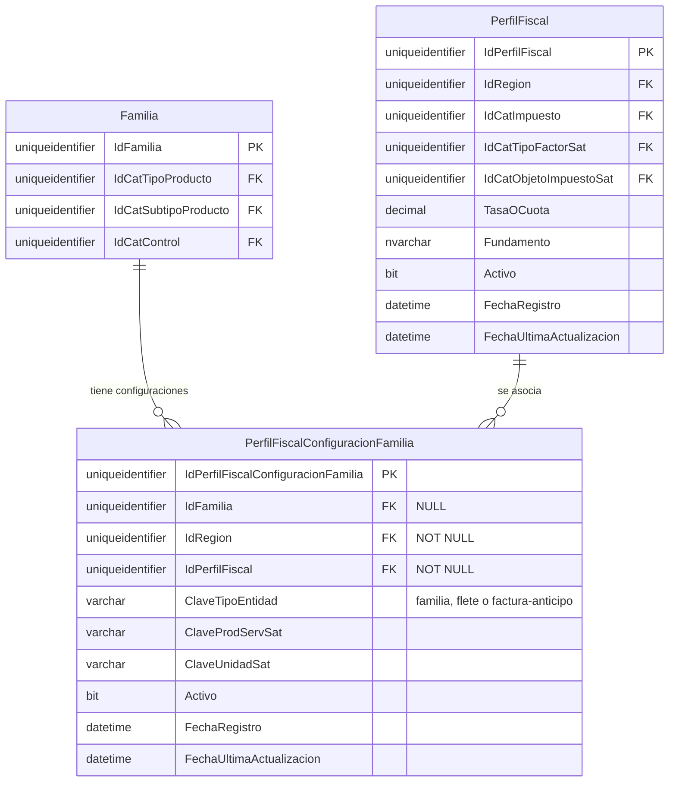

# Diccionario de Datos — R16A-RE-Cambio-PerfilFiscal

| Campo | Valor |
|---|---|
| **Cambio** | R16A-RE-Cambio-PerfilFiscal |
| **Nombre** | Perfil Fiscal — Configuración fiscal por Familia de Producto |
| **Base de datos** | ProquifaDotNet |
| **Servidor** | RYNL010 |
| **Versión** | 1.0 |

---

## Resumen Ejecutivo

Este cambio desbloquea el bloque **GAP-7 / GAP-8** de `R16A-RE-FU-019_BD.md`. Confirma que la configuración fiscal se define **a nivel Familia + Región** (sin override por Producto individual). Se crean 5 tablas nuevas en ProquifaDotNet y se modifica la tabla `Familia`.

**Decisión confirmada:**
- `PerfilFiscalConfiguracionFamilia` → nueva tabla de configuración fiscal por tipo de entidad (Familia, flete o factura-anticipo) + Región; contiene `ClaveProdServSat`, `ClaveUnidadSat` (SAT — solo MX) e `IdPerfilFiscal`; `IdFamilia` es nullable para cubrir configuraciones de flete y factura-anticipo sin Familia asociada
- `PerfilFiscal` → tabla única con `IdRegion`; filas MX (IVA) + filas PE (IGV); **sin override por Producto**; sin columnas `Nombre` ni `CodigoImpuesto` — el código del impuesto se deriva de `catImpuesto.Clave`
- `Familia` → **se agrega columna** `ClaveProductoServicioCFDI varchar` — clave SAT a nivel familia para uso general
- `catImpuesto` → catálogo compartido MX+PE: IVA (México) + IGV (Perú)
- `catTipoFactorSat`, `catObjetoImpuestoSat` → catálogos SAT; `catObjetoImpuestoSat` exclusivo MX (FK nullable en PE)

---

## Modelo de Datos

```
PerfilFiscalConfiguracionFamilia  (nueva — configuración fiscal por tipo de entidad + Región)
    ├── IdFamilia          FK → Familia (NULL — vacío para flete / factura-anticipo)
    ├── IdRegion           FK → Region  (NOT NULL)
    ├── IdPerfilFiscal     FK → PerfilFiscal (NOT NULL)
    ├── ClaveTipoEntidad   varchar — discriminador: 'familia' | 'flete' | 'factura-anticipo'
    ├── ClaveProdServSat   varchar(10) nullable  [solo MX — SAT; NULL para PE]
    └── ClaveUnidadSat     varchar(10) nullable  [solo MX — SAT; NULL para PE]

PerfilFiscal  (nueva — MX + PE separados por IdRegion)
    ├── IdRegion               FK → Region (NOT NULL)
    ├── IdCatImpuesto          FK → catImpuesto (NOT NULL — IVA para MX, IGV para PE)
    ├── IdCatTipoFactorSat     FK → catTipoFactorSat   [Tasa / Exento — compartido]
    ├── TasaOCuota             decimal(6,6)
    └── IdCatObjetoImpuestoSat FK nullable → catObjetoImpuestoSat  [NULL en filas PE]

catImpuesto           (nueva — catálogo compartido: IVA México + IGV Perú)
catTipoFactorSat      (nueva — catálogo maestro SAT, compartido MX+PE)
catObjetoImpuestoSat  (nueva — catálogo maestro SAT, exclusivo México)

Familia  (ALTER TABLE — agrega ClaveProductoServicioCFDI varchar)
```

---

## Entidades Afectadas

| Objeto                              | Tipo            | BD             | Impacto                | Descripción                                                                                      |
| ----------------------------------- | --------------- | -------------- | ---------------------- | ------------------------------------------------------------------------------------------------ |
| `catImpuesto`                       | Tabla nueva     | ProquifaDotNet | CREATE + INSERT seed   | Catálogo compartido MX+PE: IVA (México), IGV (Perú)                                             |
| `catTipoFactorSat`                  | Tabla nueva     | ProquifaDotNet | CREATE + INSERT seed   | Catálogo SAT: Tasa, Cuota, Exento (compartido MX+PE)                                            |
| `catObjetoImpuestoSat`              | Tabla nueva     | ProquifaDotNet | CREATE + INSERT seed   | Catálogo SAT: objetos de impuesto 01–04 (exclusivo México)                                       |
| `PerfilFiscal`                      | Tabla nueva     | ProquifaDotNet | CREATE + INSERT seed   | Perfiles MX (IVA 16%, IVA 0%, Exento) + PE (IGV 18%, IGV 0%, Exento), con `IdRegion`           |
| `PerfilFiscalConfiguracionFamilia`  | Tabla nueva     | ProquifaDotNet | CREATE + INSERT seed   | Configuración fiscal por tipo de entidad (familia / flete / factura-anticipo) + Región          |
| `Familia`                           | Tabla existente | ProquifaDotNet | ALTER TABLE            | Agrega columna `ClaveProductoServicioCFDI varchar` — clave SAT a nivel familia                  |
| `vMarcaFamilia`                     | Vista existente | ProquifaDotNet | ALTER VIEW             | Agrega `ClaveProdServSat`, `ClaveUnidadSat`, `TasaOCuota`, `TipoFactor` vía JOIN fiscal (`ClaveTipoEntidad = 'familia'`) |
| `vProducto`                         | Vista existente | ProquifaDotNet | ALTER VIEW             | Hereda los mismos campos fiscales con JOIN por `MarcaFamilia.IdFamilia` + `pmf.IdRegion`        |
| `vFlete`                            | Vista existente | ProquifaDotNet | ALTER VIEW             | Agrega los mismos campos fiscales con JOIN a `PerfilFiscalConfiguracionFamilia` (`ClaveTipoEntidad = 'flete'` + `f.IdRegion`) |

**Orden de ejecución obligatorio:**
`catImpuesto` → `catTipoFactorSat` → `catObjetoImpuestoSat` → `PerfilFiscal` → `PerfilFiscalConfiguracionFamilia` → `ALTER TABLE Familia` → `ALTER VIEW vMarcaFamilia` → `ALTER VIEW vProducto` → `ALTER VIEW vFlete`

---

## 1. catImpuesto

**Propósito:** Catálogo compartido MX+PE de tipos de impuesto. Incluye los impuestos aplicables en México (SAT) y Perú (SUNAT). No se modifica en operación; se precargan los datos.

| Columna | Tipo | Nulo | Default | Descripción |
|---|---|---|---|---|
| `IdCatImpuesto` | `uniqueidentifier` | NO | `NEWID()` | PK |
| `Clave` | `varchar(10)` | NO | — | Clave del impuesto: `001` ISR, `002` IVA, `003` IEPS (SAT MX) · `IGV` (Perú) |
| `Descripcion` | `varchar(100)` | NO | — | Descripción del impuesto |
| `Activo` | `bit` | NO | `1` | Borrado lógico |
| `FechaRegistro` | `datetime` | NO | `GETDATE()` | Fecha de alta |
| `FechaUltimaActualizacion` | `datetime` | NO | `GETDATE()` | Fecha de última modificación |

**Índices:**
- `PK_catImpuesto` (Clustered): `IdCatImpuesto`
- `UQ_catImpuesto_Clave` (Unique): `Clave`

**Relaciones:** ninguna FK hacia otras tablas (catálogo raíz).

```sql
-- Ejecutar en ProquifaDotNet
CREATE TABLE [dbo].[catImpuesto](
    [IdCatImpuesto] uniqueidentifier NOT NULL
        CONSTRAINT [DF_catImpuesto_Id] DEFAULT (NEWID()),
    [Clave]         varchar(10)  NOT NULL,
    [Descripcion]   varchar(100) NOT NULL,
    [Activo]        bit          NOT NULL CONSTRAINT [DF_catImpuesto_Activo] DEFAULT (1),
    [FechaRegistro] datetime NOT NULL CONSTRAINT [DF_catImpuesto_FechaRegistro] DEFAULT (GETDATE()),
    [FechaUltimaActualizacion] datetime NOT NULL CONSTRAINT [DF_DF_catImpuesto_FechaUltimaActualizacion] DEFAULT (GETDATE()),
    CONSTRAINT [PK_catImpuesto] PRIMARY KEY CLUSTERED ([IdCatImpuesto]),
    CONSTRAINT [UQ_catImpuesto_Clave] UNIQUE ([Clave])
);
GO

INSERT INTO [dbo].[catImpuesto] ([Clave], [Descripcion]) VALUES
    ('001', 'ISR'),
    ('002', 'IVA'),
    ('003', 'IEPS'),
    ('IGV', 'Impuesto General a las Ventas');
GO
```

---

## 2. catTipoFactorSat

**Propósito:** Catálogo maestro SAT de tipos de factor de impuesto.

| Columna | Tipo | Nulo | Default | Descripción |
|---|---|---|---|---|
| `IdCatTipoFactorSat` | `uniqueidentifier` | NO | `NEWID()` | PK |
| `Clave` | `varchar(10)` | NO | — | Clave SAT: `Tasa`, `Cuota`, `Exento` |
| `Descripcion` | `varchar(100)` | NO | — | Descripción del tipo de factor |
| `Activo` | `bit` | NO | `1` | Borrado lógico |
| `FechaRegistro` | `datetime` | NO | `GETDATE()` | Fecha de alta |
| `FechaUltimaActualizacion` | `datetime` | NO | `GETDATE()` | Fecha de última modificación |

**Índices:**
- `PK_catTipoFactorSat` (Clustered): `IdCatTipoFactorSat`
- `UQ_catTipoFactorSat_Clave` (Unique): `Clave`

```sql
CREATE TABLE [dbo].[catTipoFactorSat](
    [IdCatTipoFactorSat] uniqueidentifier NOT NULL
        CONSTRAINT [DF_catTipoFactorSat_Id] DEFAULT (NEWID()),
    [Clave]       varchar(10)  NOT NULL,
    [Descripcion] varchar(100) NOT NULL,
    [Activo]      bit          NOT NULL CONSTRAINT [DF_catTipoFactorSat_Activo] DEFAULT (1),
    [FechaRegistro] datetime NOT NULL CONSTRAINT [DF_catTipoFactorSat_FechaRegistro] DEFAULT (GETDATE()),
    [FechaUltimaActualizacion] datetime NOT NULL CONSTRAINT [DF_DF_catTipoFactorSat_FechaUltimaActualizacion] DEFAULT (GETDATE()),
    CONSTRAINT [PK_catTipoFactorSat] PRIMARY KEY CLUSTERED ([IdCatTipoFactorSat]),
    CONSTRAINT [UQ_catTipoFactorSat_Clave] UNIQUE ([Clave])
);
GO

INSERT INTO [dbo].[catTipoFactorSat] ([Clave], [Descripcion]) VALUES
    ('Tasa',   'Tasa'),
    ('Cuota',  'Cuota'),
    ('Exento', 'Exento');
GO
```

---

## 3. catObjetoImpuestoSat

**Propósito:** Catálogo maestro SAT de objetos de impuesto (campo `ObjetoImp` del CFDI 4.0).

| Columna | Tipo | Nulo | Default | Descripción |
|---|---|---|---|---|
| `IdCatObjetoImpuestoSat` | `uniqueidentifier` | NO | `NEWID()` | PK |
| `Clave` | `varchar(10)` | NO | — | Clave SAT: `01`–`04` |
| `Descripcion` | `varchar(200)` | NO | — | Descripción del objeto de impuesto |
| `Activo` | `bit` | NO | `1` | Borrado lógico |
| `FechaRegistro` | `datetime` | NO | `GETDATE()` | Fecha de alta |
| `FechaUltimaActualizacion` | `datetime` | NO | `GETDATE()` | Fecha de última modificación |

**Índices:**
- `PK_catObjetoImpuestoSat` (Clustered): `IdCatObjetoImpuestoSat`
- `UQ_catObjetoImpuestoSat_Clave` (Unique): `Clave`

```sql
CREATE TABLE [dbo].[catObjetoImpuestoSat](
    [IdCatObjetoImpuestoSat] uniqueidentifier NOT NULL
        CONSTRAINT [DF_catObjetoImpuestoSat_Id] DEFAULT (NEWID()),
    [Clave]       varchar(10)  NOT NULL,
    [Descripcion] varchar(200) NOT NULL,
    [Activo]      bit          NOT NULL CONSTRAINT [DF_catObjetoImpuestoSat_Activo] DEFAULT (1),
    [FechaRegistro] datetime NOT NULL CONSTRAINT [DF_catObjetoImpuestoSat_FechaRegistro] DEFAULT (GETDATE()),
    [FechaUltimaActualizacion] datetime NOT NULL CONSTRAINT [DF_DF_catObjetoImpuestoSat_FechaUltimaActualizacion] DEFAULT (GETDATE()),
    CONSTRAINT [PK_catObjetoImpuestoSat] PRIMARY KEY CLUSTERED ([IdCatObjetoImpuestoSat]),
    CONSTRAINT [UQ_catObjetoImpuestoSat_Clave] UNIQUE ([Clave])
);
GO

INSERT INTO [dbo].[catObjetoImpuestoSat] ([Clave], [Descripcion]) VALUES
    ('01', 'No objeto de impuesto'),
    ('02', 'Sí objeto de impuesto'),
    ('03', 'Sí objeto del impuesto y no obligado al desglose'),
    ('04', 'Sí objeto del impuesto y no causa impuesto');
GO
```

---


## 4. PerfilFiscal

**Propósito:** Catálogo de negocio unificado MX + PE que asocia la tasa de impuesto de una Familia con los datos necesarios para calcular impuestos y construir documentos fiscales. Discriminado por `IdRegion`. Lo administra PROQUIFA directamente en BD.

- **México (MX):** 3 filas. `IdCatImpuesto` apunta a IVA (`002`). Incluye `IdCatObjetoImpuestoSat`.
- **Perú (PE):** 3 filas. `IdCatImpuesto` apunta a IGV. `IdCatObjetoImpuestoSat` = `NULL` (no aplica SAT).

| Columna                  | Tipo               | Nulo | Default            | Descripción                                                                |
| ------------------------ | ------------------ | ---- | ------------------ | -------------------------------------------------------------------------- |
| `IdPerfilFiscal`         | `uniqueidentifier` | NO   | `NEWID()`          | PK                                                                         |
| `IdRegion`               | `uniqueidentifier` | NO   | —                  | FK → `Region` — discrimina MX vs PE                                        |
| `IdCatImpuesto`          | `uniqueidentifier` | NO   | —                  | FK → `catImpuesto` — IVA para MX, IGV para PE                              |
| `IdCatTipoFactorSat`     | `uniqueidentifier` | NO   | —                  | FK → `catTipoFactorSat` — `Tasa` o `Exento` (compartido MX+PE)             |
| `TasaOCuota`             | `decimal(6,6)`     | SÍ   | —                  | Valor de la tasa: `0.160000`, `0.180000`, `0.000000`, o `NULL` para Exento |
| `IdCatObjetoImpuestoSat` | `uniqueidentifier` | SÍ   | `NULL`             | FK → `catObjetoImpuestoSat`. Solo filas MX (`02`). `NULL` para PE          |
| `Fundamento`             | `nvarchar(200)`    | SÍ   | —                  | Referencia legal: `Art. 1 LIVA`, `TUO IGV Art. 1`, etc.                    |
| `Activo`                 | `bit`              | NO   | `1`                | Borrado lógico                                                             |
| `FechaRegistro`          | `datetime`     | NO   | `GETDATE()` | Fecha de alta                                                              |
| `FechaUltimaActualizacion`          | `datetime`     | NO   | `GETDATE()` | Fecha de última modificación |

**Índices:**
- `PK_PerfilFiscal` (Clustered): `IdPerfilFiscal`
- `IX_PerfilFiscal_IdRegion` (Non-Clustered): `IdRegion` (para filtrar por región)

**Relaciones:**
- `FK_PerfilFiscal_Region` → `Region.IdRegion`
- `FK_PerfilFiscal_catImpuesto` → `catImpuesto.IdCatImpuesto`
- `FK_PerfilFiscal_catTipoFactorSat` → `catTipoFactorSat.IdCatTipoFactorSat`
- `FK_PerfilFiscal_catObjetoImpuestoSat` → `catObjetoImpuestoSat.IdCatObjetoImpuestoSat` (nullable)

**Consideraciones especiales:**
- `CHECK CK_PerfilFiscal_TasaOCuota`: `TasaOCuota` es `NULL` si y solo si `catTipoFactorSat.Clave = 'Exento'`.
- Filas PE: `IdCatObjetoImpuestoSat` = `NULL` — el campo `ObjetoImp` del CFDI SAT no aplica para documentos de Perú.

```sql
-- Ejecutar en ProquifaDotNet (requiere catImpuesto, catTipoFactorSat, catObjetoImpuestoSat y Region)
CREATE TABLE [dbo].[PerfilFiscal](
    [IdPerfilFiscal] uniqueidentifier NOT NULL
        CONSTRAINT [DF_PerfilFiscal_Id] DEFAULT (NEWID()),
    [IdRegion]                uniqueidentifier NOT NULL
        CONSTRAINT [FK_PerfilFiscal_Region]
            FOREIGN KEY REFERENCES [dbo].[Region]([IdRegion]),
    [IdCatImpuesto]           uniqueidentifier NOT NULL
        CONSTRAINT [FK_PerfilFiscal_catImpuesto]
            FOREIGN KEY REFERENCES [dbo].[catImpuesto]([IdCatImpuesto]),
    [IdCatTipoFactorSat]      uniqueidentifier NOT NULL
        CONSTRAINT [FK_PerfilFiscal_catTipoFactorSat]
            FOREIGN KEY REFERENCES [dbo].[catTipoFactorSat]([IdCatTipoFactorSat]),
    [TasaOCuota]              decimal(6,6)     NULL,
    [IdCatObjetoImpuestoSat]  uniqueidentifier NULL
        CONSTRAINT [FK_PerfilFiscal_catObjetoImpuestoSat]
            FOREIGN KEY REFERENCES [dbo].[catObjetoImpuestoSat]([IdCatObjetoImpuestoSat]),
    [Fundamento]              nvarchar(200)    NULL,
    [Activo]      bit         NOT NULL CONSTRAINT [DF_PerfilFiscal_Activo] DEFAULT (1),
    [FechaRegistro] datetime NOT NULL CONSTRAINT [DF_PerfilFiscal_FechaRegistro] DEFAULT (GETDATE()),
    [FechaUltimaActualizacion] datetime NOT NULL CONSTRAINT [DF_DF_PerfilFiscal_FechaUltimaActualizacion] DEFAULT (GETDATE()),
    CONSTRAINT [PK_PerfilFiscal] PRIMARY KEY CLUSTERED ([IdPerfilFiscal]),
    CONSTRAINT [CK_PerfilFiscal_TasaOCuota] CHECK (
        ([TasaOCuota] IS NULL     AND EXISTS (SELECT 1 FROM [dbo].[catTipoFactorSat] t WHERE t.[IdCatTipoFactorSat] = [IdCatTipoFactorSat] AND t.[Clave] = 'Exento'))
        OR
        ([TasaOCuota] IS NOT NULL AND NOT EXISTS (SELECT 1 FROM [dbo].[catTipoFactorSat] t WHERE t.[IdCatTipoFactorSat] = [IdCatTipoFactorSat] AND t.[Clave] = 'Exento'))
    )
);
GO

CREATE NONCLUSTERED INDEX [IX_PerfilFiscal_IdRegion]
    ON [dbo].[PerfilFiscal] ([IdRegion]);
GO

-- =====================================================================
-- SEED México (3 filas MX)
-- =====================================================================

-- IVA General 16%
INSERT INTO [dbo].[PerfilFiscal]
    ([IdRegion], [IdCatImpuesto], [IdCatTipoFactorSat], [TasaOCuota], [IdCatObjetoImpuestoSat], [Fundamento])
SELECT
    (SELECT IdRegion        FROM [dbo].[Region]              WHERE Clave = 'mexico'),
    (SELECT IdCatImpuesto   FROM [dbo].[catImpuesto]         WHERE Clave = '002'),
    (SELECT IdCatTipoFactorSat     FROM [dbo].[catTipoFactorSat]     WHERE Clave = 'Tasa'),
    0.160000,
    (SELECT IdCatObjetoImpuestoSat FROM [dbo].[catObjetoImpuestoSat] WHERE Clave = '02'),
    'Art. 1 LIVA';

-- IVA Tasa 0% (publicaciones MX)
INSERT INTO [dbo].[PerfilFiscal]
    ([IdRegion], [IdCatImpuesto], [IdCatTipoFactorSat], [TasaOCuota], [IdCatObjetoImpuestoSat], [Fundamento])
SELECT
    (SELECT IdRegion        FROM [dbo].[Region]              WHERE Clave = 'mexico'),
    (SELECT IdCatImpuesto   FROM [dbo].[catImpuesto]         WHERE Clave = '002'),
    (SELECT IdCatTipoFactorSat     FROM [dbo].[catTipoFactorSat]     WHERE Clave = 'Tasa'),
    0.000000,
    (SELECT IdCatObjetoImpuestoSat FROM [dbo].[catObjetoImpuestoSat] WHERE Clave = '02'),
    'Art. 2-A LIVA';

-- Exento MX
INSERT INTO [dbo].[PerfilFiscal]
    ([IdRegion], [IdCatImpuesto], [IdCatTipoFactorSat], [TasaOCuota], [IdCatObjetoImpuestoSat], [Fundamento])
SELECT
    (SELECT IdRegion        FROM [dbo].[Region]              WHERE Clave = 'mexico'),
    (SELECT IdCatImpuesto   FROM [dbo].[catImpuesto]         WHERE Clave = '002'),
    (SELECT IdCatTipoFactorSat     FROM [dbo].[catTipoFactorSat]     WHERE Clave = 'Exento'),
    NULL,
    (SELECT IdCatObjetoImpuestoSat FROM [dbo].[catObjetoImpuestoSat] WHERE Clave = '02'),
    'Art. 9 LIVA';

-- =====================================================================
-- SEED Perú (3 filas PE — IdCatObjetoImpuestoSat = NULL)
-- =====================================================================

-- IGV 18% (tasa general Perú)
INSERT INTO [dbo].[PerfilFiscal]
    ([IdRegion], [IdCatImpuesto], [IdCatTipoFactorSat], [TasaOCuota], [IdCatObjetoImpuestoSat], [Fundamento])
SELECT
    (SELECT IdRegion        FROM [dbo].[Region]          WHERE Clave = 'peru'),
    (SELECT IdCatImpuesto   FROM [dbo].[catImpuesto]     WHERE Clave = 'IGV'),
    (SELECT IdCatTipoFactorSat FROM [dbo].[catTipoFactorSat] WHERE Clave = 'Tasa'),
    0.180000,
    NULL,
    'TUO IGV Art. 1 (D.S. 055-99-EF)';

-- IGV 0% (publicaciones / exportaciones PE)
INSERT INTO [dbo].[PerfilFiscal]
    ([IdRegion], [IdCatImpuesto], [IdCatTipoFactorSat], [TasaOCuota], [IdCatObjetoImpuestoSat], [Fundamento])
SELECT
    (SELECT IdRegion        FROM [dbo].[Region]          WHERE Clave = 'peru'),
    (SELECT IdCatImpuesto   FROM [dbo].[catImpuesto]     WHERE Clave = 'IGV'),
    (SELECT IdCatTipoFactorSat FROM [dbo].[catTipoFactorSat] WHERE Clave = 'Tasa'),
    0.000000,
    NULL,
    'TUO IGV Art. 19 — Exonerado/Inafecto';

-- Exento PE
INSERT INTO [dbo].[PerfilFiscal]
    ([IdRegion], [IdCatImpuesto], [IdCatTipoFactorSat], [TasaOCuota], [IdCatObjetoImpuestoSat], [Fundamento])
SELECT
    (SELECT IdRegion        FROM [dbo].[Region]          WHERE Clave = 'peru'),
    (SELECT IdCatImpuesto   FROM [dbo].[catImpuesto]     WHERE Clave = 'IGV'),
    (SELECT IdCatTipoFactorSat FROM [dbo].[catTipoFactorSat] WHERE Clave = 'Exento'),
    NULL,
    NULL,
    'TUO IGV — Operación no gravada';
GO
```

---

## 5. PerfilFiscalConfiguracionFamilia

**Propósito:** Tabla de configuración fiscal por tipo de entidad (Familia de producto, flete o factura-anticipo) y Región. Vincula cada entidad facturable con el perfil fiscal correcto para cada región y almacena las claves SAT que aplican para México. `IdFamilia` es nullable para soportar configuraciones de entidades que no son una Familia (flete, factura-anticipo).

| Columna                              | Tipo               | Nulo | Default     | Descripción                                                                       |
| ------------------------------------ | ------------------ | ---- | ----------- | --------------------------------------------------------------------------------- |
| `IdPerfilFiscalConfiguracionFamilia` | `uniqueidentifier` | NO   | `NEWID()`   | PK                                                                                |
| `IdFamilia`                          | `uniqueidentifier` | SÍ   | `NULL`      | FK → `Familia`. NULL cuando `ClaveTipoEntidad` = `'flete'` o `'factura-anticipo'` |
| `IdRegion`                           | `uniqueidentifier` | NO   | —           | FK → `Region`                                                                     |
| `IdPerfilFiscal`                     | `uniqueidentifier` | NO   | —           | FK → `PerfilFiscal` — debe corresponder a la misma `IdRegion`                     |
| `ClaveTipoEntidad`                   | `varchar(30)`      | NO   | —           | Discriminador: `'familia'` \| `'flete'` \| `'factura-anticipo'`                   |
| `ClaveProdServSat`                   | `varchar(10)`      | SÍ   | `NULL`      | Clave SAT c_ClaveProdServ. Solo MX. `NULL` = no facturable MX o fila PE           |
| `ClaveUnidadSat`                     | `varchar(10)`      | SÍ   | `NULL`      | Clave SAT c_ClaveUnidad: `E48`, `H87`, `ACT`. Solo MX                             |
| `Activo`                             | `bit`              | NO   | `1`         | Borrado lógico                                                                    |
| `FechaRegistro`                      | `datetime`         | NO   | `GETDATE()` | Fecha de alta                                                                     |
| `FechaUltimaActualizacion`           | `datetime`         | NO   | `GETDATE()` | Fecha de última modificación                                                      |

**Índices:**
- `PK_PerfilFiscalConfiguracionFamilia` (Clustered): `IdPerfilFiscalConfiguracionFamilia`
- `IX_PfcFamilia_IdFamilia_IdRegion` (Non-Clustered): `(IdFamilia, IdRegion)` — resolución rápida por familia y región
- `IX_PfcFamilia_ClaveTipoEntidad_IdRegion` (Non-Clustered): `(ClaveTipoEntidad, IdRegion)` — resolución rápida por tipo de entidad

**Relaciones:**
- `FK_PfcFamilia_Familia` → `Familia.IdFamilia` (nullable)
- `FK_PfcFamilia_Region` → `Region.IdRegion`
- `FK_PfcFamilia_PerfilFiscal` → `PerfilFiscal.IdPerfilFiscal`

**Consideraciones especiales:**
- La integridad de `IdPerfilFiscal.IdRegion = PerfilFiscalConfiguracionFamilia.IdRegion` se garantiza en la capa de aplicación.
- Cuando `ClaveTipoEntidad = 'familia'`: `IdFamilia` debe estar poblado.
- Cuando `ClaveTipoEntidad = 'flete'` o `'factura-anticipo'`: `IdFamilia` es `NULL` y aplica a todos los fletes / FAA de esa región.
- `ClaveProdServSat IS NULL` en fila MX → entidad no facturable en México.

```sql
-- Ejecutar en ProquifaDotNet (requiere PerfilFiscal y Region ya creadas)
CREATE TABLE [dbo].[PerfilFiscalConfiguracionFamilia](
    [IdPerfilFiscalConfiguracionFamilia] uniqueidentifier NOT NULL
        CONSTRAINT [DF_PfcFamilia_Id] DEFAULT (NEWID()),
    [IdFamilia]       uniqueidentifier NULL
        CONSTRAINT [FK_PfcFamilia_Familia]
            FOREIGN KEY REFERENCES [dbo].[Familia]([IdFamilia]),
    [IdRegion]        uniqueidentifier NOT NULL
        CONSTRAINT [FK_PfcFamilia_Region]
            FOREIGN KEY REFERENCES [dbo].[Region]([IdRegion]),
    [IdPerfilFiscal]  uniqueidentifier NOT NULL
        CONSTRAINT [FK_PfcFamilia_PerfilFiscal]
            FOREIGN KEY REFERENCES [dbo].[PerfilFiscal]([IdPerfilFiscal]),
    [ClaveTipoEntidad] varchar(30) NOT NULL
        CONSTRAINT [CK_PfcFamilia_ClaveTipoEntidad]
            CHECK ([ClaveTipoEntidad] IN ('familia', 'flete', 'factura-anticipo')),
    [ClaveProdServSat] varchar(10) NULL,
    [ClaveUnidadSat]   varchar(10) NULL,
    [Activo]           bit         NOT NULL CONSTRAINT [DF_PfcFamilia_Activo] DEFAULT (1),
    [FechaRegistro]    datetime    NOT NULL CONSTRAINT [DF_PfcFamilia_FechaRegistro] DEFAULT (GETDATE()),
    [FechaUltimaActualizacion] datetime NOT NULL CONSTRAINT [DF_PfcFamilia_FechaUltimaActualizacion] DEFAULT (GETDATE()),
    CONSTRAINT [PK_PerfilFiscalConfiguracionFamilia]
        PRIMARY KEY CLUSTERED ([IdPerfilFiscalConfiguracionFamilia])
);
GO

CREATE NONCLUSTERED INDEX [IX_PfcFamilia_IdFamilia_IdRegion]
    ON [dbo].[PerfilFiscalConfiguracionFamilia] ([IdFamilia], [IdRegion]);
GO

CREATE NONCLUSTERED INDEX [IX_PfcFamilia_ClaveTipoEntidad_IdRegion]
    ON [dbo].[PerfilFiscalConfiguracionFamilia] ([ClaveTipoEntidad], [IdRegion]);
GO

-- ==========================================================================
-- SEED — mapeo de familias y entidades especiales
-- Verificar los nombres exactos de familia en BD antes de ejecutar.
-- ==========================================================================

DECLARE @RegionMX uniqueidentifier = (SELECT IdRegion FROM [dbo].[Region] WHERE Clave = 'mexico');
DECLARE @RegionPE uniqueidentifier = (SELECT IdRegion FROM [dbo].[Region] WHERE Clave = 'peru');
DECLARE @PfIva16  uniqueidentifier = (SELECT IdPerfilFiscal FROM [dbo].[PerfilFiscal] WHERE IdRegion = @RegionMX AND TasaOCuota = 0.160000);
DECLARE @PfIva0   uniqueidentifier = (SELECT IdPerfilFiscal FROM [dbo].[PerfilFiscal] WHERE IdRegion = @RegionMX AND TasaOCuota = 0.000000);
DECLARE @PfIgv18  uniqueidentifier = (SELECT IdPerfilFiscal FROM [dbo].[PerfilFiscal] WHERE IdRegion = @RegionPE AND TasaOCuota = 0.180000);
DECLARE @PfIgv0   uniqueidentifier = (SELECT IdPerfilFiscal FROM [dbo].[PerfilFiscal] WHERE IdRegion = @RegionPE AND TasaOCuota = 0.000000);

-- ── Familias ──────────────────────────────────────────────────────────────

-- Biológico
INSERT INTO [dbo].[PerfilFiscalConfiguracionFamilia]
    ([IdFamilia], [IdRegion], [IdPerfilFiscal], [ClaveTipoEntidad], [ClaveProdServSat], [ClaveUnidadSat])
SELECT IdFamilia, @RegionMX, @PfIva16, 'familia', '41116132', 'H87' FROM [dbo].[Familia] WHERE Nombre = 'Biológico';
INSERT INTO [dbo].[PerfilFiscalConfiguracionFamilia]
    ([IdFamilia], [IdRegion], [IdPerfilFiscal], [ClaveTipoEntidad])
SELECT IdFamilia, @RegionPE, @PfIgv18, 'familia' FROM [dbo].[Familia] WHERE Nombre = 'Biológico';

-- Estándares
INSERT INTO [dbo].[PerfilFiscalConfiguracionFamilia]
    ([IdFamilia], [IdRegion], [IdPerfilFiscal], [ClaveTipoEntidad], [ClaveProdServSat], [ClaveUnidadSat])
SELECT IdFamilia, @RegionMX, @PfIva16, 'familia', '41116107', 'H87' FROM [dbo].[Familia] WHERE Nombre = 'Estándares';
INSERT INTO [dbo].[PerfilFiscalConfiguracionFamilia]
    ([IdFamilia], [IdRegion], [IdPerfilFiscal], [ClaveTipoEntidad])
SELECT IdFamilia, @RegionPE, @PfIgv18, 'familia' FROM [dbo].[Familia] WHERE Nombre = 'Estándares';

-- Reactivos
INSERT INTO [dbo].[PerfilFiscalConfiguracionFamilia]
    ([IdFamilia], [IdRegion], [IdPerfilFiscal], [ClaveTipoEntidad], [ClaveProdServSat], [ClaveUnidadSat])
SELECT IdFamilia, @RegionMX, @PfIva16, 'familia', '41116105', 'H87' FROM [dbo].[Familia] WHERE Nombre = 'Reactivos';
INSERT INTO [dbo].[PerfilFiscalConfiguracionFamilia]
    ([IdFamilia], [IdRegion], [IdPerfilFiscal], [ClaveTipoEntidad])
SELECT IdFamilia, @RegionPE, @PfIgv18, 'familia' FROM [dbo].[Familia] WHERE Nombre = 'Reactivos';

-- Publicaciones (IVA 0% MX / IGV 0% PE — confirmar con negocio)
INSERT INTO [dbo].[PerfilFiscalConfiguracionFamilia]
    ([IdFamilia], [IdRegion], [IdPerfilFiscal], [ClaveTipoEntidad], [ClaveProdServSat], [ClaveUnidadSat])
SELECT IdFamilia, @RegionMX, @PfIva0, 'familia', '55101500', 'H87' FROM [dbo].[Familia] WHERE Nombre = 'Publicaciones';
INSERT INTO [dbo].[PerfilFiscalConfiguracionFamilia]
    ([IdFamilia], [IdRegion], [IdPerfilFiscal], [ClaveTipoEntidad])
SELECT IdFamilia, @RegionPE, @PfIgv0, 'familia' FROM [dbo].[Familia] WHERE Nombre = 'Publicaciones';

-- Capacitaciones
INSERT INTO [dbo].[PerfilFiscalConfiguracionFamilia]
    ([IdFamilia], [IdRegion], [IdPerfilFiscal], [ClaveTipoEntidad], [ClaveProdServSat], [ClaveUnidadSat])
SELECT IdFamilia, @RegionMX, @PfIva16, 'familia', '86101600', 'E48' FROM [dbo].[Familia] WHERE Nombre = 'Capacitaciones';
INSERT INTO [dbo].[PerfilFiscalConfiguracionFamilia]
    ([IdFamilia], [IdRegion], [IdPerfilFiscal], [ClaveTipoEntidad])
SELECT IdFamilia, @RegionPE, @PfIgv18, 'familia' FROM [dbo].[Familia] WHERE Nombre = 'Capacitaciones';

-- Labware
INSERT INTO [dbo].[PerfilFiscalConfiguracionFamilia]
    ([IdFamilia], [IdRegion], [IdPerfilFiscal], [ClaveTipoEntidad], [ClaveProdServSat], [ClaveUnidadSat])
SELECT IdFamilia, @RegionMX, @PfIva16, 'familia', '41116100', 'H87' FROM [dbo].[Familia] WHERE Nombre = 'Labware';
INSERT INTO [dbo].[PerfilFiscalConfiguracionFamilia]
    ([IdFamilia], [IdRegion], [IdPerfilFiscal], [ClaveTipoEntidad])
SELECT IdFamilia, @RegionPE, @PfIgv18, 'familia' FROM [dbo].[Familia] WHERE Nombre = 'Labware';

-- Servicios
INSERT INTO [dbo].[PerfilFiscalConfiguracionFamilia]
    ([IdFamilia], [IdRegion], [IdPerfilFiscal], [ClaveTipoEntidad], [ClaveProdServSat], [ClaveUnidadSat])
SELECT IdFamilia, @RegionMX, @PfIva16, 'familia', '85131701', 'H87' FROM [dbo].[Familia] WHERE Nombre = 'Servicios';
INSERT INTO [dbo].[PerfilFiscalConfiguracionFamilia]
    ([IdFamilia], [IdRegion], [IdPerfilFiscal], [ClaveTipoEntidad])
SELECT IdFamilia, @RegionPE, @PfIgv18, 'familia' FROM [dbo].[Familia] WHERE Nombre = 'Servicios';

-- ── Flete ─────────────────────────────────────────────────────────────────
-- IdFamilia = NULL — aplica a todos los fletes de la región
INSERT INTO [dbo].[PerfilFiscalConfiguracionFamilia]
    ([IdFamilia], [IdRegion], [IdPerfilFiscal], [ClaveTipoEntidad], [ClaveProdServSat], [ClaveUnidadSat])
VALUES (NULL, @RegionMX, @PfIva16, 'flete', '78102205', 'E48');
INSERT INTO [dbo].[PerfilFiscalConfiguracionFamilia]
    ([IdFamilia], [IdRegion], [IdPerfilFiscal], [ClaveTipoEntidad])
VALUES (NULL, @RegionPE, @PfIgv18, 'flete');

-- ── Factura Anticipo ──────────────────────────────────────────────────────
-- IdFamilia = NULL — solo MX (anticipo no aplica PE)
INSERT INTO [dbo].[PerfilFiscalConfiguracionFamilia]
    ([IdFamilia], [IdRegion], [IdPerfilFiscal], [ClaveTipoEntidad], [ClaveProdServSat], [ClaveUnidadSat])
VALUES (NULL, @RegionMX, @PfIva16, 'factura-anticipo', '84111506', 'ACT');

-- Dispositivo médico: no se inserta ninguna fila (no facturable — Regla 7)
GO
```

> ⚠️ **Verificar los nombres exactos de familia en BD antes de ejecutar el seed.** El perfil PE de Publicaciones (`IGV 0%`) debe confirmarse con el área de negocio.

---

## 6. Familia — ALTER TABLE

**Propósito:** Agrega la columna `ClaveProductoServicioCFDI` a la tabla existente `Familia`. Esta clave SAT a nivel familia permite identificar el producto/servicio CFDI de forma directa, complementando la configuración en `PerfilFiscalConfiguracionFamilia`.

| Columna                    | Tipo          | Nulo | Default | Descripción                                               |
| -------------------------- | ------------- | ---- | ------- | --------------------------------------------------------- |
| `ClaveProductoServicioCFDI` | `varchar(10)` | SÍ   | `NULL`  | Clave SAT c_ClaveProdServ a nivel familia. Nullable para familias no facturables. |

```sql
-- Ejecutar en ProquifaDotNet
ALTER TABLE [dbo].[Familia]
    ADD [ClaveProductoServicioCFDI] varchar(10) NULL;
GO
```

> La columna se agrega como nullable para no afectar filas existentes. Poblar con el valor correspondiente vía UPDATE después de ejecutar el seed de `PerfilFiscalConfiguracionFamilia`.

---

## 7. vMarcaFamilia — ALTER VIEW

**Propósito:** Agrega los campos fiscales derivados de `PerfilFiscalConfiguracionFamilia` a la vista existente. El JOIN filtra por `IdFamilia` y `ClaveTipoEntidad = 'familia'`, usando `mf.IdRegion` como discriminador de región.

**Columnas nuevas expuestas:**

| Columna nueva       | Origen                                    | Descripción                                        |
| ------------------- | ----------------------------------------- | -------------------------------------------------- |
| `ClaveProdServSat`  | `PerfilFiscalConfiguracionFamilia`        | Clave SAT c_ClaveProdServ para la familia (MX)     |
| `ClaveUnidadSat`    | `PerfilFiscalConfiguracionFamilia`        | Clave SAT c_ClaveUnidad para la familia (MX)       |
| `TasaOCuota`        | `PerfilFiscal`                            | Tasa del impuesto aplicable (IVA/IGV)              |
| `TipoFactor`        | `catTipoFactorSat.Clave`                  | Factor SAT: `Tasa`, `Cuota` o `Exento`             |

**JOIN necesario** (LEFT JOIN — nullable cuando la familia no tiene configuración fiscal):

```sql
LEFT JOIN [dbo].[PerfilFiscalConfiguracionFamilia] pfc
    ON  pfc.IdFamilia        = mf.IdFamilia
    AND pfc.IdRegion         = mf.IdRegion
    AND pfc.ClaveTipoEntidad = 'familia'
    AND pfc.Activo           = 1
LEFT JOIN [dbo].[PerfilFiscal]      pf2 ON pf2.IdPerfilFiscal     = pfc.IdPerfilFiscal
LEFT JOIN [dbo].[catTipoFactorSat]  ctf ON ctf.IdCatTipoFactorSat = pf2.IdCatTipoFactorSat
```

**Columnas a agregar al SELECT:**

```sql
pfc.ClaveProdServSat,
pfc.ClaveUnidadSat,
pf2.TasaOCuota,
ctf.Clave AS TipoFactor
```

**Script completo ALTER VIEW:**

```sql
-- Ejecutar en ProquifaDotNet
-- Requiere que PerfilFiscalConfiguracionFamilia, PerfilFiscal y catTipoFactorSat estén creadas.
ALTER VIEW [dbo].[vMarcaFamilia]
AS
    SELECT mf.*,
        cmfe.Orden                AS CatEstadoMarcaFamiliaOrden,
        m.Nombre                  AS NombreMarca,
        p.Nombre                  AS NombreProveedor,
        p.IdCatMonedaVentas,
        p.IdCatMonedaPagos,
        catTP.IdCatTipoProducto,
        catTP.Tipo,
        catTP.Clave               AS ClaveTipo,
        catSP.IdCatSubtipoProducto,
        catSP.Subtipo,
        catSP.Clave               AS ClaveSubtipo,
        catCP.IdCatControl,
        catCP.Control,
        catCP.Clave               AS ClaveControl,
        catCP.Controlado,
        MarcaProducto.Productos,
        mfp.IdMarcaFamiliaProveedor,
        catTP.Orden OrdenTipo, catSP.Orden OrdenSubtipo, catCP.Orden OrdenControl,
        CONCAT(catTP.Orden, catSP.Orden, catCP.Orden)   AS Orden,
        CAST((CASE WHEN mfp.IdMarcaFamiliaProveedor IS NOT NULL THEN 1 ELSE 0 END) AS BIT)
                                  AS TieneProveedorPrincipal,
        CONCAT(catTP.Tipo, ' ', catSP.Subtipo, ' ', catCP.Control) AS NombreFamilia,
        P.NombreImagen,
        CAST(IIF(vpr.NecesitaImportacion IS NULL, 0, vpr.NecesitaImportacion) AS BIT)
                                  AS NecesitaImportacion,
        r.Nombre                  AS Region,
        r.Clave                   AS ClaveRegion,
        r.ClaveISO                AS ClaveISORegion,
        -- ── Campos fiscales (R16A-RE-Cambio-PerfilFiscal) ──────────────
        pfc.ClaveProdServSat,
        pfc.ClaveUnidadSat,
        pf2.TasaOCuota,
        ctf.Clave                 AS TipoFactor
    FROM MarcaFamilia mf
        INNER JOIN catMarcaFamiliaEstado cmfe ON cmfe.Clave = mf.catEstadoMarcaFamiliaClave
        INNER JOIN Marca m                    ON m.IdMarca  = mf.IdMarca
        INNER JOIN Familia f                  ON mf.IdFamilia = f.IdFamilia
        INNER JOIN catTipoProducto catTP      ON f.IdCatTipoProducto    = catTP.IdCatTipoProducto
        INNER JOIN catSubtipoProducto catSP   ON f.IdCatSubtipoProducto = catSP.IdCatSubtipoProducto
        INNER JOIN catControl catCP           ON catCP.IdCatControl     = f.IdCatControl
        LEFT  JOIN MarcaFamiliaProveedor mfp  ON mf.IdMarcaFamilia = mfp.IdMarcaFamilia
                                             AND mfp.IdProveedor   = mf.IdProveedor
                                             AND mfp.Activo        = 1
        LEFT  JOIN vProveedor P               ON p.IdProveedor  = mf.IdProveedor
        OUTER APPLY (
            SELECT COUNT(p2.IdProducto) AS Productos
            FROM   Producto p2
            INNER JOIN ProductoMarcaFamilia pmf2 ON pmf2.Activo = 1
                                                AND pmf2.IdProducto    = p2.IdProducto
            WHERE pmf2.IdMarcaFamilia = mf.IdMarcaFamilia
        ) MarcaProducto
        LEFT  JOIN Region r                   ON r.IdRegion   = mf.IdRegion
        LEFT  JOIN vProveedorRegion vpr       ON vpr.IdProveedor = mf.IdProveedor
                                             AND vpr.IdRegion   = mf.IdRegion
        -- ── JOIN fiscal ────────────────────────────────────────────────
        LEFT  JOIN PerfilFiscalConfiguracionFamilia pfc
                                              ON  pfc.IdFamilia        = mf.IdFamilia
                                              AND pfc.IdRegion         = mf.IdRegion
                                              AND pfc.ClaveTipoEntidad = 'familia'
                                              AND pfc.Activo           = 1
        LEFT  JOIN PerfilFiscal pf2           ON pf2.IdPerfilFiscal     = pfc.IdPerfilFiscal
        LEFT  JOIN catTipoFactorSat ctf       ON ctf.IdCatTipoFactorSat = pf2.IdCatTipoFactorSat;
GO
```

---

## 8. vProducto — ALTER VIEW

**Propósito:** `vProducto` expone datos de producto con contexto de `MarcaFamilia` y `ProductoMarcaFamilia` (región por producto). Al igual que `vMarcaFamilia`, debe incluir los campos fiscales filtrando `PerfilFiscalConfiguracionFamilia` por `IdFamilia` de la familia del producto y `ClaveTipoEntidad = 'familia'`. La región se toma de `ProductoMarcaFamilia.IdRegion` (alias `pmf`).

**Columnas nuevas expuestas:**

| Columna nueva       | Origen                                    | Descripción                                        |
| ------------------- | ----------------------------------------- | -------------------------------------------------- |
| `ClaveProdServSat`  | `PerfilFiscalConfiguracionFamilia`        | Clave SAT c_ClaveProdServ (MX)                     |
| `ClaveUnidadSat`    | `PerfilFiscalConfiguracionFamilia`        | Clave SAT c_ClaveUnidad (MX)                       |
| `TasaOCuota`        | `PerfilFiscal`                            | Tasa del impuesto aplicable                        |
| `TipoFactor`        | `catTipoFactorSat.Clave`                  | Factor SAT: `Tasa`, `Cuota` o `Exento`             |

**JOIN necesario** (agregar al FROM existente de `vProducto`, usando alias `pmf` ya presente para `ProductoMarcaFamilia`):

```sql
LEFT JOIN [dbo].[PerfilFiscalConfiguracionFamilia] pfc
    ON  pfc.IdFamilia        = dbo.MarcaFamilia.IdFamilia
    AND pfc.IdRegion         = pmf.IdRegion
    AND pfc.ClaveTipoEntidad = 'familia'
    AND pfc.Activo           = 1
LEFT JOIN [dbo].[PerfilFiscal]     pf2 ON pf2.IdPerfilFiscal     = pfc.IdPerfilFiscal
LEFT JOIN [dbo].[catTipoFactorSat] ctf ON ctf.IdCatTipoFactorSat = pf2.IdCatTipoFactorSat
```

**Columnas a agregar al SELECT:**

```sql
pfc.ClaveProdServSat,
pfc.ClaveUnidadSat,
pf2.TasaOCuota,
ctf.Clave AS TipoFactor
```

> ⚠️ El script completo de `ALTER VIEW [dbo].[vProducto]` se omite aquí por la extensión de la vista (100+ columnas). Agregar únicamente las líneas de JOIN y columnas indicadas arriba al final del SELECT y del FROM existentes.

---

## 9. vFlete — ALTER VIEW

**Propósito:** `vFlete` expone datos de la tabla `Flete` con contexto de región (`f.IdRegion`). Debe incluir los campos fiscales obtenidos de `PerfilFiscalConfiguracionFamilia` filtrando por `ClaveTipoEntidad = 'flete'` y la región del flete.

**Columnas nuevas expuestas:**

| Columna nueva       | Origen                                    | Descripción                                      |
| ------------------- | ----------------------------------------- | ------------------------------------------------ |
| `ClaveProdServSat`  | `PerfilFiscalConfiguracionFamilia`        | Clave SAT c_ClaveProdServ para flete (MX)        |
| `ClaveUnidadSat`    | `PerfilFiscalConfiguracionFamilia`        | Clave SAT c_ClaveUnidad para flete (MX)          |
| `TasaOCuota`        | `PerfilFiscal`                            | Tasa del impuesto aplicable al flete             |
| `TipoFactor`        | `catTipoFactorSat.Clave`                  | Factor SAT: `Tasa`, `Cuota` o `Exento`           |

**JOIN necesario** (agregar al FROM de `vFlete`, usando `f.IdRegion` ya disponible):

```sql
LEFT JOIN [dbo].[PerfilFiscalConfiguracionFamilia] pfc
    ON  pfc.IdFamilia        IS NULL
    AND pfc.IdRegion         = f.IdRegion
    AND pfc.ClaveTipoEntidad = 'flete'
    AND pfc.Activo           = 1
LEFT JOIN [dbo].[PerfilFiscal]     pf2 ON pf2.IdPerfilFiscal     = pfc.IdPerfilFiscal
LEFT JOIN [dbo].[catTipoFactorSat] ctf ON ctf.IdCatTipoFactorSat = pf2.IdCatTipoFactorSat
```

**Script ALTER VIEW:**

```sql
-- Ejecutar en ProquifaDotNet
ALTER VIEW [dbo].[vFlete]
AS
    SELECT
        F.*,
        r.Nombre,
        r.ClaveISO,
        catUF.UnidadFlete,
        catF.Fletera,
        catF.Clave          AS ClaveFletera,
        catM.Moneda,
        catM.ClaveMoneda,
        -- ── Campos fiscales (R16A-RE-Cambio-PerfilFiscal) ──────────────
        pfc.ClaveProdServSat,
        pfc.ClaveUnidadSat,
        pf2.TasaOCuota,
        ctf.Clave           AS TipoFactor
    FROM Flete F
        INNER JOIN catUnidadFlete catUF ON F.IdCatUnidadFlete = catUF.IdCatUnidadFlete
        INNER JOIN catFletera     catF  ON catF.IdCatFletera  = F.IdCatFletera
        INNER JOIN catMoneda      catM  ON catM.IdCatMoneda   = F.IdCatMoneda
        INNER JOIN Region         r     ON r.IdRegion         = F.IdRegion
        -- ── JOIN fiscal ────────────────────────────────────────────────
        LEFT  JOIN PerfilFiscalConfiguracionFamilia pfc
                                         ON  pfc.IdFamilia        IS NULL
                                         AND pfc.IdRegion         = F.IdRegion
                                         AND pfc.ClaveTipoEntidad = 'flete'
                                         AND pfc.Activo           = 1
        LEFT  JOIN PerfilFiscal     pf2  ON pf2.IdPerfilFiscal     = pfc.IdPerfilFiscal
        LEFT  JOIN catTipoFactorSat ctf  ON ctf.IdCatTipoFactorSat = pf2.IdCatTipoFactorSat;
GO
```

---

## 10. Entidades consumidoras de campos fiscales

Resumen de qué vista provee los campos fiscales a cada entidad del dominio.

### Producto — consume `vProducto`

Los campos `TipoFactor`, `TasaOCuota`, `ClaveProdServSat` y `ClaveUnidadSat` quedan disponibles en `vProducto` una vez aplicado el ALTER VIEW de la sección 8. Las siguientes entidades los obtienen al consultar `vProducto`:

| Entidad                        | Campos fiscales que consume                                              |
| ------------------------------ | ------------------------------------------------------------------------ |
| `cotPartidaCotizacion`         | `TipoFactor`, `TasaOCuota`, `ClaveProdServSat`, `ClaveUnidadSat`         |
| `cotProductoOferta`            | `TipoFactor`, `TasaOCuota`, `ClaveProdServSat`, `ClaveUnidadSat`         |
| `pcPartidaPromesaDeCompra`     | `TipoFactor`, `TasaOCuota`, `ClaveProdServSat`, `ClaveUnidadSat`         |
| `ppPartidaPedido`              | `TipoFactor`, `TasaOCuota`, `ClaveProdServSat`, `ClaveUnidadSat`         |
| `tpPartidaPedido`              | `TipoFactor`, `TasaOCuota`, `ClaveProdServSat`, `ClaveUnidadSat`         |

### Flete — consume `vFlete`

Los campos fiscales de flete se resuelven vía `PerfilFiscalConfiguracionFamilia` con `ClaveTipoEntidad = 'flete'` y quedan expuestos en `vFlete` (sección 9). Las siguientes entidades los consumen:

| Entidad                            | Campos fiscales que consume                                          |
| ---------------------------------- | -------------------------------------------------------------------- |
| `cotCotizacionFleteExpress`        | `TipoFactor`, `TasaOCuota`, `ClaveProdServSat`, `ClaveUnidadSat`    |
| `cotCotizacionFleteUltimaMilla`    | `TipoFactor`, `TasaOCuota`, `ClaveProdServSat`, `ClaveUnidadSat`    |
| `pcPromesaDeCompraFleteUltimaMilla`| `TipoFactor`, `TasaOCuota`, `ClaveProdServSat`, `ClaveUnidadSat`    |
| `ppPedidoFleteExpress`             | `TipoFactor`, `TasaOCuota`, `ClaveProdServSat`, `ClaveUnidadSat`    |
| `ppPedidoFleteUltimaMilla`         | `TipoFactor`, `TasaOCuota`, `ClaveProdServSat`, `ClaveUnidadSat`    |
| `tpPedidoFleteExpress`             | `TipoFactor`, `TasaOCuota`, `ClaveProdServSat`, `ClaveUnidadSat`    |
| `tpPedidoFleteUltimaMilla`         | `TipoFactor`, `TasaOCuota`, `ClaveProdServSat`, `ClaveUnidadSat`    |

> Las entidades consumidoras **no necesitan modificación de tablas** — leen los campos fiscales directamente de `vProducto` o `vFlete` según el tipo de entidad. Si estas entidades tienen procedimientos almacenados o BOs que proyectan columnas explícitas, deberán incluir los 4 campos nuevos en sus SELECT y DTOs correspondientes.

---

## Consultas de referencia

### Resolución fiscal de una partida por producto (con región)

```sql
-- Al armar una partida de documento fiscal, dado @IdProducto y @ClaveRegion ('mexico' | 'peru'):
DECLARE @IdRegion uniqueidentifier = (SELECT IdRegion FROM [dbo].[Region] WHERE Clave = @ClaveRegion);

SELECT
    pfc.ClaveProdServSat,
    pfc.ClaveUnidadSat,
    imp.Clave                  AS CodigoImpuesto,    -- '002' IVA (MX) | 'IGV' (PE)
    pf.TasaOCuota,
    tf.Clave                   AS TipoFactor,
    oi.Clave                   AS ObjetoImpuestoSat  -- NULL para PE
FROM       dbo.MarcaFamilia                      mf
INNER JOIN dbo.PerfilFiscalConfiguracionFamilia  pfc ON pfc.IdFamilia = mf.IdFamilia
                                                    AND pfc.IdRegion   = @IdRegion
                                                    AND pfc.ClaveTipoEntidad = 'familia'
                                                    AND pfc.Activo     = 1
INNER JOIN dbo.PerfilFiscal                      pf  ON pf.IdPerfilFiscal     = pfc.IdPerfilFiscal
INNER JOIN dbo.catImpuesto                       imp ON imp.IdCatImpuesto     = pf.IdCatImpuesto
INNER JOIN dbo.catTipoFactorSat                  tf  ON tf.IdCatTipoFactorSat = pf.IdCatTipoFactorSat
LEFT  JOIN dbo.catObjetoImpuestoSat              oi  ON oi.IdCatObjetoImpuestoSat = pf.IdCatObjetoImpuestoSat
WHERE mf.IdProducto = @IdProducto
  AND mf.Activo     = 1;
```

### Resolución fiscal de un flete o factura-anticipo

```sql
-- Para flete o factura-anticipo, dado @ClaveTipoEntidad ('flete' | 'factura-anticipo') y @ClaveRegion:
DECLARE @IdRegion uniqueidentifier = (SELECT IdRegion FROM [dbo].[Region] WHERE Clave = @ClaveRegion);

SELECT
    pfc.ClaveProdServSat,
    pfc.ClaveUnidadSat,
    imp.Clave   AS CodigoImpuesto,
    pf.TasaOCuota,
    tf.Clave    AS TipoFactor,
    oi.Clave    AS ObjetoImpuestoSat
FROM       dbo.PerfilFiscalConfiguracionFamilia  pfc
INNER JOIN dbo.PerfilFiscal                      pf  ON pf.IdPerfilFiscal     = pfc.IdPerfilFiscal
INNER JOIN dbo.catImpuesto                       imp ON imp.IdCatImpuesto     = pf.IdCatImpuesto
INNER JOIN dbo.catTipoFactorSat                  tf  ON tf.IdCatTipoFactorSat = pf.IdCatTipoFactorSat
LEFT  JOIN dbo.catObjetoImpuestoSat              oi  ON oi.IdCatObjetoImpuestoSat = pf.IdCatObjetoImpuestoSat
WHERE pfc.ClaveTipoEntidad = @ClaveTipoEntidad
  AND pfc.IdRegion         = @IdRegion
  AND pfc.Activo           = 1;
```

### Verificar familias sin configuración fiscal por región

```sql
-- Familias activas que no tienen fila en PerfilFiscalConfiguracionFamilia para cada región
SELECT f.IdFamilia, f.Nombre, r.Clave AS Region
FROM       dbo.Familia f
CROSS JOIN dbo.Region  r
WHERE f.Activo = 1
  AND r.Clave IN ('mexico', 'peru')
  AND f.Nombre <> 'Dispositivo médico'   -- no facturable intencionalmente
  AND NOT EXISTS (
        SELECT 1
        FROM dbo.PerfilFiscalConfiguracionFamilia pfc
        WHERE pfc.IdFamilia        = f.IdFamilia
          AND pfc.IdRegion         = r.IdRegion
          AND pfc.ClaveTipoEntidad = 'familia'
          AND pfc.Activo           = 1
      )
ORDER BY r.Clave, f.Nombre;
```

---

## Impacto en requisitos dependientes

| Requisito | Impacto | Descripción |
|---|---|---|
| RE-FU-019 | **Desbloquea GAP-7 / GAP-8** | `catImpuesto`, `catTipoFactorSat`, `catObjetoImpuestoSat`, `PerfilFiscal`, `PerfilFiscalConfiguracionFamilia` ya no están en espera |
| RE-FU-018 | Depende de PerfilFiscalConfiguracionFamilia | Al armar cada partida del CFDI, resuelve `ClaveProdServSat`, `ClaveUnidadSat` e `IdPerfilFiscal` con `ClaveTipoEntidad = 'familia'` (región MX) |
| RE-FU-025 | Depende de PerfilFiscalConfiguracionFamilia | Al calcular impuestos PE (proforma/pedido), resuelve `IdPerfilFiscal` con `ClaveTipoEntidad = 'familia'` (región PE) → `TasaOCuota` IGV |
| RE-FU-021 | Parcialmente sustituido | `ClaveProdServSat` se define a nivel `PerfilFiscalConfiguracionFamilia` (este cambio), no a nivel `Producto`. `RE-021` queda ⏸ en espera respecto a catálogos a nivel producto |
| RE-FU-015 | `fccFacturaPartida` | `ClaveProductoServicioSAT` y `ClaveUnidadSAT` se resuelven de `PerfilFiscalConfiguracionFamilia` al crear la partida (flete y FAA via `ClaveTipoEntidad`) |

---

## Consideraciones especiales

| # | Consideración | Detalle |
|---|---|---|
| 1 | Sin fila → no facturable en esa región | Ausencia de fila en `PerfilFiscalConfiguracionFamilia` para `(IdFamilia/ClaveTipoEntidad, IdRegion)` equivale a entidad no configurable — Regla 7 |
| 2 | `ClaveProdServSat IS NULL` en fila MX → no facturable MX | Debe validarse en servicio antes de timbrar |
| 3 | `IdFamilia NULL` válido para flete y factura-anticipo | Cuando `ClaveTipoEntidad` = `'flete'` o `'factura-anticipo'`, `IdFamilia` debe ser `NULL` |
| 4 | Seed requiere verificación de nombres | Confirmar nombres exactos de familias en BD de producción antes del script |
| 5 | `catImpuesto`, `catTipoFactorSat`, `catObjetoImpuestoSat` no se modifican | Son catálogos maestros de solo lectura |
| 6 | Sin interfaz gráfica | Toda la gestión de `PerfilFiscalConfiguracionFamilia` es directamente en BD |
| 7 | IGV Publicaciones PE pendiente confirmar | Mapeo provisional `IGV 0%`; confirmar con negocio si aplica exonerado o inafecto |
| 8 | `Familia.ClaveProductoServicioCFDI` complementa | Esta columna se agrega vía ALTER TABLE; poblar después del seed de `PerfilFiscalConfiguracionFamilia` |
