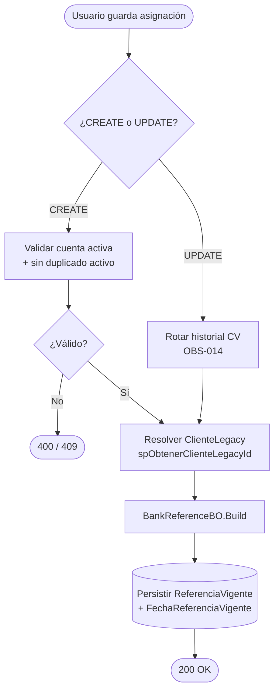
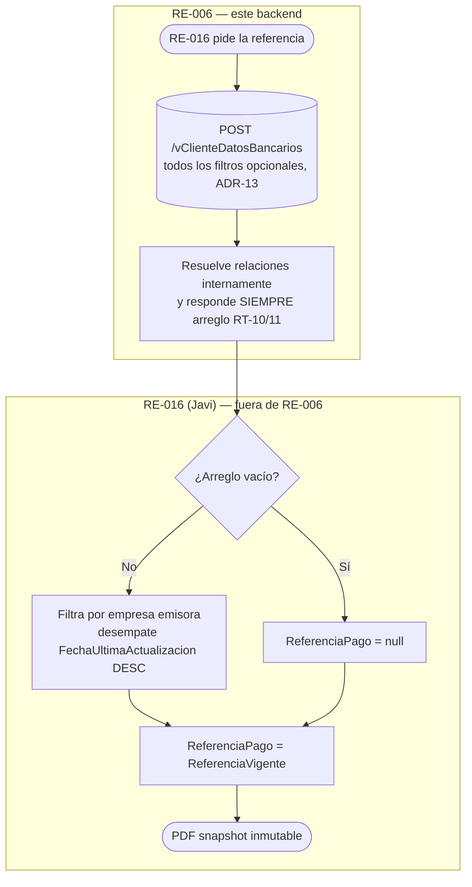
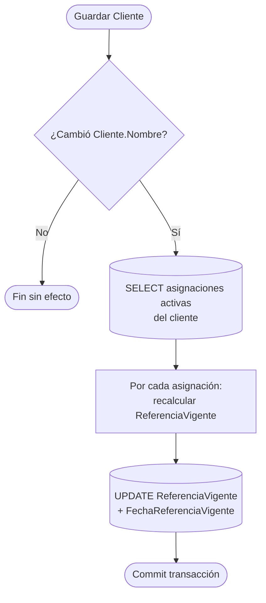

# Solution Design (Interno) — R16A-RE-FU-006

**Referencia de Pago y Código Validador**

| Campo | Valor |
|---|---|
| **Tipo** | Diseño de solución interno — detalle técnico complementario al DIS-SOL formal |
| **Proyecto** | R16 - Adquisiciones |
| **Repositorio destino** | ProquifaDotNet |
| **BD** | ProquifaDotNet (servidor RYNL010) + PConnectProquifaDotNet (Legacy, vía linked server) |
| **Versión** | INT-1.18 |
| **Fecha** | 31 jul 2026 |
| **Autor** | Jose Armando Santiago Lorenzo |
| **Estándar base** | IEEE 1016, 19 secciones |
| **Estado** | Vivo — se actualiza conforme cambie BD/código |

> Este documento complementa `[R16A-RE-FU-006][DIS-SOL] Diseño de la solución` con detalle de implementación (DDL, C#, T-SQL, SP), ADRs, NFRs, observabilidad, seguridad y contrato de frontend. Toda afirmación sobre BD viene de verificación live (MCP `proquifa-db-dev`, 29-jun/1-jul 2026).
>
> **Convención de idioma:** código nuevo en Inglés, excepto la superficie visible en Swagger (Controller/tag, rutas, DTOs de request/response, descripciones XML), que permanece en Español. Todo objeto de BD (tablas, columnas, vistas, SPs) en Español, sin excepción. Aplicado aquí: `ClienteDatosBancariosBO`, `BankReferenceBO`, `Build()`, `BuildBanamex()`, `vClienteDatosBancariosBO` (Inglés) vs. `ClienteDatosBancariosController`, `vClienteDatosBancariosController`, rutas y DTOs (Español, sin cambio). Ver ADR-6/ADR-7.
>
> **Convención BD-vs-código:** minimizar objetos nuevos en BD — lo que se pueda resolver en código, se resuelve en código. Aplicado: `vClienteDatosBancarios` se implementa con LINQ (`vClienteDatosBancariosBO`), no como vista SQL. Excepción: `spObtenerClienteLegacyId` sigue como SP por límite arquitectónico existente (cross-DB), no por conveniencia. Ver ADR-11 para la decisión final.
>
> **Modelo de datos:** FK `IdEmpresaDatosBancarios` (selección por empresa emisora, RT-08) y S4 desde `PConnectProquifaDotNet.dbo.Clientes.ClienteLegacy` (GAP-E). Ver [§12 ADR-3](#adr-3--fuente-del-segmento-s4-clientelegacy-vs-clienteclave) y [§13](#13-supuestos-y-restricciones).

---

# Índice

1. [Resumen General](#1-resumen-general)
2. [Alcance](#2-alcance)
3. [Visión General de Arquitectura](#3-visión-general-de-arquitectura)
4. [Vista Dinámica (Runtime)](#4-vista-dinámica-runtime)
5. [Modelo de Datos](#5-modelo-de-datos)
6. [Puntos de Integración](#6-puntos-de-integración)
7. [Despliegue e Infraestructura](#7-despliegue-e-infraestructura)
8. [Requisitos No Funcionales (NFR)](#8-requisitos-no-funcionales-nfr)
9. [Observabilidad y Operación](#9-observabilidad-y-operación)
10. [Manejo de Errores y Resiliencia](#10-manejo-de-errores-y-resiliencia)
11. [Consideraciones de Seguridad](#11-consideraciones-de-seguridad)
12. [Decisiones de Stack y ADRs](#12-decisiones-de-stack-y-adrs)
13. [Supuestos y Restricciones](#13-supuestos-y-restricciones)
14. [Riesgos y Mitigaciones](#14-riesgos-y-mitigaciones)
15. [Criterios de Éxito](#15-criterios-de-éxito)
16. [Fuera de Alcance](#16-fuera-de-alcance)
17. [Preguntas Abiertas](#17-preguntas-abiertas)
18. [Glosario](#18-glosario)
19. [Contrato de Frontend](#19-contrato-de-frontend)
- [Apéndice A — DDL completo](#apéndice-a--ddl-completo)
- [Apéndice B — Código clave (C#)](#apéndice-b--código-clave-c)
- [Apéndice C — SQL de migración y validación](#apéndice-c--sql-de-migración-y-validación)
- [Apéndice D — Trazabilidad requisito ↔ diseño](#apéndice-d--trazabilidad-requisito--diseño)
- [Control de versiones](#control-de-versiones)

---

# 1. Resumen General

El requisito RE-FU-006 agrega al Catálogo de Clientes (sección **Cobros** → sub-sección **"Referencia de Pago"**) la capacidad de asignar una o más cuentas bancarias del grupo PROQUIFA a un cliente y capturar un **Código Validador** por combinación. A partir de esos datos el sistema **arma y persiste** una referencia bancaria vigente por asignación, aplicando reglas diferenciadas por banco (Banamex = 7 segmentos; resto = nombre del cliente).

> **Cambio de alcance (INT-1.1, sincronizado con DIS formal v1.6):** RE-006 **ya no casa** la referencia al PDF de la proforma. Esa responsabilidad (modificar `tpProformaPedidoFactory`, generar la proforma, casar `ReferenciaPago`) **salió de RE-006 → es de RE-016** (Javi, solución `ProquifaDotNet.Finanzas`, no `Logistica`), a raíz de comentarios de JD en la revisión del v1.5. RE-006 se limita a **calcular y persistir `ReferenciaVigente`** (Flujo 1), **mantenerla vigente** ante cambios del cliente (Flujo 3) y **exponerla vía endpoint** (Flujo 2) como contrato de datos hacia RE-016. Ver §2, §4 (Flujo 2 recast), §6 y ADR-6 (§12).

Al generar el PDF de una proforma, **RE-016** casa esa referencia al documento como snapshot inmutable, alimentando la identificación automática de pagos en el módulo **Buzón de Cobros**.

Técnicamente el problema es de **persistencia en dos niveles con separación cómputo/lectura**: el cálculo caro (cross-DB a Legacy + concatenación determinista) ocurre una sola vez en la escritura de la asignación; la generación de proforma solo **lee** el valor ya calculado. Esto garantiza consistencia entre proformas re-emitidas y contra el Buzón, y elimina el recálculo dinámico que existía en el diseño v1.0.

---

# 2. Alcance

**Incluye:**

- Tabla nueva **`dbo.ClienteDatosBancarios`** — relación N:N `Cliente` ↔ `EmpresaDatosBancarios` con `CodigoValidador`, `ReferenciaVigente` e historial de un nivel.
- **`ClienteDatosBancariosBO`** — CRUD de la asignación; calcula y persiste `ReferenciaVigente` en cada INSERT/UPDATE; rota historial del Código Validador.
- **`BankReferenceBO`** — algoritmo de construcción de la referencia (Banamex / no-Banamex); invocado desde `ClienteDatosBancariosBO`, **no** desde el factory.
- **`ClienteDatosBancariosController`** — API REST `/ClienteDatosBancarios`.
- **Endpoint de consulta `POST /vClienteDatosBancarios` con filtros flexibles** — `IdCliente`/`IdCatBanco`/`IdCatMoneda`/`IdEmpresa`, todos opcionales (0 a 4 parámetros; sin ninguno regresa todas las asignaciones activas, ADR-13); resuelve internamente la cadena `EmpresaDatosBancarios↔DatosBancarios↔catBanco/catMoneda`; **responde siempre un arreglo** (RT-10/RT-11 — la tupla de 4 filtros no colapsa a 1 registro, el único discriminador es `IdEmpresaDatosBancarios`). **Este endpoint reemplaza, desde INT-1.1, la modificación del factory** que este documento traía en INT-1.0.
- **Regeneración en cascada** de `ReferenciaVigente` ante cambio de `Cliente.Nombre` (GAP-07 / H-04, Flujo 3, ADR-5) — ya estaba aquí desde INT-1.0; **incorporado también al DIS formal en v1.6** (ausente en v1.5).
- **Referencia no-Banamex, México y Perú (desde INT-1.8, DUDA-018 + ADR-9):** el camino no-Banamex ya no usa `Cliente.Nombre` — usa `RazonSocial` (`DatosFacturacionCliente`). Aplica a México y a Perú (Perú no tiene banco equivalente a Banamex, siempre cae aquí). Identificación de Banamex deja de ser `catBanco.Clave == '002'` y pasa a `catBanco.RequiereCodigoValidador` (bit nuevo).
- SP `spObtenerClienteLegacyId` — lookup cross-DB del `ClienteLegacy` para el segmento S4.
- Nuevos endpoints sobre **`vEmpresaDatosBancarios`** (selectores banco/cuenta) y **`vClienteDatosBancarios`** con relaciones completas — **ambos implementados con LINQ en código (`vClienteDatosBancariosBO`), no como vista SQL** (comentario JD 6-jul, ver B.3' en Apéndice B).
- **Migración inicial Legacy → ProquifaDotNet (Flujo A): script SQL de una sola ejecución**, no paquete SSIS (comentario JD, cambio v1.6) + extensión de la sincronización ongoing PQF → Legacy (**Flujo B, paquete SSIS existente y propiedad del cliente** — Duda #17 cerrada). La extensión mapea a **columnas Legacy ya existentes**, **sin `ALTER TABLE`**: Legacy no se modifica (comentario JD, INT-1.4).

**Fuera de esta lista desde INT-1.1 (ver §16 Fuera de Alcance):** modificación de `tpProformaPedidoFactory`, generación de la proforma y casado de `ReferenciaPago` — son de **RE-016**.


---

# 3. Visión General de Arquitectura

Nivel C4-2 (contenedores y componentes) en texto:

```
┌──────────────────────────────────────────────────────────────────────────┐
│ Frontend Angular (scope FE — fuera de este back)                           │
│   Pantalla "Referencia de Pago" (Catálogo de Clientes → Cobros)            │
└───────────────┬────────────────────────────────────────────┬──────────────┘
                │ REST/JSON (token en header)                 │
                ▼                                             ▼
┌──────────────────────────────┐            ┌───────────────────────────────┐
│ WebApi.Catalogos             │            │ WebApi.Catalogos               │
│  ClienteDatosBancariosCtrl   │            │  vEmpresaDatosBancarios (2 EP) │
│  (POST/PUT/DELETE + query)   │            │  vClienteDatosBancarios        │
│                               │            │  (endpoint contrato → RE-016)│
└───────────────┬──────────────┘            └───────────────┬───────────────┘
                │                                            │
                ▼                                            ▼
┌──────────────────────────────────────────────────────────────────────────┐
│ Logic.Pqf.Catalogos  (RE-006 — límite de este backend)                    │
│  ClienteDatosBancariosBO ──llama──► BankReferenceBO                        │
│        │                                   │                               │
│        │ resuelve ClienteLegacy            │ (Banamex 7-seg / no-Banamex)  │
│        ▼                                   ▼                               │
│  spObtenerClienteLegacyId (SP)        catBanco / catMoneda (lectura)       │
└───────────────┬────────────────────────────────────────────┬──────────────┘
                │ EF (ProquifaDotNetEntities)                 │ linked server
                ▼                                             ▼
┌──────────────────────────────┐            ┌───────────────────────────────┐
│ BD ProquifaDotNet (RYNL010)  │            │ PConnectProquifaDotNet (Legacy)│
│  ClienteDatosBancarios (NEW) │◄─script SQL│  CuentaCliente / Clientes      │
│  EmpresaDatosBancarios/…     │  Flujo A   │  (solo lectura desde .NET)     │
│                               │  (1 sola   │  SSIS Flujo B (ongoing,       │
│                               │   ejecución)│  PQF2→Legacy, se mantiene)    │
└───────────────┬──────────────┘            └───────────────────────────────┘
                │ RE-006 termina aquí — el dato queda expuesto por el endpoint
                ▼ consumido vía POST /vClienteDatosBancarios (contrato RE-006 → RE-016)
┌──────────────────────────────────────────────────────────────────────────┐
│ RE-016 (Javi) · ProquifaDotNet.Finanzas · tpProformaPedidoFactory          │
│  (FUERA de RE-006 desde INT-1.1 — se documenta solo para contexto)         │
│   Llama al endpoint de RE-006 filtrando por empresa emisora;               │
│   ReferenciaPago = ReferenciaVigente (snapshot inmutable → PDF)            │
│                          │                                                 │
│                          ▼ (consumo aguas abajo)                           │
│                   Buzón de Cobros — matching de pagos                       │
└──────────────────────────────────────────────────────────────────────────┘
```

**Componentes y responsabilidad:**

| Componente | Tipo | Responsabilidad | Ubicación |
|---|---|---|---|
| `ClienteDatosBancariosController` | API | CRUD REST de asignaciones (alta, edición CV, baja); obtiene usuario autenticado (RT-09) | `WebApi.Catalogos\Controllers\Configuracion\Clientes\Relaciones\` |
| `vClienteDatosBancariosController` | API | Endpoint de consulta con relaciones completas, controller propio — no fusionado con el CRUD (ADR-17) | `WebApi.Catalogos\Controllers\Configuracion\Clientes\Relaciones\` |
| `ClienteDatosBancariosBO` | BO | Persistencia + cálculo de `ReferenciaVigente` + rotación de historial | `Logic.Pqf.Catalogos\Clientes\DatosBancarios\` |
| `BankReferenceBO` | BO | Algoritmo determinista de referencia (Banamex/no-Banamex) | `Logic.Pqf.Catalogos\Clientes\DatosBancarios\` |
| `tpProformaPedidoFactory` | Factory | **(RE-016, no RE-006 — desde INT-1.1)** Llama al endpoint de RE-006 y casa `ReferenciaPago`. RE-006 no lo modifica ni lo invoca. Se documenta solo como contexto de consumo. | `ProquifaDotNet.Finanzas` (RE-016) |
| `spObtenerClienteLegacyId` | SP | Lookup cross-DB `IdCliente → ClienteLegacy` para S4 | BD ProquifaDotNet |
| `ClienteBO` (hook) | BO | Regeneración en cascada ante cambio de `Cliente.Nombre` (GAP-07) | `Logic.Pqf.Catalogos\Clientes\` |
| `dbo.ClienteDatosBancarios` | Tabla | Almacén de la relación + referencia vigente + historial | BD ProquifaDotNet |
| Script SQL (Flujo A) | Migración | Carga inicial Legacy→PQF2, una sola ejecución (ya no SSIS — comentario JD) | BD ProquifaDotNet |
| SSIS Flujo B (del cliente) | ETL | Sincronización ongoing PQF2→Legacy; paquete **propiedad del cliente**, se extiende mapeando a columnas Legacy existentes **sin `ALTER TABLE`** (Legacy no se modifica, comentario JD; Duda #17 cerrada) | PConnect / SSIS |
| Aplicativo de Bitácora (externo, nuevo) | Servicio (eventos) | Recibe un evento publicado por RE-006 tras cada escritura (alta/baja/modificación de asignación o `CodigoValidador`) para auditoría. ==Firma del endpoint/contrato del evento pendiente de definir== — propuesta aprobada; infra/endpoints por detallar; sólo se sabe que es por eventos | Externo |

---

# 4. Vista Dinámica (Runtime)

Tres flujos críticos. Cada uno con happy path y rutas de fallo.

## Flujo 1 — Asignación de cuenta (CREATE / UPDATE)

Origen: el usuario guarda/modifica una asignación en "Referencia de Pago".

**Happy path:**

1. FE → `PUT /ClienteDatosBancarios` (nueva) o `PUT /ClienteDatosBancarios/Codigo` (cambio de CV) — corregido 27-jul, `POST` es para consulta (`QueryResult`) en toda la convención del repo (202/204 controllers verificados usan `PUT` para alta/edición).
2. Controller resuelve el usuario autenticado (`BaseApiController.ObtenerUsuarioAutenticado().IdUsuario`, RT-09) y delega en el BO.
3. **Validaciones** (BO): cuenta activa (`EmpresaDatosBancarios.Activo = 1`, RT-01); sin duplicado activo del par `(IdCliente, IdEmpresaDatosBancarios)` (RT-02); `CodigoValidador` no vacío (CA-B1).
4. **CREATE**: INSERT con `Activo=1`, fechas `GETDATE()`, historial en NULL.
   **UPDATE de CV**: rotar `CodigoValidador → CodigoValidadorAnterior`, `FechaUltimaActualizacion → FechaModificacionAnterior`, `IdUsuarioModificacion → IdUsuarioModificacionAnterior`; escribir nuevo CV, fecha y usuario (OBS-014, RT-05).
5. **Resolver `ClienteLegacy`**: BO invoca `spObtenerClienteLegacyId(IdCliente)` (patrón del ecosistema — no EF directo a Legacy).
6. **Calcular** `BankReferenceBO.Build(cliente, clienteLegacy, empresaDatosBancarios, codigoValidador)`.
7. Persistir `ReferenciaVigente` + `FechaReferenciaVigente = GETDATE()`.
8. Controller responde `200 OK` con el registro.
9. **(Auditoría, por eventos)** Tras persistir, RE-006 **publica un evento** hacia el nuevo aplicativo de Bitácora. ==La firma del endpoint/contrato del evento está pendiente de definir== — la propuesta del aplicativo de Bitácora está **aprobada** pero pendiente de detallar infraestructura y endpoints; sólo se sabe que la integración será **por eventos**.



**Rutas de fallo:** cuenta inactiva → `400`; duplicado activo → `409`; CV vacío → `400`; `spObtenerClienteLegacyId` retorna null → **no es error**, S4 = `"0000"` (fallback aceptado, se registra WARN, ver [§9](#9-observabilidad-y-operación)); excepción al calcular referencia Banamex → propagar, no persistir `ReferenciaVigente` parcial.

## Flujo 2 — Exposición de la referencia vía endpoint (contrato hacia RE-016)

> **Recast en INT-1.1 (sincronizado con DIS formal v1.6).** RE-006 ya no consulta/casa nada al generar la proforma — eso es de RE-016. RE-006 solo **expone** un endpoint; documento aquí también el lado consumidor (RE-016) para no perder el contexto de integración, marcado explícitamente como fuera de este backend.

**Parte de RE-006 (el contrato — esto sí se implementa aquí):**

1. RE-006 expone **`POST /vClienteDatosBancarios`**: `IdCliente` / `IdCatBanco` / `IdCatMoneda` / `IdEmpresa`, todos opcionales (0 a 4 parámetros; sin ninguno, todas las asignaciones activas — ADR-13).
2. El endpoint **resuelve internamente** la cadena de relaciones — `ClienteDatosBancarios → EmpresaDatosBancarios → DatosBancarios → catBanco/catMoneda` — el consumidor no necesita conocer `IdEmpresaDatosBancarios` de antemano.
3. Solo se incluyen asignaciones con `ClienteDatosBancarios.Activo = 1` **y** `EmpresaDatosBancarios.Activo = 1`.
4. **Respuesta siempre en arreglo** (`List<vClienteDatosBancarios>`), en cualquier combinación de filtros (RT-10). **La tupla `(cliente, banco, moneda, empresa)` NO garantiza 1 registro** — verificado live: una empresa puede tener 2 cuentas activas con mismo banco+moneda (ej. empresa `65167A51…` + STP + MXN → 2 cuentas distintas). El único discriminador que colapsa a 1 registro es `IdEmpresaDatosBancarios` (RT-11), no `IdEmpresa`.

**Parte de RE-016 (consumidor — fuera del alcance de RE-006, documentado solo para contexto de integración):**

5. `tpProformaPedidoFactory` (que ya recibe la **empresa emisora** en su constructor `tpProformaPedidoFactory(Empresa empresa)`) llama al endpoint filtrando por `IdEmpresa = empresa.IdEmpresa` (RT-08 — resuelve DUDA-118: el cliente paga a la cuenta de quien le factura).
6. Si el arreglo trae >1 asignación para esa empresa (caso residual, ej. las 2 cuentas STP), RE-016 desempata por `FechaUltimaActualizacion DESC`. Arreglo vacío → `ReferenciaPago = null` (no bloquea).
7. RE-016 casa `tpProformaPedido.ReferenciaPago = ReferenciaVigente` como snapshot inmutable; el PDF conserva la referencia aunque cambien después los datos del cliente o la cuenta.
8. Al consultar un PDF ya almacenado, se sirve el archivo guardado sin regenerar.



## Flujo 3 — Regeneración en cascada por cambio de datos del cliente (GAP-07 / H-04)

> **Este flujo NO está en el DIS formal v1.5.** Es el hallazgo crítico H-04 de la revisión de Juan David (24-jun) que quedó sin cerrar en la entrega. Aquí se cierra por diseño.

**Motivación (Regla 4 nivel 1):** *"solo se regenera si cambia un dato fuente (banco, cuenta, Código Validador o datos del cliente que la componen)"*. Los segmentos S1–S3 dependen de `Cliente.Nombre`.

**Reducción de superficie por ADR-3:** al mover S4 de `Cliente.Clave` a `ClienteLegacy` (id legacy inmutable), **el único dato del cliente que puede caducar la referencia es `Cliente.Nombre`** (S1–S3). Un cambio de `Clave` ya no dispara nada porque la fórmula no lee `Clave`. Esto simplifica el disparador respecto a lo que planteaba H-04.

**Happy path (Opción recomendada — hook transaccional en `ClienteBO`):**

1. Usuario edita el cliente en el catálogo; `ClienteBO._GuardarOActualizar` detecta cambio en `Nombre`.
2. En la misma transacción, recorre las asignaciones activas del cliente en `ClienteDatosBancarios`.
3. Por cada una: resolver `ClienteLegacy`, invocar `BankReferenceBO.Build`, actualizar `ReferenciaVigente` + `FechaReferenciaVigente`.



**Rutas de fallo:** cliente sin asignaciones activas → no-op; fallo al recalcular una asignación → rollback de toda la transacción de guardado del cliente (consistencia sobre disponibilidad, ver [ADR-5](#adr-5--mecanismo-de-regeneración-en-cascada-gap-07)). Las **proformas ya emitidas no se tocan** (conservan su snapshot).

---

# 5. Modelo de Datos

**Entidad nueva:** `ClienteDatosBancarios` (N:N `Cliente` ↔ `EmpresaDatosBancarios`).

```
Cliente (Nombre)
  └──N:N── ClienteDatosBancarios ──N:N── EmpresaDatosBancarios (junction del grupo PROQUIFA)
              │  CodigoValidador                    │ FK IdEmpresa → Empresa (emisora, RT-08)
              │  ReferenciaVigente ◄── calculada     │ FK IdDatosBancarios
              │  + historial 1 nivel                 ▼
              │                              DatosBancarios (NumeroDeCuenta, Sucursal, Clabe,
              │                                             IdCatBanco, IdCatMoneda, Beneficiario)
              │                               ├── catBanco (Clave: '002'=Banamex)
              │                               └── catMoneda (1ª letra ClaveMoneda='M'→P / otro→D — regla literal Regla 7/matriz, no "== MXN")
PConnectProquifaDotNet.dbo.Clientes (ClienteLegacy int, ClientePQF guid)  ← S4 vía SP
tpProformaPedido.ReferenciaPago ◄── snapshot inmutable de ReferenciaVigente
```

**Atributos significativos de `ClienteDatosBancarios`:**

| Columna | Tipo | Nulo | Notas |
|---|---|---|---|
| `IdClienteDatosBancarios` | uniqueidentifier | NO | PK, `NEWID()` (no `NEWSEQUENTIALID()` — comentario JD, problemas con .NET Core; cambio INT-1.1) |
| `IdCliente` | uniqueidentifier | NO | FK `Cliente` |
| `IdEmpresaDatosBancarios` | uniqueidentifier | NO | FK `EmpresaDatosBancarios` (**divergencia resuelta** vs `IdDatosBancarios` de los `_BD.md`) |
| `CodigoValidador` | varchar(50) | SÍ | Longitud provisional — DUDA-015 abierta |
| `ReferenciaVigente` | varchar(200) | SÍ | Referencia armada; `varchar(200)` (holgura vs `varchar(80)` del snapshot — ver ADR nota) |
| `FechaReferenciaVigente` | datetime | SÍ | Auditoría/troubleshooting |
| `CodigoValidadorAnterior` | varchar(50) | SÍ | Historial 1 nivel (OBS-014) |
| `FechaModificacionAnterior` | datetime | SÍ | Historial 1 nivel |
| `IdUsuarioModificacionAnterior` | uniqueidentifier | SÍ | Historial 1 nivel |
| `IdUsuarioModificacion` | uniqueidentifier | SÍ | Usuario de la última modificación (RT-09) |
| `FechaRegistro` / `FechaUltimaActualizacion` | datetime | NO | `GETDATE()` |
| `Activo` | bit | NO | Baja lógica; default 1 |

**Índices:** único filtrado `UQ (IdCliente, IdEmpresaDatosBancarios) WHERE Activo = 1` (permite reasignar tras baja lógica, RT-02) + `IX (IdCliente, IdEmpresaDatosBancarios, Activo)`. DDL completo en [Apéndice A](#apéndice-a--ddl-completo).

**Tablas existentes (solo lectura):** `EmpresaDatosBancarios`, `DatosBancarios`, `catBanco`, `catMoneda`, `Empresa`, `Cliente`. `tpProformaPedido.ReferenciaPago varchar(80)` ya existe (hoy se asigna `null`).

> **Nota de longitud.** El snapshot `tpProformaPedido.ReferenciaPago` es `varchar(80)`. `ReferenciaVigente` se define `varchar(200)` por holgura, pero **la referencia real debe caber en 80** para no truncar al casar al PDF. Riesgo abierto: nombres de cliente no-Banamex > 80 chars (P7). Verificar `MAX(LEN(Nombre))` de clientes MEX activos (query en [Apéndice C](#apéndice-c--sql-de-migración-y-validación)).

---

# 6. Puntos de Integración

| Integración | Dirección | Protocolo | Auth | Comportamiento ante fallo |
|---|---|---|---|---|
| **Frontend Angular ↔ WebApi.Catalogos** | inbound | REST/JSON | Token (header) vía `BaseApiController` | Error HTTP tipado (400/409/500); FE muestra mensaje del catálogo de errores |
| **BO ↔ PConnectProquifaDotNet** (lookup ClienteLegacy) | outbound (read) | SP `spObtenerClienteLegacyId` sobre linked server | Credencial del linked server (server-side) | null → S4 `"0000"` (degradación aceptada) + WARN |
| **Script SQL Flujo A** (carga inicial, una sola ejecución — ya no SSIS, comentario JD) | Legacy → ProquifaDotNet | T-SQL directo | Credencial de ejecución del script | Error por fila: log + omitir, sin cancelar la ejecución |
| **SSIS Flujo B** (ongoing, existente, **propiedad del cliente**) | ProquifaDotNet → Legacy | SSIS `.dtsx` | Cuenta de servicio SSIS | Unidireccional; Legacy no sobreescribe PQF; error por fila; **sin `ALTER TABLE` en Legacy** — mapeo a columnas existentes |
| `tpProformaPedidoFactory` (RE-016, consumidor del endpoint — ya no in-process con RE-006 desde INT-1.1) | REST/JSON hacia `POST /vClienteDatosBancarios` | HTTP | Token (mismo patrón del ecosistema) | Arreglo vacío → `ReferenciaPago = null`, no bloquea. Responsabilidad de manejo de fallo es de RE-016. |
| **Buzón de Cobros** (consumidor aguas abajo) | in-process / batch | Lectura de `ReferenciaPago` / referencia del cliente | N/A | Fuera de scope de RE-006; contrato = string de referencia |
| **RE-006 → Aplicativo de Bitácora** (auditoría) | outbound (evento) | Publicación de evento (mecanismo por definir) | Por definir | ==Firma/contrato del evento pendiente de definir==; propuesta aprobada, sólo se sabe que es por eventos. El manejo de fallo de publicación se define al detallar el endpoint |

**Detalle linked server (verificado live):** el acceso a Legacy es cross-DB desde `proquifa-db-dev`. `PConnectProquifaDotNet.dbo.Clientes` tiene `ClienteLegacy int` / `ClientePQF uniqueidentifier`. El SP encapsula el cruce (`TOP 1 ORDER BY FechaRegistro ASC` como tiebreaker por 4,173 filas duplicadas del job de sync). El C# **nunca** instancia `PConnectProquifaDotNetEntities` en BOs — patrón del ecosistema (`spActualizarClienteLegacy`, `etlClienteContactoProcesarLegacy`, `etlClienteDireccionProcesarLegacy`).

---

# 7. Despliegue e Infraestructura

**Ambientes:**

| Ambiente | BD | Notas |
|---|---|---|
| DEV | ProquifaDotNet dev (RYNL010) + PConnect dev vía linked server | Pruebas de CA y unitarias; datos live consultados por MCP |
| QA | Espejo de PROD | Validar script SQL Flujo A (migración inicial) con conteos reales |
| PROD | ProquifaDotNet + PConnect | Cutover de migración; cuenta de servicio SSIS |

**Topología:** monolito ProquifaDotNet (WebApi + capa Logic + EF) sobre SQL Server. Sin nuevos servicios ni infra. El linked server a Legacy ya existe.

**CI/CD:** rama `develop-pack04`; el objeto BD (`CREATE TABLE` + índices + SP) se despliega vía script versionado antes que el código que lo consume.

**Migración y Rollback:**

- **Estrategia de cutover:** *phased* — (1) crear tabla + SP + índices; (2) desplegar BOs/controller/endpoint de RE-006 (**sin factory** — RE-016 despliega su consumo por separado, ver Flujo 2); (3) ejecutar **script SQL Flujo A** (carga inicial, una sola ejecución — comentario JD, ya no SSIS); (4) post-carga calcular `ReferenciaVigente` por registro; (5) Flujo B ongoing **ya existe y sigue en SSIS (paquete del cliente)**, no requiere activación nueva; su extensión con los campos de RE-006 la ejecuta el cliente mapeando a columnas Legacy existentes (**sin `ALTER TABLE`**).
- **Flujo A (carga inicial Legacy → PQF, script SQL de una sola ejecución):** `CuentaCliente` (PConnect) → `ClienteDatosBancarios`. Cliente vía `PConnectProquifaDotNet.dbo.Clientes` (`ClienteLegacy → ClientePQF`); cuenta vía **CLABE** (`CuentaCliente.idCuenta → CuentaBanco.Clabe → DatosBancarios.Clabe → EmpresaDatosBancarios`, con `COLLATE DATABASE_DEFAULT`). **Dedup obligatorio**: Legacy tiene `(claveCliente, idCuenta)` duplicados (cliente 4350 = 5 filas para ≤4 cuentas); el índice único filtrado los rechazará → agrupar por `(IdCliente, IdEmpresaDatosBancarios)` antes del INSERT o manejar colisión por fila. Est. **24 hrs** (ticket MIG-DATOS). Ver script en [Apéndice C](#apéndice-c--sql-de-migración-y-validación).
- **Flujo B (ongoing PQF → Legacy, SSIS existente — paquete del cliente, Duda #17 cerrada):** extender el `.dtsx` existente con `CodigoValidador` + cuentas asignadas **mapeando a columnas Legacy ya existentes** — `CuentaCliente.CodValidador` ya existe (GAP-C) y la asignación cliente-cuenta es la propia fila de `CuentaCliente`. **Sin `ALTER TABLE`: el esquema de Legacy no se modifica** (comentario JD, INT-1.4 — Legacy es de solo lectura estructural para el proyecto). El paquete es **propiedad del cliente**; su extensión se coordina con él. Solo México. Manejo de error por fila sin cancelar el paquete. **No se crea paquete SSIS nuevo para ningún sentido de la migración** (comentario JD).
- **Rollback:** la tabla es nueva y aditiva; mientras RE-006 no despliegue el endpoint, RE-016 sigue con `ReferenciaPago = null` (inocuo — RE-006 no toca el factory, así que no hay deploy de RE-016 que revertir desde este lado). Trigger de rollback = fallo de conteo post-migración o error masivo de armado. Pasos: (a) revertir el deploy del endpoint `vClienteDatosBancarios` de RE-006 (RE-016 vuelve a recibir arreglo vacío, inocuo); (b) `TRUNCATE ClienteDatosBancarios` y re-ejecutar el script del Flujo A; (c) el SP y la tabla pueden quedar sin uso sin afectar el flujo previo.

---

# 8. Requisitos No Funcionales (NFR)

| Atributo | Objetivo | Base / justificación |
|---|---|---|
| **Latencia escritura (Flujo 1)** | p95 < 400 ms | 1 lookup SP cross-DB + 2 lecturas catálogo + 1 INSERT. El cross-DB es el costo dominante. |
| **Latencia lectura (Flujo 2)** | p95 < 50 ms sobre el join | Cubierto por `IX (IdCliente, IdEmpresaDatosBancarios, Activo)`. Solo lectura de un campo ya calculado. |
| **Volumen migración (Flujo A)** | ~7,075 asignaciones, ~1,400 clientes MEX | Conteos live 1-jul. 4 cuentas en uso resuelven a 1 `IdEmpresaDatosBancarios` c/u. |
| **Cobertura de mapeo cliente** | 99.9% (1,398/1,400) | 2 clientes sin `ClienteLegacy` → S4 `"0000"` (aceptado). |
| **Escalabilidad S4** | Seguro hasta `ClienteLegacy` = 9,999 | Máximo actual 7,237. Al superar 5 dígitos, S4 se repite; unicidad la aporta S7 (CV). |
| **Concurrencia** | Sin contención esperada | Escrituras puntuales de tesorería; no es ruta de alto QPS. |
| **Consistencia** | Fuerte (transaccional) | Cálculo y persistencia de `ReferenciaVigente` en la misma transacción de escritura. |
| **Retención historial CV** | 1 nivel (actual + anterior) | OBS-014. Bitácora completa fuera de scope (DUDA-120). |

---

# 9. Observabilidad y Operación

**Logging (estructurado, con `IdCliente` como correlación):**

- `WARN` — `spObtenerClienteLegacyId` retorna null: `"ClienteLegacy no encontrado para IdCliente {0} — S4 será '0000'"`. Señal de cliente sin mapeo legacy.
- `WARN` — `catBanco.RequiereCodigoValidador` no encontrado/nulo al armar Banamex (desde INT-1.8; antes `catBanco.Clave`): registrar `IdCatBanco` (diagnóstico); se trata como no-Banamex.
- `INFO` — regeneración en cascada (Flujo 3): nº de asignaciones recalculadas por edición de cliente.
- `ERROR` — excepción al construir referencia: no persistir `ReferenciaVigente` parcial.

**Métricas / SLIs:**

- Nº de asignaciones creadas/actualizadas por día.
- Nº de proformas con `ReferenciaPago = null` (indicador de clientes sin asignación para su empresa emisora).
- Tasa de S4 `"0000"` (clientes sin mapeo legacy) — alerta si crece (nuevos clientes sin sync).
- Conteo post-migración: `COUNT(ClienteDatosBancarios) == COUNT(CuentaCliente dedup)`.

**Alerting / runbook:**

- Alerta si la tasa de `ReferenciaPago = null` sube tras un deploy (posible regresión del filtro por empresa emisora RT-08).
- Runbook de migración: verificar conteos y muestreo; re-ejecutar Flujo A si difieren (ver [§7](#7-despliegue-e-infraestructura)).

---

# 10. Manejo de Errores y Resiliencia

| Escenario | Comportamiento |
|---|---|
| `PUT` con `IdEmpresaDatosBancarios` vacío, inválido o inexistente | `400 Bad Request` — "La cuenta bancaria seleccionada no existe." (ADR-16) |
| `POST` con cuenta `Activo = 0` | `400 Bad Request` — "La cuenta bancaria seleccionada no está activa." (RT-01) |
| `POST` con par `(IdCliente, IdEmpresaDatosBancarios)` activo ya existente | `400 Bad Request` — "Esta cuenta ya está asignada al cliente." (RT-02, todo 400 sin 409 desde ADR-12) |
| `PUT` con `CodigoValidador` vacío **y** cuenta de un banco con `catBanco.RequiereCodigoValidador = true` (hoy solo Banamex) | `400 Bad Request` — "El Código Validador es requerido para el banco de la cuenta." (CA-B1, acotado por el flag desde ADR-15 — no aplica a bancos con `RequiereCodigoValidador = false`, no participan en su algoritmo de referencia) |
| `spObtenerClienteLegacyId` → null | **Degradación aceptada**: S4 = `"0000"`, WARN, no excepción (RT-03) |
| Nombre de cliente vacío/corto (S1–S3) | Fallback `'X'` por segmento; sin excepción |
| `catBanco.RequiereCodigoValidador` no encontrado (desde INT-1.8; antes `catBanco.Clave`) | Tratar como no-Banamex (`referencia = RazonSocial`); WARN con `IdCatBanco` |
| Factory sin asignación activa para la empresa emisora | `ReferenciaPago = null`; **no bloquea** la proforma |
| Excepción al calcular `ReferenciaVigente` (Flujo 1) | Propagar; no persistir registro con referencia parcial |
| Fallo en regeneración cascada (Flujo 3) | **Rollback** de la transacción de guardado del cliente (consistencia > disponibilidad) |
| SSIS: CLABE resuelve a 0 o >1 cuentas | Error de fila: log + omitir, sin cancelar el paquete |

**Principio:** sin silent failures. Toda degradación (S4 `"0000"`, `ReferenciaPago = null`, banco no encontrado) queda logueada. Las excepciones de cómputo se propagan; nunca se persiste un estado a medias.

---

# 11. Consideraciones de Seguridad

- **Autenticación:** token portado en header HTTP; resuelto por `BaseApiController.ObtenerUsuarioAutenticado()` (patrón ya usado en `ContratoClienteController`). El `IdUsuario` autenticado puebla `IdUsuarioModificacion` (RT-09) — trazabilidad de quién modifica datos bancarios.
- **Autorización:** **sin restricción de rol** en esta versión (DUDA-017 cerrada; Regla 9). Cualquier usuario con acceso a la cartera del cliente puede operar. ⚠️ Con implicaciones financieras — pendiente confirmar con cliente si debe restringirse a Coordinador de Tesorería (P4, no bloqueante).
- **Clasificación de datos:** `CodigoValidador`, CLABE, número de cuenta y beneficiario son **datos financieros sensibles**. No exponer en logs (loguear solo `IdCliente`/`IdCatBanco`, nunca el CV ni la CLABE completa). El historial de un nivel (`CodigoValidadorAnterior`) es auditable a nivel de datos, sin UI (OBS-014).
- **Cifrado:** en tránsito por TLS del WebApi; en reposo según la política de SQL Server del entorno (sin cambios introducidos por RE-006).
- **Prohibido:** ningún secreto/credencial vive en este diseño ni en el código (el linked server usa credencial server-side gestionada fuera del repo).

---

# 12. Decisiones de Stack y ADRs

Stack heredado (constraint, no elección): **.NET / EF (`ProquifaDotNetEntities`) + SQL Server + WebApi + SSIS**. Decisiones significativas en formato ADR (Contexto → Decisión → Alternativas → Consecuencias):

## ADR-1 — Persistencia en dos niveles (referencia vigente + snapshot)
- **Decisión:** calcular una vez en la escritura (`ReferenciaVigente`) y **casar un snapshot inmutable** al PDF (`ReferenciaPago`). El factory solo lee.
- **Alternativas:** (a) recálculo dinámico en el factory — descartado por inconsistencia; (b) solo snapshot sin `ReferenciaVigente` — descartado, el Buzón necesita el valor vigente del cliente.
- **Consecuencias:** separación cómputo/lectura (CQRS-flavored); coste extra = regeneración en cascada (ADR-5). OBS-013.

## ADR-2 — Lookup de ClienteLegacy vía SP, no EF directo
- **Decisión:** SP `spObtenerClienteLegacyId` invocado desde `ProquifaDotNetEntities`; el BO resuelve `ClienteLegacy` **antes** de llamar al algoritmo y lo pasa como parámetro.
- **Alternativas:** (a) EF directo a `PConnectProquifaDotNetEntities` en el BO — descartado, rompe el patrón del ecosistema; (b) columna `ClaveLegacy` permanente en `dbo.Cliente` — mayor cambio de esquema, no necesario dado el linked server.
- **Consecuencias:** desacople del algoritmo respecto a Legacy; firma `Build(cliente, int? clienteLegacy, cuenta, cv)`. Ítem 6b de impacto técnico.

## ADR-3 — Fuente del segmento S4: ClienteLegacy vs Cliente.Clave
- **Decisión:** S4 = últimos 4 de `PConnectProquifaDotNet.dbo.Clientes.ClienteLegacy` (cobertura 99.9%, verificado live).
- **Alternativas:** `Carga_ClientesR1` (frágil, descartada); columna nueva en `Cliente` (innecesaria).
- **Consecuencias:** **efecto secundario positivo** — como la fórmula ya no lee `Cliente.Clave`, la regeneración en cascada (Flujo 3) solo se dispara por `Cliente.Nombre`, no por `Clave`. Reduce la superficie de GAP-07.

## ADR-4 — Índice único filtrado en vez de UNIQUE plano
- **Decisión:** `CREATE UNIQUE INDEX … WHERE Activo = 1`.
- **Alternativas:** `UNIQUE` plano (bloquea reasignación); validación solo en BO (permite carreras).
- **Consecuencias:** unicidad garantizada a nivel BD solo entre activas. (SQL Server no admite `WHERE` en constraint inline → índice filtrado.)

## ADR-5 — Mecanismo de regeneración en cascada (GAP-07)
- **Decisión:** **hook transaccional en `ClienteBO._GuardarOActualizar`** — si cambió `Nombre`, recalcular todas las asignaciones activas en la misma transacción.
- **Alternativas:** (a) trigger BD `AFTER UPDATE` — duplica la lógica de armado entre T-SQL y .NET; (b) lazy en el factory — nunca actualiza BD para clientes sin proforma, deja `ReferenciaVigente` mintiendo al Buzón.
- **Consecuencias:** consistencia fuerte; acopla `ClienteBO` con `ClienteDatosBancariosBO`. Fallo en la cascada = rollback del guardado del cliente.

## ADR-6 — Frontera RE-006 ↔ RE-016: RE-006 expone, no casa (INT-1.1)
- **Decisión:** RE-006 se detiene en **exponer `ReferenciaVigente` vía endpoint** (`POST /vClienteDatosBancarios`, filtros flexibles, respuesta siempre arreglo). RE-016 decide cómo y cuándo casarla.
- **Alternativas:** (a) mantener la modificación del factory dentro de RE-006 — descartada, JD confirmó que el código de proforma vive en otra solución (`Finanzas`) y podía rechazarse si RE-006 lo tocaba; (b) evento/mensaje asíncrono para notificar a RE-016 — descartado, sobre-ingeniería para un dato que se lee bajo demanda al generar la proforma.
- **Consecuencias:** RE-006 no conoce ni depende del ciclo de vida de la proforma; el contrato es la única superficie de acoplamiento. Efecto colateral importante: al no poder garantizar que `(cliente, banco, moneda, empresa)` resuelva a 1 registro, el endpoint **debe** responder arreglo (ver RT-10/RT-11) — RE-016 es quien tiene el contexto (empresa emisora, desempate) para reducirlo a 1.

## ADR-7 — Proyecciones de solo lectura vía LINQ, no vistas SQL (INT-1.1) — **VIGENTE (revertido a esta decisión por ADR-11, 24-jul, tras un intervalo corto bajo ADR-10)**
- **Decisión:** ambas proyecciones se implementan como consultas LINQ dentro de un BO de solo lectura (`vClienteDatosBancariosBO`), no como `CREATE VIEW`. El nombre `vClienteDatosBancarios` se conserva únicamente como identificador del DTO/contrato ya validado con RE-016 — no implica objeto de BD.
- **Alternativas:** (a) `CREATE VIEW` en BD — descartada por la directriz de minimizar objetos nuevos en BD; (b) Stored Procedure de consulta — descartada por el mismo motivo, salvo que se requiera lógica que EF/LINQ no pueda expresar razonablemente.
- **Consecuencias:** el join de 4-5 tablas vive en C# (mantenible con el resto del código, versionado junto con el BO), no en un objeto de BD adicional a desplegar/versionar por separado. Sin impacto en el contrato expuesto a RE-016 (mismo endpoint, misma forma de respuesta). **Excepción a esta directriz:** `spObtenerClienteLegacyId` sigue siendo Stored Procedure — no por conveniencia, sino porque encapsula un límite arquitectónico ya existente (el C# nunca instancia `PConnectProquifaDotNetEntities` directamente en BOs, patrón del ecosistema); minimizar BD no anula esa regla de acceso cross-DB.
- **Hallazgo posterior (17-jul, planeación de tareas Jira):** ya existe en BD/EDMX una vista real `dbo.vClienteDatosBancarios` (pre-ADR-7, shape viejo — sin `CodigoValidador` ni `ReferenciaVigente`, FK a `IdDatosBancarios` no `IdEmpresaDatosBancarios`) con un controller huérfano que la consume y hoy no compila. Pendiente decidir con JD qué hacer con ella (no se borra unilateralmente) — ver ADR-8 y el plan de ejecución `docs/superpowers/plans/2026-07-17-re006-t1-t2-t3.md`.

## ADR-8 — Modificación de `Core.Pqf` (EDMX) es parte del alcance de desarrollo de RE-006 (17-jul-2026)

- **Decisión:** el EDMX de `Core.Pqf` se modifica dentro del alcance de RE-006, no se delega a otro equipo.
- **Sección de mapeo de excepciones a HTTP 400/409 — SUPERADA, ver ADR-12.** La decisión original (excepciones tipadas `CuentaInactivaException`/`AsignacionDuplicadaException` capturadas a mano en el controller, con 409 para duplicado) se descartó el 27-jul tras revisar el ejemplo real `ClienteDatosGeneralesBO`/`ClienteController.GuardarOActualizarGenerales` con JD. Detalle completo en ADR-12.

## ADR-9 — Referencia no-Banamex usa `RazonSocial` (no `Nombre`), aplica a México y Perú; `catBanco.RequiereCodigoValidador` reemplaza el hardcode `Clave == '002'` (22-jul-2026)

- **Decisión (fuente del dato):** `BankReferenceBO.Build()` deja de usar `Cliente.Nombre` **solo para el camino no-Banamex (RF-11)**; usa `RazonSocial`, que vive en `DatosFacturacionCliente` (no en `Cliente` — requiere join adicional, confirmado por inspección de la entidad). Perú no tiene banco equivalente a Banamex, así que siempre cae en este camino sin lógica nueva. **El algoritmo Banamex (RF-12, S1-S3) NO cambia — sigue usando `Cliente.Nombre`.** JD confirmó el cambio solo para el fallback no-Banamex; extenderlo a Banamex quedó explícitamente fuera de esta decisión (22-jul) por falta de confirmación. Consecuencia: `Build()` recibe ambas fuentes (`nombre` para Banamex, `razonSocial` para el resto) — ver Apéndice B / plan de ejecución.
- **Decisión (criterio de identificación Banamex):** en la misma conversación, JD confirmó reemplazar el hardcode `catBanco.Clave == "002"` por una columna nueva de negocio, `catBanco.RequiereCodigoValidador` (bit) — `true` solo para Banamex, `false` para el resto (incluye todo banco de Perú). `Clave = '002'` sigue siendo el criterio para poblar ese flag en el catálogo (dato inicial/migración), ya no para evaluarlo en tiempo de ejecución.
- **Alcance de infraestructura:** `catBanco` vive en el mismo EDMX de `Core.Pqf` (repo base, ver ADR-8) que `ClienteDatosBancarios` — el `ALTER TABLE catBanco` + regenerar entidad se suma al mismo ciclo (EDMX → PR → paquete preview), no es trabajo aparte.
- **Impacto en contrato de API — CORREGIDO 27-jul:** no hace falta ampliar ningún selector. El endpoint genérico `POST /catBanco` (`TablaGenericaBO<catBanco>`, ya existe, sin tocar) regresa la entidad completa, `RequiereCodigoValidador` incluido — el frontend lo consume directo. `vEmpresaDatosBancarios` (selector de cuenta, ver ADR-12) no necesita este campo, vive en `catBanco`.
- **Alternativas consideradas:** (a) mantener `Cliente.Nombre` solo para Perú y `RazonSocial` para México — descartada, JD confirmó que aplica a ambas regiones, no diferenciado; (b) mantener el hardcode `Clave == "002"` — descartada, JD prefirió un flag de negocio explícito y extensible.
- **Consecuencias / pendientes:**
  - El riesgo de truncamiento contra `tpProformaPedido.ReferenciaPago varchar(80)` (antes P7/R5, verificado sobre `Nombre`) **no está revalidado** contra `RazonSocial` — longitud desconocida, pendiente de verificar en vivo antes de considerar Task 5/6 cerradas (ver §13, §14).
  - Divergencia con la matriz de requisitos (Criterio C2 sigue diciendo "Nombre") — JD confirmó que la matriz se actualiza gradualmente; no se espera a que eso ocurra para avanzar el diseño (ver §13).
  - **Sin código construido al momento de esta decisión** — solo se había restaurado el respaldo de BD en el ambiente local; no requiere revertir nada.

## ADR-10 — `dbo.vClienteDatosBancarios` (vista vieja) se conserva y se construye sobre ella; **CANCELA ADR-7** para esta proyección (24-jul-2026) — **SUPERADO por ADR-11, mismo día, ver abajo**

- **Decisión (superada, ver ADR-11):** JD confirmó (24-jul, conversación durante sesión de EDMX/T2) que la vista **no se elimina** — al ya existir un objeto de BD con ese propósito, el diseño se construye sobre lo que ya está en vez de introducir una proyección LINQ paralela. Esto **cancela ADR-7 específicamente para `vClienteDatosBancarios`** — no para el resto de la directriz "minimizar BD" del INT-1.2, que sigue vigente para cualquier otro objeto nuevo.
- **Alternativas descartadas (en su momento):** mantener el plan de ADR-7 (LINQ nuevo, ignorando la vista existente) — descartada por JD en esta primera pasada, por duplicar lógica ya resuelta en BD.
- **Por qué se revirtió, mismo día:** antes de implementar nada, se investigó el detalle real de la vista (ver ADR-11) y el hallazgo cambió la decisión de JD — este ADR queda como registro histórico de la primera decisión, no como estado vigente.

## ADR-11 — Reversión de ADR-10: `dbo.vClienteDatosBancarios` se elimina, se vuelve al plan LINQ de ADR-7 (24-jul-2026)

- **Decisión:** con el dato de cero consumo real, se le propuso a JD volver al plan original de ADR-7 (LINQ, `vClienteDatosBancariosBO`, sin objeto de BD nuevo ni mantenimiento de uno viejo) — **JD aprobó revertir a ADR-7**. `ADR-10` queda sin efecto.
- **Acciones derivadas:**
  1. `dbo.vClienteDatosBancarios` **eliminada** de la BD (`Core.Pqf/DbScripts/R16A-RE-FU-006/03_DropVClienteDatosBancarios.sql`, ejecutado y verificado).
  2. Entidad `vClienteDatosBancarios` a quitar del `.edmx` de `Core.Pqf` + borrar `vClienteDatosBancarios.cs` generado (en curso).
  3. Controller huérfano `vClienteDatosBancariosController.cs` (repo `ProquifaDotNet-R14`) a eliminar junto con su entrada en el `.csproj` — pendiente, se hace en conjunto con la construcción del controller nuevo (Jira 1428/T5, fuera de esta tarea).
  4. El reemplazo (`ClienteDatosBancariosController`, `Controllers\Configuracion\Clientes\`, con `vClienteDatosBancariosBO` para la consulta LINQ) **no se construye en esta tarea** — es Jira 1428/T5.
- **Alternativas consideradas:** mantener ADR-10 (reescribir la vista rota) — descartada, iría contra la directriz "minimizar BD" sin ninguna ganancia de compatibilidad real (nadie la consume).
- **Consecuencias:** Task 6 (`ClienteDatosBancariosBO`) sigue el diseño original de ADR-7 sin cambios — no hay replanteamiento de fuente de datos pendiente, contrario a lo que ADR-10 anticipaba.

---

## ADR-12 — Manejo de errores via `Response`/`FMessage` (reemplaza ADR-8 sección de excepciones); reuso de `vEmpresaDatosBancarios`; sin `if` en controllers; DTO anidado (27-jul-2026)


1. **Manejo de errores — reemplaza ADR-8:** se descartan `CuentaInactivaException`/`AsignacionDuplicadaException`. `ClienteDatosBancariosBO._GuardarOActualizar` valida con `Model.AddMessage(...)` + `Response = new Response(false, new FMessage(EMessageType.Validation.ToString(), Model.Messages.ModelState))` + `return Guid.Empty` — mismo patrón que `ClienteDatosGeneralesBO`. El controller (`ClienteDatosBancariosController`) llama `_GuardarOActualizar_F` (no `GuardarOActualizar()`, sellado) y decide `Response.Status ? 200 : 400` por ternario. **Consecuencia: "asignación duplicada" (RT-02) también regresa 400, no 409** — ningún controller del repo distingue 409, se sigue el patrón uniforme.
2. **Sin `if` en el controller.** Indicación explícita de JD: el controller solo traduce un booleano ya decidido por el BO a un código HTTP (ternario permitido, es lo mismo que hace el ejemplo de JD). Toda validación de negocio — incluida la de filtros de consulta (`POST /vClienteDatosBancarios`) — vive en el BO. **Nota (29-jul, ver ADR-13): esto ya no incluye "obligatorio" para ningún filtro de consulta — `IdCliente` dejó de ser requerido.**
3. **Reuso de `vEmpresaDatosBancarios` (selector de cuenta) — confirmado con Osmar.** Existe ya como vista real de BD + BO (`ViewBO<T>`) + controller, construidos por otro desarrollador (ticket R16A-1415, ajeno a RE-006, 20-jul-2026). Cubre exactamente el selector de cuenta que T4 necesitaba — se reutiliza tal cual, cero código nuevo. El selector de Banco (`RequiereCodigoValidador` incluido) se resuelve con el catálogo genérico `POST /catBanco`, también ya existente — ver corrección en ADR-9.
4. **DTO `vClienteDatosBancarios` — objeto anidado, no plano. — SUPERADO por ADR-14 (29-jul), ver abajo.** La respuesta de `POST /vClienteDatosBancarios` anida las entidades reales (`Cliente`, `catBanco`, `catMoneda` — completas, sin copiar campos) dentro de wrappers propios de RE-006 (`EmpresaDatosBancariosDetalle` → `DatosBancariosDetalle` → `catBanco`/`catMoneda`), 3 niveles de profundidad. Se evaluó extender `EmpresaDatosBancarios`/`DatosBancarios` (`Core.Pqf`) con una navigation property manual para anidar sin wrappers — descartado: dispararía todo el ciclo de republicar el paquete NuGet otra vez, solo por una propiedad de conveniencia. Los wrappers viven 100% en `ProquifaDotNet` (`Logic.Pqf.Catalogos`), sin tocar `Core.Pqf`. **JD revirtió esta decisión (29-jul): el objeto debe ser plano, como en el diseño original — ver ADR-14.**
- **Alternativas consideradas:** mantener 409 vía un mecanismo propio de matching de mensajes en el controller — descartado, sería el primer caso en el repo que distingue más de 400/200 sobre este patrón, frágil y sin precedente.
- **Consecuencias:** `ClienteDatosBancariosBO` gana `_Desactivar` overrideado (la baja lógica ya no reentra a la validación de cuenta activa) y el método `ActualizarCodigoValidador` (valida Id inexistente en el BO, no en el controller) — ambos, huecos de diseño detectados en la revisión de coherencia del plan de Parte 2, corregidos antes de implementar.

## ADR-13 — `IdCliente` deja de ser obligatorio en `POST /vClienteDatosBancarios` (29-jul-2026)

- **Decisión:** los 4 filtros (`IdCliente`, `IdCatBanco`, `IdCatMoneda`, `IdEmpresa`) pasan a ser **todos opcionales**. Sin ningún filtro, el endpoint regresa todas las asignaciones activas del sistema (`ClienteDatosBancarios.Activo=1` y `EmpresaDatosBancarios.Activo=1`) — no un error. `vClienteDatosBancariosBO.Lista()` quita la validación/400 de `IdCliente` y lo trata como un filtro más (case explícito en el `switch`, igual que `IdCatBanco`/`IdCatMoneda`/`IdEmpresa` — criterio del repo: filtros `Guid` siempre con case propio, ver `vEmpresaDatosBancariosBO`, no vía `ApplyFilter` genérico; con el DTO ya plano desde ADR-14 esto ya no es por anidamiento sino por convención).
- **Alternativas consideradas:** mantener `IdCliente` obligatorio y agregar un endpoint aparte "sin filtro" — descartada, JD pidió el cambio directo sobre el mismo endpoint, sin duplicar superficie.
- **Consecuencias:** sin filtros, la respuesta puede ser el dataset completo de asignaciones activas del sistema — tamaño de payload no acotado por request individual. **Pendiente confirmar con JD** si RE-016 realmente necesita invocarlo así (sin ningún filtro) o si en la práctica siempre manda al menos uno — no bloqueante, el endpoint ya lo soporta de cualquier forma. Test `Test_Query_SinIdCliente_ResponseFalse` (validaba el 400 viejo) se reemplaza por `Test_Query_SinFiltros_RegresaTodasLasAsignacionesActivas`.

## ADR-14 — Reversión de ADR-12 punto 4: DTO `vClienteDatosBancarios` vuelve a ser plano; campos mínimos acordados con front; `CodigoValidador` enmascarado para no-Banamex (29-jul-2026)

- **Decisión — campos por tabla de origen** (prefijo por entidad solo donde hay colisión de nombre, mismo criterio que el DTO real `vEmpresaDatosBancarios` — ahí `EmpresaAlias`/`EmpresaPrefijo`/`EmpresaRFC` van prefijados y `Banco`/`ClaveBanco`/`Moneda`/`ClaveMoneda` no, por ser únicos):
  - `ClienteDatosBancarios` (entidad primaria): `IdClienteDatosBancarios`, `CodigoValidador`, `ReferenciaVigente`, `Activo` (sin prefijo, seed del patrón `vEmpresaDatosBancarios`).
  - `Cliente`: `IdCliente`, `ClienteNombre`, `ClienteAlias`, `ClienteActivo`, `IdRegion` (el campo real es `Cliente.IdRegion`, no hay nombre de región en el propio `Cliente` — se expone el Id, no un join adicional a un catálogo de regiones, no solicitado).
  - `Empresa`: `IdEmpresa`, `EmpresaAlias` (la entidad `Empresa` no tiene columna `Nombre` — solo `Alias`/`RazonSocial`; se usa `Alias`, mismo campo que ya expone `vEmpresaDatosBancarios` como `EmpresaAlias`, para no introducir una fuente de dato nueva), `EmpresaActivo`.
  - `EmpresaDatosBancarios`: **solo** `IdEmpresaDatosBancarios` (indicación explícita de front — el resto de esta entidad no se expone).
  - `DatosBancarios`: `IdDatosBancarios`, `NumeroDeCuenta`, `Sucursal`, `Beneficiario` (sin `Activo` — esta entidad no tiene esa columna).
  - `catMoneda`: `IdCatMoneda`, `ClaveMoneda`, `Moneda`, `MonedaActivo`.
  - `catBanco`: `IdCatBanco`, `Banco`, `RequiereCodigoValidador`, `BancoActivo`.
- **Decisión — `CodigoValidador` enmascarado para no-Banamex:** el campo no aplica conceptualmente fuera de Banamex (no participa en el algoritmo de referencia no-Banamex). Se regresa `null` (no `""`) cuando `catBanco.RequiereCodigoValidador = false` — se prefiere `null` sobre cadena vacía porque comunica "no aplica" en vez de "se capturó vacío", y es consistente con el resto de columnas `string` nullable de estas mismas entidades (`Beneficiario`, `Swift`, `Iban`, etc. — NULL en BD cuando no aplica, nunca `""` por convención).
- **Hallazgo técnico (implementación, no de diseño):** enmascarar `CodigoValidador` **dentro** del `select` LINQ (expresión condicional `cb.RequiereCodigoValidador ? cdb.CodigoValidador : null`) rompe el filtrado genérico de ese mismo campo (`ApplyFilter`, ADR previo) — EF6 no traduce correctamente un `.Where()` posterior sobre una propiedad proyectada de forma condicional en la misma consulta (confirmado con test: regresaba 0 filas incluso cuando sí había una coincidencia real). **Fix:** el `select` proyecta `CodigoValidador` sin enmascarar (valor real de BD); los filtros (`ApplyFilter` incluido) se aplican sobre ese valor real; el enmascarado se aplica **después**, en un `foreach` sobre la lista ya materializada, antes de regresarla. Los filtros siempre ven el valor real; el consumidor del endpoint solo ve el valor enmascarado.
- **Alternativas consideradas:** mantener el enmascarado dentro del `select` y renunciar al filtrado genérico de `CodigoValidador` — descartada, es más barato mover el enmascarado a un paso posterior que perder la capacidad de filtrar por ese campo.
- **Consecuencias:** `EmpresaDatosBancariosDetalle`/`DatosBancariosDetalle` (wrappers de ADR-12) se eliminan — ya no hace falta anidar nada. Tests actualizados: `Test_Query_NoBanamex_CodigoValidadorSeOculta` (nuevo, verifica `null` para cuentas no-Banamex) y ajuste de aserciones de `Test_Query_SoloIdCliente_RegresaArregloConLaAsignacion` a propiedades planas.

## ADR-15 — `CodigoValidador` deja de ser obligatorio para cuentas no-Banamex en `PUT /ClienteDatosBancarios` (bug real, 29-jul-2026)

- **Decisión:** la validación se acota a Banamex — `if (banco.RequiereCodigoValidador && string.IsNullOrEmpty(entity.CodigoValidador))`. Para eso, la resolución de `datosBancarios`/`banco` (antes solo se hacía al final, para calcular `ReferenciaVigente`) se adelantó a antes de esta validación. CA-E1 queda acotado: obligatorio solo para Banamex.
- **Alternativas consideradas:** dejar `CodigoValidador` obligatorio siempre y que el front mande un valor dummy para no-Banamex — descartada, contradice ADR-14 (el campo "no aplica" a no-Banamex, no debería ni tener que inventarse un valor).
- **Consecuencias:** mensaje de error actualizado a "El Código Validador es requerido para el banco de la cuenta." — redactado a propósito sin nombrar "Banamex" (indicación del usuario, 29-jul): el flag `RequiereCodigoValidador` es agnóstico de banco por diseño (ADR-9), si mañana otro banco lo requiere el mensaje sigue siendo correcto sin tocarlo. 2 tests nuevos: `Test_GuardarOActualizar_Banamex_SinCodigoValidador_NoGuardaYResponseFalse` (CA-E1 sigue aplicando a bancos con el flag activo) y `Test_GuardarOActualizar_NoBanamex_SinCodigoValidador_Guarda` (ya no bloquea). **Hallazgo colateral corregido de paso:** el `TestInitialize` de `UntTestvClienteDatosBancariosBO` era "crear si no existe" (no garantizaba el valor exacto de `CodigoValidador`) — si una corrida anterior de `UntTestClienteDatosBancariosBO` dejaba un valor distinto en la misma cuenta Banamex compartida, el test de filtrado genérico fallaba de forma intermitente. Cambiado a "borrar y recrear" (mismo patrón que ya usaba `UntTestClienteDatosBancariosBO`).

## ADR-16 — `IdEmpresaDatosBancarios` vacío/inexistente producía 500 sin control (bug real, 30-jul-2026)

- **Decisión:** guard `if (cuenta == null)` inmediatamente después de `Obtener(...)`, mismo patrón `Model.AddMessage` + `Response(false, ...)` + `return Guid.Empty` que el resto de validaciones — mensaje "La cuenta bancaria seleccionada no existe."
- **Consecuencias:** 2 tests nuevos (`Test_GuardarOActualizar_IdEmpresaDatosBancariosVacio_ResponseFalse`, `Test_GuardarOActualizar_IdEmpresaDatosBancariosInexistente_ResponseFalse`) — ambos verifican `Response.Status == false` (400 controlado), no excepción. 15/15 tests verdes.

## ADR-17 — Controller de consulta separado del CRUD; ambos en `Relaciones\` (supera acción 4 de ADR-11, 30-jul-2026)

- **Decisión:** se mantienen **separados**. Son responsabilidades distintas — escritura (CRUD, con sus validaciones de negocio) vs. proyección de solo lectura con joins — mismo criterio que el resto del ecosistema ya aplica (`EmpresaDatosBancariosBO`/Controller para escritura vs. `vEmpresaDatosBancariosBO`/Controller para el selector de consulta). ADR-11 acción 4 queda superada en el nombre de clase y la ruta de carpeta (`Relaciones\`, no `Controllers\Configuracion\Clientes\` a secas) — el resto de ADR-11 (LINQ en vez de vista SQL, vista vieja eliminada) sigue vigente sin cambios.
- **Alternativas consideradas:** unificar en un solo controller (plan original de ADR-11) — descartada; mezclaría CRUD transaccional con una proyección de solo lectura en la misma clase, contra el patrón ya establecido de separar ambos por controller en el resto del repo.
- **Consecuencias:** el TODO de unificación en `ClienteDatosBancariosBO.cs` queda resuelto — no unificar. Actualizado Apéndice B.3' (snippet corregido a `vClienteDatosBancariosController`), §2 y §3 (dos componentes, no uno).

---

# 13. Supuestos y Restricciones

**Supuestos:**

- `EmpresaDatosBancarios.IdEmpresa` identifica correctamente la entidad emisora que factura (base de RT-08).
- Las 4 cuentas realmente usadas por las asignaciones Legacy resuelven a un único `IdEmpresaDatosBancarios` por CLABE (verificado live, 0 ambiguo).
- `tpProformaPedidoFactory` (RE-016) recibe la empresa emisora en su constructor (verificado en `tpProformaPedidoFactory.cs`) y seguirá haciéndolo al consumir el endpoint — supuesto externo a RE-006, a reconfirmar con RE-016/Javi si su implementación cambia.
- ~~La referencia real siempre cabe en `varchar(80)` (a validar para nombres largos — P7)~~ — **falso, confirmado en vivo** (RAD v1.1, 4-jul, MCP `proquifa-db-dev`): 2 clientes MEX activos con `Nombre` de 101 y 105 caracteres (`Cliente.Nombre` es `varchar(300)`, la fuente sí los admite). El truncamiento en `tpProformaPedido.ReferenciaPago varchar(80)` **ocurrirá con certeza** para esos 2 clientes si facturan con cuenta no-Banamex (Regla 6 = nombre directo). No es un supuesto por validar, es un riesgo confirmado — ver R5 (§14) y P7 (§17). **Nota INT-1.8:** este hallazgo se verificó sobre `Cliente.Nombre`; desde el cambio de fuente a `RazonSocial` (ADR-9), el dato es distinto (`DatosFacturacionCliente.RazonSocial`, longitud no verificada) — **pendiente repetir `MAX(LEN(RazonSocial))`** antes de dar el riesgo por revalidado.

**Restricciones:**

- Stack existente ProquifaDotNet (.NET/EF/SQL Server/SSIS) — sin nueva infra.
- El C# no accede a Legacy por EF directo (patrón del ecosistema → SP obligatorio).
- ~~Solo clientes **México**; modelo bancario Perú no definido (BRECHA-03)~~ — **cerrado parcialmente INT-1.8**: la referencia no-Banamex (ADR-9) ya cubre Perú; pendiente confirmar con JD si BRECHA-03 tiene algo más fuera de la referencia (catálogo de cuentas/bancos peruano, etc.).
- Longitud de `CodigoValidador` provisional `varchar(50)` hasta DUDA-015.

**Divergencia documental resuelta:** los `_BD.md`/`_Back.md` de Juan David modelan FK `IdDatosBancarios` y S4 desde `Cliente.Clave`. Este diseño los sustituye por `IdEmpresaDatosBancarios` y `ClienteLegacy` respectivamente, con base en verificación live. Cualquier código generado desde esos docs (p.ej. `BankReferenceBO.Build(cliente, cuenta, cv)` con `cliente.Clave`) debe corregirse — ver [Apéndice B](#apéndice-b--código-clave-c).

**Divergencia con la matriz de requisitos (INT-1.8, ADR-9):** el Criterio C2 de la matriz sigue diciendo literalmente "Nombre del cliente" — no refleja el cambio a `RazonSocial`. Confirmado con JD (22-jul) que la matriz se actualiza de forma gradual conforme se resuelven más dudas del cliente; este documento es la fuente de verdad del diseño mientras tanto.

---

# 14. Riesgos y Mitigaciones

| # | Riesgo | Prob. | Impacto | Mitigación | Owner |
|---|---|---|---|---|---|
| R1 | `CodigoValidador` sin validación de formato/longitud → CV inválido rompe matching de pagos | M | A | Confirmar reglas con cliente (DUDA-015); `varchar(50)` provisional | Cliente/PMO |
| R2 | Sin restricción de rol sobre datos financieros | M | M | Confirmar con cliente si restringir a Tesorería (P4); trazabilidad por `IdUsuarioModificacion` mientras tanto | Funcional/Cliente |
| R3 | `ReferenciaVigente` obsoleta si no se implementa Flujo 3 | M | A | **Cerrado aquí** por hook transaccional en `ClienteBO` (ADR-5) | Arquitectura |
| R4 | Desbordamiento S4 (`ClienteLegacy` > 9,999) | B | M | Aceptado; unicidad por S7 (CV); escalar a 5 chars solo si Banamex lo exige | — |
| R5 | Nombre de cliente > 80 chars trunca snapshot | **A (confirmado, no probabilístico)** | M | **Ya no es "verificar" — confirmado en vivo (RAD 4-jul): 2 clientes MEX activos, 101/105 chars.** Mitigación (ampliar `ReferenciaPago` a `varchar(200)` vs. truncar explícito) es decisión de **RE-016** (dueño del campo), pendiente de confirmar que llegó a Javi | RE-016 (Javi) — RE-006 sólo provee el dato de origen |
| R6 | Duplicados Legacy rompen el script de carga (Flujo A) por índice filtrado | A | M | Dedup por `(IdCliente, IdEmpresaDatosBancarios)` antes del INSERT (MIG-DATOS) | Desarrollo |
| R7 | Collation distinta en join por CLABE (Legacy vs PQF) | M | M | `COLLATE DATABASE_DEFAULT` en el join del script de migración | Desarrollo |
| R8 | 2 clientes sin mapeo legacy → S4 `"0000"` | B | B | Aceptado; monitorear tasa de `"0000"` (§9) | — |

---

# 15. Criterios de Éxito

- 100% de las asignaciones migradas (Flujo A) con `ReferenciaVigente` no nula (salvo los 2 clientes sin mapeo legacy).
- Conteo post-migración `ClienteDatosBancarios == CuentaCliente` (dedup) con `Activo = 1`.
- Una proforma Banamex muestra la referencia de 7 segmentos; una no-Banamex muestra el nombre del cliente; una sin asignación se genera sin bloqueo con `ReferenciaPago = null`.
- Cliente con asignaciones en dos empresas → `ReferenciaPago` corresponde a la **empresa emisora** de la proforma (RT-08).
- Editar `Cliente.Nombre` regenera `ReferenciaVigente` en todas las asignaciones activas; las proformas emitidas conservan su snapshot.
- El Buzón de Cobros identifica pagos contra la misma cadena que apareció en el PDF enviado.

---

# 16. Fuera de Alcance

- Pantallas/componentes Angular de "Referencia de Pago" (scope FE; ver [§19](#19-contrato-de-frontend)).
- Validación de formato/longitud del `CodigoValidador` (DUDA-015).
- ~~Clientes de Perú (BRECHA-03)~~ — cerrado parcialmente INT-1.8 (ver §13, ADR-9): la referencia no-Banamex ya cubre Perú.
- Bitácora completa del CV (más allá de 1 nivel) y su vista en pantalla (OBS-014 / DUDA-120).
- Restricción por rol (DUDA-017 cerrada; posible reapertura con cliente, P4).
- Recálculo de referencias ya casadas a proformas emitidas (snapshot inmutable, OBS-015).
- **Modificación de `tpProformaPedidoFactory`, generación de la proforma y casado de `ReferenciaPago`** — son de **RE-016** (ADR-6, INT-1.1). RE-006 solo expone el endpoint.
- **Paquete SSIS para la carga inicial (Flujo A)** — reemplazado por script SQL de una sola ejecución (comentario JD, INT-1.1). El SSIS de Flujo B (ongoing) es **propiedad del cliente**; se extiende mapeando a columnas existentes, no se reemplaza.
- **Modificación del esquema de Legacy (`ALTER TABLE`, tablas/columnas nuevas)** — fuera de alcance (comentario JD, INT-1.4): Legacy no se modifica. Los campos de RE-006 sincronizados por Flujo B se mapean a columnas Legacy ya existentes (`CuentaCliente.CodValidador`). Cualquier cambio estructural en Legacy o en el paquete SSIS (propiedad del cliente) se coordina y ejecuta del lado del cliente.

---

# 17. Preguntas Abiertas

| ID | Pregunta | Owner | Impacto si cambia | Bloqueante |
|---|---|---|---|---|
| DUDA-015 | Longitud/formato máximo de `CodigoValidador` | Cliente/PMO | Ajustar `varchar(50)` + validación en BO | No |
| DUDA-118 (residual) | ¿Tope máximo de cuentas por cliente? | Funcional/Cliente | Solo un límite de negocio; el mecanismo de selección ya está cerrado (RT-08) | No |
| P4 | ¿Restringir a rol Coordinador de Tesorería? | Funcional/Cliente | Agregar middleware de rol en el controller | No |
| P7 | ~~¿`MAX(LEN(Cliente.Nombre))` ≤ 80?~~ → **Confirmado: NO.** Máximo real 105 chars (2 clientes MEX activos, RAD 4-jul). Pendiente: decisión de mitigación (ampliar `ReferenciaPago` vs. truncar) — es de **RE-016**, no de RE-006 | RE-016 (Javi) | Truncamiento real del snapshot para esos 2 clientes si facturan no-Banamex | No (para RE-006; sí relevante para el alcance de RE-016) |

**Cerradas en este diseño (no requieren cliente):** DUDA-118 mecanismo (RT-08), CA-EC2 (RT-08+RT-01), IdUsuarioModificacion (RT-09), mapeo idCuenta=CLABE, GAP-E (S4=ClienteLegacy), **GAP-07 (Flujo 3, ADR-5)**, **P7 (confirmado — ver arriba; la mitigación queda del lado de RE-016)**.

---

# 18. Glosario

| Término | Definición |
|---|---|
| **Referencia bancaria / de pago** | Cadena que identifica al cliente en el pago; Banamex = 7 segmentos, resto = nombre del cliente |
| **Código Validador (CV)** | Valor capturado manualmente por combinación cliente-cuenta; segmento S7 de la referencia Banamex |
| `ReferenciaVigente` | Referencia armada y persistida a nivel cliente-cuenta (Regla 4 nivel 1); fuente de verdad para el Buzón |
| `ReferenciaPago` | Snapshot inmutable de `ReferenciaVigente` casado al PDF de la proforma (Regla 4 nivel 2) |
| `ClienteLegacy` | Id numérico del cliente en el sistema Legacy (`PConnectProquifaDotNet.dbo.Clientes`); fuente de S4 |
| **Empresa emisora** | Entidad del grupo PROQUIFA que factura la proforma; determina qué cuenta/referencia aplica (RT-08) |
| **Casado / en firme** | El PDF cae inmutable; al consultarse no se recalcula la referencia (OBS-015) |
| `EmpresaDatosBancarios` | Junction del catálogo de cuentas del grupo PROQUIFA; fuente de los selectores |
| **Buzón de Cobros** | Módulo aguas abajo que concilia pagos entrantes contra la referencia del cliente |

---

# 19. Contrato de Frontend

Insumo para el Solution Design del equipo FE.

**API Contracts:**

```
PUT /ClienteDatosBancarios
  Body: { IdCliente: guid (req), IdEmpresaDatosBancarios: guid (req), CodigoValidador: string (req) }
  200: { IdClienteDatosBancarios, IdCliente, IdEmpresaDatosBancarios, CodigoValidador, ReferenciaVigente, Activo }
  Errores: 400 (cuenta inactiva / CV vacío / duplicado activo — todo 400, sin 409, ver ADR-12)

PUT /ClienteDatosBancarios/Codigo
  Body: { IdClienteDatosBancarios: guid (req), CodigoValidador: string (req) }
  200: <registro con ReferenciaVigente recalculada>
  Errores: 400 (CV vacío)

DELETE /ClienteDatosBancarios?IdClienteDatosBancarios={guid}
  204 No Content   (baja lógica Activo = 0)

POST /vClienteDatosBancarios
  Body: QueryInfo { filtros: { IdCliente?, IdCatBanco?, IdCatMoneda?, IdEmpresa? } }  (todos opcionales, ADR-13)
  200: List<vClienteDatosBancarios>  (SIEMPRE arreglo, 0..N — la tupla de filtros no es única, RT-10/RT-11; sin filtros regresa todas las asignaciones activas)
       Objeto PLANO (ADR-14, no anidado): IdClienteDatosBancarios, CodigoValidador (null si no-Banamex),
       ReferenciaVigente, Activo, IdCliente, ClienteNombre, ClienteAlias, ClienteActivo, IdRegion,
       IdEmpresa, EmpresaAlias, EmpresaActivo, IdEmpresaDatosBancarios, IdDatosBancarios, NumeroDeCuenta,
       Sucursal, Beneficiario, IdCatMoneda, ClaveMoneda, Moneda, MonedaActivo, IdCatBanco, Banco,
       RequiereCodigoValidador, BancoActivo

POST /vEmpresaDatosBancarios/Bancos
  Body: QueryInfo {}
  200: [{ IdCatBanco, Banco }]        (selector de Banco)

POST /vEmpresaDatosBancarios
  Body: QueryInfo { filtros: { IdCatBanco } }
  200: List<vEmpresaDatosBancarios>   (incluye Sucursal para autopoblar read-only)
```

**Estados de entidad (asignación):**

```
(no existe) ──POST──► ACTIVA ──DELETE──► INACTIVA(Activo=0)
                        │  ▲                    │
                   PUT/Codigo└── reasignar (POST) ┘  (índice filtrado permite re-crear)
```

**Auth model:** token en header; sin roles diferenciados en esta versión (cualquier usuario con acceso a la cartera opera).

**Reglas de negocio visibles a la UI:**

- Selector de Cuenta se habilita solo tras elegir Banco (cascada).
- `Sucursal` es read-only, autopoblada desde la cuenta.
- `CodigoValidador` obligatorio; sin validación de formato en esta versión (DUDA-015).
- No se pueden asignar cuentas con `Activo = 0`.
- Sin límite de cuentas por cliente (DUDA-118 residual).

**Catálogo de errores:**

| HTTP | Caso | Mensaje usuario |
|---|---|---|
| 400 | Cuenta inexistente/vacía/inválida (ADR-16) | "La cuenta bancaria seleccionada no existe." |
| 400 | Cuenta inactiva | "La cuenta bancaria seleccionada no está activa." |
| 400 | CV vacío **y** `catBanco.RequiereCodigoValidador = true` (ADR-15) | "El Código Validador es requerido para el banco de la cuenta." |
| 400 | Duplicado activo (sin 409, ADR-12) | "Esta cuenta ya está asignada al cliente." |

**Paginación/filtros:** `QueryInfo` (patrón del ecosistema) — filtros por `IdCliente` / `IdCatBanco` / `IdCatMoneda` / `IdEmpresa`, todos opcionales (ADR-13).

**Eventos en tiempo real:** ninguno (operación síncrona request/response).

---

# Apéndice A — DDL completo

```sql
CREATE TABLE dbo.ClienteDatosBancarios
(
    IdClienteDatosBancarios          uniqueidentifier NOT NULL
        CONSTRAINT PK_ClienteDatosBancarios PRIMARY KEY
        CONSTRAINT DF_ClienteDatosBancarios_Id DEFAULT (NEWID()),  -- NEWID, no NEWSEQUENTIALID: problemas con .NET Core (comentario JD, INT-1.1)

    IdCliente                        uniqueidentifier NOT NULL
        CONSTRAINT FK_ClienteDatosBancarios_Cliente
            FOREIGN KEY REFERENCES dbo.Cliente(IdCliente),

    -- Divergencia resuelta: junction al catálogo del grupo PROQUIFA (no DatosBancarios)
    IdEmpresaDatosBancarios          uniqueidentifier NOT NULL
        CONSTRAINT FK_ClienteDatosBancarios_EmpresaDatosBancarios
            FOREIGN KEY REFERENCES dbo.EmpresaDatosBancarios(IdEmpresaDatosBancarios),

    CodigoValidador                  varchar(50)      NULL,   -- DUDA-015: longitud provisional

    -- Regla 4 nivel 1 (OBS-013): referencia vigente calculada en la escritura
    ReferenciaVigente                varchar(200)     NULL,   -- referencia real debe caber en 80 (snapshot)
    FechaReferenciaVigente           datetime         NULL,

    -- Historial de un nivel (OBS-014)
    CodigoValidadorAnterior          varchar(50)      NULL,
    FechaModificacionAnterior        datetime         NULL,
    IdUsuarioModificacionAnterior    uniqueidentifier NULL,

    FechaRegistro                    datetime         NOT NULL
        CONSTRAINT DF_ClienteDatosBancarios_FechaRegistro DEFAULT (GETDATE()),
    FechaUltimaActualizacion         datetime         NOT NULL
        CONSTRAINT DF_ClienteDatosBancarios_FechaActualizacion DEFAULT (GETDATE()),
    IdUsuarioModificacion            uniqueidentifier NULL,   -- RT-09
    Activo                           bit              NOT NULL
        CONSTRAINT DF_ClienteDatosBancarios_Activo DEFAULT (1)
);

-- ADR-4: unicidad solo entre asignaciones ACTIVAS (permite reasignar tras baja lógica)
CREATE UNIQUE INDEX UQ_ClienteDatosBancarios_ClienteCuenta
    ON dbo.ClienteDatosBancarios (IdCliente, IdEmpresaDatosBancarios)
    WHERE Activo = 1;

CREATE NONCLUSTERED INDEX IX_ClienteDatosBancarios
    ON dbo.ClienteDatosBancarios (IdCliente, IdEmpresaDatosBancarios, Activo);
```

```sql
-- SP lookup ClienteLegacy (ADR-2). Encapsula el cross-DB a Legacy.
CREATE PROCEDURE dbo.spObtenerClienteLegacyId
    @IdCliente uniqueidentifier
AS
BEGIN
    SET NOCOUNT ON;
    SELECT TOP 1 ClienteLegacy
    FROM PConnectProquifaDotNet.dbo.Clientes
    WHERE ClientePQF = @IdCliente
    ORDER BY FechaRegistro ASC;   -- tiebreaker por filas duplicadas del job de sync
END
```

---

# Apéndice B — Código clave (C#)

**B.1 — Fix del algoritmo (ADR-3): parámetro `clienteLegacy` en vez de `cliente.Clave`.**

```csharp
// Firma corregida
public string Build(Cliente cliente, int? clienteLegacy,
                        EmpresaDatosBancarios cuenta, string codigoValidador)

// BuildBanamex — segmento S4
// ANTES (bug): cliente.Clave no existe en dbo.Cliente
// var clave = cliente.Clave ?? string.Empty;
var claveStr = clienteLegacy?.ToString() ?? string.Empty;
var seg4 = claveStr.Length >= 4
    ? claveStr.Substring(claveStr.Length - 4)
    : claveStr.PadLeft(4, '0');   // "0000" si null
```

**B.2 — `ClienteDatosBancariosBO`: resolver legacy + calcular + persistir.**

```csharp
int? clienteLegacy = null;
using (var db = new ProquifaDotNetEntities())
{
    clienteLegacy = db.spObtenerClienteLegacyId(cliente.IdCliente).SingleOrDefault();
}
if (clienteLegacy == null)
    Logger.WarnFormat("ClienteLegacy no encontrado para IdCliente {0} — S4 será '0000'",
                      cliente.IdCliente);

entity.ReferenciaVigente      = _bankReferenceBO.Build(
                                    cliente, clienteLegacy, empresaDatosBancarios,
                                    entity.CodigoValidador);
entity.FechaReferenciaVigente = DateTime.Now;
```

**B.3 — SUPERADO desde INT-1.1. No implementar.** Este bloque quedó de cuando RE-006 modificaba directamente `tpProformaPedidoFactory` (in-process, vía EF). Desde el cambio de alcance v1.6, RE-016 (Javi) implementa su propio consumo **vía HTTP** contra el endpoint de RE-006 — código real fuera de este repo/documento. Se deja aquí tachado solo como registro de la decisión previa; **no codificar esto en RE-006**.

```csharp
// (HISTÓRICO — ya no aplica) La empresa emisora ya llega en el constructor: tpProformaPedidoFactory(Empresa empresa)
// var asignacion = _clientBankDataBO.ObtenerAsignacionActivaPorEmpresa(
//     tpPedido.IdCliente, empresa.IdEmpresa);   // Activo=1 en ambas tablas; FechaUltimaActualizacion DESC
//
// var tpProformaPedido = new tpProformaPedido
// {
//     // ...
//     ReferenciaPago = asignacion?.ReferenciaVigente,   // snapshot; null si no hay asignación
// };
```

**B.3' — Lo que sí es de RE-006: el endpoint `POST /vClienteDatosBancarios` (RT-10/RT-11).**

> **`vClienteDatosBancarios` es una proyección LINQ en código, NO una vista SQL (`CREATE VIEW`).** Comentario JD (6-jul): *"usar lo menos posible BD, lo que se pueda hacer en código, hacerlo en código"*. El nombre `vClienteDatosBancarios` se conserva solo como identificador del contrato/DTO ya validado con RE-016 (route + tipo de respuesta) — no implica objeto de BD. Mismo criterio aplica a `vEmpresaDatosBancarios`. La clase interna que arma la proyección (`vClienteDatosBancariosBO`, código nuevo → nombre en Inglés) no es visible en Swagger; el Controller sí lo es y mantiene su nombre en Español.
>
> **Controller — decisión final (ADR-17, 30-jul, supera acción 4 de ADR-11):** el endpoint vive en su propio controller, `vClienteDatosBancariosController` — **no** se fusiona con `ClienteDatosBancariosController` (CRUD). Son responsabilidades distintas (alta/edición/baja vs. consulta con relaciones), igual que el resto del ecosistema separa escritura de proyecciones de lectura (`vEmpresaDatosBancariosBO`/Controller vs. `EmpresaDatosBancariosBO`/Controller). Ambos controllers viven en `WebApi.Catalogos\Controllers\Configuracion\Clientes\Relaciones\` (no `Controllers\Configuracion\Clientes\` a secas, como decía ADR-11 acción 4). Ver ADR-17.

```csharp
// Controller de consulta (Swagger-visible, propio — no se fusiona con el CRUD, ver ADR-17)
// vClienteDatosBancariosController
[HttpPost]
[Route("vClienteDatosBancarios")]
public List<vClienteDatosBancarios> Consultar([FromBody] QueryInfo query)
{
    // Todos los filtros opcionales (ADR-13, 29-jul) - IdCliente ya no requerido/400.
    return _clientBankDataQueryBO.Query(
        query.Filtros.IdCliente,
        query.Filtros.IdCatBanco,
        query.Filtros.IdCatMoneda,
        query.Filtros.IdEmpresa);   // SIEMPRE arreglo (RT-10), aunque sea 0 o 1 elemento (RT-11: la tupla no es única)
}

// vClienteDatosBancariosBO (código interno, no Swagger-visible — nombre en Inglés)
public List<vClienteDatosBancarios> Query(Guid? idCliente, Guid? idCatBanco, Guid? idCatMoneda, Guid? idEmpresa)
{
    var query =
        from cdb in db.ClienteDatosBancarios
        join edb in db.EmpresaDatosBancarios on cdb.IdEmpresaDatosBancarios equals edb.IdEmpresaDatosBancarios
        join db_ in db.DatosBancarios on edb.IdDatosBancarios equals db_.IdDatosBancarios
        join cb in db.catBanco on db_.IdCatBanco equals cb.IdCatBanco
        join cm in db.catMoneda on db_.IdCatMoneda equals cm.IdCatMoneda into cmJoin
        from cm in cmJoin.DefaultIfEmpty()
        join c in db.Cliente on cdb.IdCliente equals c.IdCliente
        where cdb.Activo && edb.Activo
              && (idCliente == null || cdb.IdCliente == idCliente)
              && (idCatBanco == null || cb.IdCatBanco == idCatBanco)
              && (idCatMoneda == null || db_.IdCatMoneda == idCatMoneda)
              && (idEmpresa == null || edb.IdEmpresa == idEmpresa)
        select new vClienteDatosBancarios { /* mapeo de columnas — DTO ya validado en §19 */ };

    return query.ToList();   // arreglo siempre, incluso 0 o 1 resultado (RT-10/RT-11); sin filtros, TODAS las asignaciones activas
}
```

> Nota: este snippet es una versión simplificada/ilustrativa (previa a ADR-12/ADR-13) — el código real (`vClienteDatosBancariosBO.Lista`, override de `ViewBO<T>`, con filtrado genérico `ApplyFilter` para campos planos del DTO) vive en `Logic.Pqf.Catalogos/Clientes/DatosBancarios/vClienteDatosBancariosBO.cs` (repo `ProquifaDotNet`).

**B.4 — Hook de regeneración en cascada (ADR-5, Flujo 3).**

```csharp
// En ClienteBO._GuardarOActualizar, dentro de la transacción de guardado
if (NameChanged(existente, entity))   // solo Nombre; Clave ya no aplica (ADR-3)
{
    var asignaciones = db.ClienteDatosBancarios
        .Where(x => x.IdCliente == entity.IdCliente && x.Activo)
        .ToList();

    foreach (var a in asignaciones)
        _clientBankDataBO.RegenerateCurrentReference(a);   // recalcula + persiste
    // fallo aquí ⇒ rollback del guardado del cliente
}
```

---

# Apéndice C — SQL de migración y validación

**C.1 — Verificar que los nombres caben en el snapshot (P7 / R5).**

```sql
SELECT MAX(LEN(c.Nombre)) AS MaxLenNombre
FROM dbo.Cliente c
INNER JOIN dbo.Region r ON c.IdRegion = r.IdRegion
WHERE r.ClaveISO = 'MEX' AND c.Activo = 1;
-- Si > 80, ampliar tpProformaPedido.ReferenciaPago
```

**C.2 — Mapeo de migración (Flujo A) — con dedup y COLLATE.**

```sql
-- CuentaCliente (Legacy) → ClienteDatosBancarios (PQF)
-- Cliente:  claveCliente → PConnectProquifaDotNet.dbo.Clientes.ClienteLegacy → ClientePQF
-- Cuenta:   idCuenta → CuentaBanco.Clabe → DatosBancarios.Clabe → EmpresaDatosBancarios
-- Dedup por (IdCliente, IdEmpresaDatosBancarios) antes del INSERT (índice filtrado)
-- Join por Clabe: aplicar COLLATE DATABASE_DEFAULT (Legacy SQL_Latin1... vs PQF Modern_Spanish...)
```

**C.3 — Reconstrucción Banamex (solo para validación manual, la lógica vive en el BO).**

```sql
SELECT
    ISNULL(NULLIF(SUBSTRING(c.Nombre,1,1),''),'X') +
    ISNULL(NULLIF(SUBSTRING(c.Nombre,2,1),''),'X') +
    ISNULL(NULLIF(SUBSTRING(c.Nombre,3,1),''),'X') +
    RIGHT('0000' + CAST(pc.ClienteLegacy AS varchar(10)), 4) +   -- S4 desde ClienteLegacy
    ISNULL(b.Clave,'') +
    CASE WHEN LEFT(m.ClaveMoneda, 1) = 'M' THEN 'P' ELSE 'D' END +   -- regla literal: 1ª letra ='M', no "= 'MXN'" (ver Regla 7/matriz)
    ISNULL(cdb.CodigoValidador,'') AS ReferenciaBanamex
FROM dbo.ClienteDatosBancarios cdb
INNER JOIN dbo.Cliente c                 ON cdb.IdCliente = c.IdCliente
INNER JOIN dbo.EmpresaDatosBancarios edb ON cdb.IdEmpresaDatosBancarios = edb.IdEmpresaDatosBancarios
INNER JOIN dbo.DatosBancarios db          ON edb.IdDatosBancarios = db.IdDatosBancarios
INNER JOIN dbo.catBanco b                 ON db.IdCatBanco = b.IdCatBanco
LEFT  JOIN dbo.catMoneda m                ON db.IdCatMoneda = m.IdCatMoneda
LEFT  JOIN PConnectProquifaDotNet.dbo.Clientes pc ON pc.ClientePQF = c.IdCliente
WHERE cdb.Activo = 1 AND b.Clave = '002';
```

---

# Apéndice D — Trazabilidad requisito ↔ diseño

| Regla / Criterio (requisito) | Diseño |
|---|---|
| R1 pantalla Referencia de Pago | `/ClienteDatosBancarios` + `vClienteDatosBancarios` |
| R2 una o más cuentas | `ClienteDatosBancarios` N:N; sin límite (DUDA-118 residual) |
| R3 CV por combinación | `CodigoValidador` + historial 1 nivel |
| R4 nivel 1 referencia vigente | `ReferenciaVigente` (Flujo 1, RT-07) |
| R4 nivel 2 snapshot | `ReferenciaPago` — **implementado en RE-016**, RE-006 solo expone `ReferenciaVigente` (Flujo 2, RT-04/RT-07, ADR-6) |
| R4 regeneración por dato cliente | **Flujo 3 / ADR-5 (H-04 cerrado)** |
| CA-13 endpoint contrato RE-016 | `POST /vClienteDatosBancarios` con filtros opcionales, siempre arreglo (RT-10/RT-11) |
| CA-14 regeneración cascada nombre | Flujo 3 / RT-12 |
| R5 armado + casado en firme | Flujo 1 calcula, Flujo 2 lee (OBS-015) |
| R6 no-Banamex (México y Perú, INT-1.8/ADR-9) | `Build` → `RazonSocial` (`DatosFacturacionCliente`) |
| R7 Banamex 7 segmentos | `BuildBanamex` (S4 = ClienteLegacy) |
| R8 identificación Banamex (INT-1.8/ADR-9) | `catBanco.RequiereCodigoValidador` (bit; poblado desde `Clave = '002'`, GAP-D) |
| R9 sin rol | Sin middleware (P4 abierto) |
| C1 casado | RT-08, snapshot |
| A1–A4 acceso/selectores | Endpoints `vEmpresaDatosBancarios` |
| B1–B5 CV/persistencia | Flujo 1 + historial |
| C2–C3 referencia | `BankReferenceBO` |

---

# Control de versiones

| Versión | Fecha | Autor | Cambio |
|---|---|---|---|
| INT-1.17 | 31 jul 2026 | Jose Armando Santiago Lorenzo | **Corrección de redacción S6 (no de código ni diseño):** el documento describía S6 como `ClaveMoneda = 'MXN'` — simplificación imprecisa. Verificado contra el doc original del cliente (`P72_Referencia -Cliente.md`) y la matriz de requisitos (Regla 7 punto 6 / Criterio C3, fuente de verdad): la regla real es **primera letra de la moneda = 'M'**, no igualdad exacta a "MXN". El código (`StartsWith("M")`) ya implementaba la regla correcta — no se toca. Se corrige solo la redacción (§5 diagrama, Apéndice C.3 SQL) para no inducir una "corrección" futura que rompería la regla real. Monedas reales hoy en el ecosistema (MXN/USD/PEN, cruzado contra RE-017/021/022) hacen que ambas formulaciones coincidan en la práctica — sin impacto de comportamiento. |
| INT-1.16 | 30 jul 2026 | Jose Armando Santiago Lorenzo | **ADR-17 nuevo (verificado contra código real):** corrige INT-1.15 — el endpoint de consulta NO se fusiona con `ClienteDatosBancariosController`; se confirma contra la implementación real que quedaron **dos controllers separados** (`ClienteDatosBancariosController` CRUD + `vClienteDatosBancariosController` consulta), ambos en `Controllers\Configuracion\Clientes\Relaciones\` — resuelve el TODO que había quedado abierto en el código. Supera la acción 4 de ADR-11 (que asumía unificación antes de construirse). Actualizado Apéndice B.3', §3 (dos filas de componente). |
| INT-1.18 | 31 jul 2026 | Jose Armando Santiago Lorenzo | **JD revierte la regla de idioma de INT-1.2 (6-jul), a media ejecución del PR #207:** BO de entidad `<CRUD>` (`CrudBO<Entidad>`) y BO de vista (`ViewBO<vEntidad>`), con sus extensions, vuelven a **Español** — patrón ya usado en el resto de PQF2 (`vEmpresaDatosBancariosBO`, `vClienteBO`). Solo lógica de negocio/utilería sin entidad propia (`BankReferenceBO`) sigue en **Inglés**. Controllers sin cambio (regla de herencia `ApiController`/`IControllerModelBO<Entidad>`, ya cumplían). Código revertido: `ClientBankDataBO`→`ClienteDatosBancariosBO`, `vClientBankDataBO`→`vClienteDatosBancariosBO` (+ extensions, controllers, tests, `.csproj`, diagrama ASCII §3 realineado). Commit en `feature/r16-phase-01-R16A-RE-FU-006`, `Refs: R16A-1428`, pusheado. Sincronizado a RAD (decisión #32) y DIS formal (v1.20). |
| INT-1.15 | 30 jul 2026 | Jose Armando Santiago Lorenzo | **Auditoría de congruencia interno↔formal↔RAD:** corrige Apéndice B.3', que seguía mostrando `vClienteDatosBancariosController` como clase separada — contradecía la propia decisión de ADR-11 (24-jul: el reemplazo del controller huérfano es `ClienteDatosBancariosController`, el mismo del CRUD, sin clase nueva). Sin cambio de diseño, solo corrección de un snippet desactualizado dentro de este mismo documento. |
| INT-1.11 | 29 jul 2026 | Jose Armando Santiago Lorenzo | **ADR-13 nuevo:** `IdCliente` deja de ser obligatorio en `POST /vClienteDatosBancarios` (comentario JD, revisión de la implementación) — los 4 filtros pasan a opcionales, sin ninguno regresa todas las asignaciones activas del sistema. Actualizado §6 (diagrama), §19 (contrato + Apéndice B.3'), ADR-12 punto 2 (nota de superación parcial). |
| INT-1.14 | 30 jul 2026 | Jose Armando Santiago Lorenzo | **ADR-16 nuevo (bug real, reportado como pregunta):** `IdEmpresaDatosBancarios` vacío/inválido/inexistente producía `NullReferenceException`/500 sin control en `PUT /ClienteDatosBancarios` (confirmado con test antes del fix). Guard `cuenta == null` agregado, mismo patrón `Response`/`FMessage` que el resto de validaciones. 2 tests nuevos, 15/15 verdes. |
| INT-1.13 | 29 jul 2026 | Jose Armando Santiago Lorenzo | **ADR-15 nuevo (bug real):** `CodigoValidador` deja de ser obligatorio para cuentas no-Banamex en `PUT /ClienteDatosBancarios` — la validación bloqueaba altas legítimas de cuentas no-Banamex (el campo no aplica a ese caso, ADR-9/ADR-14). Acotado a Banamex; resolución de `banco` adelantada en el método. 2 tests nuevos + fix de un `TestInitialize` no determinista en `UntTestVClienteDatosBancariosBO` que causaba fallos intermitentes. |
| INT-1.12 | 29 jul 2026 | Jose Armando Santiago Lorenzo | **ADR-14 nuevo (reversión de ADR-12 punto 4):** DTO `vClienteDatosBancarios` vuelve a ser plano (JD) — campos mínimos por tabla acordados con el asignado de front (`ClienteNombre`/`ClienteAlias`/`ClienteActivo`/`IdRegion`, `EmpresaAlias`/`EmpresaActivo`, solo `IdEmpresaDatosBancarios`, `NumeroDeCuenta`/`Sucursal`/`Beneficiario`, `ClaveMoneda`/`Moneda`/`MonedaActivo`, `Banco`/`RequiereCodigoValidador`/`BancoActivo`); `CodigoValidador` regresa `null` (no vacío) para no-Banamex. Hallazgo técnico: enmascarar dentro del `select` rompía el filtrado genérico (EF6 no traduce `.Where()` sobre propiedad proyectada condicionalmente) — se movió a post-proceso sobre la lista ya materializada. Wrappers `EmpresaDatosBancariosDetalle`/`DatosBancariosDetalle` eliminados. Actualizado §19 (contrato). |
| INT-1.0 | 2 jul 2026 | Jose Armando Santiago Lorenzo | Creación del diseño interno robusto. Reestructura el DIS v1.5 sobre la plantilla de industria de 19 secciones. Añade: NFRs, Observabilidad, Seguridad (clasificación de datos), 5 ADRs, Riesgos con prob./impacto, Glosario, Contrato de Frontend. **Cierra GAP-07 / H-04** (regeneración en cascada, Flujo 3, ADR-5) — ausente en la entrega formal. **Resuelve divergencia de modelo** vs `_BD.md`/`_Back.md` (FK `IdEmpresaDatosBancarios`, S4 = `ClienteLegacy`). Apéndices con DDL, C#, SQL y trazabilidad. |
| INT-1.1 | 6 jul 2026 | Jose Armando Santiago Lorenzo | **Sincronización con DIS formal v1.6** (7 comentarios OPEN de JD aplicados): (1) `NEWID()` en vez de `NEWSEQUENTIALID()` en DDL (§5, Apéndice A); (2) **Flujo A de migración pasa a script SQL de una sola ejecución**, ya no SSIS — Flujo B (ongoing) se mantiene SSIS sin cambios (§2, §7, tabla de componentes); (3) **frontera RE-006↔RE-016 (ADR-6 nuevo)**: se retira `tpProformaPedidoFactory`/casado de `ReferenciaPago` del alcance de RE-006 — pasa a RE-016 (Javi, `Finanzas`); Flujo 2 recast a "exposición vía endpoint" con RE-016 documentado solo como contexto; diagrama de arquitectura y tabla de componentes actualizados; Apéndice B.3 marcado histórico/no-implementar, B.3' agrega el código real del endpoint; (4) **endpoint `POST /vClienteDatosBancarios` con 4 filtros opcionales y respuesta siempre-arreglo** (RT-10/RT-11) — antes el documento solo mostraba filtro por `IdCliente`; (5) Apéndice D y §16 actualizados con las exclusiones y criterios CA-13/CA-14. **Establece regla de flujo de trabajo:** todo cambio de diseño se escribe primero en este documento, después en el formal. |
| INT-1.2 | 6 jul 2026 | Jose Armando Santiago Lorenzo | **Dos convenciones nuevas de JD (verbales, mismo día):** (1) **Idioma de código nuevo en Inglés** salvo superficie Swagger (Controllers/tags, rutas, DTOs, docs XML) y objetos de BD, que siguen en Español — renombrado en todo el documento: `ClienteDatosBancariosBO`→`ClientBankDataBO` *(regla revertida 31-jul-2026 por INT-1.18 — ver abajo, vuelve a `ClienteDatosBancariosBO`)*, `ReferenciaBancariaBO`→`BankReferenceBO`, `Construir`→`Build`, `ConstruirBanamex`→`BuildBanamex`, `RegenerarReferenciaVigente`→`RegenerateCurrentReference`, `NombreCambio`→`NameChanged`. (2) **`vClienteDatosBancarios`/`vEmpresaDatosBancarios` se implementan con LINQ (`vClienteDatosBancariosBO`), no como vista SQL** — directriz general "usar lo menos posible BD, lo que se pueda hacer en código, hacerlo en código"; excepción documentada para `spObtenerClienteLegacyId` (límite arquitectónico cross-DB). Nuevo **ADR-7**. Apéndice B.3' reescrito con LINQ real. |
| INT-1.3 | 6 jul 2026 | Jose Armando Santiago Lorenzo | **Formato de código, no negrita** (armonizado con `R16A-RE-FU-006-DIS.md` v1.8): unos pocos identificadores bare que seguían en negrita pasan a backtick — glosario (`ReferenciaVigente`, `ReferenciaPago`, `ClienteLegacy`, `EmpresaDatosBancarios`), `tpProformaPedidoFactory` en la tabla de Puntos de Integración, y el bullet de `spObtenerClienteLegacyId` (tenía negrita+backtick anidados, mal formado). El resto del documento ya usaba backtick correctamente desde INT-1.0. Sin cambios de contenido técnico. |
| INT-1.7 | 17 jul 2026 | Jose Armando Santiago Lorenzo | **ADR-8 (planeación de tareas Jira 006):** modificar el EDMX de `Core.Pqf-R14` (repo fuente del paquete NuGet `Core.Pqf`) es parte del alcance de desarrollo de RE-006 — sin eso `ClienteDatosBancarios` no existe como entidad. Documenta también el diseño de excepciones tipadas (`CuentaInactivaException`/`AsignacionDuplicadaException`) para lograr HTTP 400/409, ya que `BaseApiController` solo sabe devolver 500. Nota en ADR-7 sobre la vista vieja `dbo.vClienteDatosBancarios` huérfana (pendiente decidir con JD, no se borra unilateralmente). |
| INT-1.6 | 17 jul 2026 | Jose Armando Santiago Lorenzo | **Corrección de congruencia RAD↔interno (auditoría de planeación de tareas Jira):** P7/R5 (§13, §14, §17) actualizado de "pregunta por validar" a "riesgo confirmado" — el RAD (v1.1, 4-jul) ya había verificado en vivo que `Cliente.Nombre` sí supera 80 chars (2 clientes, 101/105) y el interno no lo reflejaba. Mitigación queda explícitamente como decisión de RE-016 (dueño de `ReferenciaPago`), no de RE-006. Sin cambios de diseño técnico propio — sólo corrige texto desactualizado. |
| INT-1.10 | 24 jul 2026 | Jose Armando Santiago Lorenzo | **Reversión de ADR-10, vuelta a ADR-7 (ADR-11 nuevo):** investigación de la vista `vClienteDatosBancarios` (2021, JOIN roto, cero consumo real en los 6 frontends del ecosistema) llevó a proponerle a JD volver al plan original de LINQ — **aprobado**. Vista eliminada de BD (script ejecutado y verificado); pendiente quitarla del `.edmx` y borrar el controller huérfano (`ProquifaDotNet-R14`, en conjunto con el controller nuevo, Jira 1428/T5). |
| INT-1.9 | 24 jul 2026 | Jose Armando Santiago Lorenzo | **Cancelación de ADR-7 para `vClienteDatosBancarios`/`vEmpresaDatosBancarios` (ADR-10 nuevo, superado el mismo día por INT-1.10):** JD confirmó que la vista vieja existente en BD **no se elimina**, el diseño se construye sobre ella en vez de implementar la proyección LINQ planeada en ADR-7. Alcance exacto de "construir sobre ella" (adaptar shape vs. recuperar controller huérfano) queda pendiente de aterrizar antes de tocar código — no afecta Tasks 1/1B/5. |
| INT-1.8 | 22 jul 2026 | Jose Armando Santiago Lorenzo | **Resolución DUDA-018 + cambio criterio Banamex (ADR-9 nuevo):** referencia no-Banamex cambia de `Cliente.Nombre` a `RazonSocial` (`DatosFacturacionCliente`) — aplica a **México y Perú** (confirmado por JD), cierra BRECHA-03 en lo específico al armado de referencia (§2, §13, §16). Identificación de Banamex deja de ser `catBanco.Clave == '002'` (hardcode) y pasa a columna nueva `catBanco.RequiereCodigoValidador` (bit); ajusta el selector `vEmpresaDatosBancarios/Bancos` (§6) y la tabla de trazabilidad (R6/R8, §19). Divergencia con Criterio C2 de la matriz documentada explícitamente — cliente actualiza matriz de forma gradual. Riesgo de truncamiento (P7/R5) marcado como pendiente de revalidar contra `RazonSocial` (antes verificado solo sobre `Nombre`). Sin código construido — solo restaurado el respaldo de BD en ambiente local. |
| INT-1.5 | 9 jul 2026 | Jose Armando Santiago Lorenzo | **Nuevo aplicativo de Bitácora (auditoría por eventos):** RE-006 publicará un evento hacia el aplicativo de Bitácora tras cada escritura (alta/baja/modificación de asignación o `CodigoValidador`). Añadido como paso 9 del Flujo 1, fila en la tabla de componentes (§3) y en Puntos de Integración (§6, `outbound (evento)`). ==La firma del endpoint/contrato del evento queda pendiente de definir== — la propuesta del aplicativo está aprobada pero pendiente de detallar infraestructura y endpoints; sólo se sabe que la integración será por eventos. Sincronizado con el DIS formal v1.10. |
| INT-1.4 | 9 jul 2026 | Jose Armando Santiago Lorenzo | **Flujo B — Legacy no modificable + SSIS propiedad del cliente (comentario JD sobre línea 519 del DIS formal):** (1) se elimina toda mención de `ALTER TABLE` en Legacy — el esquema de Legacy **no se modifica**; la extensión del Flujo B mapea a **columnas Legacy ya existentes** (`CuentaCliente.CodValidador` ya existe — GAP-C; la asignación cliente-cuenta es la propia fila de `CuentaCliente`). (2) Se explicita que el **paquete SSIS del Flujo B es propiedad del cliente**; su extensión se coordina y ejecuta del lado del cliente. Actualizado en §2 (qué cambia), §3 (tabla de componentes), §6 (puntos de integración), §7 (cutover + detalle Flujo B) y §16 (nuevo bullet fuera de alcance: modificación de esquema Legacy). Sincronizado con el DIS formal v1.9. |
