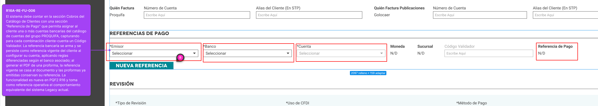

# R16A-RE-FU-006 — Cambios Complementarios

| Campo | Valor |
|---|---|
| **Requisito** | R16A-RE-FU-006 — Referencia de Pago y Código Validador |
| **Fecha** | 2026-08-03 |
| **Versión** | 1.0 |
| **Alcance** | Cambios adicionales al diseño original: columnas en `catMoneda` + endpoint de generación de referencia Banamex |

---

## Contexto



La pantalla de **Referencias de Pago** dentro de la sección Cobros del cliente expone tres selectores: **Emisor**, **Banco** y **Cuenta**. Al seleccionar una combinación donde el banco sea Banamex, el sistema debe calcular y mostrar la referencia antes de que el usuario guarde. Adicionalmente, `catMoneda` necesita dos columnas nuevas: una para el mapeo a Legacy y otra que materializa directamente el carácter P/D usado en el segmento 6 de la referencia Banamex.

---

## Cambio 1 — Columnas nuevas en `catMoneda`

> **Nota:** La tabla ya existe con las columnas `IdCatMoneda`, `ClaveMoneda`, `Moneda`, `Operativa`, `Clave` (varchar 150 — uso interno, ej. `'usd'`), `AplicaTipoDeCambio`, `Activo`, `FechaRegistro`, `FechaUltimaActualizacion`. Las columnas `ClaveLegacy` y `ReferenciaCuenta` son nuevas.

### BD — ALTER TABLE

```sql
-- R16A-RE-FU-006 — Columnas nuevas en catMoneda
ALTER TABLE dbo.catMoneda
    ADD ClaveLegacy      varchar(10) NULL,
        ReferenciaCuenta char(1)     NULL;

-- Poblar valores conocidos
UPDATE dbo.catMoneda SET ClaveLegacy = 'M.N.', ReferenciaCuenta = 'P' WHERE ClaveMoneda = 'MXN';
UPDATE dbo.catMoneda SET ClaveLegacy = 'DLS',  ReferenciaCuenta = 'D' WHERE ClaveMoneda = 'USD';
```

### Diccionario de columnas nuevas

| Columna | Tipo | Nulo | Descripción |
|---|---|---|---|
| `ClaveLegacy` | varchar(10) | SÍ | Clave equivalente en el sistema Legacy. MXN → `M.N.`, USD → `DLS` |
| `ReferenciaCuenta` | char(1) | SÍ | Carácter P/D para el segmento 6 de la referencia Banamex. MXN → `P`, USD → `D` |

### Impacto en Back — `ReferenciaBancariaBO`

Con `ReferenciaCuenta` disponible, el segmento 6 se lee directamente del catálogo en lugar de parsear `ClaveMoneda`:

```csharp
// ANTES — segmento 6 inferido desde ClaveMoneda
var seg6 = (moneda?.ClaveMoneda?.StartsWith("M") == true) ? "P" : "D";

// DESPUÉS — segmento 6 leído directamente de catMoneda.ReferenciaCuenta
var seg6 = moneda?.ReferenciaCuenta ?? "D";
```

**Archivo:** `Logic.Pqf.Catalogos\Clientes\DatosBancarios\ReferenciaBancariaBO.cs`

---

## Cambio 2 — Endpoint `GenerarReferenciaBanamex`

### Descripción

Endpoint para calcular y devolver la referencia Banamex de 7 segmentos **sin persistirla**. Se invoca únicamente cuando la UI detecta que el banco seleccionado tiene la bandera Banamex activa (`catBanco.RequiereCodigoValidador = true`). Permite mostrar la referencia como preview antes de que el usuario confirme.


### Request / Response

```
POST /ClienteDatosBancarios/GenerarReferenciaBanamex

Body:
{
    "idCliente": "{guid}",
    "idEmpresa":  "{guid}",
    "idBanco":   "{guid}",
    "idCuenta":  "{guid}"
}

Response 200 OK:
{
    "referencia": "QUI2345002P"
}
-- Segmentos: Q·U·I (letras 1-3 del nombre) + 2345 (últimos 4 de Clave) + 002 (código banco) + P (MXN) + "" (CodigoValidador vacío)

Response 400 Bad Request (banco no es Banamex):
{
    "message": "El banco indicado no es Banamex. Este endpoint solo aplica para Banamex."
}
```

### Parámetros

| Parámetro | Tipo | Descripción |
|---|---|---|
| `idCliente` | Guid | Cliente al que se asigna la cuenta |
| `idEmpresa` | Guid | Empresa del grupo PROQUIFA que factura (Proquifa, Golocaer, etc.) — `IdEmpresa` |
| `idBanco` | Guid | Banco seleccionado — debe tener `RequiereCodigoValidador = true` |
| `idCuenta` | Guid | Cuenta bancaria seleccionada (`IdDatosBancarios`) |

> **Nota:** `CodigoValidador` no se incluye porque este endpoint es un preview previo a su captura. La referencia final con el Código Validador se genera al guardar con `PUT /ClienteDatosBancarios`.

### Implementación

**Archivo:** `WebApi.Catalogos\Controllers\Configuracion\Clientes\ClienteDatosBancariosController.cs`

```csharp
[HttpPost]
[Route("ClienteDatosBancarios/GenerarReferenciaBanamex")]
public IHttpActionResult GenerarReferenciaBanamex([FromBody] GenerarReferenciaBanamexRequest request)
{
    var idCliente = request.IdCliente;
    var idEmpresa  = request.IdEmpresa;
    var idBanco   = request.IdBanco;
    var idCuenta  = request.IdCuenta;

    using (var db = new ProquifaDotNetEntities())
    {
        var banco = db.catBanco.FirstOrDefault(b => b.IdCatBanco == idBanco);
        if (banco == null || !banco.RequiereCodigoValidador)
            return BadRequest("El banco indicado no es Banamex. Este endpoint solo aplica para Banamex.");

        var cliente = db.Cliente.FirstOrDefault(c => c.IdCliente == idCliente);
        var cuenta  = db.DatosBancarios.FirstOrDefault(d => d.IdDatosBancarios == idCuenta);

        if (cliente == null || cuenta == null)
            return NotFound();

        var refBO     = new ReferenciaBancariaBO();
        var referencia = refBO.Construir(cliente, cuenta, codigoValidador: string.Empty);

        return Ok(new { referencia });
    }
}

// DTO del request
public class GenerarReferenciaBanamexRequest
{
    public Guid IdCliente { get; set; }
    public Guid IdEmpresa  { get; set; }
    public Guid IdBanco   { get; set; }
    public Guid IdCuenta  { get; set; }
}
```

---

## Pendientes

| #   | Pendiente                                                                                                                                                                   | Responsable |
| --- | --------------------------------------------------------------------------------------------------------------------------------------------------------------------------- | ----------- |
| P1  | Validar que todos los registros de `catMoneda` distintos de MXN/USD deben quedar con `ReferenciaCuenta = 'D'` como comportamiento esperado. | Desarrollo  |

---

## Criterios de Aceptación

- [ ] `catMoneda` tiene las columnas `ClaveLegacy` y `ReferenciaCuenta` con los valores MXN → `M.N.`/`P` y USD → `DLS`/`D` poblados.
- [ ] `ReferenciaBancariaBO` usa `catMoneda.ReferenciaCuenta` para el segmento 6; no parsea `ClaveMoneda`.
- [ ] `POST /ClienteDatosBancarios/GenerarReferenciaBanamex` retorna la referencia de 7 segmentos correcta cuando el banco es Banamex.
- [ ] El endpoint retorna 400 si el banco no tiene la bandera Banamex activa.
- [ ] El endpoint no persiste ningún dato — solo calcula y devuelve la referencia.
