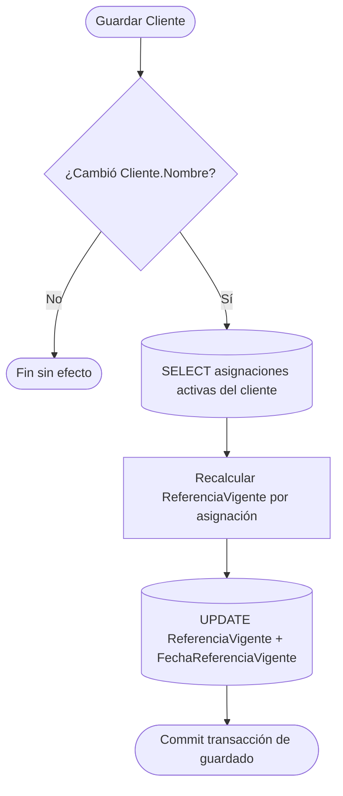
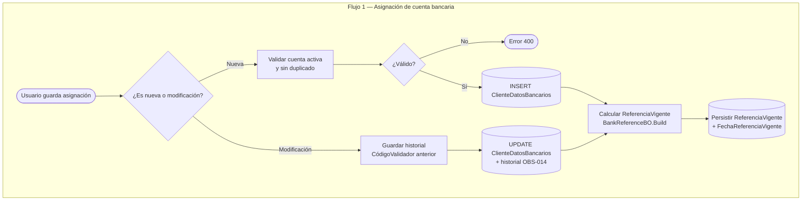
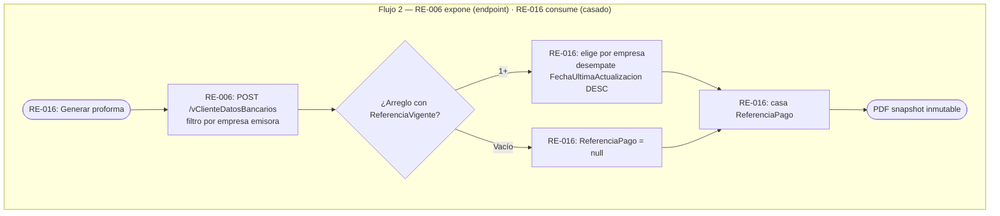
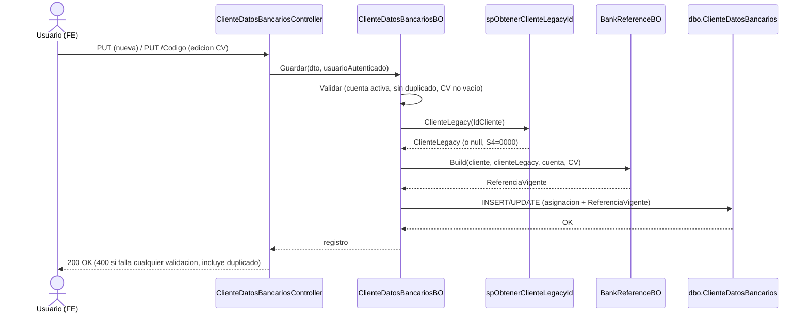

# **Diseño de la solución**

## R16A-RE-FU-006

| FORMATO | Arquitectura |
| :---- | :---- |
| **PROYECTO** | R16 \- Adquisiciones |
| **REFERENCIA** | AUI- FOR-01 |
| **VERSIÓN** | 1.20 |
| **FECHA** | 31 jul 2026 |
| **AUTOR** | [Jose Armando Santiago Lorenzo](mailto:jose.santiago@ryndem.mx) |
| **REVISOR** | [Juan David García Cruz](mailto:juan.garcia@ryndem.mx) |

---

# **Importante**

Posterior a este diseño, ¿cómo saber si el diseño de la solución al requisito está completo para que el programador inicie con el desarrollo?  
Hazte estas preguntas rápidas:

* ¿El programador sabe qué flujo implementar?
* ¿Sabe qué pasa si algo falla?
* ¿Sabe qué reglas no puede romper?
* ¿Sabe qué pruebas debe pasar?
* ¿Sabe dónde impacta?

*Nota: Este documento es una propuesta basada en el estándar IEEE 1016 "Software Design Description" que va permitir abarcar los puntos más importantes para el diseño del requisito que se está trabajando. Se debe administrar el tiempo que se tiene de diseño para que se complete de la mejor manera considerando todos los detalles técnicos.*

---

# **Introducción**

## **1\. Propósito del documento**

El propósito de este documento es definir el diseño de la solución técnica para el requisito **R16A-RE-FU-006 — Referencia de Pago y Código Validador**, describiendo la nueva tabla de BD, las clases de lógica de negocio, el controlador de API REST, el endpoint de consulta que expone la referencia como contrato de datos hacia RE-016, la regeneración en cascada de la referencia ante cambio del nombre del cliente, y la estrategia de migración de datos necesarios para su implementación en el repositorio `ProquifaDotNet`. **Nota de alcance (v1.6):** la modificación de la fábrica de proformas (`tpProformaPedidoFactory`) y el casado de `ReferenciaPago` **ya no son de RE-006** — pasan a RE-016 (Proforma México, Javi, solución `Finanzas`); RE-006 sólo expone el endpoint que ese factory consume.

**Nota:** Este documento se enfoca exclusivamente en el diseño de la solución en el **Back-end**. No redefine requisitos funcionales ni incluye diseño de pantallas o componentes Angular (scope de Front-end separado).

## **2\. Alcance**

### **Específicamente incluye:**

* Creación de la tabla `dbo.ClienteDatosBancarios` (relación N:N cliente-cuenta bancaria con Código Validador y `ReferenciaVigente`).
* Creación de `ClienteDatosBancariosBO` — CRUD de la relación cliente-cuenta-CódigoValidador; calcula y persiste `ReferenciaVigente` en cada INSERT / UPDATE.
* Creación de `BankReferenceBO` — algoritmo de construcción de referencia bancaria (Banamex / no-Banamex); invocado desde `ClienteDatosBancariosBO`, no desde el factory. **Aplica a clientes México y Perú** (v1.11) — la referencia no-Banamex toma la Razón Social del cliente; Perú no tiene banco equivalente a Banamex, así que siempre sigue este camino, sin lógica nueva. El algoritmo Banamex (7 segmentos) no cambia.
* Nueva columna `catBanco.RequiereCodigoValidador` — reemplaza la evaluación directa de la clave del banco para identificar Banamex; el campo se consulta directamente con el catálogo genérico `POST /catBanco`, ya existente, sin necesidad de ampliar ningún selector propio de RE-006.
* Creación de `ClienteDatosBancariosController` — API REST `/ClienteDatosBancarios`.
* Endpoint de consulta `POST /vClienteDatosBancarios` con filtros flexibles (`IdCliente`/`IdCatBanco`/`IdCatMoneda`/`IdEmpresa`, todos opcionales; el endpoint resuelve internamente las relaciones; responde siempre en arreglo) como contrato de datos hacia RE-016 — reemplaza, desde v1.6, la modificación del factory que traía el v1.5.
* Regeneración en cascada de `ReferenciaVigente` ante cambio de `Cliente.Nombre` (Flujo 3, RF-15): hook transaccional que recalcula todas las asignaciones activas del cliente. Se incorpora en v1.6.
* Reutilización del catálogo ya existente `vEmpresaDatosBancarios` (vista + BO + controller construidos fuera de RE-006) para el selector de Cuenta de la pantalla "Referencia de Pago" — sin desarrollo nuevo. El selector de Banco se resuelve con el catálogo genérico `POST /catBanco`, también ya existente.
* Creación de `vClienteDatosBancarios` — proyección LINQ en código (no vista SQL — comentario JD) con relaciones completas de la asignación cliente-cuenta, implementada en `vClienteDatosBancariosBO`.
* Migración inicial de datos Legacy: cuentas asignadas por cliente y sus Códigos Validadores desde PConnect mediante script SQL de una sola ejecución (no paquete SSIS — comentario JD; Flujo A, OBS-010). La sincronización ongoing PQF2 → Legacy (Flujo B) se mantiene como paquete SSIS existente, **propiedad del cliente**; se extiende mapeando a columnas Legacy existentes, **sin modificar el esquema de Legacy** (comentario JD).

### **No se consideran:**

* Diseño de pantallas o componentes Angular de la sub-sección "Referencia de Pago" (scope de FE).
* Validación de formato o longitud del Código Validador — pendiente definir con cliente (DUDA-015). *(Cuando se defina, la validación irá en el servicio de Guardado —POST/PUT—, no en un endpoint nuevo — comentario JD.)*
* ~~Clientes de Perú — modelo bancario peruano no definido; brecha abierta (BRECHA-03)~~ — cerrado parcialmente en v1.11: la referencia bancaria no-Banamex ya cubre clientes Perú (ver Específicamente incluye).
* Historial completo (bitácora) del Código Validador — se persiste solo el último cambio (OBS-014). La vista en pantalla del historial queda fuera del scope de R16 hasta confirmar con cliente (DUDA-120).
* Restricción de rol para asignar cuentas — desestimada en versión inicial (DUDA-017 cerrada).
* Modificación de `tpProformaPedidoFactory`, generación de la proforma y casado de `ReferenciaPago` — desde v1.6 son de RE-016 (Javi, solución `ProquifaDotNet.Finanzas`, no `Logistica`); RE-006 sólo expone el endpoint que ese factory consume (comentarios JD; mapa §3).
* Paquete SSIS para la carga inicial — reemplazado por script SQL de una sola ejecución (comentario JD). El SSIS del Flujo B (ongoing) sí se mantiene (propiedad del cliente).
* Modificación del esquema de Legacy (`ALTER TABLE`, tablas/columnas nuevas) — comentario JD: Legacy no se modifica. Los campos de RE-006 que sincroniza el Flujo B se mapean a columnas Legacy ya existentes (`CuentaCliente.CodValidador`); cualquier cambio estructural en Legacy o en el paquete SSIS (propiedad del cliente) se coordina y ejecuta del lado del cliente.

---

# **Visión general del diseño**

## **1\. Objetivo técnico**

Implementar la persistencia de la relación cliente-cuenta bancaria con Código Validador en la nueva tabla `ClienteDatosBancarios`, calcular y persistir la referencia bancaria resultante en `ReferenciaVigente` al momento de asignar o actualizar la cuenta, mantenerla vigente ante cambios del nombre del cliente (regeneración en cascada, Flujo 3), y exponerla vía un endpoint de consulta para que RE-016 la lea y la case en la proforma. Se busca consistencia entre proformas y con el módulo Buzón de Pagos mediante un contrato de datos limpio (RE-006 produce y expone; RE-016 consume), sin que RE-006 modifique la fábrica de proformas.

## **2\. Componentes involucrados**

| Aplicativo | Componente | Responsabilidad | Ubicación |
| :---- | :---- | :---- | :---- |
| ProquifaDotNet | `ClienteDatosBancariosController` | Expone CRUD REST de asignaciones cliente-cuenta-CódigoValidador (alta, edición de Código Validador, baja) | `WebApi.Catalogos\Controllers\Configuracion\Clientes\Relaciones\` |
| ProquifaDotNet | `vClienteDatosBancariosController` | Endpoint de consulta con relaciones completas — proyección LINQ (`vClienteDatosBancariosBO`), no vista SQL. Controller propio, separado del CRUD: son responsabilidades distintas (escritura vs. proyección de solo lectura), mismo criterio que `EmpresaDatosBancariosBO`/Controller vs. `vEmpresaDatosBancariosBO`/Controller en el resto del ecosistema. La respuesta es un objeto plano con los campos mínimos de cada tabla relacionada (Cliente, Empresa, DatosBancarios, catMoneda, catBanco) | `WebApi.Catalogos\Controllers\Configuracion\Clientes\Relaciones\` |
| ProquifaDotNet | `ClienteDatosBancariosBO` | Lógica de persistencia: INSERT, UPDATE, DELETE lógico, GET; calcula `ReferenciaVigente` en cada escritura | `Logic.Pqf.Catalogos\Clientes\DatosBancarios\` |
| ProquifaDotNet | `BankReferenceBO` | Algoritmo de construcción de referencia bancaria: Banamex (7 segmentos) y no-Banamex (Razón Social del cliente); invocado por `ClienteDatosBancariosBO` | `Logic.Pqf.Catalogos\Clientes\DatosBancarios\` |
| RE-016 (Javi, no RE-006) | `tpProformaPedidoFactory` | **Consumidor** — llama al endpoint de RE-006 y casa la referencia en `ReferenciaPago`. Desde v1.6 RE-006 **NO** lo modifica; vive en la solución `Finanzas`, no en `Logistica` | (RE-016) `ProquifaDotNet.Finanzas` |
| ProquifaDotNet | `ClienteBO` (hook, Flujo 3) | Regeneración en cascada: si cambia `Cliente.Nombre`, recalcula `ReferenciaVigente` de todas las asignaciones activas del cliente en la misma transacción (RF-15) | `Logic.Pqf.Catalogos\Clientes\` |
| Existente, reutilizado (ajeno a RE-006) | `vEmpresaDatosBancarios` | Selector de Cuenta de la pantalla "Referencia de Pago" — catálogo de cuentas bancarias del grupo PROQUIFA. Vista + BO + controller ya construidos por otro desarrollo; RE-006 lo consume tal cual, sin código nuevo. Estructura real (verificada live 29-jun): `EmpresaDatosBancarios` es junction (`IdEmpresaDatosBancarios`, `IdDatosBancarios`, `IdEmpresa`, `Activo`); el detalle de cuenta (`NumeroDeCuenta`, `Beneficiario`, `Sucursal`, `Clabe`, `IdCatMoneda`, `NumeroTarjeta`) vive en `DatosBancarios` | `Logic.Pqf.Catalogos\Cuentas\` (no modificado por RE-006) |
| Existente, reutilizado (catálogo genérico) | `catBanco` | Selector de Banco de la pantalla "Referencia de Pago" — catálogo genérico ya existente (`IdCatBanco`, `Banco`, `Clave`, `RequiereCodigoValidador`); RE-006 lo consume directo, sin endpoint propio | Catálogo genérico existente (fuera del alcance de desarrollo de RE-006) |
| BD ProquifaDotNet | `dbo.ClienteDatosBancarios` | Tabla nueva — relación N:N `Cliente` ↔ `EmpresaDatosBancarios` con `CodigoValidador`, `ReferenciaVigente` e historial de último cambio | BD ProquifaDotNet |
| PConnect (Legacy) | `CuentaCliente` | Fuente de datos para la migración inicial (script SQL, Flujo A) de RE-006 (asignaciones cliente-cuenta + `CodValidador`) — tabla en BD Legacy, solo lectura. `CuentaBanco` corresponde a la migración de `EmpresaDatosBancarios` (RE-FU-001), no a RE-006. | BD PConnect |
| Script SQL (Flujo A) | Migración inicial RE-006 | Migra asignaciones cliente-cuenta \+ CódigoValidador de PConnect a `ClienteDatosBancarios` en PQF2 — una sola ejecución, no SSIS (comentario JD) | BD ProquifaDotNet |
| SSIS (Flujo B, existente, del cliente) | Sincronización ongoing | Transfiere cambios PQF2 → Legacy; **propiedad del cliente**, se extiende con campos RE-006 mapeando a columnas Legacy existentes (sin `ALTER TABLE`) | PConnect / SSIS |
| Aplicativo de Bitácora (externo, nuevo) | Evento de auditoría | RE-006 **publica un evento** hacia el aplicativo de Bitácora tras cada alta/baja/modificación de asignación o `CodigoValidador`. ==Firma del endpoint/contrato del evento pendiente de definir== — propuesta aprobada; infra y endpoints por detallar; sólo se sabe que es por eventos | Externo (aplicativo de Bitácora) |

---

# **Diseño funcional detallado**

## **1\. Flujo 1 — Asignación de cuenta bancaria al cliente (CREATE / UPDATE)**

Flujo iniciado desde Frontend cuando el usuario guarda una asignación nueva o modifica una existente en la sub-sección "Referencia de Pago" del Catálogo de Clientes.

1. El Frontend realiza `PUT /ClienteDatosBancarios` (nueva asignación) o `PUT /ClienteDatosBancarios/Codigo` (modificación de Código Validador) — `POST` queda reservado a los endpoints de consulta en toda la convención del repo. Bodies (ver `json` abajo).
2. `ClienteDatosBancariosController` recibe la solicitud y delega en `ClienteDatosBancariosBO`.
3. **Validaciones previas en el BO:**
   - Verificar que `EmpresaDatosBancarios.Activo = 1` para la cuenta seleccionada (RT-01).
   - Verificar que no exista ya una asignación activa con el mismo par (`IdCliente`, `IdEmpresaDatosBancarios`) — prevenir duplicados (RT-02).
   - Verificar que `CodigoValidador` no sea nulo ni vacío — **solo para cuentas Banamex** (CA-E1; no aplica a cuentas no-Banamex, que no lo usan en su referencia).
4. Si es nueva asignación (`POST`):
   - Insertar registro en `ClienteDatosBancarios` con `IdCliente`, `IdEmpresaDatosBancarios`, `CodigoValidador`, `FechaRegistro = GETDATE()`, `IdUsuarioModificacion = ObtenerUsuarioAutenticado().IdUsuario` (usuario autenticado de la sesión — RT-09), `Activo = 1`.
   - Los campos de historial (`CodigoValidadorAnterior`, `FechaModificacionAnterior`, `IdUsuarioModificacionAnterior`) quedan en `NULL`.
   - Invocar `BankReferenceBO.Build(cliente, empresaDatosBancarios, codigoValidador)` para calcular la referencia bancaria.
   - Persistir resultado en `ReferenciaVigente` y `FechaReferenciaVigente = GETDATE()`.
5. Si es modificación de CódigoValidador (`PUT /ClienteDatosBancarios/Codigo`):
   - Leer el registro actual en `ClienteDatosBancarios`.
   - Copiar `CodigoValidador` vigente → `CodigoValidadorAnterior`.
   - Copiar `FechaUltimaActualizacion` vigente → `FechaModificacionAnterior`.
   - Copiar `IdUsuarioModificacion` vigente → `IdUsuarioModificacionAnterior`.
   - Actualizar `CodigoValidador` con el nuevo valor, `FechaUltimaActualizacion = GETDATE()`, `IdUsuarioModificacion = ObtenerUsuarioAutenticado().IdUsuario` (usuario autenticado de la sesión — RT-09) (OBS-014).
   - Recalcular `BankReferenceBO.Build()` con el nuevo `CodigoValidador`.
   - Actualizar `ReferenciaVigente` y `FechaReferenciaVigente = GETDATE()`.
6. El BO retorna el registro actualizado.
7. `ClienteDatosBancariosController` responde `200 OK` con el registro, o `400 Bad Request` con detalle si falla alguna validación (cuenta inactiva, asignación duplicada, `CodigoValidador` vacío) — todas las validaciones de negocio de este endpoint responden con el mismo código, sin distinción de `409`.

> **Evento de auditoría hacia el aplicativo de Bitácora (integración por eventos):** tras persistir con éxito la operación (alta/modificación de asignación o de `CodigoValidador`), RE-006 **publicará un evento** hacia el nuevo aplicativo de Bitácora para el registro de auditoría. ==La firma del endpoint/contrato del evento está pendiente de definir.== La propuesta del aplicativo de Bitácora está **aprobada**, pero aún falta detallar la infraestructura y los endpoints; sólo se sabe que la integración será **por eventos**.

Bodies del paso 1:

```json
// PUT /ClienteDatosBancarios
{
  "IdCliente": "Guid",
  "IdEmpresaDatosBancarios": "Guid",
  "CodigoValidador": "string"
}
```

```json
// PUT /ClienteDatosBancarios/Codigo
{
  "IdClienteDatosBancarios": "Guid",
  "CodigoValidador": "string"
}
```

## **2\. Flujo 2 — Exposición de la referencia vía endpoint (contrato hacia RE-016)**

**Cambio de alcance v1.6:** RE-006 ya no modifica el factory. Su responsabilidad en la proforma se reduce a exponer la referencia mediante el endpoint de consulta; el consumo y casado los realiza RE-016 (Javi, solución `Finanzas`). La referencia se calcula en el Flujo 1 (asignación) y se mantiene vigente por el Flujo 3 (cambio de nombre); el factory sólo lee — no recalcula — garantizando consistencia con el Buzón de Pagos.

**Parte de RE-006 (el contrato):**
1. RE-006 expone `POST /vClienteDatosBancarios` con `IdCliente`, `IdCatBanco`, `IdCatMoneda` e `IdEmpresa` — todos opcionales; el endpoint resuelve internamente las relaciones (`ClienteDatosBancarios` → `EmpresaDatosBancarios` → `DatosBancarios` → `catBanco`/`catMoneda`) y responde siempre un arreglo con `ReferenciaVigente` incluida (RT-10). Sin ningún filtro, regresa todas las asignaciones activas del sistema.
2. La tupla `(cliente, banco, moneda, empresa)` no garantiza un único registro (una empresa puede tener 2 cuentas mismo banco+moneda); el único discriminador a 1 registro es `IdEmpresaDatosBancarios`. Por eso el endpoint devuelve arreglo (RT-11).

**Parte de RE-016 (consumidor — fuera del alcance de RE-006, se documenta para contexto):**
3. `tpProformaPedidoFactory` —que ya recibe la Empresa emisora en su constructor (`tpProformaPedidoFactory(Empresa empresa)`)— llama al endpoint filtrando por `IdEmpresa = empresa.IdEmpresa` y toma la `ReferenciaVigente` de la asignación activa correspondiente. Resuelve DUDA-118: el cliente paga a la cuenta de la entidad que le factura.
4. Si hay más de una asignación activa para esa empresa (caso residual, ej. 2 cuentas STP), RE-016 desempata por `FechaUltimaActualizacion DESC`. Si no hay ninguna, `ReferenciaPago = null` — no bloquea la generación.
5. RE-016 casa `tpProformaPedido.ReferenciaPago = ReferenciaVigente` como snapshot inmutable; el PDF conserva la referencia aunque cambien después los datos del cliente o la cuenta.
6. Al consultar un PDF almacenado, se sirve el archivo guardado sin regenerar.

### **Algoritmo Banamex — 7 segmentos (invocado en Flujo 1)**

**GAP-E cerrado:** `dbo.Cliente` en PQF2 no tiene campo `Clave`. La clave numérica de Legacy se obtiene desde `PConnectProquifaDotNet.dbo.Clientes` (columna `ClienteLegacy int`; cruce por `ClientePQF = IdCliente`). El código actual de Juan David en `BankReferenceBO` usa `cliente.Clave` — bug crítico que producirá S4 \= `"0000"` para todos los clientes. Fix requerido: sustituir por consulta a `PConnectProquifaDotNet.dbo.Clientes`. Ver sección Impacto Técnico. *(Verificado live 29-jun: `ProquifaDotNet.dbo.Carga_ClientesR1` DESCARTADA como fuente — cobertura ~19% (268 IdCliente distintos vs 1,400 clientes PQF2) y filas duplicadas. `PConnectProquifaDotNet.dbo.Clientes` verificada live 29-jun vía cross-DB desde `proquifa-db-dev`: columnas `ClienteLegacy int` / `ClientePQF uniqueidentifier` confirmadas; cobertura 1,398 / 1,400 clientes PQF2 (99.9%). Los 2 clientes sin mapeo ("ACCESORIOS, SUMINISTROS Y EQUIPO MEDICO DE MEXICO" y "REHIDRATACION TOTAL R") producirán S4 = "0000" — fallback aceptado. La tabla contiene 4,173 filas por bug del job de sync (INSERT sin dedup): el lookup usa `TOP 1 ORDER BY FechaRegistro ASC` como tiebreaker. 6 `ClienteLegacy` mapean a 2 `ClientePQF` distintos cada uno; no afecta el lookup porque la query filtra por `ClientePQF = @IdCliente`.)*

| Segmento | Fuente en PQF2 | Fallback |
| :---- | :---- | :---- |
| S1 | `Cliente.Nombre[0]` — primera letra | `'X'` si nombre vacío o nulo |
| S2 | `Cliente.Nombre[1]` — segunda letra | `'X'` si nombre tiene \< 2 chars |
| S3 | `Cliente.Nombre[2]` — tercera letra | `'X'` si nombre tiene \< 3 chars |
| S4 | Últimos 4 chars de `CAST(ClienteLegacy AS varchar)` desde `PConnectProquifaDotNet.dbo.Clientes WHERE ClientePQF = @IdCliente` | Padding `'0'` izq. si \< 4 chars; `"0000"` si cliente no existe en tabla de mapeo |
| S5 | `catBanco.Clave` — código del banco (`'002'` para Banamex) | — |
| S6 | `'P'` si la **primera letra** de `catMoneda.ClaveMoneda` es `'M'`; `'D'` en otro caso (regla literal de Regla 7/Criterio C3 de la matriz — replica Legacy 1:1, no es igualdad exacta a "MXN"). Ruta real: `DatosBancarios.IdCatMoneda → catMoneda.ClaveMoneda` (la moneda NO está en EmpresaDatosBancarios) | — |
| S7 | `ClienteDatosBancarios.CodigoValidador` | — |

**Ejemplo:** Cliente `QUIMICOS SA DE CV`, `ClienteLegacy = 12345`, Banamex (`002`), Moneda `MXN`, CodValidador `ABC` → referencia \= `QUI2345002PABC`

**GAP-D cerrado:** identificación de Banamex ya no depende de comparar la clave del banco (`catBanco.Clave = '002'`) — se agrega la columna `catBanco.RequiereCodigoValidador` (bit) como condición definitiva: `RequiereCodigoValidador = 1` para Banamex, `0` para el resto. El catálogo genérico `POST /catBanco` (ya existente, sin ampliar) expone este campo directamente al consumidor, sin necesidad de un selector propio de RE-006. El cruce con tabla `Empresas` descrito en P72 (DUDA-016) sigue descartado.

**Desbordamiento S4:** registro actual en PConnect \~7,237 clientes. Al superar 9,999, `ClienteLegacy` con 5+ dígitos genera S4 repetido (ej. cliente 10,001 → S4 \= `"0001"`). Riesgo aceptado: la unicidad de la referencia completa la aporta S7 (`CodigoValidador`). Si Banamex exige S4 único en el futuro, escalar a 5 chars requiere coordinación con el banco.

## **3\. Flujo 3 — Regeneración en cascada por cambio de `Cliente.Nombre` (RF-15 / GAP-07)**

Incorporado en v1.6. **Requisito de matriz (Regla 4 nivel 1):** *"solo se regenera si cambia un dato fuente... o datos del cliente que la componen"*. Los segmentos S1–S3 de la referencia Banamex dependen de `Cliente.Nombre`, y la referencia no-Banamex es el nombre — un cambio de nombre deja `ReferenciaVigente` obsoleta y contaminaría el Buzón en proformas futuras.

**Reducción de superficie:** como S4 usa `ClienteLegacy` (id legacy inmutable) y no `Cliente.Clave`, el único dato del cliente que caduca la referencia es `Cliente.Nombre`. El disparador se limita a ese campo.

**Alcance del cambio de fuente de dato (v1.11):** de los dos caminos de `BankReferenceBO`, solo cambia la fuente de dato del fallback no-Banamex, que ahora toma `DatosFacturacionCliente.RazonSocial` en vez de `Cliente.Nombre`. El algoritmo Banamex (segmentos S1-S3, 7 segmentos) no se modifica y sigue leyendo `Cliente.Nombre` en su totalidad.

**Mecanismo (hook transaccional en `ClienteBO`):**
1. Al guardar/actualizar un cliente, `ClienteBO._GuardarOActualizar` detecta si cambió `Cliente.Nombre`.
2. Si no cambió → no-op (fin sin efecto).
3. Si cambió → `SELECT` de todas las asignaciones activas (`ClienteDatosBancarios.Activo = 1`) del cliente.
4. Para cada asignación, recalcular `ReferenciaVigente` invocando `BankReferenceBO.Build()` (con el `ClienteLegacy` ya resuelto) y actualizar `ReferenciaVigente` + `FechaReferenciaVigente`, en la misma transacción del guardado del cliente.
5. Registrar `INFO` con el nº de asignaciones recalculadas.



**Rutas de fallo:**
- Cliente sin asignaciones activas → no-op.
- Fallo al recalcular una asignación → rollback de toda la transacción de guardado del cliente (consistencia sobre disponibilidad).
- Las proformas ya emitidas no se tocan (conservan su snapshot `ReferenciaPago`).

**Concurrencia:** el hook opera dentro de la transacción del guardado del cliente; una edición manual del Código Validador en paralelo con esta cascada resolvería por *last-write-wins* (no hay `RowVersion` en el DDL). Contención esperada baja (editar el nombre de un cliente es infrecuente); si se requiere detección de conflicto, evaluar `RowVersion` antes de implementar — pendiente de decisión, no bloqueante.

## **4\. Criterios de aceptación del requisito**

| CA | Descripción | Estado | Justificación |
| :---- | :---- | :---- | :---- |
| CA-1 | Usuario navega a Cobros del cliente y la sub-sección "Referencia de Pago" es accesible | Cubierto | `POST /vClienteDatosBancarios` con `QueryInfo { filtros: { IdCliente } }` retorna asignaciones activas del cliente con relaciones completas incluyendo `ReferenciaVigente` |
| CA-2 | Selector de Banco muestra catálogo de bancos del grupo PROQUIFA | Cubierto | Catálogo genérico ya existente `POST /catBanco` — retorna la entidad completa (`IdCatBanco`, `Banco`, `RequiereCodigoValidador`, entre otros); no requiere endpoint propio de RE-006 |
| CA-3 | Selector de Cuenta filtra por banco seleccionado | Cubierto | Catálogo ya existente `POST /vEmpresaDatosBancarios` (reutilizado, sin desarrollo nuevo) con `QueryInfo { filtros: { IdCatBanco } }` — retorna cuentas del banco seleccionado; scope de FE el componente en cascada |
| CA-4 | Sucursal se autopobla desde la cuenta seleccionada (solo lectura) | Cubierto | Campo `Sucursal` incluido en respuesta de `POST /vEmpresaDatosBancarios`; read-only en FE |
| CA-5 | CódigoValidador se acepta como input manual sin validación de formato/longitud | Cubierto | `CodigoValidador varchar(50)` sin constraint de formato; longitud provisional 50 — pendiente confirmar máximo con cliente (DUDA-015 abierta) |
| CA-6 | Persistencia de nueva asignación o modificación — referencia generada/actualizada a nivel cliente | Cubierto | Flujo 1 pasos 4-5: referencia calculada por `BankReferenceBO` y persistida en `ReferenciaVigente` al guardar la asignación; Flujo 2: RE-006 la expone por endpoint y RE-016 la lee |
| CA-7 | Cliente puede tener múltiples cuentas asignadas sin límite máximo definido | Cubierto | INSERT permite múltiples registros por cliente. La selección de cuenta al generar la proforma se resuelve por empresa emisora (RT-08, Flujo 2). El tope máximo de cuentas por cliente sigue sin definir con cliente (DUDA-118, no bloqueante) |
| CA-8 | Eliminación lógica de asignación — `Activo = 0`, no DELETE físico | Cubierto | `DELETE /ClienteDatosBancarios?IdClienteDatosBancarios={guid}` ejecuta `UPDATE Activo = 0` |
| CA-E1 | CódigoValidador vacío → error, no guarda (solo cuentas Banamex — no aplica a no-Banamex) | Cubierto | Validación en `ClienteDatosBancariosBO` paso 3; responde `400 Bad Request` |
| CA-E2 | Cuentas con `Activo = 0` no aparecen en selector | Cubierto | Filtro `EmpresaDatosBancarios.Activo = 1` en endpoint `POST /vEmpresaDatosBancarios` |
| CA-EC1 | Asignación duplicada (misma cuenta al mismo cliente) bloqueada | Cubierto | Validación de duplicado en `ClienteDatosBancariosBO` paso 3; responde `400 Bad Request` (mismo código que el resto de validaciones de este endpoint, sin distinción de `409`) |
| CA-EC2 | Cuenta inactivada/eliminada post-asignación: proformas existentes intactas; no se generan nuevas con esa cuenta | Cubierto | Proformas existentes conservan su snapshot en PDF (OBS-013). El endpoint de RE-006 no devuelve asignaciones cuya cuenta esté inactiva (`EmpresaDatosBancarios.Activo = 0`), así que RE-016 recibe vacío → `ReferenciaPago = null`. No se permite crear nuevas asignaciones sobre cuentas inactivas (RT-01). El sistema no altera asignaciones existentes de forma automática |
| CA-12 | Sin restricción de rol — cualquier usuario con acceso a cartera puede operar | Cubierto | Sin middleware de rol en controller (DUDA-017 cerrada) |
| CA-13 | Endpoint de consulta expone la referencia como contrato para RE-016 | Cubierto | `POST /vClienteDatosBancarios` con `IdCliente`/`IdCatBanco`/`IdCatMoneda`/`IdEmpresa`, todos opcionales; resuelve relaciones internamente; responde siempre arreglo (RT-10). La tupla de 4 filtros no garantiza unicidad → arreglo (RT-11) |
| CA-14 | Cambio de `Cliente.Nombre` regenera `ReferenciaVigente` de las asignaciones activas | Cubierto | Flujo 3 (RF-15): hook transaccional en `ClienteBO` recalcula todas las asignaciones activas en la misma transacción; fallo → rollback; proformas emitidas intactas (RT-12) |

## **5\. Reglas técnicas aplicadas**

| Regla | Descripción |
| :---- | :---- |
| RT-01 | `ClienteDatosBancariosBO` verifica `EmpresaDatosBancarios.Activo = 1` antes de insertar cualquier asignación. No se permite asociar cuentas inactivas. |
| RT-02 | La unicidad (`IdCliente`, `IdEmpresaDatosBancarios`) se garantiza con un índice `UNIQUE` filtrado (`WHERE Activo = 1`). La baja lógica (`Activo = 0`) no cuenta como duplicado — permite reasignar una cuenta previamente eliminada al mismo cliente. |
| RT-03 | El algoritmo Banamex en `BankReferenceBO` aplica la concatenación determinista de 7 segmentos. Los fallbacks (`'X'` en S1-S3, padding `'0'` en S4) se aplican siempre para garantizar formato consistente. |
| RT-04 | El casado en la proforma lo hace RE-016 (no RE-006): su `tpProformaPedidoFactory` lee `ReferenciaVigente` desde el endpoint de RE-006 y la asigna a `ReferenciaPago`. No se recalcula — el cálculo ocurre en Flujo 1 (asignación) y se mantiene por Flujo 3 (cambio de nombre). RE-006 no invoca ni modifica el factory. |
| RT-05 | Al modificar `CodigoValidador`: el valor e `IdUsuarioModificacion` vigentes se mueven a `CodigoValidadorAnterior`, `FechaModificacionAnterior` e `IdUsuarioModificacionAnterior`; luego `IdUsuarioModificacion` se actualiza con el usuario actual. Se recalcula `ReferenciaVigente` con el nuevo código. Si `CodigoValidadorAnterior` ya tenía valor previo, se sobrescribe — no es bitácora completa, solo último cambio (OBS-014). |
| RT-06 | Baja lógica (`Activo = 0`), nunca DELETE físico en `ClienteDatosBancarios`. Preserva integridad referencial y trazabilidad. |
| RT-07 | La referencia bancaria se calcula en `ClienteDatosBancariosBO` al crear o actualizar la asignación, y se persiste en `ClienteDatosBancarios.ReferenciaVigente`. El factory de proformas (RE-016) lee este campo —vía el endpoint de RE-006— como fuente de verdad, garantizando que el Buzón de Pagos compare contra el mismo valor que apareció en el documento enviado al cliente. |
| RT-08 | RE-006 provee el filtro por empresa en el endpoint (`IdEmpresa`); RE-016 selecciona: filtra por la empresa emisora (ya inyectada en `tpProformaPedidoFactory(Empresa empresa)`), considera sólo asignaciones con `ClienteDatosBancarios.Activo = 1` y `EmpresaDatosBancarios.Activo = 1`, y si hay más de una desempata por `FechaUltimaActualizacion DESC`; si no hay ninguna, `ReferenciaPago = null`. Resuelve DUDA-118 y CA-EC2. La decisión de selección es de RE-016, no de RE-006. |
| RT-10 | El endpoint `POST /vClienteDatosBancarios` recibe `IdCliente`, `IdCatBanco`, `IdCatMoneda` e `IdEmpresa` — todos opcionales —, resuelve internamente la cadena de relaciones (`EmpresaDatosBancarios`↔`DatosBancarios`↔`catBanco`/`catMoneda`) y responde siempre en arreglo (`List<vClienteDatosBancarios>`), en cualquier combinación de filtros, incluida ninguna (regresa todas las asignaciones activas). Es el contrato de datos hacia RE-016. |
| RT-11 | La tupla (cliente, banco, moneda, empresa) no es llave única — una empresa puede tener 2 cuentas activas mismo banco+moneda (verificado live). El único discriminador a 1 registro es `IdEmpresaDatosBancarios` (no `IdEmpresa`). Por eso el endpoint devuelve arreglo; si un consumidor requiere un único registro, filtra por `IdEmpresaDatosBancarios`. |
| RT-12 | Ante cambio de `Cliente.Nombre`, un hook transaccional en `ClienteBO` recalcula `ReferenciaVigente` de todas las asignaciones activas del cliente en la misma transacción del guardado (Flujo 3, RF-15). Fallo en la cascada → rollback del guardado del cliente. Las proformas ya emitidas no se tocan. |
| RT-09 | El controller obtiene el usuario que ejecuta la operación mediante `BaseApiController.ObtenerUsuarioAutenticado().IdUsuario` (resuelto desde el token de autorización; patrón ya usado en `ContratoClienteController`) y lo pasa al BO para poblar `IdUsuarioModificacion`. En un UPDATE, el `IdUsuarioModificacion` vigente pasa a `IdUsuarioModificacionAnterior` y el usuario autenticado actual queda como `IdUsuarioModificacion` (par de `FechaUltimaActualizacion`). |

---

# **Diseño de componentes**

## **1\. Diagramas**

Flujo 1: `FE → ClienteDatosBancariosController → ClienteDatosBancariosBO → BankReferenceBO → dbo.ClienteDatosBancarios`



Flujo 2: `RE-016 (tpProformaPedidoFactory) → endpoint RE-006 POST /vClienteDatosBancarios → lee ReferenciaVigente` — RE-006 expone, RE-016 consume y casa.



Flujo 3 (regeneración en cascada por cambio de `Cliente.Nombre`): ver diagrama en *Diseño funcional detallado → Flujo 3*.

## **2\. Diagramas de secuencia**

Interacción temporal entre componentes para los tres flujos (solicitado en revisión: complementan los diagramas de flujo con el orden de llamadas y el responsable de cada paso).

**Secuencia 1 — Asignación de cuenta (Flujo 1, CREATE / UPDATE):**



**Secuencia 2 — Exposición vía endpoint (RE-006) + consumo (RE-016) (Flujo 2):**

```mermaid
sequenceDiagram
    participant F as tpProformaPedidoFactory (RE-016)
    participant EP as POST /vClienteDatosBancarios (RE-006)
    participant DB as vClienteDatosBancarios
    F->>EP: consulta (IdCliente, IdEmpresa = empresa emisora)
    EP->>DB: SELECT join (ClienteDatosBancarios + EmpresaDatosBancarios + DatosBancarios + catBanco/catMoneda)
    DB-->>EP: filas (0..N)
    EP-->>F: arreglo vClienteDatosBancarios (siempre arreglo)
    alt arreglo vacio
        F->>F: ReferenciaPago = null (no bloquea)
    else 1+ registros
        F->>F: elegir por empresa; desempate FechaUltimaActualizacion DESC
        F->>F: casar ReferenciaPago = ReferenciaVigente (snapshot inmutable)
    end
    Note over EP,DB: RE-006 solo expone; la seleccion/casado es de RE-016
```

**Secuencia 3 — Regeneración en cascada por cambio de nombre (Flujo 3, RF-15):**

```mermaid
sequenceDiagram
    actor U as Usuario (Catalogo Cliente)
    participant CB as ClienteBO GuardarOActualizar
    participant DB as dbo.ClienteDatosBancarios
    participant RB as BankReferenceBO
    U->>CB: Guardar Cliente (Nombre modificado)
    CB->>CB: Cambio Cliente.Nombre?
    alt No cambio
        CB-->>U: OK (no-op)
    else Cambio
        CB->>DB: SELECT asignaciones activas del cliente
        DB-->>CB: asignaciones (0..N)
        loop por cada asignacion activa
            CB->>RB: Build(cliente, clienteLegacy, cuenta, CV)
            RB-->>CB: ReferenciaVigente (nueva)
            CB->>DB: UPDATE ReferenciaVigente + FechaReferenciaVigente
        end
        Note over CB,DB: misma transaccion; fallo -> rollback total
        CB-->>U: OK (n asignaciones recalculadas)
    end
```

---

# **Diseño de Interfaces**

## **1\. Interfaces de entrada**

| Interfaz | Descripción |
| :---- | :---- |
| `PUT /ClienteDatosBancarios` | Crea nueva asignación cliente-cuenta. Ver body abajo. |
| `PUT /ClienteDatosBancarios/Codigo` | Actualiza `CodigoValidador` de una asignación existente y recalcula `ReferenciaVigente`. Ver body abajo. |
| `DELETE /ClienteDatosBancarios?IdClienteDatosBancarios={guid}` | Baja lógica de la asignación (`Activo = 0`) |
| `POST /vClienteDatosBancarios` | Contrato hacia RE-016. Consulta asignaciones cliente-cuenta con relaciones completas. Ver body/respuesta abajo (respuesta plana). Resuelve las relaciones internamente; responde siempre arreglo. La tupla de filtros no garantiza unicidad (RT-11) |
| `POST /catBanco` | Catálogo genérico ya existente (fuera del alcance de desarrollo de RE-006); retorna la entidad completa de banco, incluyendo `RequiereCodigoValidador` — alimenta el selector de Banco en FE |
| `POST /vEmpresaDatosBancarios` | Catálogo ya existente (reutilizado, fuera del alcance de desarrollo de RE-006); retorna cuentas filtradas por banco — alimenta el selector de Cuenta en FE. Respuesta incluye `Sucursal` para autopoblar campo read-only |

**Bodies:**

```json
// PUT /ClienteDatosBancarios
{
  "IdCliente": "Guid",
  "IdEmpresaDatosBancarios": "Guid",
  "CodigoValidador": "string"
}
```

```json
// PUT /ClienteDatosBancarios/Codigo
{
  "IdClienteDatosBancarios": "Guid",
  "CodigoValidador": "string"
}
```

```json
// POST /vClienteDatosBancarios — request (todos los filtros opcionales; sin ninguno regresa todas las asignaciones activas)
{
  "filtros": {
    "IdCliente": "Guid (opcional)",
    "IdCatBanco": "Guid (opcional)",
    "IdCatMoneda": "Guid (opcional)",
    "IdEmpresa": "Guid (opcional)"
  }
}
```

```json
// POST /vClienteDatosBancarios — forma de cada elemento del arreglo de respuesta (objeto plano)
{
  "IdClienteDatosBancarios": "Guid",
  "CodigoValidador": "string (null si la cuenta es no-Banamex — no aplica)",
  "ReferenciaVigente": "string",
  "Activo": "bool",

  "IdCliente": "Guid",
  "ClienteNombre": "string",
  "ClienteAlias": "string",
  "ClienteActivo": "bool",
  "IdRegion": "Guid",

  "IdEmpresa": "Guid",
  "EmpresaAlias": "string",
  "EmpresaActivo": "bool",

  "IdEmpresaDatosBancarios": "Guid",

  "IdDatosBancarios": "Guid",
  "NumeroDeCuenta": "string",
  "Sucursal": "string",
  "Beneficiario": "string",

  "IdCatMoneda": "Guid",
  "ClaveMoneda": "string",
  "Moneda": "string",
  "MonedaActivo": "bool",

  "IdCatBanco": "Guid",
  "Banco": "string",
  "RequiereCodigoValidador": "bool",
  "BancoActivo": "bool"
}
```

```json
// POST /catBanco (catálogo genérico existente)
// Body: {}
// Respuesta: List<catBanco> — entidad completa, incluye { "IdCatBanco": "Guid", "Banco": "string", "Clave": "string", "RequiereCodigoValidador": "bool" }
```

```json
// POST /vEmpresaDatosBancarios
{
  "filtros": {
    "IdCatBanco": "Guid"
  }
}
```

## **2\. Interfaces de salida**

| Interfaz | Descripción |
| :---- | :---- |
| `tpProformaPedido.ReferenciaPago` | String con la referencia bancaria vigente leída de `ClienteDatosBancarios.ReferenciaVigente` (vía el endpoint de RE-006); lo asigna RE-016 en su `tpProformaPedidoFactory` al generar la proforma — no es escritura de RE-006 |
| Evento → Aplicativo de Bitácora | Evento de auditoría publicado por RE-006 tras persistir cada alta/baja/modificación de asignación o `CodigoValidador` (integración **por eventos**). ==Firma/contrato del endpoint pendiente de definir== — propuesta aprobada; infra y endpoints por detallar |

## **3\. Contrato de datos**

Campos que expone `ClienteDatosBancarios` en las respuestas del controller de escritura (`PUT`/`DELETE`). La respuesta de consulta `POST /vClienteDatosBancarios` es un contrato distinto (objeto plano con campos de varias tablas) — ver body de respuesta en "Interfaces de entrada" (§1).

```json
{
  "IdClienteDatosBancarios": "Guid",
  "IdCliente": "Guid",
  "IdEmpresaDatosBancarios": "Guid",
  "CodigoValidador": "string",
  "ReferenciaVigente": "string",
  "Activo": "bool"
}
```

**Campos de historial (solo BD, no expuestos en API en esta versión):**

- `CodigoValidadorAnterior` (string, nullable)
- `FechaModificacionAnterior` (datetime, nullable)
- `IdUsuarioModificacionAnterior` (Guid, nullable)
- `IdUsuarioModificacion` (Guid, nullable) — usuario de la última modificación
- `FechaReferenciaVigente` (datetime, nullable)

## **4\. Tabla de EndPoints**

| Solución / Proyecto | EndPoint | Parámetros | Salida |
| :---- | :---- | :---- | :---- |
| Catalogos | `PUT /ClienteDatosBancarios` | Ver body en §1 | `ClienteDatosBancarios` |
| Catalogos | `PUT /ClienteDatosBancarios/Codigo` | Ver body en §1 | `ClienteDatosBancarios` |
| Catalogos | `DELETE /ClienteDatosBancarios` | `?IdClienteDatosBancarios={guid}` | `204 No Content` |
| Catalogos | `POST /vClienteDatosBancarios` | Ver body en §1 | `List<vClienteDatosBancarios>` (siempre arreglo, respuesta plana) |
| Catálogo genérico (existente) | `POST /catBanco` | Ver body en §1 | `List<catBanco>` (entidad completa, incluye `RequiereCodigoValidador`) |
| Catálogo existente (reutilizado) | `POST /vEmpresaDatosBancarios` | Ver body en §1 | `List<vEmpresaDatosBancarios>` |

---

# **Diseño de Modelo de Datos**

## **1\. Nueva tabla — dbo.ClienteDatosBancarios**

```sql
CREATE TABLE dbo.ClienteDatosBancarios
(
    IdClienteDatosBancarios          uniqueidentifier NOT NULL
        CONSTRAINT PK_ClienteDatosBancarios PRIMARY KEY
        CONSTRAINT DF_ClienteDatosBancarios_Id DEFAULT (NEWID()),  -- NEWID (no NEWSEQUENTIALID): problemas con .NET Core (comentario JD)

    IdCliente                        uniqueidentifier NOT NULL
        CONSTRAINT FK_ClienteDatosBancarios_Cliente
            FOREIGN KEY REFERENCES dbo.Cliente(IdCliente),

    IdEmpresaDatosBancarios          uniqueidentifier NOT NULL
        CONSTRAINT FK_ClienteDatosBancarios_EmpresaDatosBancarios
            FOREIGN KEY REFERENCES dbo.EmpresaDatosBancarios(IdEmpresaDatosBancarios),

    -- Longitud provisional varchar(50); confirmar máximo con cliente (DUDA-015 abierta)
    CodigoValidador                  varchar(50)      NULL,

    -- Referencia bancaria calculada al asignar/actualizar CodigoValidador (RT-07)
    ReferenciaVigente                varchar(200)     NULL,
    FechaReferenciaVigente           datetime         NULL,

    -- Historial último cambio (OBS-014, sesión 10-JUN-2026) — GAP-B confirmado
    CodigoValidadorAnterior          varchar(50)      NULL,
    FechaModificacionAnterior        datetime         NULL,
    IdUsuarioModificacionAnterior    uniqueidentifier NULL,

    FechaRegistro                    datetime         NOT NULL
        CONSTRAINT DF_ClienteDatosBancarios_FechaRegistro DEFAULT (GETDATE()),
    FechaUltimaActualizacion         datetime         NOT NULL
        CONSTRAINT DF_ClienteDatosBancarios_FechaActualizacion DEFAULT (GETDATE()),
    -- Usuario de la última modificación (par de FechaUltimaActualizacion)
    IdUsuarioModificacion            uniqueidentifier NULL,
    Activo                           bit              NOT NULL
        CONSTRAINT DF_ClienteDatosBancarios_Activo DEFAULT (1)
);

-- Unicidad solo entre asignaciones ACTIVAS: un cliente no puede tener la
-- misma cuenta activa dos veces. La baja lógica (Activo = 0) libera el par
-- y permite re-asignar la cuenta al mismo cliente (RT-02). Un CONSTRAINT
-- UNIQUE inline no admite WHERE en SQL Server, por eso se usa índice filtrado.
CREATE UNIQUE INDEX UQ_ClienteDatosBancarios_ClienteCuenta
    ON dbo.ClienteDatosBancarios (IdCliente, IdEmpresaDatosBancarios)
    WHERE Activo = 1;
```

## **2\. Modificaciones en BD existente**

No se modifican tablas existentes. Las tablas `EmpresaDatosBancarios`, `DatosBancarios`, `catBanco` y `catMoneda` se usan en modo lectura (la proyección LINQ `vClienteDatosBancarios`, en `vClienteDatosBancariosBO`, las une en código — no vista SQL, comentario JD).

**Flujo A — Migración inicial Legacy → PQF2 (script SQL de una sola ejecución — no SSIS, comentario JD)**

Un script SQL (ejecutado una sola vez) extrae cuentas bancarias asignadas por cliente y sus Códigos Validadores desde PConnect (vía linked server) y los carga en `ClienteDatosBancarios` en ProquifaDotNet. Sin esta carga, la pantalla "Referencia de Pago" aparecería vacía para todos los clientes existentes. JD descartó un paquete SSIS por tratarse de una sola ejecución. Pendiente crear tarea formal (MIG-DATOS).

| Campo PConnect (`CuentaCliente`) | Campo PQF2 (`ClienteDatosBancarios`) | Notas |
| :---- | :---- | :---- |
| `claveCliente` (int) | `IdCliente` (uniqueidentifier) | Mapeo vía `PConnectProquifaDotNet.dbo.Clientes`: `WHERE ClienteLegacy = claveCliente` retorna `ClientePQF` (GUID de PQF2). GAP-E cerrado. |
| `idCuenta` | `IdEmpresaDatosBancarios` | Mapeo por CLABE (verificado live 1-jul): `CuentaCliente.idCuenta → CuentaBanco.Clabe → DatosBancarios.Clabe → EmpresaDatosBancarios.IdEmpresaDatosBancarios`. Las 4 cuentas realmente usadas por las 7,075 asignaciones resuelven a exactamente un `IdEmpresaDatosBancarios` (0 sin match, 0 ambiguo). **Caveats SSIS:** (a) la collation difiere (Legacy `SQL_Latin1_General_CP1_CI_AS` vs PQF2 `Modern_Spanish_CI_AS`) → aplicar `COLLATE DATABASE_DEFAULT` en el join por Clabe; (b) `CuentaBanco` tiene 2 CLABEs duplicadas a nivel global (fuera de las 4 en uso) → si una Clabe resuelve a 0 o >1 cuentas PQF2, registrar error de fila y omitir sin cancelar el paquete. |
| `CodValidador` | `CodigoValidador` | Nombre real confirmado en PConnect: `CodValidador`. `CodValidar` en P72 S7 es typo. GAP-C cerrado. |

Post-carga: calcular `ReferenciaVigente` para cada registro migrado invocando `BankReferenceBO`.

**Flujo B — Sincronización ongoing PQF2 → Legacy (paquete SSIS existente, propiedad del cliente — SE MANTIENE, confirmado 4-jul)**

Unidireccional: cambios en `ClienteDatosBancarios` PQF2 (cuentas asignadas + `CodigoValidador`) se transfieren a Legacy. Legacy no sobreescribe PQF2. Solo aplica a clientes México — Perú excluido. El paquete SSIS existente en PConnect es **propiedad del cliente** y se extiende (no se reemplaza) mapeando a **columnas Legacy ya existentes**: `CuentaCliente.CodValidador` ya existe y la asignación cliente-cuenta es la propia fila de `CuentaCliente`. **No se modifica el esquema de Legacy — sin `ALTER TABLE`** (comentario JD: Legacy no se modifica); cualquier ajuste estructural del lado Legacy o del paquete SSIS lo coordina y ejecuta el cliente. Manejo de errores por fila obligatorio sin cancelar el paquete completo.

---

# **Impacto Técnico**

## **1\. Impacto en código existente**

**Repositorio ProquifaDotNet**

| \# | Archivo | Tipo de cambio |
| :---- | :---- | :---- |
| 1 | BD: `dbo.ClienteDatosBancarios` | Crear tabla nueva (DDL arriba) |
| 2 | `Logic.Pqf.Catalogos\Clientes\DatosBancarios\ClienteDatosBancariosBO.cs` | Clase nueva — CRUD de relación cliente-cuenta-CódigoValidador; invoca `BankReferenceBO` y persiste `ReferenciaVigente` en cada escritura |
| 3 | `Logic.Pqf.Catalogos\Clientes\DatosBancarios\BankReferenceBO.cs` | Clase nueva — algoritmo de construcción de referencia bancaria; invocada desde `ClienteDatosBancariosBO`, no desde el factory |
| 4 | ~~`tpProformaPedidoFactory.cs`~~ (RE-016, no RE-006) | Fuera del alcance de RE-006 desde v1.6. El casado lo hace RE-016 (solución `Finanzas`): su factory consume el endpoint de RE-006. RE-006 no toca este archivo |
| 5 | `WebApi.Catalogos\Controllers\Configuracion\Clientes\Relaciones\ClienteDatosBancariosController.cs` | Controller nuevo — `PUT` (alta), `PUT /Codigo` (edición CV, id en body), `DELETE` (`?IdClienteDatosBancarios` querystring). Hereda de `BaseApiController` y obtiene el usuario vía `ObtenerUsuarioAutenticado().IdUsuario` para poblar `IdUsuarioModificacion` (RT-09) |
| 6 | Selectores de Banco/Cuenta | Sin cambio — `POST /catBanco` (Banco) y `POST /vEmpresaDatosBancarios` (Cuenta) ya existen (el segundo, construido por otro desarrollo); RE-006 los consume tal cual, sin desarrollo nuevo |
| 6b | BD: `dbo.spObtenerClienteLegacyId` | SP nuevo — recibe `@IdCliente uniqueidentifier`, retorna `int?` con `ClienteLegacy` desde `PConnectProquifaDotNet.dbo.Clientes` (`TOP 1 ORDER BY FechaRegistro ASC`). Patrón del ecosistema: el C# nunca instancia `PConnectProquifaDotNetEntities` directamente en BOs. |
| 7 | Script SQL (Flujo A) — análisis carga inicial Legacy → PQF2 | Nuevo — mapear `CuentaCliente` PConnect → `ClienteDatosBancarios` PQF2: cliente vía `PConnectProquifaDotNet.dbo.Clientes`, cuenta vía CLABE (`CuentaBanco.Clabe → DatosBancarios.Clabe → EmpresaDatosBancarios`, con `COLLATE`). Una sola ejecución, no SSIS (comentario JD); pendiente tarea formal MIG-DATOS |
| 8 | Script SQL (Flujo A) — ejecución carga inicial | Nuevo — INSERT masivo (una sola vez) con validaciones de integridad + cálculo de `ReferenciaVigente` por cada registro migrado |
| 9 | Script SQL (Flujo A) — pruebas carga inicial | Nuevo — validar conteos y muestreo de registros migrados |
| 10 | Paquete SSIS existente del cliente (Flujo B, T6) — análisis campos R16 | Extender — analizar campos `ClienteDatosBancarios` a mapear a columnas Legacy existentes en el paquete SSIS del cliente (PConnect) |
| 11 | Paquete SSIS existente del cliente (Flujo B, T7) — actualización `.dtsx` | Extender — mapear campos RE-006 (`CodigoValidador`, cuentas asignadas) a columnas Legacy ya existentes (`CuentaCliente.CodValidador`). **Sin `ALTER TABLE` — el esquema de Legacy no se modifica** (comentario JD); la ejecución la coordina el cliente, dueño del paquete |
| 12 | Paquete SSIS existente del cliente (Flujo B, T8) — pruebas sincronización | Nuevo — validar que cambios en PQF2 se transfieren correctamente a Legacy; verificar que Legacy no sobreescribe PQF2 |
| 13 | `Logic.Pqf.Catalogos\Clientes\ClienteBO.cs` | Modificar (hook Flujo 3, RF-15) — en `_GuardarOActualizar`, si cambió `Cliente.Nombre`, recalcular `ReferenciaVigente` de las asignaciones activas del cliente (vía `ClienteDatosBancariosBO` / `BankReferenceBO`) en la misma transacción; rollback si falla |

**Revisar adicionalmente:**

- `WebApi.Catalogos\Controllers\Configuracion\Clientes\Relaciones\vClienteDatosBancariosController.cs` — controller nuevo, propio (no fusionado con el CRUD); invoca `vClienteDatosBancariosBO` (proyección LINQ, no vista SQL); la respuesta es un objeto plano con los campos mínimos de cada tabla relacionada (Cliente, Empresa, DatosBancarios, catMoneda, catBanco). El controller huérfano homónimo de 2021 (ligado a una vista de BD ya eliminada, sin consumo real en ningún frontend del ecosistema) se elimina antes de construir este.

### **⚠️ Corrección requerida en `BankReferenceBO.cs` (GAP-E — Bug crítico)**

El código actual de Juan David en `BankReferenceBO.BuildBanamex()` usa `cliente.Clave` para construir S4. La entidad `dbo.Cliente` en PQF2 no tiene ese campo — el código no compilará o producirá S4 \= `"0000"` para todos los clientes.

**Datos de BD confirmados live (29-jun-2026):**

| Dato | Valor |
| :---- | :---- |
| Tabla de mapeo | `PConnectProquifaDotNet.dbo.Clientes` |
| Columnas relevantes | `ClienteLegacy` (int, nullable) / `ClientePQF` (uniqueidentifier, nullable) |
| Total filas | 4,173 — duplicados idénticos por bug del job de sync (INSERT sin dedup) |
| Cobertura vs PQF2 | 1,398 / 1,400 clientes (99.9%) |
| Clientes sin mapeo | 2 — producen S4 = "0000" (fallback aceptado) |
| ClienteLegacy máximo | 7,237 — S4 seguro hasta 9,999 |
| Ambigüedad | 6 `ClienteLegacy` mapean a 2 `ClientePQF` distintos cada uno — no afecta el lookup porque la query filtra `WHERE ClientePQF = @IdCliente` |

**Fix recomendado — patrón parámetro (Juan David):** `ClienteDatosBancariosBO` resuelve `ClienteLegacy` antes de invocar el algoritmo, evitando el contexto EF adicional dentro de `BankReferenceBO`:

**Paso 1 — modificar firma de `BankReferenceBO.Build()`**

```csharp
// ANTES
public string Build(Cliente cliente, EmpresaDatosBancarios cuenta, string codigoValidador)

// DESPUÉS
public string Build(Cliente cliente, int? clienteLegacy, EmpresaDatosBancarios cuenta, string codigoValidador)
```

**Paso 2 — reemplazar `cliente.Clave` en `BuildBanamex()`**

```csharp
// ANTES — bug: cliente.Clave no existe en dbo.Cliente de PQF2
var clave = cliente.Clave ?? string.Empty;

// DESPUÉS — recibe clienteLegacy como parámetro ya resuelto por ClienteDatosBancariosBO
var claveStr = clienteLegacy?.ToString() ?? string.Empty;
var seg4 = claveStr.Length >= 4
    ? claveStr.Substring(claveStr.Length - 4)
    : claveStr.PadLeft(4, '0');
```

**Paso 3 — resolver `ClienteLegacy` en `ClienteDatosBancariosBO` antes de invocar el algoritmo**

Patrón del ecosistema: el C# nunca instancia `PConnectProquifaDotNetEntities` directamente en BOs. Los cruces cross-DB se encapsulan en SPs invocados desde `ProquifaDotNetEntities`. Ejemplos en producción: `spActualizarClienteLegacy` (ClienteBO), `etlClienteContactoProcesarLegacy` (ContactoBO), `etlClienteDireccionProcesarLegacy` (DireccionClienteBO).

```csharp
// SP invocado desde ProquifaDotNetEntities — patrón del ecosistema (NO EF directo a PConnectProquifaDotNetEntities)
// El SP cruza internamente a PConnectProquifaDotNet.dbo.Clientes con TOP 1 ORDER BY FechaRegistro ASC
// null si el cliente no tiene mapeo legacy → seg4 = "0000" (fallback aceptado, DIS RT-03)
int? clienteLegacy = null;
using (var db = new ProquifaDotNetEntities())
{
    clienteLegacy = db.spObtenerClienteLegacyId(cliente.IdCliente)
                      .SingleOrDefault();
}

// Registrar advertencia si el cliente no tiene mapeo legacy
if (clienteLegacy == null)
    Logger.WarnFormat("ClienteLegacy no encontrado para IdCliente {0} — S4 será '0000'", cliente.IdCliente);

var referencia = _bankReferenceBO.Build(
    cliente, clienteLegacy, empresaDatosBancarios, codigoValidador);
```

**Casos de prueba requeridos para `BankReferenceBO` (unitarias):**

| Caso | `clienteLegacy` | S4 esperado |
| :---- | :---- | :---- |
| Clave larga | 12345 | "2345" |
| Clave exacta 4 dígitos | 1234 | "1234" |
| Clave corta (2 dígitos) | 12 | "0012" |
| Clave 1 dígito | 5 | "0005" |
| Sin mapeo legacy | null | "0000" |

## **2\. Impacto en modelos**

- **Nueva entidad:** `ClienteDatosBancarios` con todos sus campos (ver DDL), incluyendo `ReferenciaVigente` y `FechaReferenciaVigente`.
- **Entidad modificada:** `tpProformaPedido` — el campo `ReferenciaPago` ya existe y actualmente se asigna `null`; se asigna el string leído desde `ClienteDatosBancarios.ReferenciaVigente`.
- **DTO de aplicación (no EF):** `vClienteDatosBancarios`, objeto plano con los campos mínimos de `ClienteDatosBancarios`, `Cliente`, `Empresa`, `EmpresaDatosBancarios`, `DatosBancarios`, `catMoneda` y `catBanco` (ver §19 para el listado exacto). Vive en el código de la aplicación (`Logic.Pqf.Catalogos`), sin cambios al modelo EF de `Core.Pqf`.

---

# **Manejo de Errores y Excepciones**

| Escenario | Comportamiento esperado |
| :---- | :---- |
| `PUT /ClienteDatosBancarios` con `IdEmpresaDatosBancarios` vacío, inválido o inexistente | `ClienteDatosBancariosBO` rechaza; controller responde `400 Bad Request` con mensaje "La cuenta bancaria seleccionada no existe." |
| `PUT /ClienteDatosBancarios` con cuenta `Activo = 0` | `ClienteDatosBancariosBO` rechaza; controller responde `400 Bad Request` con mensaje "La cuenta bancaria seleccionada no está activa." |
| `PUT /ClienteDatosBancarios` con par (`IdCliente`, `IdEmpresaDatosBancarios`) ya existente y activo | `ClienteDatosBancariosBO` detecta duplicado; controller responde `400 Bad Request` con mensaje "Esta cuenta ya está asignada al cliente." (mismo código que el resto de validaciones de este endpoint, sin distinción de `409`) |
| `PUT` (alta) con `CodigoValidador` nulo o vacío **y** cuenta de un banco que lo requiere (`RequiereCodigoValidador = true`) | `ClienteDatosBancariosBO` rechaza; controller responde `400 Bad Request` con mensaje "El Código Validador es requerido para el banco de la cuenta." No aplica a bancos donde `RequiereCodigoValidador = false` — el alta procede sin el campo. |
| Endpoint de RE-006 — cliente sin asignación activa para la empresa emisora | El endpoint devuelve arreglo vacío; RE-016 deja `ReferenciaPago = null` en la proforma — no bloquea la generación. |
| Flujo 3 — fallo al recalcular una asignación durante la cascada | Rollback de toda la transacción de guardado del cliente (consistencia > disponibilidad); no se persiste el cambio de nombre con referencias inconsistentes. |
| `BankReferenceBO` — nombre de cliente vacío o nulo (segmentos S1-S3) | Aplica fallback `'X'` por segmento faltante; no lanza excepción. |
| `BankReferenceBO` — `catBanco.RequiereCodigoValidador = 0` (o no encontrado) | Tratar como no-Banamex: referencia = `DatosFacturacionCliente.RazonSocial`. No lanzar excepción. Registrar log de advertencia con `IdCatBanco` para diagnóstico. |
| Error al calcular `ReferenciaVigente` en Flujo 1 | Propagar excepción; no persistir el registro con `ReferenciaVigente` nula salvo que sea el fallback esperado por falta de asignación Banamex. |

---

# **Estrategia de Pruebas**

## **1\. Pruebas funcionales (Criterios de Aceptación en DEV)**

- Crear asignación nueva → registro creado en `ClienteDatosBancarios` con `ReferenciaVigente` calculada correctamente.
- Intentar crear asignación con cuenta inactiva → `400 Bad Request`.
- Intentar crear asignación duplicada (misma cuenta al mismo cliente) → `400 Bad Request`.
- Intentar crear asignación sin `CodigoValidador` → `400 Bad Request`.
- Modificar `CodigoValidador` → valor anterior se mueve a `CodigoValidadorAnterior` con fecha y usuario; `ReferenciaVigente` se recalcula.
- Eliminar asignación → `Activo = 0`; no aparece en `POST /vClienteDatosBancarios` con filtro activo.
- Generar proforma para cliente con cuenta Banamex y `CodigoValidador ABC` → `ReferenciaPago` contiene la referencia de 7 segmentos almacenada en `ReferenciaVigente`.
- Generar proforma para cliente con cuenta no-Banamex → `ReferenciaPago` contiene la Razón Social del cliente (`DatosFacturacionCliente.RazonSocial`) almacenada en `ReferenciaVigente`.
- Generar proforma para cliente sin asignación activa → proforma se genera sin bloqueo; `ReferenciaPago` es nulo.
- Generar proforma para cliente con asignaciones en dos empresas distintas → `ReferenciaPago` corresponde a la cuenta de la empresa emisora de la proforma (RT-08), no a la de otra empresa. *(Prueba de integración compartida con RE-016, que implementa el casado.)*
- **Endpoint (RT-10/RT-11):** `POST /vClienteDatosBancarios` sin ningún filtro → arreglo con todas las asignaciones activas del sistema; con sólo `IdCliente` → arreglo con todas las asignaciones activas de ese cliente; con `IdCliente`+`IdEmpresa` → subconjunto de esa empresa; con cliente + banco + moneda + empresa que tenga 2 cuentas (caso STP) → arreglo con 2 registros (verifica no-unicidad); respuesta siempre en arreglo aunque haya 0 o 1.
- **Flujo 3 (RT-12):** editar `Cliente.Nombre` de un cliente con 2 asignaciones activas → ambas `ReferenciaVigente` se recalculan en la misma transacción; forzar fallo en el recálculo → rollback (el nombre no se guarda); cliente sin asignaciones → no-op; una proforma emitida previa conserva su snapshot.

## **2\. Pruebas técnicas**

### **Unitarias**

- `BankReferenceBO.Build()` retorna `DatosFacturacionCliente.RazonSocial` para banco con `catBanco.RequiereCodigoValidador = 0`.
- `BankReferenceBO.BuildBanamex()` retorna concatenación correcta de 7 segmentos con datos completos.
- `BankReferenceBO.BuildBanamex()` aplica fallback `'X'` en S1 cuando `Cliente.Nombre` está vacío.
- `BankReferenceBO.BuildBanamex()` aplica padding `'0'` en S4 cuando `PConnectProquifaDotNet.dbo.Clientes.ClienteLegacy` tiene \< 4 dígitos.
- `BankReferenceBO.BuildBanamex()` retorna `'D'` en S6 cuando la primera letra de `catMoneda.ClaveMoneda` no es `'M'` (resuelta vía `DatosBancarios.IdCatMoneda → catMoneda`).
- `ClienteDatosBancariosBO` rechaza inserción cuando `EmpresaDatosBancarios.Activo = 0`.
- `ClienteDatosBancariosBO` rechaza inserción cuando ya existe registro activo con mismo (`IdCliente`, `IdEmpresaDatosBancarios`).
- `ClienteDatosBancariosBO` mueve `CodigoValidador` a `CodigoValidadorAnterior` y recalcula `ReferenciaVigente` en UPDATE correctamente.

### **Pruebas de integración**

- `PUT /ClienteDatosBancarios` → registro persiste en BD con todos los campos correctos incluyendo `ReferenciaVigente`.
- `PUT /ClienteDatosBancarios/Codigo` con body `{ IdClienteDatosBancarios, CodigoValidador }` → campos de historial actualizados y `ReferenciaVigente` recalculada en BD.
- `DELETE /ClienteDatosBancarios?IdClienteDatosBancarios={guid}` → registro queda con `Activo = 0`, no eliminado físicamente.
- Endpoint `POST /vClienteDatosBancarios` devuelve `ReferenciaVigente` no nula para cliente con asignación activa (es lo que RE-016 consumirá para casar `ReferenciaPago`).
- Migración (script SQL): el conteo de registros en `ClienteDatosBancarios` post-migración iguala el de pares únicos en `CuentaCliente` de PConnect; todos los registros tienen `ReferenciaVigente` no nula.

## **3\. Casos críticos**

- **Cliente con múltiples cuentas:** cliente con varias asignaciones activas → cada una conserva su propia `ReferenciaVigente`; al generar la proforma el factory de RE-016 elige la de la empresa emisora (RT-08). Si hay varias para la misma empresa, gana la más reciente (`FechaUltimaActualizacion DESC`). *(DUDA-118: mecanismo cerrado por diseño; resta confirmar con cliente sólo si existe un tope máximo de cuentas por cliente — no bloqueante.)*
- **Nombre de cliente muy corto:** cliente con nombre de 1 o 2 caracteres → S2 y/o S3 usan fallback `'X'`; referencia Banamex se genera sin error.
- **CódigoValidador modificado tras generar PDF:** la proforma ya generada conserva la referencia original (snapshot en PDF); `ReferenciaVigente` se actualiza para proformas futuras.
- **Cuenta inactivada/eliminada tras asignación:** la asignación permanece en BD sin alteración automática; las proformas ya generadas conservan su snapshot. Para proformas nuevas, la cuenta inactiva (`EmpresaDatosBancarios.Activo = 0`) no se considera → `ReferenciaPago = null` (RT-08). No se permiten nuevas asignaciones sobre cuentas inactivas (RT-01). *(CA-EC2 cerrado: el sistema no toca proformas existentes y sólo impide crear nuevas referencias sobre cuentas inactivas.)*

---

# **Control de versiones**

> El detalle de cada versión se movió al **Anexo A** (la columna "Descripción del cambio" hacía que esta tabla superara 10 páginas al exportar). Aquí queda el índice; el detalle está agrupado por revisión de Juan David.

| Versión | Fecha | Autor | Tipo de Cambio | Detalle | Aprobó |
| :---- | :---- | :---- | :---- | :---- | :---- |
| 1.0 | 19 jun 2026 | Jose Armando Santiago Lorenzo | Creación | Anexo A.1 | — |
| 1.1 | 26 jun 2026 | Jose Armando Santiago Lorenzo | 1ª revisión JD | Anexo A.2 | — |
| 1.2 | 29 jun 2026 | Jose Armando Santiago Lorenzo | 1ª revisión JD (congruencia) | Anexo A.2 | — |
| 1.3 | 29 jun 2026 | Jose Armando Santiago Lorenzo | 1ª revisión JD (GAP-E) | Anexo A.2 | — |
| 1.4 | 30 jun 2026 | Jose Armando Santiago Lorenzo | 1ª revisión JD (patrón SP) | Anexo A.2 | — |
| 1.5 | 1 jul 2026 | Jose Armando Santiago Lorenzo | 1ª revisión JD (cierres) | Anexo A.2 | — |
| 1.6 | 4 jul 2026 | Jose Armando Santiago Lorenzo | 2ª revisión JD | Anexo A.3 | — |
| 1.7 | 6 jul 2026 | Jose Armando Santiago Lorenzo | Comentarios JD (verbales) | Anexo A.4 | — |
| 1.8 | 6 jul 2026 | Jose Armando Santiago Lorenzo | Formato de código | Anexo A.5 | — |
| 1.9 | 9 jul 2026 | Jose Armando Santiago Lorenzo | Comentario JD (Flujo B / Legacy) | Anexo A.6 | — |
| 1.10 | 9 jul 2026 | Jose Armando Santiago Lorenzo | Aplicativo de Bitácora (evento) | Anexo A.7 | — |
| 1.11 | 22 jul 2026 | Jose Armando Santiago Lorenzo | Ajuste de fuente de dato en referencia bancaria no-Banamex y criterio de identificación de banco | Anexo A.8 | — |
| 1.12 | 29 jul 2026 | Jose Armando Santiago Lorenzo | Manejo de errores uniforme, reuso de catálogos existentes y contrato de consulta anidado | Anexo A.9 | — |
| 1.13 | 29 jul 2026 | Jose Armando Santiago Lorenzo | `IdCliente` deja de ser obligatorio en el endpoint de consulta | Anexo A.10 | — |
| 1.14 | 29 jul 2026 | Jose Armando Santiago Lorenzo | Respuesta del endpoint de consulta pasa de anidada a objeto plano; campos mínimos acordados con front | Anexo A.11 | — |
| 1.15 | 29 jul 2026 | Jose Armando Santiago Lorenzo | `CodigoValidador` deja de ser obligatorio para cuentas no-Banamex | Anexo A.12 | — |
| 1.16 | 30 jul 2026 | Jose Armando Santiago Lorenzo | Validación de cuenta bancaria inexistente/inválida en el endpoint de alta | Anexo A.13 | — |
| 1.17 | 30 jul 2026 | Jose Armando Santiago Lorenzo | Auditoría de congruencia interno↔formal: unifica el controller del endpoint de consulta | Anexo A.14 | — |
| 1.18 | 30 jul 2026 | Jose Armando Santiago Lorenzo | Corrección de v1.17: verificado contra código real, el controller de consulta queda separado del CRUD | Anexo A.15 | — |
| 1.19 | 31 jul 2026 | Jose Armando Santiago Lorenzo | Corrección de redacción en S6 (moneda) — verificado contra doc del cliente y matriz | Anexo A.16 | — |
| 1.20 | 31 jul 2026 | Jose Armando Santiago Lorenzo | JD revierte la regla de idioma de la 2ª revisión (v1.6/A.4) — BO de entidad/vista vuelven a Español | Anexo A.17 | — |

---

# **Anexo A — Detalle de cambios por versión**

> Contenido extraído de la columna "Descripción del cambio". Agrupado por revisión de Juan David: **A.2** = primera revisión (24-jun) y sus correcciones derivadas (v1.1–v1.5); **A.3** = segunda revisión (v1.6).

## **A.1 — Creación (v1.0)**

**v1.0 (19 jun 2026) — Creación:** Se documenta el diseño de la solución backend de RE-FU-006.

## **A.2 — Primera revisión de Juan David (v1.1 – v1.5)**

Comentarios de la 1ª revisión de JD (24-jun-2026) y las correcciones/verificaciones internas derivadas.

**v1.1 (26 jun 2026) — Revisión:** Aplicación de comentarios de revisión (Juan David García Cruz, 24-jun-2026): (G0) referencia bancaria se calcula en Flujo 1 y persiste en `ReferenciaVigente`; factory solo lee; (G1) selectores usan `EmpresaDatosBancarios` con nuevos endpoints agrupados por banco; (G2) `PUT /Codigo` (id en body), vista `vClienteDatosBancarios` con relaciones completas, campos `ReferenciaVigente` y `FechaReferenciaVigente` en DDL, FK renombrada a `IdEmpresaDatosBancarios`; (G3) tabla de endpoints completada; (G4) tabla de mapeo corregida a `PConnectProquifaDotNet.dbo.Clientes` (`ClienteLegacy`/`ClientePQF`); migración separada en Flujo A (Legacy→PQF2, carga inicial) y Flujo B (PQF2→Legacy, SSIS ongoing unidireccional).

**v1.2 (29 jun 2026) — Corrección de congruencia:** Resolución de inconsistencias internas detectadas en revisión cruzada: (I1) fuente de S4 unificada a `PConnectProquifaDotNet.dbo.Clientes.ClienteLegacy` en todos los sitios (se elimina referencia residual a `Carga_ClientesR1`); (I2) DDL usa índice `UNIQUE` filtrado (`WHERE Activo = 1`) para permitir reasignar cuenta tras baja lógica, alineado con RT-02; (I3/I4) todos los endpoints usan querystring/body — sin path params (`DELETE ?IdClienteDatosBancarios`, `PUT /Codigo` id en body); (I6) duplicado responde `409 Conflict`, 400 solo otras validaciones; (I7) referencias de reglas corregidas (RT-01/RT-02/CA-E1); (I8) nueva columna `IdUsuarioModificacion` (usuario actual) en DDL, flujos y contrato; (I12) fuente de migración RE-006 acotada a `CuentaCliente` (`CuentaBanco` pertenece a RE-001). **Verificación live BD (29-jun, MCP `proquifa-db-dev`):** (V1) `Carga_ClientesR1` DESCARTADA como fuente S4 — cobertura ~19% (268/1,400) y duplicados; fuente canónica `PConnectProquifaDotNet.dbo.Clientes`; (V2) modelo bancario real de 3 niveles — `EmpresaDatosBancarios` es junction, detalle de cuenta en `DatosBancarios`, banco en `catBanco` (`IdCatBanco`/`Banco`/`Clave`), moneda en `catMoneda`; (V3) S6 corregido a `DatosBancarios.IdCatMoneda → catMoneda.ClaveMoneda='MXN'` (la columna `EmpresaDatosBancarios.Moneda` no existe); (V4) naming corregido `IdBanco→IdCatBanco`, `NombreBanco→Banco`; (V5) Banamex `catBanco.Clave='002'` confirmado live. Pendientes: CA-EC2 comportamiento ante cuenta inactivada; patrón vista→controller; esquema `PConnectProquifaDotNet.dbo.Clientes` (cerrado en v1.3).

**v1.3 (29 jun 2026) — Corrección GAP-E:** Plan de resolución GAP-E completo con datos live de BD: (G-E1) `PConnectProquifaDotNet.dbo.Clientes` verificada — columnas `ClienteLegacy int` / `ClientePQF uniqueidentifier`, cobertura 99.9% (1,398/1,400); (G-E2) tabla contiene 4,173 filas por bug del job de sync — lookup usa `TOP 1 ORDER BY FechaRegistro ASC`; (G-E3) 2 clientes sin mapeo → S4="0000" aceptado; (G-E4) fix patrón-parámetro: `ClienteDatosBancariosBO` resuelve `ClienteLegacy` antes de invocar `BankReferenceBO.Build()` — firma actualizada con parámetro `int? clienteLegacy`; (G-E5) casos de prueba unitarias documentados (5 casos para S4).

**v1.4 (30 jun 2026) — Corrección patrón técnico:** Adopción Opción A — SP para lookup ClienteLegacy: Paso 3 del fix GAP-E reemplaza EF-directo a `PConnectProquifaDotNetEntities` por SP `spObtenerClienteLegacyId` invocado desde `ProquifaDotNetEntities`. Alinea RE-006 con patrón del ecosistema (`spActualizarClienteLegacy`, `etlClienteContactoProcesarLegacy`, `etlClienteDireccionProcesarLegacy`). Agrega ítem 6b en tabla de impacto técnico.

**v1.5 (1 jul 2026) — Cierre de pendientes internos:** Resolución de pendientes que no requieren cliente, con verificación live de BD y código (1-jul): **(P1 DUDA-118)** selección de cuenta en proforma resuelta por empresa emisora — el factory ya recibe `Empresa empresa` (verificado `tpProformaPedidoFactory.cs`); nuevo RT-08 + desempate por `FechaUltimaActualizacion DESC`; CA-7 a Cubierto. **(P2 CA-EC2)** cuenta inactivada: no se alteran proformas existentes, `ReferenciaPago = null` para nuevas; CA-EC2 a Cubierto. **(P3 IdUsuarioModificacion)** se reutiliza `BaseApiController.ObtenerUsuarioAutenticado().IdUsuario` (patrón de `ContratoClienteController`); nuevo RT-09. **(P4 mapeo idCuenta SSIS)** llave CLABE verificada: las 4 cuentas en uso resuelven a un único `IdEmpresaDatosBancarios` (0 ambiguo); caveats de collation y Clabe duplicada documentados. **(P5)** eliminada la evaluación de "log de advertencia" en proforma (no requerido). DUDA-015 permanece abierta con cliente (no bloqueante).

## **A.3 — Segunda revisión de Juan David (v1.6)**

**v1.6 (4 jul 2026) — Refinamiento de alcance + comentarios v1.5:** Reencuadre RE-006↔RE-016 tras comentarios de Juan David en el DIS v1.5 (Google Doc) y análisis con Javi: **(1)** la modificación de `tpProformaPedidoFactory` y el casado de `ReferenciaPago` salen de RE-006 → RE-016 (solución `Finanzas`); RE-006 sólo expone el endpoint `POST /vClienteDatosBancarios` con filtros flexibles (cliente oblig. + banco/moneda/empresa opc., resolución interna, siempre arreglo; RT-10/RT-11, CA-13); Flujo 2 recast a "exposición vía endpoint". **(2)** Flujo 3 incorporado (RF-15): regeneración en cascada de `ReferenciaVigente` ante cambio de `Cliente.Nombre` vía hook transaccional en `ClienteBO`; nuevos RT-12, CA-14, ítem 13 de impacto. **(3)** Migración inicial (Flujo A) pasa de SSIS a script SQL de una sola ejecución; Flujo B se mantiene SSIS (confirmado). **(4)** DDL: `NEWID()` en vez de `NEWSEQUENTIALID()` (problemas .NET Core). **(5)** validación de CodigoValidador en el servicio de Guardado, sin EP nuevo. Verificación live 4-jul: empresa `65167A51…` + STP + MXN = 2 cuentas (sustenta la no-unicidad de la tupla, RT-11).

## **A.4 — Comentarios verbales de Juan David (v1.7)**

**v1.7 (6 jul 2026) — Convenciones de idioma y BD-vs-código:** Dos indicaciones nuevas de JD (verbales, mismo día), aplicadas en todo el documento: **(1) Idioma de código nuevo en Inglés**, excepto la superficie visible en Swagger (Controllers/tags, rutas, DTOs de request/response y sus propiedades, resúmenes/descripciones XML) y todo objeto de BD (tablas, columnas, vistas, SPs), que permanecen en **Español**. Renombrado: `ClienteDatosBancariosBO`→`ClientBankDataBO` *(regla revertida 31-jul-2026 — ver A.17, vuelve a `ClienteDatosBancariosBO`)*, `ReferenciaBancariaBO`→`BankReferenceBO`, `Construir`→`Build`, `ConstruirBanamex`→`BuildBanamex`. Controllers (`ClienteDatosBancariosController`, `vClienteDatosBancariosController`), rutas y DTOs no cambian (ya validados, superficie Swagger). **(2)** `vClienteDatosBancarios`/`vEmpresaDatosBancarios` se implementan con LINQ (`vClienteDatosBancariosBO`), no como vista SQL — directriz general "usar lo menos posible BD, lo que se pueda hacer en código, hacerlo en código". Excepción documentada: `spObtenerClienteLegacyId` sigue como SP (límite arquitectónico cross-DB ya existente, no vista de conveniencia). Ambas convenciones quedan codificadas también en `CLAUDE.md`, el agente `req-analyst` y la plantilla RAD, para aplicarse a todo requerimiento futuro, no solo RE-006.

## **A.5 — Formato de código (v1.8)**

**v1.8 (6 jul 2026) — Formato de código real, no negrita:** Todo identificador (clases, métodos, campos, endpoints, valores literales) pasa de `**negrita**` a `` `backticks` ``, siguiendo la convención ya vigente del pipeline pandoc (`pipeline-gdocs/`), que renderiza backticks/fences correctamente — la negrita-para-código era un workaround del 26-jun ya obsoleto (ver v1.1). Dos tablas con JSON embebido se restructuraron porque un bloque cercado no cabe dentro de una celda (límite de las *pipe tables*, no de estilo): "Diseño de Interfaces → 1. Interfaces de entrada" y "Diseño de Interfaces → 4. Tabla de EndPoints" ahora referencian bloques ```json colocados justo debajo de cada tabla, en vez de traer el body inline en la celda. El paso 1 del Flujo 1 también movió su body a bloques aparte. Sin cambios de contenido técnico — solo formato.

## **A.6 — Comentario de Juan David sobre Flujo B / Legacy (v1.9)**

**v1.9 (9 jul 2026) — Legacy no modificable + SSIS propiedad del cliente:** Comentario de JD sobre el Flujo B (sincronización ongoing PQF2 → Legacy): **(1)** No se puede modificar Legacy — se elimina toda mención de `ALTER TABLE` en tablas Legacy. La sincronización mapea a **columnas Legacy ya existentes**: `CuentaCliente.CodValidador` ya existe (GAP-C) y la asignación cliente-cuenta es la propia fila de `CuentaCliente`, de modo que no se requiere ningún cambio de esquema. **(2)** Se explicita que el **paquete SSIS del Flujo B es propiedad del cliente**; su extensión (mapeo de los campos de RE-006) se coordina y ejecuta del lado del cliente. Actualizado en Alcance (incluye/no incluye), Componentes involucrados, Diseño funcional (Flujo B), tabla de Impacto Técnico (ítems 10-12) y nuevo bullet de exclusión "Modificación del esquema de Legacy". Sin cambios en la lógica de la aplicación PQF2. Sincronizado con el DIS interno INT-1.4.

## **A.7 — Aplicativo de Bitácora (v1.10)**

**v1.10 (9 jul 2026) — Integración con el aplicativo de Bitácora (auditoría por eventos):** Se agrega la publicación de un evento hacia el nuevo aplicativo de Bitácora tras cada escritura de RE-006 (alta/baja/modificación de asignación o de `CodigoValidador`). Añadido como nota en el Flujo 1, fila en Componentes involucrados y fila en Diseño de Interfaces → Interfaces de salida. ==La firma del endpoint/contrato del evento queda pendiente de definir==: la propuesta del aplicativo de Bitácora está **aprobada** pero pendiente de detallar infraestructura y endpoints; sólo se sabe que la integración será **por eventos**. Sincronizado con el DIS interno INT-1.5.

## **A.8 — Ajuste de referencia bancaria no-Banamex y criterio de identificación de banco (v1.11)**

**v1.11 (22 jul 2026) — Fuente de dato no-Banamex y nueva columna de identificación:** Dos ajustes al diseño de `BankReferenceBO` y al selector de bancos: **(1)** el fallback no-Banamex deja de tomar `Cliente.Nombre` y pasa a tomar `DatosFacturacionCliente.RazonSocial` — aplica tanto a clientes de México como de Perú (Perú no cuenta con un banco equivalente a Banamex, por lo que siempre sigue este camino). El algoritmo Banamex (segmentos S1-S3, 7 segmentos) no se modifica y sigue leyendo `Cliente.Nombre` en su totalidad. **(2)** El criterio para identificar Banamex deja de evaluar directamente `catBanco.Clave = '002'` y pasa a usar la nueva columna `catBanco.RequiereCodigoValidador` (bit); el selector de bancos (`POST /vEmpresaDatosBancarios/Bancos`) se amplía para exponer este campo en su respuesta. Actualizado en Alcance (incluye/no incluye), Componentes involucrados, GAP-D, Flujo 3, contrato del endpoint selector de bancos, manejo de errores/fallback y casos de prueba.

## **A.9 — Manejo de errores uniforme, reuso de catálogos existentes y contrato de consulta anidado (v1.12)**

**v1.12 (29 jul 2026) — Alineación con el patrón de manejo de errores del ecosistema y corrección de dos puntos de contrato:** Cuatro ajustes, derivados de retomar el diseño de detalle para construcción (Parte 2): **(1) Verbo del endpoint de alta:** pasa de `POST` a `PUT /ClienteDatosBancarios` — `POST` queda reservado a los endpoints de consulta en toda la convención del repositorio; `PUT /ClienteDatosBancarios/Codigo` (edición de Código Validador) no cambia. **(2) Manejo de errores uniforme a `400`:** se retira la distinción `409 Conflict` para el caso de asignación duplicada — todas las validaciones de negocio del endpoint de alta (cuenta inactiva, duplicado, Código Validador vacío) responden `400 Bad Request`, alineado con el patrón de manejo de errores ya usado en el resto del ecosistema. Actualizado en Flujo 1, Criterios de Aceptación (CA-EC1), diagramas, Manejo de Errores y Estrategia de Pruebas. **(3) Selectores de Banco y Cuenta — infraestructura ya existente, no desarrollo nuevo:** el selector de Banco se resuelve con el catálogo genérico `POST /catBanco` (ya existente, expone `RequiereCodigoValidador` directamente, sin necesidad de ampliar ningún selector propio de RE-006); el selector de Cuenta (`vEmpresaDatosBancarios`) se confirma como catálogo ya construido fuera de RE-006, que se reutiliza tal cual. Actualizado en Alcance, Componentes involucrados, Criterios de Aceptación (CA-2/CA-3), Diseño de Interfaces e Impacto Técnico. **(4) Contrato de consulta anidado:** la respuesta de `POST /vClienteDatosBancarios` se documenta como un objeto anidado (entidades completas de Cliente, Banco y Moneda embebidas en wrappers propios de RE-006), no como una lista plana de campos; se agrega el body de respuesta y se ajusta la descripción del componente `vClienteDatosBancariosController` y de Impacto en modelos.

## **A.10 — `IdCliente` deja de ser obligatorio en el endpoint de consulta (v1.13)**

**v1.13 (29 jul 2026) — Comentario de Juan David sobre la implementación:** `IdCliente` deja de ser el único filtro obligatorio de `POST /vClienteDatosBancarios` — los 4 filtros (`IdCliente`, `IdCatBanco`, `IdCatMoneda`, `IdEmpresa`) pasan a ser todos opcionales. Sin ningún filtro, el endpoint responde con todas las asignaciones activas del sistema en vez de un error. Actualizado en Alcance, RT-10, CA-13, contrato del endpoint (body de request) y Estrategia de Pruebas.

## **A.11 — Respuesta de `POST /vClienteDatosBancarios` pasa de anidada a objeto plano (v1.14)**

**v1.14 (29 jul 2026) — Comentario de Juan David + campos mínimos acordados con el asignado de front:** la respuesta del endpoint de consulta deja de anidar las entidades relacionadas (`Cliente`, `catBanco`, `catMoneda` completas dentro de wrappers) y pasa a ser un **objeto plano**, como en el diseño original. Se acotó además a los campos mínimos necesarios por tabla de origen (en vez de las entidades completas): de `ClienteDatosBancarios` — Id, Código Validador, Referencia Vigente, Activo; de `Cliente` — Id, Nombre, Alias, Activo, Región; de `Empresa` — Id, Alias; de `EmpresaDatosBancarios` — solo el Id; de `DatosBancarios` — Id, Número de Cuenta, Sucursal, Beneficiario; de `catMoneda` — Id, Clave, Nombre, Activo; de `catBanco` — Id, Nombre, `RequiereCodigoValidador`, Activo. Adicionalmente, `CodigoValidador` regresa `null` (no cadena vacía) para cuentas no-Banamex, donde el campo no aplica. Actualizado en Componentes involucrados, Diseño de Interfaces (§1, body de respuesta), Impacto en modelos e Impacto Técnico.

## **A.12 — `CodigoValidador` deja de ser obligatorio para cuentas no-Banamex (v1.15)**

**v1.15 (29 jul 2026) — Corrección reportada al probar el endpoint de alta:** la validación de `CodigoValidador` requerido bloqueaba altas de cuentas no-Banamex, aunque ese campo no participa en el algoritmo de referencia de esas cuentas (usan `RazonSocial`, no Código Validador). La validación se acota a cuentas Banamex — para no-Banamex, `PUT /ClienteDatosBancarios` procede sin exigir el campo. Actualizado en Flujo 1 (paso de validaciones), CA-E1 y Manejo de Errores.

## **A.13 — Validación de cuenta bancaria inexistente/inválida en el endpoint de alta (v1.16)**

**v1.16 (30 jul 2026) — Corrección de un caso sin manejar:** `PUT /ClienteDatosBancarios` con un `IdEmpresaDatosBancarios` vacío, inválido o que no corresponde a ninguna cuenta real terminaba en un error no controlado del servidor. Se agrega validación explícita: si la cuenta no existe, el endpoint responde `400 Bad Request` con mensaje "La cuenta bancaria seleccionada no existe." Actualizado en Manejo de Errores.

## **A.14 — Unificación del controller del endpoint de consulta (v1.17)**

**v1.17 (30 jul 2026) — Auditoría de congruencia interno↔formal↔RAD:** este documento seguía describiendo `vClienteDatosBancariosController` como un controller separado (`Controllers\Configuracion\Clientes\Relaciones\`) para el endpoint de consulta — desactualizado desde el 24-jul, cuando el diseño interno (ADR-11) decidió eliminar ese controller huérfano (2021, ligado a una vista de BD sin consumo real) y exponer `POST /vClienteDatosBancarios` desde el mismo `ClienteDatosBancariosController` del CRUD. Se corrige en Componentes involucrados (fila unificada) e Impacto Técnico (ítem 5 ampliado, nota de controller huérfano a retirar). Sin cambio de comportamiento del endpoint — mismo route, mismo contrato; solo corrige a qué clase pertenece.

## **A.15 — Corrección de v1.17: el controller de consulta queda separado (v1.18)**

**v1.18 (30 jul 2026) — Verificado contra código real:** v1.17 fusionó el endpoint de consulta en `ClienteDatosBancariosController` siguiendo el plan original de ADR-11 (interno) — pero al revisar la implementación ya construida (repo `ProquifaDotNet`, rama `feature/r16-phase-01-R16A-RE-FU-006`) se confirmó que quedó como **dos controllers separados**, `ClienteDatosBancariosController` (CRUD) y `vClienteDatosBancariosController` (consulta), ambos en `Controllers\Configuracion\Clientes\Relaciones\` — no en `Controllers\Configuracion\Clientes\` a secas. Decisión final (ADR-17 en el interno): mantenerlos separados, mismo criterio que el resto del ecosistema aplica entre BOs/Controllers de escritura y de proyección de solo lectura (`EmpresaDatosBancariosBO` vs. `vEmpresaDatosBancariosBO`). Revertido en Componentes involucrados (dos filas de nuevo) e Impacto Técnico (ítem 5 + "Revisar adicionalmente").

## **A.16 — Corrección de redacción en S6 (moneda), verificado contra fuente del cliente (v1.19)**

**v1.19 (31 jul 2026) — Corrección de redacción, no de código ni de diseño:** este documento describía S6 como `catMoneda.ClaveMoneda = 'MXN'` — una simplificación imprecisa. Verificado contra el documento original del cliente (`P72_Referencia -Cliente.md`, recibido 2026-04-28) y la matriz de requisitos (Regla 7 punto 6 / Criterio C3, fuente de verdad del proyecto): la regla real, textual, es **"carácter 'P' si la primera letra del campo Moneda de la cuenta es 'M'"** — no una igualdad exacta a "MXN". El código (`BankReferenceBO.BuildBanamex`, `ClaveMoneda.StartsWith("M")`) ya implementa la regla correcta tal cual la documentó el cliente; no se modifica. Se corrige solo la redacción de este documento (tabla de segmentos S6, casos de prueba) para no inducir a futuro una "corrección" del código que rompería la regla real.

## **A.17 — JD revierte la regla de idioma de A.4 (v1.7), a media ejecución del PR #207 (v1.20)**

**v1.20 (31 jul 2026) — Regla de idioma de código nuevo, refinada:** la regla de A.4/v1.7 ("BO de entidad nuevo = Inglés") no reflejaba bien el patrón ya establecido en el resto de PQF2 (Catálogo, Logística) — JD la refinó al ver el resultado real aplicado en el PR #207 (`ProquifaDotNet`). Regla vigente: **BO de entidad `<CRUD>` y BO de vista, con sus extensions, van en Español** (coherencia con el modelo de BD, que está en Español) — mismo patrón ya usado en el resto del repo (`vEmpresaDatosBancariosBO`, `vClienteBO`); **lógica de negocio/utilería sin entidad propia sigue en Inglés** (ej. `BankReferenceBO`, sin cambio); **controllers**: Español si heredan de `ApiController`/`IControllerModelBO<Entidad>`, Inglés si no (los controllers de esta asignación ya cumplían, sin cambio). Código revertido: `ClientBankDataBO`→`ClienteDatosBancariosBO`, `vClientBankDataBO`→`vClienteDatosBancariosBO` (+ extensions, controllers, tests, `.csproj`). Commit en `feature/r16-phase-01-R16A-RE-FU-006`, `Refs: R16A-1428`, pusheado. Se corrigen también las notas de A.4 (arrows que habían quedado autorreferenciales tras una sincronización previa) para conservar el registro histórico del primer rename (6-jul, Español→Inglés). Sincronizado a RAD (decisión #32) y DIS interno (INT-1.18). Monedas reales del ecosistema hoy (MXN/USD/PEN) hacen que ambas formulaciones coincidan en la práctica — sin cambio de comportamiento observable.
