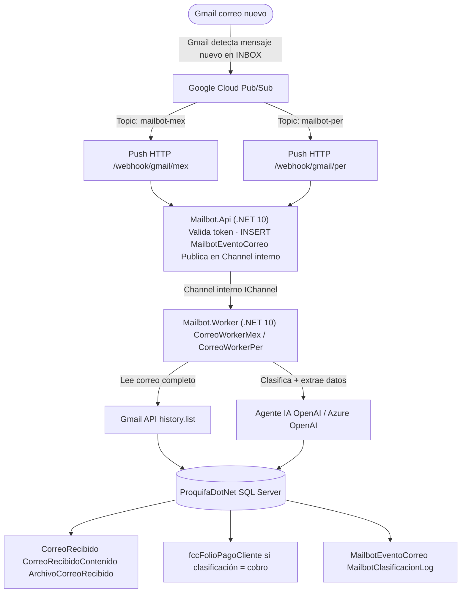
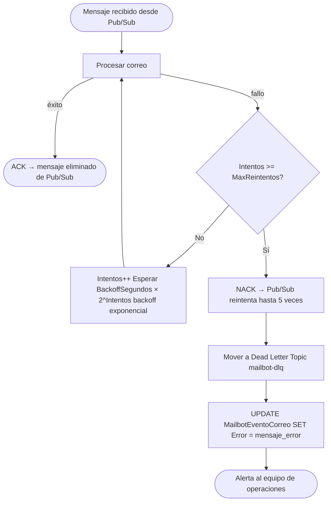
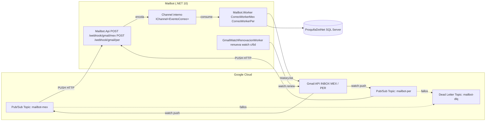

# Propuesta 2 — Mailbot Worker .NET 10 con Gmail Push Notifications (Google Cloud Pub/Sub)

| Campo | Valor |
|-------|-------|
| **Requisito** | R16A-RE-FU-008-v2 |
| **Base de Datos** | ProquifaDotNet |
| **Versión** | 1.0 |
| **Fecha** | 2026-06-02 |

---

## Resumen

Rediseño del Mailbot actual (Framework 4.8 + Tarea Windows) usando:

- **Gmail API (watch)** para suscribirse a notificaciones push de correos nuevos
- **Google Cloud Pub/Sub** como canal de entrega de los eventos
- **Mailbot.Api** (.NET 10 Minimal API) como endpoint receptor de las notificaciones
- **Mailbot.Worker** (.NET 10) que procesa cada correo, clasifica con IA y persiste en BD

---

## Flujo General



---

## Componentes de la Solución

| Componente          | Tecnología                             | Responsabilidad                                           |
| ------------------- | -------------------------------------- | --------------------------------------------------------- |
| Notificación push   | Gmail API watch + Google Cloud Pub/Sub | Notifica al sistema cuando llega un correo nuevo          |
| Receptor de eventos | Mailbot.Api (.NET 10 Minimal API)      | Recibe el push de Pub/Sub y encola internamente           |
| Cola interna        | System.Threading.Channels (.NET)       | Desacopla recepción HTTP del procesamiento del Worker     |
| Worker              | Mailbot.Worker (.NET 10)               | Lee correo de Gmail API, clasifica con IA, persiste en BD |
| Clasificador IA     | OpenAI / Azure OpenAI                  | Clasifica correo y extrae datos según tipo                |
| Persistencia        | SQL Server — ProquifaDotNet            | Almacena correos, clasificaciones y pendientes            |
| Renovación watch    | Background Service en Worker           | Renueva el watch de Gmail cada 6 días automáticamente     |

---

## Arquitectura de la Solución .NET 10

```
MailbotWorker.sln
│
├── Mailbot.Worker
│     Program.cs                          ← Host builder, DI, configuración
│     Workers/
│       CorreoWorker.cs                   ← IHostedService: consume Channel interno
│       CorreoWorkerMex.cs                ← Worker especializado Región MEX
│       CorreoWorkerPer.cs                ← Worker especializado Región PER
│       GmailWatchRenovacionWorker.cs     ← renueva watch cada 6 días
│
├── Mailbot.Api
│     Program.cs                          ← Minimal API
│     Endpoints/
│       WebhookGmailEndpoints.cs          ← POST /webhook/gmail/{region}
│       HealthEndpoints.cs                ← GET /health, GET /metrics
│       ReentrenamientoEndpoints.cs       ← POST /reentrenamiento/trigger
│     Middleware/
│       PubSubTokenValidationMiddleware.cs ← valida Bearer token de Google
│
├── Mailbot.Application
│     UseCases/
│       ProcesarCorreoUseCase.cs          ← orquesta clasificación y persistencia
│       GenerarPendienteUseCase.cs        ← crea fccFolioPagoCliente para cobros
│       RenovarGmailWatchUseCase.cs       ← llama Gmail API watch.renew
│     DTOs/
│       PubSubNotificacionDto.cs          ← payload del push de Google
│       EventoCorreoDto.cs                ← evento interno entre Api y Worker
│       ResultadoClasificacionDto.cs      ← respuesta del Agente IA
│
├── Mailbot.Domain
│     Entities/
│       CorreoRecibido.cs
│       ClasificacionCorreo.cs
│       EventoCorreo.cs
│     Interfaces/
│       IClasificadorAgente.cs            ← contrato del Agente IA
│       ICorreoRepository.cs
│       IEventoChannel.cs                 ← contrato del Channel interno
│
├── Mailbot.Infrastructure
│     Gmail/
│       GmailService.cs                   ← lee correo completo vía Gmail API
│       GmailWatchService.cs              ← gestiona watch.create y watch.stop
│     Channels/
│       EventoCorreoChannel.cs            ← implementa IEventoChannel con Channel<T>
│     IA/
│       OpenAIClasificadorAgente.cs       ← implementa IClasificadorAgente
│       PromptBuilder.cs                  ← construye prompts desde archivos .txt
│     Prompts/
│       clasificacion_correo.txt          ← prompt editable sin recompilar
│       extraccion_cobro.txt
│       extraccion_pedido.txt
│       extraccion_cotizacion.txt
│     Persistence/
│       ProquifaDbContext.cs              ← EF Core Scaffold ProquifaDotNet
│       Repositories/
│         CorreoRepository.cs
│         PendienteRepository.cs
│
└── Mailbot.Tests
      Unit/
        ProcesarCorreoUseCaseTests.cs
        ClasificadorAgenteTests.cs
        WebhookGmailEndpointTests.cs
      Integration/
        GmailWatchServiceTests.cs
        ProquifaDbContextTests.cs
```

---

## Configuración Gmail API Watch

### Registro del Watch por Región

```http
POST https://gmail.googleapis.com/gmail/v1/users/{userId}/watch
Authorization: Bearer {OAuth2_token}
Content-Type: application/json
```

**MEX:**
```json
{
  "topicName": "projects/proquifa-prod/topics/mailbot-mex",
  "labelIds": ["INBOX"],
  "labelFilterAction": "include"
}
```

**PER:**
```json
{
  "topicName": "projects/proquifa-prod/topics/mailbot-per",
  "labelIds": ["INBOX"],
  "labelFilterAction": "include"
}
```

> ⚠️ **Renovación obligatoria:** El watch expira cada 7 días. `GmailWatchRenovacionWorker` lo renueva automáticamente cada 6 días. Monitorear `WatchExpiration` en `RegionConfiguracionMailBot`.

### Configuración Google Cloud Pub/Sub

```
Topics:
  mailbot-mex   ← recibe notificaciones de INBOX MEX
  mailbot-per   ← recibe notificaciones de INBOX PER
  mailbot-dlq   ← mensajes fallidos para revisión

Subscriptions (Push):
  mailbot-mex-push
    Topic:                 mailbot-mex
    Tipo:                  PUSH
    Endpoint:              https://mailbot.proquifa.mx/webhook/gmail/mex
    Ack deadline:          60 segundos
    Max delivery attempts: 5
    Dead letter topic:     mailbot-dlq

  mailbot-per-push
    Topic:                 mailbot-per
    Tipo:                  PUSH
    Endpoint:              https://mailbot.proquifa.mx/webhook/gmail/per
    Ack deadline:          60 segundos
    Max delivery attempts: 5
    Dead letter topic:     mailbot-dlq

Permisos requeridos en GCP:
  gmail-api@proquifa-prod.iam.gserviceaccount.com
    roles/pubsub.publisher  (en ambos topics)
```

---

## Payload del Push de Google Cloud Pub/Sub

```http
POST /webhook/gmail/mex
Authorization: Bearer {google-push-token}
Content-Type: application/json
```

```json
{
  "message": {
    "data": "eyJlbWFpbEFkZHJlc3MiOiJtYWlsYm90QHByb3F1aWZhLm14IiwiaGlzdG9yeUlkIjoiMTIzNDUifQ==",
    "messageId": "abc123",
    "publishTime": "2025-01-15T10:00:00Z"
  },
  "subscription": "projects/proquifa-prod/subscriptions/mailbot-mex-push"
}
```

`data` decodificado (base64):
```json
{
  "emailAddress": "mailbot@proquifa.mx",
  "historyId": "12345"
}
```

> Con `historyId` el Worker llama `Gmail API history.list` para obtener los mensajes nuevos.

---

## Configuración `appsettings.json`

```json
{
  "Gmail": {
    "CredentialsPath": "/secrets/gmail_credentials.json",
    "TokenPath": "/secrets/gmail_token/",
    "WatchRenovacionDias": 6
  },
  "PubSub": {
    "ProjectId": "proquifa-prod",
    "PushValidationToken": "*** reemplazar con secret ***",
    "Topics": {
      "MEX": "mailbot-mex",
      "PER": "mailbot-per"
    },
    "WebhookEndpoints": {
      "MEX": "/webhook/gmail/mex",
      "PER": "/webhook/gmail/per"
    }
  },
  "IA": {
    "Provider": "AzureOpenAI",
    "Endpoint": "https://tu-recurso.openai.azure.com/",
    "ApiKey": "*** reemplazar con secret ***",
    "DeploymentName": "gpt-4o",
    "MaxTokens": 2000,
    "Temperature": 0.1
  },
  "ConnectionStrings": {
    "ProquifaDotNet": "Server=RYNL010;Database=ProquifaDotNet;..."
  },
  "Worker": {
    "MaxReintentos": 3,
    "BackoffSegundosBase": 5,
    "ChannelCapacity": 100
  }
}
```

> ⚠️ **Seguridad:** `ApiKey`, `PushValidationToken` y `ConnectionString` deben gestionarse vía Azure Key Vault, Google Secret Manager o variables de entorno del host. **Nunca** almacenar credenciales en `appsettings.json` en el repositorio.

---

## Scaffold EF Core — Tablas ProquifaDotNet

```bash
# Comando scaffold desde Mailbot.Infrastructure
dotnet ef dbcontext scaffold \
  "Server=RYNL010;Database=ProquifaDotNet;..." \
  Microsoft.EntityFrameworkCore.SqlServer \
  --output-dir Persistence/Entities \
  --context ProquifaDbContext \
  --tables \
    RegionConfiguracionMailBot \
    CorreoRecibido \
    CorreoRecibidoContenido \
    CorreoRecibidoCliente \
    CorreoRecibidoEstatus \
    ArchivoCorreoRecibido \
    catClasificacionCorreoRecibido \
    catProceso \
    catDominioCorreoRecibidoPendiente \
    fccFolioPagoCliente \
    Region \
    MailbotEventoCorreo \
    MailbotClasificacionLog \
  --no-onconfiguring \
  --force
```

---

## Cambio en `RegionConfiguracionMailBot`

**Propósito:** Agregar columnas para gestionar el watch de Gmail y su expiración.

```sql
ALTER TABLE dbo.RegionConfiguracionMailBot
    ADD PubSubTopic     varchar(300) NULL,
        WatchHistoryId  varchar(50)  NULL,
        WatchExpiration datetime     NULL;
```

| Columna nueva | Tipo | Descripción |
|---------------|------|-------------|
| `PubSubTopic` | varchar(300) | Nombre completo del topic GCP (ej. `projects/proquifa-prod/topics/mailbot-mex`) |
| `WatchHistoryId` | varchar(50) | Último `historyId` registrado — punto de partida para `history.list` |
| `WatchExpiration` | datetime | Fecha de expiración del watch activo — trigger de renovación |

---

## Tablas BD Nuevas Requeridas

### `MailbotEventoCorreo`

**Propósito:** Registro de cada notificación Pub/Sub recibida. Permite trazabilidad, reintentos y detección de duplicados (idempotencia por `IdentificadorCorreoGmail`).

```sql
CREATE TABLE dbo.MailbotEventoCorreo (
    IdMailbotEventoCorreo    uniqueidentifier NOT NULL
        CONSTRAINT PK_MailbotEventoCorreo PRIMARY KEY CLUSTERED
        CONSTRAINT DF_MailbotEventoCorreo_Id DEFAULT (NEWID()),
    IdRegion                 uniqueidentifier NOT NULL
        CONSTRAINT FK_MailbotEventoCorreo_Region
            FOREIGN KEY REFERENCES dbo.Region(IdRegion),
    IdentificadorCorreoGmail varchar(200)     NOT NULL,
    PubSubMessageId          varchar(200)     NULL,
    HistoryId                varchar(50)      NULL,
    CorreoEmisor             varchar(180)     NULL,
    Asunto                   varchar(350)     NULL,
    FechaEvento              datetime         NOT NULL,
    Procesado                bit              NOT NULL
        CONSTRAINT DF_MailbotEventoCorreo_Procesado DEFAULT (0),
    FechaProcesado           datetime         NULL,
    Intentos                 int              NOT NULL
        CONSTRAINT DF_MailbotEventoCorreo_Intentos DEFAULT (0),
    Error                    varchar(MAX)     NULL,
    FechaRegistro            datetime         NOT NULL
        CONSTRAINT DF_MailbotEventoCorreo_FechaRegistro DEFAULT (GETDATE()),
    FechaUltimaActualizacion datetime         NOT NULL
        CONSTRAINT DF_MailbotEventoCorreo_FechaActualizacion DEFAULT (GETDATE()),
    Activo                   bit              NOT NULL
        CONSTRAINT DF_MailbotEventoCorreo_Activo DEFAULT (1)
);

-- Índice único para detección de duplicados (idempotencia)
CREATE UNIQUE NONCLUSTERED INDEX UIX_MailbotEventoCorreo_Gmail
    ON dbo.MailbotEventoCorreo (IdentificadorCorreoGmail, IdRegion)
    WHERE Activo = 1;

CREATE NONCLUSTERED INDEX IX_MailbotEventoCorreo_Pendientes
    ON dbo.MailbotEventoCorreo (Procesado, Intentos) WHERE Procesado = 0;
```

### `MailbotClasificacionLog`

**Propósito:** Auditoría de clasificaciones del Agente IA para reentrenamiento.

```sql
CREATE TABLE dbo.MailbotClasificacionLog (
    IdMailbotClasificacionLog uniqueidentifier NOT NULL
        CONSTRAINT PK_MailbotClasificacionLog PRIMARY KEY CLUSTERED
        CONSTRAINT DF_MailbotClasificacionLog_Id DEFAULT (NEWID()),
    IdMailbotEventoCorreo     uniqueidentifier NOT NULL
        CONSTRAINT FK_MailbotClasificacionLog_Evento
            FOREIGN KEY REFERENCES dbo.MailbotEventoCorreo(IdMailbotEventoCorreo),
    IdCorreoRecibido          uniqueidentifier NULL
        CONSTRAINT FK_MailbotClasificacionLog_Correo
            FOREIGN KEY REFERENCES dbo.CorreoRecibido(IdCorreoRecibido),
    ClasificacionIA           varchar(150)     NOT NULL,
    Confianza                 decimal(5,2)     NULL,
    ClasificacionFinal        varchar(150)     NULL,
    EsCorrecta                bit              NULL,
    ModeloVersion             varchar(50)      NULL,
    PromptTokens              int              NULL,
    CompletionTokens          int              NULL,
    FechaRegistro             datetime         NOT NULL
        CONSTRAINT DF_MailbotClasificacionLog_FechaRegistro DEFAULT (GETDATE()),
    Activo                    bit              NOT NULL
        CONSTRAINT DF_MailbotClasificacionLog_Activo DEFAULT (1)
);
```

---

## Lógica de Reintentos



| Intento | Espera |
|:-------:|--------|
| 1 | 5 segundos |
| 2 | 10 segundos |
| 3 | 20 segundos |
| 4+ | Dead Letter Topic (Pub/Sub) |

---

## Cambios BD Requeridos

| # | Paso | Script | Prioridad |
|:-:|------|--------|:---------:|
| 1 | `ALTER TABLE RegionConfiguracionMailBot` | Script sección Cambio RegionConfiguracionMailBot | 🔴 Alta |
| 2 | `CREATE TABLE MailbotEventoCorreo` | Script sección Tablas Nuevas | 🔴 Alta |
| 3 | `CREATE TABLE MailbotClasificacionLog` | Script sección Tablas Nuevas | 🔴 Alta |
| 4 | Renombrar `'Pago'` → `'Cobro'` en `catClasificacionCorreoRecibido` | `UPDATE Clave='pago'` | 🔴 Alta |
| 5 | `INSERT` proceso `'Cobros'` en `catProceso` | `INSERT INTO catProceso` | 🔴 Alta |

---

## Ventajas y Desventajas de esta Propuesta

| Aspecto               | Ventaja                                                        | Desventaja                                                |
| --------------------- | -------------------------------------------------------------- | --------------------------------------------------------- |
| Latencia              | Muy baja (~1-2 segundos tras recibir correo)                   | Depende de disponibilidad de Google Cloud                 |
| Infraestructura       | Sin RabbitMQ ni n8n; solo Google Cloud Pub/Sub                 | Requiere cuenta GCP y configuración de IAM                |
| Costo                 | Pub/Sub gratuito hasta 10 GB/mes; sin costo extra de licencias | Costo de Google Cloud si supera tier gratuito             |
| Complejidad operativa | Menor que Propuesta 1 (sin n8n ni RabbitMQ)                    | Watch expira cada 7 días — requiere renovación automática |
| Escalabilidad         | Alta — múltiples suscriptores al mismo topic                   | Endpoint público HTTPS requerido (certificado SSL)        |
| Nativo Google         | Integración directa con Gmail sin intermediario                | Acoplamiento a ecosistema Google Cloud                    |

---

## Diagrama de Infraestructura



---

## Comparativa Propuesta 1 vs Propuesta 2

| Criterio | Propuesta 1 (n8n + RabbitMQ) | Propuesta 2 (Gmail Push) |
|----------|:----------------------------:|:------------------------:|
| Componentes adicionales | n8n + RabbitMQ + Worker | Solo Google Cloud Pub/Sub |
| Latencia | Segundos (polling n8n) | 1-2 segundos (push nativo) |
| Costo infra | Licencia n8n + RabbitMQ server | Cuenta GCP (tier gratuito generoso) |
| Complejidad config | Alta (n8n workflow + queues) | Media (watch + PubSub + IAM) |
| Mantenimiento | Watch n/a; DLQ en RabbitMQ | Watch expira c/7d; DLQ en Pub/Sub |
| Endpoint público | No requerido | ✅ HTTPS público requerido |
| Dependencia externa | n8n + Google | Solo Google |
| Escalabilidad | Alta | Alta |
| Recomendado cuando | Ya se usa n8n en la empresa | Se prefiere menos infraestructura |

---

## Gaps y Pendientes

| # | Gap | Descripción | Acción |
|:-:|-----|-------------|--------|
| 1 | Cuenta GCP | Definir proyecto y permisos IAM en Google Cloud | Confirmar con IT |
| 2 | Endpoint público HTTPS | Mailbot.Api debe ser accesible desde internet | Confirmar con infraestructura (dominio + SSL) |
| 3 | Renovación del watch | Proceso automático cada 6 días debe ser monitoreado | Alertas si renovación falla |
| 4 | Modelo IA | OpenAI vs Azure OpenAI vs modelo propio | Definir según costo y privacidad |
| 5 | Cliente no identificado | Correos sin cliente asignado — ¿quién los atiende? | Confirmar con cliente |
| 6 | Clasificación `'Pago'` en uso | Verificar registros activos antes de renombrar | `SELECT COUNT(*) WHERE Clave='pago'` |
| 7 | Prompt base del Agente | Texto de clasificación y extracción por tipo | Redactar con equipo de negocio |
| 8 | Credenciales Gmail multi-cuenta | Una cuenta por región (MEX/PER) con OAuth2 | Confirmar cuentas con IT |

---

**Versión:** 1.0 — Propuesta 2: Gmail Push Notifications + Google Cloud Pub/Sub + Worker .NET 10  
**Base de Datos:** ProquifaDotNet  
**Referencia:** `R16A-RE-FU-008-v2_Diccionario_Datos.md`
