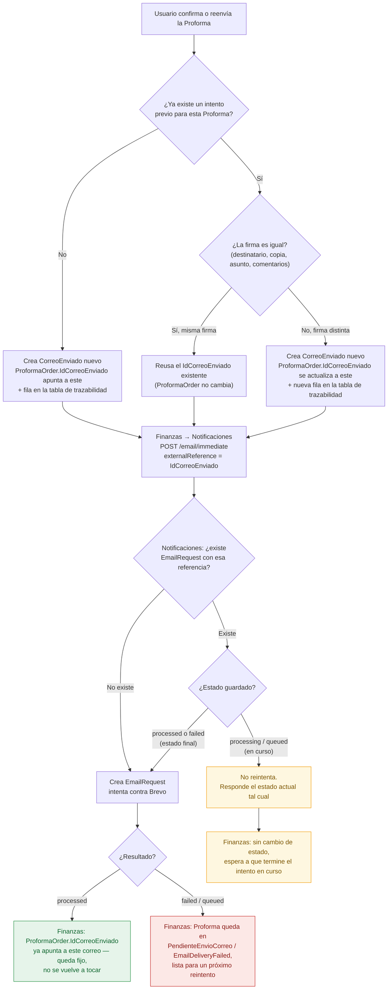

# Reintentos de envío de correo — Acuerdo Finanzas × Notificaciones

**Fecha:** 2026-09-10
**Participantes:** Finanzas (Javier), Osmar Calderón (Notificaciones) y David (Lider de proyecto)
**Motivo:** Al reintentar la confirmación de una Proforma con el mismo `externalReference`
(el `IdCorreoEnviado`), Notificaciones no volvía a intentar el envío — devolvía el desenlace
guardado del primer intento, aunque la causa original del fallo ya estuviera resuelta. Este
documento registra cómo va a funcionar el reintento de ahora en adelante, en ambos lados.

---

## Contexto — el caso que destapó esto

Una sola Proforma, dos intentos de confirmación, el mismo error las dos veces — pero no por la
misma razón:

1. **Primera confirmación de la Proforma.** Todo el flujo corre bien hasta el envío del correo.
   Notificaciones responde `503`: la plantilla `PROFORMA_CONFIRMACION_MEX` no está registrada
   (`NTF-010`).
2. **Se resuelve la causa.** Se crea la plantilla en Brevo con los parámetros esperados y se da
   de alta el registro correspondiente en la base de datos de Notificaciones.
3. **Se reintenta el mismo pedido.** Misma Proforma, mismo botón de confirmar. El resultado es
   idéntico al primer intento: `503 NTF-010`, "plantilla no registrada" — a pesar de que ya
   existe.
4. **Se investiga el código de Notificaciones, con Osmar.** El segundo intento nunca vuelve a
   intentar el envío: como reutiliza el mismo `externalReference` del primero, Notificaciones lo
   trata como una solicitud ya resuelta y devuelve el estado que tenía guardado, sin tocar la
   plantilla ni a Brevo. La causa raíz no era la plantilla — era que **un `externalReference`
   repetido nunca dispara un reintento real**, sin importar si lo que la bloqueaba ya se arregló.

Esto expuso que no había una definición clara de cuándo un reintento debe volver a intentar el
envío de verdad y cuándo debe limitarse a devolver lo que ya se sabe — ni del lado de Finanzas
(qué `IdCorreoEnviado` mandar) ni del lado de Notificaciones (cuándo repetir el intento contra
Brevo). Lo que sigue es el acuerdo para cerrar esa brecha.

---

## Reglas acordadas

### Del lado de Finanzas

Se va a crear una tabla nueva de relación que permita asociar los distintos correos enviados
a lo largo del tiempo con una misma Proforma (una Proforma puede tener más de un intento de
envío, cada uno con su propio `IdCorreoEnviado`).

1. **Reenvío con la misma firma** (mismo destinatario, misma copia, mismo asunto, mismos
   comentarios adicionales) → se reintenta el **mismo correo**: se le manda a Notificaciones
   el mismo `IdCorreoEnviado` de siempre.
2. **Reenvío con la firma modificada** (cambia el asunto, los comentarios, o alguna dirección
   de destinatario/copia) → se genera un **`IdCorreoEnviado` nuevo** y se manda a Notificaciones
   como un `externalReference` distinto — Notificaciones lo trata como una solicitud nueva y la
   intenta. Este nuevo correo se registra/asocia a la Proforma en la tabla de relación nueva,
   para mantener la traza completa de todos los correos que se intentaron para esa Proforma.
3. **`ProformaOrder` sigue guardando su propio `IdCorreoEnviado`, tal como hoy** — apunta al
   correo que se está intentando mientras no haya éxito, y se actualiza a cada intento nuevo
   hasta que uno sale bien, momento en el que esa asociación queda fija (el mismo comportamiento
   de siempre, sin cambios). La tabla de relación nueva **no reemplaza esa columna** — es
   puramente una bitácora: registra cada `IdCorreoEnviado` que existió para esa Proforma a lo
   largo del tiempo, para tener la traza completa de todos los intentos, exitosos o no.

### Del lado de Notificaciones

Notificaciones **siempre va a reintentar el envío**, aun cuando sea un reintento, con estas
reglas:

1. Si un correo con el mismo `externalReference` **ya se envió correctamente antes**
   (`processed`), igual se vuelve a intentar — la referencia repetida ya no implica "no hacer
   nada".
2. **Solo se reintenta cuando el estado guardado es un estado final** — `processed` (enviado) o
   `failed` (fallido). Sobre esos dos, cualquier repetición dispara un intento real contra
   Brevo.
3. Si el estado guardado es **`processing`/`queued`** (en proceso/encolado), Notificaciones
   **no reintenta** — devuelve el estado actual tal cual. Esto es para no duplicar un envío que
   todavía está en curso y cuyo resultado no se conoce aún.

---

## El flujo completo

**Lectura del diagrama:** la decisión de si Notificaciones reintenta de verdad depende **solo**
del estado guardado bajo esa referencia — `processing`/`queued` nunca se reintenta (para no
duplicar algo en curso), `processed`/`failed` siempre se reintenta ahora. Del lado de Finanzas,
la decisión de si se reutiliza el `IdCorreoEnviado` o se genera uno nuevo depende **solo** de si
la firma del correo (destinatario/copia/asunto/comentarios) cambió entre un intento y el
siguiente.

---

## Esquema propuesto para la tabla de relación (Finanzas)

**Simplificado 2026-09-10:** la tabla es solo de referencia/trazabilidad — no es la que decide
qué correo tiene asociado la Proforma. Esa decisión la sigue llevando
`ProformaOrder.IdCorreoEnviado` directamente, igual que hoy. Boceto para discutir, no definitivo
— nombres y tipos exactos se definen al implementar.

| Columna | Tipo | Nota |
| :---- | :---- | :---- |
| `Id` | `uniqueidentifier` | PK de la tabla de relación |
| `ProformaOrderId` | `uniqueidentifier` | FK a `tpProformaPedido` |
| `SentEmailId` (`IdCorreoEnviado`) | `uniqueidentifier` | FK a `CorreoEnviado` — un intento de envío concreto |
| `CreatedAt` · `UpdatedAt` · `IsActive` | `datetime2` · `datetime2` · `bit` | Campos de control del estándar |

Una fila por cada `IdCorreoEnviado` distinto que se generó para esa Proforma — la reutilización
de un `IdCorreoEnviado` (misma firma) no agrega fila nueva, solo se vuelve a mandar el mismo.
Sin flag de "vigente": eso ya lo dice `ProformaOrder.IdCorreoEnviado` sin necesidad de
duplicarlo acá.

---

## Puntos a confirmar antes de implementar

- ~~Duplicado deliberado.~~ **Aclarado 2026-09-10:** operativamente esto nunca ocurre de forma
  automática — una vez que el correo se envía con éxito el flujo avanza y `/confirm` (con su
  envío de correo) deja de estar disponible para esa Proforma. El reenvío con la misma firma
  sobre un correo ya `processed` solo se da en un caso **manual**, donde alguien decide a
  propósito volver a mandar un correo que ya había salido antes. Es la función buscada, no un
  efecto secundario.
- ~~Definición exacta de "misma firma".~~ **Aclarado 2026-09-10:** comparación **literal** —
  sin normalizar mayúsculas/minúsculas ni espacios. Cualquier diferencia de texto en
  destinatario, copia, asunto o comentarios cuenta como firma distinta y genera un
  `IdCorreoEnviado` nuevo.
