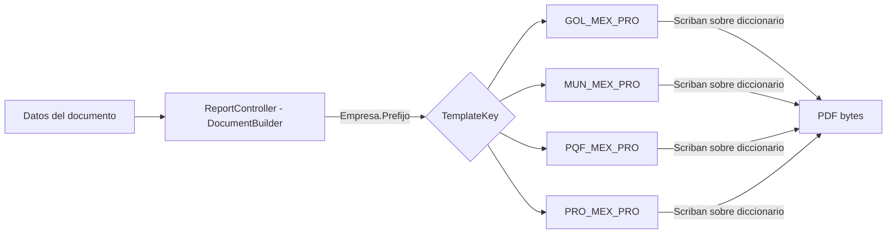

# **Diseño de la solución**

## Requisito R16A-RE-FU-016 — Proforma México

**Maquetación del PDF de Proforma en Document Builder (familia de plantillas _PRO)**

| FORMATO | Arquitectura |
| :---- | :---- |
| **PROYECTO** | R16 - Adquisiciones |
| **REFERENCIA** | AUI-FOR-01 |
| **VERSIÓN** | 1.6 |
| **FECHA** | 13 jul 2026 |
| **AUTOR** | [Jose Armando Santiago Lorenzo](mailto:jose.santiago@ryndem.mx) |
| **REVISOR** | [Alan Fernandez Garcia](mailto:alan.garcia@ryndem.mx) |

# **Importante**

Posterior a este diseño, ¿cómo saber si el diseño de la solución al requisito está completo para que el programador inicie con el desarrollo?
Hazte estas preguntas rápidas:

* ¿El programador sabe qué flujo implementar?
* ¿Sabe qué pasa si algo falla?
* ¿Sabe qué reglas no puede romper?
* ¿Sabe qué pruebas debe pasar?
* ¿Sabe dónde impacta?

*Nota: Este documento es una propuesta basada en el estándar IEEE 1016 "Software Design Description" que va permitir abarcar los puntos más importantes para el diseño del requisito que se está trabajando. Se debe administrar el tiempo que se tiene de diseño para que se complete de la mejor manera considerando todos los detalles técnicos.*

# **1. Introducción**

## **1.1 Propósito del documento**

El propósito de este documento es definir el diseño de la solución técnica para la maquetación del PDF de Proforma México (R16A-RE-FU-016) en el motor de renderizado DocumentBuilder-R14: la creación de una familia de plantilla _PRO por cada empresa emisora del grupo PROQUIFA México, y las secciones visuales que componen el documento.

**Nota:** este documento se enfoca en el diseño visual del PDF (maqueta HTML/CSS/Scriban en Document Builder). La generación del contrato de datos, el foliador, la persistencia y los endpoints son responsabilidad del Back-end y no se rediseñan aquí. La plantilla es render puro: no contiene lógica de negocio, imprime literalmente lo que llega en el diccionario de datos.

## **1.2 Alcance**

### **Específicamente incluye:**

* Creación de **4 familias de plantilla _PRO** en DocumentBuilder-R14/API/Resources/Templates/: GOL_MEX_PRO (Golocaer), MUN_MEX_PRO (Mungen), PQF_MEX_PRO (Proveedora Químico Farmacéutica) y PRO_MEX_PRO (Proquifa) — nótese que PQF = Proveedora Químico Farmacéutica y PRO = Proquifa, no al revés. Cada familia tiene sus piezas _H (header) / _B (body) / _F (footer), siguiendo la convención ya usada por las familias _COT (Cotización) y _PED (Pedido).
* Maquetación HTML/CSS de las **8 secciones visuales** del documento: cabecera, proforma/disclaimer/vigencia, cliente, entrega, tabla de partidas, referencias bancarias, pago y pie legal — verificadas contra los mockups reales por empresa.
* Reutilización de las convenciones CSS y de paginación ya probadas en _COT/_PED (documentos multi-página), **sin modificar el motor de render compartido** RenderDocumentService.

### **No se consideran:**

* El diseño **Back-end** de RE-FU-016: la generación del contrato de datos, el foliador, la persistencia, los endpoints y la lógica de armado del documento — responsabilidad del equipo de Back-end.
* **Proforma Perú (RE-FU-017)** — plantillas _PE_PRO y DIS propios; se documenta aparte.
* La aprobación final del diseño visual (ver nota destacada al final de esta sección).

**Precondición del diseño:** la maquetación en código de la familia de plantillas _PRO inicia una vez autorizadas las propuestas de diseño (mockups). La maqueta se construye sobre los mockups aprobados.

# **2. Visión general del diseño**

## **2.1 Objetivo técnico**

Definir la maquetación del PDF de Proforma México en el motor DocumentBuilder-R14, creando una familia de plantilla _PRO por empresa emisora del grupo PROQUIFA México que reproduzca fielmente el documento a partir de los datos que recibe, **sin modificar el motor de render compartido** ni introducir lógica de negocio en la plantilla. La plantilla imprime literalmente los valores que recibe (render puro), lo que permite maquetar y probar con datos dummy sin depender del backend, y desacopla la maqueta de reglas como la selección de banco por empresa.

## **2.2 Componentes involucrados**

El entregable de este diseño vive en DocumentBuilder-R14: las 4 familias de plantilla _PRO (GOL/MUN/PQF/PRO_MEX_PRO), entregable central de esta maqueta. El resto de los componentes ya existen y se reutilizan sin cambios.

| Aplicativo | Componente | Responsabilidad | Ubicación |
| :---- | :---- | :---- | :---- |
| DocumentBuilder-R14 | ReportController | Selecciona la familia por TemplateKey e invoca el render | DocumentBuilder-R14/API/Controllers/ReportController.cs (existente, se reutiliza) |
| DocumentBuilder-R14 | RenderDocumentService (Scriban) | Rellena el HTML de la plantilla con el diccionario de datos y produce el PDF | DocumentBuilder-R14/Application/Services/Pdf/RenderDocumentService.cs (existente, se reutiliza) |
| DocumentBuilder-R14 | **Familia de plantilla _PRO** | HTML/CSS/Scriban _H/_B/_F por empresa que define el aspecto del PDF | DocumentBuilder-R14/API/Resources/Templates/<PREFIJO>_MEX_PRO/ (**entregable central**) |

El entregable central de este diseño son las 4 familias _PRO; el motor de render (RenderDocumentService) y el ReportController ya existen y se reutilizan sin cambios.

# **3. Diseño funcional detallado**

## **3.1 Flujo 1 — Render de la plantilla _PRO (previsualización)**

Ruta de render de la plantilla, a nivel de componente de DocumentBuilder:

1. ReportController resuelve la familia de plantilla con GetTemplate(TemplateKey), donde TemplateKey = <PREFIJO>_MEX_PRO derivado **únicamente** de Empresa.Prefijo.
2. La consulta retorna los nombres de archivo _H / _B / _F de la familia registrada.
3. RenderDocumentService (Scriban) rellena el HTML _H+_B+_F con los datos materializados como diccionario (Dictionary<string,object>) y produce el PDF.
4. El PDF (application/pdf) se entrega ya renderizado.

**Puntos clave de la maqueta:**

* El render trabaja sobre un diccionario genérico (Dictionary<string,object>), **no** sobre un tipo fuerte — la plantilla Scriban puede probarse con datos dummy sin esperar al backend.
* La selección de familia (TemplateKey) depende **solo** de Empresa.Prefijo, nunca del banco ni del producto.

## **3.2 Flujo 2 — Variantes de estado sobre la misma plantilla**

La misma familia _PRO se usa para la previsualización, el documento definitivo y la consulta histórica; solo cambian los valores que recibe. La plantilla no distingue el estado: pinta lo que llega. La única diferencia visible entre previsualización y documento definitivo son los valores del folio (Header.Folio) y del pedido interno (DeliveryInfo.InternalOrderNumber); el layout y las 8 secciones son idénticos en ambos estados.

## **3.3 Criterios de aceptación del requisito**

Criterios de aceptación tomados de la matriz de requisitos (secciones A–J).

| CA | Descripción | Estado | Justificación |
| :---- | :---- | :---- | :---- |
| A1 | Dado que el sistema muestra la cabecera del documento, Cuando incluye el logo, Entonces deberá mostrar el logo correspondiente a la empresa emisora del pedido. | Cubierto |  |
| A2 | Dado que el sistema muestra la cabecera, Cuando incluye el disclaimer legal, Entonces deberá mostrar el texto fijo: "ESTE ES UN DOCUMENTO INFORMATIVO PREVIO A LA EMISIÓN DE UN CFDI. CARECE DE VALIDEZ FISCAL SEGÚN ART.29 Y 29A CFF". | Cubierto |  |
| A3 | Dado que el sistema muestra la cabecera, Cuando incluye el título del documento, Entonces deberá mostrar el texto "Proforma". | Cubierto |  |
| A4 | Dado que el sistema muestra la cabecera, Cuando incluye el folio del documento, Entonces deberá mostrar el folio con formato "PRF-MMDDAA-Consecutivo" (ejemplo: "PRF-031826-691"). El consecutivo corresponde al foliador global lineal PQF2. *Resuelto (DUDA-031/DUDA-032): el folio se consume al confirmar el envío exitoso (sin huecos) y el prefijo "PRF-" es solo visual, no se persiste en BD.* | Cubierto |  |
| A5 | Dado que el sistema muestra la cabecera, Cuando incluye el campo Vigencia, Entonces deberá mostrar la fecha de vigencia en formato DD/MM/YYYY. *Resuelto (DUDA-033): 30 días naturales a partir de la generación.* | Cubierto |  |
| B1 | Dado que el sistema muestra la sección Cliente, Cuando incluye el identificador del cliente, Entonces deberá mostrar la Razón Social del cliente desde el Catálogo de Clientes. *Resuelto (DUDA-034): el dato fuente es la Razón Social, no el Alias.* | Cubierto |  |
| C1 | Dado que el sistema muestra la tabla de partidas, Cuando incluye los datos por cada partida, Entonces deberá mostrar: número consecutivo, cantidad, descripción (catálogo + descripción + marca), precio unitario con moneda, e importe calculado (cantidad × precio). Todos los datos provienen del Pedido. | Cubierto |  |
| D1 | Dado que el sistema incluye los cálculos fiscales, Cuando muestra las líneas de monto, Entonces deberá mostrar: "Sub-Total" con monto y moneda; "IVA" con tasa aplicable al pedido (0%, 16%, etc.) y monto calculado; "Gran Total" con monto, suma de Sub-Total e IVA. La moneda aplicada es la moneda de facturación del cliente desde el Catálogo (no la moneda del pedido). | Cubierto |  |
| D2 | Dado que el sistema muestra la conversión a letras del Gran Total, Cuando incluye la leyenda monetaria, Entonces deberá mostrar el monto en palabras según la moneda: si moneda = pesos mexicanos: "(XXX PESOS XX/100 M.N.)"; si moneda = dólares: "(XXX DOLARES XX/100)"; otras monedas: nomenclatura correspondiente. | Cubierto |  |
| D3 | Dado que la moneda de facturación del cliente NO es pesos mexicanos, Cuando el sistema muestra la sección de pago, Entonces deberá mostrar el tipo de cambio aplicado a la conversión. El tipo de cambio es el del día de generación. | Cubierto |  |
| D4 | Dado que el sistema muestra la sección de pago, Cuando incluye las condiciones, Entonces deberá mostrar las condiciones de pago aplicables al cliente (ejemplo: "PREPAGO 100%"), provenientes de la configuración del cliente en el Catálogo. | Cubierto |  |
| D5 | Dado que el sistema muestra el final de la sección de pago, Cuando incluye la leyenda de exhibición, Entonces deberá mostrar el texto "PAGO EN UNA SOLA EXHIBICIÓN" como leyenda fiscal obligatoria SAT. *Resuelto (DUDA-035): la leyenda es fija para toda Proforma, el esquema Prepago siempre asume PUE.* | Cubierto |  |
| E1 | Dado que el sistema muestra la sección de datos bancarios, Cuando arma el contenido, Entonces deberá mostrar las dos cuentas activas más recientes (por Fecha de última actualización) de la empresa que factura, independientemente de la moneda del pedido; si solo existe una cuenta activa, se muestra únicamente esa. Los campos por cuenta son: Moneda, Banca, Sucursal, Cuenta, CLABE y REF. CLIENTE. | Cubierto |  |
| E2 | Dado que el sistema muestra la REF. CLIENTE de cada cuenta, Cuando construye el valor, Entonces deberá aplicar la lógica documentada del Código Validador: cuenta Banamex con concatenación de 7 segmentos basados en nombre del cliente, clave, código del banco, moneda y CodValidador; cuenta no-Banamex con nombre del cliente directo. | Cubierto |  |
| F1 | Dado que el sistema muestra la sección de facturación, Cuando incluye los datos fiscales del cliente, Entonces deberá mostrar: RFC del cliente desde el Catálogo de Clientes; Razón Social del cliente desde el Catálogo de Clientes; dirección fiscal completa del cliente (calle, número, colonia, ciudad, estado, país, CP) desde el Catálogo de Clientes. | Cubierto |  |
| G1 | Dado que el sistema muestra la sección de entrega, Cuando incluye los datos de entrega, Entonces deberá mostrar: número de pedido interno (*aplica la misma duda de generación de folio interno, ya que no se ha enviado el pedido aún*); Parciales (SI/NO) según configuración del pedido; Contacto (Título+Contacto, con referencia a la tabla Pedidos en Legacy — *Resuelto, DUDA-037*), o "NINGUNO" si no existe; lugar de entrega completo (dirección). | Cubierto |  |
| H1 | Dado que el sistema muestra el pie del documento, Cuando incluye la información de contacto, Entonces deberá mostrar: redes sociales @PROQUIFA, /PROQUIFA_OFICIAL, PROQUIFA (LinkedIn); teléfonos Ciudad de México 55 1315 1498 y Guadalajara 01 (33) 4770 1170; web www.proquifa.com.mx; correo ventas@proquifa.com.mx. | Cubierto |  |
| H2 | Dado que el sistema muestra el pie legal, Cuando incluye la razón social legal, Entonces deberá mostrar la razón social legal completa y dirección legal de la empresa emisora del pedido (Golocaer S.A. de C.V., Mungen S.A. de C.V., Proquifa S.A. de C.V. o Proveedora Quimico Farmaceutica S.A. de C.V.). | Cubierto |  |
| H3 | Dado que el sistema muestra el pie, Cuando incluye certificaciones y métodos de pago aceptados, Entonces deberá mostrar: sello ISO 9001:2015, sello NEEC (Nuevo Esquema de Empresas Certificadas, programa SAT exclusivo México), y los métodos de pago aceptados (American Express / Tarjetas Bienvenidas). *Confirmar con el cliente si estas certificaciones siguen vigentes, así como su diseño.* | Cubierto |  |
| H4 | Dado que el sistema completa el documento, Cuando incluye el contador de páginas, Entonces deberá mostrar "X/Y" en el pie del documento, donde X es la página actual e Y es el total. Si el documento es de una sola página, se muestra "1/1". | Cubierto |  |
| H5 | Dado que el sistema muestra la línea final del documento, Cuando incluye los logos de catálogos y proveedores reconocidos, Entonces deberá mostrar los logos aplicables a la empresa emisora del pedido: EDQM, FEUM, USP, Microbiologics, APACOR, CHATA Biosystems, Pharmaffiliates (varían según empresa emisora). *Confirmar si esta info sigue vigente.* | Cubierto |  |
| I1 | Dado que el pedido tiene partidas que exceden el espacio disponible en una sola página, Cuando el sistema muestra el documento, Entonces deberá generar páginas adicionales con la misma cabecera y pie completo. Las partidas continúan en las páginas adicionales. La numeración se actualiza (1/3, 2/3, 3/3). Este comportamiento ya existe en PQF2. | Cubierto |  |
| J1 | Dado que un usuario presiona "Tramitar" en el módulo Tramitar Pedido, Cuando el sistema procesa la acción, Entonces deberá generar el PDF dinámicamente con los datos vigentes en ese momento y mostrarlo en previsualización al usuario. El PDF no se almacena en base de datos en esta etapa. | Cubierto |  |
| J2 | Dado que el usuario abandonó el flujo sin enviar la Proforma y vuelve a presionar "Tramitar", Cuando el sistema procesa la nueva acción, Entonces deberá regenerar el PDF desde cero con los datos fuente vigentes en ese nuevo momento. Si cambiaron datos entre intentos, el nuevo PDF los refleja. | Cubierto |  |
| J3 | Dado que el sistema confirma que el correo de envío al cliente fue exitoso, Cuando se completa el envío, Entonces deberá persistir el PDF final en base de datos como artefacto histórico inmutable. El pendiente en Tramitar Pedido se cierra. *Resuelto (DUDA-039): el PDF se almacena como archivo/binario y no sufre regeneración.* | Fuera de alcance (Back-end) | Responsabilidad del Back-end |
| J4 | Dado que una Proforma fue enviada y persistida, Cuando un usuario consulta el módulo Validar Cobro para procesar el cobro asociado, Entonces el sistema deberá permitir acceder al PDF histórico de la Proforma. El PDF se entrega tal cual fue almacenado, sin regeneración desde datos fuente actuales. | Fuera de alcance (Back-end) | Responsabilidad del Back-end |
| J5 | Dado que una Proforma fue enviada y persistida, Cuando un usuario intenta reenviarla desde el módulo Tramitar Pedido, Entonces el sistema no deberá ofrecer esa funcionalidad. El pendiente está cerrado y la Proforma original se conserva como registro permanente. | Fuera de alcance (Back-end) | Responsabilidad del Back-end |

## **3.4 Reglas técnicas aplicadas**

Reglas de implementación (no de negocio) que la maqueta debe respetar.

| Regla | Descripción |
| :---- | :---- |
| RT-01 | La familia _PRO reutiliza las convenciones CSS y de paginación de _COT/_PED. **Cero cambios al motor RenderDocumentService**: solo se agregan archivos de plantilla (estrategia aditiva). |
| RT-02 | El branding (logo, color institucional, bloque de contacto y tira de certificaciones) se embebe como base64 en las piezas _H/_F por TemplateKey; **no viaja en los datos**. El bloque de contacto PROQUIFA MX es idéntico en las 4 empresas. |
| RT-03 | La selección de familia (TemplateKey) se deriva **únicamente** de Empresa.Prefijo. La plantilla es agnóstica al banco y al producto — no contiene ninguna condición hardcodeada por empresa ni por banco. |
| RT-04 | La plantilla renderiza cada campo como texto literal, **sin lógica condicional ni chequeo de nulos**. Los campos ausentes llegan como cadena vacía, no nulos — por eso en previsualización el pedido interno llega vacío. |
| RT-05 | "Referencias Bancarias" muestra **exactamente 2 cuentas**: la plantilla itera los índices 0 y 1 del arreglo que entrega Back-end, ya ordenado por Fecha de última actualización descendente (las 2 más recientes), y descarta el resto. Con 0 o 1 cuenta imprime lo que haya sin romper el layout de 2 columnas. |
| RT-06 | La leyenda "PAGO EN UNA SOLA EXHIBICIÓN" es **texto fijo** de la plantilla (bloque PAGO del _B); no viaja en los datos. |
| RT-07 | La paginación "Página X / Y" la calcula el **motor de render**; la tabla de partidas controla el salto de página; header (_H) y footer (_F) se repiten en cada página. |
| RT-08 | Los campos se nombran en **inglés**, genéricos México/Perú: InterbankCode cubre CLABE (MX) y CCI (PE); TaxId cubre RFC (MX) y RUC (PE); la tasa de impuesto viaja dinámica (ej. "16%") por la unificación con el IGV de Perú. |
| RT-09 | La plantilla no captura ni silencia errores: un TemplateKey inexistente o un HTML mal formado se propaga como error del motor; no se produce un "PDF a medias" silencioso. |
| RT-10 | El color de header/footer es el **institucional de la empresa emisora** (naranja Golocaer, verde Mungen, teal Proveedora/Proquifa), no un color fijo. |

# **4. Diseño de componentes**

## **4.1 Diagramas**

Flujo de datos hasta el render: DocumentBuilder selecciona la familia _PRO por Empresa.Prefijo y renderiza el PDF con Scriban.

Ninguna de las 4 rutas _PRO existe hoy en DocumentBuilder-R14/API/Resources/Templates/ — solo existen las familias _COT y _PED. La convención de carpeta/archivo a replicar es API/Resources/Templates/<PREFIJO>_MEX_PRO/<PREFIJO>_MEX_PRO_{H,B,F}.html.

# **5. Impacto Técnico**

## **5.1 Impacto en código existente**

Repositorio DocumentBuilder-R14 (entregable central):

| # | Archivo / Artefacto | Tipo de cambio |
| :---- | :---- | :---- |
| 1 | API/Resources/Templates/GOL_MEX_PRO/GOL_MEX_PRO_{H,B,F}.html | Nuevo — familia de plantilla Golocaer |
| 2 | API/Resources/Templates/MUN_MEX_PRO/MUN_MEX_PRO_{H,B,F}.html | Nuevo — familia de plantilla Mungen |
| 3 | API/Resources/Templates/PQF_MEX_PRO/PQF_MEX_PRO_{H,B,F}.html | Nuevo — familia de plantilla Proveedora |
| 4 | API/Resources/Templates/PRO_MEX_PRO/PRO_MEX_PRO_{H,B,F}.html | Nuevo — familia de plantilla Proquifa |
| 5 | Registro en BD DocumentTemplate (por ambiente) | Nuevo (dato/seed) — asocia TemplateKey <PREFIJO>_MEX_PRO a los archivos _H/_B/_F |

**No se toca:** el motor RenderDocumentService ni las familias _COT/_PED (estrategia aditiva, sin cutover). El rollback consiste en despublicar/desregistrar las 4 familias _PRO; _COT/_PED no se ven afectadas.

## **5.2 Impacto en modelos**

* No se crean ni modifican entidades de BD en esta maqueta.
* La maqueta consume un diccionario de datos genérico; la definición de ese contrato es responsabilidad del Back-end.

# **6. Manejo de Errores y Excepciones**

| Escenario | Comportamiento esperado |
| :---- | :---- |
| TemplateKey sin familia _PRO registrada | El motor no encuentra la plantilla → error del ReportController; se resuelve registrando las 4 familias _PRO en DocumentTemplate. |
| Campo ausente o vacío (ej. pedido interno vacío en previsualización) | La plantilla trata todo como texto e imprime vacío, sin chequeo de nulos. |
| Más de 2 cuentas bancarias | La plantilla toma solo los índices 0 y 1 (las 2 más recientes por Fecha de última actualización, ya ordenadas por Back-end) y descarta el resto; el layout de 2 columnas no se rompe. Con 0 o 1 cuenta, imprime lo que haya. |
| Banco inesperado (STP/BBVA en vez de Banamex) | Ninguno: la plantilla es agnóstica al banco, imprime los valores literales. Sin lógica condicional de banco. |
| Asset base64 de branding ausente (logo, tira de certificaciones) | Se degrada a espacio en blanco; no aborta el render. El contenido textual (folio, cliente, totales) es independiente de los assets. |

# **7. Estrategia de Pruebas (Diseño de las pruebas)**

## **7.1 Pruebas funcionales (Criterios de Aceptación en DEV)**

* Cada familia _PRO (Golocaer / Mungen / Proveedora / Proquifa) renderiza un PDF fiel al mockup de su empresa (color institucional correcto, 8 secciones en su posición) a partir de un diccionario dummy.
* Un documento de más de 25 partidas pagina correctamente en múltiples páginas, con header/footer repetidos y "Página X / Y" correcta.
* La plantilla imprime datos de Golocaer (STP/BBVA) y de Proveedora (Banamex) sin cambiar la plantilla — verifica que es agnóstica al banco.
* Con más de 2 cuentas bancarias → el PDF muestra solo las 2 más recientes (por Fecha de última actualización).
* Previsualización con pedido interno vacío → el bloque ENTREGA imprime el campo vacío sin romper el layout.

## **7.2 Pruebas técnicas (unitarias e integración)**

### **Unitarias / de plantilla**

* Render de una familia _PRO con un diccionario dummy completo → PDF con las 8 secciones en su posición.
* Tope de 2 cuentas: con 3 o más elementos → solo los índices 0 y 1 (las 2 más recientes por Fecha de última actualización) aparecen en el PDF.
* Campos vacíos → impresión literal sin excepción ni chequeo de nulos.

### **Pruebas de integración**

* Render con el TemplateKey de cada empresa → PDF correcto por empresa.
* TemplateKey _PRO no registrado → error propagado, sin PDF a medias.
* Regresión del motor compartido: _COT/_PED siguen renderizando sin cambios tras agregar las familias _PRO.

## **7.3 Casos críticos**

* **Documento multi-página (> 25 partidas):** header/footer repetidos por página y numeración "X / Y" correcta.
* **Empresa con N cuentas activas (Golocaer/Mungen, hasta 4 por moneda):** la plantilla muestra 2 y descarta el resto — límite conocido y comunicado.
* **Alta de una empresa emisora nueva:** un dev replica la convención de carpeta/archivo <PREFIJO>_MEX_PRO/ sin tocar el motor.
* **Variante definitiva (post-confirmación):** folio real y pedido interno poblado sobre la misma plantilla, sin cambios de layout respecto a la previsualización.

# **8. Control de versiones**

| Versión | Fecha | Autor | Tipo de Cambio | Aprobó |
| :---- | :---- | :---- | :---- | :---- |
| 1.0 | 9 jul 2026 | Jose Armando Santiago Lorenzo | Creación | — |
| 1.1 | 10 jul 2026 | Jose Armando Santiago Lorenzo | Formato | — |
| 1.2 | 10 jul 2026 | Jose Armando Santiago Lorenzo | Ajuste por revisión | — |
| 1.3 | 10 jul 2026 | Jose Armando Santiago Lorenzo | Descripciones §3.3 completadas contra matriz de requisitos (estaban recortadas) | — |
| 1.6 | 13 jul 2026 | Jose Armando Santiago Lorenzo | Sincronización con revisión Alan: precondición en lugar de supuesto (respaldo a interno), rutas completas de componentes, aclaración entregable _PRO, Justificación vacía en filas Cubierto, título "Estrategia de Pruebas (Diseño de las pruebas)", descripciones §3.3 = criterio completo Dado/Cuando/Entonces verbatim de la matriz | — |
