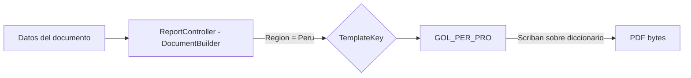
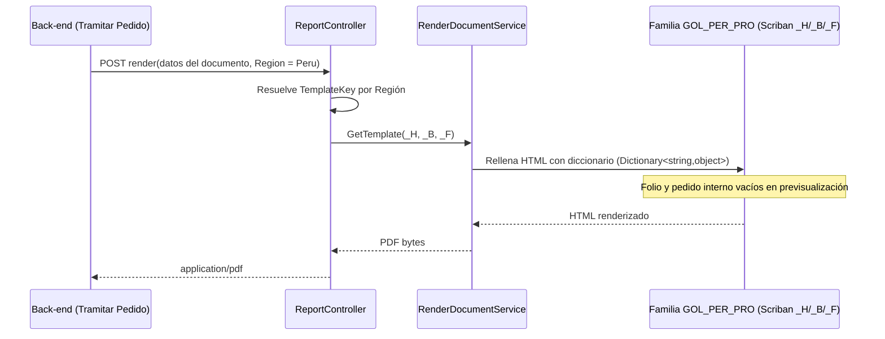

# **Diseño de la solución**

## Requisito R16A-RE-FU-017 — Proforma Perú

**Maquetación del PDF de Proforma Perú en Document Builder (familia de plantilla _PER_PRO)**

| FORMATO | Arquitectura |
| :---- | :---- |
| **PROYECTO** | R16 - Adquisiciones |
| **REFERENCIA** | AUI-FOR-01 |
| **VERSIÓN** | 1.3 |
| **FECHA** | 17 jul 2026 |
| **AUTOR** | [Jose Armando Santiago Lorenzo](mailto:jose.santiago@ryndem.mx) |
| **REVISOR** | [Alan Fernandez Garcia](mailto:alan.garcia@ryndem.mx) |

# **Importante**

Posterior a este diseño, ¿cómo saber si el diseño de la solución al requisito está completo para que el programador inicie con el desarrollo?
Hazte estas preguntas rápidas:

* ¿El programador sabe qué flujo implementar?
* ¿Sabe qué pasa si algo falla?
* ¿Sabe qué reglas no puede romper?
* ¿Sabe qué pruebas debe pasar?
* ¿Sabe dónde impacta?

*Nota: Este documento es una propuesta basada en el estándar IEEE 1016 "Software Design Description" que va permitir abarcar los puntos más importantes para el diseño del requisito que se está trabajando. Se debe administrar el tiempo que se tiene de diseño para que se complete de la mejor manera considerando todos los detalles técnicos.*

# **Introducción**

## **Propósito del documento**

El propósito de este documento es definir el diseño de la solución técnica para la maquetación del PDF de Proforma Perú (R16A-RE-FU-017) en el motor de renderizado DocumentBuilder: la creación de una única familia de plantilla _PER_PRO para Golocaer S.A.C., la única empresa emisora del grupo PROQUIFA que opera en Perú, y las secciones visuales que componen el documento.

**Nota:** este documento se enfoca en el diseño visual del PDF (maqueta HTML/CSS/Scriban en Document Builder). La generación del contrato de datos, el foliador, la persistencia y los endpoints son responsabilidad del Back-end y no se rediseñan aquí; el contrato de datos ya está definido por Back-end. La plantilla es render puro: no contiene lógica de negocio, imprime literalmente lo que llega en el diccionario de datos.

## **Alcance**

### **Específicamente incluye:**

* Creación de **una sola familia de plantilla _PER_PRO** en DocumentBuilder/API/Resources/Templates/: GOL_PER_PRO (Golocaer S.A.C., única empresa emisora del grupo PROQUIFA en Perú). Tiene sus piezas _H (header) / _B (body) / _F (footer), siguiendo la convención ya usada por las familias existentes _COT (Cotización) y _PED (Pedido).
* Maquetación HTML/CSS de las **8 secciones visuales** del documento: cabecera, proforma/disclaimer/vigencia, cliente, entrega, tabla de partidas, referencias bancarias, pago y pie legal — verificadas contra los 2 mockups reales de Golocaer S.A.C. Perú (páginas 1 y 2).
* Reutilización de las convenciones CSS y de paginación ya probadas en las familias existentes _COT/_PED (documentos multi-página), **sin modificar el motor de render compartido** RenderDocumentService.

### **No se consideran:**

* El diseño **Back-end** de RE-FU-017: la generación del contrato de datos, el foliador, la persistencia, los endpoints y la lógica de armado del documento — responsabilidad del equipo de Back-end. El contrato ya está cerrado; Perú no requiere ningún campo nuevo.
* El **modelo de datos de cuentas bancarias Perú** (Criterio E1) y la **lógica de Referencia Bancaria / REF. CLIENTE Perú** (Criterio E2) — brechas mayores del proyecto, competencia de Back-end + operaciones Perú + normativa SUNAT. Se documentan como bloqueantes, no se resuelven aquí.
* El **régimen de Detracciones (SPOT)** de SUNAT — confirmado por el cliente: no aplica a la operación de PROQUIFA.
* El **régimen de Percepciones del IGV** de SUNAT — preliminarmente fuera de alcance (los productos típicos de PROQUIFA no caen en los anexos y Golocaer no sería Agente de Percepción); ==aplicabilidad final pendiente de confirmar con asesor contable peruano==.
* La aprobación final del diseño visual (ver nota destacada al final de esta sección).
* La relación empresa↔banco y la selección de cuenta — lógica 100% backend; la plantilla es agnóstica al banco.

==Supuesto raíz (no cerrado): todo el diseño visual de este documento se basa en que los 2 mockups PDF de Golocaer S.A.C. Perú son la propuesta válida, aunque **no están aprobados formalmente por el cliente**. Se avanza por indicación expresa para proceder con los DIS de la familia de maquetas, no porque el supuesto se haya cerrado. Un cambio del cliente sobre el diseño implicaría rework de la maqueta.==

# **Visión general del diseño**

## **Objetivo técnico**

Definir la maquetación del PDF de Proforma Perú en el motor DocumentBuilder, creando **una sola familia de plantilla _PER_PRO** (Golocaer S.A.C.) que reproduzca fielmente el documento a partir de los datos que recibe, **sin modificar el motor de render compartido** ni introducir lógica de negocio en la plantilla. La plantilla imprime literalmente los valores que recibe (render puro), lo que permite maquetar y probar con datos dummy sin depender del backend, y desacopla la maqueta de reglas como la selección de banco o la construcción de la referencia bancaria.

**Empresa emisora única:** en Perú opera una sola empresa emisora del grupo PROQUIFA (Golocaer S.A.C.), por lo que la solución expone **una sola familia de plantilla** (GOL_PER_PRO) y elimina toda lógica de diferenciación por empresa emisora; la selección de la familia se hace por **Región = Perú**.

**Contrato de datos de la Proforma:** el contrato se organiza en los grupos Header, IssuingCompany, Customer, Items[], Totals, BankAccounts[] y DeliveryInfo. El detalle de cada campo vive en Impacto en modelos.

## **Componentes involucrados**

El entregable de este diseño vive en DocumentBuilder (la familia de plantilla _PER_PRO). El resto de los componentes ya existen y se reutilizan sin cambios.

| Aplicativo | Componente | Responsabilidad | Ubicación |
| :---- | :---- | :---- | :---- |
| DocumentBuilder | ReportController | Selecciona la familia por Región = Perú e invoca el render | DocumentBuilder/API/Controllers/ReportController.cs (existente, se reutiliza) |
| DocumentBuilder | RenderDocumentService (Scriban) | Rellena el HTML de la plantilla con el diccionario de datos y produce el PDF | DocumentBuilder/Application/Services/Pdf/RenderDocumentService.cs (existente, se reutiliza) |
| DocumentBuilder | **Familia de plantilla _PER_PRO** | HTML/CSS/Scriban _H/_B/_F de Golocaer que define el aspecto del PDF | DocumentBuilder/API/Resources/Templates/GOL_PER_PRO/ (**entregable central**) |

El entregable central de este diseño es la familia GOL_PER_PRO; el motor de render (RenderDocumentService) y el ReportController ya existen y se reutilizan sin cambios.

# **Diseño funcional detallado**

## **Flujo 1 — Render de la plantilla _PER_PRO (previsualización)**

Ruta de render de la plantilla, a nivel de componente de DocumentBuilder:

1. ReportController resuelve la familia de plantilla GOL_PER_PRO discriminando por **Región = Perú**.
2. La consulta retorna los nombres de archivo _H / _B / _F de la familia registrada.
3. RenderDocumentService (Scriban) rellena el HTML _H+_B+_F con los datos materializados como diccionario (Dictionary<string,object>) y produce el PDF.
4. El PDF (application/pdf) se entrega ya renderizado.

**Puntos clave de la maqueta:**

* El render trabaja sobre un diccionario genérico (Dictionary<string,object>), **no** sobre un tipo fuerte — la plantilla Scriban puede probarse con datos dummy Perú (mono-PEN, IGV 18%, 2 cuentas BCP) sin esperar al backend ni a que se cierren las brechas bancarias.
* La selección de familia depende **solo** de la Región del cliente/pedido, nunca del banco ni del producto. ==El mecanismo exacto de selección (Región = Perú vs. un Empresa.Prefijo propio de Golocaer S.A.C. Perú) queda como duda técnica a confirmar con Back-end.==

## **Flujo 2 — Variantes de estado sobre la misma plantilla**

La misma familia _PER_PRO se usa para la previsualización, el documento definitivo y la consulta histórica; solo cambian los valores que recibe. La plantilla no distingue el estado: pinta lo que llega. La única diferencia visible entre previsualización y documento definitivo son los valores del folio (Header.Folio) y del pedido interno (DeliveryInfo.InternalOrderNumber); el layout y las 8 secciones son idénticos en ambos estados.

## **Criterios de aceptación del requisito**

Criterios de aceptación tomados de la matriz de requisitos (fila R16A-RE-FU-017, secciones A–J). **CA Descripción** reproduce el texto verbatim de la matriz; **Descripción** explica cómo se cumple ese CA en este DIS. **Estado** toma uno de: Cubierto, Pendiente, Sin Resolver, Otro; la columna **Justificación** solo se llena cuando el Estado es *Otro*.

| CA | CA Descripción | Descripción | Estado | Justificación |
| :---- | :---- | :---- | :---- | :---- |
| A1 | Dado que el sistema muestra la cabecera del documento, Cuando incluye el logo, Entonces deberá mostrar el logo de Golocaer S.A.C. correspondiente a la operación Perú. | Se cubre con el logo institucional embebido en base64 en la pieza _H de la familia GOL_PER_PRO. | Cubierto |  |
| A2 | Dado que el sistema muestra la cabecera, Cuando incluye el disclaimer legal, Entonces deberá mostrar un texto que indique el carácter informativo del documento previo a la emisión del Comprobante de Pago Electrónico (CPE) bajo normativa SUNAT. Texto propuesto: "ESTE ES UN DOCUMENTO INFORMATIVO PREVIO A LA EMISIÓN DEL COMPROBANTE DE PAGO ELECTRÓNICO (CPE). CARECE DE VALIDEZ FISCAL Y TRIBUTARIA CONFORME AL REGLAMENTO DE COMPROBANTES DE PAGO Y RESOLUCIÓN DE SUPERINTENDENCIA N° 097-2012/SUNAT." Pendiente validación legal con asesor SUNAT antes de publicación productiva. | Se cubre con el texto fijo en la pieza _B (Header.LegalDisclaimer); la plantilla imprime el texto propuesto literal. | Cubierto |  |
| A3 | Dado que el sistema muestra la cabecera, Cuando incluye el título del documento, Entonces deberá mostrar el texto "Proforma". Pendiente confirmar si en Perú el título canónico comercial es "Proforma" o "Factura Proforma" — ambos términos se usan indistintamente en la práctica peruana. | Texto fijo hardcode en la pieza _B. | Cubierto |  |
| A4 | Dado que el sistema muestra la cabecera, Cuando incluye el folio del documento, Entonces deberá mostrar el folio con formato "PRF-MMDDAA-Consecutivo". El consecutivo corresponde al foliador global lineal PQF2. El momento exacto en que se consume el folio (al previsualizar vs al confirmar envío) queda como duda técnica del proyecto. | Se imprime el valor recibido (Header.Folio); el momento de asignación del folio es responsabilidad de Back-end. | Cubierto |  |
| A5 | Dado que el sistema muestra la cabecera, Cuando incluye el campo Vigencia, Entonces deberá mostrar la fecha de vigencia en formato DD/MM/YYYY. Regla exacta del cálculo pendiente confirmar. | Se imprime el valor recibido (Header.ExpirationDate); el cálculo de la fecha es responsabilidad de Back-end. | Cubierto |  |
| B1 | Dado que el sistema muestra la sección Cliente, Cuando incluye el identificador del cliente, Entonces deberá mostrar el Alias del cliente desde el Catálogo de Clientes. Pendiente confirmar si el dato fuente correcto es Alias o Razón Social. | Se imprime el valor recibido (Customer.LegalName). | Cubierto |  |
| C1 | Dado que el sistema muestra la tabla de partidas, Cuando incluye los datos por cada partida, Entonces deberá mostrar: número consecutivo, cantidad, descripción (catálogo + descripción + marca), precio unitario con moneda, e importe calculado (cantidad × precio). Todos los datos provienen del Pedido. | Se cubre con Items[] (loop de partidas). | Cubierto |  |
| D1 | Dado que el sistema incluye los cálculos fiscales, Cuando muestra las líneas de monto, Entonces deberá mostrar: "Sub-Total" con monto y moneda; "IGV" con tasa aplicable al pedido (18% según normativa SUNAT, salvo exoneraciones específicas que pudieran aplicar a productos puntuales — pendiente confirmar exoneraciones aplicables) y monto calculado; "Gran Total" con monto, suma de Sub-Total e IGV. La moneda aplicada es la moneda de facturación del cliente desde el Catálogo (no la moneda del pedido). Para Perú las monedas típicas son PEN (Soles) y USD. | Se cubre con Totals (Subtotal/TaxRate/TaxAmount/GrandTotal/Currency). | Cubierto |  |
| D2 | Dado que el sistema muestra la conversión a letras del Gran Total, Cuando incluye la leyenda monetaria, Entonces deberá mostrar el monto en palabras según la moneda: si moneda = soles peruanos, "(XXX SOLES XX/100)"; si moneda = dólares, "(XXX DOLARES XX/100)"; otras monedas, nomenclatura correspondiente. Pendiente confirmar la nomenclatura exacta esperada para SUNAT (algunas implementaciones usan "SOLES" otras "NUEVOS SOLES" pese a que la moneda oficial desde 2015 es solo "SOLES"). | Se cubre con Totals.GrandTotalInWords. | Cubierto |  |
| D3 | Dado que la moneda de facturación del cliente NO es soles peruanos, Cuando el sistema muestra la sección de pago, Entonces deberá mostrar el tipo de cambio aplicado a la conversión. El tipo de cambio es el del día de generación. Pendiente confirmar si para Perú aplica el tipo de cambio SUNAT publicado (compra/venta) o un tipo de cambio interno corporativo. | Se cubre con Totals.ExchangeRate; la fuente del dato es responsabilidad de Back-end. Vacío cuando la moneda de facturación es soles (mono-PEN). | Cubierto |  |
| D4 | Dado que el sistema muestra la sección de pago, Cuando incluye las condiciones, Entonces deberá mostrar las condiciones de pago aplicables al cliente (ejemplo: "PREPAGO 100%"), provenientes de la configuración del cliente en el Catálogo. | Se cubre con Totals.PaymentTerms; se imprime el valor recibido. | Cubierto |  |
| D5 | Dado que el sistema muestra el final de la sección de pago, Cuando incluye la leyenda de pago, Entonces pendiente definir la leyenda equivalente bajo normativa SUNAT. La normativa peruana clasifica las operaciones como Contado o Crédito sin el concepto "Pago en una sola exhibición". Propuesta: omitir esta leyenda o reemplazarla con "OPERACIÓN AL CONTADO" cuando aplique. Pendiente confirmar. | Texto fijo hardcode en la plantilla, propuesto como "OPERACIÓN AL CONTADO"; no viaja en los datos. | Cubierto |  |
| E1 | Dado que el sistema muestra la sección de datos bancarios, Cuando arma el contenido, Entonces deberá mostrar las cuentas bancarias de Golocaer S.A.C. Perú. El modelo bancario Perú no está definido: pendiente confirmar (a) cuántas cuentas se muestran, (b) en qué monedas, (c) en qué bancos peruanos opera Golocaer S.A.C. (BCP, BBVA Continental, Interbank, Scotiabank Perú u otros), (d) si se muestran siempre las cuentas independientemente de la moneda del pedido o solo la cuenta de la moneda aplicable. Brecha mayor del proyecto. Los campos por cuenta esperados son: Moneda, Banca, Sucursal, Cuenta, CCI (Código de Cuenta Interbancario de 20 dígitos) y REF. CLIENTE. | La plantilla itera el arreglo BankAccounts[] que reciba y lo pinta en el layout de columnas, sin asumir cantidad ni monedas fijas. | Otro | Brecha mayor de Back-end/operaciones Perú (modelo de cuentas: cantidad, monedas, bancos) — no bloquea la maqueta, que es agnóstica al banco y a la cantidad de cuentas. |
| E2 | Dado que el sistema muestra la REF. CLIENTE de cada cuenta, Cuando construye el valor, Entonces el modelo de Referencia Bancaria para Perú no está definido. La lógica usada en México (cuenta Banamex con 7 segmentos basados en nombre del cliente, clave, código del banco, moneda y CodValidador; cuenta no-Banamex con nombre del cliente directo) es exclusiva de PROQUIFA México y no aplica a Perú. Brecha mayor del proyecto. Pendiente definir antes de habilitar Perú productivamente. | Se imprime el valor recibido en BankAccount.CustomerRef; la construcción del valor es responsabilidad de Back-end. | Otro | Brecha mayor de Back-end (lógica de identificación de pagos Perú aún no definida) — no bloquea la maqueta, que solo pinta el valor recibido. |
| F1 | Dado que el sistema muestra la sección de facturación, Cuando incluye los datos fiscales del cliente, Entonces deberá mostrar: RUC del cliente desde el Catálogo de Clientes (etiqueta del campo "RUC"); Razón Social del cliente desde el Catálogo de Clientes; Dirección fiscal completa del cliente (calle, número, distrito, provincia, departamento, país) desde el Catálogo de Clientes, con las convenciones administrativas peruanas (distrito/provincia/departamento). | Se cubre con Customer (TaxId/LegalName/FiscalAddress); la etiqueta "RUC" es hardcode de la plantilla. | Cubierto |  |
| G1 | Dado que el sistema muestra la sección de entrega, Cuando incluye los datos de entrega, Entonces deberá mostrar: Número de pedido interno (aplica la misma duda de generación de folio interno: momento de generación cuando el pedido aún no se ha enviado); Parciales (SI/NO) según configuración del pedido; Contacto de entrega del pedido (si no existe, mostrar "NINGUNO") (confirmar si es el contacto de entrega, contacto del cliente o contacto que realizó el pedido); Lugar de entrega completo (dirección). | Se cubre con DeliveryInfo (InternalOrderNumber/DeliveryPartial/Contact/DeliveryLocation). | Cubierto |  |
| H1 | Dado que el sistema muestra el pie del documento, Cuando incluye la información de contacto, Entonces deberá mostrar los datos de contacto institucionales de Golocaer S.A.C. Perú: redes sociales aplicables, teléfonos de oficinas Perú, web y correo de ventas Perú. Datos pendientes de capturar en el sistema: no se cuenta actualmente con la información de contacto de Golocaer S.A.C. Perú. Brecha pendiente. | Se cubre con datos de contacto embebidos en _H/_F de la familia GOL_PER_PRO. | Cubierto |  |
| H2 | Dado que el sistema muestra el pie legal, Cuando incluye la razón social legal, Entonces deberá mostrar la razón social legal completa "Golocaer S.A.C." con su dirección legal completa en Perú. La dirección legal de Golocaer S.A.C. en Perú no está disponible en el sistema actual. Brecha pendiente: recopilar y capturar antes de habilitar Perú. | Se cubre con IssuingCompany (LegalName/LegalAddress) embebido en _H/_F. | Cubierto |  |
| H3 | Dado que el sistema muestra el pie, Cuando incluye certificaciones y métodos de pago aceptados, Entonces deberá mostrar las certificaciones vigentes aplicables a Golocaer S.A.C. Perú. El sello NEEC no aplica para Perú por ser programa exclusivo de México. Pendiente confirmar si Golocaer Perú cuenta con certificación ISO 9001 o equivalente. Pendiente confirmar métodos de pago aceptados aplicables al mercado peruano. Brecha pendiente. | Se cubre con certificaciones y métodos de pago embebidos en base64 por TemplateKey. | Cubierto |  |
| H4 | Dado que el sistema completa el documento, Cuando incluye el contador de páginas, Entonces deberá mostrar "X/Y" en el pie del documento, donde X es la página actual e Y es el total. Si el documento es de una sola página, se muestra "1/1". | Numeración calculada por el motor de render. | Cubierto |  |
| H5 | Dado que el sistema muestra la línea final del documento, Cuando incluye los logos de catálogos y proveedores reconocidos, Entonces deberá mostrar los logos aplicables a la operación Perú. El logo FEUM no aplica para Perú. USP, EDQM y Microbiologics típicamente sí aplican. Pendiente confirmar la lista exacta de logos aplicables a Golocaer S.A.C. Perú. Brecha pendiente. | Se cubre con logos institucionales embebidos en base64 por TemplateKey. | Cubierto |  |
| I1 | Dado que el pedido tiene partidas que exceden el espacio disponible en una sola página, Cuando el sistema muestra el documento, Entonces deberá generar páginas adicionales con la misma cabecera y pie completo. Las partidas continúan en las páginas adicionales. La numeración se actualiza (1/3, 2/3, 3/3). Este comportamiento ya existe en PQF2. | Paginación del motor de render (comportamiento ya existente en PQF2). | Cubierto |  |
| J1 | Dado que un usuario presiona "Tramitar" en el módulo Tramitar Pedido para un pedido Perú, Cuando el sistema procesa la acción, Entonces deberá generar el PDF dinámicamente con los datos vigentes en ese momento y mostrarlo en previsualización al usuario. El PDF no se almacena en base de datos en esta etapa. | N/A en esta maqueta — la orquestación de la generación bajo demanda es responsabilidad de Back-end; la plantilla solo renderiza el diccionario que reciba. Ver Flujo 2. | Otro | Fuera de alcance del maquetado (responsabilidad de Back-end). |
| J2 | Dado que el usuario abandonó el flujo sin enviar la Proforma y vuelve a presionar "Tramitar", Cuando el sistema procesa la nueva acción, Entonces deberá regenerar el PDF desde cero con los datos fuente vigentes en ese nuevo momento. Si cambiaron datos entre intentos, el nuevo PDF los refleja. | N/A en esta maqueta — la regeneración y lectura de datos vigentes es orquestación de Back-end; la plantilla renderiza lo que reciba en cada invocación. | Otro | Fuera de alcance del maquetado (responsabilidad de Back-end). |
| J3 | Dado que el sistema confirma que el correo de envío al cliente fue exitoso, Cuando se completa el envío, Entonces deberá persistir el PDF final en base de datos como artefacto histórico inmutable. El pendiente en Tramitar Pedido se cierra. | N/A en esta maqueta (render puro, sin persistencia). | Otro | Fuera de alcance del maquetado (responsabilidad de Back-end). |
| J4 | Dado que una Proforma fue enviada y persistida, Cuando un usuario consulta el módulo Validar Cobro para procesar el cobro asociado, Entonces el sistema deberá permitir acceder al PDF histórico de la Proforma. El PDF se entrega tal cual fue almacenado, sin regeneración desde datos fuente actuales. | N/A en esta maqueta (render puro, sin persistencia ni consulta histórica). | Otro | Fuera de alcance del maquetado (responsabilidad de Back-end). |
| J5 | Dado que una Proforma fue enviada y persistida, Cuando un usuario intenta reenviarla desde el módulo Tramitar Pedido, Entonces el sistema no deberá ofrecer esa funcionalidad. El pendiente está cerrado y la Proforma original se conserva como registro permanente. | N/A en esta maqueta (render puro, sin lógica de reenvío). | Otro | Fuera de alcance del maquetado (responsabilidad de Back-end). |

## **Reglas técnicas aplicadas**

Reglas de implementación (no de negocio) que la maqueta debe respetar.

| Regla | Descripción |
| :---- | :---- |
| RT-01 | La familia _PER_PRO reutiliza las convenciones CSS y de paginación de las familias existentes _COT/_PED. **Cero cambios al motor RenderDocumentService**: solo se agregan archivos de plantilla (estrategia aditiva). Al ser **una sola familia**, el esfuerzo de maquetación y el riesgo de regresión se acotan a un único set de archivos. |
| RT-02 | El branding (logo, color institucional, bloque de contacto y tira de certificaciones) se embebe como base64 en las piezas _H/_F; **no viaja en los datos**. Perú requiere **assets propios de Golocaer Perú**: la tira de certificaciones aplicable (klivon/ISO/Q.E.A./AMEX en el mockup) es un asset propio de esta familia de plantilla. |
| RT-03 | La selección de la familia se deriva de la **Región = Perú**. Con emisora única, la plantilla no contiene ninguna condición hardcodeada por empresa ni por banco — es agnóstica al banco y al producto. |
| RT-04 | La plantilla renderiza cada campo como texto literal, **sin lógica condicional ni chequeo de nulos**. Los campos ausentes llegan como cadena vacía, no nulos — por eso en previsualización el pedido interno llega vacío. |
| RT-05 | "Referencias Bancarias" itera las cuentas que llegan en el arreglo y las pinta en el layout de columnas (el mockup Perú muestra 2: USD + PEN, banco BCP). Con 0 o 1 cuenta imprime lo que haya sin romper el layout. ==La cantidad y monedas reales de las cuentas de Golocaer Perú son brecha de Back-end (Criterio E1), no de la plantilla.== |
| RT-06 | La leyenda "OPERACIÓN AL CONTADO" es **texto fijo** de la plantilla (bloque PAGO del _B); no viaja en los datos. |
| RT-07 | La paginación "Página X / Y" la calcula el **motor de render**; la tabla de partidas controla el salto de página; header (_H) y footer (_F) se repiten en cada página. |
| RT-08 | Los campos se nombran en **inglés**, de forma genérica: InterbankCode cubre el número de cuenta interbancario (CCI, 20 dígitos); TaxId cubre el identificador fiscal (RUC, 11 dígitos); TaxRate viaja como texto dinámico (ej. "18%"). El contrato no requiere ningún campo nuevo respecto al ya definido por Back-end. |
| RT-09 | La plantilla no captura ni silencia errores: un TemplateKey/Región inexistente o un HTML mal formado se propaga como error del motor; no se produce un "PDF a medias" silencioso. |
| RT-10 | El color de header/footer es el **institucional de Golocaer**. Al haber una única emisora, es un color fijo para toda la familia _PER_PRO. |

# **Diseño de componentes**

## **Diagrama de flujo**

Flujo de datos hasta el render: DocumentBuilder selecciona la única familia _PER_PRO por Región = Perú y renderiza el PDF con Scriban.



Ninguna familia _PER_PRO existe hoy en DocumentBuilder/API/Resources/Templates/ — solo existen las familias existentes _COT y _PED. La convención de carpeta/archivo a replicar es API/Resources/Templates/GOL_PER_PRO/GOL_PER_PRO_{H,B,F}.html. La ruta completa Frontend → Finanzas → DocumentBuilder usa el mismo endpoint e integración ya existentes; solo cambia la clave de selección de plantilla (Región = Perú).

## **Diagrama de secuencia — Render de la Proforma Perú**

Orden de llamadas entre componentes y responsable de cada paso, desde que Back-end solicita el render hasta que recibe el PDF.



La ruta completa Back-end → DocumentBuilder es idéntica en previsualización y documento definitivo; solo cambian los valores de folio y pedido interno (Flujo 2).

# **Impacto Técnico**

## **Impacto en código existente**

Repositorio DocumentBuilder (entregable central):

| # | Archivo / Artefacto | Tipo de cambio |
| :---- | :---- | :---- |
| 1 | API/Resources/Templates/GOL_PER_PRO/GOL_PER_PRO_{H,B,F}.html | Nuevo — familia de plantilla Golocaer Perú |
| 2 | Registro en BD DocumentTemplate (por ambiente) | Nuevo (dato/seed) — asocia la familia GOL_PER_PRO (Región = Perú) a los archivos _H/_B/_F |

**No se toca:** el motor RenderDocumentService ni las familias existentes _COT/_PED (estrategia aditiva, sin cutover). El rollback consiste en despublicar/desregistrar la familia _PER_PRO; el resto de familias no se ve afectado.

## **Impacto en modelos**

* No se crean ni modifican entidades de BD en esta maqueta.
* La maqueta consume un diccionario de datos genérico; el contrato ya está definido por Back-end y **Perú no requiere ningún campo nuevo**. Se incluye aquí el ejemplo y la tabla de datos para que quede trazado en el DIS en dónde se usaría cada valor; si cambia, solo se ajusta este documento.

Ejemplo (variante previsualización, datos dummy Perú — Golocaer S.A.C., mono-PEN):

```json
{
  "Header": {
    "Folio": "",
    "ExpirationDate": "12 Abril 2026",
    "LegalDisclaimer": "Este es un documento informativo previo a la emisión del Comprobante de Pago Electrónico (CPE). Carece de validez fiscal y tributaria conforme al Reglamento de Comprobantes de Pago y R.S. N° 097-2012/SUNAT."
  },
  "IssuingCompany": {
    "LegalName": "Golocaer S.A.C.",
    "LegalAddress": "Av. Santo Toribio 143, Urb. El Rosario, Piso 5, San Isidro, Lima, Perú"
  },
  "Customer": {
    "LegalName": "Laboratorios Gamalab S.A.C.",
    "TaxId": "20512345678",
    "FiscalAddress": "Av. Javier Prado Este 4200, Santiago de Surco, Lima, Lima, Perú"
  },
  "Items": [
    { "Number": "2", "Quantity": "1", "Description": "MBL-0494X Staphylococcus aureus derived from ATCC 6538 (KWIK-STIK Plus) - MICROBIOLOGICS", "UnitPrice": "S/ 508.00", "Amount": "S/ 508.00" }
  ],
  "Totals": {
    "Subtotal": "S/ 14,820.00",
    "TaxRate": "18%",
    "TaxAmount": "S/ 2,667.60",
    "GrandTotal": "S/ 17,487.60",
    "GrandTotalInWords": "(DIECISIETE MIL CUATROCIENTOS OCHENTA Y SIETE SOLES 60/100)",
    "ExchangeRate": "",
    "PaymentTerms": "Prepago 100%"
  },
  "BankAccounts": [
    { "Currency": "USD", "BankName": "BCP - Suc. 002", "AccountNumber": "193-2511684-1-12", "InterbankCode": "00219300251168411215", "SwiftCode": "BCPLPEPLXXX", "IbanCode": "PE98BK1932511684112012345678901234", "CustomerRef": "GAM0153BCD96" },
    { "Currency": "PEN", "BankName": "BCP - Suc. 002", "AccountNumber": "194-7654321-0-58", "InterbankCode": "00219400765432105823", "SwiftCode": "BCPLPEPLXXX", "IbanCode": "PE98BK1947654321058012345678901234", "CustomerRef": "GAM0153BCP84" }
  ],
  "DeliveryInfo": {
    "InternalOrderNumber": "",
    "DeliveryPartial": "No",
    "Contact": "Elio Fernando Arriaga Manjarrez",
    "DeliveryLocation": "Av. Aramburú 880, Surquillo, Lima, Lima, Perú"
  }
}
```

En documento definitivo (post-confirmación de envío), Header.Folio y DeliveryInfo.InternalOrderNumber llegan poblados; el resto del documento no cambia (ver Flujo 2).

Tabla de datos, agrupada por sección del documento:

### Cabecera

| Dato | Ejemplo |
|---|---|
| Folio | (vacío en previsualización) |
| Vigencia | 12 Abril 2026 |
| Disclaimer legal SUNAT | Este es un documento informativo previo a la emisión del Comprobante de Pago Electrónico (CPE). Carece de validez fiscal y tributaria conforme al Reglamento de Comprobantes de Pago y R.S. N° 097-2012/SUNAT. |

### Emisor

| Dato | Ejemplo |
|---|---|
| Razón social | Golocaer S.A.C. |
| Dirección legal | Av. Santo Toribio 143, Urb. El Rosario, Piso 5, San Isidro, Lima, Perú |

### Cliente

| Dato | Ejemplo |
|---|---|
| Razón social / Alias | Laboratorios Gamalab S.A.C. |
| RUC | 20512345678 |
| Dirección fiscal | Av. Javier Prado Este 4200, Santiago de Surco, Lima, Lima, Perú |

### Partida (se repite por cada renglón)

| Dato | Ejemplo |
|---|---|
| N° de partida | 2 |
| Cantidad | 1 |
| Descripción (catálogo + descripción + marca) | MBL-0494X Staphylococcus aureus derived from ATCC 6538 (KWIK-STIK Plus) - MICROBIOLOGICS |
| Precio unitario | S/ 508.00 |
| Importe | S/ 508.00 |

### Pago

| Dato | Ejemplo |
|---|---|
| Sub-Total | S/ 14,820.00 |
| IGV (tasa) | 18% |
| IGV (monto) | S/ 2,667.60 |
| Gran Total | S/ 17,487.60 |
| Total en letras | (DIECISIETE MIL CUATROCIENTOS OCHENTA Y SIETE SOLES 60/100) |
| Tipo de cambio | (vacío — mono-PEN) |
| Condiciones de pago | Prepago 100% |

### Cuenta bancaria (se repite por cada cuenta)

| Dato | Ejemplo |
|---|---|
| Moneda | USD |
| Banco - Sucursal | BCP - Suc. 002 |
| N° de cuenta | 193-2511684-1-12 |
| CCI | 00219300251168411215 |
| Código SWIFT | BCPLPEPLXXX |
| IBAN | PE98BK1932511684112012345678901234 |
| REF. CLIENTE | GAM0153BCD96 |

### Entrega

| Dato | Ejemplo |
|---|---|
| N° de pedido interno | (vacío en previsualización) |
| Parciales | No |
| Contacto de entrega | Elio Fernando Arriaga Manjarrez |
| Lugar de entrega | Av. Aramburú 880, Surquillo, Lima, Lima, Perú |

# **Manejo de Errores y Excepciones**

| Escenario | Comportamiento esperado |
| :---- | :---- |
| Región = Perú sin familia _PER_PRO registrada | El motor no encuentra la plantilla → error del ReportController; se resuelve registrando la familia GOL_PER_PRO en DocumentTemplate. |
| Campo ausente o vacío (ej. pedido interno vacío en previsualización) | La plantilla trata todo como texto e imprime vacío, sin chequeo de nulos. |
| Cantidad de cuentas bancarias distinta a la esperada | La plantilla itera las cuentas que llegan y las pinta en el layout de columnas sin romperlo (el mockup muestra 2, USD + PEN). ==La cantidad/monedas reales son brecha de Back-end (E1).== |
| Banco inesperado (BBVA Continental / Interbank / Scotiabank en vez de BCP) | Ninguno: la plantilla es agnóstica al banco, imprime los valores literales. Sin lógica condicional de banco ni de referencia. |
| Asset base64 de branding ausente (logo, tira de certificaciones Perú) | Se degrada a espacio en blanco; no aborta el render. El contenido textual (folio, cliente, totales) es independiente de los assets. |

# **Estrategia de Pruebas**

## **Pruebas funcionales (Criterios de Aceptación en DEV)**

* La familia GOL_PER_PRO renderiza un PDF fiel al mockup de Golocaer Perú (color institucional correcto, 8 secciones en su posición, disclaimer CPE/SUNAT, IGV 18%, moneda S/, leyenda "OPERACIÓN AL CONTADO") a partir de un diccionario dummy.
* Un documento de más de 25 partidas pagina correctamente en múltiples páginas, con header/footer repetidos y "Página X / Y" correcta (el mockup ya demuestra 26 partidas en 2 páginas).
* La plantilla imprime datos de cuentas BCP (CCI de 20 díg., SWIFT, IBAN) sin cambiar la plantilla — verifica que es agnóstica al banco.
* Previsualización con pedido interno vacío → el bloque ENTREGA imprime el campo vacío sin romper el layout.

## **Pruebas técnicas (unitarias e integración)**

### **Unitarias / de plantilla**

* Render de la familia _PER_PRO con un diccionario dummy Perú completo (mono-PEN, 2 cuentas BCP, IGV 18%) → PDF con las 8 secciones en su posición.
* Iteración de cuentas: la plantilla pinta las cuentas del arreglo en el layout de columnas sin romperlo.
* Campos vacíos → impresión literal sin excepción ni chequeo de nulos.

### **Pruebas de integración**

* Render con Región = Perú → familia GOL_PER_PRO seleccionada y PDF correcto.
* Región/TemplateKey _PER_PRO no registrado → error propagado, sin PDF a medias.
* Regresión del motor compartido: las familias existentes _COT/_PED siguen renderizando sin cambios tras agregar la familia _PER_PRO.

## **Casos críticos**

* **Documento multi-página (> 25 partidas):** header/footer repetidos por página y numeración "X / Y" correcta.
* **Disclaimer legal SUNAT:** se maqueta con el texto propuesto; ==el valor puede ajustarse sin tocar la plantilla (viaja en Header.LegalDisclaimer) una vez validado por asesor legal peruano.==
* **Brechas E1/E2 (modelo de cuentas y REF. CLIENTE Perú):** no bloquean la maqueta — el motor es agnóstico e imprime lo que llega; ==sí bloquean la habilitación productiva de Perú y deben cerrarse antes con Back-end + operaciones Perú.==
* **Variante definitiva (post-confirmación):** folio real y pedido interno poblado sobre la misma plantilla, sin cambios de layout respecto a la previsualización.

# **Control de versiones**

| Versión | Fecha | Autor | Tipo de Cambio | Aprobó |
| :---- | :---- | :---- | :---- | :---- |
| 1.0 | 13 jul 2026 | Jose Armando Santiago Lorenzo | Creación | — |
| 1.1 | 17 jul 2026 | Jose Armando Santiago Lorenzo | Corrección — tabla de Criterios de Aceptación reestructurada (columna CA Descripción + catálogo de Estado), referencias cruzadas a otros sistemas/documentos eliminadas, contrato de datos incrustado, diagrama de secuencia agregado | — |
| 1.3 | 20 jul 2026 | Jose Armando Santiago Lorenzo | Corrección — tabla "Componentes involucrados" con ruta completa de archivo por componente (ReportController, RenderDocumentService), no solo "existente, se reutiliza" (mismo comentario de Alan ya resuelto en DIS-016 v1.6); tabla de Criterios de Aceptación sin negritas y columna Justificación vacía (sin guion medio) cuando Estado = Cubierto | — |
