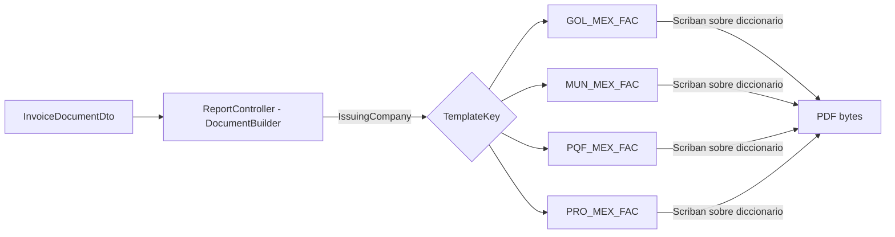
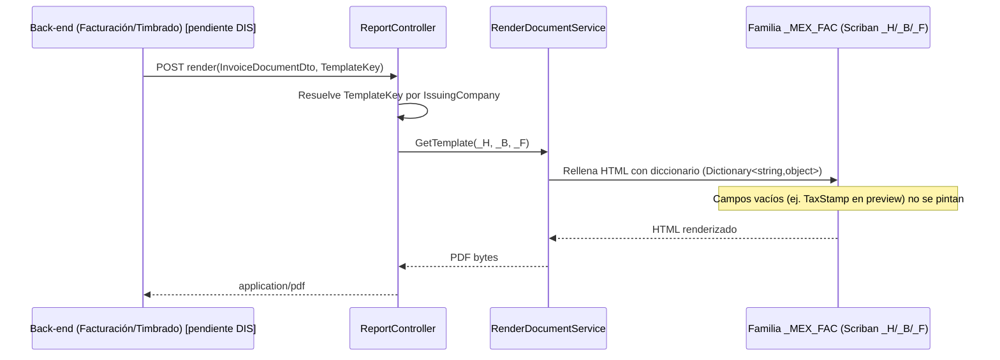

# **Diseño de la solución**

## Requisito R16A-RE-FU-021 — Factura México

**Maquetación del PDF de la Factura CFDI 4.0 México (post-timbrado) en Document Builder (familia de plantillas _MEX_FAC)**

| FORMATO | Arquitectura |
| :---- | :---- |
| **PROYECTO** | R16 - Adquisiciones |
| **REFERENCIA** | AUI-FOR-01 |
| **VERSIÓN** | 1.0 |
| **FECHA** | 15 jul 2026 |
| **AUTOR** | [Jose Armando Santiago Lorenzo](mailto:jose.santiago@ryndem.mx) |
| **REVISOR** | [Alan Fernandez Garcia](mailto:alan.garcia@ryndem.mx) |

# **Importante**

Posterior a este diseño, ¿cómo saber si el diseño de la solución al requisito está completo para que el programador inicie con el desarrollo?
Hazte estas preguntas rápidas:

* ¿El programador sabe qué flujo implementar?
* ¿Sabe qué pasa si algo falla?
* ¿Sabe qué reglas no puede romper?
* ¿Sabe qué pruebas debe pasar?
* ¿Sabe dónde impacta?

*Nota: Este documento es una propuesta basada en el estándar IEEE 1016 "Software Design Description" que va permitir abarcar los puntos más importantes para el diseño del requisito que se está trabajando. Se debe administrar el tiempo que se tiene de diseño para que se complete de la mejor manera considerando todos los detalles técnicos.*

# **Introducción**

## **Propósito del documento**

El propósito de este documento es definir el diseño de la solución técnica para la maquetación del PDF de la Factura México CFDI 4.0 (R16A-RE-FU-021) en el motor de renderizado DocumentBuilder: la creación de una familia de plantilla _MEX_FAC por cada empresa emisora del grupo PROQUIFA México, y las secciones visuales que componen el documento. Es hermano de la Proforma México (R16A-RE-FU-016) — comparte motor de render, flujo de maquetación y paradigma de diseño (recibimos todo string, la plantilla solo pinta) — pero es un documento **post-timbrado**: a diferencia de la Proforma (pre-fiscal), trae elementos que solo existen tras el timbrado ante el PAC (TurboPac): Folio Fiscal (UUID), sellos digitales SAT y CFDI, cadena original, números de serie de certificados y código QR.

**Nota:** este documento se enfoca en el diseño visual del PDF (maqueta HTML/CSS/Scriban en Document Builder). La generación del contrato de datos, el timbrado ante el PAC, la persistencia y los endpoints son responsabilidad del Back-end (ticket R16A-127, Cristóbal S. García Coss) y no se rediseñan aquí — **aún no existe diseño de back para este requisito**. La plantilla es render puro: no contiene lógica de negocio, imprime literalmente lo que llega en el diccionario de datos. El contrato InvoiceDocumentDto propuesto es **propiedad del front** y se negociará con Back-end cuando exista su diseño.

## **Alcance**

### **Específicamente incluye:**

* Creación de **4 familias de plantilla _MEX_FAC** en DocumentBuilder/API/Resources/Templates/: GOL_MEX_FAC (Golocaer), MUN_MEX_FAC (Mungen), PQF_MEX_FAC (Proveedora Químico Farmacéutica) y PRO_MEX_FAC (Proquifa), siguiendo la convención ya usada por _COT y _PED. Familia **nueva desde cero**: no hay plantilla _FAC heredada del sistema actual que se tome como base.
* Maquetación HTML/CSS de las secciones visuales del documento (comprobante, emisor, receptor, partidas, referencias bancarias, totales/impuestos, elementos técnicos SAT, pie legal) — verificadas contra las **4 facturas CFDI reales** recibidas del cliente (folios 2374 Mungen, 7156 Golocaer, 20913 Proquifa, 143103 Proveedora Químico Farmacéutica).
* Un único diseño que cubre **factura timbrada y previsualización (preview)**: los campos que solo existen tras el timbrado (bloque TaxStamp) llegan vacíos en preview y la plantilla simplemente no los pinta — no hay plantilla aparte para preview.
* Reutilización de las convenciones CSS y de paginación ya probadas en _COT/_PED (documentos multi-página), **sin modificar el motor de render compartido** RenderDocumentService.

### **No se consideran:**

* El diseño **Back-end** de RE-FU-021: la generación del contrato de datos real, la integración/timbrado con el PAC TurboPac, la persistencia y los endpoints — responsabilidad del equipo de Back-end (R16A-127).
* **Factura Perú (RE-FU-022)** — plantillas _PER_FAC y DIS propios; se documenta aparte (hermano regional).
* **Factura Anticipo** (Sección K de la matriz, pedidos con productos controlados) — PROQUIFA aún no la tiene implementada ni existe PDF de referencia confirmado; la matriz solo incluye un esbozo tentativo no confirmado. Queda fuera de alcance hasta que se implemente y el asesor comercial valide su diseño.
* La generación del XML del CFDI, la lógica de timbrado, la integración con el PAC y el manejo de sus errores — viven en los requisitos de los módulos que generan facturas (Factura por Adelantado, Validar Cobro).
* La cancelación de la Factura timbrada — se documenta en el módulo Notas de Crédito (RE-FU-032).
* El envío de la Factura al cliente por correo electrónico y la generación del Complemento de Pago — viven en otros requisitos.
* La aprobación final del diseño visual (ver nota destacada al final de esta sección).

**Precondición del diseño:** la maquetación en código de la familia de plantillas _MEX_FAC inicia una vez autorizadas las propuestas de diseño (mockups/facturas de referencia). La maqueta se construye sobre las 4 facturas reales ya validadas.

==**Riesgo abierto — QR SAT:** se asume que el back entrega el QR como **imagen base64** en TaxStamp.QrImageBase64; si no llega, no se pinta y se reserva el espacio en el layout. **Falta el diseño de backend** que confirme el mecanismo real de entrega (imagen vs URL); si el back decide otra cosa, impacta este contrato y posiblemente la plantilla.==

# **Visión general del diseño**

## **Objetivo técnico**

Definir la maquetación del PDF de la Factura México CFDI 4.0 en el motor DocumentBuilder, creando una familia de plantilla _MEX_FAC por empresa emisora del grupo PROQUIFA México que reproduzca fielmente el documento a partir de los datos que recibe, **sin modificar el motor de render compartido** ni introducir lógica de negocio en la plantilla. La plantilla imprime literalmente los valores que recibe (render puro), lo que permite maquetar y probar con datos dummy sin depender del backend (aún inexistente para este requisito).

**Delta frente a la Proforma (016):** la Factura es un documento **post-timbrado** — añade ~15 campos fiscales nuevos (Folio Fiscal UUID, sellos digitales SAT/CFDI, cadena original, números de serie de certificados, código QR) y detalle fiscal por partida (Clave SAT, Pedimento, desglose de impuestos como arreglo Taxes[]). El contrato InvoiceDocumentDto es **completamente independiente** del ProformaDocumentDto; solo se reutiliza el patrón de segmentación en grupos.

## **Componentes involucrados**

El entregable de este diseño vive en DocumentBuilder: las 4 familias de plantilla _MEX_FAC, entregable central de esta maqueta. El resto de los componentes ya existen y se reutilizan sin cambios.

| Aplicativo | Componente | Responsabilidad | Ubicación |
| :---- | :---- | :---- | :---- |
| DocumentBuilder | ReportController | Selecciona la familia por TemplateKey e invoca el render | DocumentBuilder/API/Controllers/ReportController.cs (existente, se reutiliza) |
| DocumentBuilder | RenderDocumentService (Scriban) | Rellena el HTML de la plantilla con el diccionario de datos y produce el PDF | DocumentBuilder/Application/Services/Pdf/RenderDocumentService.cs (existente, se reutiliza) |
| DocumentBuilder | **Familia de plantilla _MEX_FAC** | HTML/CSS/Scriban _H/_B/_F por empresa que define el aspecto del PDF | DocumentBuilder/API/Resources/Templates/\<PREFIJO\>_MEX_FAC/ (**entregable central**) |
| Back-end (pendiente DIS) | Timbrado (PAC TurboPac) | Genera UUID, sellos, cadena original, QR y entrega el InvoiceDocumentDto materializado | Fuera de este diseño |

El entregable central de este diseño son las 4 familias _MEX_FAC; el motor de render (RenderDocumentService) y el ReportController ya existen y se reutilizan sin cambios.

# **Diseño funcional detallado**

## **Flujo 1 — Render de la plantilla _MEX_FAC (Factura timbrada)**

Ruta de render de la plantilla, a nivel de componente de DocumentBuilder:

1. ReportController resuelve la familia de plantilla con GetTemplate(TemplateKey), donde TemplateKey = <PREFIJO>_MEX_FAC derivado **únicamente** de IssuingCompany (empresa emisora del CFDI).
2. La consulta retorna los nombres de archivo _H / _B / _F de la familia registrada.
3. RenderDocumentService (Scriban) rellena el HTML _H+_B+_F con el InvoiceDocumentDto materializado como diccionario (Dictionary<string,object>) y produce el PDF.
4. El PDF (application/pdf) se entrega ya renderizado, con todos los bloques (incluido TaxStamp) poblados.

**Puntos clave de la maqueta:**

* El render trabaja sobre un diccionario genérico (Dictionary<string,object>), **no** sobre un tipo fuerte — la plantilla Scriban puede probarse con datos dummy (folio 143103 Golocaer) sin esperar al backend.
* La selección de familia (TemplateKey) depende **solo** de la empresa emisora, nunca del banco ni del producto.

## **Flujo 2 — Variante preview (previa al timbrado)**

La misma familia _MEX_FAC cubre la Factura timbrada y su previsualización: solo cambian los valores que recibe. Los campos que solo existen tras el timbrado (TaxStamp.Uuid, SatCertSerial, IssuerCsdSerial, SatDigitalSeal, CfdiDigitalSeal, OriginalStringCcd, QrImageBase64) llegan vacíos ("") en preview y la plantilla simplemente no los pinta — sin lógica condicional, sin chequeo de nulos. No existe una plantilla aparte para preview; es la misma maqueta con menos datos.

## **Criterios de aceptación del requisito**

Criterios de aceptación tomados de la matriz de requisitos (fila R16A-RE-FU-021, secciones A–J). La Sección K (Factura Anticipo) queda fuera de alcance — ver Alcance. **CA Descripción** reproduce el texto verbatim de la matriz (R16A-RE-FU-021-MATRIZ-CA.md); **Descripción** explica cómo se cumple ese CA en este DIS.

| CA | CA Descripción | Descripción | Estado | Justificación |
| :---- | :---- | :---- | :---- | :---- |
| A1 | Dado que el sistema muestra el documento, Cuando incluye el logo, Entonces deberá mostrar el logo correspondiente a la empresa emisora del CFDI. | Se cubre con el logo institucional embebido en base64 dentro de la pieza _H de la familia _MEX_FAC correspondiente a la empresa emisora. | Cubierto | — |
| A2 | Dado que el sistema muestra los datos del emisor, Cuando incluye la información, Entonces deberá mostrar: Nombre comercial del emisor. RFC del emisor. Lugar de Expedición (Código Postal del emisor). Dirección completa del emisor. Fecha y hora de expedición. | Se cubre con IssuingCompany (LegalName/TaxId/ExpeditionPlace/LegalAddress) y Voucher.ExpeditionDateTime. | Cubierto | — |
| B1 | Dado que el sistema muestra los datos del receptor, Cuando incluye la información, Entonces deberá mostrar: Razón Social del receptor. RFC del receptor. Uso de CFDI (clave SAT seleccionada al generar la Factura). Código Postal del receptor (Domicilio Fiscal del Receptor, obligatorio CFDI 4.0). Régimen Fiscal del receptor. | Se cubre con Customer (LegalName/TaxId/CfdiUse/ZipCode/TaxRegime). | Cubierto | — |
| C1 | Dado que el sistema muestra los datos del CFDI, Cuando incluye los identificadores, Entonces deberá mostrar: Serie (típicamente "A" en operación actual). Folio (consecutivo numérico por empresa emisora, varchar 6). Versión (4.0). Folio Fiscal (UUID de 36 caracteres asignado por el SAT al timbrar). | Se cubre con Voucher (Series/Folio/CfdiVersion) y TaxStamp.Uuid. | Cubierto | — |
| C2 | Dado que el sistema muestra el documento, Cuando incluye las marcas temporales, Entonces deberá mostrar: Fecha y Hora de Emisión (timestamp del momento de emisión de la factura por el sistema). Fecha y Hora de Certificación (timestamp del momento del timbrado por el PAC). | Se cubre con Voucher.IssueDateTime y TaxStamp.CertificationDateTime. | Cubierto | — |
| C3 | Dado que el sistema muestra los datos fiscales del CFDI, Cuando incluye la información, Entonces deberá mostrar: Método de Pago (PPD - Pago en parcialidades o diferido, valor forzado por la regla SAT). Forma de Pago (99 - Por definir, valor forzado por la regla SAT). Condiciones de Pago (texto descriptivo: PREPAGO 100%, 30 DIAS, 60 DIAS, 90 DIAS, etc.). Tipo de Comprobante (I - Ingreso). Régimen Fiscal del emisor (601 - General de Ley Personas Morales en operación actual). Moneda (de facturación, con código y nombre). Tipo de Cambio (del día de la generación). | Se cubre con Voucher (PaymentMethod/PaymentForm/PaymentConditions/VoucherType), IssuingCompany.TaxRegime y Totals (Currency/ExchangeRate). | Cubierto | — |
| C4 | Dado que el sistema muestra los datos del CFDI, Cuando incluye el atributo de Exportación (campo obligatorio del CFDI 4.0), Entonces deberá mostrar el valor correspondiente del catálogo c_Exportacion del SAT (ejemplo: "01 - No aplica" para operaciones que no son de exportación, como se observa en la factura real de Mungen con "Exportación: No Aplica"). | Se cubre con Voucher.Export. | Cubierto | — |
| D1 | Dado que el sistema muestra las cuentas bancarias, Cuando arma el contenido, Entonces deberá mostrar las dos cuentas bancarias del grupo PROQUIFA México (una en MXN y una en USD), con los datos: Banco, Número de Cuenta, Moneda, Referencia del Cliente, CLABE, Sucursal. | Se cubre con BankAccounts[] — 2 cuentas fijas, se pintan los índices 0 y 1. | Cubierto | — |
| D2 | Dado que el sistema muestra el campo Referencia de cada cuenta, Cuando construye el valor, Entonces **pendiente confirmar si la construcción de la referencia sigue el mismo método que en la Proforma o si tiene reglas propias para la Factura.** | Se pinta BankAccount.CustomerRef de forma literal; la construcción del valor es responsabilidad de Back-end. | Cubierto (maqueta agnóstica) | Pendiente en la matriz confirmar si sigue el método de la Proforma (Código Validador) o reglas propias de Factura — no bloquea la maqueta, que solo pinta el valor recibido. |
| D3 | Dado que el sistema muestra la sección, Cuando incluye el dato del pedido, Entonces deberá mostrar el número de orden de compra del cliente o referencia equivalente proveniente del Pedido. **Confirmar diferencia con Folio de Pedido Interno.** | Se cubre con Voucher.CustomerOrderNumber, distinto de InternalOrderNumber (2 datos independientes). | Cubierto | La matriz pide confirmar la diferencia con el Folio de Pedido Interno — ya resuelto en el diseño: son 2 campos separados en el DTO. |
| E1 | Dado que el sistema muestra la tabla de partidas, Cuando incluye los datos por cada partida, Entonces deberá mostrar: Número consecutivo. Descripción del producto (incluye nombre del producto, marca, catálogo y caducidad cuando aplique; sin lote). Clave SAT del Producto/Servicio (catálogo c_ClaveProdServ). Nº ID interno del producto. Cantidad. Unidad de Medida (descripción en texto). Clave Unidad SAT (catálogo c_ClaveUnidad). Valor Unitario con moneda. Importe con moneda (cantidad × valor unitario). Desglose de impuestos federales por partida: BASE, IMPUESTO (clave SAT), TIPO DE FACTOR, TASA/CUOTA, IMPORTE. | Se cubre con Items[] (InvoiceItem + Taxes[]). | Cubierto | — |
| E2 | Dado que el sistema arma los datos de cada partida, Cuando los obtiene, Entonces **pendiente clarificar el origen operativo de los datos de las partidas: descripción del producto, Clave SAT del Producto/Servicio, Nº ID interno, Cantidad, Unidad de Medida, Clave Unidad SAT, Valor Unitario, Importe, desglose de impuestos. No se ha confirmado si provienen del Catálogo de Productos, del Pedido, de catálogos SAT o de configuración adicional. Duda general aplicable a toda la sección de partidas.** | Llega armado como string; el origen operativo es responsabilidad de Back-end. | Cubierto (maqueta agnóstica) | Pendiente en la matriz clarificar si el dato viene del Catálogo de Productos, del Pedido, de catálogos SAT o de configuración adicional (Riesgo 2 de la matriz) — no bloquea la maqueta. |
| F1 | Dado que el sistema muestra el pie de totales, Cuando incluye la sección de retenciones, Entonces deberá mostrar las retenciones aplicables al CFDI (si no hay retenciones, la sección se muestra sin contenido). | Se cubre con TaxSummary.Retentions[] + RetentionsEmptyText. | Cubierto | La matriz solo pide dejar la sección sin contenido si no hay retenciones; el diseño va un paso más allá y pinta un texto dinámico proveniente del back (RetentionsEmptyText) — decisión de UX, no contradice el criterio. |
| F2 | Dado que el sistema muestra los impuestos trasladados, Cuando incluye los datos, Entonces deberá mostrar el desglose del IVA con: IMPUESTO, TIPO FACTOR, TASA/CUOTA, IMPORTE. | Se cubre con TaxSummary.Transfers[]. | Cubierto | — |
| F3 | Dado que el sistema muestra el total, Cuando incluye la conversión a letras, Entonces deberá mostrar el monto en palabras según la moneda (ejemplo: "TREINTA Y UN MIL QUINIENTOS SETENTA DOLARES 00/100"). | Se cubre con Totals.GrandTotalInWords. | Cubierto | — |
| F4 | Dado que el sistema muestra los datos monetarios, Cuando incluye la información, Entonces deberá mostrar: Moneda con nombre completo. Tipo de Cambio al día de la generación. | Se cubre con Totals.Currency y Totals.ExchangeRate. | Cubierto | — |
| F5 | Dado que el sistema muestra el bloque final, Cuando incluye los montos, Entonces deberá mostrar: Subtotal (suma de los importes de las partidas). Impuestos Federales (suma de los traslados de IVA). Total (Subtotal + Impuestos Federales). | Se cubre con Totals.Subtotal / FederalTaxes / GrandTotal. | Cubierto | — |
| G1 | Dado que el sistema muestra los elementos técnicos de certificación, Cuando incluye los datos, Entonces deberá mostrar: Código QR de validación. Número de Serie del Certificado del SAT. Número de Serie del CSD del Emisor. Sello Digital del SAT. Sello Digital del CFDI. Cadena Original del Complemento de Certificación Digital del SAT. | Se cubre con TaxStamp — QrImageBase64, SatCertSerial, IssuerCsdSerial, SatDigitalSeal, CfdiDigitalSeal, OriginalStringCcd. | Cubierto | Ver riesgo QR en Alcance: depende del mecanismo de entrega que confirme el diseño de backend, aún pendiente. |
| G2 | Dado que el sistema muestra la sección de elementos técnicos, Cuando obtiene los valores, Entonces deberá tomarlos del TimbreFiscalDigital del XML del CFDI timbrado por el PAC. El sistema NO calcula ni genera estos elementos; los recibe del PAC y los muestra en el PDF. | La plantilla no calcula nada, solo pinta el TaxStamp recibido. | Cubierto | — |
| G3 | Dado que el sistema muestra la sección de identificadores, Cuando incluye los datos, Entonces deberá mostrar: Serie y Folio del CFDI. Folio del Pedido Interno (PI) del sistema PQF2. | Se cubre con Voucher.Series/Folio + Voucher.InternalOrderNumber. | Cubierto | — |
| H1 | Dado que el sistema muestra el pie del documento, Cuando incluye el disclaimer, Entonces deberá mostrar el texto fijo: "Representación impresa de un CFDI 4.0". | Texto fijo hardcode en la plantilla; no viaja en el DTO. | Cubierto | — |
| H2 | Dado que el sistema muestra el pie, Cuando incluye certificaciones y métodos de pago, Entonces deberá mostrar las certificaciones vigentes (ISO 9001:2015, NEEC) y los métodos de pago aceptados aplicables. **Validar con el cliente vigencia y diseño actualizado.** | Se cubre con certificaciones y métodos de pago embebidos en base64 por TemplateKey. | Cubierto | Asumido vigente (igual criterio que 016). La matriz marca esto como pendiente de validar con el cliente vigencia y diseño actualizado — abierto, no bloquea la maqueta. |
| H3 | Dado que el sistema muestra el cierre del documento, Cuando incluye los logos institucionales, Entonces deberá mostrar los logos aplicables a la empresa emisora (EDQM, FEUM, USP, Microbiologics, APACOR, CHATA Biosystems, Pharmaffiliates). **Validar vigencia con el cliente.** | Se cubre con logos institucionales embebidos en base64 por TemplateKey. | Cubierto | La matriz marca esto como pendiente de validar vigencia con el cliente — abierto, no bloquea la maqueta. |
| H4 | Dado que el sistema completa el documento, Cuando incluye el contador de páginas, Entonces deberá mostrar "X de Y" en el pie del documento. | Numeración calculada por el motor de render. | Cubierto | — |
| I1 | Dado que el pedido tiene partidas que exceden el espacio disponible en una sola página, Cuando el sistema muestra el documento, Entonces deberá generar páginas adicionales con la misma cabecera y pie completo. La numeración se actualiza (1 de 5, 2 de 5, ..., 5 de 5). Este comportamiento ya existe en PQF2. | Paginación del motor de render (comportamiento ya existente en PQF2). | Cubierto | — |
| J1 | Dado que el PAC confirma el timbrado exitoso de la Factura, Cuando el sistema recibe la respuesta del PAC, Entonces deberá persistir el PDF y el XML timbrado en base de datos como artefacto fiscal inmutable. | N/A en esta maqueta (render puro, sin persistencia). | Fuera de alcance (Back-end) | Responsabilidad del Back-end. |
| J2 | Dado que la Factura fue timbrada y persistida, Cuando un usuario consulta el PDF en cualquier momento posterior, Entonces el sistema deberá entregar el PDF almacenado en base de datos sin regenerarlo. La Factura es artefacto fiscal inmutable. Si los datos fuente del cliente o del emisor cambian después del timbrado, la Factura histórica conserva los datos originales sin modificación. | N/A en esta maqueta (render puro, sin persistencia). | Fuera de alcance (Back-end) | Responsabilidad del Back-end. |
| K1–K4 | Sección K — Factura Anticipo (productos controlados). K1 (sugerido): reutilizar la misma estructura de la factura normal (Secciones A–J). K2 (sugerido): concepto de partida = anticipo recibido, detalle sin definir. K3 (sugerido): sin pedimento ni CFDI Relacionados (primera emisión). K4 (sugerido): Método de Pago PUE. Ninguno confirmado por PROQUIFA — texto completo en R16A-RE-FU-021-MATRIZ-CA.md. | N/A en esta maqueta. | Fuera de alcance | No implementada por el cliente, sin PDF de referencia — ver Alcance. |

## **Reglas técnicas aplicadas**

Reglas de implementación (no de negocio) que la maqueta debe respetar.

| Regla | Descripción |
| :---- | :---- |
| RT-01 | La familia _MEX_FAC reutiliza las convenciones CSS y de paginación de _COT/_PED. **Cero cambios al motor RenderDocumentService**: solo se agregan archivos de plantilla (estrategia aditiva). |
| RT-02 | El branding (logo, color institucional, bloque de contacto y tira de certificaciones) se embebe como base64 en las piezas _H/_F por TemplateKey; **no viaja en los datos**. |
| RT-03 | La selección de familia (TemplateKey) se deriva **únicamente** de la empresa emisora del CFDI. La plantilla es agnóstica al banco y al producto — no contiene ninguna condición hardcodeada por empresa ni por banco. |
| RT-04 | La plantilla renderiza cada campo como texto literal, **sin lógica condicional ni chequeo de nulos**. Campo ausente/vacío ⇒ no se pinta — es el mecanismo que permite cubrir factura timbrada y preview con la misma plantilla. |
| RT-05 | "Referencias Bancarias" muestra **exactamente 2 cuentas**: la plantilla itera las 2 primeras (índices 0 y 1) de BankAccounts[] y descarta el resto. |
| RT-06 | El disclaimer "Representación impresa de un CFDI 4.0" es **texto fijo** de la plantilla; no viaja en los datos. |
| RT-07 | La paginación "X de Y" la calcula el **motor de render**; la tabla de partidas controla el salto de página; header (_H) y footer (_F) se repiten en cada página. |
| RT-08 | Los campos se nombran en **inglés**, genéricos donde es posible compartir patrón con Perú/022 (TaxId, InterbankCode, Customer, Items, BankAccounts, Totals). El bloque TaxStamp se aísla a propósito: es específico de CFDI/SAT; Perú (CPE/SUNAT) tendría su propio bloque fiscal sin tocar el resto. |
| RT-09 | Items[].Taxes[] es un **arreglo** de impuestos por partida, preparado para más de un impuesto (ej. IVA + IEPS) aunque hoy siempre llegue uno solo. La plantilla itera el arreglo sin asumir cantidad fija. |
| RT-10 | El QR (TaxStamp.QrImageBase64) se pinta como imagen si llega; si no llega, **no se pinta y se reserva el espacio** en el layout. Depende del diseño de backend, aún pendiente (ver riesgo QR en Alcance). |
| RT-11 | TaxSummary.RetentionsEmptyText es un texto **dinámico proveniente del back** que se pinta solo cuando Retentions[] llega vacío; si Retentions[] trae elementos, se pinta el arreglo y se ignora este campo. |
| RT-12 | La plantilla no captura ni silencia errores: un TemplateKey inexistente o un HTML mal formado se propaga como error del motor; no se produce un "PDF a medias" silencioso. |
| RT-13 | El color de header/footer es el **institucional de la empresa emisora**, no un color fijo. |

# **Diseño de componentes**

## **Diagrama de flujo**

Flujo de datos hasta el render: DocumentBuilder selecciona la familia _MEX_FAC por empresa emisora y renderiza el PDF con Scriban.



Ninguna de las 4 rutas _MEX_FAC existe hoy en DocumentBuilder/API/Resources/Templates/ — solo existen _COT y _PED. La convención de carpeta/archivo a replicar es API/Resources/Templates/\<PREFIJO\>_MEX_FAC/\<PREFIJO\>_MEX_FAC_{H,B,F}.html.

## **Diagrama de secuencia — Render de la Factura (timbrada o preview)**

Orden de llamadas entre componentes y responsable de cada paso, desde que el Back-end (aún sin DIS propio) solicita el render hasta que recibe el PDF.



La ruta completa Backend → DocumentBuilder es idéntica en variante timbrada y preview; solo cambia si TaxStamp llega poblado o vacío (Flujo 2).

# **Impacto Técnico**

## **Impacto en código existente**

Repositorio DocumentBuilder (entregable central):

| # | Archivo / Artefacto | Tipo de cambio |
| :---- | :---- | :---- |
| 1 | API/Resources/Templates/GOL_MEX_FAC/GOL_MEX_FAC_{H,B,F}.html | Nuevo — familia de plantilla Golocaer |
| 2 | API/Resources/Templates/MUN_MEX_FAC/MUN_MEX_FAC_{H,B,F}.html | Nuevo — familia de plantilla Mungen |
| 3 | API/Resources/Templates/PQF_MEX_FAC/PQF_MEX_FAC_{H,B,F}.html | Nuevo — familia de plantilla Proveedora |
| 4 | API/Resources/Templates/PRO_MEX_FAC/PRO_MEX_FAC_{H,B,F}.html | Nuevo — familia de plantilla Proquifa |
| 5 | Registro en BD DocumentTemplate (por ambiente) | Nuevo (dato/seed) — asocia TemplateKey <PREFIJO>_MEX_FAC a los archivos _H/_B/_F |

**No se toca:** el motor RenderDocumentService ni las familias _COT/_PED (estrategia aditiva, sin cutover). El rollback consiste en despublicar/desregistrar las 4 familias _MEX_FAC.

## **Impacto en modelos**

* No se crean ni modifican entidades de BD en esta maqueta.
* La maqueta consume un diccionario de datos genérico; la propuesta de datos (InvoiceDocumentDto) es propuesta del front — se ajustará a lo que defina Back-end cuando exista su diseño. Se incluye aquí el ejemplo y la tabla de datos para que quede trazado en el DIS en dónde se usaría cada valor de la propuesta; si cambia, solo se ajusta este documento.

Ejemplo (variante timbrada, datos dummy — factura de referencia Golocaer, folio 143103):

```json
{
  "Voucher": {
    "Series": "A",
    "Folio": "143103",
    "CfdiVersion": "4.0",
    "VoucherType": "I - Ingreso",
    "Export": "No aplica",
    "PaymentMethod": "PPD - Pago en parcialidades o diferido",
    "PaymentForm": "99 - Por definir",
    "PaymentConditions": "60 DÍAS",
    "IssueDateTime": "2026-03-23T08:40:07",
    "ExpeditionDateTime": "2026-03-23T08:40:07",
    "CustomerOrderNumber": "OC-106591-1",
    "InternalOrderNumber": "021326-1511"
  },
  "IssuingCompany": {
    "LegalName": "GOLOCAER S.A de C.V - Grupo Proquifa",
    "TaxId": "GOL120717DJ7",
    "TaxRegime": "601 - General de Ley Personas Morales",
    "ExpeditionPlace": "07900",
    "LegalAddress": "Calle: Oriente 6 MZ 26 LT 13, Colonia: Cuchilla del Tesoro, Alcaldía: Gustavo A. Madero, C.P: 07900, Ciudad: México, País: México"
  },
  "Customer": {
    "LegalName": "PSICOFARMA",
    "TaxId": "PSI741010UI1",
    "TaxRegime": "601 - General de Ley Personas Morales",
    "CfdiUse": "G03 - Gastos en general",
    "ZipCode": "14050"
  },
  "Items": [
    {
      "Number": "1",
      "SatKey": "41116132",
      "InternalId": "MBL-0488X",
      "Pedimento": "26 47 1881 6000411",
      "Quantity": "1.0",
      "Unit": "Pieza",
      "UnitKey": "H87",
      "Catalog": "MBL-0483X",
      "Description": "Escherichia coli derived from ATCC 8739 (KWIK-STIK Plus) (5 Units) - MICROBIOLOGICS - Lote R32424",
      "UnitPrice": "$452.00",
      "Amount": "$452.00",
      "FederalTax": "$72.32",
      "Taxes": [
        { "Base": "$452.00", "TaxName": "002 - IVA", "FactorType": "Tasa", "RateOrQuota": "0.160000", "Amount": "$72.32" }
      ]
    }
  ],
  "TaxSummary": {
    "Transfers": [
      { "Base": "", "TaxName": "002 - IVA", "FactorType": "Tasa", "RateOrQuota": "0.160000", "Amount": "$650.88" }
    ],
    "Retentions": [],
    "RetentionsEmptyText": "Sin retenciones"
  },
  "Totals": {
    "Subtotal": "$4,068.00",
    "FederalTaxes": "$650.88",
    "GrandTotal": "$4,718.88 USD",
    "GrandTotalInWords": "CUATRO MIL SETECIENTOS DIECIOCHO DÓLARES 88/100",
    "Currency": "USD - Dólar americano",
    "ExchangeRate": "18.3473"
  },
  "BankAccounts": [
    { "Currency": "USD", "BankName": "BANAMEX - Suc. 870", "AccountNumber": "9702905", "InterbankCode": "002180087097029058", "SwiftCode": "BNMXMXMMXXX", "IbanCode": "MX98BK9702905012345678901234567890", "CustomerRef": "SOL0153BXD96" },
    { "Currency": "MXN", "BankName": "BANAMEX - Suc. 870", "AccountNumber": "603475", "InterbankCode": "002180087006034759", "SwiftCode": "BNMXMXMMXXX", "IbanCode": "MX98BK6034750123456789012345678901", "CustomerRef": "SOL0153BXP84" }
  ],
  "TaxStamp": {
    "Uuid": "aaad49fc-b6bf-6554-e112-4a6372986f02",
    "CertificationDateTime": "2026-03-23T08:40:07",
    "SatCertSerial": "00001000000716475473",
    "IssuerCsdSerial": "00001000000717627816",
    "SatDigitalSeal": "dyz/s+ZrpXPR21IIVJz8yR70MYkxWq+KqZk4ZG8Pz+kxENUBwzytP7imYvuY5HH…",
    "CfdiDigitalSeal": "TJHaEn1G/D/1w3MmUW/pXYkSxKGgzdau956WOsf/mV+z3irW0iaoIHcCkSWv4O+O…",
    "OriginalStringCcd": "||1.1|aaad49fc-b6bf-6554-e112-4a6372986f02|2026-03-23T08:40:07|SAT970701NN3|dyz/s+ZrpXPR21IIVJz8yR70MYkxWq+K…|00001000000716475473||",
    "QrImageBase64": "data:image/png;base64,iVBORw0KGgoAAAANSUhEUg…"
  }
}
```

En preview (antes de timbrar), el bloque TaxStamp y el Folio llegan vacíos y la plantilla simplemente no los pinta (ver Flujo 2).

Tabla de datos, agrupada por sección del documento:

### Comprobante

| Dato | Ejemplo |
|---|---|
| Serie | A |
| Folio | 143103 |
| Versión CFDI | 4.0 |
| Tipo de comprobante | I - Ingreso |
| Exportación | No aplica |
| Método de pago | PPD - Pago en parcialidades o diferido |
| Forma de pago | 99 - Por definir |
| Condiciones de pago | 60 DÍAS |
| Fecha y hora de emisión | 2026-03-23T08:40:07 |
| Fecha y hora de expedición | 2026-03-23T08:40:07 |
| N° Orden de compra (cliente) | OC-106591-1 |
| N° Pedido interno (PQF2) | 021326-1511 |

### Emisor

| Dato | Ejemplo |
|---|---|
| Razón social | GOLOCAER S.A de C.V - Grupo Proquifa |
| RFC | GOL120717DJ7 |
| Régimen fiscal | 601 - General de Ley Personas Morales |
| C.P. lugar de expedición | 07900 |
| Domicilio fiscal | Calle: Oriente 6 MZ 26 LT 13, Colonia: Cuchilla del Tesoro, Alcaldía: Gustavo A. Madero, C.P: 07900, Ciudad: México, País: México |

### Receptor (cliente)

| Dato | Ejemplo |
|---|---|
| Razón social | PSICOFARMA |
| RFC | PSI741010UI1 |
| Régimen fiscal | 601 - General de Ley Personas Morales |
| Uso de CFDI | G03 - Gastos en general |
| C.P. domicilio fiscal | 14050 |

### Partida (se repite por cada renglón)

| Dato | Ejemplo |
|---|---|
| N° de partida | 1 |
| Clave SAT (c_ClaveProdServ) | 41116132 |
| N° ID interno | MBL-0488X |
| Pedimento | 26 47 1881 6000411 |
| Cantidad | 1.0 |
| Unidad | Pieza |
| Clave unidad (c_ClaveUnidad) | H87 |
| Catálogo (negritas) | MBL-0483X |
| Descripción (Desc. + Cant. presentación + Unidad + Marca + Lote) | Escherichia coli derived from ATCC 8739 (KWIK-STIK Plus) (5 Units) - MICROBIOLOGICS - Lote R32424 |
| Precio unitario | $452.00 |
| Importe | $452.00 |
| Imp. Fed. | $72.32 |

### Impuesto de partida (lista, no dato único — preparado para 2+ impuestos)

| Dato | Ejemplo |
|---|---|
| Base | $452.00 |
| Impuesto | 002 - IVA |
| Tipo de factor | Tasa |
| Tasa o cuota | 0.160000 |
| Importe | $72.32 |

### Resumen de impuestos

| Dato | Ejemplo |
|---|---|
| Traslados (agregado) | 002 - IVA, Tasa, 0.160000, $650.88 |
| Retenciones | (vacío en el ejemplo) |
| Texto cuando no hay retenciones | Sin retenciones |

### Totales

| Dato | Ejemplo |
|---|---|
| Subtotal | $4,068.00 |
| Impuestos federales | $650.88 |
| Total | $4,718.88 USD |
| Total en letras | CUATRO MIL SETECIENTOS DIECIOCHO DÓLARES 88/100 |
| Moneda | USD - Dólar americano |
| Tipo de cambio | 18.3473 |

### Cuenta bancaria (máx. 2)

| Dato | Ejemplo |
|---|---|
| Moneda | USD |
| Banco - Sucursal | BANAMEX - Suc. 870 |
| N° de cuenta | 9702905 |
| CLABE | 002180087097029058 |
| Código SWIFT | BNMXMXMMXXX |
| IBAN | MX98BK9702905012345678901234567890 |
| Referencia cliente | SOL0153BXD96 |

### Timbrado fiscal (vacío en preview)

| Dato | Ejemplo |
|---|---|
| Folio fiscal (UUID) | aaad49fc-b6bf-6554-e112-4a6372986f02 |
| Fecha y hora de certificación | 2026-03-23T08:40:07 |
| N° serie certificado SAT | 00001000000716475473 |
| N° serie CSD emisor | 00001000000717627816 |
| Sello digital SAT | dyz/s+ZrpXPR21IIVJz8yR70MYkxWq+KqZk4ZG8Pz+kxENUBwzytP7imYvuY5HH… |
| Sello digital CFDI | TJHaEn1G/D/1w3MmUW/pXYkSxKGgzdau956WOsf/mV+z3irW0iaoIHcCkSWv4O+O… |
| Cadena original CCD SAT | \|\|1.1\|aaad49fc-b6bf-6554-e112-4a6372986f02\|2026-03-23T08:40:07\|SAT970701NN3\|dyz/s+ZrpXPR21IIVJz8yR70MYkxWq+K…\|00001000000716475473\|\| |
| Imagen QR (base64) | data:image/png;base64,iVBORw0KGgoAAAANSUhEUg… |

Decisiones de diseño detalladas y datos completos para negociación con Back-end viven en R16A-RE-FU-021-DATOS-COMPARTIR-BACKEND.md (mismo contenido publicado como gist).

# **Manejo de Errores y Excepciones**

| Escenario | Comportamiento esperado |
| :---- | :---- |
| TemplateKey sin familia _MEX_FAC registrada | El motor no encuentra la plantilla → error del ReportController; se resuelve registrando las 4 familias en DocumentTemplate. |
| Campo ausente o vacío (ej. TaxStamp completo vacío en preview) | La plantilla trata todo como texto e imprime vacío, sin chequeo de nulos — cubre timbrada y preview con la misma maqueta. |
| Más de 2 cuentas bancarias | La plantilla toma solo las 2 primeras (índices 0 y 1) y descarta el resto. |
| TaxStamp.QrImageBase64 ausente | No se pinta la imagen; se reserva el espacio del recuadro en el layout. Depende del diseño de backend, aún pendiente. |
| TaxSummary.Retentions[] vacío | Se pinta RetentionsEmptyText en su lugar; si trae elementos, se pinta el arreglo y se ignora el texto. |
| Banco inesperado (STP/BBVA en vez de Banamex) | Ninguno: la plantilla es agnóstica al banco, imprime los valores literales. |
| Asset base64 de branding ausente (logo, tira de certificaciones) | Se degrada a espacio en blanco; no aborta el render. |

# **Estrategia de Pruebas (Diseño de las pruebas)**

## **Pruebas funcionales (Criterios de Aceptación en DEV)**

* Cada familia _MEX_FAC (Golocaer / Mungen / Proveedora / Proquifa) renderiza un PDF fiel a su factura CFDI real de referencia (folios 2374 Mungen, 7156 Golocaer, 20913 Proquifa, 143103 Proveedora).
* Variante timbrada: todos los bloques poblados, incluido TaxStamp (QR, sellos, UUID).
* Variante preview: TaxStamp vacío ⇒ la sección de elementos técnicos SAT no se pinta, sin romper el layout.
* Partida con 1 impuesto (hoy) y con 2+ impuestos (Taxes[], preparado a futuro) — ambos casos renderizan sin cambiar la plantilla.
* Con más de 2 cuentas bancarias → el PDF muestra solo las 2 primeras.
* Retentions[] vacío → se pinta RetentionsEmptyText; con elementos → se pinta el arreglo.

## **Pruebas técnicas (unitarias e integración)**

### **Unitarias / de plantilla**

* Render de una familia _MEX_FAC con un diccionario dummy completo (folio 143103) → PDF con todas las secciones en su posición.
* Tope de 2 cuentas: con 3+ elementos → solo los índices 0 y 1 aparecen.
* TaxStamp vacío → sección de elementos técnicos SAT no se pinta, sin excepción.
* TaxStamp.QrImageBase64 vacío → recuadro reservado sin imagen, sin excepción.

### **Pruebas de integración**

* Render con el TemplateKey de cada empresa → PDF correcto por empresa.
* TemplateKey _MEX_FAC no registrado → error propagado, sin PDF a medias.
* Regresión del motor compartido: _COT/_PED siguen renderizando sin cambios tras agregar las familias _MEX_FAC.

## **Casos críticos**

* **Documento multi-página:** header/footer repetidos por página y numeración "X de Y" correcta.
* **Variante preview vs timbrada:** misma plantilla, TaxStamp vacío no rompe layout.
* **QR ausente:** espacio reservado sin imagen — pendiente confirmar mecanismo real con el diseño de backend.
* **RetentionsEmptyText dinámico:** texto proveniente del back se pinta correctamente cuando Retentions[] está vacío.
* **Alta de una empresa emisora nueva:** un dev replica la convención de carpeta/archivo <PREFIJO>_MEX_FAC/ sin tocar el motor.

# **Control de versiones**

| Versión | Fecha | Autor | Tipo de Cambio | Aprobó |
| :---- | :---- | :---- | :---- | :---- |
| 1.0 | 15 jul 2026 | Jose Armando Santiago Lorenzo | Creación | — |
