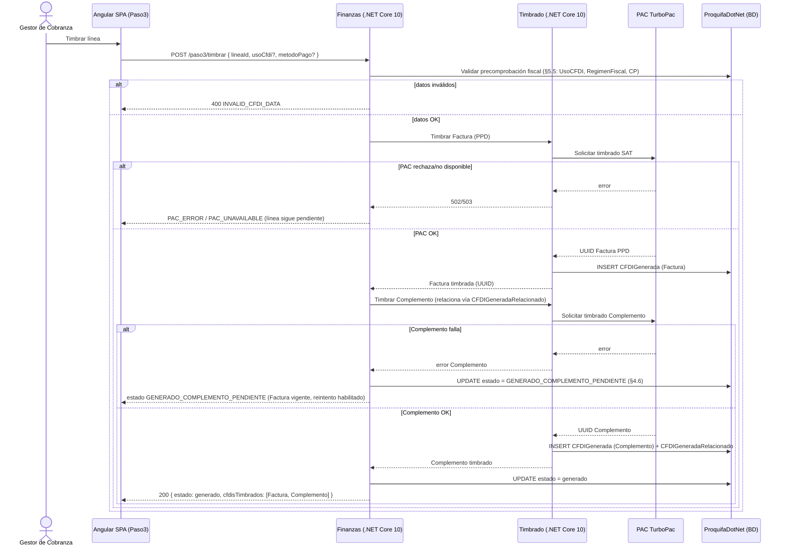
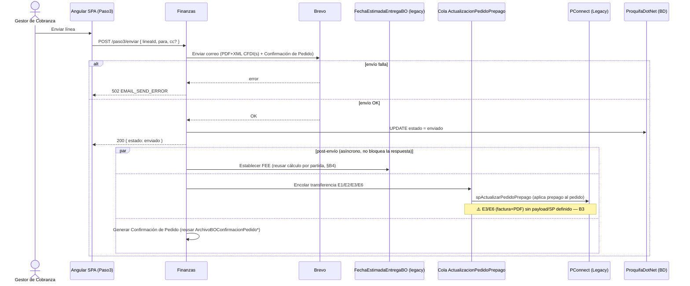

# Diseño de la Solución — R16A-RE-FU-028 · Validar Cobro: Paso 3 México

**Versión:** 4.0 (Avance interno — bloqueantes activos, ver banner)
**Fecha:** 2026-07-23 (v3.0: 2026-07-06 · v2.0: 2026-07-01)
**Autor:** Jose Armando Santiago
**Estado:** Avance — diseño no finalizado. Válido como referencia de progreso, **con las secciones marcadas en amarillo sin cerrar**.
**Reemplaza:** v3.0 (2026-07-06). v4.0 incorpora: 4 comentarios sin resolver en el DIS-SOL (renombran endpoints, cambian canal Legacy y app de correo), corrección de dueño de DUDA-126/gap "Fletes", y 2 hallazgos de la revisión de RE-030 (destinatario CxC faltante, mismatch de PAC).

---

## ⚠️ Léase antes de usar este documento como referencia

==Este documento es un AVANCE, no un diseño cerrado. Tiene 4 bloqueantes activos (B1, B3, B4 y acceso a repo) + 4 comentarios de JD sin resolver (§0-ter) + el gap "Fletes"/DUDA-126 sin dueño (§0-ter) y varias decisiones que pueden cambiar el modelo de datos si se resuelven distinto. Si tomas esto como referencia para tu propio análisis o diseño (front o back de otro requerimiento), revisa primero §0-bis, §0-ter y §13 — están marcados en amarillo los puntos que aún no están cerrados.==

## 0-ter. Qué cambió en v4.0 (23-jul-2026 — sync contra RAD v1.5 y hallazgos nuevos del repo de JD)

| Tema | v3.0 decía | v4.0 corrige/confirma | Efecto |
|---|---|---|---|
| Canal Legacy (§5.3) | Reutilizar `ActualizacionPedidoPrepago`/`spActualizarPedidoPrepago` | ==**JD (23-jul, comentario sin resolver en el .docx):** el canal NO es esa cola. Se actualiza vía `PQF.Logistica TramitarPedido`, que llama a un **nuevo aplicativo `LegacySync`**. Reemplaza la recomendación de v3.0.== | Invalida §5.3/§8 (decisión de stack) — el hallazgo de BD viva queda como contexto histórico, no como diseño vigente |
| Endpoints Finanzas (§5.1) | `/api/validar-cobro/paso3/*` | ==JD pide renombrar a `/api/v1/validate-collection/...`, unificando timbrado de Factura y Complemento en un solo endpoint `stamp` (con retry pendiente de detallar). **Ojo:** el prefijo `validate-collection` está reconocido por el equipo pero SIN decisión formal (`Endpoints-Observaciones-vs-Convencion.md` D1, JD 17-jul) — puede volver a cambiar.== | Reemplaza §5.1 completo |
| Envío de correo (§5.3/§8) | Brevo directo (`BrevoEmailService`, NO-FU-001) | ==JD: NO usar Brevo directo — usar `ProquifaDotNet.EnvioCorreo` ("Aplicativo Nuevo de Envío de Correo"). **Crítico:** confirmado en `Endpoints-Observaciones-vs-Convencion.md` (D12) que este aplicativo bloquea explícitamente RE-019/028/029/030/032/033 — no tiene ningún RE-FU/NO-FU que lo documente todavía.== | Reemplaza el actor Brevo del endpoint `send` |
| DUDA-126 / config fiscal producto | No existía en v3.0 | Config fiscal (ClaveProdServ/ClaveUnidad/IVA) resuelta a nivel Familia (23-jul), pero **dueño real es RE-FU-015** (no RE-019/001/013-014) — RE-015 congela el snapshot al tramitar; 028 solo lee 2 niveles después. Precedencia Producto→Familia vive en doc transversal sin RE-FU dueño (`Guia_Tecnica_Perfil_Fiscal_IVA_MX.md`, repo JD), sigue "pendiente confirmar con cliente" ahí también | Nuevo bloqueante — ver §2 |
| "Fletes" no modelado | No existía en v3.0 | Gap reportado por Valdemar Farina (Chat, 22/23-jul): clave de servicio ya asignada (78102205) pero sin Familia/producto en R16. No aparece en RE-015, RE-019 ni en la Guía Técnica — blind spot de todo el equipo | Nuevo bloqueante sin dueño — ver §2 |
| Destinatario correo Complemento (§3.5, RF-09) | `Para`=contacto, `CC`=ESAC | ==RE-030 (§3.3 de sus Observaciones) detectó que falta el "analista de Cuentas por Cobrar" en CC para líneas Complemento (su Criterio J2) — JD lo dejó como coordinación pendiente sin dueño.== | Gap de diseño real en el modal Enviar — ver §3.5 |
| Nombre del PAC | "PAC TurboPac" (asumido en todo el documento) | ==RE-030 (§3.4) reporta mismatch: el requisito dice "TurboPac", pero el diseño técnico de RE-018 (motor de timbrado que 028 reutiliza) usa `SapTimbradoClient`/"SAP". Sin resolver.== | Riesgo de que todas las menciones a "TurboPac" en este documento estén mal — confirmar antes de fijar diseño |
| Retry del timbrado (Complemento) | Sin mecanismo propio documentado | RE-030 (§4.2 de sus Observaciones) recomienda que el retry de timbrado sea un requisito transversal propio, no que cada uno (028/030/NC) lo invente por separado | Si 028 diseña su propio retry para el endpoint `stamp` (pedido de JD), verificar que no diverja de lo que se defina transversal |

---

## 0-bis. Qué cambió en v3.0 (6-jul-2026 — cruce contra RAD y DIS ya entregados)

| Tema | v2.0 decía | v3.0 corrige/confirma | Efecto |
|---|---|---|---|
| Relación Complemento↔Factura / NC | §4.4: mantener el `ALTER` que agrega `IdCFDIRelacionado` (self-ref en `CFDIGenerada`) | ==`CFDIGeneradaRelacionado` YA EXISTE (1:N, `UUID`+`ClaveTipoRelacion`) y RE-FU-032 ya construye sobre ella para NCs. El ALTER propuesto es redundante e incorrecto — NO crearlo.== | Corrige §4.4 y §5.2 — usar la tabla existente, no un ALTER nuevo |
| `EmpresaFolio` | §2.3/§4.1 lo cita como foliador sin más detalle | Existe, pero en la BD **`ProquifaDotNetTimbrado`** (RE-019), no en `ProquifaDotNet` — confirmado por los DIS de RE-030/032 | Ya no es un GAP de "no existe", es un GAP de acceso al repo/BD de Timbrado |
| `CP01` en `catUsoCFDI` | No se mencionaba en v2 | ==Falta el seed `CP01` — pero RE-FU-030 ya trae el DML de corrección. Solo falta coordinar que se ejecute.== | Resuelve lo que iba a ser un GAP nuevo |
| E1 (Buzón de Cobros) | §12: "RE-FU-008 aporta `fccPagoCliente`" | El DIS de RE-008 entrega `fccFolioPagoCliente` (folio/pendiente), no `fccPagoCliente` directo — ese se materializa después, probablemente en RE-FU-024 (sin diseño aún) | Corrige nomenclatura en §5.3/§12 |
| NC → cobro | No modelado | Existe `fccNotaCreditoPedido` (confirmado por RE-032) para la aplicación NC↔cobro | Agregar al modelo de datos |
| `fccNotaCredito.IdTPProformaPedido` | NOT NULL (verificado en BD) | ==RE-FU-032 ya planea `ALTER ... NULL` antes de su propio DDL== — deja de ser NOT NULL | Actualizar supuesto de datos |
| NO-FU-003 (LegacyBridge) | Sin diseño, sin ubicación clara | ==Confirmado por búsqueda exhaustiva: NO vive en RE-FU-016 (ese doc es solo proxy de archivos) ni en ningún otro DIS entregado. Sigue 100% sin diseño.== | B3 se mantiene bloqueante, ya sin hipótesis pendiente |

---

# 0. Qué cambió respecto a v0.1

v0.1 fue un contrato de frontend con nombres de entidad hipotéticos. v2 está **anclada al esquema real** y resuelve o reclasifica varios GAPs con datos verificados en BD:

| Tema | v0.1 asumía | v2 verificado en BD | Efecto |
|---|---|---|---|
| Flag de controlados | `tipoOrigen = PROFORMA_CONTROLADA` | `tpProformaPedido.Controlados` (bit, nullable). Existe además `Empresa.FacturaControlados` | Lógica condicional se lee de columna real |
| Discriminador de CFDI | Catálogo/FK nuevo `catTipoCFDI` | `CFDIGenerada.TipoDocumento` (varchar) **ya existe** | El catálogo nuevo es parcialmente redundante — decisión de diseño §4.4 |
| Campos receptor CFDI 4.0 | Riesgo de faltar | `CFDIGenerada.RegimenFiscalReceptor` y `CodigoPostalReceptor` **ya existen** | Compliance receptor cubierto a nivel CFDI; fuente (`DatosFacturacionCliente`) sigue nullable |
| FEE cabecera | — | `tpPedido.FechaEstimadaEntrega` **NO existe**; `tpPartidaPedido.FechaEstimadaEntrega` sí (datetime) | El `ALTER` sí se ejecuta; granularidad es decisión de negocio real (B4) |
| Contacto del pedido | `tpPedido.IdContacto` | Real: `tpPedido.IdContactoCliente` + `IdContactoEntrega` | Corrige el modal Enviar (OQ-3) |
| Default Uso CFDI | Genérico | `tpPedido.IdCatUsoCFDI` + `DatosFacturacionCliente.IdCatUsoCFDI` (ambos nullable) | Origen del default + gap de fallback §7 |
| Canal Legacy | "pendiente" total | Canal existente confirmado: `PConnectProquifaDotNet.ActualizacionPedidoPrepago` (cola int↔GUID vía `Pedidos`) | B3 pasa de "sin diseño" a "reutilizar canal existente, confirmar payload" |
| Limbo cascada PPD | GAP abierto | Estado `GENERADO_COMPLEMENTO_PENDIENTE` propuesto | Cierra el edge-case fiscal más grave §4.6 |

---

# 1. Introducción

## 1.1 Propósito

El Paso 3 del wizard **Validar Cobro** cierra el ciclo de cobranza para clientes de **Región México**: por cada documento de la asociación cerrada en el Paso 2 (RE-FU-026), el sistema determina el tipo de comprobante fiscal a emitir (Factura, Factura Anticipo o Complemento de Pago), y el Gestor de Cobranza lo **previsualiza, timbra** (PAC TurboPac) **y envía** al cliente de forma individual. Al enviar cada línea, el backend dispara tres acciones automáticas: establecer la Fecha Estimada de Entrega (FEE), transferir el pedido y sus documentos a Legacy, y generar la Confirmación de Pedido adjunta al correo.

## 1.2 Alcance — incluye

- Tercera pantalla del wizard Validar Cobro (Facturación y Envío) **solo México**.
- Listado de líneas derivadas de la asociación del Paso 2 (una por documento fiscal a emitir).
- Lógica condicional de tipo de documento por línea (Factura / Factura Anticipo / Complemento de Pago).
- Edición por línea de **Uso CFDI** (catálogo SAT `c_UsoCFDI`) y **Método de Pago** (PPD/PUE) cuando aplica.
- Previsualización PDF, timbrado (incluida **cascada PPD**: Factura PPD + Complemento), y envío con Brevo.
- Inclusión de NCs aplicadas en el nodo `CFDIRelacionados`.
- Máquina de estados por línea con persistencia y reanudación del wizard.
- Bloqueo de navegación atrás e inmutabilidad post-timbrado.
- Acciones post-envío: FEE, transferencia Legacy (E1/E2/E3/E6), Confirmación de Pedido.

## 1.3 Alcance — no incluye (detalle en §11)

- Región Perú (requisito independiente).
- Cancelación fiscal SAT y re-timbrado.
- Operaciones masivas.
- Diseño/generación del PDF y ETL del **Complemento de Pago** (RE-FU-030), y de **Notas de Crédito** (RE-FU-032/034).
- Módulo Notas de Crédito.

> ==**Bloqueante — config fiscal de producto (DUDA-126) y gap "Fletes".** RE-028 NO es dueño del catálogo Producto/Familia (dueño real: RE-FU-015, que resuelve la precedencia Producto→Familia y congela el snapshot en `fccFacturaPartida` al tramitar el pedido — 028 solo lo lee 2 niveles después). "Fletes" tiene clave de servicio ya asignada por el cliente (78102205) pero no existe como Familia/producto en R16 hoy — si un pedido factura un flete, 028 no tiene de dónde jalar `ClaveProdServ`/impuesto para esa línea del CFDI. Sin dueño confirmado — escalar a JD/Valdemar. Ver §0-ter y RAD Duda #25.==

---

# 2. Visión general del diseño

## 2.1 Objetivo técnico

Materializar fiscalmente, línea por línea, las asociaciones cobro↔documento del Paso 2, orquestando el timbrado en `ProquifaDotNet.Timbrado`, la persistencia PDF en MinIO (`ProquifaDotNet.Finanzas` + DocumentBuilder RE-FU-021) y las acciones post-envío, con el backend como única fuente de verdad del estado y de la orquestación PAC/Legacy/FEE/correo. El frontend dispara acciones simples y refleja estado.

## 2.2 Componentes involucrados

```
┌──────────────────────────── Angular SPA — Validar Cobro ────────────────────────────┐
│  WizardValidarCobro (shell)                                                          │
│   ├── StepperComponent · CabeceraClienteComponent                                    │
│   └── Paso3FacEnvioComponent                                                          │
│        ├── LineasListComponent → LineaItemComponent (×N)                              │
│        └── ModalPrevisualizar · ModalExitoTimbrado · ModalEnviar                      │
│  NgRx: ValidarCobroState.paso3 { lineas: LineaFiscal[] } · Timbrado/Envio Effects     │
└───────────────────────────────────┬──────────────────────────────────────────────────┘
                                     │ REST + JWT
        ┌────────────────────────────┴───────────────────────────────────────────────┐
        │  ProquifaDotNet.Finanzas (.NET Core 10) — orquestador Paso 3                 │
        │   inicialización líneas · lógica tipo CFDI · auto-guardado · envío Brevo     │
        │   post-envío (FEE, Legacy, Confirmación de Pedido)                           │
        └───┬──────────────┬───────────────┬───────────────┬──────────────┬───────────┘
            │ API          │ API           │               │              │
   ┌────────┴───┐  ┌───────┴────────┐  ┌───┴──────────┐  ┌─┴───────────┐  │
   │ .Timbrado  │  │ ProquifaDotNet │  │ DocumentBldr │  │ Brevo (mail)│  │
   │ PAC TurboPac│  │ (datos + BD)   │  │ PDF FAC/CDP  │  │             │  │
   └────────────┘  └────────────────┘  └──────────────┘  └─────────────┘  │
                                                                          │ canal existente
                                       ┌──────────────────────────────────┴──────────────┐
                                       │  Legacy (PConnect) vía intermedia                │
                                       │  PConnectProquifaDotNet.ActualizacionPedidoPrepago│
                                       │  + Pedidos (map int↔GUID) · linked server LegacyAux│
                                       └───────────────────────────────────────────────────┘
```

## 2.3 Aplicativos y responsabilidades

| Capa | Aplicativo | Responsabilidad |
|---|---|---|
| BD | ProquifaDotNet | 3 catálogos + 2 tablas + 2 ALTER + 1 vista |
| Orquestación Paso 3 | ProquifaDotNet.Finanzas | líneas, tipo CFDI, auto-guardado, envío, post-envío |
| Timbrado | ProquifaDotNet.Timbrado | PAC TurboPac, INSERT `CFDIGenerada`, folio `EmpresaFolio` (vive en BD `ProquifaDotNetTimbrado`, no en `ProquifaDotNet` — confirmado 6-jul) |
| PDF | DocumentBuilder | `*_MEX_FAC` (existe), `*_MEX_CDP` (nuevo), `*_MEX_COP` (RE-FU-030) |
| Legacy | Finanzas → cola intermedia | E1/E2/E3/E6 (ver §5.3) |

---

# 3. Diseño funcional detallado

## 3.1 Carga inicial del Paso 3

Al avanzar desde el Paso 2, Finanzas crea una fila en `fccDocumentoFiscalCobro` por cada documento de la asociación. El **tipo de documento fiscal** se determina así (verificado contra columnas reales):

| Origen (Paso 2) | Condición | Tipo resultante |
|---|---|---|
| `fccPagoFacturaPedido` | `tpProformaPedido.Controlados = 0` (o NULL) | `factura` |
| `fccPagoFacturaPedido` | `tpProformaPedido.Controlados = 1` | `facturaanticipo` |
| `fccPagoFacturaAdelanto` | — | `complementopago` |

> **Nota de diseño:** la columna real es `tpProformaPedido.Controlados` (no `HayControlados`). Existe además `Empresa.FacturaControlados` (bit) a nivel empresa emisora — verificar si actúa como **gate** (la empresa debe permitir facturación de controlados) o solo como default. Esto debe confirmarse con RE-FU-013/014 (origen del flag por proforma).

Si al reingresar ya existen filas para el cobro, se recuperan desde `vfccDocumentoFiscalCobro` sin reinicializar (Regla 16 / J2).

## 3.2 Máquina de estados por línea

```
pendiente ──[Timbrar]──► generado ──[Enviar]──► enviado   (terminal)
                │
                └─(cascada PPD: Factura OK, Complemento falla)──► GENERADO_COMPLEMENTO_PENDIENTE
                                                                       │
                                                    [Reintentar Complemento] ──► generado
```

- `pendiente → generado` es **irreversible** (documento timbrado, inmutable — Regla 17).
- **`GENERADO_COMPLEMENTO_PENDIENTE`** (estado nuevo propuesto): resuelve el limbo de la cascada PPD (§4.6). La UI muestra badge "Complemento pendiente" y habilita **solo** el reintento del Complemento, nunca el re-timbrado de la Factura.
- El wizard cierra (Regla 20 / K2) cuando **todas** las líneas están `enviado`.

## 3.3 Criterios de aceptación (trazabilidad requisito → diseño)

| Criterio | Cubierto por |
|---|---|
| A1–A2 cabecera/stepper | `CabeceraClienteComponent`, `StepperComponent` (reuso Paso 1/2) |
| B1–B2 listado | `fccDocumentoFiscalCobro` + `vfccDocumentoFiscalCobro` |
| C1–C3 tipo documento | §3.1 (`tpProformaPedido.Controlados`) |
| D1 Uso CFDI | combo `catUsoCFDI`; default `tpPedido.IdCatUsoCFDI` |
| D2–D3 Método de Pago | `catMetodoDePagoCFDI`; PPD fijo en Complemento |
| E1–E2 NCs | `fccNotaCredito.IdCFDI` → `CFDIRelacionados` |
| F1–F4 flujo | endpoints previsualizar/timbrar/enviar §5.1 |
| G1–G4 estados | §3.2 |
| H1–H4 post-envío | §5.3 |
| I1–I3 correo | modal Enviar §3.5 |
| J1–J3 persistencia/inmutabilidad | auto-guardado + estado backend |
| K1–K2 errores/cierre | catálogo de errores §5.4 |

## 3.4 Reglas técnicas visibles en UI

| Regla | Condición | Comportamiento |
|---|---|---|
| Uso CFDI editable | tipo ∈ {factura, facturaanticipo} ∧ estado = pendiente | combo habilitado |
| Uso CFDI solo lectura | tipo = complementopago | valor de la factura origen |
| Método de Pago editable | tipo ∈ {factura, facturaanticipo} ∧ estado = pendiente | radio PPD/PUE |
| Método de Pago fijo PPD | tipo = complementopago | "PPD" solo lectura |
| Aviso cascada | PPD en línea factura | "Se generarán 2 CFDIs: Factura PPD + Complemento" |
| Bloqueo edición | estado ≠ pendiente | controles deshabilitados |
| Bloqueo navegación atrás | ≥1 línea con estado ≠ pendiente | Paso 1/2 deshabilitados |

## 3.5 Modal Enviar (I2/I3)

```
Para:      contacto del pedido (editable)   ← tpPedido.IdContactoCliente
CC:        ESAC asignado (editable, sugerido)
           ⚠️ si tipo = complementopago, agregar también al analista de Cuentas por Cobrar (ver nota v4.0 abajo)
Asunto:    generado por sistema (no editable) — ver OQ-2
Adjuntos:  PDF+XML por CFDI de la línea + PDF Confirmación de Pedido (no editables)
Notas:     textarea libre opcional
```

> **Corrección v2 (OQ-3):** el destinatario proviene de `tpPedido.IdContactoCliente` (contacto de facturación/pedido). Existe también `tpPedido.IdContactoEntrega`. Ambos son **nullable** → cuando `IdContactoCliente` es NULL, el campo Para queda vacío. ~~el envío se bloquea hasta captura manual (regla de fallback propuesta, confirmar con negocio)~~ **RESUELTO — DUDA-089 (2026-08-21):** se usa el mismo mecanismo de envíos que el sistema actual ya tiene ante contacto ausente o múltiple; no se construye regla de fallback nueva, no requiere desarrollo adicional.
>
> ==**Gap detectado v4.0 (RE-030 §3.3 de sus Observaciones):** el Criterio J2 de RE-030 exige que las líneas `complementopago` incluyan en CC al "analista de Cuentas por Cobrar" — este diseño hoy solo trae contacto+ESAC. Acción: el endpoint `send` debe detectar `tipo = complementopago` y agregar ese destinatario en CC. Sin dueño ni fecha confirmados con RE-030 todavía — ver RAD Duda #27.==

---

# 4. Diseño de componentes (Data Model + persistencia)

## 4.1 Infraestructura existente reutilizada (verificada en BD)

| Objeto | Estado en BD | Uso en Paso 3 |
|---|---|---|
| `CFDIGenerada` | Existe. Columnas clave: `TipoDocumento`, `UsoCFDI`, `MetodoDePago`, `Serie`, `Folio`, `IdCFDI`, `RFCReceptor`, `RazonSocialReceptor`, **`RegimenFiscalReceptor`**, **`CodigoPostalReceptor`**, `Moneda`, `TipoDeCambio`, `Subtotal`, `Total` | Registro central de timbrado |
| **`CFDIGeneradaRelacionado`** | Existe (confirmado v3.0). `IdCFDIGenerada` (FK padre), `UUID`, **`ClaveTipoRelacion`**, `Activo`. BO `CFDIGeneradaRelacionadoBO` | Nodo `CfdiRelacionados` (1:N) — Complemento↔Factura PPD, aplicación anticipo (07), NCs (01). **Reemplaza** el `ALTER IdCFDIRelacionado` de v2.0 (§4.4) |
| `fccPagoFacturaPedido` | Existe. `IdFCCPagoCliente`, `IdTPProformaPedido`, `NumeroDeParcialidad`, `Monto`, `MontoPendienteAnterior` — ==el DIS de RE-FU-026 propone insertar columnas distintas (`MontoAplicado`/`TipoCambio`/`FechaRegistro`/`Activo`); verificar con su autor antes del DDL, ver §12/§13== | FK origen proforma |
| `fccPagoFacturaAdelanto` | Existe. `IdFCCPagoCliente`, `IdTPProformaAdelanto`, **`IdCFDIGenerada`** (UUID FAA), `NumeroParcialidad` | FK origen FAA + UUID para `CFDIRelacionados` |
| `fccNotaCredito` | Existe. `IdCFDI`, `IdCFDIGenerada`, `Aplicada`, `Monto`, `MXN/USD`. ==`IdTPProformaPedido` deja de ser NOT NULL — RE-FU-032 planea `ALTER ... NULL`== | NCs → `CFDIRelacionados` |
| `fccNotaCreditoPedido` | Existe (confirmado por RE-FU-032, "sin cambios") — columnas exactas aún no verificadas en BD viva por este equipo | Aplicación NC↔cobro; 028 la lee indirectamente al referenciar una NC ya aplicada |
| `tpProformaPedido` | Existe. **`Controlados`**, `IdCFDIGenerada`, `IdContactoCliente` | Flag condicional |
| `tpProformaAdelanto` | Existe. `IdCFDIGenerada` | UUID FAA (Complemento) |
| `tpPedido` | Existe. `FolioPedidoInterno`, `IdCatUsoCFDI`, `IdContactoCliente`, `IdContactoEntrega`. **`FechaEstimadaEntrega` NO existe** | Cabecera pedido / FEE (ALTER) |
| `tpPartidaPedido` | Existe. `FechaEstimadaEntrega` (datetime) | FEE por partida (tramitación) |
| `DatosFacturacionCliente` | Existe. `RFC`, `RazonSocial`, `IdCatRegimenFiscal` (null), `IdCatUsoCFDI` (null) | Receptor CFDI 4.0 |
| `Empresa` | Existe. `RFC`, `RazonSocial`, `IdCatRegimenFiscal`, **`FacturaControlados`** | Emisor CFDI 4.0 |
| `catUsoCFDI` / `catMetodoDePagoCFDI` | Existen. PK `IdCatUsoCFDI`/`IdCatMetodoDePagoCFDI`, `Clave` | Combos SAT |

## 4.2 Objetos nuevos (no existen en BD — confirmado)

`fccDocumentoFiscalCobro`, `fccConfirmacionPedido`, `catTipoDocumentoFiscal`, `catDocumentoFiscalCobroEstado`, `catTipoCFDI`. Los scripts DDL completos viven en `R16A-RE-FU-028_BD.md` (Juan David); aquí se documentan las **decisiones de diseño** y sus correcciones.

## 4.3 Entidad central — `fccDocumentoFiscalCobro`

Una fila por documento fiscal de la asociación. Apunta a **exactamente uno** de `fccPagoFacturaPedido` / `fccPagoFacturaAdelanto` (CHECK de exclusividad), evitando duplicar `(IdFCCPagoCliente + IdTPProforma*)`. Campos de resultado: `IdCFDIGeneradaFactura`, `IdCFDIGeneradaComplemento` (solo cascada PPD), `FechaGeneracion`, `FechaEnvio`.

**Ajustes v2:**
1. **Estado `GENERADO_COMPLEMENTO_PENDIENTE`** agregado a `catDocumentoFiscalCobroEstado` (§3.2).
2. **Optimistic locking:** agregar columna `RowVersion rowversion` para prevenir doble timbrado concurrente (§4.5).
3. Índice por estado (patrón de consulta de cierre de wizard B8):
   ```sql
   CREATE INDEX IX_fccDocumentoFiscalCobro_Estado
     ON dbo.fccDocumentoFiscalCobro (IdCatDocumentoFiscalCobroEstado)
     INCLUDE (IdFCCPagoFacturaPedido, IdFCCPagoFacturaAdelanto);
   ```
4. `RutaArchivoPDF` en `fccConfirmacionPedido`: usar `nvarchar(1000)` o key relativo de MinIO (evita truncamiento §3.2 de JD).

## 4.4 Decisión: `catTipoCFDI` nuevo vs. `CFDIGenerada.TipoDocumento` existente — y relación Complemento/NC

`CFDIGenerada` **ya tiene** `TipoDocumento varchar`. El diseño de JD propone además `catTipoCFDI` + FK `IdCatTipoCFDI` + un `ALTER` self-ref `IdCFDIRelacionado`. Decisión (corregida v3.0):

- ==**NO crear el `ALTER CFDIGenerada.IdCFDIRelacionado`.** Ya existe `CFDIGeneradaRelacionado` (`IdCFDIGenerada` FK padre + `UUID` + `ClaveTipoRelacion` + `Activo`), con BO `CFDIGeneradaRelacionadoBO`. La relación CFDI 4.0 `CfdiRelacionados` es 1:N (un CFDI puede relacionar varios UUIDs con distinto tipo) — el self-ref de v2.0 la modelaba mal (1:1). RE-FU-032 (Notas de Crédito) ya construye sobre `CFDIGeneradaRelacionado` para sus NCs; usar el mismo patrón para la cascada Complemento↔Factura PPD (`ClaveTipoRelacion` = tipo de relación SAT) en vez de inventar un campo nuevo.==
- Para el discriminador de tipo de negocio (factura / facturaanticipo / complementopago): **mantener `catTipoDocumentoFiscal` nuevo** en `fccDocumentoFiscalCobro` — `CFDIGenerada.TipoDocumento` (I/E/P) no distingue factura de facturaanticipo (ambos son "I"). El `catTipoCFDI` que proponía JD sí solapa con `TipoDocumento` y es el candidato a **no** crear.
- El script de normalización de registros previos (FAA de RE-FU-019) debe validar PPD vs PUE **antes** de poblar (`facturappd` por defecto es incorrecto para PUE — §3.5 de JD).
- ==Pendiente confirmar con el autor de RE-FU-030 (Alberto Pantoja): su DIS del Complemento no menciona `CFDIGeneradaRelacionado` en ningún punto, solo un nodo XML `DocumentoRelacionadoCp`. Verificar si el INSERT en la tabla ocurre en un paso no documentado, o si hay que agregarlo — de lo contrario la cascada queda inconsistente con el patrón que ya usa RE-032 para NCs.==

## 4.5 Concurrencia (doble timbrado)

Sin candado, dos sesiones del mismo cobro pueden timbrar 2 CFDIs válidos ante SAT para la misma línea. Mitigación:
- `RowVersion` en `fccDocumentoFiscalCobro` + transición de estado condicional (`UPDATE ... WHERE Estado = pendiente AND RowVersion = @rv`).
- El consumo de folio ya es atómico (`EmpresaFolio` con UPDLOCK), pero eso no impide dos líneas timbrando; el candado debe ser sobre `IdFCCDocumentoFiscalCobro`.

## 4.6 Cascada PPD y estado limbo (edge-case fiscal crítico)

Una acción del usuario (Timbrar PPD) genera 2 CFDIs secuenciales en backend. Si la Factura PPD timbra pero el Complemento falla:
- La Factura PPD **está vigente ante SAT** — no se ignora.
- Sin estado dedicado, la línea quedaría en `pendiente` y un reintento timbraría **una segunda Factura PPD** (error fiscal grave).
- **Solución v2:** transición a `GENERADO_COMPLEMENTO_PENDIENTE`; se persiste `IdCFDIGeneradaFactura`, `IdCFDIGeneradaComplemento = NULL`. El reintento invoca **solo** el timbrado del Complemento con el UUID de la Factura ya vigente. Esto también desbloquea el cierre del wizard (una línea en limbo ya no impide B8 indefinidamente si el reintento la lleva a `generado`→`enviado`).

## 4.7 Diagramas de secuencia (obligatorio — ver CLAUDE.md §Convenciones DIS/RAD)

### Flujo A — Timbrar línea (incluye cascada PPD, Escenario B)



### Flujo B — Enviar línea + post-envío México (FEE, Legacy, Confirmación)



---

# 5. Puntos de integración y contrato

## 5.1 API Contracts (Finanzas)

> ==**Renombrado v4.0 por comentarios de JD (23-jul, .docx sin resolver, fileId `16Hr_XLGyBzj7lqC5BVt1Z41WSgyLqrX8heYje5PG0ZI`).** Reemplaza la convención `/api/validar-cobro/paso3/*` de abajo. **Ojo:** el prefijo `validate-collection` está reconocido por el equipo pero SIN decisión formal cerrada (`Endpoints-Observaciones-vs-Convencion.md` D1, JD 17-jul — 3 opciones abiertas). Timbrado de Factura y Complemento ahora comparten el mismo endpoint `stamp` — ya no hay `timbrar-complemento` separado.==

```
GET  /api/v1/validate-collection/fiscalDocumentStep/initialize
  200: { lineas: LineaFiscal[], clienteId, wizardEstado:{paso} }
  403 sin permiso · 404 cobro inexistente · 409 paso3 no disponible

PUT  /api/v1/validate-collection/fiscalDocumentLine/{idLinea}/cfdiConfig   { usoCfdi?, metodoPago? }   204

POST /api/v1/validate-collection/fiscalDocumentLine/{idLinea}/pdfPreview
  200: { urlPdf }        400 lineaId inválido · 409 ya timbrada

POST /api/v1/validate-collection/fiscalDocumentLine/{idLinea}/stamp
  { usoCfdi?, metodoPago? }   // req si tipo ≠ complementopago. Unificado: timbra Factura (cascada PPD) y reintento de Complemento (limbo §4.6) — mismo endpoint.
  200: { lineaId, estado, cfdisTimbrados: CfdiTimbrado[] }   // 1 o 2
  409 estado incorrecto · 502 PAC_ERROR (detalle PAC) · 503 PAC_UNAVAILABLE
  ==JD: este endpoint DEBE tener retry para el timbrado del Complemento — mecanismo aún sin detallar. Ver §0-ter (RE-030 recomienda que el retry sea transversal, no propio de 028).==

POST /api/v1/validate-collection/fiscalDocumentLine/{idLinea}/send
  { para, cc?, notasExtras? }
  200: { lineaId, estado: enviado, wizardCerrado }
  400 email inválido · 409 no timbrada · 502 EMAIL_SEND_ERROR
  ==JD: NO invocar Brevo directo — este endpoint debe llamar a `ProquifaDotNet.EnvioCorreo` ("Aplicativo Nuevo de Envío de Correo"). Contrato/URL pendiente (crítico, bloquea también RE-019/029/030/032/033 — ver §0-ter).==
```

**Propuesta original (histórica, superada por la corrección de JD de arriba — se conserva solo como referencia):**

```
GET  /api/validar-cobro/paso3/{idFccPagoCliente}
POST /api/validar-cobro/paso3/previsualizar   { lineaId }
POST /api/validar-cobro/paso3/timbrar         { lineaId, usoCfdi?, metodoPago? }
POST /api/validar-cobro/paso3/timbrar-complemento { lineaId }
POST /api/validar-cobro/paso3/enviar          { lineaId, para, cc?, notasExtras? }
PUT  /api/validar-cobro/paso3/autosave        { lineaId, usoCfdi?, metodoPago? }
```

## 5.2 Timbrado (Finanzas → Timbrado)

Escenarios (Reglas 7/10, F2):
- **A — factura PUE:** 1 CFDI (`TipoDocumento = 'I'`, `catTipoDocumentoFiscal` = factura).
- **B — factura PPD:** cascada 2 CFDIs; el Complemento se relaciona a la Factura PPD vía **`CFDIGeneradaRelacionado`** (`UUID` de la Factura + `ClaveTipoRelacion`) — no un `ALTER` nuevo (§4.4). Fallo parcial → §4.6.
- **C — facturaanticipo:** 1 CFDI, tipo relación **07** en XML (⚠️ B1, §5.5).
- **D — complementopago desde FAA:** 1 CFDI, relacionado al UUID FAA (`tpProformaAdelanto.IdCFDIGenerada`) también vía `CFDIGeneradaRelacionado`.

Post-timbrado exitoso: `PersistirFacturaMexicoPdfService` (RE-FU-021 GAP-10) genera PDF definitivo → MinIO → INSERT `Archivo` → UPDATE `CFDI`. El PDF del Complemento (`*_MEX_COP`) depende de **RE-FU-030**.

## 5.3 Legacy — transferencia post-envío (B3)

> ==**Corrección v4.0 (JD, 23-jul, comentario sin resolver en el .docx) — INVALIDA la recomendación de abajo.** El canal a Legacy NO es la cola `ActualizacionPedidoPrepago`/`spActualizarPedidoPrepago`. Se actualiza vía `PQF.Logistica TramitarPedido`, que llama a un **nuevo aplicativo `LegacySync`**. El diseño de RE-028 debe orquestar contra `TramitarPedido`/`LegacySync`, no contra el canal descrito abajo. Confirmado también como brecha D13 en `Endpoints-Observaciones-vs-Convencion.md` (misma B3, no es hallazgo nuevo). Pendiente: contrato de payload de `LegacySync` para E1/E2/E3/E6 — sigue igual de bloqueante, solo cambia el destino.==

**Hallazgo previo (cross-DB, verificado 2026-07-01 — contexto histórico, ya NO es la recomendación vigente tras la corrección de JD de arriba):** el flujo prepago ya cuenta con un canal `.NET → Legacy` en producción-dev:

- Cola intermedia **`PConnectProquifaDotNet.ActualizacionPedidoPrepago`** (existe, verificada).
- Mapa int↔GUID **`PConnectProquifaDotNet.Pedidos`** (`PedidoPQF` = `tpPedido.IdTPPedido`; `PedidoLegacy` = `PPedidos.FK01_Pedido`).
- **Bisagra** pedido↔Legacy: `tpPedido.FolioPedidoInterno` = `PPedidos.CPedido` (verificada; `FolioPedidoInterno` existe).
- Linked servers bidireccionales `LegacyAux` (2401→2402) / `PQF2Aux` (2402→2401).

**Recomendación de diseño para B3:** en lugar de inventar canal, **reutilizar `ActualizacionPedidoPrepago`** como cola de transferencia asíncrona para E1/E2/E3/E6. Esto encaja el Paso 3 en el patrón de **saga distribuida de 3 BDs** ya existente para prepago. ==El SP consumidor `spActualizarPedidoPrepago` **sí existe** (confirmado 4-jul, 6610 filas en la cola) pero **solo aplica el prepago al pedido** — no transfiere factura ni PDF. E3/E6 necesitan payload/SP nuevo o una extensión del canal; "reutilizar el canal" ≠ "reutilizar el SP para todo". Sigue pendiente con Arquitectura.== Confirmado además: (c) dead-letter / reintento (una línea `enviado` en .NET no debe quedar sin reflejar en Legacy sin compensación) — sin diseñar aún.

==**NO-FU-003 (mecanismo LegacyBridge) sigue sin ningún diseño formal**, confirmado por búsqueda exhaustiva en todos los DIS-SOL entregados (6-jul) — no vive dentro de RE-FU-016 como se había considerado (ese documento es solo un proxy de subida/descarga de archivos). Cualquiera que retome este punto debe asumir que empieza de cero.==

| # | Transferencia | Dependencia | Alcance RE-028 | Nota |
|---|---|---|---|---|
| E1 | Buzón de Cobros | RE-FU-008 | ✅ | entrega `fccFolioPagoCliente` (folio/pendiente), no `fccPagoCliente` directo |
| E2 | Proforma | RE-FU-016 | ✅ | — |
| E3 | Factura | RE-FU-019 | ✅ | ==payload/SP no cubierto por `spActualizarPedidoPrepago`== |
| E4 | Complemento | RE-FU-030 | ❌ (RE-030) | — |
| E5 | Nota de Crédito | RE-FU-032 | ❌ | — |
| E6 | PDF Factura | RE-FU-021 | ✅ | atómico con E3 |
| E7/E8 | PDF Complemento / PDF NC | RE-FU-030/034 | ❌ | — |

**Atomicidad:** E3+E6 juntas. Orden alcance RE-028: E2 → E1 → E3+E6.

## 5.4 Catálogo de errores (frontend)

| HTTP | Código | Mensaje | UI |
|---|---|---|---|
| 502 | PAC_ERROR | "Error al timbrar: {detalle PAC}" | toast + línea pendiente |
| 503 | PAC_UNAVAILABLE | "Servicio de timbrado no disponible. Intente más tarde." | toast + pendiente |
| 400 | INVALID_CFDI_DATA | "Datos inválidos. Revise Uso CFDI / Método de Pago / datos fiscales." | toast inline |
| 409 | LINE_ALREADY_STAMPED | (no debería ocurrir) | log + refresh estado |
| 409 | COMPLEMENTO_PENDING | "Factura vigente; falta el Complemento." | acción reintento Complemento |
| 502 | EMAIL_SEND_ERROR | "Error al enviar el correo. Intente nuevamente." | modal abierto |
| 401/403 | UNAUTHORIZED/FORBIDDEN | sesión / permisos | redirect / toast |

## 5.5 Compliance fiscal SAT (validaciones previas al timbrado)

Antes de llamar al PAC, Finanzas debe validar (precomprobación) para evitar XML inválido:
- **UsoCFDI no NULL** (fallback `P01` a definir — `DatosFacturacionCliente.IdCatUsoCFDI` es nullable).
- **RegimenFiscalReceptor** presente (CFDI 4.0 obligatorio; fuente `DatosFacturacionCliente.IdCatRegimenFiscal` es nullable). Nota: `CFDIGenerada` ya tiene la columna destino.
- **DomicilioFiscalReceptor (CP)**: `CFDIGenerada.CodigoPostalReceptor` existe; confirmar su fuente (no hay columna evidente de CP en `DatosFacturacionCliente` — verificar origen del dato).
- **Exportacion** (CFDI 4.0): default `01 - No aplica` para ventas domésticas.
- **Tipo de relación NCs:** para NCs usar **01** (no 07), vía `CFDIGeneradaRelacionado.ClaveTipoRelacion` (§4.4). El 07 es solo aplicación de anticipo (§5.5-B1). Confirmado por RE-FU-032, que ya usa este mismo patrón.
- **Complemento Pagos 2.0:** `NumParcialidad`, `ImpSaldoAnt`, `ImpSaldoInsoluto` requieren control de parcialidades. `fccPagoFacturaAdelanto.NumeroParcialidad` existe → base para la lógica, pero el cálculo de saldos anteriores es de RE-FU-030.
- **UsoCFDI del Complemento (`CP01`):** ==`CP01` está ausente de `catUsoCFDI` — pero el DIS de RE-FU-030 ya trae el DML de corrección (`INSERT INTO catUsoCFDI (ClaveUso, Uso, ...) VALUES ('CP01', 'CP01 Pagos', ...)`). Solo falta coordinar que se ejecute antes de habilitar el Complemento.==

> **✅ B1 — RESUELTO (DUDA-088, 2026-08-21):** ~~la Factura Anticipo con relación **07** exige un CFDI de Anticipo previo al que aplicar. El flujo actual timbra directo sin ese UUID previo → el PAC/SAT puede rechazarlo. Opciones: (A) 2 CFDIs (Anticipo → Factura definitiva rel. 07), (B) Factura PUE normal si el controlado ya se entregó, (C) validar tolerancia de TurboPac (riesgo de auditoría). **Confirmar con asesor fiscal PROQUIFA** — bloquea el Escenario C.~~ Confirmado: es la Opción (A). La Factura Anticipo se timbra SIN relación 07 (sin `CfdiRelacionados`), conforme `Guia_Tecnica_Facturas_Ingreso_MX.md` §6. La relación 07 se usa únicamente en la Factura Final (fuera de alcance de este requisito, se genera en Legacy cuando el controlado completa su proceso regulatorio) para referenciar hacia la Factura Anticipo. Escenario C desbloqueado.
>
> ==**Nota de numeración (6-jul):** el DIS de RE-FU-030 cita "RE-028 B6" refiriéndose a la plantilla de correo del Complemento — pero en este documento B6 = política de reintento de la cascada (§4.6/§13). La plantilla de correo es OQ-2. Sincronizar la numeración con Alberto Pantoja (autor de RE-030) antes de que ambos equipos sigan citándose con IDs distintos para el mismo tema.==

---

# 6. Requisitos no funcionales

- **Timbrado:** 2–10 s; carga por línea (sin spinner global); no bloquea otras líneas.
- **Auto-guardado:** debounce ≤ 2 s (RxJS) sobre cambios de Uso CFDI / Método de Pago.
- **Reanudación:** backend fuente de verdad; el wizard se recupera desde cualquier estado persistido.
- **Carga inicial:** < 1 s (datos ya disponibles desde Paso 2 vía `vfccDocumentoFiscalCobro`).
- **Preview PDF:** < 3 s.
- **Rendimiento consulta líneas:** la vista navega 3+ JOINs (`fccDocumentoFiscalCobro → fccPagoFacturaPedido → fccPagoCliente → Cliente`). Con historial grande, apoyar con los índices filtrados por FK y el índice por estado (§4.3).

---

# 7. Seguridad

- **Auth:** JWT Bearer (estándar R16). Rol requerido pendiente de nombre canónico (**OQ-6**: "Gestor de Cobranza" vs "Analista de Cuentas por Cobrar").
- **Datos fiscales:** XML/PDF son documentos legalmente vinculantes (SAT); no persistir en el store NgRx salvo URLs; no loguear.
- **Inmutabilidad:** el backend es el guardián; el frontend solo refleja estado. Sin bypass client-side.
- **Correo:** validar formato de email en el modal; autorización de destinatarios en backend.

---

# 8. Decisiones de stack

| Decisión | Tecnología | Justificación | Tipo |
|---|---|---|---|
| UI | Angular 17+ | Estándar R16 | Constraint |
| Estado | NgRx | Estándar R16 | Constraint |
| PDF preview | iframe/visor embebido | backend entrega URL pre-generada | Elegida |
| Auto-guardado | RxJS `debounceTime` | evita llamadas por keystroke | Elegida |
| Backend Paso 3 | .NET Core 10 (Finanzas) | módulo existente | Constraint |
| Timbrado | .NET Core 10 (Timbrado) + Polly | reuso RE-FU-019 | Constraint |
| Canal Legacy | ~~cola `ActualizacionPedidoPrepago` (intermedia)~~ → `PQF.Logistica TramitarPedido` → `LegacySync` (corrección JD 23-jul) | reusar saga prepago existente / decisión de arquitectura JD | Elegida (confirmar payload, §5.3) |
| Correo | ~~Brevo directo~~ → `ProquifaDotNet.EnvioCorreo` (corrección JD 23-jul) | app nueva transversal, aún sin requisito/contrato documentado | Elegida (bloqueante, §5.1) |

---

# 9. Asunciones y restricciones

**Asunciones:** el backend determina `TipoDocumento` de cada línea; las líneas llegan armadas desde el Paso 2; el estado backend es la fuente de verdad; PDF preview lo genera el backend; las acciones post-envío son responsabilidad del backend.

**Restricciones:** inmutabilidad post-timbrado (legal SAT); operación individual por línea (regulatorio/operativo); Complemento de Pago solo aplica a Método PPD (SAT); las tres acciones post-envío son solo México.

---

# 10. Criterios de éxito

- Ciclo completo (previsualizar→timbrar→enviar) sin errores del sistema para todas las líneas.
- Reanudación recupera el estado exacto de cada línea.
- Timbrado fallido deja la línea en `pendiente`; fallo de Complemento en cascada la deja en `GENERADO_COMPLEMENTO_PENDIENTE` con reintento acotado.
- El wizard cierra cuando todas las líneas están `enviado`.
- Imposible editar/re-timbrar una línea `generado`/`enviado`.
- Ninguna condición de doble timbrado bajo concurrencia.

---

# 11. Fuera de alcance

Región Perú · cancelación fiscal SAT · re-timbrado · operaciones masivas · edición de Método de Pago/Uso CFDI en Complementos · módulo Notas de Crédito · **diseño y generación del Complemento de Pago (PDF + ETL, RE-FU-030)** · **ETL/PDF de Notas de Crédito (RE-FU-032/034)** · lógica de backend a nivel de implementación.

---

# 12. Dependencias

> Tabla validada contra `docs/MAPA-REQUERIMIENTOS-R16.md` y Jira (`JQL-filtros-dependencias.md`, 6-jul). Asignados back/front por si hay que redirigir una duda al dueño real.

**Depende de:**

| Requisito | Aporta | Back (estado) | Front (estado) |
|---|---|---|---|
| RE-FU-004 | `DatosFacturacionCliente` (receptor) | José Luis Torres González (APROBADA) | José Luis Torres González (APROBADA) |
| RE-FU-008 | `fccFolioPagoCliente` (E1) — no `fccPagoCliente` directo | Carlos Iván Morales Carreón (In Progress) | José Luis Torres González (To Do) |
| RE-FU-013/014 | `tpProformaPedido.Controlados` (lógica condicional) | Osmar Calderon Vazquez (APROBADA) | Isai Amaury Garcia Flores (APROBADA) |
| RE-FU-016 | Proforma (E2) | Javier Antunez Estrada (In Progress) | Jose Armando Santiago Lorenzo (STAND BY) |
| RE-FU-019 | `CFDIGenerada`, `EmpresaFolio` (en `ProquifaDotNetTimbrado`), patrón timbrado, `tpProformaAdelanto.IdCFDIGenerada` | Javier Antunez Estrada (To Do) | Alberto Pantoja (To Do) |
| RE-FU-021 | PDF Factura México (`*_MEX_FAC`, servicios Persistir/Mapping) | Cristóbal Sebastián García Coss (To Do) | Jose Armando Santiago Lorenzo (STAND BY) |
| RE-FU-023/024 | Wizard, Paso 1 | Osmar Calderon Vazquez (In Progress/STAND BY) | José Luis Torres González (To Do) |
| RE-FU-026 | `fccPagoFacturaPedido`, `fccPagoFacturaAdelanto`, `fccNotaCredito` | ==Isai Amaury Garcia Flores (**STAND BY**) — insumo directo de 028, columnas de `fccPagoFacturaPedido` no coinciden con BD viva, ver §13== | José Luis Torres González (To Do) |
| NO-FU-001 | Envío transaccional (Brevo) | ==sin ticket ni diseño propio== | ==sin ticket ni diseño propio== |
| NO-FU-003 | Mecanismo LegacyBridge (E1-E6) | ==sin ticket ni diseño propio — confirmado, no vive en RE-016== | ==sin ticket ni diseño propio== |

**Dependientes:**

| Requisito | Qué necesita de 028 | Back (estado) | Front (estado) |
|---|---|---|---|
| RE-FU-029 | Infra de timbrado/envío (equivalente Perú, bloqueado por SUNAT/OSE) | Alberto Pantoja (To Do) | Alberto Pantoja (To Do) |
| **RE-FU-030** | CFDI/UUID de la Factura PPD — ==acoplamiento bidireccional: 028 también necesita el PDF/ETL que genera 030 para cerrar la cascada== | Alberto Pantoja (STAND BY) | Alberto Pantoja (To Do) |
| RE-FU-032 | UUID de NC ya timbrada (vía `CFDIGeneradaRelacionado`) | Samuel Hernández Delgado - LTB (APROBADA) | Isai Amaury Garcia Flores (To Do) |
| NO-FU-003 | Contrato de payload E1/E2/E3/E6 | ==sin diseño propio== | — |

---

# 13. Preguntas abiertas (GAPs)

| # | Pregunta | Propietario | Severidad | Notas |
|---|---|---|---|---|
| ~~B1/OQ-1~~ | ~~Tipo de relación SAT para Factura Anticipo de controlados (¿07 con anticipo previo, PUE, o tolerancia PAC?)~~ | DUDA-088 | 🟢 **Resuelto** | La Factura Anticipo NO usa relación 07 (esa es de la Factura Final, fuera de alcance) — ver §5.5 |
| B3 | ==Payload y consumidor de la cola Legacy para E3/E6 (factura+PDF)== | Arquitectura | 🔴 Bloqueante | Canal y SP existen (`ActualizacionPedidoPrepago`/`spActualizarPedidoPrepago`) pero el SP **solo aplica prepago**, no mueve factura/PDF. NO-FU-003 confirmado sin diseño en ningún DIS entregado (6-jul) |
| B4/G6 | ==FEE: granularidad (cabecera `tpPedido` nueva vs `tpPartidaPedido` existente) y regla de cálculo== | Operaciones MX | 🔴 Bloqueante | `tpPedido.FechaEstimadaEntrega` **no existe**; ya existe cálculo por partida + homologación (`FechaEstimadaEntregaBO`) — decidir si 028 lo reusa tal cual |
| B6 | Política de reintento del Complemento en cascada | Backend | 🟡 resuelto en diseño, confirmar | ==Estado `GENERADO_COMPLEMENTO_PENDIENTE` propuesto (§4.6); RE-FU-030 reconoce el mismo riesgo (su pendiente P5) sin nombre de estado — proponerlo formalmente a Alberto Pantoja para cerrar ambos con una sola decisión.== Ojo: RE-030 usa "B6" para otro tema (plantilla de correo, ver §5.5) — sincronizar numeración |
| — | Acceso al repo `ProquifaDotNet.Finanzas`/`.Timbrado` (.NET Core 10) | @lead | 🔴 Bloqueante | Sin él no se valida el orquestador ni el servicio de foliado; `EmpresaFolio` ya se ubicó en `ProquifaDotNetTimbrado` pero falta el código |
| — | ==Columnas reales de `fccPagoFacturaPedido` — el DIS de RE-FU-026 (Isai Amaury) propone `MontoAplicado`/`TipoCambio`/`FechaRegistro`/`Activo`, no coinciden con lo verificado en BD viva (`NumeroDeParcialidad`/`Monto`/`MontoPendienteAnterior`)== | RE-FU-026 (Backend) | 🔴 Bloqueante para el DDL | Verificar antes de fijar el DDL definitivo de 028 — o el DIS de 026 está desactualizado, o falta un ALTER no documentado |
| — | Mecanismo de disparo real de `EnqueueComplementoPagoAsync` en RE-FU-026 (¿inicializa el Paso 3 o es exclusivo del Complemento?) | RE-FU-026 (Backend) | 🟡 | Confirmar con Isai Amaury |
| — | `fccNotaCredito.IdTPProformaPedido` pasa a NULLable (RE-FU-032 RT-05, `ALTER` ya agendado) | RE-FU-032 | 🟢 informativo | Actualizar supuesto de datos cuando se ejecute |
| — | `CFDIGeneradaRelacionado` para el Complemento — el DIS de RE-030 no lo menciona, solo XML `DocumentoRelacionadoCp` | RE-FU-030 (Alberto Pantoja) | 🟡 | Confirmar si el INSERT ocurre en un paso no documentado (§4.4) |
| OQ-2 | Plantilla asunto/cuerpo correo Complemento (PMO #31) | PMO | 🟡 | Propuesta: `<Folio Pedido Interno> - <Folio Factura>` |
| ~~OQ-3~~ | ~~Contacto del pedido ausente / múltiple~~ | DUDA-089 | 🟢 **Resuelto** | Mismo mecanismo de envíos existente; sin desarrollo adicional (2026-08-21) |
| OQ-4 | Vía de excepción para salir con líneas timbradas sin enviar | PMO / Operaciones | 🟡 | Sin salida limpia hoy |
| ~~OQ-5~~ | ~~Política de indisponibilidad PAC TurboPac (transversal RE-FU-019)~~ | DUDA-050 | 🟢 **Resuelto** | Cliente aceptó timbrado uno a uno, no masivo/por lote (2026-08-21); no se contempla "timbrar todo" como mitigación |
| OQ-6 | Nombre canónico del rol (claim JWT) | PMO / Rosa | 🟡 | — |
| G-CFDI4 | Fuente de `CodigoPostalReceptor` / `RegimenFiscalReceptor` (nullable en `DatosFacturacionCliente`) | RE-FU-004 | 🟡 | ==Problema transversal — el DIS de RE-032 asume `DatosFacturacionCliente.CodigoPostal`, columna que tampoco existe. Resolver una sola vez con RE-004, no por separado.== |
| G-tipoCFDI | Reutilizar `CFDIGenerada.TipoDocumento` vs `catTipoCFDI` nuevo | Backend | 🟢 resuelto | §4.4 — usar `catTipoDocumentoFiscal`, no `catTipoCFDI` |
| ~~CP01~~ | ~~UsoCFDI `CP01` ausente de `catUsoCFDI`~~ | RE-FU-030 | 🟢 **resuelto** | RE-030 ya trae el DML del seed (§5.5) |
| B7 | ==4 comentarios de JD sin resolver en el .docx del DIS-SOL: endpoints `/api/v1/validate-collection/...`, retry en `stamp` de Complemento, correo vía `ProquifaDotNet.EnvioCorreo` (no Brevo), canal Legacy `LegacySync` (no `ActualizacionPedidoPrepago`)== | JD | 🔴 Bloqueante | Ver §0-ter, §5.1, §5.3 |
| — | ==Dueño real del catálogo Producto/Familia (DUDA-126) y de "Fletes" — RE-FU-015 congela el snapshot pero no resuelve el catálogo base; ningún RE-FU-XXX es dueño hoy== | @lead — escalar a JD/Valdemar | 🔴 Bloqueante | Ver §2, §0-ter, RAD Duda #25 |
| — | Destinatario "analista de Cuentas por Cobrar" faltante en CC del modal Enviar para líneas Complemento (Criterio J2 de RE-030) | RE-028 (Backend) / RE-030 (Alberto Pantoja) | 🟡 | Ver §3.5, RAD Duda #27 |
| — | Mismatch de nombre del PAC: requisito dice "TurboPac", diseño técnico de RE-018 usa `SapTimbradoClient`/"SAP" | Arquitectura | 🟡 | Afecta todas las menciones a "TurboPac" en este documento — ver RAD Duda #28 |

---

*Documento interno v4.0 — no distribuir externamente. Esquema verificado contra `ProquifaDotNet` (172.24.32.3:2401) el 2026-07-01, cruzado contra RAD v1.5 y hallazgos de RE-030/Endpoints-Convención/RE-019 el 2026-07-23.*
*Próximo paso: cerrar B1, B3 (payload LegacySync), B4, B7 (comentarios JD) y el acceso a repo con negocio/arquitectura; verificar con RE-026 las columnas de `fccPagoFacturaPedido`; coordinar `GENERADO_COMPLEMENTO_PENDIENTE` y `CFDIGeneradaRelacionado` con RE-030; escalar dueño de "Fletes"/catálogo Producto-Familia con JD/Valdemar antes de escalar a DIS-SOL formal. **Las filas marcadas en amarillo son las que un tercero no debe dar por cerradas.**
