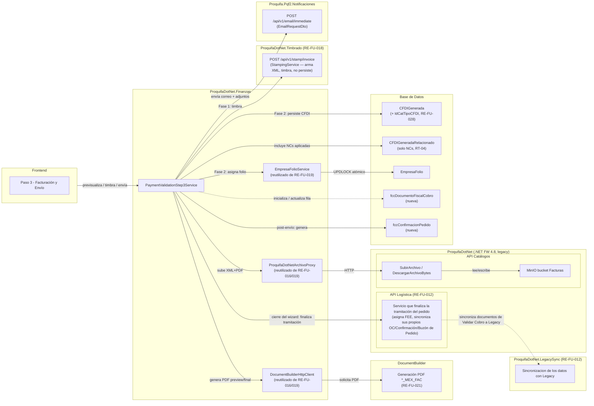
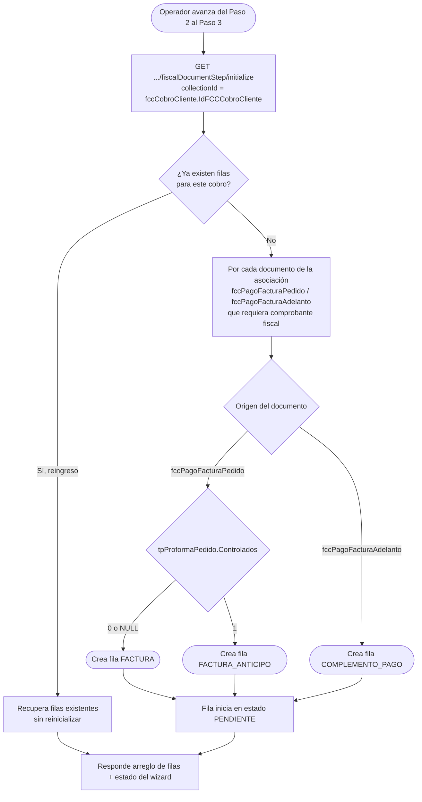
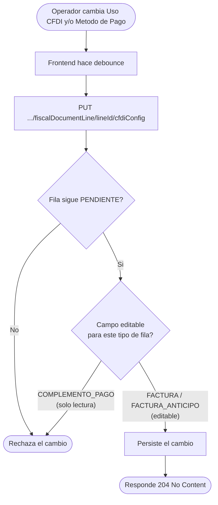
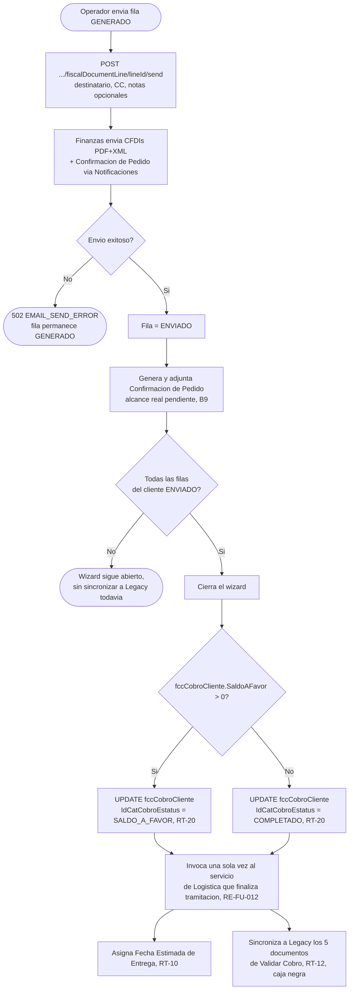
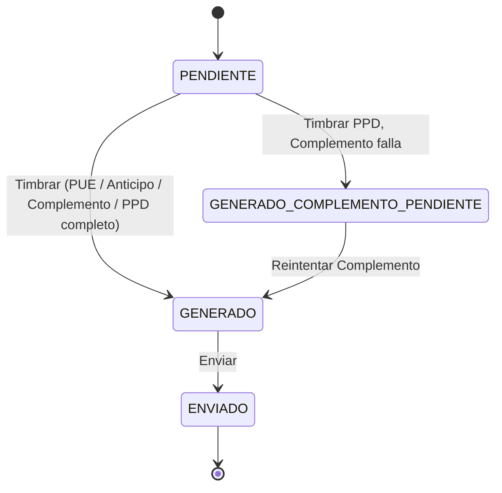
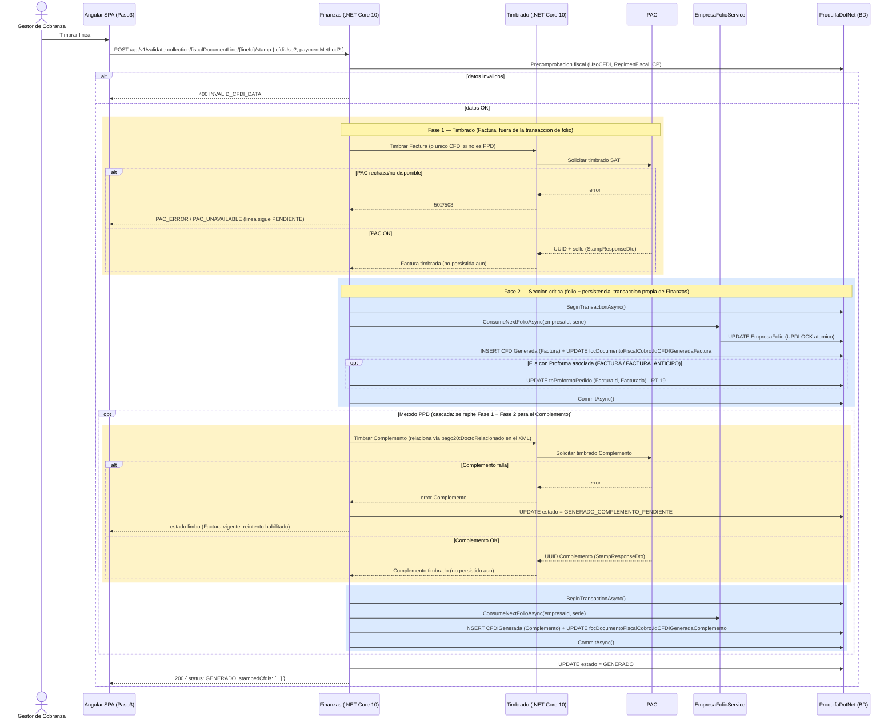

# **Diseño de la solución**

## R16A-RE-FU-028

| **FORMATO** | DIS |
| :---- | :---- |
| **PROYECTO** | R16 - Adquisiciones |
| **REFERENCIA** | [R16A-120: R16A-RE-FU-028 - \[DIS\] - Diseño de la solución](https://newryndem.atlassian.net/browse/R16A-120) |
| **VERSIÓN** | 1.4 |
| **FECHA** | 31 ago 2026 |
| **AUTOR** | [A. Javier Antúnez Estrada](mailto:agustin.antunez@ryndem.mx) |
| **REVISOR** | [Juan David García Cruz](mailto:juan.garcia@ryndem.mx) |

---

## ⚠️ Léase antes de usar este documento como referencia

==Este es un AVANCE del diseño de la solución, no una versión cerrada para construcción. Tiene 2 bloqueantes activos (B9 y B10 — B1, B4, B5, B6 y B8 ya se resolvieron; B3 quedó fuera de alcance; B7 se descartó por no ser responsabilidad de este requisito) y varias decisiones que pueden cambiar el modelo de datos o el contrato de API si se resuelven distinto. Si tomas este documento como referencia para tu propio análisis o diseño (por ejemplo RE-FU-029, RE-FU-030, RE-FU-032, o el front de este mismo requisito), revisa primero los puntos marcados en amarillo — especialmente §Bloqueantes (más abajo) y Reglas Técnicas RT-06, RT-11, RT-13, RT-15 y RT-19.==

**Bloqueantes activos (detalle en Reglas técnicas y Modelo de Datos):**

1. ~~**B1 — Tipo de relación SAT `07` para Factura Anticipo de controlados sin confirmar.** Bloquea el Escenario C de timbrado. Dueño: asesor fiscal PROQUIFA / Irma Andrade.~~ **RESUELTO — DUDA-088 (2026-08-21):** la Factura Anticipo NO usa relación 07; esa relación aplica en la Factura Final (fuera de alcance). Ver `Guia_Tecnica_Facturas_Ingreso_MX.md` §6. Escenario C desbloqueado.
2. ~~**B3 — Mapeo exacto del payload a Legacy para Buzón de Cobros/Proforma/Factura+PDF/Complemento de Pago/Nota de Crédito sin definir.**~~ **FUERA DE ALCANCE:** `ProquifaDotNet.LegacySync` es una caja negra para este requisito — no diseñamos su mecanismo interno (cola, jobs, mapeo de payload por entidad). Este requisito solo necesita que ese aplicativo sincronice esos 5 documentos a Legacy; el cómo es responsabilidad de RE-FU-012.
3. ~~**B4 — Persistencia de la Fecha Estimada de Entrega de cabecera sin decidir.**~~ **RESUELTO — fuera de alcance de este requisito:** la Fecha Estimada de Entrega la asigna el servicio de Logística de RE-FU-012 que finaliza la tramitación del pedido, invocado al cerrar el wizard — este requisito no calcula ni persiste ninguna FEE por su cuenta.
4. ~~**B5 — Contrato de `Proquifa.Pqf2.Notificaciones` sin documentar.**~~ **RESUELTO (confirmado por código):** el aplicativo real se llama `Proquifa.Pqf2.Notificaciones`, endpoint `POST /api/v1/email/immediate`. Contrato: request `EmailRequestDto` (`ExternalReference: Guid`, `RegionCode`, `To`/`Cc`: `EmailRecipientDto[]` con `Address`+`Name`, `TemplateKey` xor `HtmlContent`, `Parameters`: object libre para el template, `Subject`, `Attachments`: `EmailAttachmentDto[]` en base64); respuesta `EmailRequestResult` (`EmailRequestId`, `Status: Processed|Queued`) — sin caso `Failed` síncrono, un error de configuración se propaga como excepción, no como estado. `ExternalReference` debe ser un GUID ya persistido antes de invocar — usar `fccDocumentoFiscalCobro.IdFCCDocumentoFiscalCobro`. Sigue sin requisito formal propio publicado, pero el contrato ya no es una incógnita para este documento.
5. ~~**B6 — Config fiscal de producto (`ClaveProdServ`/`ClaveUnidad`/tasa IVA) a nivel Familia — "Fletes" no modelado.**~~ **RESUELTO (verificado en `R16A-RE-Cambio-PerfilFiscal`):** Fletes **sí** está modelado como Familia (`ClaveProdServ = 78102205`, `ClaveUnidad = E48`, IVA 16%). El mecanismo completo (Perfil Fiscal por Familia, vistas `vProducto`/`vFlete` en el legacy) lo diseña `R16A-RE-Cambio-PerfilFiscal`, que además ya especifica cómo debe consumirse en `FacturaConceptoDto`/`CfdiTrasladoDto` — mismo patrón que adopta `AdvanceInvoiceService` de RE-FU-019. Este requisito solo copia los 4 campos ya resueltos (`ClaveProdServSat`, `ClaveUnidadSat`, `TipoFactor`, `TasaOCuota`) de la partida, sin decidir nada. Ver RT-14.
6. ~~**B8 — ClaveTipoRelacion para Complemento de Pago↔Factura PPD en `CFDIGeneradaRelacionado` sin definir.**~~ **RESUELTO (confirmado con Juan David García Cruz):** el Complemento de Pago NO se relaciona con su Factura vía `CFDIGeneradaRelacionado` — no tiene un valor de `ClaveTipoRelacion` específico para ese caso, se resuelve por otro medio. Ese "otro medio" ya existe en este mismo diseño: `fccDocumentoFiscalCobro.IdCFDIGeneradaFactura` + `IdCFDIGeneradaComplemento` (misma fila del Paso 3). El vínculo SAT real vive en `pago20:DoctoRelacionado`, dentro del propio XML del Complemento, construido por el servicio de Timbrado (RE-FU-018/019) al timbrar — no en `CfdiRelacionados`. Ver RT-04.
7. ==**B9 — Alcance real de `fccConfirmacionPedido` sin confirmar.** No se sabe qué debe almacenar esta tabla ni si es redundante con el propio flujo de Confirmación de Pedido que gestiona el servicio de Logística de RE-FU-012 (que genera su propio PDF y lo sincroniza a Legacy). Dueño: por confirmar.==
8. ==**B10 — Sin diseño de compensación si falla la llamada al servicio de Logística al cerrar el wizard.** El wizard ya cerró (todas las filas ENVIADO) pero la Fecha Estimada de Entrega y/o la sincronización a Legacy podrían no haberse disparado; no se sabe si debe reintentarse automáticamente, exponerse al usuario, o bloquear el cierre. Requiere pregunta a diseño/negocio. Dueño: por confirmar. Ver Manejo de Errores y Excepciones.== <span style="color:#d33">**[Comentario de revisión — Juan David, 2026-09-02]:** por ser un estado fiscal irreversible (wizard ya cerrado, comprobantes ya timbrados/enviados), resolver esto **antes** de construir el Flujo 4, no en paralelo.</span>

**Fuente de este avance:** análisis interno del requisito, verificado contra BD viva (`ProquifaDotNet`, 172.24.32.3:2401) y cruzado contra los DIS-SOL ya entregados de RE-FU-004/008/013/014/016/026/030/032. Re-verificado contra el requisito funcional `R16A-RE-FU-028.md` (actualizado al 21-ago-2026, incorpora DUDA-088/089/050/047) y contra el estado en Jira de las dependencias directas: de las 6 dependencias originales de este documento (R16A-120), 5 ya están APROBADA/Finalizada (RE-FU-016 Parte 4 y 5, RE-FU-019, RE-FU-021, RE-FU-024); RE-FU-026 (R16A-122) permanece en STAND BY por dependencia de RE-FU-025 (en desarrollo) — este documento sigue bloqueado de forma transitiva por esa vía, independientemente de los bloqueantes B1-B10 listados arriba.

---

# **Introducción**

## **1. Propósito del documento**

El propósito de este documento es definir el diseño de la solución técnica para el requisito **R16A-RE-FU-028 — Validar Cobro: Paso 3 México (Facturación y Envío)**, describiendo las nuevas tablas de BD, las clases de lógica de negocio del orquestador (`ProquifaDotNet.Finanzas`), la máquina de estados por fila, la cascada de timbrado PPD (Factura + Complemento), los contratos de API del Paso 3, y las acciones automáticas post-envío exclusivas de México (transferencia a Legacy, Confirmación de Pedido).

**Nota:** Este documento se enfoca exclusivamente en el diseño de la solución en el **Back-end**. No redefine requisitos funcionales ni incluye diseño de pantallas o componentes Angular (scope de Front-end separado — ticket R16A-155).

**Nota de convenciones (aplicadas en todo el documento):**

1. **Idioma de código nuevo: Inglés**, incluida toda la superficie de contrato nuevo (Controllers/tags de Swagger, rutas, DTOs de request/response y sus propiedades) — conforme ADR-0004/core/engineering/naming-and-language (grado de anclaje 2b: contrato nuevo → inglés obligatorio, sin excepción por ser Swagger). Solo permanecen en **Español** los objetos de BD (tablas, columnas, catálogos, SPs), por mapear el esquema principal (grado de anclaje 1). Ej.: clase de negocio `FiscalDocumentBO`, endpoint `/api/v1/validate-collection/fiscalDocumentLine/{lineId}/stamp`, DTO `{ lineId, cfdiUse, paymentMethod }`, tabla `fccDocumentoFiscalCobro`.
2. **Minimizar objetos nuevos en BD — preferir código:** de los 5 objetos nuevos de este requisito, los 4 catálogos/tablas (`fccDocumentoFiscalCobro`, `fccConfirmacionPedido`, `catTipoDocumentoFiscal`, `catDocumentoFiscalCobroEstado`) son estado transaccional genuino — no proyecciones de conveniencia — y sí requieren tabla física. La consulta de filas (`GET` del Paso 3) se resuelve por LINQ/EF sobre estas tablas, sin crear una vista SQL adicional.
3. **Bloqueantes/pendientes notorios van resaltados en amarillo** (regla de redacción vigente para avances de DIS). Ver banner arriba.

## **2. Alcance**

Este requisito implementa el **Paso 3 — Facturación y Envío**, la tercera y última pantalla del wizard **Validar Cobro**. Los tres pasos del wizard son: **Paso 1 — Capturar Cobro** (registra el cobro recibido); **Paso 2 — Asociar Factura/Proforma** (RE-FU-026, el usuario asocia el cobro a una o más Proformas/Facturas existentes y cierra esa asociación); **Paso 3 — Facturación y Envío** (este documento: por cada documento asociado en el Paso 2, genera y envía el comprobante fiscal correspondiente). En el resto de este documento, "Paso 1/2/3" siempre se refiere a estas tres pantallas del mismo wizard.

### **Específicamente incluye:**

* Inicialización del listado de documentos a facturar del Paso 3: una fila por cada documento asociado en el Paso 2 que requiera comprobante fiscal.
* Reanudación del listado: si el cobro ya se había empezado a procesar antes, se recuperan las filas tal cual quedaron, sin reinicializarlas.
* Determinación automática del tipo de comprobante fiscal a generar por cada documento: el sistema decide solo, sin que el usuario lo elija, si le corresponde una Factura, una Factura Anticipo o un Complemento de Pago, según de dónde viene el documento (una Proforma o una Factura ya existente) y si el pedido tiene productos controlados.
* Edición del Uso CFDI y el Método de Pago por documento, con guardado automático.
* Previsualización del PDF antes de timbrar, sin efecto fiscal.
* Timbrado del comprobante fiscal correspondiente ante el SAT, incluyendo el caso en que una misma acción del usuario deba generar dos comprobantes relacionados (una Factura y su Complemento de Pago).
* Inclusión de las Notas de Crédito que el cliente ya tenía aplicadas a su cuenta antes de generar el comprobante: si existen, el nuevo comprobante debe quedar vinculado a ellas para que el SAT las reconozca como parte del mismo historial fiscal del cliente.
* Envío del comprobante fiscal ya timbrado al cliente por correo electrónico, junto con la Confirmación de Pedido (un documento aparte que resume el pedido y se genera automáticamente al enviar).
* Al cerrar el wizard (todas las filas enviadas), invocación única al servicio de Logística (propiedad de RE-FU-012) que finaliza la tramitación del pedido — ese mismo servicio asigna la Fecha Estimada de Entrega y dispara la transferencia a Legacy de todos los documentos del wizard Validar Cobro (Buzón de Cobros, Proforma, Factura, Complemento de Pago y Nota de Crédito), complementando el mecanismo de sincronización que ya construye RE-FU-012 — este requisito no calcula la FEE ni diseña ese mecanismo desde cero.
* Control del estado de cada documento (pendiente, generado, enviado), con persistencia para retomar el proceso donde se quedó, e inmutabilidad una vez timbrado (un comprobante ya generado no se puede deshacer).
* Bloqueo de la navegación a los pasos anteriores del wizard una vez que se haya generado al menos un comprobante fiscal.

### **No se consideran:**

* Región Perú (RE-FU-029) — bloqueado por brechas del proveedor de timbrado local; requisito independiente.
* Diseño y generación del documento del Complemento de Pago (PDF) → RE-FU-030. Este requisito solo genera el comprobante fiscal del Complemento y dispara su sincronización a Legacy, no diseña su documento.
* Diseño y generación de Notas de Crédito → RE-FU-032/034. Este requisito solo las referencia (si ya fueron generadas) y dispara su sincronización a Legacy, no las genera.
* Cancelación fiscal, re-timbrado y operaciones masivas.
* La infraestructura base del canal a Legacy (la cola de sincronización y su procesamiento asíncrono) → RE-FU-012, que ya la construye para otro flujo. Este requisito solo la complementa agregando la sincronización de los documentos del wizard Validar Cobro.
* Diseño de pantallas (scope de Front-end, ticket R16A-155).
* Reimplementación del timbrado, la generación del PDF o el almacenamiento de archivos — ya resueltos por otros requisitos ya aprobados; este requisito solo los reutiliza.

---

# **Visión general del diseño**

## **1. Objetivo técnico**

Materializar fiscalmente, fila por fila, las asociaciones cobro↔documento cerradas en el Paso 2, orquestando el timbrado en `ProquifaDotNet.Timbrado`, la persistencia del PDF/XML vía `DocumentBuilderHttpClient` + `ProquifaDotNetArchivoProxy` (mismo mecanismo ya aprobado en RE-FU-019, bucket `MinioBucketName.Facturas` — ver RT-17), y las acciones post-envío exclusivas de México — con el backend como única fuente de verdad del estado y de la orquestación PAC/Legacy/correo. El frontend solo dispara acciones y refleja estado.

## **2. Componentes involucrados**



| **Aplicativo** | **Componente** | **Responsabilidad** | **Ubicación** |
| :---- | :---- | :---- | :---- |
| `ProquifaDotNet.Finanzas` (.NET Core 10) | Orquestador Paso 3 (propuesto `PaymentValidationStep3Service`) | Inicializa filas, decide tipo de documento fiscal, auto-guardado, invoca timbrado, envía vía `Proquifa.Pqf2.Notificaciones`, dispara post-envío | Nuevo (Application/Services) |
| `ProquifaDotNet.Timbrado` (.NET Core 10) | `StampingService` (`IStampingService`) | Valida el request, invoca `SapStampingClient` (→ PAC), registra `StampingLog`, y retorna el resultado (`StampResponseDto`) o error de validación, vía `POST /api/v1/stamp/invoice`. **No persiste el CFDI ni asigna folio** — eso lo hace Finanzas (RT-18, mismo patrón que `AdvanceInvoiceService` en RE-FU-019) | Existente (RE-FU-018), extendido |
| `ProquifaDotNet.Finanzas` | `EmpresaFolioService`/`EmpresaFolioRepository` | Asigna el folio interno consecutivo por empresa emisora y serie, sobre la tabla `EmpresaFolio` (propiedad de `ProquifaDotNet.Finanzas`, no de Timbrado — mismo componente y misma tabla que reutiliza RE-FU-019, sin duplicar) | Existente (RE-FU-019) |
| PAC | Servicio externo | Timbrado fiscal ante SAT. Nombre y configuración son responsabilidad de `ProquifaDotNet.Timbrado` (RE-FU-018/019) — este requisito no lo invoca directamente, solo consume el servicio de Timbrado | — |
| `ProquifaDotNet` (BD) | `CFDIGeneradaRelacionadoDomain` | Relación 1:N entre CFDIs (Complemento↔Factura PPD, aplicación anticipo, NCs) — **tabla y entidad ya existen**, no requieren cambio. Sufijo `Domain` (no `BO`): esta entidad vive en `ProquifaDotNet.Timbrado` (.NET Core 10 / dotnet-modern), no en el legacy `ProquifaDotNet` (.NET FW 4.8) — `BO` está prohibido en modern (dotnet/fx48 §Prohibiciones). El nombre en español se conserva porque mapea la BD principal (grado de anclaje 1). | Existente (RE-FU-019) |
| DocumentBuilder | Generación PDF | `*_MEX_FAC` reutilizado (RE-FU-021); `*_MEX_COP` es de RE-FU-030 | Existente (RE-FU-021) |
| `ProquifaDotNet.Finanzas` | `DocumentBuilderHttpClient` + `ProquifaDotNetArchivoProxy` | Reutilizados de RE-FU-016/019: invocan a DocumentBuilder para renderizar el PDF y suben PDF+XML a MinIO vía Proxy (2 registros `Archivo`, bucket `MinioBucketName.Facturas` — mismo enum que RE-FU-019, no el Proforma de RE-FU-016, porque este requisito genera Facturas/Complementos, no Proformas). RE-FU-021 (aprobado) solo diseña la generación del PDF (plantillas DocumentBuilder), no la persistencia — no hay conflicto real que resolver. | Existente (RE-FU-016/019) |
| `ProquifaDotNet.LegacySync` | Caja negra (RE-FU-012) | Sincroniza a Legacy los 5 documentos de Validar Cobro (Buzón de Cobros, Proforma, Factura+PDF, Complemento de Pago, Nota de Crédito) — su mecanismo interno **no es responsabilidad de este requisito**, se consume tal cual lo exponga RE-FU-012 | Existente (RE-FU-012), no diseñado aquí |
| `ProquifaDotNet.Finanzas` | `PaymentValidationStep3Service` (cierre del wizard) | Invoca **una sola vez**, al cerrar el wizard, al servicio de Logística de RE-FU-012 | Nuevo, ver §4.1 |
| `ProquifaDotNet` (.NET FW 4.8) — API Logística | `Logic.Pqf.Logistica`: servicio que finaliza la tramitación del pedido | Se invoca una sola vez al cerrar el wizard (todas las filas ENVIADO); asigna la Fecha Estimada de Entrega y sincroniza sus propios artefactos (OC, su Confirmación de Pedido, Buzón de Pedido) a Legacy — este requisito solo lo consume, no lo modifica ni calcula FEE por su cuenta (B4 resuelto). **Complementado por este requisito:** esa misma llamada ahora también recopila y sincroniza los documentos generados en Validar Cobro (Paso 1-3). Es el mismo aplicativo legacy que expone API Catálogos (ArchivoProxy/MinIO), distinta área de API | Existente (RE-FU-012) |
| `Proquifa.Pqf2.Notificaciones` | Servicio de correo | Envío transaccional del CFDI + Confirmación de Pedido al cliente, vía `POST /api/v1/email/immediate` (`EmailRequestDto` — ver B5) | Existente |

<span style="color:#d33">**[Comentario de revisión — Juan David, 2026-09-02]:** este componente no aparece en ningún punto del documento: `ProquifaDotNet.BitacoraCambios`. "Diseño y Desarrollo/Reglas al diseñar.md" (regla 8) exige registrar ahí procesos como "validar un cobro", y RE-FU-019 (patrón que este DIS dice replicar en RT-18) sí lo hace. Los análisis previos de este mismo requisito (`R16A-RE-FU-028-Back.md` línea 273, `R16A-RE-FU-028-Tareas.md` líneas 1176/1199) también lo contemplaban. Preguntar a Javier: ¿se excluyó a propósito o se perdió entre v1.0 y v1.4?</span>

---

# **Diseño funcional detallado**

## **1. Flujo 1 — Inicialización de filas del Paso 3**



1. El operador (Gestor de Cobranza) avanza del Paso 2 (asociación cerrada) al Paso 3.
2. Finanzas recibe `GET /api/v1/validate-collection/fiscalDocumentStep/initialize`. `collectionId = fccCobroCliente.IdFCCCobroCliente` (RE-FU-024) — tabla que sustituye a la extinta `fccPagoCliente` (DIS-SOL de RE-FU-024, fusión con `fccFolioPagoCliente`); a esta altura del wizard su estatus (`IdCatCobroEstatus`) es `ASOCIADO`.
3. Si ya existen filas para ese cobro (reingreso), se recuperan sin reinicializar (persistencia/reanudación).
4. Si no existen, Finanzas crea una fila en `fccDocumentoFiscalCobro` por cada documento de la asociación (`fccPagoFacturaPedido` / `fccPagoFacturaAdelanto`) que requiera comprobante fiscal, determinando el tipo de documento:

| **Origen (Paso 2)** | **Condición** | **Tipo resultante** |
| :---- | :---- | :---- |
| `fccPagoFacturaPedido` | `tpProformaPedido.Controlados = 0` o `NULL` | FACTURA |
| `fccPagoFacturaPedido` | `tpProformaPedido.Controlados = 1` | FACTURA_ANTICIPO |
| `fccPagoFacturaAdelanto` | — | COMPLEMENTO_PAGO |

5. Cada fila inicia en estado PENDIENTE.
6. Finanzas responde con el arreglo de filas y el estado del wizard (`wizardStatus = catCobroEstatus.Clave` de `fccCobroCliente`, típicamente `ASOCIADO` mientras el Paso 3 está en proceso).

## **2. Flujo 2 — Edición de fila y auto-guardado**



1. El operador cambia Uso CFDI y/o Método de Pago de una fila PENDIENTE.
2. El frontend hace debounce y llama `PUT /api/v1/validate-collection/fiscalDocumentLine/{lineId}/cfdiConfig`.
3. Finanzas valida que la fila siga PENDIENTE y que el campo sea editable para su tipo (Uso CFDI y Método de Pago son de solo lectura en COMPLEMENTO_PAGO).
4. Persiste el cambio; responde `204`.

## **3. Flujo 3 — Timbrado de fila (incluye cascada PPD)**

Sigue el mismo patrón ya aprobado en RE-FU-019 (Fase 1 timbra, Fase 2 asigna folio y persiste) — ver RT-18. Cuando la fila requiere 2 CFDIs (cascada PPD), el ciclo Fase 1 + Fase 2 se repite una vez por cada CFDI, no una sola vez para ambos. Ver diagrama **"Secuencia 1 — Timbrar fila (Flujo 3, incluye cascada PPD)"** en Diseño de componentes §2.

### **Fase 1 — Timbrado (por CFDI, fuera de la transacción de folio):**

1. El operador previsualiza (`POST /api/v1/validate-collection/fiscalDocumentLine/{lineId}/pdfPreview`, sin efecto fiscal) y luego timbra (`POST /api/v1/validate-collection/fiscalDocumentLine/{lineId}/stamp`).
2. Finanzas ejecuta precomprobación fiscal (Uso CFDI no nulo, Régimen Fiscal y Código Postal del receptor presentes).
3. Finanzas invoca a Timbrado con los datos del CFDI que corresponda según el tipo de fila:
   - FACTURA (PUE) o FACTURA_ANTICIPO: 1 CFDI (`TipoDocumento = 'I'`). FACTURA_ANTICIPO se timbra SIN `TipoRelacion`/`CfdiRelacionados` (la relación 07 es de la Factura Final, fuera de alcance, generada en Legacy — **CORREGIDO, DUDA-088 2026-08-21**). Conforme `Guia_Tecnica_Facturas_Ingreso_MX.md` §6: `ClaveProdServ=84111506`, `ClaveUnidad=ACT`, descripción "Anticipo del bien o servicio" (concepto único de anticipo, no itemizado por partida). FACTURA (PUE) sí es itemizada: un Concepto por cada `tpProformaPartidaPedido` de la Proforma (incluidas partidas de Flete), copiando `ClaveProdServSat`/`ClaveUnidadSat`/`TipoFactor`/`TasaOCuota` ya resueltos en la columna (RT-14, `R16A-RE-Cambio-PerfilFiscal`) — sin recalcular nada.
   - FACTURA (PPD): primero la Factura PPD; si sale exitosa de su propia Fase 1 + Fase 2, de inmediato se repite el ciclo para el Complemento — relacionado a la Factura PPD vía `fccDocumentoFiscalCobro.IdCFDIGeneradaFactura`/`IdCFDIGeneradaComplemento` (misma fila) y, dentro del XML, vía `pago20:DoctoRelacionado` — no vía `CFDIGeneradaRelacionado` (RT-04).
   - COMPLEMENTO_PAGO: 1 CFDI Pago, relacionado a la Factura Anticipo (`fccFactura.IdCFDIGenerada`, poblado por RE-FU-019 al timbrar) vía `fccDocumentoFiscalCobro.IdCFDIGeneradaFactura`/`IdCFDIGeneradaComplemento` y, dentro del XML, vía `pago20:DoctoRelacionado`. UsoCFDI fijo `CP01` — el seed de este valor en `catUsoCFDI` lo trae RE-FU-030; coordinar su ejecución.
4. Timbrado arma el XML, llama al PAC y retorna `StampResponseDto` (UUID, sello digital, etc.) o error de validación — **no persiste nada ni asigna folio** (ver Componentes involucrados).
5. ¿Error de validación o del PAC? → la fila permanece PENDIENTE con el error correspondiente (ver Manejo de Errores); fin del flujo, no se ejecuta Fase 2. Si el CFDI que falló era el Complemento de una cascada PPD ya con la Factura PPD exitosa (commit de su propia Fase 2 ya hecho): la fila transiciona a `GENERADO_COMPLEMENTO_PENDIENTE` (estado limbo, RT-11); la Factura PPD **permanece vigente ante SAT** y el único reintento permitido es `POST .../stamp` (reintenta solo el Complemento).
6. ¿Timbrado exitoso? → continúa a Fase 2 (para ese mismo CFDI).

### **Fase 2 — Sección crítica (folio + persistencia, dentro de una transacción propia del orquestador — mismo patrón que RE-FU-019):**

7. `PaymentValidationStep3Service` abre transacción.
8. `EmpresaFolioService.ConsumeNextFolioAsync(empresaId, serie)` — consecutivo por empresa emisora, `UPDLOCK` atómico sobre `EmpresaFolio`.
9. `INSERT CFDIGenerada` (folio, UUID y sello recibidos en Fase 1, `IdCatTipoCFDI`, RFCs, totales) y `UPDATE fccDocumentoFiscalCobro` con `IdCFDIGeneradaFactura` o `IdCFDIGeneradaComplemento` según corresponda — dentro de la misma transacción. Si la fila es FACTURA/FACTURA_ANTICIPO (origen `fccPagoFacturaPedido`, con Proforma asociada): además, vía el Repository existente de `tpProformaPedido` (propiedad de `ProquifaDotNet.Finanzas`, RE-FU-016), `UPDATE tpProformaPedido SET FacturaId = <CFDIGenerada recién insertado>, IdcatEstadoProforma = Facturada` — transición Enviada → Facturada que RE-FU-016 dejó como responsabilidad de este requisito (ver RT-19). No aplica a filas COMPLEMENTO_PAGO (no tienen Proforma asociada).
10. ¿Error al obtener el folio o en el INSERT/UPDATE? → ROLLBACK completo (incluye el consumo del folio, que nunca se consume sin uso) → `500 Internal Server Error`. El CFDI ya quedó timbrado ante el PAC en Fase 1 pero sin persistencia local — el reintento reutiliza la protección de idempotencia del propio servicio de Timbrado para no volver a timbrar (mismo mecanismo que resuelve este caso en RE-FU-019).
11. `CommitAsync()`. Transición a GENERADO (irreversible) para ese CFDI; persistencia del PDF/XML definitivo vía `DocumentBuilderHttpClient` + `ProquifaDotNetArchivoProxy` (bucket Facturas — RT-17) → MinIO.

## **4. Flujo 4 — Envío y acciones post-envío (solo México)**



1. El operador envía una fila GENERADO (`POST /api/v1/validate-collection/fiscalDocumentLine/{lineId}/send`) con destinatario (default `tpPedido.IdContactoCliente`), CC y notas opcionales. Si la fila es COMPLEMENTO_PAGO, el CC debe incluir también al analista de Cuentas por Cobrar (RT-16) — no solo el ESAC.
2. Finanzas envía vía `Proquifa.Pqf2.Notificaciones` (`POST /api/v1/email/immediate`) el/los CFDI(s) (PDF+XML) de la fila más la Confirmación de Pedido, como `Attachments` en base64; `ExternalReference = fccDocumentoFiscalCobro.IdFCCDocumentoFiscalCobro` (ver B5). <span style="color:#d33">**[Comentario de revisión — Juan David, 2026-09-02]:** ¿el envío es idempotente ante reintentos (timeout tras éxito)? El candidato natural para deduplicar es `ExternalReference`, pero el contrato de B5 no lo aclara.</span>
3. Envío exitoso: transición a ENVIADO (terminal). **Confirmación de Pedido:** generar y adjuntar (reuso de generación existente, `fccConfirmacionPedido`), sin previsualización ni candado bloqueante — **B9: alcance real de este documento pendiente de confirmar** (posible redundancia con el propio flujo de Confirmación de Pedido de RE-FU-012, ver Flujo 4 paso 4). No se dispara ninguna sincronización a Legacy por fila individual — eso ocurre en un único punto, al cerrar el wizard (paso 4).
4. Cuando todas las filas están ENVIADO, el wizard se cierra:
   - `PaymentValidationStep3Service` hace `UPDATE fccCobroCliente SET IdCatCobroEstatus = COMPLETADO` (o `SALDO_A_FAVOR` si `fccCobroCliente.SaldoAFavor > 0`) — transición confirmada como responsabilidad de este requisito en el DIS-SOL de RE-FU-024 ("COMPLETADO/SALDO_A_FAVOR el Paso 3", RT-20). El cobro queda inmutable a partir de aquí (mismo criterio de RE-FU-024).
   - Invoca **una sola vez** al servicio de Logística (expuesto por su API de Logística, propiedad de RE-FU-012) que finaliza la tramitación del pedido — el mismo mecanismo que ya usa `ProquifaDotNet` para tramitar pedidos. Ese servicio, como parte de su propio flujo:
     - Asigna la Fecha Estimada de Entrega del pedido (B4 resuelto — no es responsabilidad de este requisito).
     - Sincroniza a Legacy sus propios artefactos de tramitación (OC, su propia Confirmación de Pedido, Buzón de Pedido), vía su llamada interna a `ProquifaDotNet.LegacySync` — no es responsabilidad de este requisito.
     - **Complementado por este requisito:** esa misma llamada ahora también sincroniza a Legacy todo lo generado a lo largo de los 3 pasos de Validar Cobro — Buzón de Cobros (Paso 1), Proforma (Paso 2), Factura+PDF, Complemento de Pago y Nota de Crédito aplicada (Paso 3) — (RT-12). El mecanismo interno de esa sincronización es responsabilidad de RE-FU-012, no se diseña en este documento (B3 fuera de alcance).

---

# **5. Criterios de aceptación del requisito**

| **CA** | **Descripción**                                                                              | **Estado**                         | **Justificación**                                                                                                                                                                     |
| :----- | :------------------------------------------------------------------------------------------- | :--------------------------------- | :------------------------------------------------------------------------------------------------------------------------------------------------------------------------------------ |
| CA-1   | Inicializar una fila por cada documento de la asociación del Paso 2 que requiera comprobante | Cubierto                           | Flujo 1 — `fccDocumentoFiscalCobro`, estado inicial PENDIENTE                                                                                                                         |
| CA-2   | Determinar el tipo de documento fiscal por fila                                              | Cubierto                           | Flujo 1, tabla origen→tipo (RT-01)                                                                                                                                                    |
| CA-3   | Uso CFDI editable en FACTURA/FACTURA_ANTICIPO, solo lectura en COMPLEMENTO_PAGO              | Cubierto                           | Flujo 2                                                                                                                                                                               |
| CA-4   | Método de Pago editable en FACTURA/FACTURA_ANTICIPO, PPD fijo en COMPLEMENTO_PAGO            | Cubierto                           | Flujo 2                                                                                                                                                                               |
| CA-5   | Previsualizar PDF sin efecto fiscal                                                          | Cubierto                           | Flujo 3 paso 1 — `POST .../fiscalDocumentLine/{lineId}/pdfPreview`                                                                                                                    |
| CA-6   | Timbrar la fila y transicionar a GENERADO                                                    | Cubierto                           | Flujo 3, Fase 1 (pasos 3-6) + Fase 2 (pasos 7-11)                                                                                                                                     |
| CA-7   | Cascada PPD: 2 CFDIs (Factura + Complemento) en una sola acción                              | Cubierto                           | Flujo 3 paso 3, `fccDocumentoFiscalCobro` + `pago20:DoctoRelacionado` (RT-04)                                                                                                         |
| CA-8   | Fallo parcial de la cascada no re-timbra la Factura PPD                                      | Cubierto                           | Flujo 3 paso 5, estado GENERADO_COMPLEMENTO_PENDIENTE (RT-11)                                                                                                                         |
| CA-9   | Factura Anticipo de controlados se timbra con relación fiscal correcta                       | **Cubierto**                       | **RESUELTO — DUDA-088:** sin relación 07 (esa es de la Factura Final, fuera de alcance) — ver Flujo 3 paso 3                                                                          |
| CA-10  | Incluir NCs aplicadas en `CfdiRelacionados`                                                  | Cubierto                           | `CFDIGeneradaRelacionado` con `ClaveTipoRelacion = 01` (mismo patrón que usa RE-FU-032)                                                                                               |
| CA-11  | Enviar CFDI(s) al cliente y transicionar a ENVIADO                                           | Cubierto                           | Flujo 4 pasos 1-3                                                                                                                                                                     |
| CA-12  | Establecer FEE al enviar (solo México)                                                       | Cubierto (fuera de este requisito) | Lo asigna el servicio de Logística de RE-FU-012 que finaliza la tramitación del pedido, invocado al cerrar el wizard — este requisito no calcula ni persiste FEE (RT-10, B4 resuelto) |
| CA-13  | Transferir a Legacy los documentos del wizard al cerrar el ciclo (solo México)               | Cubierto (fuera de este requisito) | Disparo único al cerrar el wizard (Flujo 4 paso 4); la sincronización la ejecuta `ProquifaDotNet.LegacySync`, caja negra para este requisito (RT-12, B3 fuera de alcance)             |
| CA-14  | Generar Confirmación de Pedido adjunta, sin bloqueo                                          | ==Pendiente parcial==              | Flujo 4 paso 3 — reuso de generación existente; alcance exacto de `fccConfirmacionPedido` sin confirmar (B9)                                                                          |
| CA-15  | Persistir estado y reanudar el wizard; inmutabilidad post-timbrado                           | Cubierto                           | Flujo 1 paso 3; backend es fuente de verdad                                                                                                                                           |
| CA-16  | Bloquear navegación a Paso 1/2 tras timbrar ≥1 fila                                          | Cubierto                           | Regla de UI respaldada por estado backend                                                                                                                                             |
| CA-17  | Cerrar el wizard cuando todas las filas están ENVIADO                                        | Cubierto                           | Flujo 4 paso 4 — `fccCobroCliente.IdCatCobroEstatus` a COMPLETADO/SALDO_A_FAVOR (RT-20)                                                                                               |
| CA-E1  | Falla del PAC deja la fila en PENDIENTE con error                                            | Cubierto                           | Ver Manejo de Errores                                                                                                                                                                 |
| CA-EC1 | Concurrencia: imposible doble timbrado de la misma fila                                      | ==Pendiente==                      | Sin candado hoy — mitigación propuesta RowVersion (RT-13), no implementada.                                                                                                           |

<span style="color:#d33">**[Comentario de revisión — Juan David, 2026-09-02]** CA-EC1: por ser timbrado fiscal irreversible, tratar como condición de salida antes de producción, no solo como riesgo documentado.</span>

---

# **6. Reglas técnicas aplicadas**

| **Regla** | **Descripción**                                                                                                                                                                                                                                                                                                                                                                                                                                                                                                                                                                                                                                                                                                                                                                                                                                                                                                                                                                                                                                                                                                             |
| :-------- | :-------------------------------------------------------------------------------------------------------------------------------------------------------------------------------------------------------------------------------------------------------------------------------------------------------------------------------------------------------------------------------------------------------------------------------------------------------------------------------------------------------------------------------------------------------------------------------------------------------------------------------------------------------------------------------------------------------------------------------------------------------------------------------------------------------------------------------------------------------------------------------------------------------------------------------------------------------------------------------------------------------------------------------------------------------------------------------------------------------------------------- |
| RT-01     | El tipo de documento fiscal se determina por la tabla origen→condición del Flujo 1. La columna real es `tpProformaPedido.Controlados` (bit, nullable) — no `HayControlados`.                                                                                                                                                                                                                                                                                                                                                                                                                                                                                                                                                                                                                                                                                                                                                                                                                                                                                                                                                |
| RT-02     | ~~Las columnas reales de `fccPagoFacturaPedido` verificadas en BD viva son `NumeroDeParcialidad`/`Monto`/`MontoPendienteAnterior`; el DIS de RE-FU-026 propone otras (`MontoAplicado`/`TipoCambio`). Verificar antes de construir el JOIN de inicialización.~~ **RESUELTO (verificado en `R16A-RE-FU-026_BD.md` y en "Impacto en modelos" de su propio DIS-SOL):** `fccPagoFacturaPedido` se reutiliza **sin cambios de esquema** — mismas columnas ya verificadas en BD viva (`IdFCCPagoCliente`, `IdTPProformaPedido`, `Monto`, `MontoPendienteAnterior`, `NumeroDeParcialidad`, `FechaAplicacion`). El INSERT de ejemplo en la sección "Paso A2" del PDF de RE-FU-026 (con `MontoAplicado`/`TipoCambio`/`FechaRegistro`/`Activo`) es una inconsistencia interna de ese propio documento — esas columnas no existen en `fccPagoFacturaPedido`; corresponden a `fccSaldoFavorCliente` (tabla nueva y distinta que también crea RE-FU-026), no a la tabla de asociación. El JOIN de inicialización puede construirse con las columnas verificadas en BD viva.                                                               |
| RT-03     | El discriminador de tipo de negocio no es derivable de `CFDIGenerada.TipoDocumento` (varchar(1), I/E/P) — FACTURA y FACTURA_ANTICIPO son ambos `'I'`. Requiere `catTipoDocumentoFiscal` propio (ver Modelo de Datos).                                                                                                                                                                                                                                                                                                                                                                                                                                                                                                                                                                                                                                                                                                                                                                                                                                                                                                       |
| RT-04     | La inclusión de NCs (01) en `CfdiRelacionados` usa **`CFDIGeneradaRelacionado`** (tabla existente, 1:N, compartida con RE-FU-032). **La relación Complemento↔Factura PPD NO usa esta tabla** (confirmado con Juan David García Cruz: no tiene `ClaveTipoRelacion` específico, se resuelve por otro medio) — se resuelve con `fccDocumentoFiscalCobro.IdCFDIGeneradaFactura` + `IdCFDIGeneradaComplemento` (misma fila); el vínculo SAT real vive en `pago20:DoctoRelacionado` dentro del XML del Complemento, construido por el servicio de Timbrado al timbrar. No se agrega ninguna columna de relación a `CFDIGenerada` — el único ALTER a esa tabla es el discriminador `IdCatTipoCFDI` (ver Modelo de Datos), que es un dato distinto (tipo de CFDI, no relación entre CFDIs).                                                                                                                                                                                                                                                                                                                                         |
| RT-05     | ~~`Empresa.FacturaControlados` (bit, nullable) es candidata a compuerta para permitir facturar controlados — solo 1 de 11 empresas activas la tiene en 1. Confirmar semántica con negocio antes de aplicar como gate duro en el Escenario C.~~ **RESUELTO (verificado en código, `ProquifaDotNet`/`ProquifaDotNet-R14`):** `Empresa.FacturaControlados` **no es un gate** que bloquee facturar controlados para las demás empresas. Su único uso real está en `ActualizarCotCotizacionTransaccionBO` (Cotización, L01.Cotizacion) y solo activa una validación adicional (no mezclar productos controlados con "publicaciones") exclusiva de la empresa que sí tiene el flag en 1. En `tpPedidoFacturaToTPProformaPedidoBO` (Tramitar Pedido → Proforma, L05.TramitarPedido), la empresa emisora viene fija de `tpPartidaPedido.IdEmpresa` (asignada aguas arriba) y `Controlados = true` se marca con cualquier empresa, sin volver a chequear el flag. **No hay ningún gate que bloquee el Escenario C de este requisito por esta columna** — RE-FU-028 no necesita validar `Empresa.FacturaControlados` en ningún punto. |
| RT-06     | ==Fallback de Uso CFDI cuando `tpPedido.IdCatUsoCFDI` y `DatosFacturacionCliente.IdCatUsoCFDI` son ambos NULL: definir valor (candidato `S01`, no `P01` — deprecado por el SAT en CFDI 4.0).==                                                                                                                                                                                                                                                                                                                                                                                                                                                                                                                                                                                                                                                                                                                                                                                                                                                                                                                              |
| RT-07 | ~~El Método de Pago por fila es editable en FACTURA/FACTURA_ANTICIPO; fijo PPD en COMPLEMENTO_PAGO (normativa SAT). Confirmar si la edición por fila sobrescribe `tpPedido.IdCatMetodoDePagoCFDI` (NOT NULL) o es independiente por documento.~~ **RESUELTO (confirmado con Juan David García Cruz, 2026-09-02):** son dos datos independientes. `tpPedido.IdCatMetodoDePagoCFDI` queda congelado desde que se envía la Confirmación de Pedido al cliente al tramitar el pedido — ya no se puede modificar en ese punto. El Método de Pago de la fila en el Paso 3 se ajusta al final, según la forma en que el cliente realmente pagó, y es exclusivo de esa factura; la edición por fila **no** sobrescribe el dato del pedido. |
| RT-08     | Inmutabilidad post-timbrado (legal SAT): PENDIENTE → GENERADO es irreversible; corrección solo vía Notas de Crédito. El backend es el único guardián — sin bypass client-side.                                                                                                                                                                                                                                                                                                                                                                                                                                                                                                                                                                                                                                                                                                                                                                                                                                                                                                                                              |
| RT-09     | Operación individual por fila — sin acciones masivas; el timbrado/envío de una fila no bloquea otras. (Confirmado con cliente, DUDA-050: aceptó timbrado uno a uno, no masivo.)                                                                                                                                                                                                                                                                                                                                                                                                                                                                                                                                                                                                                                                                                                                                                                                                                                                                                                                                             |
| RT-10     | FEE: **no es responsabilidad de este requisito.** La asigna el servicio de Logística de RE-FU-012 que finaliza la tramitación del pedido, invocado al cerrar el wizard (Flujo 4, paso 4) — ese servicio ya calcula y persiste la FEE como parte de su propio flujo. Este requisito no calcula, homologa ni persiste ningún valor de FEE por su cuenta (B4 resuelto).                                                                                                                                                                                                                                                                                                                                                                                                                                                                                                                                                                                                                                                                                                                                                        |
| RT-11     | ==Estado limbo de la cascada PPD: `GENERADO_COMPLEMENTO_PENDIENTE` persiste `IdCFDIGeneradaFactura` y deja `IdCFDIGeneradaComplemento = NULL`; el reintento invoca **solo** el timbrado del Complemento con el UUID de la Factura vigente, nunca re-timbra la Factura.==                                                                                                                                                                                                                                                                                                                                                                                                                                                                                                                                                                                                                                                                                                                                                                                                                                                    |
| RT-12     | Transferencia a Legacy: `ProquifaDotNet.LegacySync` (RE-FU-012) es una **caja negra** para este requisito — no se diseña su mecanismo interno. **Disparador único:** al cerrar el wizard (Flujo 4, paso 4), `PaymentValidationStep3Service` invoca una sola vez al servicio de Logística (API de Logística, RE-FU-012) que finaliza la tramitación del pedido — ese servicio, como parte de su propio flujo, se encarga de sincronizar a Legacy todo lo generado en los 3 pasos de Validar Cobro (Buzón de Cobros, Proforma, Factura+PDF, Complemento de Pago, Nota de Crédito aplicada), además de sus propios artefactos (OC, su Confirmación de Pedido, Buzón de Pedido). No hay ningún llamado ni INSERT por fila individual — todo se dispara desde ese único punto (B3 fuera de alcance).                                                                                                                                                                                                                                                                                                                             |
| RT-13     | ==Concurrencia: sin candado optimista hoy, dos sesiones del mismo cobro podrían timbrar 2 CFDIs válidos para la misma fila. Mitigación propuesta: `RowVersion` en `fccDocumentoFiscalCobro` + transición condicional (`WHERE Estado = PENDIENTE`). No confundir con el candado de folio (protege el consecutivo, no la fila).==                                                                                                                                                                                                                                                                                                                                                                                                                                                                                                                                                                                                                                                                                                                                                                                             |
| RT-14     | Config fiscal del producto (`ClaveProdServ`, `ClaveUnidad`, tasa IVA) se resuelve a nivel **Familia** de productos, aguas arriba de este requisito — diseñada por `R16A-RE-Cambio-PerfilFiscal` (B6 resuelto). El legacy `ProquifaDotNet` (vistas `vProducto`/`vFlete`) ya resuelve 4 campos fiscales (`ClaveProdServSat`, `ClaveUnidadSat`, `TipoFactor`, `TasaOCuota`) y los persiste en `tpProformaPartidaPedido` (Proforma) — este requisito solo los copia tal cual al armar cada `FacturaConceptoDto`/`CfdiTrasladoDto` del CFDI, sin resolver ni calcular nada (mismo patrón que `AdvanceInvoiceService` de RE-FU-019). "Fletes" ya está modelado como Familia (`ClaveProdServ = 78102205`, `ClaveUnidad = E48`, IVA 16%) — no requiere manejo especial, se trata como cualquier otra partida. El nodo `Traslado` del Concepto se arma dinámico desde `TasaOCuota`/`TipoFactor` (sin hardcode `0.16M`); si `TipoFactor = "Exento"` (ej. Publicaciones), no lleva `Traslado`.                                                                                                                                         |
| RT-15     | ==El endpoint `stamp` debe implementar retry ante fallo del PAC para el reintento del Complemento en estado limbo — mecanismo de retry (conteo, backoff) aún sin detallar.==                                                                                                                                                                                                                                                                                                                                                                                                                                                                                                                                                                                                                                                                                                                                                                                                                                                                                                                                                |
| RT-16     | El envío de correo de filas COMPLEMENTO_PAGO debe incluir en CC al analista de Cuentas por Cobrar, además del ESAC — requisito de negocio confirmado para el Complemento de Pago, aplicado aquí porque este documento es quien arma el correo.                                                                                                                                                                                                                                                                                                                                                                                                                                                                                                                                                                                                                                                                                                                                                                                                                                                                              |
| RT-17     | Persistencia del PDF/XML: se reutiliza `DocumentBuilderHttpClient` + `ProquifaDotNetArchivoProxy` tal como los aprobó RE-FU-019, con bucket `MinioBucketName.Facturas` (no Proforma, que es el de RE-FU-016) — este requisito genera Facturas/Facturas Anticipo/Complementos, no Proformas. Toda llamada a servicios legacy pasa por el Proxy, sin excepción. RE-FU-021 (aprobado) solo cubre la generación del PDF (plantillas), no la persistencia — no hay servicio nuevo que diseñar aquí.                                                                                                                                                                                                                                                                                                                                                                                                                                                                                                                                                                                                                              |
| RT-18     | Timbrado NO asigna folio ni persiste `CFDIGenerada` — solo arma el XML, llama al PAC y retorna `StampResponseDto` (mismo contrato que RE-FU-019, RT confirmado en su Componentes involucrados: *"No persiste el CFDI como entidad de negocio — eso lo hace `AdvanceInvoiceService`"*). El orquestador (`PaymentValidationStep3Service`) es quien abre la transacción, consume el folio vía su propio `EmpresaFolioService` (mismo componente y misma tabla `EmpresaFolio` que RE-FU-019, sin duplicar) e inserta `CFDIGenerada` — Fase 2 de Flujo 3, una vez por cada CFDI de la cascada. `R16A-RE-FU-018-Back.md` (aún con hallazgos abiertos, no cerrado) menciona un posible `CfdiController`/`CfdiService` centralizado en Finanzas que asumiría esta persistencia en lugar de cada orquestador — a la fecha no está definido si existirá, y de existir sería responsabilidad de RE-FU-018 (dueño de Timbrado como capacidad técnica), no de este requisito. Mientras tanto, este requisito implementa el flujo directamente (Fase 1/Fase 2 en `PaymentValidationStep3Service`), igual que RE-FU-019.                   |
| RT-19     | ==Máquina de estados de `tpProformaPedido` (RE-FU-016, catálogo `catEstadoProforma`: Pendiente → PendienteEnvioCorreo → Enviada → Facturada/Vencida): RE-FU-016 solo implementa hasta Enviada; este requisito es quien dispara Enviada → Facturada y llena `FacturaId`, al timbrar exitosamente una fila FACTURA/FACTURA_ANTICIPO (Flujo 3, Fase 2, vía el Repository existente de `tpProformaPedido`, propiedad de Finanzas). La transición Enviada → Vencida ("no se pagó dentro del plazo") también es responsabilidad de este requisito según RE-FU-016, pero su disparador no está definido — no es una acción del wizard, sino aparentemente un mecanismo por tiempo/timeout aún sin diseñar.==                                                                                                                                                                                                                                                                                                                                                                                                                       |
| RT-20     | Máquina de estados de `fccCobroCliente` (RE-FU-024, catálogo `catCobroEstatus`: BORRADOR → CAPTURADO → ASOCIADO → COMPLETADO / SALDO_A_FAVOR, además CON_INCONSISTENCIA/CANCELADO): RE-FU-024 solo asigna BORRADOR → CAPTURADO; RE-FU-026 pone ASOCIADO; **este requisito dispara ASOCIADO → COMPLETADO o ASOCIADO → SALDO_A_FAVOR** al cerrar el wizard (Flujo 4, paso 4), confirmado en el DIS-SOL de RE-FU-024. El criterio de cuál de los dos usar es `fccCobroCliente.SaldoAFavor > 0` (columna ya poblada, no la calcula este requisito). `fccCobroCliente` sustituye a la extinta `fccPagoCliente` — tabla y catálogo son propiedad de RE-FU-024, este requisito solo actualiza el estatus, igual que hace con `tpProformaPedido` en RT-19. `collectionId`/`wizardStatus` (§4.1) también dependen de esta tabla: `collectionId = fccCobroCliente.IdFCCCobroCliente`, `wizardStatus = catCobroEstatus.Clave`. ⚠️ Se toma como definitivo el DIS-SOL de RE-FU-024 vigente (24-ago-2026); si ese diseño cambia después, hay que revisar esta regla.                                                                     |

<span style="color:#d33">**[Comentario de revisión — Juan David, 2026-09-02]** RT-06: sin número de bloqueante ni dueño, a diferencia de B1-B10 — formalizar como bloqueante.</span>

---

# **Diseño de componentes**

## **1. Diagramas**

Máquina de estados de la fila del Paso 3 (`fccDocumentoFiscalCobro`, catálogo `catDocumentoFiscalCobroEstado`) — no confundir con la máquina de estados de la Proforma (`tpProformaPedido`/`catEstadoProforma`, ver RT-19):



## **2. Diagrama de secuencia**

### **Secuencia 1 — Timbrar fila (Flujo 3, incluye cascada PPD):**



## **3. Interfaces externas consumidas**

| **Componente proveedor** | **Método** | **Parámetros** | **Retorno** |
| :---- | :---- | :---- | :---- |
| `ProquifaDotNet.Timbrado` (RE-FU-018) | `POST /api/v1/stamp/invoice` | Datos del CFDI a armar según el tipo de fila (Factura/Factura Anticipo/Complemento) — ver Flujo 3 paso 3 | `StampResponseDto` (UUID, sello digital, etc.) o error de validación/PAC — **no incluye folio** (RT-18); `PaymentValidationStep3Service` lo asigna en su propia Fase 2 vía `EmpresaFolioService` |
| `FacturaReportController` (DocumentBuilder, RE-FU-021) | Generación de PDF `*_MEX_FAC` (reutilizado, sin cambios) — se invoca dos veces: previsualización (Flujo 3 paso 1) y PDF final (Flujo 3, Fase 2 paso 11) | Datos del CFDI/fila | `byte[]` PDF |
| `UploadArchivoController`/`ArchivoExtensionsController` (API Catálogos `ProquifaDotNet`, vía `ProquifaDotNetArchivoProxy`) | `SubirArchivo`/`DescargarArchivoBytes` (HTTP) — mismo mecanismo que RE-FU-016/019 | PDF+XML del CFDI (bucket `MinioBucketName.Facturas`, RT-17) | `Archivo` / `byte[]` |
| `Proquifa.Pqf2.Notificaciones` | `POST /api/v1/email/immediate` | `EmailRequestDto` (ver B5, banner) | `EmailRequestResult { EmailRequestId, Status: Processed|Queued }` |
| `Logic.Pqf.Logistica` (servicio que finaliza tramitación, RE-FU-012) | Se invoca **una sola vez**, al cerrar el wizard (todas las filas ENVIADO) — no por fila individual | — (contrato exacto aún no verificado con RE-FU-012) | Finaliza la tramitación del pedido, asigna la Fecha Estimada de Entrega (RT-10) y sincroniza a Legacy los documentos de Validar Cobro (Buzón de Cobros/Proforma/Factura+PDF/Complemento de Pago/Nota de Crédito) vía `ProquifaDotNet.LegacySync` — mecanismo interno fuera del alcance de este documento (RT-12, B3) |

---

# **4. Diseño detallado de componentes nuevos**

## **4.1 PaymentValidationStep3Service**

Servicio principal de orquestación del Paso 3. El algoritmo completo de cada método está descrito en la sección "Diseño funcional detallado".

**Firmas:**

```
Task<FiscalDocumentStepDto>   InitializeAsync(Guid collectionId)
Task                          UpdateCfdiConfigAsync(Guid lineId, CfdiConfigRequestDto request)
Task<PdfPreviewDto>           PreviewAsync(Guid lineId)
Task<StampResultDto>          StampAsync(Guid lineId, StampLineRequestDto request)
Task<SendResultDto>           SendAsync(Guid lineId, SendLineRequestDto request)
```

| **Método**              | **Parámetros de entrada**                                                                                                                 | **Retorno**                                                                                                                                                                                                                                                                                                                                                                                                  | **Flujo de referencia**          |
| :---------------------- | :---------------------------------------------------------------------------------------------------------------------------------------- | :----------------------------------------------------------------------------------------------------------------------------------------------------------------------------------------------------------------------------------------------------------------------------------------------------------------------------------------------------------------------------------------------------------- | :------------------------------- |
| `InitializeAsync`       | `collectionId: Guid` — `fccCobroCliente.IdFCCCobroCliente` (RE-FU-024), cobro cuya asociación (Paso 2) ya está cerrada (estatus ASOCIADO) | `FiscalDocumentStepDto { lines: FiscalLineDto[], wizardStatus }` — `wizardStatus = catCobroEstatus.Clave` (RT-20); filas existentes si es reingreso, o recién creadas (una por documento de `fccPagoFacturaPedido`/`fccPagoFacturaAdelanto` que requiera comprobante)                                                                                                                                        | Flujo 1                          |
| `UpdateCfdiConfigAsync` | `lineId: Guid`; `request: CfdiConfigRequestDto { cfdiUse?, paymentMethod? }`                                                              | — (204 No Content)                                                                                                                                                                                                                                                                                                                                                                                           | Flujo 2                          |
| `PreviewAsync`          | `lineId: Guid`                                                                                                                            | `PdfPreviewDto { pdfUrl }` — sin efecto fiscal, no timbra                                                                                                                                                                                                                                                                                                                                                    | Flujo 3 (previsualización)       |
| `StampAsync`            | `lineId: Guid`; `request: StampLineRequestDto { cfdiUse?, paymentMethod? }`                                                               | `StampResultDto { lineId, status, stampedCfdis: CfdiRefDto[] }` — timbra 1 o 2 CFDIs (cascada PPD) o reintenta solo el Complemento si la fila está GENERADO_COMPLEMENTO_PENDIENTE                                                                                                                                                                                                                            | Flujo 3 (Fase 1 + Fase 2, RT-18) |
| `SendAsync`             | `lineId: Guid`; `request: SendLineRequestDto { to, cc?, extraNotes? }`                                                                    | `SendResultDto { lineId, status, wizardClosed }` — genera la Confirmación de Pedido de la fila (B9 pendiente) sin bloquear la respuesta; si `wizardClosed = true`, actualiza `fccCobroCliente.IdCatCobroEstatus` a COMPLETADO/SALDO_A_FAVOR (RT-20) e invoca una sola vez al servicio de Logística de RE-FU-012 (finaliza tramitación, asigna FEE, dispara la sincronización a Legacy de todo Validar Cobro) | Flujo 4                          |

## **4.2 EmpresaFolioService / EmpresaFolioRepository**

Reutilizado tal cual de RE-FU-019 (mismo componente y misma tabla `EmpresaFolio`, sin duplicar) para asignar el folio interno consecutivo por empresa emisora y serie, dentro de la transacción de Fase 2 del Flujo 3.

**Firma:**

```
Task<string> ConsumeNextFolioAsync(Guid empresaId, string serie)
```

| **Parámetro** | **Tipo** | **Descripción** |
| :---- | :---- | :---- |
| `empresaId` | `Guid` | Empresa emisora del pedido — FK `EmpresaFolio.IdEmpresa` |
| `serie` | `string` | Serie del foliador, según el tipo de CFDI que se está timbrando en esa iteración de la cascada (Factura/Factura Anticipo vs. Complemento de Pago) |

**Retorno:** `string` folio (`varchar(6)`). Requiere transacción activa (`UPDLOCK` atómico sobre `EmpresaFolio`) — ver RT-18.

## **4.3 PaymentValidationStep3Controller**

Expone los endpoints REST del módulo. No contiene lógica de negocio — delega a `PaymentValidationStep3Service`.

**Endpoints:**

| **EndPoint** | **Parámetros de ruta** | **DTO de entrada** | **Salida** |
| :---- | :---- | :---- | :---- |
| `GET /api/v1/validate-collection/fiscalDocumentStep/initialize` | `collectionId` (query o ruta, cobro con asociación cerrada del Paso 2) | — | `200 OK` — `FiscalDocumentStepDto` |
| `POST /api/v1/validate-collection/fiscalDocumentLine/{lineId}/pdfPreview` | `lineId: Guid` | — (sin body; genera preview sin efecto fiscal) | `200 OK` — `PdfPreviewDto` |
| `POST /api/v1/validate-collection/fiscalDocumentLine/{lineId}/stamp` | `lineId: Guid` | `StampLineRequestDto` | `200 OK` — `StampResultDto` (timbra o reintenta solo el Complemento en limbo). ==Debe tener retry ante fallo del PAC (RT-15).== |
| `POST /api/v1/validate-collection/fiscalDocumentLine/{lineId}/send` | `lineId: Guid` | `SendLineRequestDto` | `200 OK` — `SendResultDto` |
| `PUT /api/v1/validate-collection/fiscalDocumentLine/{lineId}/cfdiConfig` | `lineId: Guid` | `CfdiConfigRequestDto` | `204 No Content` |

**DTOs de entrada (bodies):**

```json
// StampLineRequestDto -- POST .../fiscalDocumentLine/{lineId}/stamp
{
  "cfdiUse": "string (ClaveUso, opcional)",
  "paymentMethod": "string (PUE|PPD, opcional)"
}
```

```json
// SendLineRequestDto -- POST .../fiscalDocumentLine/{lineId}/send
{
  "to": "string (email, default tpPedido.IdContactoCliente)",
  "cc": "string (email, opcional -- obligatorio incluir al analista de Cuentas por Cobrar si la fila es COMPLEMENTO_PAGO, RT-16)",
  "extraNotes": "string (opcional)"
}
```

```json
// CfdiConfigRequestDto -- PUT .../fiscalDocumentLine/{lineId}/cfdiConfig
{
  "cfdiUse": "string (ClaveUso, opcional)",
  "paymentMethod": "string (PUE|PPD, opcional)"
}
```

**DTOs de salida:**

```json
// FiscalDocumentStepDto -- GET .../fiscalDocumentStep/initialize
{
  "lines": "FiscalLineDto[]",
  "wizardStatus": "string (catCobroEstatus.Clave, RE-FU-024 -- RT-20)"
}
```

```json
// FiscalLineDto -- elemento de FiscalDocumentStepDto.lines
{
  "lineId": "Guid",
  "documentType": "FACTURA | FACTURA_ANTICIPO | COMPLEMENTO_PAGO",
  "status": "PENDIENTE | GENERADO | GENERADO_COMPLEMENTO_PENDIENTE | ENVIADO",
  "cfdiUse": "string (ClaveUso)",
  "paymentMethod": "PUE | PPD",
  "invoiceCfdi": "CfdiRefDto { uuid, series, folio }",
  "complementCfdi": "CfdiRefDto { uuid, series, folio }"
}
```

```json
// PdfPreviewDto -- POST .../pdfPreview
{
  "pdfUrl": "string"
}
```

```json
// StampResultDto -- POST .../stamp
{
  "lineId": "Guid",
  "status": "GENERADO | GENERADO_COMPLEMENTO_PENDIENTE",
  "stampedCfdis": "CfdiRefDto[] { uuid, series, folio }"
}
```

```json
// SendResultDto -- POST .../send
{
  "lineId": "Guid",
  "status": "ENVIADO",
  "wizardClosed": "bool"
}
```

**Nota (post-envío, fuera del contrato REST):** al cerrar el wizard, `SendAsync` invoca una sola vez (no por fila) al servicio de Logística de RE-FU-012, que asigna la Fecha Estimada de Entrega (RT-10, B4 resuelto) y sincroniza a Legacy los 5 documentos de Validar Cobro (RT-12) — el mecanismo interno de esa sincronización (`ProquifaDotNet.LegacySync`) es una caja negra para este requisito, no se diseña aquí (B3 fuera de alcance).

---

# **Diseño de Modelo de Datos**

## **1. Objetos nuevos**

**Nota de procedencia:** el DDL propuesto por el lead de back (`R16A-RE-FU-028_BD.md`, v1.1) sí existe en el repositorio — la nota anterior de este documento (que decía "no se localizó", Duda #12 del RAD) estaba desactualizada. Se contrastó y se incorporó: además de los 4 objetos ya propuestos aquí, `_BD.md` agrega el catálogo `catTipoCFDI` y un ALTER a `CFDIGenerada` (ver §2).

**`catTipoDocumentoFiscal`** — catálogo del tipo de documento fiscal a generar por fila del Paso 3

| **Columna** | **Tipo** | **Nulo** | **Descripción** |
| :---- | :---- | :---- | :---- |
| `IdCatTipoDocumentoFiscal` | `uniqueidentifier` | No | PK. |
| `Clave` | `varchar(20)` | No | FACTURA \| FACTURA_ANTICIPO \| COMPLEMENTO_PAGO. |
| `Nombre` | `varchar(100)` | No | Nombre descriptivo. |
| `Activo` | `bit` | No | Default 1. |

**`catTipoCFDI`** (de `R16A-RE-FU-028_BD.md`) — catálogo del tipo de CFDI ya timbrado, más fino que el anterior (distingue PUE/PPD)

| **Columna** | **Tipo** | **Nulo** | **Descripción** |
| :---- | :---- | :---- | :---- |
| `IdCatTipoCFDI` | `uniqueidentifier` | No | PK. |
| `Clave` | `varchar(20)` | No | FACTURA_PPD \| FACTURA_PUE \| FACTURA_ANTICIPO \| COMPLEMENTO_PAGO. Única. |
| `Descripcion` | `nvarchar(150)` | No | Descripción del tipo. |
| `Activo` | `bit` | No | Default 1. |
| `FechaRegistro` / `FechaUltimaActualizacion` | `datetime` | No | Default fecha actual. |

Coexiste con `catTipoDocumentoFiscal`: éste clasifica la fila de `fccDocumentoFiscalCobro` **antes** de timbrar (sin distinguir PUE/PPD); `catTipoCFDI` clasifica el CFDI ya timbrado en `CFDIGenerada` (RT-03).

**`catDocumentoFiscalCobroEstado`** — catálogo de estados de la fila del Paso 3

| **Columna** | **Tipo** | **Nulo** | **Descripción** |
| :---- | :---- | :---- | :---- |
| `IdCatDocumentoFiscalCobroEstado` | `uniqueidentifier` | No | PK. |
| `Clave` | `varchar(30)` | No | PENDIENTE \| GENERADO \| GENERADO_COMPLEMENTO_PENDIENTE \| ENVIADO. |
| `Nombre` | `varchar(100)` | No | Nombre descriptivo. |
| `Activo` | `bit` | No | Default 1. |

**`fccDocumentoFiscalCobro`** — una fila por cada documento del Paso 2 que requiere comprobante fiscal

| **Columna** | **Tipo** | **Nulo** | **Descripción** |
| :---- | :---- | :---- | :---- |
| `IdFCCDocumentoFiscalCobro` | `uniqueidentifier` | No | PK. |
| `IdFCCPagoFacturaPedido` | `uniqueidentifier` | Sí | FK → `fccPagoFacturaPedido` (RE-FU-026). Origen Proforma. Exclusivo con la siguiente (RT-01). |
| `IdFCCPagoFacturaAdelanto` | `uniqueidentifier` | Sí | FK → `fccPagoFacturaAdelanto` (RE-FU-026). Origen Factura existente (FAA). |
| `IdCatTipoDocumentoFiscal` | `uniqueidentifier` | No | FK → `catTipoDocumentoFiscal`. |
| `IdCatDocumentoFiscalCobroEstado` | `uniqueidentifier` | No | FK → `catDocumentoFiscalCobroEstado`. |
| `IdCFDIGeneradaFactura` | `uniqueidentifier` | Sí | FK → `CFDIGenerada`. Poblado al timbrar la Factura/Factura Anticipo (Flujo 3). |
| `IdCFDIGeneradaComplemento` | `uniqueidentifier` | Sí | FK → `CFDIGenerada`. Poblado al timbrar el Complemento de Pago (cascada PPD). |
| `FechaGeneracion` | `datetime` | Sí | Fecha del timbrado exitoso. |
| `FechaEnvio` | `datetime` | Sí | Fecha del envío exitoso. |
| `RowVersion` | `rowversion` | No | Candado optimista contra doble timbrado concurrente (RT-13). |
| `FechaRegistro` | `datetime` | No | Default fecha actual. |
| `Activo` | `bit` | No | Default 1. |

Restricciones: `CK_..._OrigenExclusivo` exige que exactamente uno de `IdFCCPagoFacturaPedido`/`IdFCCPagoFacturaAdelanto` esté poblado (RT-01). Índice sobre `IdCatDocumentoFiscalCobroEstado` (incluye ambos orígenes) para resolver el listado del Paso 3.

**`fccConfirmacionPedido`** — Confirmación de Pedido generada y adjunta al enviar

==**B9 — bloqueante:** no se ha confirmado qué debe almacenar esta tabla ni si es redundante con el propio flujo de Confirmación de Pedido que gestiona el servicio de Logística de RE-FU-012 (genera su propio PDF y lo sincroniza a Legacy vía Buzón de Pedido). Estructura tentativa, sujeta a revisión.==

| **Columna** | **Tipo** | **Nulo** | **Descripción** |
| :---- | :---- | :---- | :---- |
| `IdFCCConfirmacionPedido` | `uniqueidentifier` | No | PK. |
| `IdFCCDocumentoFiscalCobro` | `uniqueidentifier` | No | FK → `fccDocumentoFiscalCobro`. |
| `RutaArchivoPDF` | `nvarchar(1000)` | Sí | Ruta/key relativo de MinIO — evita truncamiento. |
| `FechaGeneracion` | `datetime` | No | Default fecha actual. |

**Dependencia externa (no se especifica aquí):** la fila COMPLEMENTO_PAGO requiere el valor `CP01` en `catUsoCFDI`. Ese catálogo y su seed son responsabilidad de RE-FU-030 (BR-06 / Duda #11) — este requisito no lo crea ni lo siembra, solo lo consume (ver Flujo 3, paso 6).

## **2. Modificaciones en BD existente**

**`CFDIGenerada`** (de `R16A-RE-FU-028_BD.md`) — se agrega una columna nueva:

| **Columna nueva** | **Tipo** | **Nulo** | **Descripción** |
| :---- | :---- | :---- | :---- |
| `IdCatTipoCFDI` | `uniqueidentifier` | Sí | FK → `catTipoCFDI`. NULL en registros previos (FAA generadas antes de RE-FU-028) — requiere normalización posterior al alta de la columna. |

<span style="color:#d33">**[Comentario de revisión — Juan David, 2026-09-02]:** falta una tarea explícita de backfill/normalización de `IdCatTipoCFDI` para los registros previos (mencionado como pendiente en la descripción de la columna, pero sin dueño ni criterio de validación en Impacto Técnico ni en Control de versiones).</span>

`_BD.md` también proponía agregar `IdCFDIRelacionado` (self-referencia a la Factura PPD desde el Complemento) — se descarta: la relación Complemento↔Factura PPD no se resuelve vía `CFDIGeneradaRelacionado` (confirmado con Juan David García Cruz — no tiene `ClaveTipoRelacion` propio) ni hacía falta una columna nueva para eso, porque `fccDocumentoFiscalCobro.IdCFDIGeneradaFactura`/`IdCFDIGeneradaComplemento` (de este mismo requisito) ya la resuelven. `CFDIGeneradaRelacionado` (tabla compartida con RE-FU-032/NCs, ya con 126 filas en producción) sigue sin cambios, y dentro de este requisito solo se usa para NCs (RT-04).

==Nota informativa (fuera de control de este requisito): el DIS de RE-FU-032 planea `ALTER TABLE dbo.fccNotaCredito ALTER COLUMN IdTPProformaPedido uniqueidentifier NULL` — esta columna, hoy NOT NULL, pasará a ser opcional. No afecta el DDL de este documento, pero sí el supuesto de datos si se consulta esa tabla.==

**`fccCobroCliente`** (RE-FU-024, sustituye a la extinta `fccPagoCliente`) — se actualiza (no se altera su esquema): `IdCatCobroEstatus` pasa a COMPLETADO o SALDO_A_FAVOR al cerrar el wizard (RT-20). Tabla y catálogo (`catCobroEstatus`) son propiedad de RE-FU-024; este requisito solo consume su identificador (`collectionId`) y actualiza su estatus.

---

# **Impacto Técnico**

## **1. Impacto en código existente**

| **#** | **Componente** | **Tipo de cambio** |
| :---- | :---- | :---- |
| 1 | BD: `catTipoDocumentoFiscal`, `catTipoCFDI`, `catDocumentoFiscalCobroEstado`, `fccDocumentoFiscalCobro`, `fccConfirmacionPedido` | Crear (ver Diccionario de datos) |
| 1b | BD: `CFDIGenerada` (`IdCatTipoCFDI`) | ALTER — ver §2 de Modelo de Datos |
| 2 | `PaymentValidationStep3Service`/`PaymentValidationStep3Controller` en `ProquifaDotNet.Finanzas` | Nuevo — inicialización, tipo de documento, auto-guardado, invocación de timbrado (Fase 1) y de folio/persistencia (Fase 2, RT-18), envío, actualización de `tpProformaPedido` (RT-19), y al cierre del wizard invocación única al servicio de Logística de RE-FU-012. Ver §4.1/§4.3 de Diseño de componentes |
| 2b | `EmpresaFolioService`/`EmpresaFolioRepository` en `ProquifaDotNet.Finanzas` | Reusar sin modificar — mismo componente y misma tabla `EmpresaFolio` que ya usa RE-FU-019 (RT-18). Ver §4.2 |
| 2c | Repository de `tpProformaPedido` en `ProquifaDotNet.Finanzas` (RE-FU-016) | Reusar sin modificar — UPDATE `FacturaId`/`IdcatEstadoProforma = Facturada` al timbrar Factura/Factura Anticipo (RT-19) |
| 2d | Repository de `fccCobroCliente` en `ProquifaDotNet.Finanzas` (RE-FU-024) | Reusar sin modificar — UPDATE `IdCatCobroEstatus = COMPLETADO/SALDO_A_FAVOR` al cerrar el wizard (RT-20); también origen de `collectionId`/`wizardStatus` en `InitializeAsync` |
| 3 | `ProquifaDotNet.Timbrado` | Modificar/extender — arma y timbra cada CFDI de la cascada PPD por separado (sin persistirlo, RT-18); el vínculo Complemento→Factura se arma en `pago20:DoctoRelacionado` del XML, no vía `CFDIGeneradaRelacionado` (RT-04); consume `CP01` de `catUsoCFDI` (sembrado por RE-FU-030) para el Complemento |
| 4 | `ProquifaDotNet.LegacySync` (RE-FU-012) | Caja negra — este requisito no diseña ni modifica nada ahí; solo requiere que sincronice 5 documentos (Buzón de Cobros/Proforma/Factura/Complemento de Pago/Nota de Crédito) (B3 fuera de alcance) |
| 5 | Servicio que finaliza tramitación en `Logic.Pqf.Logistica` (RE-FU-012) | Reusar sin modificar — se consume tal cual, una sola vez al cerrar el wizard; asigna la Fecha Estimada de Entrega (RT-10, B4 resuelto) y dispara internamente la sincronización a Legacy de todo Validar Cobro |
| 6 | Generación de Confirmación de Pedido | Reusar generación existente (verificada en código legacy). Alcance exacto pendiente de confirmar (B9) |

## **2. Impacto en modelos**

* **5 entidades nuevas:** `fccDocumentoFiscalCobro`, `fccConfirmacionPedido`, `catTipoDocumentoFiscal`, `catDocumentoFiscalCobroEstado`, `catTipoCFDI`.
* **`CFDIGenerada` se modifica** (ALTER, agrega `IdCatTipoCFDI`). `CFDIGeneradaRelacionado` se consume tal cual está, sin agregarle ni quitarle columnas — dentro de este requisito solo se usa para NCs; la relación Complemento↔Factura PPD la resuelve `fccDocumentoFiscalCobro` (RT-04).
* **`tpProformaPedido`** (RE-FU-016) **se actualiza** (no se altera su esquema): `FacturaId` e `IdcatEstadoProforma` pasan a Facturada al timbrar la Factura/Factura Anticipo de una fila con Proforma asociada (RT-19).
* **`fccCobroCliente`** (RE-FU-024) **se actualiza** (no se altera su esquema): `IdCatCobroEstatus` pasa a COMPLETADO/SALDO_A_FAVOR al cerrar el wizard (RT-20).

---

# **Manejo de Errores y Excepciones**

| **Escenario**                                                                                                                 | **Comportamiento esperado**                                                                                                                                                                                                                                           |
| :---------------------------------------------------------------------------------------------------------------------------- | :-------------------------------------------------------------------------------------------------------------------------------------------------------------------------------------------------------------------------------------------------------------------- |
| PAC no responde o rechaza el timbrado                                                                                         | `502 PAC_ERROR` / `503 PAC_UNAVAILABLE`; la fila permanece PENDIENTE.                                                                                                                                                                                                 |
| Datos fiscales inválidos (Uso CFDI/Régimen/CP faltantes)                                                                      | `400 INVALID_CFDI_DATA` en la precomprobación, antes de llamar al PAC.                                                                                                                                                                                                |
| Reintento de timbrado sobre fila ya timbrada                                                                                  | `409 LINE_ALREADY_STAMPED`.                                                                                                                                                                                                                                           |
| Falla el INSERT/UPDATE de Fase 2 tras un timbrado exitoso en Fase 1 (PAC ya emitió el CFDI, pero la persistencia local falla) | ROLLBACK completo de Fase 2 (incluye el consumo del folio, que nunca se consume sin uso) → `500 Internal Server Error`. El reintento no vuelve a timbrar — se apoya en la protección de idempotencia del servicio de Timbrado (mismo mecanismo que RE-FU-019).        |
| Complemento falla tras Factura PPD exitosa                                                                                    | Fila pasa a `GENERADO_COMPLEMENTO_PENDIENTE`; `409 COMPLEMENTO_PENDING` si se reintenta el timbrado normal (el mismo endpoint `stamp` reintenta solo el Complemento cuando la fila ya está en ese estado).                                                            |
| Falla el envío por `Proquifa.Pqf2.Notificaciones`                                                                             | `502 EMAIL_SEND_ERROR`; la fila permanece GENERADO.                                                                                                                                                                                                                   |
| Email de destinatario inválido                                                                                                | `400` con detalle de validación.                                                                                                                                                                                                                                      |
| Falla la transferencia a Legacy de un documento (Buzón de Cobros/Proforma/Factura/Complemento de Pago/Nota de Crédito)        | Manejo de reintentos y alertas es responsabilidad de `ProquifaDotNet.LegacySync` (RE-FU-012) — caja negra para este requisito, no se diseña aquí.                                                                                                                     |
| Falla la llamada al servicio de Logística que finaliza la tramitación (al cerrar el wizard)                                   | ==Sin diseño de compensación (B10) — el wizard ya cerró (todas las filas ENVIADO) pero la FEE/sincronización a Legacy podrían no haberse disparado; falta definir con diseño/negocio si se reintenta automáticamente, se expone al usuario, o se bloquea el cierre.== |

---

# **Estrategia de Pruebas**

## **1. Pruebas funcionales (Criterios de Aceptación en DEV)**

* Inicializar el Paso 3 desde una asociación con documentos de ambos orígenes → una fila por documento, tipo correcto por fila.
* Editar Uso CFDI/Método de Pago en una fila PENDIENTE → auto-guardado sin necesidad de acción explícita del usuario.
* Timbrar una fila FACTURA PUE → 1 CFDI, fila pasa a GENERADO.
* Timbrar una fila FACTURA PPD → 2 CFDIs, con `fccDocumentoFiscalCobro` referenciando ambos y el XML del Complemento con `pago20:DoctoRelacionado` correcto.
* Forzar fallo del Complemento tras Factura PPD exitosa → fila en `GENERADO_COMPLEMENTO_PENDIENTE`; reintentar solo el Complemento nunca re-timbra la Factura.
* Enviar una fila GENERADO → transiciona a ENVIADO; se genera la Confirmación de Pedido de la fila sin bloquear la respuesta.
* Enviar la última fila del cliente (cierre del wizard) → se invoca una sola vez al servicio de Logística de RE-FU-012 (FEE + sincronización a Legacy de todo Validar Cobro).
* Intentar editar o re-timbrar una fila GENERADO/ENVIADO → rechazado.
* Cerrar el wizard solo cuando todas las filas están ENVIADO.

## **2. Pruebas técnicas**

### **Unitarias**

* Determinación del tipo de documento por fila según `tpProformaPedido.Controlados` y tabla de origen.
* Transición de estados válidas/inválidas de la máquina de estados (incluye el estado limbo).
* Validación de precomprobación fiscal (Uso CFDI/Régimen/CP) antes de invocar el PAC.
* Armado de Conceptos de una FACTURA (PUE) con partida de Flete → `ClaveProdServ`/`ClaveUnidad`/IVA copiados tal cual de `tpProformaPartidaPedido` (RT-14), sin recalcular; partida con `TipoFactor = Exento` no lleva nodo `Traslado`.

### **Pruebas de integración**

* `POST .../fiscalDocumentLine/{lineId}/stamp` con Método PPD → verificar 2 filas en `CFDIGenerada`, `fccDocumentoFiscalCobro` con ambos `IdCFDIGenerada*` poblados, y el XML del Complemento con `pago20:DoctoRelacionado` apuntando a la Factura PPD.
* `POST .../stamp` sobre una fila en `GENERADO_COMPLEMENTO_PENDIENTE` → solo se invoca el timbrado del Complemento, la Factura no se toca. Debe tener retry propio ante fallo del PAC (ver RT-15).
* `POST .../fiscalDocumentLine/{lineId}/send` → verificar que la Confirmación de Pedido se adjunta; si es la última fila del cliente, verificar que se invoca al servicio de Logística de RE-FU-012 exactamente una vez (no una vez por fila) — no es responsabilidad de este requisito verificar el resultado de la sincronización interna a Legacy (caja negra).
* Falla el INSERT/UPDATE de Fase 2 tras timbrado exitoso de Fase 1 → ROLLBACK completo, folio no consumido, `CFDIGenerada` sin la fila; el reintento no vuelve a invocar al PAC.

## **3. Casos críticos**

* **Concurrencia:** dos sesiones intentando timbrar la misma fila simultáneamente → sin `RowVersion` (RT-13 pendiente de implementar), verificar el comportamiento actual y documentar el riesgo si se libera sin el candado.
* **PAC no disponible durante la cascada:** Factura PPD ya timbrada, Complemento no se pudo intentar por caída del PAC — debe comportarse igual que un fallo de Complemento (estado limbo), no como error genérico.

---

# **Control de versiones**

| **Versión** | **Fecha** | **Autor** | **Tipo de Cambio** | **Detalle** | **Aprobó** |
| :---- | :---- | :---- | :---- | :---- | :---- |
| 1.0 | 6 jul 2026 | Jose Armando Santiago Lorenzo | Creación (avance) | Anexo A.1 | — |
| 1.1 | 23 jul 2026 | Jose Armando Santiago Lorenzo | Actualización (avance) | Anexo A.2 | — |
| 1.2 | 25 ago 2026 | Javier Antúnez Estrada | Actualización (avance) | Anexo A.3 | — |
| 1.3 | 28 ago 2026 | Javier Antúnez Estrada | Actualización (avance) | Anexo A.4 | — |
| 1.4 | 31 ago 2026 | Javier Antúnez Estrada | Actualización (avance) | Anexo A.5 | — |

---

# **Anexo A — Detalle de cambios por versión**

## **A.1 — Creación (v1.0)**

**v1.0 (6 jul 2026) — Creación como avance interno:** Primera versión formal del DIS-SOL de RE-FU-028, verificada contra BD viva y cruzada contra los DIS-SOL ya entregados de RE-FU-004/008/013/014/016/026/030/032. Incluye 2 diagramas de flujo + 2 diagramas de secuencia (obligatorio), DDL propuesto de los 5 objetos nuevos, y decisión corregida de no crear el ALTER `CFDIGenerada.IdCFDIRelacionado` (usar `CFDIGeneradaRelacionado` existente). **Documento marcado explícitamente como avance**: tiene 4 bloqueantes activos (B1 fiscal, B3 payload Legacy, B4 granularidad FEE, acceso a repo) resaltados en amarillo a lo largo del texto — no apto para iniciar construcción sin resolverlos.

## **A.2 — Actualización (v1.1)**

**v1.1 (23 jul 2026):** Seis cambios, todos derivados de revisión de diseño (no de comentarios directos sobre este documento):

1. **Endpoints renombrados** a la convención `/api/v1/validate-collection/fiscalDocumentStep|fiscalDocumentLine/...`, unificando el timbrado de Factura y Complemento en un solo endpoint `stamp` (con retry pendiente de detallar, RT-15).
2. **Canal a Legacy actualizado**: de la cola de transferencia asíncrona previamente propuesta a `PQF.Logistica TramitarPedido` → aplicativo `LegacySync` (RT-12). Contrato de payload por evento sigue pendiente (B3).
3. **Envío de correo actualizado**: de envío directo a un proveedor externo, a `Proquifa.Pqf2.Notificaciones` (aplicativo propio de la solución). Nuevo bloqueante **B5** — sin contrato/endpoint documentado.
4. **Nuevo bloqueante B6 — config fiscal de producto / "Fletes":** la clave de servicio SAT y tasa de IVA por producto se resuelven a nivel Familia, aguas arriba de este requisito (RT-14); el concepto "Fletes" no está modelado como Familia/producto hoy, por lo que una partida de ese tipo no podría timbrarse.
5. **Nuevo bloqueante B7 — nombre del PAC sin confirmar:** este documento asumía un nombre de PAC que no coincide con el que usa el servicio de timbrado reutilizado — confirmar antes de codificar.
6. **Nueva regla RT-16** — el correo de filas COMPLEMENTO_PAGO debe incluir en CC al analista de Cuentas por Cobrar, no solo al ESAC (gap de diseño detectado en revisión cruzada).

## **A.3 — Actualización (v1.2)**

**v1.2 (25 ago 2026):**

1. **Flujo 3/RT-18 reescritos** al patrón Fase 1 (Timbrado, sin persistir) / Fase 2 (folio + persistencia, transacción propia del orquestador) ya aprobado en RE-FU-019 — antes el Timbrado insertaba `CFDIGenerada` y asignaba folio directamente.
2. **B8 resuelto** (confirmado con Juan David García Cruz): Complemento↔Factura PPD no usa `CFDIGeneradaRelacionado`; se resuelve con `fccDocumentoFiscalCobro.IdCFDIGeneradaFactura`/`IdCFDIGeneradaComplemento` y, en el XML, `pago20:DoctoRelacionado`. Se descarta el ALTER `CFDIGenerada.IdCFDIRelacionado` propuesto originalmente.
3. **Secuencia 2 actualizada**: correo vía `Proquifa.Pqf2.Notificaciones` (`POST /api/v1/email/immediate`, contrato verificado en código — B5 resuelto) y transferencia a Legacy vía `LegacySync`/`PQF.Logistica TramitarPedido`.
4. **Diagrama "Componentes involucrados" agregado** (mismo formato que RE-FU-019).
5. **Modelo de Datos convertido** de DDL embebido a Diccionario de datos (Columna/Tipo/Nulo/Descripción); los scripts SQL ejecutables se movieron a `Scripts/RE-FU-028/`.

## **A.4 — Actualización (v1.3)**

**v1.3 (28 ago 2026):**

1. **FEE (B4) resuelto — fuera de alcance:** tras revisar el DIS-SOL de RE-FU-012 (`ProquifaDotNet.LegacySync`), se confirmó que la Fecha Estimada de Entrega la asigna el servicio de Logística de RE-FU-012 que finaliza la tramitación del pedido, invocado al cerrar el wizard — este requisito no la calcula ni la persiste. Se descarta el componente `FechaEstimadaEntregaProxy` que se había diseñado inicialmente para este fin.
2. **Legacy (B3) resuelto — fuera de alcance:** `ProquifaDotNet.LegacySync` (RE-FU-012) se trata como **caja negra** — este requisito no diseña su mecanismo interno (cola, jobs, mapeo de payload). Solo necesita que sincronice 5 documentos del wizard Validar Cobro (Buzón de Cobros, Proforma, Factura+PDF, Complemento de Pago, Nota de Crédito). Confirmado con el `Back.md` del repo y con negocio: el disparo es **único**, al cerrar el wizard (llamada al servicio de Logística que finaliza la tramitación), no por fila individual — ese mismo servicio también asigna la FEE y sincroniza sus propios artefactos (OC, su Confirmación de Pedido, Buzón de Pedido, distinto de nuestro `fccConfirmacionPedido`, cuyo alcance queda pendiente — **B9**).
3. **Nueva sección "4. Diseño detallado de componentes nuevos"** (junto con la nueva "3. Interfaces externas consumidas", mismo formato que RE-FU-019) en Diseño de componentes (`PaymentValidationStep3Service`, `EmpresaFolioService`/`Repository`, `PaymentValidationStep3Controller`), con firmas, parámetros y salidas, mismo formato que RE-FU-019.
4. **Nueva RT-19:** este requisito dispara Enviada → Facturada y llena `FacturaId` en `tpProformaPedido` al timbrar Factura/Factura Anticipo (hallazgo del DIS-SOL de RE-FU-016, no documentado antes en este documento); Enviada → Vencida queda como bloqueante sin disparador definido.
5. **Nuevo bloqueante B9** — alcance real de `fccConfirmacionPedido` sin confirmar (posible redundancia con la Confirmación de Pedido propia de RE-FU-012).
6. **Correcciones de consistencia:** referencia a `LegacySync` (en vez de `ActualizacionPedidoPrepago`) en Flujo 4; nombres de ruta actualizados en Pruebas de integración.
7. **Secuencia 2 eliminada:** el diagrama de secuencia "Enviar fila + post-envío" se quitó — solo Flujo 3 (Timbrado, con cascada PPD) amerita diagrama de secuencia por su complejidad; Flujo 4 queda descrito con la narrativa numerada.
8. **Nueva RT-20:** `collectionId`/`wizardStatus` (§4.1) mapean a `fccCobroCliente`/`catCobroEstatus` (RE-FU-024) — tabla que sustituye a la extinta `fccPagoCliente`. Se confirma que este requisito dispara ASOCIADO → COMPLETADO/SALDO_A_FAVOR al cerrar el wizard, según el DIS-SOL vigente de RE-FU-024 (24-ago-2026, tomado como definitivo — revisar si cambia después).
9. **B6 resuelto:** el requisito `R16A-RE-Cambio-PerfilFiscal` ya diseña la config fiscal por Familia (incluye Fletes: `ClaveProdServ=78102205`, `ClaveUnidad=E48`, IVA 16%) y su consumo en `FacturaConceptoDto`/`CfdiTrasladoDto` — mismo patrón que RE-FU-019. RT-14 reescrita; este requisito solo copia los 4 campos ya resueltos (`ClaveProdServSat`/`ClaveUnidadSat`/`TipoFactor`/`TasaOCuota`) de `tpProformaPartidaPedido`, sin lógica propia.

## **A.5 — Actualización (v1.4)**

**v1.4 (31 ago 2026):**

1. **Nuevo bloqueante B10** — la fila de Manejo de Errores y Excepciones sobre falla en la llamada al servicio de Logística al cerrar el wizard no tenía diseño de compensación ni número de bloqueante asociado; se formaliza como B10 (sin RT asociada) y se resalta en amarillo. Pendiente de definir con diseño/negocio si se reintenta automáticamente, se expone al usuario, o se bloquea el cierre del wizard.

---

# **Nota de sincronización de este archivo local**

Este `.md` local fue actualizado el **2026-09-02** para reflejar el contenido íntegro del DIS-SOL vigente en Google Docs (v1.4, 31-ago-2026) — la versión que este archivo tenía guardada (v1.1, 23-jul-2026) estaba desactualizada. El Google Doc sigue siendo la fuente viva; ante cualquier discrepancia futura, el Doc manda. Ver también `R16A-RE-FU-028-Revision-DIS-SOL-2026-09-02.md` en esta misma carpeta para los hallazgos de revisión pendientes de resolver con el autor (incluye uno no reflejado en el Doc: falta la integración con `ProquifaDotNet.BitacoraCambios`).
