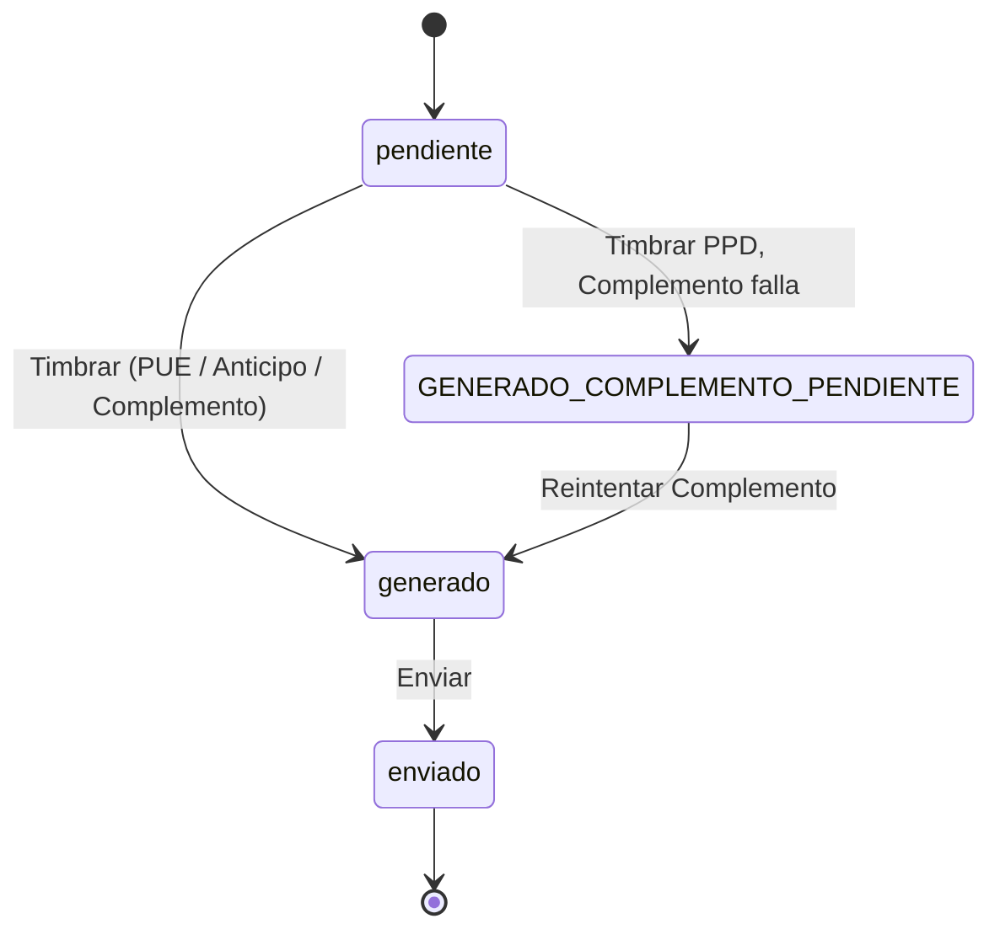
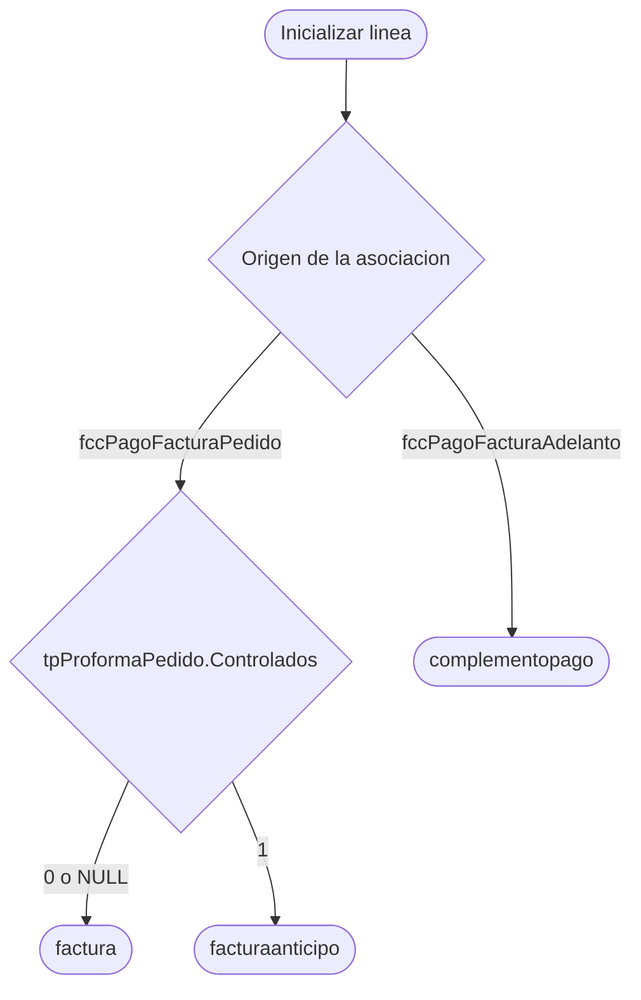
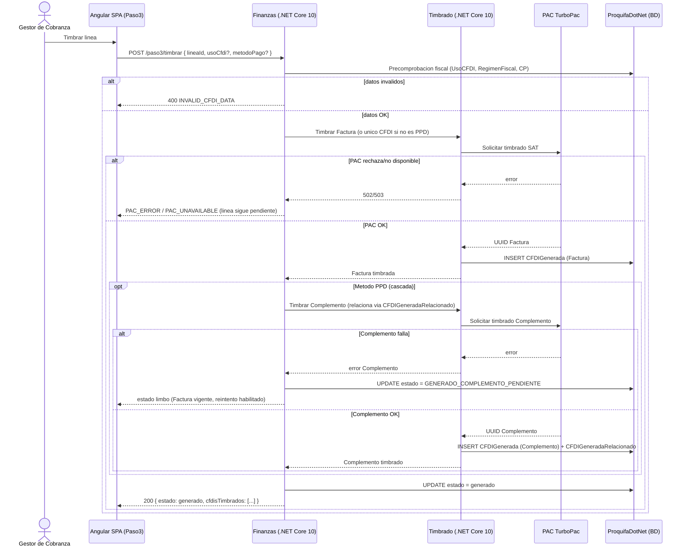
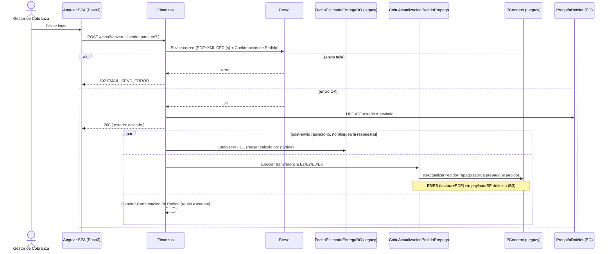

# **Diseño de la solución**

## R16A-RE-FU-028

| FORMATO | Arquitectura |
| :---- | :---- |
| **PROYECTO** | R16 - Adquisiciones |
| **REFERENCIA** | AUI- FOR-01 |
| **VERSIÓN** | 1.1 |
| **FECHA** | 23 jul 2026 |
| **AUTOR** | [Jose Armando Santiago Lorenzo](mailto:jose.santiago@ryndem.mx) |
| **REVISOR** | [Juan David García Cruz](mailto:juan.garcia@ryndem.mx) |

---

# **Importante**

Posterior a este diseño, ¿cómo saber si el diseño de la solución al requisito está completo para que el programador inicie con el desarrollo?
Hazte estas preguntas rápidas:

* ¿El programador sabe qué flujo implementar?
* ¿Sabe qué pasa si algo falla?
* ¿Sabe qué reglas no puede romper?
* ¿Sabe qué pruebas debe pasar?
* ¿Sabe dónde impacta?

*Nota: Este documento es una propuesta basada en el estándar IEEE 1016 "Software Design Description" que va permitir abarcar los puntos más importantes para el diseño del requisito que se está trabajando. Se debe administrar el tiempo que se tiene de diseño para que se complete de la mejor manera considerando todos los detalles técnicos.*

---

## ⚠️ Léase antes de usar este documento como referencia

==Este es un AVANCE del diseño de la solución, no una versión cerrada para construcción. Tiene 7 bloqueantes activos y varias decisiones que pueden cambiar el modelo de datos o el contrato de API si se resuelven distinto. Si tomas este documento como referencia para tu propio análisis o diseño (por ejemplo RE-FU-029, RE-FU-030, RE-FU-032, o el front de este mismo requisito), revisa primero los puntos marcados en amarillo — especialmente §Bloqueantes (más abajo) y Reglas Técnicas RT-01, RT-02, RT-11, RT-12 y RT-14/RT-15.==

**Bloqueantes activos (detalle en Reglas técnicas y Modelo de Datos):**

1. ~~**B1 — Tipo de relación SAT `07` para Factura Anticipo de controlados sin confirmar.** Bloquea el Escenario C de timbrado. Dueño: asesor fiscal PROQUIFA / Irma Andrade.~~ **RESUELTO — DUDA-088 (2026-08-21):** la Factura Anticipo NO usa relación 07; esa relación aplica en la Factura Final (fuera de alcance). Ver `Guia_Tecnica_Facturas_Ingreso_MX.md` §6. Escenario C desbloqueado.
2. ==**B3 — Payload y consumidor de la transferencia a Legacy (E3/E6, factura+PDF) sin definir.** Dueño: Arquitectura.==
3. ==**B4 — Granularidad de la Fecha Estimada de Entrega (cabecera vs. partida) sin decidir.** Dueño: Operaciones MX.==
4. ==**Acceso al repositorio `ProquifaDotNet.Finanzas`/`.Timbrado` (.NET Core 10) pendiente.** Sin él no se pudo verificar el orquestador del Paso 3 a nivel de código — las rutas de archivo de este documento son **propuestas**, no confirmadas. Dueño: Lead técnico.==
5. ==**B5 — Contrato de `ProquifaDotNet.EnvioCorreo` sin documentar.** El envío de correo de este requisito depende de un aplicativo nuevo que hoy no tiene ningún requisito propio ni contrato publicado. Dueño: PMO / Arquitectura.==
6. ==**B6 — Config fiscal de producto (`ClaveProdServ`/`ClaveUnidad`/tasa IVA) a nivel Familia — "Fletes" no modelado.** Si un pedido factura un concepto de tipo Flete, este requisito no tiene de dónde tomar la clave de servicio SAT para esa línea. Dueño: por confirmar (catálogo de Producto/Familia).==
7. ==**B7 — Nombre del PAC sin confirmar.** Este documento usa "TurboPac"; el diseño técnico del servicio de timbrado reutilizado por este requisito referencia también un PAC "SAP" (`SapTimbradoClient`). Dueño: Arquitectura.==

**Fuente de este avance:** análisis interno del requisito, verificado contra BD viva (`ProquifaDotNet`, 172.24.32.3:2401) y cruzado contra los DIS-SOL ya entregados de RE-FU-004/008/013/014/016/026/030/032.

---

# **Introducción**

## **1. Propósito del documento**

El propósito de este documento es definir el diseño de la solución técnica para el requisito **R16A-RE-FU-028 — Validar Cobro: Paso 3 México (Facturación y Envío)**, describiendo las nuevas tablas de BD, las clases de lógica de negocio del orquestador (`ProquifaDotNet.Finanzas`), la máquina de estados por línea, la cascada de timbrado PPD (Factura + Complemento), los contratos de API del Paso 3, y las tres acciones automáticas post-envío exclusivas de México (Fecha Estimada de Entrega, transferencia a Legacy, Confirmación de Pedido).

**Nota:** Este documento se enfoca exclusivamente en el diseño de la solución en el **Back-end**. No redefine requisitos funcionales ni incluye diseño de pantallas o componentes Angular (scope de Front-end separado — ticket R16A-155).

**Nota de convenciones (aplicadas en todo el documento):**
1. **Idioma de código nuevo: Inglés**, excepto la superficie visible en Swagger (Controllers/tags, rutas, DTOs de request/response y sus propiedades) y todo objeto de BD (tablas, columnas, catálogos, SPs), que permanecen en **Español**. Ej.: clase de negocio `FiscalDocumentBO`, endpoint `/api/v1/validate-collection/fiscalDocumentLine/{idLinea}/stamp`, tabla `fccDocumentoFiscalCobro`.
2. **Minimizar objetos nuevos en BD — preferir código:** de los 5 objetos nuevos de este requisito, los 4 catálogos/tablas (`fccDocumentoFiscalCobro`, `fccConfirmacionPedido`, `catTipoDocumentoFiscal`, `catDocumentoFiscalCobroEstado`) son estado transaccional genuino — no proyecciones de conveniencia — y sí requieren tabla física. La consulta de líneas (`GET` del Paso 3) se resuelve por LINQ/EF sobre estas tablas, sin crear una vista SQL adicional.
3. **Bloqueantes/pendientes notorios van resaltados en amarillo** (regla de redacción vigente para avances de DIS). Ver banner arriba.

## **2. Alcance**

### **Específicamente incluye:**

* Inicialización de las líneas del Paso 3: una fila por cada documento de la asociación cerrada en el Paso 2 (RE-FU-026) que requiera comprobante fiscal.
* Lógica condicional del **tipo de documento fiscal** por línea (Factura / Factura Anticipo / Complemento de Pago), determinada por `tpProformaPedido.Controlados` y el origen de la asociación.
* Edición por línea de **Uso CFDI** (`catUsoCFDI`) y **Método de Pago** (`catMetodoDePagoCFDI`: PPD/PUE) cuando aplica, con auto-guardado.
* Previsualización PDF (sin efecto fiscal), **timbrado** vía PAC ==(nombre sin confirmar, B7)== — incluida la **cascada PPD** (Factura + Complemento en la misma acción de usuario) — y **envío** al cliente vía `ProquifaDotNet.EnvioCorreo`.
* Inclusión de Notas de Crédito ya aplicadas en el nodo `CfdiRelacionados` del XML, usando `CFDIGeneradaRelacionado` (tabla existente).
* Máquina de estados por línea con persistencia, reanudación del wizard e inmutabilidad post-timbrado.
* Tres acciones automáticas post-envío (solo México): establecer Fecha Estimada de Entrega, transferir pedido y documentos a Legacy, generar Confirmación de Pedido.
* Bloqueo de navegación a Paso 1/2 una vez timbrada al menos una línea.

### **No se consideran:**

* Región Perú (RE-FU-029) — timbrado SUNAT bloqueado por brechas OSE; requisito independiente.
* Diseño, estructura, PDF (`*_MEX_COP`) y ETL (E4/E7) del **Complemento de Pago** → RE-FU-030. Este documento *timbra* el CFDI del Complemento en la cascada, pero no genera su PDF ni lo transfiere a Legacy.
* Modelo, timbrado, PDF y ETL de **Notas de Crédito** (E5/E8) → RE-FU-032/034. Este requisito solo referencia el UUID de NCs ya timbradas.
* Cancelación fiscal SAT, re-timbrado, operaciones masivas.
* El **mecanismo** de transferencia a Legacy (el "cómo") → transversal NO-FU-003. Este requisito define el "qué" y el "cuándo" (E1/E2/E3/E6).
* Diseño de pantallas o componentes Angular (scope de Front-end, ticket R16A-155).

---

# **Visión general del diseño**

## **1. Objetivo técnico**

Materializar fiscalmente, línea por línea, las asociaciones cobro↔documento cerradas en el Paso 2, orquestando el timbrado en `ProquifaDotNet.Timbrado`, la persistencia del PDF en MinIO (reuso de RE-FU-021), y las tres acciones post-envío exclusivas de México — con el backend como única fuente de verdad del estado y de la orquestación PAC/Legacy/FEE/correo. El frontend solo dispara acciones y refleja estado.

## **2. Componentes involucrados**

| Aplicativo | Componente | Responsabilidad | Ubicación |
| :---- | :---- | :---- | :---- |
| `ProquifaDotNet.Finanzas` (.NET Core 10) | Orquestador Paso 3 (propuesto `Paso3FiscalCobroBO` / equivalente) | Inicializa líneas, decide tipo de documento fiscal, auto-guardado, invoca timbrado, envía por Brevo, dispara post-envío | ==Ruta exacta no verificable — repo no accesible (bloqueante #4)== |
| `ProquifaDotNet.Timbrado` (.NET Core 10) | Servicio de timbrado | Llama al PAC ==(nombre sin confirmar, B7)==, inserta `CFDIGenerada` (+ `CFDIGeneradaConcepto`/`CFDIGeneradaImpuesto`/`CFDIGeneradaRelacionado`), asigna Serie/Folio desde `EmpresaFolio` (BD `ProquifaDotNetTimbrado`) | ==Ruta exacta no verificable — repo no accesible (bloqueante #4)== |
| PAC (=="TurboPac" vs "SAP" — B7==) | Servicio externo | Timbrado fiscal ante SAT | — |
| ProquifaDotNet (BD) | `CFDIGeneradaRelacionadoBO` | Relación 1:N entre CFDIs (Complemento↔Factura PPD, aplicación anticipo, NCs) — **tabla y BO ya existen**, no requieren cambio | `dbo.CFDIGeneradaRelacionado` |
| DocumentBuilder | Generación PDF | `*_MEX_FAC` reutilizado (RE-FU-021); `*_MEX_COP` es de RE-FU-030 | — |
| Módulo FEE existente | `FechaEstimadaEntregaBO` | Cálculo de Fecha Estimada de Entrega por partida + homologación — reusado por el post-envío | `ProquifaDotNet-R14` (monolito legacy, verificado en código) |
| `PQF.Logistica TramitarPedido` → `LegacySync` | Canal a Legacy | Aplicativo que transfiere pedido y documentos a Legacy — payload por evento (E1/E2/E3/E6) pendiente de definir (B3) | ==Contrato de payload pendiente== |
| `ProquifaDotNet.EnvioCorreo` | Servicio de correo | Envío transaccional del CFDI + Confirmación de Pedido al cliente | ==B5 — sin contrato/endpoint documentado aún== |

---

# **Diseño funcional detallado**

## **1. Flujo 1 — Inicialización de líneas del Paso 3**

1. El operador (Gestor de Cobranza) avanza del Paso 2 (asociación cerrada) al Paso 3.
2. `Finanzas` recibe `GET /api/v1/validate-collection/fiscalDocumentStep/initialize`.
3. Si ya existen líneas para ese cobro (reingreso), se recuperan sin reinicializar (persistencia/reanudación).
4. Si no existen, `Finanzas` crea una fila en `fccDocumentoFiscalCobro` por cada documento de la asociación (`fccPagoFacturaPedido` / `fccPagoFacturaAdelanto`) que requiera comprobante fiscal, determinando el tipo de documento:

| Origen (Paso 2) | Condición | Tipo resultante |
| :---- | :---- | :---- |
| `fccPagoFacturaPedido` | `tpProformaPedido.Controlados = 0` o `NULL` | `factura` |
| `fccPagoFacturaPedido` | `tpProformaPedido.Controlados = 1` | `facturaanticipo` |
| `fccPagoFacturaAdelanto` | — | `complementopago` |

5. Cada línea inicia en estado `pendiente`.
6. `Finanzas` responde con el arreglo de líneas y el estado del wizard.

==**Nota (RT-02, bloqueante para el DDL):** el DIS de RE-FU-026 propone insertar en `fccPagoFacturaPedido` columnas (`MontoAplicado`/`TipoCambio`/`FechaRegistro`/`Activo`) que no coinciden con las verificadas en BD viva (`NumeroDeParcialidad`/`Monto`/`MontoPendienteAnterior`). Verificar con el autor de RE-026 antes de fijar el `JOIN` de este flujo.==

## **2. Flujo 2 — Edición de línea y auto-guardado**

1. El operador cambia Uso CFDI y/o Método de Pago de una línea `pendiente`.
2. El frontend hace debounce (≤ 2 s) y llama `PUT /api/v1/validate-collection/fiscalDocumentLine/{idLinea}/cfdiConfig`.
3. `Finanzas` valida que la línea siga `pendiente` y que el campo sea editable para su tipo (Uso CFDI y Método de Pago son de solo lectura en `complementopago`).
4. Persiste el cambio; responde `204`.

Body del paso 2:

```json
// PUT /api/v1/validate-collection/fiscalDocumentLine/{idLinea}/cfdiConfig
{
  "lineaId": "Guid",
  "usoCfdi": "string (ClaveUso, opcional)",
  "metodoPago": "string (PUE|PPD, opcional)"
}
```

## **3. Flujo 3 — Timbrado de línea (incluye cascada PPD)**

1. El operador previsualiza (`POST /api/v1/validate-collection/fiscalDocumentLine/{idLinea}/pdfPreview`, sin efecto fiscal) y luego timbra (`POST /api/v1/validate-collection/fiscalDocumentLine/{idLinea}/stamp`).
2. `Finanzas` ejecuta precomprobación fiscal (Uso CFDI no nulo, Régimen Fiscal y Código Postal del receptor presentes).
3. Si la línea es `factura` o `facturaanticipo` con Método PUE: `Timbrado` genera 1 CFDI (`TipoDocumento = 'I'`).
4. Si la línea es `factura` con Método PPD: `Timbrado` genera **2 CFDIs en cascada** — Factura PPD y, de inmediato, el Complemento relacionado vía `CFDIGeneradaRelacionado` (no un `ALTER` nuevo — ver Modelo de Datos).
   - Si el Complemento falla tras la Factura PPD exitosa: la línea transiciona a `GENERADO_COMPLEMENTO_PENDIENTE` (estado limbo, ver Reglas técnicas RT-11); la Factura PPD **permanece vigente ante SAT** y el único reintento permitido es `POST /api/v1/validate-collection/fiscalDocumentLine/{idLinea}/stamp (retry Complemento)`.
5. Si la línea es `facturaanticipo`: ~~se timbra con TipoRelacion **07** en el XML.~~ ~~**B1 — bloqueante fiscal:** el `07` exige un CFDI de Anticipo previo al cual aplicar; el flujo directo puede ser rechazado por el PAC/SAT. Pendiente confirmar con asesor fiscal PROQUIFA (Duda #3 del RAD).~~ **CORREGIDO — DUDA-088 (2026-08-21):** se timbra SIN `TipoRelacion`/`CfdiRelacionados` (la relación 07 es de la Factura Final, fuera de alcance, generada en Legacy). Conforme `Guia_Tecnica_Facturas_Ingreso_MX.md` §6: `ClaveProdServ=84111506`, `ClaveUnidad=ACT`, descripción "Anticipo del bien o servicio". Brecha B1 resuelta.
6. Si la línea es `complementopago`: se timbra 1 CFDI Pago, relacionado al UUID de la Factura Anticipo (`tpProformaAdelanto.IdCFDIGenerada`) vía `CFDIGeneradaRelacionado`. UsoCFDI fijo `CP01` — el seed de este valor en `catUsoCFDI` lo trae RE-FU-030; coordinar su ejecución.
7. Timbrado exitoso: transición a `generado` (irreversible); persistencia del PDF definitivo (reuso RE-FU-021) → MinIO.
8. Fallo del PAC: la línea permanece `pendiente` con el error correspondiente (ver Manejo de Errores).

## **4. Flujo 4 — Envío y acciones post-envío (solo México)**

1. El operador envía una línea `generado` (`POST /api/v1/validate-collection/fiscalDocumentLine/{idLinea}/send`) con destinatario (default `tpPedido.IdContactoCliente`), CC y notas opcionales. ==Si la línea es `complementopago`, el CC debe incluir también al analista de Cuentas por Cobrar (RT-16) — no solo el ESAC.==
2. `Finanzas` envía vía `ProquifaDotNet.EnvioCorreo` el/los CFDI(s) (PDF+XML) de la línea más la Confirmación de Pedido. ==B5 — este aplicativo no tiene contrato/endpoint documentado todavía.==
3. Envío exitoso: transición a `enviado` (terminal) y, en paralelo, se disparan las tres acciones automáticas (no bloquean la respuesta al usuario):
   - **FEE:** reusar `FechaEstimadaEntregaBO` (cálculo existente por partida + homologación). ==**B4 — bloqueante:** falta decidir si se persiste una FEE de cabecera homologada o si este paso reusa tal cual el cálculo/persistencia por partida ya existente (Duda #5 del RAD).==
   - **Legacy:** encolar la transferencia E1 (Buzón de Cobros)/E2 (Proforma)/E3 (Factura)/E6 (PDF Factura) en `ActualizacionPedidoPrepago`. ==**B3 — bloqueante:** el SP consumidor `spActualizarPedidoPrepago` hoy solo aplica el prepago al pedido; no transporta factura ni PDF. Falta payload/SP nuevo para E3/E6 (Duda #4 del RAD). El mecanismo general (NO-FU-003) no tiene ningún diseño formal entregado.==
   - **Confirmación de Pedido:** generar y adjuntar (reuso de generación existente), sin previsualización ni candado bloqueante.
4. Cuando todas las líneas están `enviado`, el wizard se cierra.

Body del paso 1:

```json
// POST /api/v1/validate-collection/fiscalDocumentLine/{idLinea}/send
{
  "lineaId": "Guid",
  "para": "string (email, editable, default tpPedido.IdContactoCliente)",
  "cc": "string (email, opcional)",
  "notasExtras": "string (opcional)"
}
```

## **5. Criterios de aceptación del requisito**

| CA | Descripción | Estado | Justificación |
| :---- | :---- | :---- | :---- |
| CA-1 | Inicializar una línea por cada documento de la asociación del Paso 2 que requiera comprobante | Cubierto | Flujo 1 — `fccDocumentoFiscalCobro`, estado inicial `pendiente` |
| CA-2 | Determinar el tipo de documento fiscal por línea | Cubierto | Flujo 1, tabla origen→tipo (RT-01) |
| CA-3 | Uso CFDI editable en factura/facturaanticipo, solo lectura en complementopago | Cubierto | Flujo 2 |
| CA-4 | Método de Pago editable en factura/facturaanticipo, PPD fijo en complementopago | Cubierto | Flujo 2 |
| CA-5 | Previsualizar PDF sin efecto fiscal | Cubierto | Flujo 3 paso 1 — `POST /previsualizar` |
| CA-6 | Timbrar la línea y transicionar a generado | Cubierto | Flujo 3 pasos 3-7 |
| CA-7 | Cascada PPD: 2 CFDIs (Factura + Complemento) en una sola acción | Cubierto | Flujo 3 paso 4, `CFDIGeneradaRelacionado` |
| CA-8 | Fallo parcial de la cascada no re-timbra la Factura PPD | Cubierto | Flujo 3 paso 4, estado `GENERADO_COMPLEMENTO_PENDIENTE` (RT-11) |
| CA-9 | Factura Anticipo de controlados se timbra con relación fiscal correcta | **Cubierto** | **RESUELTO — DUDA-088:** sin relación 07 (esa es de la Factura Final, fuera de alcance) — ver Flujo 3 paso 5 |
| CA-10 | Incluir NCs aplicadas en `CfdiRelacionados` | Cubierto | `CFDIGeneradaRelacionado` con `ClaveTipoRelacion = 01` (mismo patrón que usa RE-FU-032) |
| CA-11 | Enviar CFDI(s) al cliente y transicionar a enviado | Cubierto | Flujo 4 pasos 1-3 |
| CA-12 | Establecer FEE al enviar (solo México) | ==Pendiente== | ==Bloqueado por B4 — granularidad sin decidir== |
| CA-13 | Transferir pedido y documentos a Legacy al enviar (solo México) | ==Pendiente parcial== | ==E1/E2 viables por el canal existente; E3/E6 bloqueados por B3== |
| CA-14 | Generar Confirmación de Pedido adjunta, sin bloqueo | Cubierto | Flujo 4 paso 3 — reuso de generación existente |
| CA-15 | Persistir estado y reanudar el wizard; inmutabilidad post-timbrado | Cubierto | Flujo 1 paso 3; backend es fuente de verdad |
| CA-16 | Bloquear navegación a Paso 1/2 tras timbrar ≥1 línea | Cubierto | Regla de UI respaldada por estado backend |
| CA-17 | Cerrar el wizard cuando todas las líneas están enviado | Cubierto | Flujo 4 paso 4 |
| CA-E1 | Falla del PAC deja la línea en pendiente con error | Cubierto | Ver Manejo de Errores |
| CA-EC1 | Concurrencia: imposible doble timbrado de la misma línea | ==Pendiente== | ==Sin candado hoy — mitigación propuesta RowVersion (RT-13), no implementada== |

## **6. Reglas técnicas aplicadas**

| Regla | Descripción |
| :---- | :---- |
| RT-01 | El tipo de documento fiscal se determina por la tabla origen→condición del Flujo 1. La columna real es `tpProformaPedido.Controlados` (bit, nullable) — no `HayControlados`. |
| RT-02 | ==Las columnas reales de `fccPagoFacturaPedido` verificadas en BD viva son `NumeroDeParcialidad`/`Monto`/`MontoPendienteAnterior`; el DIS de RE-FU-026 propone otras (`MontoAplicado`/`TipoCambio`). Verificar antes de construir el `JOIN` de inicialización.== |
| RT-03 | El discriminador de tipo de negocio no es derivable de `CFDIGenerada.TipoDocumento` (varchar(1), I/E/P) — factura y facturaanticipo son ambos `'I'`. Requiere `catTipoDocumentoFiscal` propio (ver Modelo de Datos). |
| RT-04 | La relación Complemento↔Factura PPD, aplicación de anticipo (07) y NCs (01) usa **`CFDIGeneradaRelacionado`** (tabla existente, 1:N). No se crea ningún `ALTER` nuevo en `CFDIGenerada`. |
| RT-05 | `Empresa.FacturaControlados` (bit, nullable) es candidata a compuerta para permitir facturar controlados — solo 1 de 11 empresas activas la tiene en `1`. Confirmar semántica con negocio antes de aplicar como gate duro en el Escenario C. |
| RT-06 | Fallback de Uso CFDI cuando `tpPedido.IdCatUsoCFDI` y `DatosFacturacionCliente.IdCatUsoCFDI` son ambos `NULL`: definir valor (candidato `S01`, no `P01` — deprecado por el SAT en CFDI 4.0). |
| RT-07 | El Método de Pago por línea es editable en factura/facturaanticipo; fijo `PPD` en complementopago (normativa SAT). Confirmar si la edición por línea sobrescribe `tpPedido.IdCatMetodoDePagoCFDI` (NOT NULL) o es independiente por documento. |
| RT-08 | Inmutabilidad post-timbrado (legal SAT): `pendiente → generado` es irreversible; corrección solo vía Notas de Crédito. El backend es el único guardián — sin bypass client-side. |
| RT-09 | Operación individual por línea — sin acciones masivas; el timbrado/envío de una línea no bloquea otras. (Confirmado con cliente, DUDA-050: aceptó timbrado uno a uno, no masivo.) |
| RT-10 | FEE: reusar `FechaEstimadaEntregaBO` (cálculo por partida + homologación, ya existente). `tpPedido.FechaEstimadaEntrega` no existe en BD — no crear ese `ALTER` sin resolver primero B4. |
| RT-11 | Estado limbo de la cascada PPD: `GENERADO_COMPLEMENTO_PENDIENTE` persiste `IdCFDIGeneradaFactura` y deja `IdCFDIGeneradaComplemento = NULL`; el reintento invoca **solo** el timbrado del Complemento con el UUID de la Factura vigente, nunca re-timbra la Factura. |
| RT-12 | Transferencia a Legacy: el canal es `PQF.Logistica TramitarPedido` → aplicativo `LegacySync`. Contrato de payload por evento (E1/E2/E3/E6) pendiente de definir (B3). |
| RT-13 | Concurrencia: sin candado optimista hoy, dos sesiones del mismo cobro podrían timbrar 2 CFDIs válidos para la misma línea. Mitigación propuesta: `RowVersion` en `fccDocumentoFiscalCobro` + transición condicional (`WHERE Estado = pendiente`). No confundir con el candado de folio (protege el consecutivo, no la línea). |
| RT-14 | ==Config fiscal del producto (`ClaveProdServ`, `ClaveUnidad`, tasa IVA) se resuelve a nivel Familia de productos aguas arriba de este requisito — este documento solo la consume al armar los Conceptos del CFDI. "Fletes" no está modelado como Familia/producto hoy (B6): si una línea corresponde a un concepto de Flete, no hay de dónde tomar la clave de servicio SAT.== |
| RT-15 | ==El endpoint `stamp` debe implementar retry ante fallo del PAC para el reintento del Complemento en estado limbo — mecanismo de retry (conteo, backoff) aún sin detallar (B1 relacionado indirectamente vía el mismo servicio de timbrado).== |
| RT-16 | ==El envío de correo de líneas `complementopago` debe incluir en CC al analista de Cuentas por Cobrar, además del ESAC — requisito de negocio confirmado para el Complemento de Pago, aplicado aquí porque este documento es quien arma el correo.== |

---

# **Diseño de componentes**

## **1. Diagramas**

Máquina de estados por línea:



Decisión de tipo de documento (Flujo 1):



## **2. Diagramas de secuencia**

**Secuencia 1 — Timbrar línea (Flujo 3, incluye cascada PPD):**



**Secuencia 2 — Enviar línea + post-envío (Flujo 4):**



---

# **Diseño de Interfaces**

## **1. Interfaces de entrada**

| Interfaz | Descripción |
| :---- | :---- |
| `GET /api/v1/validate-collection/fiscalDocumentStep/initialize` | Carga/reanuda las líneas del Paso 3 para un cobro. |
| `POST /api/v1/validate-collection/fiscalDocumentLine/{idLinea}/pdfPreview` | Genera URL de PDF representativo, sin timbrar. Ver body abajo. |
| `POST /api/v1/validate-collection/fiscalDocumentLine/{idLinea}/stamp` | Timbra la línea (incluye cascada PPD); mismo endpoint reintenta solo el Complemento cuando la línea está en `GENERADO_COMPLEMENTO_PENDIENTE`. Ver body abajo. ==Debe tener retry ante fallo del PAC (RT-15).== |
| `POST /api/v1/validate-collection/fiscalDocumentLine/{idLinea}/send` | Envía la línea y dispara el post-envío. Ver body abajo. |
| `PUT /api/v1/validate-collection/fiscalDocumentLine/{idLinea}/cfdiConfig` | Auto-guardado de Uso CFDI / Método de Pago. Ver body abajo (Flujo 2). |

**Bodies:**

```json
// POST /api/v1/validate-collection/fiscalDocumentLine/{idLinea}/pdfPreview
{
  "lineaId": "Guid"
}
```

```json
// POST /api/v1/validate-collection/fiscalDocumentLine/{idLinea}/stamp
{
  "lineaId": "Guid",
  "usoCfdi": "string (ClaveUso, opcional)",
  "metodoPago": "string (PUE|PPD, opcional)"
}
```

```json
// POST /api/v1/validate-collection/fiscalDocumentLine/{idLinea}/send
{
  "lineaId": "Guid",
  "para": "string (email)",
  "cc": "string (email, opcional)",
  "notasExtras": "string (opcional)"
}
```

## **2. Interfaces de salida**

| Interfaz | Descripción |
| :---- | :---- |
| `LineaFiscal[]` | Arreglo de líneas del Paso 3 con estado, tipo de documento y CFDI(s) asociados — respuesta de `GET` y de cada acción. |
| `tpPedido` (post-envío) | El pedido recibe la Fecha Estimada de Entrega y la marca de transferencia a Legacy (mecanismo pendiente, B3). |

## **3. Contrato de datos**

```json
{
  "lineaId": "Guid",
  "tipoDocumento": "factura | facturaanticipo | complementopago",
  "estado": "pendiente | generado | GENERADO_COMPLEMENTO_PENDIENTE | enviado",
  "usoCfdi": "string (ClaveUso)",
  "metodoPago": "PUE | PPD",
  "cfdiFactura": { "uuid": "string", "serie": "string", "folio": "string" },
  "cfdiComplemento": { "uuid": "string", "serie": "string", "folio": "string" }
}
```

## **4. Tabla de EndPoints**

| Solución / Proyecto | EndPoint | Parámetros | Salida |
| :---- | :---- | :---- | :---- |
| Finanzas | `GET /api/v1/validate-collection/fiscalDocumentStep/initialize` | path param | `{ lineas: LineaFiscal[], wizardEstado }` |
| Finanzas | `POST /api/v1/validate-collection/fiscalDocumentLine/{idLinea}/pdfPreview` | Ver body en §1 | `{ urlPdf }` |
| Finanzas | `POST /api/v1/validate-collection/fiscalDocumentLine/{idLinea}/stamp` | Ver body en §1 | `{ lineaId, estado, cfdisTimbrados[] }` (timbra o reintenta solo Complemento en limbo) |
| Finanzas | `POST /api/v1/validate-collection/fiscalDocumentLine/{idLinea}/send` | Ver body en §1 | `{ lineaId, estado, wizardCerrado }` |
| Finanzas | `PUT /api/v1/validate-collection/fiscalDocumentLine/{idLinea}/cfdiConfig` | Ver Flujo 2 | `204 No Content` |

---

# **Diseño de Modelo de Datos**

## **1. Objetos nuevos**

==Nota de procedencia: el DDL propuesto por el lead de back (`R16A-RE-FU-028_BD.md`) no se localizó en este repositorio (Duda #12 del RAD). El siguiente DDL es una **propuesta de este documento**, derivada de las reglas técnicas de §Diseño funcional — contrastar contra el de JD si aparece, antes de ejecutar.==

```sql
CREATE TABLE dbo.catTipoDocumentoFiscal
(
    IdCatTipoDocumentoFiscal  uniqueidentifier NOT NULL
        CONSTRAINT PK_catTipoDocumentoFiscal PRIMARY KEY
        CONSTRAINT DF_catTipoDocumentoFiscal_Id DEFAULT (NEWID()),
    Clave    varchar(20)  NOT NULL,   -- factura | facturaanticipo | complementopago
    Nombre   varchar(100) NOT NULL,
    Activo   bit NOT NULL CONSTRAINT DF_catTipoDocumentoFiscal_Activo DEFAULT (1)
);

CREATE TABLE dbo.catDocumentoFiscalCobroEstado
(
    IdCatDocumentoFiscalCobroEstado  uniqueidentifier NOT NULL
        CONSTRAINT PK_catDocumentoFiscalCobroEstado PRIMARY KEY
        CONSTRAINT DF_catDocumentoFiscalCobroEstado_Id DEFAULT (NEWID()),
    Clave    varchar(30)  NOT NULL,   -- pendiente | generado | GENERADO_COMPLEMENTO_PENDIENTE | enviado
    Nombre   varchar(100) NOT NULL,
    Activo   bit NOT NULL CONSTRAINT DF_catDocumentoFiscalCobroEstado_Activo DEFAULT (1)
);

CREATE TABLE dbo.fccDocumentoFiscalCobro
(
    IdFCCDocumentoFiscalCobro       uniqueidentifier NOT NULL
        CONSTRAINT PK_fccDocumentoFiscalCobro PRIMARY KEY
        CONSTRAINT DF_fccDocumentoFiscalCobro_Id DEFAULT (NEWID()),

    IdFCCPagoFacturaPedido          uniqueidentifier NULL
        CONSTRAINT FK_fccDocumentoFiscalCobro_PagoFacturaPedido
            FOREIGN KEY REFERENCES dbo.fccPagoFacturaPedido(IdFCCPagoFacturaPedido),

    IdFCCPagoFacturaAdelanto        uniqueidentifier NULL
        CONSTRAINT FK_fccDocumentoFiscalCobro_PagoFacturaAdelanto
            FOREIGN KEY REFERENCES dbo.fccPagoFacturaAdelanto(IdFCCPagoFacturaAdelanto),

    IdCatTipoDocumentoFiscal        uniqueidentifier NOT NULL
        CONSTRAINT FK_fccDocumentoFiscalCobro_TipoDocumentoFiscal
            FOREIGN KEY REFERENCES dbo.catTipoDocumentoFiscal(IdCatTipoDocumentoFiscal),

    IdCatDocumentoFiscalCobroEstado uniqueidentifier NOT NULL
        CONSTRAINT FK_fccDocumentoFiscalCobro_Estado
            FOREIGN KEY REFERENCES dbo.catDocumentoFiscalCobroEstado(IdCatDocumentoFiscalCobroEstado),

    -- Resultado del timbrado. La relacion Complemento<->Factura vive en
    -- CFDIGeneradaRelacionado (tabla existente) — NO se agrega FK self-ref aqui.
    IdCFDIGeneradaFactura           uniqueidentifier NULL
        CONSTRAINT FK_fccDocumentoFiscalCobro_CFDIFactura
            FOREIGN KEY REFERENCES dbo.CFDIGenerada(IdCFDIGenerada),
    IdCFDIGeneradaComplemento       uniqueidentifier NULL
        CONSTRAINT FK_fccDocumentoFiscalCobro_CFDIComplemento
            FOREIGN KEY REFERENCES dbo.CFDIGenerada(IdCFDIGenerada),

    FechaGeneracion                 datetime NULL,
    FechaEnvio                      datetime NULL,

    -- Candado optimista contra doble timbrado concurrente (RT-13)
    RowVersion                      rowversion NOT NULL,

    FechaRegistro                   datetime NOT NULL
        CONSTRAINT DF_fccDocumentoFiscalCobro_FechaRegistro DEFAULT (GETDATE()),
    Activo                          bit NOT NULL
        CONSTRAINT DF_fccDocumentoFiscalCobro_Activo DEFAULT (1),

    -- Apunta a exactamente uno de los dos orígenes posibles (RT-01)
    CONSTRAINT CK_fccDocumentoFiscalCobro_OrigenExclusivo
        CHECK (
            (IdFCCPagoFacturaPedido IS NOT NULL AND IdFCCPagoFacturaAdelanto IS NULL) OR
            (IdFCCPagoFacturaPedido IS NULL AND IdFCCPagoFacturaAdelanto IS NOT NULL)
        )
);

CREATE INDEX IX_fccDocumentoFiscalCobro_Estado
    ON dbo.fccDocumentoFiscalCobro (IdCatDocumentoFiscalCobroEstado)
    INCLUDE (IdFCCPagoFacturaPedido, IdFCCPagoFacturaAdelanto);

CREATE TABLE dbo.fccConfirmacionPedido
(
    IdFCCConfirmacionPedido    uniqueidentifier NOT NULL
        CONSTRAINT PK_fccConfirmacionPedido PRIMARY KEY
        CONSTRAINT DF_fccConfirmacionPedido_Id DEFAULT (NEWID()),
    IdFCCDocumentoFiscalCobro  uniqueidentifier NOT NULL
        CONSTRAINT FK_fccConfirmacionPedido_DocumentoFiscalCobro
            FOREIGN KEY REFERENCES dbo.fccDocumentoFiscalCobro(IdFCCDocumentoFiscalCobro),
    -- nvarchar(1000) o key relativo de MinIO — evita truncamiento
    RutaArchivoPDF             nvarchar(1000) NULL,
    FechaGeneracion            datetime NOT NULL
        CONSTRAINT DF_fccConfirmacionPedido_FechaGeneracion DEFAULT (GETDATE())
);
```

Seed pendiente de coordinar (lo trae también el DIS de RE-FU-030 — no duplicar ejecución):

```sql
-- UsoCFDI CP01 para el Complemento de Pago (BR-06 / Duda #11, resuelta por RE-030)
INSERT INTO dbo.catUsoCFDI (ClaveUso, Uso, Activo)
VALUES ('CP01', 'Pagos', 1);
```

## **2. Modificaciones en BD existente**

**Ninguna.** La relación Complemento↔Factura PPD, la aplicación de anticipo (07) y las NCs (01) usan `CFDIGeneradaRelacionado`, tabla ya existente — no se requiere `ALTER` en `CFDIGenerada`.

==Nota informativa (fuera de control de este requisito): el DIS de RE-FU-032 planea `ALTER TABLE dbo.fccNotaCredito ALTER COLUMN IdTPProformaPedido uniqueidentifier NULL` — esta columna, hoy `NOT NULL`, pasará a ser opcional. No afecta el DDL de este documento, pero sí el supuesto de datos si se consulta esa tabla.==

---

# **Impacto Técnico**

## **1. Impacto en código existente**

| # | Componente | Tipo de cambio |
| :---- | :---- | :---- |
| 1 | BD: `catTipoDocumentoFiscal`, `catDocumentoFiscalCobroEstado`, `fccDocumentoFiscalCobro`, `fccConfirmacionPedido` | Crear (DDL arriba) |
| 2 | ==Orquestador Paso 3 en `ProquifaDotNet.Finanzas`== | Nuevo — inicialización, tipo de documento, auto-guardado, invocación de timbrado y envío, disparo de post-envío. **Ruta y nombre de clase exactos pendientes — repo no accesible (bloqueante #4)** |
| 3 | `ProquifaDotNet.Timbrado` | Modificar/extender — cascada PPD (2 CFDIs relacionados vía `CFDIGeneradaRelacionado`), UsoCFDI `CP01` para Complemento |
| 4 | `LegacySync` (vía `PQF.Logistica TramitarPedido`) | ==Nuevo — contrato de payload por evento (E1/E2/E3/E6) pendiente de definir (B3)== |
| 5 | `FechaEstimadaEntregaBO` (legacy, `ProquifaDotNet-R14`) | Reusar sin modificar, salvo que B4 decida una FEE de cabecera nueva |
| 6 | Generación de Confirmación de Pedido | Reusar generación existente (verificada en código legacy) |

## **2. Impacto en modelos**

* **4 entidades nuevas:** `fccDocumentoFiscalCobro`, `fccConfirmacionPedido`, `catTipoDocumentoFiscal`, `catDocumentoFiscalCobroEstado`.
* **Sin modificación** de entidades existentes de este requisito. `CFDIGenerada`/`CFDIGeneradaRelacionado` se consumen tal cual están.

---

# **Manejo de Errores y Excepciones**

| Escenario | Comportamiento esperado |
| :---- | :---- |
| PAC no responde o rechaza el timbrado | `502 PAC_ERROR` / `503 PAC_UNAVAILABLE`; la línea permanece `pendiente`. |
| Datos fiscales inválidos (Uso CFDI/Régimen/CP faltantes) | `400 INVALID_CFDI_DATA` en la precomprobación, antes de llamar al PAC. |
| Reintento de timbrado sobre línea ya timbrada | `409 LINE_ALREADY_STAMPED`. |
| Complemento falla tras Factura PPD exitosa | Línea pasa a `GENERADO_COMPLEMENTO_PENDIENTE`; `409 COMPLEMENTO_PENDING` si se reintenta el timbrado normal (el mismo endpoint `stamp` reintenta solo el Complemento cuando la línea ya está en ese estado). |
| Falla el envío por `ProquifaDotNet.EnvioCorreo` | `502 EMAIL_SEND_ERROR`; la línea permanece `generado`. |
| Email de destinatario inválido | `400` con detalle de validación. |
| Cola Legacy caída o linked server no disponible | Sin diseño de compensación aún — dead-letter/reintento pendiente (parte de B3). |

---

# **Estrategia de Pruebas**

## **1. Pruebas funcionales (Criterios de Aceptación en DEV)**

* Inicializar el Paso 3 desde una asociación con documentos de ambos orígenes → una línea por documento, tipo correcto por línea.
* Editar Uso CFDI/Método de Pago en una línea `pendiente` → auto-guardado sin necesidad de acción explícita del usuario.
* Timbrar una línea factura PUE → 1 CFDI, línea pasa a `generado`.
* Timbrar una línea factura PPD → 2 CFDIs relacionados vía `CFDIGeneradaRelacionado`.
* Forzar fallo del Complemento tras Factura PPD exitosa → línea en `GENERADO_COMPLEMENTO_PENDIENTE`; reintentar solo el Complemento nunca re-timbra la Factura.
* Enviar una línea `generado` → transiciona a `enviado`; se disparan FEE/Legacy/Confirmación sin bloquear la respuesta.
* Intentar editar o re-timbrar una línea `generado`/`enviado` → rechazado.
* Cerrar el wizard solo cuando todas las líneas están `enviado`.

## **2. Pruebas técnicas**

### **Unitarias**

* Determinación del tipo de documento por línea según `tpProformaPedido.Controlados` y tabla de origen.
* Transición de estados válidas/ inválidas de la máquina de estados (incluye el estado limbo).
* Validación de precomprobación fiscal (Uso CFDI/Régimen/CP) antes de invocar el PAC.

### **Pruebas de integración**

* `POST /timbrar` con Método PPD → verificar 2 filas en `CFDIGenerada` + 1 fila en `CFDIGeneradaRelacionado` con `ClaveTipoRelacion` correcto.
* `POST .../stamp` sobre una línea en `GENERADO_COMPLEMENTO_PENDIENTE` → solo se invoca el timbrado del Complemento, la Factura no se toca. Debe tener retry propio ante fallo del PAC (ver RT-15).
* `POST /enviar` → verificar que la Confirmación de Pedido se adjunta y que el encolado a Legacy se dispara (aunque el consumo completo E3/E6 dependa de B3).

## **3. Casos críticos**

* **Concurrencia:** dos sesiones intentando timbrar la misma línea simultáneamente → sin `RowVersion` (RT-13 pendiente de implementar), verificar el comportamiento actual y documentar el riesgo si se libera sin el candado.
* **Controlados con empresa sin `FacturaControlados`:** proforma con `Controlados = 1` emitida por una empresa con el gate en `0`/`NULL` — comportamiento a definir (RT-05).
* **PAC no disponible durante la cascada:** Factura PPD ya timbrada, Complemento no se pudo intentar por caída del PAC — debe comportarse igual que un fallo de Complemento (estado limbo), no como error genérico.

---

# **Control de versiones**

| Versión | Fecha | Autor | Tipo de Cambio | Detalle | Aprobó |
| :---- | :---- | :---- | :---- | :---- | :---- |
| 1.0 | 6 jul 2026 | Jose Armando Santiago Lorenzo | Creación (avance) | Anexo A.1 | — |
| 1.1 | 23 jul 2026 | Jose Armando Santiago Lorenzo | Actualización (avance) | Anexo A.2 | — |

---

# **Anexo A — Detalle de cambios por versión**

## **A.1 — Creación (v1.0)**

**v1.0 (6 jul 2026) — Creación como avance interno:** Primera versión formal del DIS-SOL de RE-FU-028, verificada contra BD viva y cruzada contra los DIS-SOL ya entregados de RE-FU-004/008/013/014/016/026/030/032. Incluye 2 diagramas de flujo + 2 diagramas de secuencia (obligatorio), DDL propuesto de los 5 objetos nuevos, y decisión corregida de no crear el `ALTER CFDIGenerada.IdCFDIRelacionado` (usar `CFDIGeneradaRelacionado` existente). **Documento marcado explícitamente como avance**: tiene 4 bloqueantes activos (B1 fiscal, B3 payload Legacy, B4 granularidad FEE, acceso a repo) resaltados en amarillo a lo largo del texto — no apto para iniciar construcción sin resolverlos.

## **A.2 — Actualización (v1.1)**

**v1.1 (23 jul 2026):** Seis cambios, todos derivados de revisión de diseño (no de comentarios directos sobre este documento):
1. **Endpoints renombrados** a la convención `/api/v1/validate-collection/fiscalDocumentStep|fiscalDocumentLine/...`, unificando el timbrado de Factura y Complemento en un solo endpoint `stamp` (con retry pendiente de detallar, RT-15).
2. **Canal a Legacy actualizado**: de la cola de transferencia asíncrona previamente propuesta a `PQF.Logistica TramitarPedido` → aplicativo `LegacySync` (RT-12). Contrato de payload por evento sigue pendiente (B3).
3. **Envío de correo actualizado**: de envío directo a un proveedor externo, a `ProquifaDotNet.EnvioCorreo` (aplicativo propio de la solución). Nuevo bloqueante **B5** — sin contrato/endpoint documentado.
4. **Nuevo bloqueante B6 — config fiscal de producto / "Fletes":** la clave de servicio SAT y tasa de IVA por producto se resuelven a nivel Familia, aguas arriba de este requisito (RT-14); el concepto "Fletes" no está modelado como Familia/producto hoy, por lo que una línea de ese tipo no podría timbrarse.
5. **Nuevo bloqueante B7 — nombre del PAC sin confirmar:** este documento asumía un nombre de PAC que no coincide con el que usa el servicio de timbrado reutilizado — confirmar antes de codificar.
6. **Nueva regla RT-16** — el correo de líneas `complementopago` debe incluir en CC al analista de Cuentas por Cobrar, no solo al ESAC (gap de diseño detectado en revisión cruzada).
