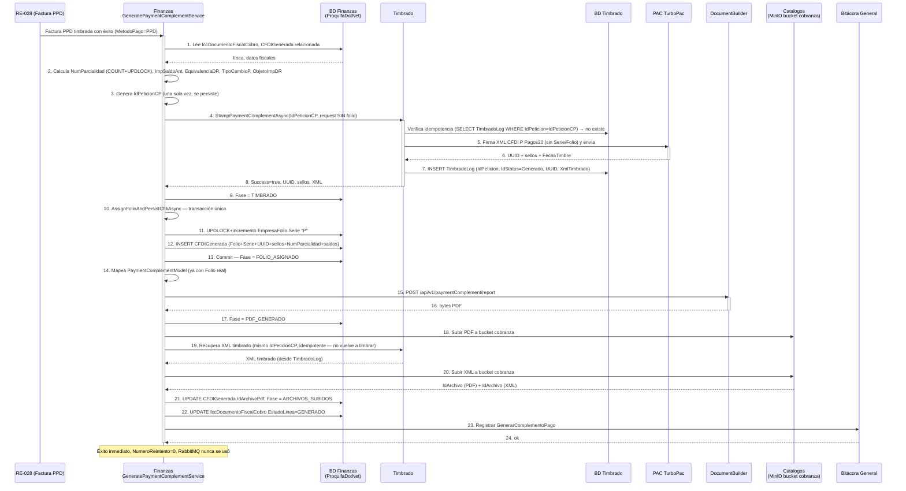
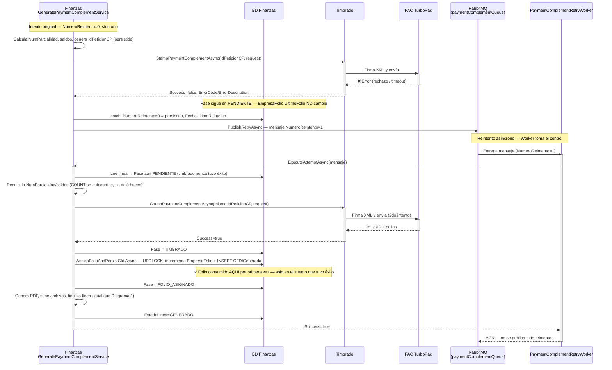
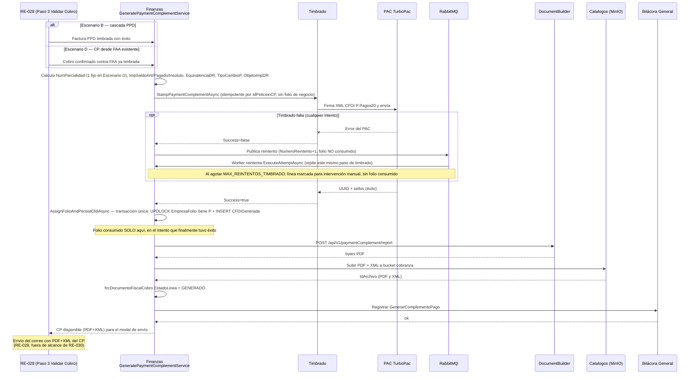

# Diseño de la Solución — Endpoint Complemento de Pago (Backend)

| Campo | Valor |
|---|---|
| **FORMATO** | Backend |
| **PROYECTO** | R16 |
| **REFERENCIA** | R16A-RE-FU-030 |
| **VERSIÓN** | 1.0 |
| **FECHA** | 24/06/2026 |
| **AUTOR** | Jose Perez |
| **REVISOR** | Valdemar Farina Sánchez |

## Introducción

### Propósito del documento

Este documento define el diseño de la solución técnica completa de **R16A-RE-FU-030 — Diseño y generación de Documentos: Complemento de Pago México**, cubriendo los cuatro aplicativos involucrados: base de datos (ProquifaDotNet + ProquifaDotNetTimbrado + DocumentBuilder), el timbrado del CFDI tipo P en ProquifaDotNet.Timbrado, el cálculo fiscal y la orquestación en ProquifaDotNet.Finanzas, y el nuevo endpoint `POST /api/v1/paymentComplement/report` en **DocumentBuilder API**.

El punto de entrada al alcance de este documento es `GeneratePaymentComplementService` en ProquifaDotNet.Finanzas (ver "Diagrama de flujo end-to-end" más abajo), disparado automáticamente cuando el Paso 3 del wizard de Validar Cobro (R16A-RE-FU-028) timbra exitosamente una Factura PPD (Escenario B) o procesa un cobro contra una Factura por Adelantado existente (Escenario D). El timbrado de esa Factura PPD y la infraestructura base del Paso 3 son responsabilidad de R16A-RE-FU-028 y quedan fuera de alcance — se documentan aquí solo como contexto del disparador.

El endpoint de generación de PDF sigue el mismo patrón arquitectónico de `POST /api/report/quotation` ya existente: usa render único (sin `ReplaceLastPage`) porque el Complemento de Pago no tiene una última página de totales dinámica.

Las secciones de este documento están ordenadas siguiendo el flujo real de ejecución (ver diagrama): primero Base de Datos (prerrequisito de todo lo demás), luego Finanzas — Orquestación, luego Timbrado, luego Finanzas — Persistencia, y finalmente el endpoint DocumentBuilder que Persistencia invoca.

| Ítem | Valor |
|---|---|
| Requisito de este documento | R16A-RE-FU-030 — Diseño y generación de Documentos: Complemento de Pago México |
| Requisito disparador (fuera de alcance) | R16A-RE-FU-028 — Validar Cobro Paso 3 México |
| Tipo de documento fiscal | Complemento de Pago (CFDI tipo P) |
| Versiones CFDI soportadas | 4.0 (Pagos 2.0) y 3.3 (Pagos 1.0) |
| Endpoint referencia (patrón) | `POST /api/report/quotation` |
| Aplicativos | ProquifaDotNet + ProquifaDotNet.Finanzas + ProquifaDotNet.Timbrado + DocumentBuilder API |

### Alcance

Este documento cubre el diseño backend completo de R16A-RE-FU-030 en sus cuatro aplicativos: ProquifaDotNet (BD), ProquifaDotNet.Finanzas, ProquifaDotNet.Timbrado y DocumentBuilder API. Considera:

- Cambios de base de datos en ProquifaDotNet, ProquifaDotNetTimbrado y DocumentBuilder (sección "Base de Datos")
- Cálculo de valores fiscales del DoctoRelacionado, cascada PPD y generación desde Factura por Adelantado existente en ProquifaDotNet.Finanzas (secciones "ProquifaDotNet.Finanzas")
- Endpoint de timbrado del Complemento de Pago (CFDI 4.0 Pagos20 v2.0) en ProquifaDotNet.Timbrado (sección "ProquifaDotNet.Timbrado")
- Nuevo endpoint REST `POST /api/v1/paymentComplement/report` en DocumentBuilder API, que consume el modelo armado por Finanzas para generar el PDF representativo
- DTOs de entrada y modelos de datos del endpoint DocumentBuilder
- Pipeline de generación (render HTML → conversión PDF)
- Validaciones FluentValidation
- Archivos a crear / modificar en los cuatro aplicativos
- Registro de dependencias (DI)

#### Específicamente incluye:

- Base de datos: catálogo `catFormaPagoSAT` (reutilizado, ya existe desde RE-024 — no se crea), DML `catUsoCFDI` (clave CP01), ALTER `fccDocumentoFiscalCobro` (8 columnas snapshot DR + `IdPeticionCP`/`NumeroReintento`/`FechaUltimoReintento` de checkpoint), DML `EmpresaFolio` Serie "P" (propiedad Finanzas), DML `DocumentTemplate`, ALTER VIEW `vfccDocumentoFiscalCobro` v3.0
- Finanzas: `PaymentComplementCalculationService`, `GeneratePaymentComplementService` (cascada PPD y generación desde FAA; consume folio Serie "P" e inserta `CFDIGenerada` **después** del timbrado exitoso, reanudable por fase), `PaymentComplementPdfMappingService`, `PersistPaymentComplementPdfService`
- Timbrado: construcción del XML CFDI 4.0 Pagos20 v2.0 (sin Serie/Folio de negocio), integración con PAC TurboPac, idempotencia por `IdPeticionCP` vía `TimbradoLog`
- Nuevo endpoint en `ReportController.cs` con ruta `v1/paymentComplement/report`
- DTO raíz `DocumentGeneratePaymentComplementDto` y 9 sub-modelos bajo `Application/DTOs/PaymentComplement/`
- 4 validadores FluentValidation bajo `Application/Validators/PaymentComplement/`
- Extensión de servicio `GenerateDocumentService.PaymentComplementExtension.cs` con pipeline de 14 pasos
- Actualización de la interfaz `IGenerateDocumentService.cs`
- Registro del validator raíz en el contenedor de DI

#### No se consideran:

- Plantillas HTML (body/header/footer) de cada `TemplateKey` — diseño gráfico, se define en la tarea de DocumentBuilder dedicada a los templates
- Integración con el frontend ni el wizard FU-028
- Mecanismo de reintento formal ante fallo del PAC (pendiente de definición con PMO, ver sección "Pendientes y Brechas")

## Visión general del diseño

### Objetivo técnico

Generar automáticamente el Complemento de Pago (CFDI tipo P) desde el cálculo fiscal en Finanzas, pasando por el timbrado ante el PAC TurboPac, hasta la generación y persistencia de su PDF representativo, mediante un pipeline de render HTML → PDF que usa las plantillas registradas por `TemplateKey` en base de datos.

Soportar las variantes fiscales más comunes: CFDI 4.0 y 3.3, pago en MXN y USD, con y sin IVA, con uno o múltiples documentos relacionados.

El endpoint de DocumentBuilder actúa como servicio puro de generación de PDF; no realiza timbrado ni consulta al SAT — eso ocurre antes, en ProquifaDotNet.Timbrado.

### Componentes involucrados

| Aplicativo | Componente | Responsabilidad | Ubicación |
|---|---|---|---|
| ProquifaDotNet.Finanzas | `PaymentComplementCalculationService` | Cálculo fiscal del DoctoRelacionado (NumParcialidad, saldos, EquivalenciaDR, FechaPago) | `Proquifa.Finanzas.Application/Services/PaymentComplement/PaymentComplementCalculationService.cs` (nuevo) |
| ProquifaDotNet.Finanzas | `GeneratePaymentComplementService` | Orquesta cascada PPD (Escenario B) y generación desde FAA (Escenario D) | `Proquifa.Finanzas.Application/Services/PaymentComplement/GeneratePaymentComplementService.cs` (nuevo) |
| ProquifaDotNet.Timbrado | `TimbradoController.StampPaymentComplement` / `TimbradoService.StampPaymentComplementAsync` | Construye y timbra el XML CFDI 4.0 Pagos20 v2.0 ante el PAC | `Proquifa.Timbrado.API/Controllers/TimbradoController.cs` + `Proquifa.Timbrado.Application/Services/TimbradoService.cs` (ampliación de archivos existentes desde RE-018/019) |
| ProquifaDotNet.Finanzas | `PaymentComplementPdfMappingService` / `PersistPaymentComplementPdfService` | Mapea el CFDI timbrado, invoca DocumentBuilder y persiste PDF+XML en MinIO | `Proquifa.Finanzas.Application/Services/PaymentComplement/` (nuevo) |
| DocumentBuilder API | ReportController | Exponer endpoint REST y retornar PDF | `API/Controllers/ReportController.cs` |
| DocumentBuilder API | IGenerateDocumentService | Contrato del servicio de generación | `Application/Interfaces/IGenerateDocumentService.cs` |
| DocumentBuilder API | GenerateDocumentService (extensión) | Pipeline completo: template → render HTML → PDF | `Application/Services/GenerateDocumentService.PaymentComplementExtension.cs` |
| DocumentBuilder API | FluentValidation Validators | Validar DTO de entrada antes del procesamiento | `Application/Validators/PaymentComplement/` |
| DocumentBuilder API | PaymentComplement DTOs | Modelos tipados del request (9 clases) | `Application/DTOs/PaymentComplement/` |

## Diagrama de flujo end-to-end

> **Regla de folio — cero huecos:** el folio (Serie "P") y el `INSERT CFDIGenerada` viven en Finanzas, **después** de recibir UUID+sellos exitosos de Timbrado — no antes de llamar al PAC. Los CP que salen correctos deben ser 1,2,3,4... sin saltos; si el folio se reservara antes de llamar al PAC, cada intento fallido de `PaymentComplementRetryWorker` quemaría un folio que nunca se usa. El folio interno de ProquifaDotNet no viaja dentro del XML firmado que se manda al PAC — el SAT solo exige UUID, no Folio/Serie (atributos opcionales del esquema) — así que se asigna con seguridad después de que el timbrado ya es un hecho confirmado, sin tocar el contenido certificado.

```
[RE-028] Timbrado Factura PPD (Paso 3)  ← disparador externo, ya existente, fuera de alcance
        │ éxito
        ▼
★═══ INICIO DEL ALCANCE DE ESTE DOCUMENTO (R16A-RE-FU-030) ═══★
[RE-030] GeneratePaymentComplementService (Escenario B)          — sección "ProquifaDotNet.Finanzas — Orquestación y cálculo"
        │
        ├─► [RE-030] PaymentComplementCalculationService (NumParcialidad vía COUNT+UPDLOCK — no consume folio,
        │            se autocorrige en cada intento; saldos, EquivalenciaDR, TipoCambioP, ObjetoImpDR/ImpuestosDR)
        │
        ▼
[RE-030] Timbrado — Endpoint CP (SIN folio; idempotente por IdPeticionCP) ──error──► [RE-028] Factura PPD vigente;
        │ éxito (UUID + sellos, sin folio)                                          línea = TIMBRADO nunca alcanzado,
        ▼                                                                            se re-encola (ver Worker)
[RE-030] Finanzas — AssignFolioAndPersistCfdiAsync (transacción única, corta, sin llamadas externas):
        │   UPDLOCK+incremento EmpresaFolio Serie "P"  +  INSERT CFDIGenerada (Folio+Serie+UUID+sellos+NumParcialidad+saldos)
        │   — sección "ProquifaDotNet.Finanzas — Orquestación y cálculo"; fase línea → FOLIO_ASIGNADO
        ▼
[RE-030] PersistPaymentComplementPdfService                    — sección "ProquifaDotNet.Finanzas — Persistencia del PDF y XML"
        │
        ├─► [RE-030] PaymentComplementPdfMappingService.MapAsync() (ya con Folio real, disponible desde el paso anterior) — fase línea → PDF_GENERADO
        ├─► [RE-030] DocumentBuilder POST /api/v1/paymentComplement/report (endpoint de este documento — tu código; sección "Diseño funcional detallado")
        └─► [RE-030] MinIO bucket "cobranza" + UPDATE CFDIGenerada.IdArchivoPdf — fase línea → ARCHIVOS_SUBIDOS
        ▼
[RE-028+RE-030] UPDATE fccDocumentoFiscalCobro (EstadoLinea=GENERADO, snapshot DR)
                 (tabla creada en RE-028; columnas de snapshot DR + checkpoint agregadas en RE-030)

[RE-028+RE-030] Escenario D (CP desde FAA existente): mismo flujo desde PaymentComplementCalculationService,
sin el timbrado previo de Factura PPD; NumParcialidad fijo en 1.
```

Cada sección técnica que sigue está ordenada exactamente en esta secuencia: Base de Datos (prerrequisito) → Finanzas/Orquestación → Timbrado → Finanzas/Persistencia → DocumentBuilder.

> ✅ **Pendiente P10 — Resuelto:** diagramas de secuencia end-to-end agregados abajo (comentario de revisión, Juan David García Cruz). Ver "Pendientes y Brechas".

---

## Diagramas

### Diagrama 1 — Happy path completo (Escenario B, cascada PPD)

Caso feliz: todo tiene éxito al primer intento. Participantes: Finanzas (`GeneratePaymentComplementService`), BD Finanzas (ProquifaDotNet), Timbrado, BD Timbrado, PAC, DocumentBuilder, Catalogos (MinIO), Bitácora General.



### Diagrama 2 — Happy path + 1 reintento de foliado

Mismo flujo, pero el primer intento de timbrado falla (ej. PAC no responde). El folio **no se toca** en el intento fallido — solo se consume cuando el reintento tiene éxito. Ilustra la garantía de cero huecos: si esta línea fuera la N-ésima en fallar y reintentar, el folio que obtiene al final sigue siendo el siguiente consecutivo disponible en ese momento, no uno "reservado" desde el intento 1.



### Diagrama 3 — Vista general del requisito (Escenario B y D, con reintento y correo)

Panorama completo de todo lo que hace RE-030, en un solo diagrama de secuencia: los 2 disparadores (Escenario B/D), el ciclo de reintento (colapsado en un bloque `opt`), y el paso posterior de envío de correo (RE-028, fuera de alcance, mostrado solo como continuidad).



---

## Base de Datos (ProquifaDotNet + ProquifaDotNetTimbrado + DocumentBuilder)

### catFormaPagoSAT — reutilizada, NO se crea

> Este catálogo **ya existe**, creado por R16A-RE-FU-024 ("Catálogo c_FormaPago SAT para captura del cobro", confirmado contra `ER-Finanzas.md` y el comando de Scaffold de `Finanzas.Infrastructure`, que ya incluye `--table catFormaPagoSAT`). No se ejecuta ningún `CREATE TABLE` para RE-030.

RE-030 solo **reutiliza** la FK ya existente `fccDocumentoFiscalCobro.IdCatFormaPagoSAT → catFormaPagoSAT.IdCatFormaPagoSAT` para resolver `FormaDePagoP` del nodo Pago (no confundir con `catMetodoDePagoCFDI`, que distingue PPD/PUE).

**Criterio de aceptación:** `SELECT * FROM catFormaPagoSAT WHERE Clave='03'` retorna "Transferencia electrónica de fondos" con `Activo=1` (dato ya sembrado por RE-024, no por RE-030).

### CREATE TABLE ValorConfiguracion

Tabla genérica nueva en `ProquifaDotNet` (no existe hoy — confirmado contra el schema actual; no confundir con `ValorConfiguracionTiempoEntrega`, que es de otro dominio). Almacena parámetros de configuración clave-valor reutilizables por cualquier módulo, no exclusiva de Complemento de Pago. RE-030 la usa para el máximo de reintentos de timbrado (ver sección "Reintento asíncrono vía RabbitMQ").

```sql
USE [ProquifaDotNet]
GO

BEGIN
    IF OBJECT_ID(N'[dbo].[ValorConfiguracion]', 'U') IS NOT NULL
    BEGIN
        RAISERROR('Error al crear la entidad [dbo].[ValorConfiguracion], el objeto ya existe.', 0, 1) WITH NOWAIT;
    END
    ELSE
    BEGIN
        CREATE TABLE [dbo].[ValorConfiguracion](
            [IdValorConfiguracion] uniqueidentifier NOT NULL CONSTRAINT [DF_ValorConfiguracion_Id] DEFAULT (NEWID()),
            [Clave]                varchar(100)      NOT NULL COLLATE SQL_Latin1_General_CP1_CI_AS,
            [Valor]                nvarchar(500)     NOT NULL COLLATE SQL_Latin1_General_CP1_CI_AS,
            [Descripcion]          nvarchar(300)     NULL     COLLATE SQL_Latin1_General_CP1_CI_AS,
            [Activo]               bit               NOT NULL CONSTRAINT [DF_ValorConfiguracion_Activo] DEFAULT (1),
            [FechaRegistro]        datetime2(7)      NOT NULL CONSTRAINT [DF_ValorConfiguracion_FechaReg] DEFAULT (SYSUTCDATETIME()),
            CONSTRAINT [PK_ValorConfiguracion] PRIMARY KEY CLUSTERED ([IdValorConfiguracion]),
            CONSTRAINT [UQ_ValorConfiguracion_Clave] UNIQUE ([Clave])
        );
        PRINT 'Entidad [dbo].[ValorConfiguracion] creada correctamente';
    END
END
GO

BEGIN TRY
    IF NOT EXISTS (SELECT 1 FROM dbo.ValorConfiguracion WHERE Clave = 'MAX_REINTENTOS_TIMBRADO')
    BEGIN
        INSERT INTO dbo.ValorConfiguracion (Clave, Valor, Descripcion)
        VALUES ('MAX_REINTENTOS_TIMBRADO', '5', 'Número máximo de REINTENTOS (no cuenta la ejecución original) para procesos de reintento asíncrono; ej. timbrado. Con valor 5: hasta 6 ejecuciones totales (1 original + 5 reintentos).');
        PRINT 'Valor MAX_REINTENTOS_TIMBRADO insertado correctamente en ValorConfiguracion';
    END
    ELSE
    BEGIN
        RAISERROR('La clave MAX_REINTENTOS_TIMBRADO ya existe en ValorConfiguracion', 0, 1) WITH NOWAIT;
    END
END TRY
BEGIN CATCH
    DECLARE @Error VARCHAR(2048) = ERROR_MESSAGE();
    RAISERROR('Error al insertar MAX_REINTENTOS_TIMBRADO en ValorConfiguracion: %s', 15, 1, @Error) WITH NOWAIT;
END CATCH
GO
```

**Criterios de aceptación:** `ValorConfiguracion` existe con PK + UNIQUE en `Clave`; fila `MAX_REINTENTOS_TIMBRADO`/`5` presente y `Activo=1`; tabla reutilizable por cualquier módulo futuro que necesite un valor de configuración genérico (no solo Complemento de Pago).

### DML catUsoCFDI — INSERT clave CP01

`catUsoCFDI` existe desde un requisito anterior pero no contiene la clave `CP01`, obligatoria en el nodo Receptor del Complemento de Pago (Regla 6 / Criterio C3 del requisito).

```sql
USE [ProquifaDotNet]
GO

BEGIN TRY
    IF EXISTS (SELECT 1 FROM dbo.catUsoCFDI WHERE ClaveUso = 'CP01')
    BEGIN
        RAISERROR('La clave CP01 ya existe en catUsoCFDI', 0, 1) WITH NOWAIT;
    END
    ELSE
    BEGIN
        INSERT INTO dbo.catUsoCFDI (ClaveUso, Uso, Clave, Activo)
        VALUES ('CP01', 'CP01 Pagos', 'CP01', 1);
        PRINT 'Clave CP01 insertada correctamente en catUsoCFDI';
    END
END TRY
BEGIN CATCH
    DECLARE @Error VARCHAR(2048) = ERROR_MESSAGE();
    RAISERROR('Error al insertar clave CP01 en catUsoCFDI: %s', 15, 1, @Error) WITH NOWAIT;
END CATCH
GO
```

**Criterio de aceptación:** exactamente 1 fila con `Activo=1`; no se modifican filas existentes.

### ALTER TABLE fccDocumentoFiscalCobro — Snapshot fiscal del CP

Se agregan 8 columnas nullable que almacenan el snapshot inmutable del nodo `DoctoRelacionado` y del nodo `Pago` al momento del timbrado. Son NULL para líneas no-CP (FACTURA, FACTURA_ANTICIPO, líneas Perú).

| Columna | Tipo | Campo XML |
|---|---|---|
| `FechaPagoCP` | datetime2(7) | `FechaPago` |
| `IdCatFormaPagoSAT` | uniqueidentifier FK | `FormaDePagoP` |
| `TipoCambioP_CP` | decimal(18,6) | `TipoCambioP` |
| `NumParcialidad` | int | `NumParcialidad` |
| `ImpSaldoAnt` | decimal(18,6) | `ImpSaldoAnt` |
| `ImpPagado` | decimal(18,6) | `ImpPagado` |
| `ImpSaldoInsoluto` | decimal(18,6) | `ImpSaldoInsoluto` = ImpSaldoAnt − ImpPagado |
| `EquivalenciaDR` | decimal(18,6) | `EquivalenciaDR` (1 si MonedaDR = MonedaP) |

```sql
USE [ProquifaDotNet]
GO

BEGIN TRY
    IF COL_LENGTH(N'[dbo].[fccDocumentoFiscalCobro]', 'FechaPagoCP') IS NOT NULL
    BEGIN
        RAISERROR('Las columnas de snapshot fiscal del CP ya existen en fccDocumentoFiscalCobro', 0, 1) WITH NOWAIT;
    END
    ELSE
    BEGIN
        ALTER TABLE [dbo].[fccDocumentoFiscalCobro]
            ADD [FechaPagoCP]        datetime2(7)     NULL,
                [IdCatFormaPagoSAT]  uniqueidentifier NULL,
                [TipoCambioP_CP]     decimal(18,6)    NULL,
                [NumParcialidad]     int              NULL,
                [ImpSaldoAnt]        decimal(18,6)    NULL,
                [ImpPagado]          decimal(18,6)    NULL,
                [ImpSaldoInsoluto]   decimal(18,6)    NULL,
                [EquivalenciaDR]     decimal(18,6)    NULL;

        ALTER TABLE [dbo].[fccDocumentoFiscalCobro]
            ADD CONSTRAINT [FK_fccDocumentoFiscalCobro_FormaPagoSAT]
                FOREIGN KEY ([IdCatFormaPagoSAT])
                REFERENCES [dbo].[catFormaPagoSAT]([IdCatFormaPagoSAT]);

        PRINT 'Columnas de snapshot fiscal del CP agregadas correctamente en fccDocumentoFiscalCobro';
    END
END TRY
BEGIN CATCH
    DECLARE @Error VARCHAR(2048) = ERROR_MESSAGE();
    RAISERROR('Error al agregar columnas de snapshot fiscal del CP en fccDocumentoFiscalCobro: %s', 15, 1, @Error) WITH NOWAIT;
END CATCH
GO
```

**Prerrequisito:** `catFormaPagoSAT` ya existe (RE-024) — la FK `FK_fccDocumentoFiscalCobro_FormaPagoSAT` se agrega directo, sin dependencia de un CREATE previo. `ImpSaldoInsoluto` se calcula en capa de aplicación (Finanzas) y se persiste como snapshot; no hay trigger ni computed column, para evitar recomputación si cambian datos relacionados.

**Criterio de aceptación:** 8 columnas nullable existen; FK activa; filas existentes conservan NULL.

### ALTER TABLE fccDocumentoFiscalCobro — Checkpoint de reintento (resuelve P5/P12 con detalle)

> Necesarias porque el reintento vía RabbitMQ (sección "Reintento asíncrono vía RabbitMQ") debe sobrevivir a un crash del Worker y no puede depender únicamente del contador que viaja en el payload del mensaje — un mensaje redisparado por RabbitMQ (entrega "at-least-once") sin este checkpoint volvería a timbrar y a consumir folio para una línea que ya tuvo éxito.

```sql
USE [ProquifaDotNet]
GO

-- Correlación (IdPeticionCP) generada por Finanzas ANTES de llamar a Timbrado (una sola vez, persistida
-- en el primer intento). Permite verificar, antes de timbrar, si esta línea ya tiene un timbrado exitoso
-- registrado (ver "Idempotencia del timbrado") y evita doble-timbrado ante un mensaje de RabbitMQ
-- redisparado o un crash del Worker a medio proceso.
BEGIN TRY
    IF COL_LENGTH(N'[dbo].[fccDocumentoFiscalCobro]', 'IdPeticionCP') IS NOT NULL
    BEGIN
        RAISERROR('Las columnas de checkpoint de reintento ya existen en fccDocumentoFiscalCobro', 0, 1) WITH NOWAIT;
    END
    ELSE
    BEGIN
        ALTER TABLE [dbo].[fccDocumentoFiscalCobro]
            ADD [IdPeticionCP]        uniqueidentifier NULL,
                [NumeroReintento]     int              NOT NULL
                    CONSTRAINT [DF_fccDocumentoFiscalCobro_NumReintento] DEFAULT (0),
                [FechaUltimoReintento] datetime2(7)     NULL;
        PRINT 'Columnas de checkpoint de reintento agregadas correctamente en fccDocumentoFiscalCobro';
    END
END TRY
BEGIN CATCH
    DECLARE @Error VARCHAR(2048) = ERROR_MESSAGE();
    RAISERROR('Error al agregar columnas de checkpoint de reintento en fccDocumentoFiscalCobro: %s', 15, 1, @Error) WITH NOWAIT;
END CATCH
GO
```

Se agregan también 3 claves nuevas a `catDocumentoFiscalCobroEstado` (tabla existente, RE-028) para modelar el checkpoint entre `PENDIENTE` y `GENERADO`:

```sql
USE [ProquifaDotNet]
GO

BEGIN TRY
    IF EXISTS (SELECT 1 FROM dbo.catDocumentoFiscalCobroEstado WHERE Clave = 'TIMBRADO')
    BEGIN
        RAISERROR('Las claves de checkpoint ya existen en catDocumentoFiscalCobroEstado', 0, 1) WITH NOWAIT;
    END
    ELSE
    BEGIN
        INSERT INTO dbo.catDocumentoFiscalCobroEstado (IdCatDocumentoFiscalCobroEstado, Clave, Descripcion, Activo, FechaRegistro) VALUES
        (NEWID(), 'TIMBRADO',         'CP timbrado ante PAC (UUID obtenido); pendiente de folio y CFDIGenerada',                 1, SYSUTCDATETIME()),
        (NEWID(), 'FOLIO_ASIGNADO',   'Folio consumido y CFDIGenerada insertado (Folio+UUID+sellos); pendiente de generar PDF', 1, SYSUTCDATETIME()),
        (NEWID(), 'PDF_GENERADO',     'PDF generado; pendiente de subir PDF+XML a MinIO',                                      1, SYSUTCDATETIME()),
        (NEWID(), 'ARCHIVOS_SUBIDOS', 'PDF y XML subidos a MinIO; pendiente de snapshot final',                                1, SYSUTCDATETIME());
        -- Orden resultante: PENDIENTE -> TIMBRADO -> FOLIO_ASIGNADO -> PDF_GENERADO -> ARCHIVOS_SUBIDOS -> GENERADO -> ENVIADO
        PRINT 'Claves de checkpoint insertadas correctamente en catDocumentoFiscalCobroEstado';
    END
END TRY
BEGIN CATCH
    DECLARE @Error VARCHAR(2048) = ERROR_MESSAGE();
    RAISERROR('Error al insertar claves de checkpoint en catDocumentoFiscalCobroEstado: %s', 15, 1, @Error) WITH NOWAIT;
END CATCH
GO
```

**Por qué `TIMBRADO` y `FOLIO_ASIGNADO` son fases separadas (no una sola):** el `INSERT CFDIGenerada` con folio ya consumido es una operación local (sin llamada externa) y debe quedar aislado como su propio checkpoint. Si el proceso truena después de `FOLIO_ASIGNADO` pero antes de `PDF_GENERADO`, un reintento debe **saltarse** el timbrado (idempotente, ya en `TIMBRADO`) y **saltarse** también el folio+INSERT (ya en `FOLIO_ASIGNADO`, folio ya consumido y CFDI ya registrado) — repetir esa transacción causaría un segundo folio y un `CFDIGenerada` duplicado para el mismo CP.

**Por qué el folio no tiene columna propia de "reservado":** a diferencia de un diseño con reserva-y-reuso, aquí el folio se consume **después** de que Timbrado confirma éxito (ver "ProquifaDotNet.Timbrado" y "ProquifaDotNet.Finanzas — Orquestación y cálculo" más abajo), en la misma transacción que el `INSERT CFDIGenerada` — no hay ventana intermedia entre "folio tomado" y "CFDI registrado" que rastrear, porque ambas operaciones ocurren juntas y de forma atómica. Esto es lo que garantiza folios sin huecos: ningún intento fallido —ni el original ni ningún reintento— llega a tocar `EmpresaFolio.UltimoFolio`.

**Criterio de aceptación:** `IdPeticionCP` se persiste en el primer intento (original, `NumeroReintento=0`) y no cambia entre reintentos de la misma línea; `NumeroReintento` y `FechaUltimoReintento` se actualizan en cada intento fallido; una línea con `Fase >= TIMBRADO` nunca vuelve a invocar `StampPaymentComplementAsync` en un reintento posterior.

### DML EmpresaFolio — Serie "P" (GOL, MUN, PRO, PQF)

Se insertan 4 filas en `ProquifaDotNetTimbrado.EmpresaFolio` (estructura de RE-019) con Serie `"P"` para las 4 empresas México. Mismo patrón UPDLOCK que el foliador de Facturas.

```sql
USE [ProquifaDotNet]
GO

BEGIN TRY
    IF EXISTS (SELECT 1 FROM dbo.EmpresaFolio ef INNER JOIN dbo.Empresa e ON e.IdEmpresa = ef.IdEmpresa WHERE ef.Serie = 'P' AND e.Prefijo IN ('GOL','MUN','PRO','PQF'))
    BEGIN
        RAISERROR('Ya existen filas Serie P en EmpresaFolio para GOL/MUN/PRO/PQF', 0, 1) WITH NOWAIT;
    END
    ELSE
    BEGIN
        INSERT INTO dbo.EmpresaFolio (IdEmpresa, Serie, UltimoFolio, FormatoFolio, LongitudMaxima, Activo)
        SELECT e.IdEmpresa, 'P', 0, 'P{folio:00000000}', 8, 1
        FROM dbo.Empresa e
        WHERE e.Prefijo IN ('GOL', 'MUN', 'PRO', 'PQF');

        PRINT 'Filas Serie P insertadas correctamente en EmpresaFolio para GOL/MUN/PRO/PQF';
    END
END TRY
BEGIN CATCH
    DECLARE @Error VARCHAR(2048) = ERROR_MESSAGE();
    RAISERROR('Error al insertar filas Serie P en EmpresaFolio: %s', 15, 1, @Error) WITH NOWAIT;
END CATCH
GO
```

> ⚠️ **Pendiente:** `FormatoFolio` y `LongitudMaxima` son propuesta inicial; formato definitivo pendiente de validar con PMO (Regla 12 del requisito, ver "Pendientes y Brechas").

**Criterio de aceptación:** 4 filas Serie "P", `UltimoFolio=0`, `Activo=1`; series de Factura existentes no se modifican.

### DML DocumentTemplate — 4 templates PDF CP México

Se registran en `DocumentBuilder.DocumentTemplate` (base de datos separada, no ProquifaDotNet) los 4 templates del Complemento de Pago:

| TemplateKey | Empresa emisora |
|---|---|
| `GOL_MEX_CP` | Golocaer |
| `MUN_MEX_CP` | Mungen |
| `PRO_MEX_CP` | Proquifa |
| `PQF_MEX_CP` | Proveedora Quimico Farmaceutica |

Convención de archivos: `{TemplateKey}_{H/B/F}.html`, los tres siempre usados (`HasHeader/Body/Footer=1`). Estos son los `TemplateKey` autoritativos: la sección "TemplateKeys y variantes soportadas" de este documento debe usar exactamente estos valores.

```sql
USE [DocumentBuilder]
GO

BEGIN TRY
    IF EXISTS (SELECT 1 FROM dbo.DocumentTemplate WHERE TemplateKey IN ('GOL_MEX_CP','MUN_MEX_CP','PRO_MEX_CP','PQF_MEX_CP'))
    BEGIN
        RAISERROR('Ya existen templates GOL/MUN/PRO/PQF_MEX_CP en DocumentTemplate', 0, 1) WITH NOWAIT;
    END
    ELSE
    BEGIN
        INSERT INTO dbo.DocumentTemplate (TemplateKey, HeaderTemplateFileName, BodyTemplateFileName, FooterTemplateFileName, HasHeaderTemplate, HasBodyTemplate, HasFooterTemplate, RegistrationDate, LastUpdateDate, IsActive)
        VALUES
            ('GOL_MEX_CP', 'GOL_MEX_CP_H.html', 'GOL_MEX_CP_B.html', 'GOL_MEX_CP_F.html', 1, 1, 1, GETDATE(), GETDATE(), 1),
            ('MUN_MEX_CP', 'MUN_MEX_CP_H.html', 'MUN_MEX_CP_B.html', 'MUN_MEX_CP_F.html', 1, 1, 1, GETDATE(), GETDATE(), 1),
            ('PRO_MEX_CP', 'PRO_MEX_CP_H.html', 'PRO_MEX_CP_B.html', 'PRO_MEX_CP_F.html', 1, 1, 1, GETDATE(), GETDATE(), 1),
            ('PQF_MEX_CP', 'PQF_MEX_CP_H.html', 'PQF_MEX_CP_B.html', 'PQF_MEX_CP_F.html', 1, 1, 1, GETDATE(), GETDATE(), 1);

        PRINT 'Templates GOL/MUN/PRO/PQF_MEX_CP insertados correctamente en DocumentTemplate';
    END
END TRY
BEGIN CATCH
    DECLARE @Error VARCHAR(2048) = ERROR_MESSAGE();
    RAISERROR('Error al insertar templates MEX_CP en DocumentTemplate: %s', 15, 1, @Error) WITH NOWAIT;
END CATCH
GO
```

**Criterio de aceptación:** 4 registros con `IsActive=1`; `BodyTemplateFileName` sigue la convención `{TemplateKey}_B.html`.

### ALTER VIEW vfccDocumentoFiscalCobro v3.0

Extensión incremental sobre v2.0 (RE-029): agrega las 8 columnas DR del CP y `LEFT JOIN catFormaPagoSAT` para resolver `FormaPagoClave`/`FormaPagoDescripcion`.

```sql
USE [ProquifaDotNet]
GO

CREATE OR ALTER VIEW [dbo].[vfccDocumentoFiscalCobro]
AS
-- [ INCLUIR DEFINICIÓN COMPLETA DE v2.0 (R16A-RE-FU-029_BD.md) ]
-- [ AGREGAR AL SELECT, después de los campos Perú v2.0: ]
--
--     p3l.FechaPagoCP, p3l.IdCatFormaPagoSAT,
--     fpago.Clave AS FormaPagoClave, fpago.Descripcion AS FormaPagoDescripcion,
--     p3l.TipoCambioP_CP, p3l.NumParcialidad, p3l.ImpSaldoAnt,
--     p3l.ImpPagado, p3l.ImpSaldoInsoluto, p3l.EquivalenciaDR
--
-- [ AGREGAR AL FROM/JOINs, después de los JOINs Perú v2.0: ]
--
--     LEFT JOIN dbo.catFormaPagoSAT fpago ON p3l.IdCatFormaPagoSAT = fpago.IdCatFormaPagoSAT
GO

EXEC [dbo].[spRefrescarVistas];
GO
```

**Prerrequisitos:** `catFormaPagoSAT` y las columnas DR de `fccDocumentoFiscalCobro` ejecutadas. El script completo debe incluir la definición íntegra de v2.0 (ver `R16A-RE-FU-029_BD.md`), no solo el incremento. `CREATE OR ALTER VIEW` (no `ALTER VIEW` a secas, corregido para cumplir el estándar de BD) + `EXEC spRefrescarVistas` obligatorio después de toda vista nueva o modificada.

**Criterio de aceptación:** vista compila; `SELECT TOP 5 * FROM vfccDocumentoFiscalCobro WHERE TipoDocumentoFiscal='COMPLEMENTO_PAGO'` retorna filas; columnas Perú (v2.0) siguen funcionales.

---

## ProquifaDotNet.Finanzas — Orquestación y cálculo (Escenario B y D)

> **Corrección de arquitectura:** ProquifaDotNet.Finanzas y ProquifaDotNet.Timbrado **ya existen como soluciones** — creadas en R16A-RE-FU-016 (Finanzas) y R16A-RE-FU-018 (Timbrado), y ya ampliadas una vez en R16A-RE-FU-019 (flujo de timbrado de Factura por Adelantado). Ambas son Clean Architecture (.NET Core 10, capas `Domain/Application/Infrastructure/API/Worker/Testing`), basadas en el repositorio `proquifa-punchout-backend`. RE-030 **amplía** los mismos proyectos y sigue el mismo patrón que RE-019 estableció para `timbrar-faa` — no crea controllers/servicios paralelos desde cero. Namespaces reales: `Proquifa.Finanzas.*` y `Proquifa.Timbrado.*` (no `Logic.Pqf.Finanzas.*` ni `WebApi.Timbrado.*`, que son la convención legacy de `ProquifaDotNet.sln`, .NET Framework 4.8, no aplicable aquí).

Esta sección documenta el punto de entrada del alcance (`GeneratePaymentComplementService`, primer nodo `[RE-030]` del diagrama) y el servicio de cálculo del que depende. Ambos son componentes **nuevos** dentro de `Proquifa.Finanzas.Application.Services` (el módulo de Validar Cobro/Complemento de Pago no existía antes de R16A-RE-FU-028/030).

### PaymentComplementCalculationService

Ruta propuesta: `Proquifa.Finanzas.Application/Services/PaymentComplement/PaymentComplementCalculationService.cs`

```csharp
namespace Proquifa.Finanzas.Application.Services.PaymentComplement
{
    public class PaymentComplementCalculationService
    {
        // Constants (reviewer comments: avoid raw "MXN" / "02" literals scattered in comparisons)
        private const string MxnCurrencyCode = "MXN";
        private const string TaxableRelatedDocumentObject = "02"; // ObjetoImpDR = "02" → related document carries IVA

        /// <summary>
        /// Calculates the consecutive NumParcialidad for the related invoice.
        /// Must run with UPDLOCK inside the same transaction as the stamping call.
        /// </summary>
        /// <remarks>
        /// Justificación para NO usar LINQ aquí (única excepción de este documento — todo el resto de
        /// las consultas a BD usa LINQ, ver métodos de este mismo servicio): EF Core no traduce table
        /// hints de SQL Server (<c>WITH (UPDLOCK, ROWLOCK)</c>) a partir de una expresión LINQ — no existe
        /// un operador LINQ equivalente a un lock hint pesimista. El bloqueo pesimista exige el hint
        /// explícito en el SQL (ver `manual-bloqueo-pesimista-fase-terminal.md`), así que esta consulta
        /// necesariamente usa <c>Database.SqlQuery</c> con SQL crudo. Mismo patrón ya usado en
        /// `Logic.Pqf.Logistica.L05.TramitarPedido.Liberar.tpPedidoRegistroPunchOutBO.RegistrarPedidoTramitado`
        /// para folios de pedido.
        /// </remarks>
        public int CalculateInstallmentNumber(Guid idCFDIFacturaRelacionada, FinanzasContext db)
        {
            // UPDLOCK+ROWLOCK dentro de la misma transacción del timbrado, para que dos cobros
            // concurrentes contra la misma factura PPD nunca obtengan el mismo número de parcialidad.
            var count = db.Database.SqlQuery<int>(
                @"SELECT COUNT(*)
                  FROM dbo.CFDIGenerada WITH (UPDLOCK, ROWLOCK)
                  WHERE IdCFDIRelacionado = @p0
                    AND IdCatTipoCFDI = (SELECT IdCatTipoCFDI FROM dbo.catTipoCFDI WHERE Clave = 'COMPLEMENTO_PAGO')",
                idCFDIFacturaRelacionada
            ).Single();

            return count + 1;
        }

        /// <summary>
        /// First payment complement: Total of the PPD/advance invoice. Subsequent ones: ImpSaldoInsoluto of the previous one.
        /// </summary>
        public decimal CalculatePreviousBalance(Guid idCFDIFacturaRelacionada, int numParcialidad, FinanzasContext db)
        {
            if (numParcialidad == 1)
            {
                // First payment complement for this invoice: the previous balance is the Total of the PPD/advance invoice.
                var totalFactura = db.CFDIGenerada
                    .Where(c => c.IdCFDIGenerada == idCFDIFacturaRelacionada)
                    .Select(c => (decimal?)c.Total)
                    .SingleOrDefault();

                if (totalFactura == null)
                    throw new InvalidOperationException($"Related invoice {idCFDIFacturaRelacionada} was not found.");

                return totalFactura.Value;
            }

            // Subsequent ones: the previous balance is the ImpSaldoInsoluto of the last stamped payment complement
            // for this same invoice (snapshot persisted in fccDocumentoFiscalCobro by RE-030).
            var impSaldoInsolutoAnterior = (
                from linea in db.fccDocumentoFiscalCobro
                join cp in db.CFDIGenerada on linea.IdCFDIGeneradaComplemento equals cp.IdCFDIGenerada
                where cp.IdCFDIRelacionado == idCFDIFacturaRelacionada
                orderby linea.FechaGeneracion descending
                select linea.ImpSaldoInsoluto
            ).FirstOrDefault();

            if (impSaldoInsolutoAnterior == null)
                throw new InvalidOperationException(
                    $"NumParcialidad={numParcialidad} but no previous payment complement was found for invoice {idCFDIFacturaRelacionada}.");

            return impSaldoInsolutoAnterior.Value;
        }

        /// <summary>ImpSaldoAnt - ImpPagado, rounded to 6 decimals.</summary>
        public decimal CalculateOutstandingBalance(decimal impSaldoAnt, decimal impPagado)
        {
            return decimal.Round(impSaldoAnt - impPagado, 6);
        }

        /// <summary>
        /// 1 if monedaDR == monedaP; otherwise resolves the customer's exchange rate (DOF or Banamex)
        /// by querying directly the same tables already used by ConversorDivisas (see Gap P8 note).
        /// </summary>
        public decimal CalculateRelatedDocumentExchangeFactor(string monedaDR, string monedaP, Guid idCliente, FinanzasContext db)
        {
            if (monedaDR == monedaP)
                return 1m; // mandatory in the XML even when both currencies match (Rule 10 of the requirement)

            return ResolveExchangeRate(monedaDR, monedaP, idCliente, db);
        }

        /// <summary>
        /// TipoCambioP: null if monedaP == MXN; otherwise same resolution mechanism (monedaP → MXN).
        /// </summary>
        public decimal? CalculatePaymentExchangeRate(string monedaP, Guid idCliente, FinanzasContext db)
        {
            if (monedaP == MxnCurrencyCode)
                return null; // omitted from the Payment node when the collection is already in MXN

            return ResolveExchangeRate(monedaP, MxnCurrencyCode, idCliente, db);
        }

        /// <summary>
        /// ⚠️ Gap P8: replicates the logic of `Logic.Pqf.Divisas.ConversorDivisas.ConvertirTipoCambioCliente`,
        /// which lives in ProquifaDotNet (.NET Framework 4.8) and CANNOT be referenced from Finanzas (.NET Core 10).
        /// It is reimplemented here querying directly the same tables via FinanzasContext (which already scaffolds
        /// ProquifaDotNet tables such as DatosFacturacionCliente/Empresa/catUsoCFDI — same pattern as RE-019):
        /// if DatosFacturacionCliente.TipoDeCambioDiarioOficial = true → use the DOF indicator table;
        /// otherwise → use vTipoDeCambioBanamex filtered by the customer's region.
        /// </summary>
        private decimal ResolveExchangeRate(string monedaOrigen, string monedaDestino, Guid idCliente, FinanzasContext db)
        {
            var usaDof = db.DatosFacturacionCliente
                .Where(d => d.IdCliente == idCliente)
                .Select(d => (bool?)d.TipoDeCambioDiarioOficial)
                .SingleOrDefault() ?? false;

            return usaDof
                ? db.IndicadorDOF.Where(i => i.Moneda == monedaOrigen).Select(i => i.Valor).Single()
                : db.VTipoDeCambioBanamex
                    .Where(v => v.ClaveMonedaOrigen == monedaOrigen && v.ClaveMonedaDestino == monedaDestino)
                    .Select(v => v.FactorConversion)
                    .Single();
        }

        /// <summary>
        /// Collection date with a provisional fixed time of 12:00:00 (TODO: confirm with tax advisor, see Pending P1).
        /// </summary>
        public DateTime BuildPaymentDate(DateTime fechaCobro)
        {
            return fechaCobro.Date.AddHours(12); // TODO(P1): confirm whether it should be the actual collection time
        }

        /// <summary>
        /// Inherits the ObjetoImpDR of the related invoice (Rule 11 / Criteria F1-F2):
        /// "02" if the invoice carried transferred IVA, "01" if not. The payment complement does not
        /// recalculate taxes, it only reflects the fiscal status already stamped on the source invoice/advance.
        /// </summary>
        public string ResolveRelatedDocumentTaxObject(Guid idCFDIFacturaRelacionada, FinanzasContext db)
        {
            var tieneIVA = db.CFDIGenerada
                .Where(c => c.IdCFDIGenerada == idCFDIFacturaRelacionada)
                .Select(c => c.IVA > 0)
                .Single();

            return tieneIVA ? TaxableRelatedDocumentObject : "01";
        }

        /// <summary>
        /// MontoTotalPagos = Payment node amount converted to MXN (Criterion G1).
        /// </summary>
        public decimal CalculateTotalPaymentsAmountMxn(decimal impPagado, string monedaP, Guid idCliente, FinanzasContext db)
        {
            if (monedaP == MxnCurrencyCode)
                return decimal.Round(impPagado, 2);

            var tipoCambio = ResolveExchangeRate(monedaP, MxnCurrencyCode, idCliente, db);
            return decimal.Round(impPagado * tipoCambio, 2);
        }

        /// <summary>
        /// Vat16BaseMxn / Vat16AmountMxn (Criterion G2), only when ObjetoImpDR="02".
        /// Returns null when ObjetoImpDR="01" (Criterion G3: omitted from the Totals node).
        /// BaseDR/ImporteDR may come in MonedaDR; they are converted to MXN using the same
        /// exchange mechanism as EquivalenciaDR.
        /// </summary>
        public (decimal Vat16BaseMxn, decimal Vat16AmountMxn)? CalculateVat16Totals(
            string objetoImpDR, decimal baseDR, decimal importeDR, string monedaDR, Guid idCliente, FinanzasContext db)
        {
            if (objetoImpDR != TaxableRelatedDocumentObject)
                return null;

            if (monedaDR == MxnCurrencyCode)
                return (decimal.Round(baseDR, 2), decimal.Round(importeDR, 2));

            var tipoCambio = ResolveExchangeRate(monedaDR, MxnCurrencyCode, idCliente, db);
            return (decimal.Round(baseDR * tipoCambio, 2), decimal.Round(importeDR * tipoCambio, 2));
        }
    }
}
```

**Desglose de dependencias por método** (de qué depende cada uno, y de dónde saca el dato):

| Método | Depende de | Detalle |
|---|---|---|
| `CalculateInstallmentNumber` | `CFDIGenerada` (tabla) | `SELECT COUNT(*)+1 ... WITH (UPDLOCK)` — ver query debajo. Sin dependencia externa. |
| `CalculatePreviousBalance` | `CFDIGenerada.Total` (primer CP) o `fccDocumentoFiscalCobro.ImpSaldoInsoluto` (CPs subsecuentes) | Ver tabla "Cálculo de ImpSaldoAnt" debajo. Sin dependencia externa. |
| `CalculateOutstandingBalance` | Ninguna | Aritmética pura: `ImpSaldoAnt - ImpPagado`, redondeado a 6 decimales. |
| `CalculateRelatedDocumentExchangeFactor` | `DatosFacturacionCliente.TipoDeCambioDiarioOficial` + tabla indicador DOF o `vTipoDeCambioBanamex` (vía `FinanzasContext`) | Si `monedaDR == monedaP` → retorna `1`. Si difieren → `ResolveExchangeRate()`. **No** puede reutilizar `Logic.Pqf.Divisas.ConversorDivisas` tal cual: esa clase vive en ProquifaDotNet (.NET Framework 4.8) y Finanzas es .NET Core 10 — ver Brecha P8. |
| `CalculatePaymentExchangeRate` | Igual que `CalculateRelatedDocumentExchangeFactor` | Si `monedaP == MXN` → `null` (se omite del XML). Si no → mismo `ResolveExchangeRate()`, convirtiendo `monedaP → MXN`. |
| `BuildPaymentDate` | Ninguna | `CAST(@FechaCobro AS date) + '12:00:00'` (convención provisional, ver Pendiente P1). |
| `ResolveRelatedDocumentTaxObject` | `CFDIGenerada.IVA` de la factura relacionada | Hereda "02"/"01" según si la factura origen llevó IVA. Sin este método, `ObjetoImpDR` quedaría sin fuente (gap detectado contra Regla 11 / Criterios F1-F2 del requisito). |
| `CalculateTotalPaymentsAmountMxn` | `ResolveExchangeRate` (si `monedaP≠MXN`) | Convierte `ImpPagado` a MXN para el nodo Totales (Criterio G1). |
| `CalculateVat16Totals` | `ResolveExchangeRate` (si `monedaDR≠MXN`) | `BaseDR`/`ImporteDR` a MXN, solo si `ObjetoImpDR="02"` (Criterios G2/G3). |

**Cálculo de ImpSaldoAnt:**

| Escenario | Fuente |
|---|---|
| Primer CP (`NumParcialidad=1`) | Total de la Factura PPD (`CFDIGenerada.Total`) |
| CPs subsecuentes | `ImpSaldoInsoluto` del CP anterior para la misma factura |

**ImpSaldoInsoluto** = `ImpSaldoAnt − ImpPagado`. **EquivalenciaDR/TipoCambioP**: ver tabla de dependencias arriba — no son valores arbitrarios ni "TC del día" sin fuente; se resuelven con `ConversorDivisas`, que ya distingue DOF vs Banamex por configuración del cliente. **FechaPago**: fecha del cobro confirmado en el Paso 2.

> ⚠️ **Pendiente:** convención de hora en `FechaPago` (12:00:00 fija vs hora real) pendiente de validar con asesor fiscal. Mientras tanto, `BuildPaymentDate()` implementa `CAST(@FechaCobro AS date) + '12:00:00'` como convención provisional, documentada con TODO en código (ver "Pendientes y Brechas").

**FormaDePagoP:** resuelta desde `catFormaPagoSAT` según la forma de cobro registrada en el Paso 2 (Regla 7: nunca usar `99`).

> ⚠️ **Pendiente P6:** `CalculateRelatedDocumentExchangeFactor`/`CalculatePaymentExchangeRate` requieren `idCliente` para resolver DOF vs Banamex. `GeneratePaymentComplementService` debe propagar `idCliente` (obtenido de `tpPedido`/`ContactoCliente` de la línea) hacia `PaymentComplementCalculationService`. El cálculo se resuelve enteramente en Finanzas antes de armar el request a Timbrado — Timbrado solo recibe `EquivalenciaDR`/`TipoCambioP` ya calculados (ver tabla de campos del `StampPaymentComplementRequestDto` en "ProquifaDotNet.Timbrado").
>
> ⚠️ **Brecha P8 (nueva):** `Logic.Pqf.Divisas.ConversorDivisas` (DOF/Banamex) vive en ProquifaDotNet (.NET Framework 4.8, Class Library). `ProquifaDotNet.Finanzas` es .NET Core 10 y **no puede referenciar directamente un ensamblado .NET Framework** de esta forma. `ResolveExchangeRate()` reimplementa la consulta en Finanzas vía `FinanzasContext` (mismo patrón ya usado para leer `DatosFacturacionCliente`/`Empresa`/`catUsoCFDI` directamente de la BD ProquifaDotNet, ver RE-019 GAP-15/17) en lugar de invocar la clase legacy. Requiere agregar los DbSets `DatosFacturacionCliente`, `IndicadorDOF` (o tabla equivalente) y `VTipoDeCambioBanamex` a `FinanzasContext` si no están ya scaffoldeados. Confirmar con arquitectura si se prefiere esta duplicación de lógica o exponer un endpoint de conversión en ProquifaDotNet legacy que Finanzas consuma vía HTTP.

### GeneratePaymentComplementService

Ruta propuesta: `Proquifa.Finanzas.Application/Services/PaymentComplement/GeneratePaymentComplementService.cs`

> **Diseño clave (P12):**
> 1. **Folio + `INSERT CFDIGenerada` viven en Finanzas**, y ocurren **después** del timbrado exitoso, no antes. Timbrado no inserta `Cfdi` ni consume folio — solo firma y regresa UUID+sellos (ver "ProquifaDotNet.Timbrado").
> 2. **Idempotencia por `IdPeticionCP`**: antes de llamar a Timbrado, se genera/recupera una correlación persistida una sola vez en la línea. Si Timbrado ya tiene un timbrado exitoso para esa correlación (redelivery de RabbitMQ, o crash de Finanzas después de timbrar pero antes de continuar), regresa el resultado existente en vez de timbrar de nuevo — evita CFDI duplicado ante el SAT.
> 3. **Checkpoint de fase persistido** (`catDocumentoFiscalCobroEstado`: `TIMBRADO` → `FOLIO_ASIGNADO` → `PDF_GENERADO` → `ARCHIVOS_SUBIDOS` → `GENERADO`) en vez de depender solo del contador en el payload del mensaje — un reintento (manual o vía Worker) nunca repite un paso ya completado con éxito.
> 4. `NumParcialidad` (vía `COUNT+UPDLOCK`, sección anterior) **no** tiene el mismo problema de huecos que el folio: al ser un conteo derivado (no un contador incremental persistido), un intento fallido no "quema" ningún número — el siguiente intento vuelve a contar y obtiene el mismo valor. Por eso sigue calculándose **antes** del timbrado (es parte del XML firmado, Criterio E4/D3), sin necesidad de moverlo como al folio.

```csharp
namespace Proquifa.Finanzas.Application.Services.PaymentComplement
{
    public class GeneratePaymentComplementService
    {
        private readonly PaymentComplementCalculationService _calculoService;
        private readonly ApiCallerTimbrado _apiCallerTimbrado; // ya existe (RE-019 GAP-13); ahora solo firma+regresa UUID+sellos, sin folio
        private readonly IEmpresaFolioRepository _empresaFolioRepository; // ya existe (RE-019); ver Pendiente P7 (agregar parámetro Serie)
        private readonly PersistPaymentComplementPdfService _persistirPdfService;
        private readonly IMessagePublisher _messagePublisher; // RabbitMQ — ver "Reintento asíncrono vía RabbitMQ"
        // Bitácora General (Regla 8 de "Reglas al diseñar") — PENDIENTE, ver nota al final de FinalizeLineAsync (P17)

        /// <summary>
        /// Scenario B (RE-028): runs the ORIGINAL attempt synchronously, immediately after
        /// the line's PPD invoice was stamped successfully — calls ExecuteAttemptAsync directly
        /// and waits for the response inline (NumeroReintento=0 never goes through the queue).
        /// Only if this original attempt fails does it publish a message to RabbitMQ (NumeroReintento=1)
        /// so PaymentComplementRetryWorker takes over the retry loop asynchronously.
        /// </summary>
        public async Task<PaymentComplementResultDto> GenerateInPpdCascadeAsync(
            Guid idCFDIFacturaPPD, Guid idFCCDocumentoFiscalCobro)
        {
            var originalMessage = new PaymentComplementRetryMessage
            {
                IdFCCDocumentoFiscalCobro = idFCCDocumentoFiscalCobro,
                IdCFDIFacturaRelacionada = idCFDIFacturaPPD,
                Escenario = "B",
                NumeroReintento = 0 // ejecución original — llamada directa, nunca pasa por la cola
            };

            var result = await ExecuteAttemptAsync(originalMessage);

            if (!result.Success)
                await PublishRetryAsync(originalMessage); // primer reintento real, NumeroReintento=1 — ver Worker

            return result;
        }

        /// <summary>Scenario D (RE-028): same synchronous-original / async-retry pattern as Scenario B.</summary>
        public async Task<PaymentComplementResultDto> GenerateFromAdvanceInvoiceAsync(
            Guid idCFDIFacturaAdelanto, Guid idFCCDocumentoFiscalCobro)
        {
            var originalMessage = new PaymentComplementRetryMessage
            {
                IdFCCDocumentoFiscalCobro = idFCCDocumentoFiscalCobro,
                IdCFDIFacturaRelacionada = idCFDIFacturaAdelanto,
                Escenario = "D",
                NumeroReintento = 0
            };

            var result = await ExecuteAttemptAsync(originalMessage);

            if (!result.Success)
                await PublishRetryAsync(originalMessage);

            return result;
        }

        /// <summary>Publica el siguiente mensaje de reintento (NumeroReintento+1). Llamado desde aquí solo
        /// para la primera falla del intento original, y desde PaymentComplementRetryWorker para cada
        /// reintento fallido subsecuente (ver sección "Reintento asíncrono vía RabbitMQ").</summary>
        public async Task PublishRetryAsync(PaymentComplementRetryMessage lastAttempt)
        {
            var siguienteReintento = new PaymentComplementRetryMessage
            {
                IdFCCDocumentoFiscalCobro = lastAttempt.IdFCCDocumentoFiscalCobro,
                IdCFDIFacturaRelacionada = lastAttempt.IdCFDIFacturaRelacionada,
                Escenario = lastAttempt.Escenario,
                NumeroReintento = lastAttempt.NumeroReintento + 1
            };

            await _messagePublisher.PublishEventAsync(
                JsonSerializer.Serialize(siguienteReintento), "paymentComplementQueue");
        }

        /// <summary>
        /// Executes a single attempt — original (NumeroReintento=0) or a retry consumed by
        /// PaymentComplementRetryWorker (NumeroReintento>=1). Reanudable: lee la Fase persistida de la
        /// línea y salta los pasos ya completados con éxito, para que ningún reintento repita un
        /// timbrado ni un folio ya consumido. Nunca hace loop interno — el reintento ocurre publicando
        /// un nuevo mensaje (ver Worker).
        /// </summary>
        public async Task<PaymentComplementResultDto> ExecuteAttemptAsync(PaymentComplementRetryMessage message)
        {
            using (var db = new FinanzasContext())
            {
                var linea = db.fccDocumentoFiscalCobro.Single(l => l.IdFCCDocumentoFiscalCobro == message.IdFCCDocumentoFiscalCobro);

                try
                {
                    if (linea.Fase < FaseGeneracionCp.Timbrado)
                    {
                        await CalculateAndStampAsync(message, linea, db); // NumParcialidad+saldos (siempre antes del timbrado) + StampAsync (idempotente)
                    }

                    if (linea.Fase < FaseGeneracionCp.FolioAsignado)
                    {
                        await AssignFolioAndPersistCfdiAsync(linea, db); // ÚNICA transacción: UPDLOCK EmpresaFolio + INSERT CFDIGenerada
                    }

                    if (linea.Fase < FaseGeneracionCp.PdfGenerado)
                    {
                        await _persistirPdfService.GeneratePdfAsync(linea, db); // sección "Persistencia del PDF y XML"
                    }

                    if (linea.Fase < FaseGeneracionCp.ArchivosSubidos)
                    {
                        await _persistirPdfService.UploadFilesAsync(linea, db);
                    }

                    await FinalizeLineAsync(linea, db); // EstadoLinea=GENERADO; Bitácora General pendiente (P17)

                    return PaymentComplementResultDto.Ok(linea.IdCFDIGeneradaComplemento.Value);
                }
                catch (Exception ex)
                {
                    linea.NumeroReintento = message.NumeroReintento; // el Worker decide si publica el siguiente (ver Worker)
                    linea.FechaUltimoReintento = DateTime.UtcNow;
                    db.SaveChanges();

                    return PaymentComplementResultDto.Failed(ex.Message);
                }
            }
        }

        /// <summary>
        /// Calcula NumParcialidad/saldos (antes del timbrado — son parte del XML firmado, no tienen
        /// el problema de huecos del folio) y llama a Timbrado. Genera/recupera IdPeticionCP una sola
        /// vez por línea (persistido en el primer intento) para que Timbrado pueda ser idempotente.
        /// </summary>
        private async Task CalculateAndStampAsync(PaymentComplementRetryMessage message, fccDocumentoFiscalCobro linea, FinanzasContext db)
        {
            linea.IdPeticionCP ??= Guid.NewGuid();

            var idCliente = GetCustomerIdFromLine(linea, db); // via tpPedido → ContactoCliente (Pendiente P6)
            var idCFDIFacturaRelacionada = message.IdCFDIFacturaRelacionada;

            int numParcialidad;
            decimal impSaldoAnt;

            if (message.Escenario == "B")
            {
                numParcialidad = _calculoService.CalculateInstallmentNumber(idCFDIFacturaRelacionada, db);
                impSaldoAnt = _calculoService.CalculatePreviousBalance(idCFDIFacturaRelacionada, numParcialidad, db);
            }
            else // "D" — política R16: 1 solo pago por FAA
            {
                numParcialidad = 1;
                impSaldoAnt = db.CFDIGenerada.Where(c => c.IdCFDIGenerada == idCFDIFacturaRelacionada).Select(c => c.Total).Single();
            }

            var impPagado = linea.ImpPagado;
            var impSaldoInsoluto = _calculoService.CalculateOutstandingBalance(impSaldoAnt, impPagado);
            var equivalenciaDR = _calculoService.CalculateRelatedDocumentExchangeFactor(linea.MonedaDR, linea.MonedaP, idCliente, db);
            var tipoCambioP = _calculoService.CalculatePaymentExchangeRate(linea.MonedaP, idCliente, db);
            var fechaPago = _calculoService.BuildPaymentDate(linea.FechaCobro);
            var objetoImpDR = _calculoService.ResolveRelatedDocumentTaxObject(idCFDIFacturaRelacionada, db);
            var montoTotalPagosMXN = _calculoService.CalculateTotalPaymentsAmountMxn(impPagado, linea.MonedaP, idCliente, db);
            var totalesIVA16 = objetoImpDR == "02"
                ? _calculoService.CalculateVat16Totals(objetoImpDR, linea.BaseIVA, linea.ImporteIVA, linea.MonedaDR, idCliente, db)
                : null;

            var request = new StampPaymentComplementRequestDto
            {
                IdPeticionCP = linea.IdPeticionCP.Value, // Timbrado lo usa para idempotencia — ver "ProquifaDotNet.Timbrado"
                IdCFDIRelacionado = idCFDIFacturaRelacionada,
                UUIDFacturaRelacionada = idCFDIFacturaRelacionada,
                NumParcialidad = numParcialidad,
                ImpSaldoAnt = impSaldoAnt,
                ImpPagado = impPagado,
                ImpSaldoInsoluto = impSaldoInsoluto,
                EquivalenciaDR = equivalenciaDR,
                TipoCambioP = tipoCambioP,
                FechaPago = fechaPago,
                ObjetoImpDR = objetoImpDR,
                MontoTotalPagosMXN = montoTotalPagosMXN,
                TotalVat16BaseMxn = totalesIVA16?.Vat16BaseMxn,
                TotalVat16AmountMxn = totalesIVA16?.Vat16AmountMxn
                // Nota: NO incluye Serie/Folio — el CP se firma y timbra sin folio de negocio (ver "ProquifaDotNet.Timbrado").
                // EmisorPrefijo, Receptor*, MonedaP, MonedaDR, IdCatFormaPagoSAT, ImpuestosDR: ver tabla completa en esa sección.
            };

            var response = await _apiCallerTimbrado.StampPaymentComplementAsync(request);
            if (!response.Success)
                throw new PaymentComplementStampException(response.ErrorCode, response.ErrorDescription);

            // Snapshot fiscal + resultado del PAC — necesarios para el paso de folio, aún no persistidos en BD
            // (fase todavía no avanza aquí: solo avanza tras éxito de AssignFolioAndPersistCfdiAsync, ver esa fase FOLIO_ASIGNADO).
            linea.PendingStampResult = response; // UUID, sellos, XML — propiedad en memoria del contexto de ejecución, no columna BD
            linea.NumParcialidad = numParcialidad;
            linea.ImpSaldoAnt = impSaldoAnt;
            linea.ImpPagado = impPagado;
            linea.ImpSaldoInsoluto = impSaldoInsoluto;
            linea.EquivalenciaDR = equivalenciaDR;
            linea.TipoCambioP_CP = tipoCambioP;
            linea.FechaPagoCP = fechaPago;
            linea.Fase = FaseGeneracionCp.Timbrado;
            db.SaveChanges();
        }

        /// <summary>
        /// Fase terminal real del folio: transacción ÚNICA y corta — UPDLOCK+incremento de
        /// EmpresaFolio Serie "P" + INSERT CFDIGenerada (Folio+Serie+UUID+sellos+snapshot DR) — sin
        /// llamadas externas dentro. Si el proceso truena entre este método y el siguiente paso (PDF),
        /// el folio y el CFDI YA quedaron confirmados — no hay hueco ni duplicado posible en un reintento,
        /// porque `linea.Fase` ya vale FOLIO_ASIGNADO y este método no se vuelve a invocar.
        /// </summary>
        /// <summary>
        /// Fase terminal del folio (checklist del manual de bloqueo pesimista, punto "manejo de errores
        /// con ROLLBACK"): transacción explícita con try/catch — cualquier falla dentro (ej. violación de
        /// constraint al insertar CFDIGenerada) revierte TAMBIÉN el incremento de EmpresaFolio, para que
        /// ese folio quede libre para el siguiente intento y no se pierda silenciosamente.
        /// </summary>
        private async Task AssignFolioAndPersistCfdiAsync(fccDocumentoFiscalCobro linea, FinanzasContext db)
        {
            using (var scope = db.Database.BeginTransaction())
            {
                try
                {
                    var (folio, serie) = await _empresaFolioRepository.ConsumeNextFolioAsync(linea.IdEmpresa, serie: "P"); // UPDLOCK — ver Pendiente P7

                    var cfdi = new CFDIGenerada
                    {
                        IdCatTipoCFDI = ResolveTipoCfdi("COMPLEMENTO_PAGO", db),
                        IdCFDIRelacionado = linea.PendingStampResult.IdCFDIFacturaRelacionada,
                        UUID = linea.PendingStampResult.UUID,
                        Serie = serie,
                        Folio = folio.ToString(),
                        FechaEmision = linea.PendingStampResult.FechaEmision,
                        Total = 0m // CFDI tipo P: SubTotal=Total=0 (Regla 4)
                    };
                    db.CFDIGenerada.Add(cfdi);
                    db.SaveChanges(); // dentro de la misma transacción — folio y CFDI se confirman juntos o ninguno

                    linea.IdCFDIGeneradaComplemento = cfdi.IdCFDIGenerada;
                    linea.Fase = FaseGeneracionCp.FolioAsignado;
                    db.SaveChanges();

                    scope.Commit();
                }
                catch
                {
                    scope.Rollback(); // revierte folio + INSERT CFDIGenerada + cambio de Fase juntos — nada queda a medias
                    throw; // ExecuteAttemptAsync lo captura, persiste NumeroReintento/FechaUltimoReintento y decide el reintento
                }
            }
        }

        private async Task FinalizeLineAsync(fccDocumentoFiscalCobro linea, FinanzasContext db)
        {
            linea.EstadoLinea = "GENERADO";
            linea.FechaGeneracion = DateTime.UtcNow;
            db.SaveChanges();

            // PENDIENTE (Regla 8 de "Reglas al diseñar", P17): Bitácora General debe registrar aquí el cambio
            // — Tabla fccDocumentoFiscalCobro, propiedad EstadoLinea, valor anterior -> GENERADO, fecha del cambio.
            // Mecanismo de implementación aún no definido — ver "Pendientes y Brechas".
        }
    }
}
```

**Escenario B — cascada PPD** (implementa los pasos que RE-028 dejó pendientes; inmediatamente después de que la Factura PPD se timbra exitosamente):

1. `GenerateInPpdCascadeAsync` ejecuta `ExecuteAttemptAsync` directo, síncrono, con `NumeroReintento=0` (ejecución original — nunca pasa por la cola).
2. `CalculateAndStampAsync`: calcula `NumParcialidad`/`ImpSaldoAnt` (con UPDLOCK) y el resto de los valores del DR, genera/recupera `IdPeticionCP`, llama a Timbrado (idempotente) — ver sección siguiente, "ProquifaDotNet.Timbrado". Si tiene éxito, fase → `TIMBRADO`.
3. `AssignFolioAndPersistCfdiAsync`: transacción única — consume folio Serie "P" + `INSERT CFDIGenerada` con Folio+UUID+sellos juntos. Fase → `FOLIO_ASIGNADO`.
4. `_persistirPdfService.GeneratePdfAsync`/`UploadFilesAsync`: genera y sube PDF+XML (ver "ProquifaDotNet.Finanzas — Persistencia del PDF y XML"). Fases → `PDF_GENERADO` → `ARCHIVOS_SUBIDOS`.
5. `FinalizeLineAsync`: `EstadoLinea='GENERADO'`. Bitácora General pendiente (P17).
6. Si cualquier paso falla, `ExecuteAttemptAsync` captura la excepción, persiste `NumeroReintento`/`FechaUltimoReintento`, y `GenerateInPpdCascadeAsync` publica `PaymentComplementRetryMessage{Escenario="B", NumeroReintento=1}` — de aquí en adelante `PaymentComplementRetryWorker` toma el control (ver "Reintento asíncrono vía RabbitMQ").

**Escenario D — CP desde FAA existente:** mismo mensaje/pipeline (`GenerateFromAdvanceInvoiceAsync` → `ExecuteAttemptAsync`), difiere solo en los parámetros de entrada al cálculo:
- No hay Factura PPD nueva: `IdCFDIRelacionado` del CP apunta al UUID de la FAA (`tpProformaAdelanto.IdCFDIGenerada`).
- `NumParcialidad = 1` fijo (política R16: un pago único por FAA) — `_calculoService.CalculateInstallmentNumber()` no se invoca, se asigna literal.
- `ImpSaldoAnt` = Total de la FAA.
- Mismo flujo de folio+PDF+archivos+finalización que el Escenario B.

**Criterios de aceptación:**
- `NumParcialidad` no se duplica bajo concurrencia (UPDLOCK) — y, al ser derivado por `COUNT`, un intento fallido nunca deja un hueco en la numeración de parcialidades.
- Folio Serie "P" **cero huecos**: un intento fallido —original o cualquier reintento— nunca incrementa `EmpresaFolio.UltimoFolio`; solo el intento que llega a `AssignFolioAndPersistCfdiAsync` lo consume, y lo hace en la misma transacción que el `INSERT CFDIGenerada`.
- Un reintento nunca vuelve a timbrar (`Fase >= TIMBRADO`) ni a consumir folio (`Fase >= FOLIO_ASIGNADO`) para la misma línea — verificar con un timbrado exitoso simulado seguido de un crash forzado antes de `FinalizeLineAsync`, y confirmar que el siguiente `ExecuteAttemptAsync` retoma desde `PDF_GENERADO`/`ARCHIVOS_SUBIDOS` sin duplicar `CFDIGenerada` ni folio.
- `ImpSaldoInsoluto` exacto a 6 decimales; `EquivalenciaDR=1` persistido explícitamente cuando monedas coinciden.
- Si el CP falla definitivamente (agota reintentos, ver Worker), la Factura PPD/FAA permanece válida y la línea queda marcada para intervención manual, **sin folio consumido**.
- Escenario D siempre con `NumParcialidad=1`.

---

## Reintento asíncrono vía RabbitMQ (resuelve Pendiente P5)

> Basado en la infraestructura RabbitMQ real de `Proquifa.PPP.sln` (repo `proquifa-punchout-backend`, arquitectura base de Finanzas y Timbrado): `IRabbitMQClient`/`RabbitMQClient`/`RabbitMQSettings` (Infrastructure/RabbitMQ) + `RabbitMQMessagePublisherAdapter` (Application/Adapters). Esa base **solo publica** (no tiene método Consume/Subscribe) y su cola está hardcodeada a un único propósito (`po_queue`, Órdenes de Compra) — para Finanzas se copian esas clases a `Proquifa.Finanzas.Infrastructure` con 2 cambios: renombrar `POQueueName` a `QueueName` genérico y **agregar el método Consume/Subscribe que no existe en el template original**.

### Patrón de reintento: uno por uno, no en ráfaga

El contador viaja **en el payload del mensaje** como `NumeroReintento` (y se refleja en `fccDocumentoFiscalCobro.NumeroReintento` al final de cada intento, ver sección anterior). `NumeroReintento=0` es la **ejecución original** (no cuenta como reintento) — un reintento solo ocurre cuando la ejecución previa falló. `MAX_REINTENTOS_TIMBRADO=5` significa 5 reintentos **después** del original: hasta 6 ejecuciones totales (1 original + 5 reintentos), nunca 5 totales.

- Falla y `NumeroReintento < MAX_REINTENTOS_TIMBRADO` → el Worker hace ACK del mensaje actual y publica **un nuevo mensaje** con `NumeroReintento+1`. Si el reintento 2 (`NumeroReintento=2`) tiene éxito, nunca se generan los reintentos 3, 4 y 5.
- Tiene éxito (en cualquier `NumeroReintento`) → ACK, pipeline completo (timbrado + folio + PDF + MinIO + BD, todo dentro de `ExecuteAttemptAsync`, resumido por `Fase`) ya ejecutado, no se publica nada más. Bitácora General pendiente.
- Falla con `NumeroReintento == MAX_REINTENTOS_TIMBRADO` (ya se usaron los 5 reintentos) → ACK sin republicar; línea marcada para intervención manual. **El folio nunca se consumió** si el fallo ocurrió antes de `AssignFolioAndPersistCfdiAsync` — no queda hueco que reconciliar. Bitácora General pendiente.

> **Robustez ante redelivery de RabbitMQ:** `ExecuteAttemptAsync` es reanudable por diseño (lee `linea.Fase` y salta pasos ya completados — ver sección anterior). Si RabbitMQ entrega el mismo mensaje dos veces (garantía "at-least-once", ej. el Worker se cae después de procesar pero antes del ACK), la segunda ejecución no vuelve a timbrar ni a consumir folio: `Fase` ya refleja lo que se alcanzó a completar, y si la línea ya llegó a `GENERADO`, el segundo procesamiento es un no-op seguro.

### PaymentComplementRetryMessage

Ruta: `Proquifa.Finanzas.Application/Services/PaymentComplement/PaymentComplementRetryMessage.cs`

```csharp
public class PaymentComplementRetryMessage
{
    public Guid IdFCCDocumentoFiscalCobro { get; set; }
    public Guid IdCFDIFacturaRelacionada { get; set; }
    public string Escenario { get; set; } // "B" o "D"
    public int NumeroReintento { get; set; } // 0 = ejecución original, no es un reintento
}
```

### PaymentComplementRetryWorker

Ruta: `Proquifa.Finanzas.Worker/PaymentComplementRetryWorker.cs` (proyecto Worker nuevo dentro de la solución Finanzas, mismo patrón que `Proquifa.PPP.Worker` — Windows Service, Serilog, `AddRabbitMQClient`/`AddRabbitMQMessagePublisher` en `Program.cs`; `ServiceName="ProquifaFinanzasWorker"`).

```csharp
namespace Proquifa.Finanzas.Worker
{
    public class PaymentComplementRetryWorker : BackgroundService
    {
        private readonly IRabbitMQClient _rabbitMqClient; // extendido con ConsumeAsync — ver nota de Consume/Subscribe arriba
        private readonly GeneratePaymentComplementService _generatePaymentComplementService;
        private readonly IValorConfiguracionRepository _valorConfiguracionRepository; // lee ValorConfiguracion (BD ProquifaDotNet)
        private readonly ILogger<PaymentComplementRetryWorker> _logger;

        protected override async Task ExecuteAsync(CancellationToken stoppingToken)
        {
            await _rabbitMqClient.InitializeAsync(stoppingToken);

            await _rabbitMqClient.ConsumeAsync(async (messageBody) =>
            {
                var message = JsonSerializer.Deserialize<PaymentComplementRetryMessage>(messageBody);

                var response = await _generatePaymentComplementService.ExecuteAttemptAsync(message);

                if (response.Success)
                {
                    return true; // ACK — pipeline completo (PDF+MinIO+BD) ya ejecutado en ExecuteAttemptAsync; Bitácora General pendiente
                }

                var maxReintentos = int.Parse(
                    await _valorConfiguracionRepository.GetValorAsync("MAX_REINTENTOS_TIMBRADO"));

                if (message.NumeroReintento < maxReintentos)
                {
                    var siguienteReintento = new PaymentComplementRetryMessage
                    {
                        IdFCCDocumentoFiscalCobro = message.IdFCCDocumentoFiscalCobro,
                        IdCFDIFacturaRelacionada = message.IdCFDIFacturaRelacionada,
                        Escenario = message.Escenario,
                        NumeroReintento = message.NumeroReintento + 1
                    };

                    await _rabbitMqClient.PublishAsync(
                        Encoding.UTF8.GetBytes(JsonSerializer.Serialize(siguienteReintento)),
                        "paymentComplementQueue");

                    _logger.LogWarning(
                        "CP falló (NumeroReintento={NumeroReintento}) para línea {IdLinea}; se publica reintento {SiguienteReintento}.",
                        message.NumeroReintento, message.IdFCCDocumentoFiscalCobro, siguienteReintento.NumeroReintento);
                }
                else
                {
                    await MarcarFalloDefinitivoAsync(message.IdFCCDocumentoFiscalCobro);

                    // PENDIENTE (Regla 8): Bitácora General debe registrar aquí el cambio de estado
                    // (Tabla fccDocumentoFiscalCobro, campo EstadoLinea, valor anterior -> FALLIDO_DEFINITIVO,
                    // fecha del cambio) — mecanismo de implementación aún no definido, ver "Pendientes y Brechas".

                    _logger.LogError(
                        "CP agotó {Max} reintentos para línea {IdLinea}; requiere intervención manual.",
                        maxReintentos, message.IdFCCDocumentoFiscalCobro);
                }

                return true; // ACK siempre — el mensaje de reintento nuevo (si aplica) ya se publicó por separado
            }, stoppingToken);
        }
    }
}
```

**Criterios de aceptación:** una ejecución exitosa nunca genera un reintento posterior (verificar: éxito en `NumeroReintento=2` → sin mensajes para `NumeroReintento=3,4,5`); ejecución original (`NumeroReintento=0`) no cuenta como reintento; máximo 6 ejecuciones totales por línea (1 original + 5 reintentos) cuando todas fallan; `MAX_REINTENTOS_TIMBRADO` se lee de `ValorConfiguracion` en cada evaluación (no hardcodeado); al agotar los 5 reintentos, línea marcada para intervención manual + evento `ComplementoPagoFalloDefinitivo` en Bitácora General; mensajes persistentes (durable) para sobrevivir reinicio del Worker.

**Pendiente nuevo (P16):** `IRabbitMQClient.ConsumeAsync` no existe en el template base (`Proquifa.PPP.sln` solo publica) — debe implementarse en la copia de Infrastructure de Finanzas antes de este diseño ser codeable. Definir también la estrategia de backoff entre reintentos (RabbitMQ plano no tiene delay nativo — opciones: patrón TTL+DLX "delay queue", o plugin `rabbitmq_delayed_message_exchange`).

---

## ProquifaDotNet.Timbrado — Ampliación de TimbradoService y TimbradoController

> **Corrección:** no se crea un controller/servicio nuevo. `ProquifaDotNet.Timbrado` ya existe (RE-018) y ya fue ampliado una vez para FAA (RE-019, endpoint `POST /api/timbrado/timbrar-faa`, método `TimbradoService.TimbrarFacturaAdelantadoAsync`). RE-030 sigue exactamente ese mismo patrón: nuevo método en el mismo `TimbradoService`, nueva acción en el mismo `TimbradoController`, mismos DTOs de respuesta con `Success`/`ErrorDescription` en vez de excepciones HTTP (en el precedente `TimbrarFAAResponseDto` de RE-019 estos campos existentes se llaman `Exitoso`/`ErrorDescripcion`, sin cambios).
>
> ⚠️ **A confirmar:** el requisito funcional (`R16A-RE-FU-030.md`) llama al PAC "TurboPac"; el diseño Back de RE-018 (creación de `ProquifaDotNet.Timbrado`) llama al cliente `SapTimbradoClient` (PAC "SAP"). Mismatch de nombre entre el requisito funcional y el diseño técnico — confirmar cuál es el proveedor real antes de implementar.

### DTO — StampPaymentComplementRequestDto (contrato Finanzas → Timbrado)

Ruta propuesta: `Proquifa.Timbrado.Application/DTOs/StampPaymentComplementRequestDto.cs` (mismo namespace donde ya viven `TimbrarFAARequestDto`/`ConceptoFAADto`, RE-019)

> Este DTO **no incluye `Serie`/`Folio`** — el folio se asigna en Finanzas, después del timbrado (ver "ProquifaDotNet.Finanzas — Orquestación y cálculo"). Incluye `IdPeticionCP` para idempotencia.

| Campo | Tipo | Descripción |
|---|---|---|
| `IdPeticionCP` | `Guid` | Correlación generada por Finanzas, persistida una sola vez por línea. Timbrado la usa para detectar si esta petición ya fue timbrada antes (ver "Idempotencia del timbrado") |
| `IdCFDIRelacionado` | `Guid` | UUID de la Factura PPD (Escenario B) o de la FAA (Escenario D) |
| `EmisorPrefijo` | `string` | `GOL` / `MUN` / `PRO` / `PQF` — resuelve empresa, RFC, CSD y `TemplateKey` |
| `ReceptorRFC` | `string` | RFC del cliente |
| `ReceptorNombre` | `string` | Razón social del cliente |
| `ReceptorDomicilioFiscal` | `string` | Código postal del domicilio fiscal del receptor |
| `ReceptorRegimenFiscal` | `string` | Régimen fiscal del receptor (catálogo SAT) |
| `FechaPago` | `DateTime` | Fecha del cobro (hora provisional 12:00:00, ver "Pendientes y Brechas" P1) |
| `IdCatFormaPagoSAT` | `Guid` | FK a `catFormaPagoSAT`, resuelta por Finanzas antes de enviar |
| `MonedaP` | `string` | Moneda del cobro (`MXN`/`USD`) |
| `TipoCambioP` | `decimal?` | `null` si `MonedaP = MXN` |
| `ImpPagado` | `decimal` | Monto del nodo Pago = `ImpPagado` del DoctoRelacionado |
| `UUIDFacturaRelacionada` | `Guid` | Igual a `IdCFDIRelacionado`, explícito para el nodo DoctoRelacionado |
| `SerieFacturaRelacionada` | `string` | Serie de la factura/FAA relacionada |
| `FolioFacturaRelacionada` | `string` | Folio de la factura/FAA relacionada |
| `MonedaDR` | `string` | Moneda del documento relacionado |
| `EquivalenciaDR` | `decimal` | 1 si `MonedaDR = MonedaP`; factor de conversión si difieren |
| `NumParcialidad` | `int` | Calculado por `PaymentComplementCalculationService` (ver sección anterior, "ProquifaDotNet.Finanzas — Orquestación y cálculo") |
| `ImpSaldoAnt` | `decimal` | En `MonedaDR` |
| `ImpSaldoInsoluto` | `decimal` | `ImpSaldoAnt - ImpPagado`, en `MonedaDR` |
| `ObjetoImpDR` | `string` | `"01"` (sin impuestos) o `"02"` (con impuestos) — heredado de la factura relacionada, ver `ResolveRelatedDocumentTaxObject()` |
| `ImpuestosDR` | `List<RelatedDocumentTaxTransferRequestDto>` | Vacía si `ObjetoImpDR="01"`; con `BaseDR`/`ImpuestoDR`/`TipoFactorDR`/`TasaOCuotaDR`/`ImporteDR` si `ObjetoImpDR="02"` |
| `MontoTotalPagosMXN` | `decimal` | Nodo Totales — `ImpPagado` convertido a MXN (Criterio G1), ver `CalculateTotalPaymentsAmountMxn()` |
| `TotalVat16BaseMxn` | `decimal?` | Nodo Totales — solo si `ObjetoImpDR="02"` (Criterio G2), ver `CalculateVat16Totals()`. Renombrado por comentario de revisión: evitar el token `16MXN` pegado, usar `Vat16...Mxn`. |
| `TotalVat16AmountMxn` | `decimal?` | Nodo Totales — solo si `ObjetoImpDR="02"` (Criterio G2) |

### DTO — StampPaymentComplementResponseDto (contrato Timbrado → Finanzas)

Ruta propuesta: `Proquifa.Timbrado.Application/DTOs/StampPaymentComplementResponseDto.cs`. Mismo patrón que `TimbrarFAAResponseDto` (RE-019): el resultado —éxito o error— viaja en el body con `200 OK`, no como código de error HTTP.

> Sin `IdCFDIGenerada`/`Serie`/`Folio` — Timbrado no inserta en `Cfdi` ni asigna folio (eso pasa en Finanzas, `AssignFolioAndPersistCfdiAsync`, después de recibir esta respuesta). Timbrado solo confirma que el PAC aceptó el CFDI y regresa lo que el PAC entregó.

| Campo | Tipo | Descripción |
|---|---|---|
| `Success` | `bool` | `false` si el PAC rechazó o no respondió |
| `UUID` | `string` | Folio fiscal asignado por el SAT |
| `FechaEmision` | `DateTime?` | Fecha/hora de certificación retornada por el PAC |
| `StampedXml` | `string` | XML completo con `TimbreFiscalDigital` sellado, **sin** Serie/Folio de negocio (mismo formato que `TimbrarFAAResponseDto.XmlBase64`, RE-019) |
| `ErrorDescription` | `string` | Descripción del error del PAC (solo si `!Success`) |
| `ErrorCode` | `string` | Código de error del PAC (solo si `!Success`) |

### Ampliación del endpoint (mismo TimbradoController de RE-018/019)

Ruta propuesta: `Proquifa.Timbrado.API/Controllers/TimbradoController.cs` (archivo existente, se agrega una acción)

```csharp
namespace Proquifa.Timbrado.API.Controllers
{
    public partial class TimbradoController // already exists from RE-018, extended in RE-019 with /timbrar-faa
    {
        /// <summary>
        /// Stamps the Payment Complement (CFDI type P, Pagos20 v2.0) for the PPD invoice
        /// or advance invoice referenced in the request.
        /// Design: R16A-RE-FU-030. Same pattern as POST /api/timbrado/timbrar-faa (RE-019).
        /// </summary>
        [HttpPost("v1/paymentComplement/stamp")]
        public async Task<ActionResult<StampPaymentComplementResponseDto>> StampPaymentComplement(
            [FromBody] StampPaymentComplementRequestDto request)
        {
            var response = await _timbradoService.StampPaymentComplementAsync(request);
            return Ok(response); // Success=false travels in the body with 200, not as an HTTP error
        }
    }
}
```

`TimbradoService.StampPaymentComplementAsync(StampPaymentComplementRequestDto)` — nuevo método en `Proquifa.Timbrado.Application/Services/TimbradoService.cs` (mismo archivo que ya tiene `TimbrarFacturaAdelantadoAsync`), responsable de:

### Construcción del XML CFDI 4.0 Pagos20 v2.0

> La cabecera **no incluye `Serie`/`Folio`**. El SAT no los exige — son atributos opcionales del esquema CFDI 4.0, y el UUID (obligatorio) lo asigna el SAT independientemente de ellos. El folio interno de negocio (Serie "P") se asigna en Finanzas, después de recibir esta respuesta exitosa (ver "ProquifaDotNet.Finanzas — Orquestación y cálculo") — así se garantiza que ningún intento fallido de timbrado queme un folio.

- Cabecera fija: `Version=4.0`, `TipoDeComprobante=P`, `Exportacion=01`, `SubTotal=0`, `Total=0`, `Moneda=XXX`, `LugarExpedicion={CPEmisor}`.
- Emisor: RFC, Nombre, `RegimenFiscal=601`.
- Receptor: RFC, Nombre, DomicilioFiscalReceptor, RegimenFiscalReceptor, `UsoCFDI=CP01`.
- Conceptos: único nodo fijo (`ClaveProdServ=84111506`, `Cantidad=1`, `ClaveUnidad=ACT`, `Descripcion=Pago`, `ValorUnitario=0`, `Importe=0`, `ObjetoImp=01`).
- Complemento/Pagos20: Totales + 1 Pago con 1 DoctoRelacionado (+ `ImpuestosDR` solo si `ObjetoImpDR=02`).

> **Validación SAT:** un CFDI tipo P con `SubTotal≠0` o `Total≠0` es rechazado por el PAC. A diferencia de la Factura, el CP no tiene `Impuestos` en la raíz — los impuestos viven únicamente dentro de `DoctoRelacionado.ImpuestosDR`.

> ⚠️ **Salvaguarda (Regla 15 del requisito):** las Notas de Crédito aplicadas al cobro **NO** se incluyen como `DoctoRelacionado` del Complemento de Pago — las NCs son CFDI de Egreso y se relacionan a la factura origen desde la propia NC, no desde el CP. Cuidado al implementar: el timbrado de Facturas (RE-028) sí arma un nodo `CFDIRelacionados` con las NCs aplicadas; **ese patrón no aplica aquí**. `StampPaymentComplementAsync` construye un único `DoctoRelacionado` (la factura/FAA que se está pagando) y nada más.

> ⚠️ **Guard de entrada (Regla 3 / Criterio A2):** antes de armar el XML, `StampPaymentComplementAsync` debe validar que la factura/FAA referenciada por `IdCFDIRelacionado` tenga `MetodoPago=PPD`. Si llega una factura PUE (no debería, RE-028 solo dispara la cascada para PPD), retornar `StampPaymentComplementResponseDto { Success=false, ErrorDescription="La factura relacionada no es PPD" }` en vez de timbrar.
>
> ⚠️ **Guard adicional (Regla 7):** `IdCatFormaPagoSAT` resuelto por Finanzas nunca debe corresponder a la clave `"99"` (Por definir). `StampPaymentComplementAsync` valida esto antes de armar el XML — si `catFormaPagoSAT.Clave == "99"`, retorna `Success=false` en vez de timbrar un CP con forma de pago no real.

### Idempotencia del timbrado (nuevo — cierra el hueco de doble-timbrado en retry)

`StampPaymentComplementAsync` recibe `IdPeticionCP` (generado por Finanzas una sola vez por línea, ver sección anterior) y, **antes de llamar al PAC**, verifica en su propio `TimbradoLog` si ya existe un timbrado exitoso para esa correlación. A diferencia de `CalculateInstallmentNumber` (que sí necesita SQL crudo por el UPDLOCK, ver justificación en esa sección), esta consulta es un simple lookup sin necesidad de lock pesimista — se implementa en LINQ, no en SQL crudo:

```csharp
var timbradoPrevio = await db.TimbradoLog
    .Where(t => t.IdPeticion == request.IdPeticionCP && t.IdStatus == "Generado")
    .OrderByDescending(t => t.FechaTimbre)
    .Select(t => new { t.UUID, t.FechaTimbre, t.XmlTimbrado })
    .FirstOrDefaultAsync();
```

Si ya existe, regresa ese resultado directamente — **sin volver a tocar al PAC**. Esto cierra el riesgo real: si Finanzas truena después de recibir un timbrado exitoso pero antes de terminar de procesarlo (folio, PDF, etc.), y `PaymentComplementRetryWorker` reprocesa el mensaje, `CalculateAndStampAsync` (Finanzas) volvería a llamar a este endpoint — sin esta verificación, se generaría un **segundo CFDI válido ante el SAT** para el mismo pago.

### Timbrado y persistencia

1. Si `IdPeticionCP` ya tiene timbrado exitoso registrado (ver "Idempotencia del timbrado"), regresa ese resultado y termina aquí.
2. Firma el XML con el CSD de la empresa emisora y lo envía al PAC (ver nota "A confirmar" arriba: SAP vs TurboPac).
3. Recibe UUID, FechaTimbre, SelloSAT, NoCertificadoSAT, CadenaOriginal.
4. `INSERT TimbradoLog` (`IdPeticion=IdPeticionCP`, `IdStatus='Generado'`, `UUID`, `XmlTimbrado`; trazabilidad de la petición al PAC, entidad ya existente desde RE-018, ahora también la fuente de la verificación de idempotencia del paso 1).
5. Retorna `StampPaymentComplementResponseDto` a Finanzas — **sin** Serie/Folio ni `INSERT Cfdi` (eso ocurre en Finanzas, `AssignFolioAndPersistCfdiAsync`, resuelve P12).

### Manejo de errores PAC

Si el PAC rechaza el XML (código de error, esquema inválido, RFC no registrado), `StampPaymentComplementAsync` retorna `StampPaymentComplementResponseDto { Success = false, ErrorDescription, ErrorCode }` — sin `INSERT TimbradoLog` en estado `Generado` (queda como `Failed`, para no ser confundido con un éxito por la verificación de idempotencia). Mismo comportamiento que `TimbrarFacturaAdelantadoAsync` (RE-019): "Retornar descripción del error SAT sin modificar estado del pedido". El folio **no se ve afectado en absoluto** — Timbrado nunca lo toca.

**Criterios de aceptación:** XML supera validación XSD de CFDI 4.0 y del complemento Pagos20; XML con `SubTotal≠0`/`Total≠0` es rechazado; llamar dos veces a `StampPaymentComplementAsync` con el mismo `IdPeticionCP` nunca genera un segundo timbrado ante el PAC (verificar con un mock del PAC contando invocaciones).

---

## ProquifaDotNet.Finanzas — Persistencia del PDF y XML

Continúa el flujo tras el retorno exitoso de Timbrado (sección anterior). Esta sección documenta al productor del `PaymentComplementModel` que el endpoint DocumentBuilder (sección "Diseño funcional detallado", siguiente) consume.

### PaymentComplementPdfMappingService y PersistPaymentComplementPdfService

Rutas propuestas: `Proquifa.Finanzas.Application/Services/PaymentComplement/PaymentComplementPdfMappingService.cs` y `.../PersistPaymentComplementPdfService.cs`. Patrón de referencia: `FacturaMexicoPdfMappingService` / `PersistirFacturaMexicoPdfService` (RE-021).

```csharp
namespace Proquifa.Finanzas.Application.Services.PaymentComplement
{
    public class PaymentComplementPdfMappingService
    {
        /// <summary>Preview: no TimbreFiscalDigital, estimated NumParcialidad (no UPDLOCK), no QR.</summary>
        public async Task<PaymentComplementModel> MapPreviewAsync(Guid idFCCDocumentoFiscalCobro)
        {
            using (var db = new FinanzasContext())
            {
                var linea = db.vfccDocumentoFiscalCobro.Single(l => l.IdFCCDocumentoFiscalCobro == idFCCDocumentoFiscalCobro);
                var empresa = GetIssuingCompany(linea.IdEmpresa, db);
                var receptor = GetCustomerBillingData(linea.IdCliente, db);

                // Estimate without UPDLOCK: informational only for the preview, does not reserve the real number.
                var numParcialidadEstimado = db.CFDIGenerada
                    .Count(c => c.IdCFDIRelacionado == linea.IdCFDIFacturaRelacionada
                             && c.IdCatTipoCFDI == linea.IdCatTipoCFDIComplementoPago) + 1;

                return new PaymentComplementModel
                {
                    IdDocumento = null, // no UUID yet: not stamped
                    Serie = "P",
                    Folio = null,
                    TipoComprobante = "Pago",
                    UsoCfdi = "CP01",
                    VersionCfdi = "4.0",
                    VersionPagos = "2.0",
                    Emisor = MapIssuer(empresa),
                    Receptor = MapReceiver(receptor),
                    Pago = MapPaymentPreview(linea, numParcialidadEstimado),
                    DocumentosRelacionados = MapRelatedDocumentsPreview(linea, numParcialidadEstimado)
                    // No TimbreFiscalDigital or QR — only added in MapAsync(), after stamping.
                };
            }
        }

        /// <summary>Final: with TimbreFiscalDigital and SAT verification QR, after stamping.</summary>
        public async Task<PaymentComplementModel> MapAsync(Guid idCFDIGeneradaCP)
        {
            using (var db = new FinanzasContext())
            {
                var cfdi = db.CFDIGenerada.Single(c => c.IdCFDIGenerada == idCFDIGeneradaCP);
                var snapshot = db.fccDocumentoFiscalCobro.Single(f => f.IdCFDIGeneradaComplemento == idCFDIGeneradaCP);
                var formaPago = db.catFormaPagoSAT.Single(f => f.IdCatFormaPagoSAT == snapshot.IdCatFormaPagoSAT);
                var facturaRelacionada = db.CFDIGenerada.Single(c => c.IdCFDIGenerada == cfdi.IdCFDIRelacionado);
                var empresa = GetIssuingCompany(cfdi.IdEmpresa, db);
                var receptor = GetCustomerBillingData(snapshot.IdCliente, db);

                return new PaymentComplementModel
                {
                    IdDocumento = cfdi.UUID.ToString(),
                    Serie = cfdi.Serie,
                    Folio = cfdi.Folio.ToString(),
                    FechaEmision = cfdi.FechaEmision.ToString("o"),
                    FechaCertificacion = cfdi.FechaTimbre?.ToString("o"),
                    TipoComprobante = "Pago",
                    UsoCfdi = "CP01",
                    VersionCfdi = "4.0",
                    VersionPagos = "2.0",
                    Emisor = MapIssuer(empresa),
                    Receptor = MapReceiver(receptor),
                    Pago = MapPayment(snapshot, formaPago),
                    DocumentosRelacionados = MapRelatedDocuments(snapshot, facturaRelacionada)
                    // TimbreFiscalDigital + QR: see criteria I13-I14 of the requirement (SAT seals and traceability).
                    // Field-by-field mapping of MapIssuer/MapReceiver/MapPayment/MapRelatedDocuments
                    // omitted here for brevity — it is 1:1 against the IssuerCp/ReceiverCp/PaymentCp/RelatedDocumentCp tables
                    // already documented in "Diseño funcional detallado".
                };
            }
        }
    }

    public class PersistPaymentComplementPdfService
    {
        private readonly IDocumentBuilderClient _documentBuilderClient; // Proquifa.Finanzas.Infrastructure.Services.DocumentBuilderHttpClient — ya existe, creado en RE-016
        private readonly PaymentComplementPdfMappingService _mappingService;
        private readonly ApiCallerTimbrado _apiCallerTimbrado; // para recuperar el XML timbrado si se reanuda desde una fase posterior

        /// <summary>
        /// Genera el PDF (DocumentBuilder). Separado de UploadFilesAsync (más abajo) para que el
        /// checkpoint de fase (FOLIO_ASIGNADO -&gt; PDF_GENERADO -&gt; ARCHIVOS_SUBIDOS) sea granular:
        /// si el proceso truena después de generar el PDF pero antes de subir el XML, un reintento
        /// no vuelve a llamar a DocumentBuilder.
        /// </summary>
        public async Task GeneratePdfAsync(fccDocumentoFiscalCobro linea, FinanzasContext db)
        {
            var modelo = await _mappingService.MapAsync(linea.IdCFDIGeneradaComplemento.Value);
            var cfdi = db.CFDIGenerada.Single(c => c.IdCFDIGenerada == linea.IdCFDIGeneradaComplemento);
            var empresa = db.Empresa.Single(e => e.IdEmpresa == cfdi.IdEmpresa);
            var templateKey = $"{empresa.Prefijo}_MEX_CP"; // GOL/MUN/PRO/PQF_MEX_CP — ver "Base de Datos"

            var dto = new DocumentGeneratePaymentComplementDto
            {
                FileName = $"complemento-{modelo.Serie}{modelo.Folio}.pdf",
                TemplateKey = templateKey,
                PaymentComplementModel = modelo
            };

            // IDocumentBuilderClient ya tiene GenerarProformaPdf(object) como precedente (RE-016);
            // se agrega un GeneratePaymentComplementPdf(dto) análogo, llamando a POST api/v1/paymentComplement/report.
            linea.PendingPdfBytes = await _documentBuilderClient.GeneratePaymentComplementPdf(dto); // en memoria, no columna BD

            linea.Fase = FaseGeneracionCp.PdfGenerado;
            db.SaveChanges();
        }

        /// <summary>
        /// Sube PDF+XML a MinIO e inserta/actualiza Archivo y CFDIGenerada.IdArchivoPdf. El XML se
        /// recupera re-invocando StampPaymentComplementAsync con el mismo IdPeticionCP — es idempotente
        /// (ver "Idempotencia del timbrado" en ProquifaDotNet.Timbrado), así que esto NO vuelve a timbrar
        /// ante el PAC, solo regresa el XML ya certificado desde TimbradoLog. Esto permite reanudar este
        /// paso aunque el PDF se haya generado en una ejecución distinta.
        /// </summary>
        public async Task UploadFilesAsync(fccDocumentoFiscalCobro linea, FinanzasContext db)
        {
            var cfdi = db.CFDIGenerada.Single(c => c.IdCFDIGenerada == linea.IdCFDIGeneradaComplemento);
            var stampResult = await _apiCallerTimbrado.StampPaymentComplementAsync(
                new StampPaymentComplementRequestDto { IdPeticionCP = linea.IdPeticionCP.Value /* resto ignorado si ya está timbrado */ });

            // RegionConfiguracionMinioBucket, BucketClave="cobranza", Región=MEX (ya existe, sin INSERT nuevo)
            var bucket = await ResolveCollectionsMexBucketAsync();
            var anio = DateTime.UtcNow.Year;
            var mes = DateTime.UtcNow.Month.ToString("00");

            var rutaPdf = $"cobranza/complementos/{anio}/{mes}/{cfdi.UUID}.pdf";
            await _minioService.UploadAsync(linea.PendingPdfBytes, rutaPdf, bucket); // IMinioStorageService, ya existe (RE-016) — ⚠️ ver Pendiente P13
            var idArchivoPdf = InsertFile(db, rutaPdf, ".pdf");

            var rutaXml = $"cobranza/complementos/{anio}/{mes}/{cfdi.UUID}.xml";
            await _minioService.UploadAsync(Encoding.UTF8.GetBytes(stampResult.StampedXml), rutaXml, bucket);
            InsertFile(db, rutaXml, ".xml");

            cfdi.IdArchivoPdf = idArchivoPdf;
            linea.Fase = FaseGeneracionCp.ArchivosSubidos;
            db.SaveChanges();
        }
    }
}
```

> No se reutiliza `ApiCallerDocumentBuilder` (`Logic.Pqf.Catalogos.ApiCaller`) — esa clase es de `ProquifaDotNet.sln` (.NET Framework 4.8, legacy) y no es accesible desde `ProquifaDotNet.Finanzas` (.NET Core 10). El cliente correcto es `IDocumentBuilderClient`/`DocumentBuilderHttpClient`, ya creado en RE-016 dentro de Finanzas mismo. `GeneratePdfAsync`/`UploadFilesAsync` van separados para que el checkpoint de fase sea granular por operación externa.

**Resolución de TemplateKey:** debe usar los valores autoritativos de la sección "Base de Datos" (`GOL_MEX_CP`, `MUN_MEX_CP`, `PRO_MEX_CP`, `PQF_MEX_CP`).

**Criterios de aceptación:** PDF y XML quedan en MinIO bucket `cobranza` en la ruta esperada; `CFDIGenerada.IdArchivoPdf` queda actualizado; `TemplateKey` resuelto coincide exactamente con los registros de `DocumentTemplate` (sección "Base de Datos"); un reintento después de `GeneratePdfAsync` exitoso no vuelve a llamar a DocumentBuilder.

> **Regla 13 / Criterio H5 — Conservación 5 años (Art. 30 CFF):** el XML timbrado se conserva un mínimo de 5 años. No requiere código adicional aquí — el bucket `cobranza` de MinIO no tiene política de borrado automático (almacenamiento permanente por defecto). Confirmar que ningún job de limpieza/archivado futuro borre objetos del bucket `cobranza/complementos/` antes de los 5 años.

> **Regla 14 / Sección J del requisito — Envío del correo:** los Criterios J1-J3 (envío tras timbrado, destinatarios Para=contacto cliente + CC=ESAC+analista de Cuentas por Cobrar, asunto/cuerpo plantilla) **no son un envío automático separado**. Describen, desde la óptica del CP, el mismo correo manual que arma el modal de envío del Paso 3 (RE-028 B6) cuando el usuario presiona "Enviar" — no un disparo automático adicional post-timbrado. RE-030 no implementa lógica de envío propia; ese código vive en RE-028.
>
> ⚠️ **Corrección detectada para RE-028:** la lista de destinatarios documentada en RE-028 B6 (`Para` = contacto del pedido, `CC` = ESAC) **no incluye** al "analista de Cuentas por Cobrar" que sí exige el Criterio J2 de este requisito para las líneas de tipo Complemento de Pago. Coordinar con el mantenedor de RE-028 para agregar ese destinatario en CC cuando la línea enviada sea `COMPLEMENTO_PAGO`.

---

## Diseño funcional detallado

> Este endpoint es invocado por `PersistPaymentComplementPdfService` (sección anterior, "ProquifaDotNet.Finanzas — Persistencia del PDF y XML") — es el paso marcado `DocumentBuilder POST /api/v1/paymentComplement/report` en el diagrama de flujo. Es la única pieza de este documento que vive en el microservicio **DocumentBuilder API**, distinto de Finanzas y Timbrado.

### Endpoint

**Ruta:** `POST /api/v1/paymentComplement/report`

**Controlador:** `ReportController.cs`

**Request:** `application/json` — Body: `DocumentGeneratePaymentComplementDto`

**Response:** `application/pdf` — Body: bytes del PDF generado

```csharp
[HttpPost("v1/paymentComplement/report")]
public async Task<IActionResult> GeneratePaymentComplementReport(
    [FromBody] DocumentGeneratePaymentComplementDto requestGenerateReport)
{
    var report = await _generateDocumentService
        .GeneratePaymentComplementTemplate(requestGenerateReport);
    var file = File(report.FileBytes, report.ContentType, report.FileName);
    return file;
}
```

### DTOs y modelos de datos

#### DocumentGeneratePaymentComplementDto

Ruta: `Application/DTOs/DocumentGeneratePaymentComplementDto.cs`

| Campo | Tipo | Requerido | Descripción |
|---|---|---|---|
| `FileName` | `string` | Sí | Nombre del PDF resultado. Ej: `complemento-P1890.pdf` |
| `TemplateKey` | `string` | Sí | Clave de plantilla en DB. Ej: `GOL_MEX_CP` |
| `Base64Images` | `Dictionary<string,string>?` | No | Rutas de imágenes a convertir a Base64. Ej: `{ "Signature": "DigitalSignatures/GOL_firma.jpg" }` |
| `PaymentComplementModel` | `PaymentComplementModel` | Sí | Datos del complemento |

#### PaymentComplementModel

Ruta: `Application/DTOs/PaymentComplement/PaymentComplementModel.cs`

| Campo | Tipo | Requerido | Descripción |
|---|---|---|---|
| `DocumentId` | `string` | Sí | UUID del CFDI timbrado |
| `Series` | `string` | Sí | Serie del comprobante. Ej: `P` |
| `Number` | `string` | Sí | Folio del comprobante. Ej: `1890` |
| `IssueDate` | `string` | Sí | ISO 8601. Ej: `2023-05-03T11:26:35` |
| `CertificationDate` | `string?` | No | ISO 8601 |
| `VoucherType` | `string` | Sí | Siempre `"Pago"` |
| `CfdiUse` | `string` | Sí | `CP01` (CFDI 4.0) o `P01` (CFDI 3.3) |
| `CfdiVersion` | `string` | Sí | `"4.0"` o `"3.3"` |
| `PaymentsVersion` | `string` | Sí | `"2.0"` o `"1.0"` |
| `PlaceOfIssue` | `string` | Sí | CP del lugar de expedición |
| `Issuer` | `IssuerCp` | Sí | Datos del emisor |
| `Receiver` | `ReceiverCp` | Sí | Datos del receptor |
| `Payment` | `PaymentCp` | Sí | Datos del pago realizado |
| `Taxes` | `TaxesCp` | Sí | Totales de impuestos del pago |
| `RelatedDocuments` | `List<RelatedDocumentCp>` | Sí | Facturas pagadas (mínimo 1) |
| `DigitalSeal` | `DigitalSealCp?` | No | Sellos SAT/CFDI y cadena original — null en preview (`DocumentId` vacío, ver `MapPreviewAsync`); requerido cuando el documento ya está timbrado. Consumido por el Body (`_B.html`) en las 4 plantillas de Frontend |

#### IssuerCp

Ruta: `Application/DTOs/PaymentComplement/IssuerCp.cs`

| Campo | Tipo | Requerido |
|---|---|---|
| `Rfc` | `string` | Sí |
| `Name` | `string` | Sí |
| `TaxRegime` | `string` | Sí |

#### ReceiverCp

Ruta: `Application/DTOs/PaymentComplement/ReceiverCp.cs`

| Campo | Tipo | Requerido | Descripción |
|---|---|---|---|
| `Rfc` | `string` | Sí | RFC del receptor |
| `Name` | `string` | Sí | Razón social del receptor |
| `PlaceOfIssue` | `string` | Sí | CP del domicilio fiscal |
| `TaxRegime` | `string` | Sí | Régimen fiscal del receptor (catálogo SAT) — exigido por el Criterio C2 del requisito y el mockup aprobado. |

#### PaymentCp

Ruta: `Application/DTOs/PaymentComplement/PaymentCp.cs`

| Campo | Tipo | Requerido | Descripción |
|---|---|---|---|
| `PaymentDate` | `string` | Sí | ISO 8601. Ej: `2023-04-12T12:00:00` |
| `PaymentMethod` | `string` | Sí | Clave SAT. Ej: `03` = Transferencia electrónica |
| `Currency` | `string` | Sí | ISO 4217. Ej: `MXN`, `USD` |
| `ExchangeRate` | `decimal?` | No | Null o 1 si moneda = MXN |
| `TotalAmount` | `decimal` | Sí | Monto del pago en la moneda del pago |
| `TotalPaymentsAmount` | `decimal?` | No | Suma acumulada en MXN del nodo `Totales` (Pagos 2.0) |
| `TotalAmountInWords` | `string?` | No | Representación en letra |

#### TaxesCp

Ruta: `Application/DTOs/PaymentComplement/TaxesCp.cs`

| Campo | Tipo |
|---|---|
| `Transfers` | `List<TaxTransferCp>` |
| `Withholdings` | `List<TaxTransferCp>` |

#### TaxTransferCp

Ruta: `Application/DTOs/PaymentComplement/TaxTransferCp.cs`

| Campo | Tipo | Descripción |
|---|---|---|
| `TaxBase` | `decimal` | Base del impuesto en MXN (Totales) |
| `TaxCode` | `string` | Clave SAT. Ej: `"002"` = IVA |
| `FactorType` | `string` | Ej: `"Tasa"` |
| `Rate` | `decimal` | Ej: `0.16` |
| `Amount` | `decimal` | Importe del traslado en MXN (Totales) |

#### RelatedDocumentCp

Ruta: `Application/DTOs/PaymentComplement/RelatedDocumentCp.cs`

| Campo | Tipo | Requerido | Descripción |
|---|---|---|---|
| `InvoiceUuid` | `string` | Sí | UUID de la factura relacionada |
| `Series` | `string` | Sí | Serie de la factura |
| `Number` | `string` | Sí | Folio de la factura |
| `PaymentMethod` | `string` | Sí | Siempre `"PPD"` (normativa SAT) |
| `Currency` | `string` | Sí | Moneda del documento relacionado |
| `ExchangeRate` | `decimal?` | No | Equivalencia DR. Null si misma moneda que el pago |
| `PreviousBalance` | `decimal` | Sí | Saldo antes del pago |
| `PaidAmount` | `decimal` | Sí | Importe aplicado en este pago |
| `InstallmentNumber` | `int` | Sí | Número de parcialidad |
| `OutstandingBalance` | `decimal` | Sí | Saldo restante tras el pago |
| `Taxes` | `RelatedDocumentTaxesCp` | Sí | Impuestos del documento relacionado |

#### RelatedDocumentTaxesCp

Ruta: `Application/DTOs/PaymentComplement/RelatedDocumentTaxesCp.cs`

| Campo | Tipo | Descripción |
|---|---|---|
| `Transfers` | `List<TaxTransferCp>` | IVA en la moneda del DR (antes de conversión TC) |

#### DigitalSealCp

Ruta: `Application/DTOs/PaymentComplement/DigitalSealCp.cs`

> Solo se define aquí qué campos necesita recibir el modelo (requeridos por el Body de las 4 plantillas Frontend, Criterios I13/I14). El origen de cada valor (respuesta del PAC al timbrar, servicio de QR, etc.) y el mapeo se resuelven en implementación — fuera de alcance de este documento.

| Campo | Tipo | Descripción |
|---|---|---|
| `SatCertificateNumber` | `string` | Número de serie del certificado del SAT |
| `IssuerCertificateNumber` | `string` | Número de serie del certificado del emisor (CSD) |
| `SatSeal` | `string` | Sello digital del SAT |
| `CfdiSeal` | `string` | Sello digital del CFDI (emisor) |
| `OriginalString` | `string` | Cadena original del complemento de certificación digital del SAT |

### Pipeline de generación

Implementación: `Application/Services/GenerateDocumentService.PaymentComplementExtension.cs`

Método: `GeneratePaymentComplementTemplate(DocumentGeneratePaymentComplementDto)`

```
1.  UpdateStatus → Pending
2.  GetTemplate(TemplateKey)          — busca en DB: Body, Header, Footer
3.  ValidateTemplate()                — lanza si template no existe
4.  ConvertToBase64(Base64Images)     — rutas de archivo → Base64 strings
5.  JsonSerializer.Serialize(PaymentComplementModel)
6.  combineModels(jsonData, jsonSignatures)   — merge si hay imágenes
7.  UpdateStatus → Processing
8.  RenderDocumentFromJson(body)
9.  RenderDocumentFromJson(header)
10. RenderFooterDocumentFromJson(footer)
11. ValidateContent()
12. ConvertDocumentToPdf()            — render único (sin doble render)
13. UpdateStatus → Generated
14. Return DocumentGeneratedDtoResult { FileBytes, FileName, "application/pdf" }
```

Diferencia vs `quotation`: el endpoint `quotation` hace doble render (`sin totals` / `con totals`) para reemplazar la última página. El Complemento de Pago no requiere ese mecanismo porque no tiene paginación dinámica de totales.

### Validaciones FluentValidation

#### DocumentGeneratePaymentComplementDtoFluentValidator

Ruta: `Application/Validators/PaymentComplement/DocumentGeneratePaymentComplementDtoFluentValidator.cs`

| Campo | Regla |
|---|---|
| `FileName` | NotEmpty |
| `TemplateKey` | NotEmpty |
| `PaymentComplementModel` | NotNull |
| `PaymentComplementModel.DocumentId` | NotEmpty |
| `PaymentComplementModel.Series` | NotEmpty |
| `PaymentComplementModel.Number` | NotEmpty |
| `PaymentComplementModel.IssueDate` | NotEmpty |
| `PaymentComplementModel.VoucherType` | Must == `"Pago"` |
| `PaymentComplementModel.CfdiUse` | Must be `"CP01"` o `"P01"` |
| `PaymentComplementModel.Issuer` | NotNull → `IssuerCpValidator` |
| `PaymentComplementModel.Receiver` | NotNull → `ReceiverCpValidator` |
| `PaymentComplementModel.Payment` | NotNull → `PaymentCpValidator` |
| `PaymentComplementModel.RelatedDocuments` | NotEmpty (mín. 1) → `RelatedDocumentCpValidator` por ítem |

#### IssuerCpValidator / ReceiverCpValidator

| Campo | Regla |
|---|---|
| `Rfc` | NotEmpty |
| `Name` | NotEmpty |
| `TaxRegime` / `PlaceOfIssue` | NotEmpty |

#### PaymentCpValidator

| Campo | Regla |
|---|---|
| `PaymentDate` | NotEmpty |
| `PaymentMethod` | NotEmpty |
| `Currency` | NotEmpty, todas mayúsculas |
| `TotalAmount` | GreaterThan(0) |

#### RelatedDocumentCpValidator

| Campo | Regla |
|---|---|
| `InvoiceUuid` | NotEmpty |
| `PaymentMethod` | Must == `"PPD"` |
| `Currency` | NotEmpty |
| `PaidAmount` | GreaterThan(0) |
| `InstallmentNumber` | GreaterThan(0) |
| `OutstandingBalance` | GreaterThanOrEqualTo(0) |

### Interfaz del servicio actualizada

```csharp
// IGenerateDocumentService.cs
public Task<DocumentGeneratedDtoResult> GeneratePaymentComplementTemplate(
    DocumentGeneratePaymentComplementDto requestGenerateReport);
```

### TemplateKeys y variantes soportadas

| TemplateKey | Empresa emisora | CFDI | Notas |
|---|---|---|---|
| `GOL_MEX_CP` | GOLOCAER (GOL120717DJ7) | 4.0 | USD sin IVA |
| `MUN_MEX_CP` | MUNGEN SA DE CV (MUN1204264I5) | 3.3 | MXN, múltiples DR |
| `PRO_MEX_CP` | PROQUIFA (PRO970821ML3) | 4.0 | MXN con IVA, DR en USD |
| `PQF_MEX_CP` | PROVEEDORA QUIMICO FARMACEUTICA (PQF910416FB3) | 4.0 | USD con IVA, múltiples DR |

Cada `TemplateKey` tiene su carpeta en `{Paths:ResourcesTemplates}/{TemplateKey}/` con los archivos `body.html`, `header.html` y `footer.html`.

#### Resumen de variantes

| Plantilla | CFDI | Pagos | Moneda pago | TC | IVA | Docs DR | Nota clave |
|---|---|---|---|---|---|---|---|
| `GOL_MEX_CP` | 4.0 | 2.0 | USD | 18.45 | No | 1 | `montoTotalPagos` ≠ `montoTotal` |
| `MUN_MEX_CP` | 3.3 | 1.0 | MXN | null | No | 9 | Último DR en USD, pago parcial |
| `PRO_MEX_CP` | 4.0 | 2.0 | MXN | 1 | Sí | 1 | DR en USD, `tipoCambioDr` presente |
| `PQF_MEX_CP` | 4.0 | 2.0 | USD | 20.5 | Sí | 2 | DR misma moneda, `tipoCambioDr = null` |

### Ejemplos de payload por plantilla

#### GOL_MEX_CP — CFDI 4.0, pago USD sin IVA

```json
{
  "fileName": "complemento-P1890.pdf",
  "templateKey": "GOL_MEX_CP",
  "base64Images": { "Signature": "DigitalSignatures/GOL_firma.jpg" },
  "paymentComplementModel": {
    "documentId": "ca1f6092-0d7f-4089-840a-6f77400f70d0",
    "series": "P", "number": "1890",
    "issueDate": "2023-05-03T11:26:35",
    "certificationDate": "2023-05-03T11:26:45",
    "voucherType": "Pago", "cfdiUse": "CP01",
    "cfdiVersion": "4.0", "paymentsVersion": "2.0", "placeOfIssue": "07900",
    "issuer": { "rfc": "GOL120717DJ7", "name": "GOLOCAER", "taxRegime": "601 - General de Ley Personas Morales" },
    "receiver": { "rfc": "LBE530423SH2", "name": "LABORATORIOS BEST, S.A.", "placeOfIssue": "03630" },
    "payment": { "paymentDate": "2023-04-12T12:00:00", "paymentMethod": "03", "currency": "USD", "exchangeRate": 18.45, "totalAmount": 1749.00, "totalPaymentsAmount": 32269.05 },
    "taxes": { "transfers": [], "withholdings": [] },
    "relatedDocuments": [
      { "invoiceUuid": "d9efcd07-7df9-4feb-976a-b14df15afd72", "series": "A", "number": "6261", "paymentMethod": "PPD", "currency": "USD", "exchangeRate": null, "previousBalance": 1749.00, "paidAmount": 1749.00, "installmentNumber": 1, "outstandingBalance": 0.00, "taxes": { "transfers": [] } }
    ]
  }
}
```

> `totalPaymentsAmount` = 1749.00 USD x 18.45 TC = 32,269.05 MXN. Difiere de `totalAmount` porque es el equivalente MXN acumulado en el nodo `Totales` del CFDI.

#### MUN_MEX_CP — CFDI 3.3, pago MXN, 9 documentos relacionados

```json
{
  "fileName": "complemento-P273.pdf",
  "templateKey": "MUN_MEX_CP",
  "paymentComplementModel": {
    "documentId": "474e54ae-7ef9-4be2-9ef9-fe71c8f200ed",
    "series": "P", "number": "273",
    "issueDate": "2022-03-02T17:57:46",
    "voucherType": "Pago", "cfdiUse": "P01",
    "cfdiVersion": "3.3", "paymentsVersion": "1.0", "placeOfIssue": "56120",
    "issuer": { "rfc": "MUN1204264I5", "name": "MUNGEN SA DE CV", "taxRegime": "601 - General de Ley Personas Morales" },
    "receiver": { "rfc": "AME180118SQ3", "name": "AWALAB DE MEXICO SA DE CV", "placeOfIssue": "56120" },
    "payment": { "paymentDate": "2022-02-28T12:00:00", "paymentMethod": "03", "currency": "MXN", "exchangeRate": null, "totalAmount": 216027.16 },
    "taxes": { "transfers": [], "withholdings": [] },
    "relatedDocuments": [
      { "invoiceUuid": "0a12ed86-d3e2-44e2-b9d2-cc54a7dc6014", "series": "A", "number": "1059", "paymentMethod": "PPD", "currency": "MXN", "exchangeRate": null, "previousBalance": 12394.60, "paidAmount": 12394.60, "installmentNumber": 1, "outstandingBalance": 0.00, "taxes": { "transfers": [] } },
      { "invoiceUuid": "95fcc653-4ce1-4fdf-a4e0-2ac6532b02b8", "series": "A", "number": "1416", "paymentMethod": "PPD", "currency": "USD", "exchangeRate": 0.048908, "previousBalance": 2744.56, "paidAmount": 211.18, "installmentNumber": 1, "outstandingBalance": 2533.38, "taxes": { "transfers": [] } }
    ]
  }
}
```

> Abreviado a 2 de 9 DR. Ilustra DR en MXN liquidado y DR en USD con pago parcial (`outstandingBalance` > 0 y `exchangeRate` presente).

#### PRO_MEX_CP — CFDI 4.0, pago MXN con IVA 16%, factura en USD

```json
{
  "fileName": "complemento-P4882.pdf",
  "templateKey": "PRO_MEX_CP",
  "paymentComplementModel": {
    "documentId": "b01b35d8-421c-399f-b15c-b9b4005f5d33",
    "series": "P", "number": "4882",
    "issueDate": "2026-03-02T17:31:14",
    "voucherType": "Pago", "cfdiUse": "CP01",
    "cfdiVersion": "4.0", "paymentsVersion": "2.0", "placeOfIssue": "14080",
    "issuer": { "rfc": "PRO970821ML3", "name": "PROQUIFA", "taxRegime": "601 - General de Ley Personas Morales" },
    "receiver": { "rfc": "DRO890419H32", "name": "DISTRIBUIDORA RODVAL", "placeOfIssue": "64000" },
    "payment": { "paymentDate": "2026-02-24T12:00:00", "paymentMethod": "03", "currency": "MXN", "exchangeRate": 1, "totalAmount": 6490.51, "totalPaymentsAmount": 6490.51 },
    "taxes": { "transfers": [ { "taxBase": 5595.27, "taxCode": "002", "factorType": "Tasa", "rate": 0.16, "amount": 895.24 } ], "withholdings": [] },
    "relatedDocuments": [
      { "invoiceUuid": "e2c4df55-8e65-505c-5e67-571d38016371", "series": "A", "number": "20787", "paymentMethod": "PPD", "currency": "USD", "exchangeRate": 0.058085, "previousBalance": 377.00, "paidAmount": 377.00, "installmentNumber": 1, "outstandingBalance": 0.00, "taxes": { "transfers": [ { "taxBase": 325.00, "taxCode": "002", "factorType": "Tasa", "rate": 0.16, "amount": 52.00 } ] } }
    ]
  }
}
```

> Pago MXN contra factura USD. `exchangeRate = 0.058085` (equivalencia DR) es la equivalencia USD→MXN. Base IVA en DR en USD (325.00); base MXN en Totales = 325.00 / 0.058085 = 5,595.27.

#### PQF_MEX_CP — CFDI 4.0, pago USD con IVA 16%, 2 documentos en USD

```json
{
  "fileName": "complemento-P26238.pdf",
  "templateKey": "PQF_MEX_CP",
  "paymentComplementModel": {
    "documentId": "4f26e310-da4d-d699-78bd-2ea9073337ca",
    "series": "P", "number": "26238",
    "issueDate": "2025-04-15T10:17:37",
    "voucherType": "Pago", "cfdiUse": "CP01",
    "cfdiVersion": "4.0", "paymentsVersion": "2.0", "placeOfIssue": "14080",
    "issuer": { "rfc": "PQF910416FB3", "name": "PROVEEDORA QUIMICO FARMACEUTICA", "taxRegime": "601 - General de Ley Personas Morales" },
    "receiver": { "rfc": "PRO720307I77", "name": "PROGELA", "placeOfIssue": "04040" },
    "payment": { "paymentDate": "2025-04-10T12:00:00", "paymentMethod": "03", "currency": "USD", "exchangeRate": 20.5, "totalAmount": 5073.84, "totalPaymentsAmount": 104013.72 },
    "taxes": { "transfers": [ { "taxBase": 89667.00, "taxCode": "002", "factorType": "Tasa", "rate": 0.16, "amount": 14346.72 } ], "withholdings": [] },
    "relatedDocuments": [
      { "invoiceUuid": "955ac2e0-10b1-063e-32e1-93c33c00e3e9", "series": "A", "number": "132675", "paymentMethod": "PPD", "currency": "USD", "exchangeRate": null, "previousBalance": 3828.00, "paidAmount": 3828.00, "installmentNumber": 1, "outstandingBalance": 0.00, "taxes": { "transfers": [ { "taxBase": 3300.00, "taxCode": "002", "factorType": "Tasa", "rate": 0.16, "amount": 528.00 } ] } },
      { "invoiceUuid": "bc6827ff-1467-e62c-d2d8-4949d40c1da7", "series": "A", "number": "132676", "paymentMethod": "PPD", "currency": "USD", "exchangeRate": null, "previousBalance": 1245.84, "paidAmount": 1245.84, "installmentNumber": 1, "outstandingBalance": 0.00, "taxes": { "transfers": [ { "taxBase": 1074.00, "taxCode": "002", "factorType": "Tasa", "rate": 0.16, "amount": 171.84 } ] } }
    ]
  }
}
```

> Pago USD, ambas facturas USD (`exchangeRate = null` en el documento relacionado). `totalPaymentsAmount` = 5073.84 USD x 20.5 TC = 104,013.72 MXN. Base IVA en Totales = (3300 + 1074) USD x 20.5 = 89,667.00 MXN.

### Criterios de aceptación del requisito

| CA | Descripción | Estado | Justificación |
|---|---|---|---|
| CA-1 | Endpoint retorna PDF (status 200) ante request válido con TemplateKey existente | | |
| CA-2 | FluentValidation rechaza request con campos requeridos vacíos (status 400) | | |
| CA-3 | PDF generado respeta la plantilla HTML del TemplateKey correspondiente | | |
| CA-4 | Imágenes en `Base64Images` se incrustan correctamente vía `combineModels` | | |
| CA-5 | CFDI 3.3 con `CfdiUse = "P01"` es aceptado por el validator | | |

### Reglas técnicas aplicadas

| Regla | Descripción |
|---|---|
| RT-01 | `PaymentMethod` siempre `PPD`: normativa SAT. El validator lo fuerza en cada `RelatedDocumentCp`. |
| RT-02 | `CfdiUse`: `CP01` para CFDI 4.0; `P01` para compatibilidad con CFDI 3.3 históricos. |
| RT-03 | Si `Currency = "MXN"`, `ExchangeRate` debe ser `1` o null. |
| RT-04 | Impuestos en DR siempre en la moneda del DR (antes de conversión TC). La conversión a MXN ocurre en `TaxesCp.Transfers`. |
| RT-05 | Render único: sin `ReplaceLastPage`. Diferencia vs `quotation` que hace doble render. |
| RT-06 | Si `Base64Images` está presente, las claves del diccionario se inyectan vía `combineModels`. La clave debe coincidir con la variable en la plantilla HTML. |

---

## Archivos nuevos (los cuatro aplicativos)

| Archivo | Tipo |
|---|---|
| `Proquifa.Finanzas.Application/Services/PaymentComplement/PaymentComplementCalculationService.cs` (nuevo) | Finanzas — cálculo NumParcialidad, saldos, EquivalenciaDR, FechaPago |
| `Proquifa.Finanzas.Application/Services/PaymentComplement/GeneratePaymentComplementService.cs` (nuevo) | Finanzas — cascada PPD (Escenario B) y generación desde FAA (Escenario D); folio+`INSERT CFDIGenerada` post-timbrado (resuelve P12); reanudable por `Fase` |
| `Proquifa.Finanzas.Application/Services/PaymentComplement/PaymentComplementResultDto.cs` (nuevo) | Finanzas — resultado de `ExecuteAttemptAsync` (`Success`/`ErrorMessage`/`IdCFDIGenerada`) |
| `Proquifa.Finanzas.Application/Exceptions/PaymentComplementStampException.cs` (nuevo) | Finanzas — excepción tipada cuando Timbrado regresa `Success=false` |
| `Proquifa.Finanzas.Domain/Enums/FaseGeneracionCp.cs` (nuevo) | Finanzas — enum del checkpoint (`Timbrado`/`FolioAsignado`/`PdfGenerado`/`ArchivosSubidos`), mapeado a `catDocumentoFiscalCobroEstado` |
| `Proquifa.Timbrado.Application/DTOs/StampPaymentComplementRequestDto.cs` y `StampPaymentComplementResponseDto.cs` (nuevos) | Timbrado — contrato Finanzas ↔ Timbrado, **sin** Serie/Folio; con `IdPeticionCP` para idempotencia; mismo namespace que `TimbrarFAARequestDto` (RE-019) |
| `Proquifa.Finanzas.Application/Services/PaymentComplement/PaymentComplementPdfMappingService.cs` (nuevo) | Finanzas — mapea `CFDIGenerada` + snapshot DR a `PaymentComplementModel` |
| `Proquifa.Finanzas.Application/Services/PaymentComplement/PersistPaymentComplementPdfService.cs` (nuevo) | Finanzas — invoca `IDocumentBuilderClient`, sube PDF+XML a MinIO, actualiza `CFDIGenerada` (métodos `GeneratePdfAsync`/`UploadFilesAsync` separados para checkpoint por fase) |
| `Proquifa.Finanzas.Application/Services/PaymentComplement/PaymentComplementRetryMessage.cs` (nuevo) | Finanzas — payload de mensaje RabbitMQ con contador de intento |
| `Proquifa.Finanzas.Worker/PaymentComplementRetryWorker.cs` (nuevo, proyecto Worker) | Finanzas — consumidor RabbitMQ, decide reintento vs fallo definitivo |
| `Proquifa.Finanzas.Infrastructure/RabbitMQ/*` (copiado/adaptado de `Proquifa.PPP.sln`, con `ConsumeAsync` agregado) | Finanzas — cliente RabbitMQ (Pendiente P16) |
| `Application/DTOs/DocumentGeneratePaymentComplementDto.cs` | DocumentBuilder — DTO raíz |
| `Application/DTOs/PaymentComplement/PaymentComplementModel.cs` | DocumentBuilder — Modelo principal |
| `Application/DTOs/PaymentComplement/IssuerCp.cs` | DocumentBuilder — Sub-modelo |
| `Application/DTOs/PaymentComplement/ReceiverCp.cs` | DocumentBuilder — Sub-modelo |
| `Application/DTOs/PaymentComplement/PaymentCp.cs` | DocumentBuilder — Sub-modelo |
| `Application/DTOs/PaymentComplement/TaxesCp.cs` | DocumentBuilder — Sub-modelo |
| `Application/DTOs/PaymentComplement/TaxTransferCp.cs` | DocumentBuilder — Sub-modelo compartido |
| `Application/DTOs/PaymentComplement/RelatedDocumentCp.cs` | DocumentBuilder — Sub-modelo |
| `Application/DTOs/PaymentComplement/RelatedDocumentTaxesCp.cs` | DocumentBuilder — Sub-modelo |
| `Application/DTOs/PaymentComplement/DigitalSealCp.cs` | DocumentBuilder — Sub-modelo (nullable, requerido por Body Frontend I13/I14) |
| `Application/Validators/PaymentComplement/DocumentGeneratePaymentComplementDtoFluentValidator.cs` | DocumentBuilder — Validator raíz |
| `Application/Validators/PaymentComplement/IssuerCpValidator.cs` | DocumentBuilder — Validator anidado |
| `Application/Validators/PaymentComplement/ReceiverCpValidator.cs` | DocumentBuilder — Validator anidado |
| `Application/Validators/PaymentComplement/PaymentCpValidator.cs` | DocumentBuilder — Validator anidado |
| `Application/Validators/PaymentComplement/RelatedDocumentCpValidator.cs` | DocumentBuilder — Validator anidado |
| `Application/Services/GenerateDocumentService.PaymentComplementExtension.cs` | DocumentBuilder — Extensión de servicio |

## Impacto Técnico

### Impacto en código existente

Modificaciones a archivos existentes:

| Archivo | Cambio |
|---|---|
| `API/Controllers/ReportController.cs` (DocumentBuilder) | Agregar action `[HttpPost("v1/paymentComplement/report")]` con el método `GeneratePaymentComplementReport` |
| `Application/Interfaces/IGenerateDocumentService.cs` (DocumentBuilder) | Agregar firma `GeneratePaymentComplementTemplate` |
| `Program.cs` (o clase de DI, DocumentBuilder) | Registrar `DocumentGeneratePaymentComplementDtoFluentValidator` en el contenedor de DI |
| `Proquifa.Timbrado.API/Controllers/TimbradoController.cs` (ampliación, ya existe desde RE-018) | Agregar action `[HttpPost("v1/paymentComplement/stamp")]` |
| `Proquifa.Timbrado.Application/Services/TimbradoService.cs` (ampliación, ya existe desde RE-018/019) | Agregar método `StampPaymentComplementAsync(StampPaymentComplementRequestDto)` |
| `IEmpresaFolioRepository`/`EmpresaFolioService` (**Finanzas**, ampliación — ver P7/P12) | Agregar parámetro `serie` a `ConsumeNextFolioAsync`/`GetNextFolioAsync` en `Proquifa.Finanzas.Infrastructure` |
| `ApiCallerTimbrado` (Finanzas, ampliación, ya existe desde RE-019 GAP-13) | Agregar método `StampPaymentComplementAsync(StampPaymentComplementRequestDto)` |
| `TimbradoLog` (Timbrado, sin cambio de esquema) | Agregar consulta de idempotencia por `IdPeticion` antes de timbrar (ver "Idempotencia del timbrado") — reutiliza columnas existentes desde RE-018, sin ALTER |
| `IDocumentBuilderClient`/`DocumentBuilderHttpClient` (Finanzas, ampliación, ya existe desde RE-016) | Agregar método `GeneratePaymentComplementPdf(DocumentGeneratePaymentComplementDto)` |
| `FinanzasContext` (ampliación) | Agregar DbSets: `fccDocumentoFiscalCobro`, `catFormaPagoSAT` (ya scaffoldeado, ver corrección en "Base de Datos"), `CFDIGenerada`, y (Pendiente P8) `IndicadorDOF`/`VTipoDeCambioBanamex` si no están ya scaffoldeados |
| `GeneratePaymentComplementService`/`PaymentComplementRetryWorker` (Finanzas) | Integrar Bitácora General (Aplicativo Nuevo, Regla 8) cuando su mecanismo quede definido — ver Pendiente P17 |

### Impacto en modelos por actualización de modelos

Hay cambios de base de datos — ver sección "Base de Datos" de este documento: 1 catálogo nuevo (`catFormaPagoSAT`), 1 DML en `catUsoCFDI` (clave CP01), 8 columnas + 1 FK nuevas en `fccDocumentoFiscalCobro`, 4 filas nuevas en `EmpresaFolio` (Serie "P"), 4 registros nuevos en `DocumentTemplate`, y actualización de `vfccDocumentoFiscalCobro` a v3.0.

Los 9 nuevos DTOs bajo `Application/DTOs/PaymentComplement/` son exclusivos para el request del endpoint DocumentBuilder y no alteran directamente el esquema de datos persistido — pero sus valores provienen del snapshot DR que sí se persiste en `fccDocumentoFiscalCobro` (ver sección "ProquifaDotNet.Finanzas — Orquestación y cálculo").

## Pendientes y Brechas

| # | Pendiente | Impacto en implementación |
|---|---|---|
| P1 | Convención de hora en `FechaPago` (12:00:00 fija vs hora real del cobro) | Determina `BuildPaymentDate()` en `PaymentComplementCalculationService` |
| P2 | Formato definitivo de Serie "P" en `EmpresaFolio` | `FormatoFolio`/`LongitudMaxima` en el DML de la sección "Base de Datos" |
| P3 | Soporte de tasas de IVA distintas a 16% (8%, 0%) | Lógica de `TrasladoDR` en el XML (sección "ProquifaDotNet.Timbrado"); si solo se soporta 16% en este release, documentar la restricción explícitamente |
| P4 | Plantilla del cuerpo del correo de envío del CP (PMO #31, transversal) | Configuración de plantilla Brevo en el modal de envío del Paso 3 (RE-028 B6) |
| P5 | ~~Política formal de reintento si el CP falla~~ **Resuelto**: reintento asíncrono vía RabbitMQ, máximo `ValorConfiguracion.MAX_REINTENTOS_TIMBRADO`=5, uno por uno, **reanudable por `Fase`** (no repite timbrado ni folio ya confirmados) e **idempotente por `IdPeticionCP`** ante redelivery de RabbitMQ (ver "Reintento asíncrono vía RabbitMQ") | `GeneratePaymentComplementService` + `PaymentComplementRetryWorker` + `TimbradoService.StampPaymentComplementAsync` |
| P16 | `IRabbitMQClient.ConsumeAsync` no existe en el template base `Proquifa.PPP.sln` (solo publica); falta definir backoff entre reintentos (RabbitMQ no tiene delay nativo) | Implementar Consume/Subscribe en la copia de Infrastructure de Finanzas antes de codear `PaymentComplementRetryWorker`; decidir patrón TTL+DLX vs plugin de delay |
| P17 | Bitácora General (Regla 8 de "Reglas al diseñar") — objetivo definido: registrar cambios por **entidad/campo** (ej. Tabla `fccDocumentoFiscalCobro`, propiedad `EstadoLinea`, valor anterior → valor nuevo, fecha del cambio), pero el mecanismo de implementación (interfaz, aplicativo, granularidad exacta: por campo vs por evento de negocio) no está definido | `GeneratePaymentComplementService.GenerateInternalAsync` y `PaymentComplementRetryWorker` deben invocarlo una vez definido; no bloquea el resto del diseño mientras tanto |
| P6 | Propagación de `idCliente` hacia `PaymentComplementCalculationService` para resolver `EquivalenciaDR`/`TipoCambioP` (DOF vs Banamex) | `GeneratePaymentComplementService.GenerateInPpdCascadeAsync`/`GenerateFromAdvanceInvoiceAsync` deben obtener `idCliente` de la línea (`tpPedido`/`ContactoCliente`) antes de invocar el cálculo — ver sección "ProquifaDotNet.Finanzas — Orquestación y cálculo" |
| P7 | `IEmpresaFolioRepository.ConsumeNextFolioAsync` (RE-019) solo recibe `empresaClave`, no `serie` — no soporta 2 series por empresa (Factura + "P"). **Actualizado:** con folio movido a Finanzas (P12), el repositorio a ampliar es el de `Proquifa.Finanzas.Infrastructure` (`EmpresaFolio` ya vive en esa BD, ver `ER-Finanzas.md`), no el de Timbrado | Ampliar firma a `ConsumeNextFolioAsync(idEmpresa, serie)` en `Proquifa.Finanzas.Infrastructure`; coordinar con el mantenedor de RE-019 por el impacto en el consumidor de Facturas |
| P8 | `ConversorDivisas` (DOF/Banamex) vive en `Logic.Pqf.Divisas` (.NET Framework 4.8, `ProquifaDotNet.sln`) — Finanzas es .NET Core 10 y no puede referenciarlo directamente | `PaymentComplementCalculationService.ResolveExchangeRate()` reimplementa la consulta vía `FinanzasContext` contra las mismas tablas; confirmar con arquitectura si se prefiere esto o exponer un endpoint de conversión en ProquifaDotNet legacy |
| P9 | `DigitalSealCp` (`NoCertificadoSAT`/`NoCertificadoCSD`/`SelloSAT`/`SelloCFDI`/`CadenaOriginal`) solo se define aquí como campos requeridos por el Body Frontend — de dónde sale cada valor (respuesta del PAC al timbrar vs. dato ya persistido en `CFDIGenerada`) no está mapeado todavía | `PaymentComplementPdfMappingService.cs` deberá resolver el origen de cada campo antes de poblar `SelloDigital` al construir `PaymentComplementModel` |
| P10 | ~~Falta el diagrama de secuencia end-to-end~~ (comentario de revisión, Juan David García Cruz) — **Resuelto**: 3 diagramas Mermaid agregados en la sección "Diagramas" (happy path, happy path + reintento de foliado, vista general de componentes) | Ninguno — ver sección "Diagramas" |
| P11 | Falta el reintento de timbrado de Nota de Crédito desde Finanzas — Timbrado no implementa reintentos (comentario de revisión) | Confirmar si el mecanismo de reintento (P5) debe cubrir también NC, no solo Complemento de Pago; coordinar con el requisito de Notas de Crédito |
| P12 | ~~¿El `INSERT` en `Cfdi` debe vivir en Finanzas en vez de Timbrado?~~ **Resuelto**: sí, se mueve a Finanzas — decisión tomada junto con el rediseño del folio (ver "Diagrama de flujo end-to-end" y "ProquifaDotNet.Finanzas — Orquestación y cálculo"). Timbrado ya no inserta `Cfdi` ni conoce el folio; solo firma y regresa UUID+sellos | `GeneratePaymentComplementService.AssignFolioAndPersistCfdiAsync` (Finanzas); `TimbradoService.StampPaymentComplementAsync` simplificado (Timbrado) |
| P13 | ¿Se debe reutilizar el método legacy `SubirArchivo` de PQF en vez de un nuevo `IMinioStorageService.UploadAsync`? (comentario de revisión: "Esto está en PQF SubirArchivo") | Confirmar con el revisor si `PersistPaymentComplementPdfService` debe invocar el mecanismo legacy en lugar de crear una nueva dependencia |
| P14 | ¿Cómo se integra `CalculateRelatedDocumentExchangeFactor` con Logística? (comentario de revisión: "¿se va a usar un endpoint que va a llegar a este punto en Logística?") | Confirmar si la resolución de tipo de cambio debe consumir un endpoint de Logística en vez de (o además de) las tablas DOF/Banamex vía `FinanzasContext` |
| P15 | Evaluar una tabla dedicada de Foliador para `NumParcialidad` en vez de `COUNT(*)` con `UPDLOCK` (comentario de revisión sobre `CalculateInstallmentNumber`) | Alternativa de diseño a validar con arquitectura: tabla de contador consecutivo similar a `EmpresaFolio`, en vez del patrón `COUNT+UPDLOCK` actual |

> Ninguno de estos 15 pendientes es bloqueante para iniciar desarrollo: se implementan con el valor propuesto documentado y un TODO en código, a la espera de confirmación de PMO/asesor fiscal/arquitectura/revisor.

## Manejo de Errores y Excepciones

| Escenario | Comportamiento esperado |
|---|---|
| `TemplateKey` no existe en DB | `ValidateTemplate()` lanza excepción → response 500 con mensaje de template no encontrado |
| Request con campos requeridos vacíos | FluentValidation intercepta antes de llegar al servicio → response 400 con detalle de campos inválidos |
| `VoucherType` ≠ `"Pago"` | Validator raíz rechaza → 400 |
| `PaymentMethod` ≠ `"PPD"` en algún DR | `RelatedDocumentCpValidator` rechaza → 400 |
| `CfdiUse` con valor no permitido | Validator rechaza (no es `CP01` ni `P01`) → 400 |
| Error en conversión HTML→PDF | Excepción en `ConvertDocumentToPdf()` → propaga como 500 |

## Estrategia de Pruebas (Diseño de las pruebas)

### Pruebas funcionales (Criterios de Aceptación en DEV)

- Enviar request válido con `GOL_MEX_CP` → verificar que retorna PDF (Content-Type: `application/pdf`, status 200).
- Enviar request válido con `MUN_MEX_CP` (9 DRs) → verificar que el PDF incluye todos los documentos relacionados.
- Enviar request válido con `PRO_MEX_CP` (pago MXN, DR en USD) → verificar cálculo de base IVA en Totales.
- Enviar request con `VoucherType = "Ingreso"` → verificar rechazo 400.
- Enviar request con `PaymentMethod = "PUE"` en un DR → verificar rechazo 400.
- Enviar request sin `FileName` → verificar rechazo 400.
- Enviar request con `CfdiUse = "G01"` → verificar rechazo 400.

### Pruebas técnicas (unitarias e integración)

#### Unitarias

- Verificar que `DocumentGeneratePaymentComplementDtoFluentValidator` rechaza `VoucherType` ≠ `"Pago"`.
- Verificar que `DocumentGeneratePaymentComplementDtoFluentValidator` acepta `CfdiUse = "CP01"` y `"P01"`.
- Verificar que `PaymentCpValidator` rechaza `TotalAmount ≤ 0`.
- Verificar que `RelatedDocumentCpValidator` rechaza `PaymentMethod` ≠ `"PPD"`.
- Verificar que `RelatedDocumentCpValidator` rechaza `InstallmentNumber ≤ 0`.
- Verificar que `RelatedDocumentCpValidator` acepta `OutstandingBalance = 0`.

#### Pruebas de integración

- Probar pipeline completo con TemplateKey real en DB de pruebas → verificar que el PDF retornado no está vacío.
- Verificar que `combineModels` inyecta correctamente la clave de firma cuando `Base64Images` está presente.
- Verificar que el PDF generado con CFDI 3.3 (`MUN_MEX_CP`) no falla aunque `totalPaymentsAmount` sea null.

### Casos críticos

- **CFDI 3.3 con `CfdiUse = "P01"`**: verificar que el validator acepta `P01` (no solo `CP01`).
- **DR en moneda distinta al pago con `ExchangeRate = null`**: verificar que el validator no bloquea (campo opcional).
- **`TotalPaymentsAmount` null para CFDI 3.3**: verificar que la plantilla `MUN_MEX_CP` lo maneja sin error de render.
- **Múltiples DRs (9 docs en `MUN_MEX_CP`)**: verificar que la tabla de DRs pagina correctamente en el PDF.
- **`Base64Images` ausente**: verificar que `combineModels` no es invocado y el pipeline continúa normalmente.

### Pruebas de integración cruzando capas (Finanzas + Timbrado + DocumentBuilder)

- Timbrar Factura PPD de prueba → verificar disparo automático del CP en cascada → verificar PDF+XML persistidos en MinIO bucket `cobranza` → verificar snapshot completo en `fccDocumentoFiscalCobro`.
- Escenario D: timbrar CP directo desde una FAA de prueba → verificar `NumParcialidad=1` y `ImpSaldoAnt` = Total de la FAA.
- Simular fallo del PAC en el timbrado del CP tras Factura PPD exitosa → verificar que la Factura permanece vigente y la línea queda en `PENDIENTE` (no en estado inconsistente).

### Caso crítico adicional — concurrencia

- Dos cobros simultáneos sobre la misma factura PPD → verificar que el UPDLOCK de `CalculateInstallmentNumber()` (`PaymentComplementCalculationService`) impide que ambos obtengan el mismo número de parcialidad.
- **Concurrencia real sobre el folio Serie "P" (checklist del manual de bloqueo pesimista):** disparar 2+ llamadas simultáneas a `AssignFolioAndPersistCfdiAsync` para la misma empresa (facturas PPD distintas, ambas ya timbradas con éxito) → verificar que `ConsumeNextFolioAsync` (UPDLOCK sobre `EmpresaFolio`) serializa el acceso y ninguna obtiene el mismo folio; correr con hilos/tareas reales (no mockeado), no solo revisar el SQL.

### Casos críticos adicionales — folio sin huecos e idempotencia (nuevo)

- **Folio nunca se quema en un intento fallido:** forzar que el PAC rechace el timbrado (mock) → verificar que `EmpresaFolio.UltimoFolio` (Serie "P") **no cambia**. Repetir 3 veces seguidas → sigue sin cambiar.
- **Secuencia sin huecos con fallos intercalados:** Proceso 1 exitoso (Folio 1) → Proceso 2 falla y reintenta 2 veces antes de tener éxito (debe obtener Folio 2, no Folio 4) → Proceso 3 exitoso (debe obtener Folio 3). Verificar que los 3 folios resultantes son consecutivos sin huecos.
- **Proceso que agota reintentos nunca deja hueco:** forzar que una línea agote los 5 reintentos (mock del PAC siempre falla) → verificar que nunca se llamó a `AssignFolioAndPersistCfdiAsync` (folio nunca consumido) y que un proceso posterior exitoso toma el folio inmediatamente siguiente al último exitoso, sin saltos.
- **Reanudación por `Fase` sin duplicar:** simular timbrado exitoso, forzar una excepción justo después (antes de `AssignFolioAndPersistCfdiAsync`) → verificar `linea.Fase == TIMBRADO`. Reprocesar el mismo mensaje → verificar que `StampPaymentComplementAsync` NO se vuelve a invocar (mock cuenta llamadas = 1) y que el proceso continúa directo a `AssignFolioAndPersistCfdiAsync`.
- **Idempotencia por `IdPeticionCP` ante redelivery:** invocar `StampPaymentComplementAsync` dos veces con el mismo `IdPeticionCP` (simulando un mensaje de RabbitMQ redisparado) → verificar que el mock del PAC solo se invoca una vez y ambas respuestas regresan el mismo UUID.
