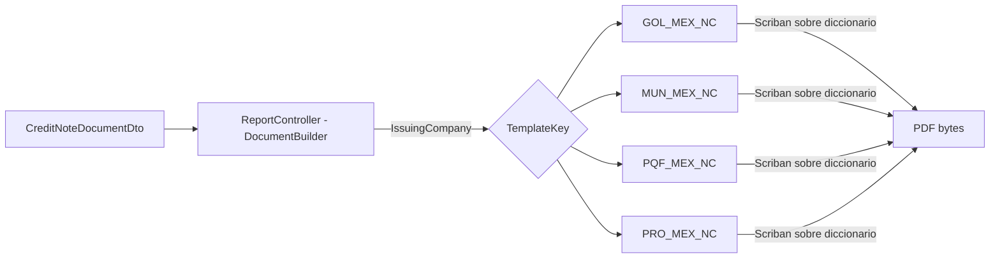

# **Diseño de la solución**

## Requisito R16A-RE-FU-034 — Nota de Crédito México

**Maquetación del PDF de la Nota de Crédito CFDI 4.0 México — Egreso (post-timbrado) en Document Builder (familia de plantillas _MEX_NC)**

| FORMATO | Arquitectura |
| :---- | :---- |
| **PROYECTO** | R16 - Adquisiciones |
| **REFERENCIA** | AUI-FOR-01 |
| **VERSIÓN** | 1.0 |
| **FECHA** | 16 jul 2026 |
| **AUTOR** | [Jose Armando Santiago Lorenzo](mailto:jose.santiago@ryndem.mx) |
| **REVISOR** | [Alan Fernandez Garcia](mailto:alan.garcia@ryndem.mx) |

# **Importante**

Posterior a este diseño, ¿cómo saber si el diseño de la solución al requisito está completo para que el programador inicie con el desarrollo?
Hazte estas preguntas rápidas:

* ¿El programador sabe qué flujo implementar?
* ¿Sabe qué pasa si algo falla?
* ¿Sabe qué reglas no puede romper?
* ¿Sabe qué pruebas debe pasar?
* ¿Sabe dónde impacta?

*Nota: Este documento es una propuesta basada en el estándar IEEE 1016 "Software Design Description" que va permitir abarcar los puntos más importantes para el diseño del requisito que se está trabajando. Se debe administrar el tiempo que se tiene de diseño para que se complete de la mejor manera considerando todos los detalles técnicos.*

# **Introducción**

## **Propósito del documento**

El propósito de este documento es definir el diseño de la solución técnica para la maquetación del PDF de la Nota de Crédito México CFDI 4.0 — Egreso (R16A-RE-FU-034) en el motor de renderizado DocumentBuilder: la creación de 4 familias de plantilla _MEX_NC (una por empresa emisora del grupo PROQUIFA México, confirmado por la matriz de requisitos — la muestra real recibida solo cubre Golocaer) y las secciones visuales que componen el documento. La Nota de Crédito es un CFDI de Egreso post-timbrado: el diseño cubre su comprobante, emisor, receptor, el bloque de documento relacionado (referencia a la factura origen que modifica), las partidas (modalidad por partidas y modalidad manual), totales/impuestos, los elementos técnicos SAT y el pie legal.

**Nota:** este documento se enfoca en el diseño visual del PDF (maqueta HTML/CSS/Scriban en Document Builder). La generación del contrato de datos, el timbrado ante el PAC, la persistencia y los endpoints son responsabilidad del Back-end y no se rediseñan aquí — **aún no existe diseño de back para este requisito**. La plantilla es render puro: no contiene lógica de negocio, imprime literalmente lo que llega en el diccionario de datos. El contrato CreditNoteDocumentDto propuesto es **propiedad del front** y se negociará con Back-end cuando exista su diseño.

## **Alcance**

### **Específicamente incluye:**

* Creación de **4 familias de plantilla _MEX_NC** en DocumentBuilder/API/Resources/Templates/: GOL_MEX_NC (Golocaer), MUN_MEX_NC (Mungen), PQF_MEX_NC (Proveedora Químico Farmacéutica) y PRO_MEX_NC (Proquifa), siguiendo la convención ya usada por las familias existentes _COT/_PED — confirmado por la matriz de requisitos (criterio J1: colores Golocaer naranja, Mungen verde, Proquifa cyan, Proveedora Q.F. cyan). Familia **nueva desde cero**: no hay plantilla _NC heredada del sistema actual que se tome como base. La muestra real recibida solo trae Golocaer (Serie B, Folio 128); las 3 empresas restantes se maquetan por convención de familia sin PDF de referencia propio (ver riesgo resaltado abajo).
* Maquetación HTML/CSS de las secciones visuales del documento (comprobante, emisor, receptor, documento relacionado, partidas — modalidad **por partidas** y modalidad **manual**, totales/impuestos, elementos técnicos SAT, pie legal) — verificadas contra la **NC real de Golocaer** (Serie B, Folio 128) en sus dos variantes de muestra: 1 página (bonificación, modalidad manual) y 2 páginas (listado largo de partidas, modalidad por partidas).
* Un único diseño que cubre ambas modalidades de partidas (por partidas / manual, CA E1–E3 / F1–F2) y ambas variantes de paginación (1 partida vs listado largo) — mismo DTO, la plantilla no cambia según modalidad ni cantidad de partidas, solo cambia cuántos/cuáles campos llegan poblados.
* Reutilización de las convenciones CSS y de paginación ya probadas en _COT/_PED (documentos multi-página), **sin modificar el motor de render compartido** RenderDocumentService.

### **No se consideran:**

* El diseño **Back-end** de RE-FU-034: la generación del contrato de datos real, el cálculo de la modalidad por partidas vs manual, la integración/timbrado con el PAC, la persistencia y el envío por correo (CA I1–I5, K1–K3) — aún no existe diseño de backend para este requisito. ==CA H1/H2 (cancelación condicional de la factura origen) queda descartado por DUDA-125 — ver Flujo 3.==
* **Nota de Crédito Perú (RE-FU-035)** — plantillas _PER_NC y DIS propios; se documenta aparte (hermano regional), además bloqueada por integración SUNAT/OSE.
* La generación del XML del CFDI, la lógica de timbrado, la integración con el PAC y el manejo de sus errores — viven en los requisitos que generan el timbrado.
* La lógica de negocio que determina cuándo se emite una Nota de Crédito (motivo, autorización, vínculo con la factura origen, decisión de cancelar la factura origen) — responsabilidad de Back-end; la plantilla solo pinta lo que recibe en RelatedDocument.
* El envío de la Nota de Crédito al cliente por correo electrónico (CA K1–K3) — vive en otro requisito/orquestación de Back-end.
* La aprobación final del diseño visual (ver nota destacada al final de esta sección).

**Precondición del diseño:** la maquetación en código de la familia de plantillas _MEX_NC inicia una vez autorizadas las propuestas de diseño (mockups/NC de referencia). La maqueta se construye sobre la NC real de Golocaer ya validada; las 3 empresas restantes replican la convención hasta recibir muestra propia.

==**Riesgo abierto — QR SAT:** se asume que el back entrega el QR como **imagen base64** en TaxStamp.QrImageBase64; si no llega, no se pinta y se reserva el espacio en el layout. **Falta el diseño de backend** que confirme el mecanismo real de entrega (imagen vs URL); si el back decide otra cosa, impacta este contrato y posiblemente la plantilla.==

==**Riesgo abierto — Pedimento por partida:** ausente en ambas variantes de la muestra NC. Se conserva como campo opcional en el contrato (RT-14, no se pinta si no llega) por si alguna NC de importación sí lo trae — pendiente confirmar con backend si aplica.==

==**Decisión pendiente — nombre del contrato de datos:** falta definir con Back-end el nombre y la forma final del contrato (p. ej. un CreditNoteDocumentDto propio con el bloque RelatedDocument). No bloquea la maqueta — la plantilla es agnóstica al nombre del tipo, solo consume el diccionario.==

# **Visión general del diseño**

## **Objetivo técnico**

Definir la maquetación del PDF de la Nota de Crédito México CFDI 4.0 en el motor DocumentBuilder, creando la familia de plantilla _MEX_NC (Golocaer) que reproduzca fielmente el documento a partir de los datos que recibe, **sin modificar el motor de render compartido** ni introducir lógica de negocio en la plantilla. La plantilla imprime literalmente los valores que recibe (render puro), lo que permite maquetar y probar con datos dummy sin depender del backend (aún inexistente para este requisito).

**Contrato de datos de la Nota de Crédito:** el CreditNoteDocumentDto propuesto se organiza en los grupos Voucher, IssuingCompany, Customer, Items[], TaxSummary, Totals, TaxStamp, más un bloque RelatedDocument propio de la NC. Puntos de diseño específicos de este comprobante: (1) tipo de comprobante Egreso; (2) bloque RelatedDocument con la referencia a la factura origen que modifica; (3) sin cuentas bancarias — el bloque BankAccounts no se incluye, una NC no se cobra; (4) Pedimento opcional por partida (no aparece en la muestra, se conserva por si una NC de importación lo trae); (5) CfdiUse solo con código; (6) sin orden de compra ni pedido interno — los campos CustomerOrderNumber/InternalOrderNumber no se incluyen; (7) sin dirección fiscal completa del emisor — el bloque LegalAddress no se incluye, la matriz D1/J4 solo exige el Lugar de Expedición (CP). El detalle de cada punto vive en Impacto en modelos y en las reglas técnicas (RT).

## **Componentes involucrados**

El entregable de este diseño vive en DocumentBuilder: las 4 familias de plantilla _MEX_NC, entregable central de esta maqueta. El resto de los componentes ya existen y se reutilizan sin cambios.

| Aplicativo | Componente | Responsabilidad | Ubicación |
| :---- | :---- | :---- | :---- |
| DocumentBuilder | ReportController | Selecciona la familia por TemplateKey e invoca el render | DocumentBuilder/API/Controllers/ReportController.cs (existente, se reutiliza) |
| DocumentBuilder | RenderDocumentService (Scriban) | Rellena el HTML de la plantilla con el diccionario de datos y produce el PDF | DocumentBuilder/Application/Services/Pdf/RenderDocumentService.cs (existente, se reutiliza) |
| DocumentBuilder | **Familia de plantilla _MEX_NC** | HTML/CSS/Scriban _H/_B/_F por empresa que define el aspecto del PDF | DocumentBuilder/API/Resources/Templates/\<PREFIJO\>_MEX_NC/ (**entregable central**) |
| Back-end (pendiente DIS) | Timbrado (PAC) + vínculo con factura origen + cancelación condicional | Genera UUID, sellos, cadena original, QR, resuelve RelatedDocument, decide/ejecuta cancelación de factura origen y entrega el CreditNoteDocumentDto materializado | Fuera de este diseño |

El entregable central de este diseño son las 4 familias _MEX_NC; el motor de render (RenderDocumentService) y el ReportController ya existen y se reutilizan sin cambios.

# **Diseño funcional detallado**

## **Flujo 1 — Render de la plantilla _MEX_NC, modalidad por partidas (CA E1–E3)**

Ruta de render de la plantilla cuando la NC se generó a partir de partidas de la factura origen (Cant. NC > 0 por línea), a nivel de componente de DocumentBuilder:

1. ReportController resuelve la familia de plantilla con GetTemplate(TemplateKey), donde TemplateKey = <PREFIJO>_MEX_NC derivado **únicamente** de IssuingCompany (empresa emisora del CFDI de Egreso).
2. La consulta retorna los nombres de archivo _H / _B / _F de la familia registrada.
3. RenderDocumentService (Scriban) rellena el HTML _H+_B+_F con el CreditNoteDocumentDto materializado como diccionario (Dictionary<string,object>) y produce el PDF.
4. El PDF (application/pdf) se entrega ya renderizado, con todos los bloques poblados: comprobante, emisor, receptor, RelatedDocument, Items[] (uno por partida con Cant. NC > 0, datos fiscales heredados del concepto original de la factura), totales, TaxStamp.

**Puntos clave de la maqueta:**

* El render trabaja sobre un diccionario genérico (Dictionary<string,object>), **no** sobre un tipo fuerte — la plantilla Scriban puede probarse con datos dummy (Serie B, Folio 128 Golocaer) sin esperar al backend.
* La selección de familia (TemplateKey) depende **solo** de la empresa emisora, nunca del banco ni del producto.
* El recálculo de Cantidad/Importe/impuestos sobre Cant. NC (CA E3) es responsabilidad de Back-end; la plantilla solo pinta los valores ya recalculados que llegan en Items[] — paradigma render-puro.

## **Flujo 2 — Render de la plantilla _MEX_NC, modalidad manual (CA F1–F2)**

Cuando la NC se generó por descuento/bonificación (sin partidas de producto), el Back-end arma un único Items[] con SatKey="84111506", UnitKey="ACT", Quantity="1" y Description = concepto capturado por el usuario. Es el escenario cubierto por la muestra real (Serie B, Folio 128, "Bonificación comercial por volumen de compra").

**Puntos clave de la maqueta:**

* **Misma plantilla que Flujo 1** — no hay una plantilla aparte para modalidad manual. Items[] siempre trae 1 o N elementos con la misma forma; la plantilla itera el arreglo sin distinguir modalidad.
* La decisión de qué modalidad aplica (por partidas vs manual) es de negocio y ocurre antes de llegar a DocumentBuilder — la maqueta es agnóstica a esa decisión.

**Nota transversal a Flujo 1 y 2 — sin variante preview:** la Nota de Crédito no tiene un estado previsualizable previo: nace directo del proceso de timbrado. La muestra recibida no incluye ningún escenario preview; ambos flujos documentan NC ya timbrada.

## **Flujo 3 — Cancelación condicional de la factura origen (CA H1–H2) — DESCARTADO**

==Mecanismo descartado (DUDA-125, resuelta): el cliente confirmó que NC al 100% y cancelación SAT de la factura origen son mecanismos excluyentes, nunca combinados. La opción de cancelar la factura origen se retira del módulo de Notas de Crédito; si operativamente se decide cancelar en vez de emitir NC, ocurre fuera del sistema. El flujo descrito abajo (CA H1–H2 de la matriz) ya no aplica y no debe tomarse como base para el diseño de Back-end.==

~~Cuando la NC se generó con la opción de cancelar la factura origen activa (NC por totalidad + mismo mes calendario), el timbrado exitoso de la NC dispara en Back-end la cancelación SAT de la factura origen vía TurboPac.~~

**Fuera de esta maqueta (y ahora fuera de alcance del requisito):** este flujo era 100% Back-end (decisión de negocio, llamada al PAC, manejo de error de cancelación) — nunca tuvo superficie visual propia en el PDF de la NC más allá de lo que ya cubre RelatedDocument (referencia a la factura origen). Se documenta aquí solo para dejar trazabilidad de que el CA existía en la matriz y quedó descartado por DUDA-125 — no para servir de base al diseño de Back-end.

## **Criterios de aceptación del requisito**

Criterios de aceptación tomados de la matriz de requisitos (fila R16A-RE-FU-034, secciones A–K). **CA Descripción** reproduce el texto verbatim de la matriz; **Descripción** explica cómo se cumple ese CA en este DIS. **Estado** toma uno de: Cubierto, Pendiente, Sin Resolver, Otro; la columna **Justificación** solo se llena cuando el Estado es *Otro*.

| CA | CA Descripción | Descripción | Estado | Justificación |
| :---- | :---- | :---- | :---- | :---- |
| A1 | Dado el armado de una NC en el wizard del módulo Notas de Crédito, Cuando el usuario confirma el timbrado en el Paso 3, Entonces el sistema deberá generar el CFDI tipo E correspondiente. | N/A en esta maqueta — el detonante y la generación del CFDI son responsabilidad de Back-end / módulo NC (RE-FU-032). El PDF solo se genera cuando ya existe un CreditNoteDocumentDto materializado. | Otro | Fuera de alcance del maquetado (responsabilidad de Back-end): el detonante vive en el módulo de Notas de Crédito, fuera del render de DocumentBuilder. |
| B1 | Dado la generación de la NC, Cuando el sistema arma el comprobante, Entonces los campos fijos son: Version=4.0, TipoDeComprobante=E, Exportacion=01. | Se cubre con Voucher.CfdiVersion="4.0" y Voucher.VoucherType="E - Egreso". Exportacion no aparece como campo visible en la muestra NC; bajo el paradigma render-puro se pinta si el contrato lo trae. | Cubierto | — |
| B2 | Dado la generación de la NC, Cuando el sistema arma el comprobante, Entonces deberá incluir Serie distintiva, Folio consecutivo por empresa, Fecha del timbrado y LugarExpedicion = CP de la empresa emisora. **Serie distintiva pendiente de validar.** | Se cubre con Voucher.Series/Folio, TaxStamp.CertificationDateTime, IssuingCompany.ExpeditionPlace. La matriz deja pendiente el esquema final de la serie distintiva; la plantilla pinta el valor literal que llegue. | Cubierto | — |
| B3 | Dado la generación de la NC, Cuando el sistema asigna Moneda, Entonces deberá heredar la Moneda de la factura origen (no editable). | Se cubre con Totals.Currency; el origen del valor (heredado de la factura origen) es responsabilidad de Back-end. | Cubierto | — |
| B4 | Dado la NC con Moneda ≠ MXN, Cuando el sistema arma el comprobante, Entonces deberá incluir TipoCambio del día del timbrado. | Se cubre con Totals.ExchangeRate. | Cubierto | — |
| B5 | Dado la generación de la NC, Cuando el sistema asigna MetodoPago, Entonces deberá ser PUE fijo. | Se cubre con Voucher.PaymentMethod, valor fijo "PUE - Pago en una sola exhibición" en la muestra. | Cubierto | — |
| B6 | Dado la generación de la NC, Cuando el sistema asigna FormaPago, Entonces deberá heredar de la factura origen (típicamente 03 Transferencia). | Se cubre con Voucher.PaymentForm. | Cubierto | — |
| C1 | Dado la generación de la NC, Cuando el sistema arma el XML, Entonces deberá incluir obligatoriamente el nodo CfdiRelacionados con TipoRelacion=01 y un nodo CfdiRelacionado con el UUID de la factura origen. | Se cubre con el bloque RelatedDocument (RelationType, OriginInvoiceUuid), específico de la Nota de Crédito. | Cubierto | — |
| D1 | Dado la generación de la NC, Cuando el sistema arma el nodo Emisor, Entonces deberá incluir RFC, Nombre/Razón Social y RegimenFiscal=601 de la empresa emisora del grupo. | Se cubre con IssuingCompany (LegalName/TaxId/TaxRegime). El bloque LegalAddress no se incluye en el contrato de la NC: la matriz D1/J4 no exige la dirección completa del emisor —solo Lugar de Expedición (CP)—, coherente con la muestra. | Cubierto | — |
| D2 | Dado la generación de la NC, Cuando el sistema arma el nodo Receptor, Entonces deberá incluir RFC, Nombre/Razón Social, DomicilioFiscalReceptor y RegimenFiscalReceptor del cliente. | Se cubre con Customer (LegalName/TaxId/ZipCode/TaxRegime). | Cubierto | — |
| D3 | Dado la generación de la NC, Cuando el sistema asigna UsoCFDI del receptor, Entonces deberá ser G02 por default. | Se cubre con Customer.CfdiUse. La muestra solo trae el código ("G02"), sin descripción concatenada; bajo render-puro se pinta el valor que llegue. | Cubierto | — |
| E1 | Dado modalidad por partidas, Cuando el sistema arma el nodo Conceptos, Entonces deberá generar un nodo Concepto por cada partida con Cant. NC > 0 (las partidas con Cant. NC = 0 no se incluyen). | Se cubre con Items[] — el arreglo trae solo las partidas con Cant. NC > 0; el filtro es responsabilidad de Back-end, la plantilla itera lo que reciba. Ver Flujo 1. | Cubierto | — |
| E2 | Dado un Concepto en modalidad por partidas, Cuando el sistema lo arma, Entonces deberá heredar del concepto original de la factura origen: ClaveProdServ, ClaveUnidad, NoIdentificacion, ValorUnitario, Descripción y configuración de impuestos. | Se cubre con Items[] (SatKey/UnitKey/InternalId/UnitPrice/Description/Taxes[]). La herencia del dato desde el concepto original es responsabilidad de Back-end. | Cubierto | — |
| E3 | Dado un Concepto en modalidad por partidas, Cuando el sistema calcula importes, Entonces Cantidad = Cant. NC capturada, Importe = Cant. NC × ValorUnitario, e impuestos trasladados recalculados sobre el nuevo Importe. | Se cubre con Items[].Quantity/Amount/Taxes[] — el recálculo es responsabilidad de Back-end; la plantilla pinta los valores ya recalculados. | Cubierto | — |
| F1 | Dado modalidad manual, Cuando el sistema arma el nodo Conceptos, Entonces deberá contener un único Concepto. | Se cubre — Items[] trae 1 elemento cuando la NC es manual. Confirmado por la muestra real (Serie B, Folio 128, "Bonificación comercial por volumen de compra"). Ver Flujo 2. | Cubierto | — |
| F2 | Dado el Concepto en modalidad manual, Cuando el sistema lo arma, Entonces los campos serán: ClaveProdServ=84111506, ClaveUnidad=ACT, Cantidad=1, Descripcion = concepto capturado por el usuario, ValorUnitario e Importe = Monto Total NC capturado, ObjetoImp según corresponda. | Se cubre con Items[0] (SatKey="84111506", UnitKey="ACT", Quantity="1", Description, UnitPrice, Amount), valores confirmados exactos en la muestra real. ObjetoImp es dato fiscal interno del XML y no se maqueta como campo visible (no aparece en el PDF de referencia). | Cubierto | — |
| G1 | Dado la generación de la NC, Cuando el sistema calcula impuestos, Entonces deberá calcular automáticamente IVA al 16% o la tasa correspondiente al producto, sumando los traslados a nivel comprobante. | Se cubre con TaxSummary.Transfers[] — el cálculo es responsabilidad de Back-end, la plantilla pinta el desglose recibido. | Cubierto | — |
| G2 | Dado la generación de la NC, Cuando el sistema arma el comprobante root, Entonces SubTotal y Total deberán ser los valores reales en la moneda de la factura origen. **Campo Descuento del comprobante root pendiente de validar con asesor fiscal (ver Regla 11): definir si se puebla o se omite según la operación de PROQUIFA.** | Se cubre con Totals (Subtotal/GrandTotal), sin campo Descuento explícito en el contrato, coherente con el ejemplo real B-128 (SubTotal 48.00, Total 55.68, sin Descuento). La matriz deja abierta la duda fiscal de si Descuento se puebla u omite. | Cubierto | — |
| H1 | ~~Dado que la NC se confirmó con la opción de cancelar la factura origen activa (NC por totalidad + mismo mes calendario), Cuando el timbrado de la NC es exitoso, Entonces el sistema deberá disparar la cancelación SAT de la factura origen vía TurboPac con el motivo c_MotivoCancelacion seleccionado.~~ | ==Descartado por DUDA-125 (resuelta): NC y cancelación son mecanismos excluyentes, el sistema ya no dispara esta cancelación.== Ver Flujo 3. | Otro | Descartado — no forma parte del alcance ni de maquetado ni de backend. |
| H2 | ~~Dado que la cancelación SAT de la factura origen falla, Cuando el sistema procesa la respuesta, Entonces deberá notificar al usuario del fallo y permitir reintento posterior según la política transversal. La NC ya timbrada permanece vigente.~~ | ==Descartado por DUDA-125 (resuelta) — depende de H1, mismo mecanismo retirado.== Ver Flujo 3. | Otro | Descartado — no forma parte del alcance ni de maquetado ni de backend. |
| I1 | Dado la NC armada, Cuando el sistema la envía a timbrar, Entonces deberá usar el PAC TurboPac. | N/A en esta maqueta (render puro, sin timbrado). | Otro | Fuera de alcance del maquetado (render puro, sin timbrado). |
| I2 | Dado timbrado exitoso, Cuando el sistema recibe la respuesta, Entonces deberá registrar el UUID asignado por el SAT en el XML timbrado. | Se cubre con TaxStamp.Uuid — el registro es responsabilidad de Back-end, la plantilla solo pinta el valor recibido. | Cubierto | — |
| I3 | Dado timbrado exitoso, Cuando el sistema confirma, Entonces deberá persistir el XML timbrado y el PDF representativo en PQF2. | N/A en esta maqueta (render puro, sin persistencia). | Otro | Fuera de alcance del maquetado (render puro, sin persistencia). |
| I4 | Dado timbrado fallido, Cuando el sistema procesa la respuesta, Entonces la NC no se persiste como vigente; el usuario puede reintentar posteriormente según la política transversal. | N/A en esta maqueta. | Otro | Fuera de alcance del maquetado (responsabilidad de Back-end). |
| I5 | Dado timbrado exitoso, Cuando el sistema persiste el documento, Entonces deberá conservar el XML por un mínimo de 5 años (Art. 30 CFF). | N/A en esta maqueta. | Otro | Fuera de alcance del maquetado (responsabilidad de Back-end). |
| J1 | Dado la generación del PDF, Cuando el sistema arma el documento, Entonces deberá incluir el logo y aplicar la paleta de colores corporativa de la empresa emisora (Golocaer naranja, Mungen verde, Proquifa cyan, Proveedora Quimico Farmaceutica cyan). | Se cubre con el logo y color institucional embebidos en base64 por TemplateKey, en las 4 familias _MEX_NC. La matriz confirma que aplica a las 4 empresas; solo Golocaer tiene muestra real, las otras 3 replican convención (ver Alcance). | Cubierto | — |
| J2 | Dado la generación del PDF, Cuando el sistema arma el documento, Entonces deberá incluir la iconografía de certificaciones del giro químico-farmacéutico consistente con factura y Complemento de Pago. **Confirmar vigencia de las certificaciones.** | Se cubre con certificaciones embebidas en base64 por TemplateKey. La matriz deja pendiente confirmar la vigencia de las certificaciones; se asume vigente para maquetar. | Cubierto | — |
| J3 | Dado la generación del PDF de la NC, Cuando el sistema arma el documento, Entonces el branding, tipografía e identidad visual deberán ser consistentes con Factura México y Complemento de Pago México. | Se cubre reutilizando las convenciones CSS/branding de la familia de plantillas (ver RT-01). | Cubierto | — |
| J4 | Dado la generación del PDF, Cuando el sistema arma el encabezado, Entonces deberá incluir: Razón Social del emisor, RFC, Lugar de Expedición, Fecha y Hora de Expedición, Régimen Fiscal. | Se cubre con IssuingCompany (LegalName/TaxId/ExpeditionPlace/TaxRegime) y Voucher.ExpeditionDateTime. | Cubierto | — |
| J5 | Dado la generación del PDF, Cuando el sistema arma la sección Cliente, Entonces deberá incluir: Razón Social del receptor, RFC, Domicilio Fiscal, Régimen Fiscal del receptor, Uso CFDI (G02). | Se cubre con Customer (LegalName/TaxId/ZipCode/TaxRegime/CfdiUse). | Cubierto | — |
| J6 | Dado la generación del PDF, Cuando el sistema arma la cabecera del comprobante, Entonces deberá incluir: Serie, Folio interno, Versión CFDI (4.0), Folio Fiscal (UUID), Fecha y Hora de Certificación, Fecha y Hora de Emisión, Tipo de Comprobante (E-Egreso), Moneda, Tipo de Cambio cuando aplique, Método de Pago (PUE), Forma de Pago. | Se cubre con Voucher + TaxStamp.Uuid/CertificationDateTime + Totals.Currency/ExchangeRate. | Cubierto | — |
| J7 | Dado la generación del PDF, Cuando el sistema arma la sección de relación, Entonces deberá incluir: Motivo de la NC, Tipo de Relación SAT (01), Folio y UUID de la factura origen relacionada. | Se cubre con RelatedDocument (RelationType, OriginInvoiceUuid). El "Motivo de la NC" no está en el contrato propuesto — la muestra no lo expone como campo separado (el motivo se infiere de la Descripción del ítem, ej. "Bonificación comercial"). | Otro | ==Parcialmente cubierto: Tipo de relación y UUID de la factura origen se pintan; el "Motivo de la NC" es un hueco de contrato a definir con Back-end (campo propio, p. ej. catálogo c_MotivoCancelacion, o resolverlo con la Descripción del Item).== |
| J8 | Dado modalidad por partidas, Cuando el sistema arma el PDF, Entonces deberá incluir una tabla con las partidas con Cant. NC > 0: Clave Producto/Servicio, NoIdentificacion (código interno), Descripción, Cantidad (Cant. NC), Clave Unidad, Valor Unitario, Importe, Impuesto Traslado por línea. | Se cubre con Items[] — tabla de partidas confirmada por la variante de 2 páginas de la muestra (listado largo de partidas de producto). | Cubierto | — |
| J9 | Dado modalidad manual, Cuando el sistema arma el PDF, Entonces deberá incluir: Clave Producto/Servicio (84111506), Cantidad (1), Clave Unidad (ACT), Descripción (concepto capturado), Valor Unitario, Importe, Impuesto Traslado. | Se cubre con Items[0] — confirmado exacto por la muestra real (folio 128, escenario Bonificación). | Cubierto | — |
| J10 | Dado la generación del PDF, Cuando el sistema arma la sección Totales, Entonces deberá incluir: Subtotal, Impuestos Trasladados (IVA), Total, todos en la moneda de la factura origen. Adicionalmente, Total en letra. | Se cubre con Totals (Subtotal/FederalTaxes/GrandTotal/GrandTotalInWords/Currency). | Cubierto | — |
| J11 | Dado la generación del PDF, Cuando el sistema arma el pie del documento, Entonces deberá incluir: Número de Serie del Certificado del SAT, Número de Serie del CSD del Emisor, Sello Digital del SAT, Sello Digital del CFDI, Cadena Original del Complemento de Certificación Digital del SAT. | Se cubre con TaxStamp (SatCertSerial/IssuerCsdSerial/SatDigitalSeal/CfdiDigitalSeal/OriginalStringCcd). | Cubierto | — |
| J12 | Dado la generación del PDF, Cuando el sistema arma el documento, Entonces deberá incluir el código QR estándar SAT que encodea la URL de verificación con UUID + RFC emisor + RFC receptor + Total + últimos 8 caracteres del sello. | Se cubre con TaxStamp.QrImageBase64; se pinta si llega (ver riesgo QR en Alcance — depende del mecanismo de entrega que confirme el diseño de backend). | Cubierto | — |
| K1 | Dado timbrado exitoso, Cuando el sistema confirma, Entonces deberá enviar el correo al cliente con el PDF y el XML de la NC adjuntos. | N/A en esta maqueta — el envío es responsabilidad de Back-end/orquestación, no del render del PDF. | Otro | Fuera de alcance del maquetado (responsabilidad de Back-end). |
| K2 | Dado el envío, Cuando el sistema arma los destinatarios, Entonces Para = contacto del cliente vinculado a la factura origen, CC = ESAC asignado + analista de Cuentas por Cobrar. | N/A en esta maqueta. | Otro | Fuera de alcance del maquetado (responsabilidad de Back-end). |
| K3 | Dado el envío del correo, Cuando el sistema lo arma, Entonces el asunto y cuerpo seguirán la plantilla definida. **Plantilla pendiente de confirmar (PMO #31 transversal).** | N/A en esta maqueta. | Otro | Fuera de alcance del maquetado (responsabilidad de Back-end); plantilla de correo pendiente de PMO #31 (transversal a Proforma/Factura/NC/Complemento de Pago). |

## **Reglas técnicas aplicadas**

Reglas de implementación (no de negocio) que la maqueta debe respetar.

| Regla | Descripción |
| :---- | :---- |
| RT-01 | La familia _MEX_NC reutiliza las convenciones CSS y de paginación de _COT/_PED. **Cero cambios al motor RenderDocumentService**: solo se agregan archivos de plantilla (estrategia aditiva). |
| RT-02 | El branding (logo, color institucional, bloque de contacto y tira de certificaciones) se embebe como base64 en las piezas _H/_F por TemplateKey; **no viaja en los datos**. |
| RT-03 | La selección de familia (TemplateKey) se deriva **únicamente** de la empresa emisora del CFDI. La plantilla es agnóstica al banco y al producto — no contiene ninguna condición hardcodeada por empresa ni por banco. |
| RT-04 | La plantilla renderiza cada campo como texto literal, **sin lógica condicional ni chequeo de nulos**. Campo ausente/vacío ⇒ no se pinta. En la NC no hay variante preview (ver Flujo 1/2). |
| RT-05 | **El contrato de la NC no incluye el bloque BankAccounts:** una Nota de Crédito no se cobra, así que la sección "Referencias Bancarias" no se pinta ni se reserva espacio en el layout. |
| RT-06 | El disclaimer "Representación impresa de un CFDI 4.0" es **texto fijo** de la plantilla; no viaja en los datos. |
| RT-07 | La paginación "X de Y" la calcula el **motor de render**; la tabla de partidas controla el salto de página; header (_H) y footer (_F) se repiten en cada página — confirmado por la muestra real (1 página bonificación vs 2 páginas listado largo). |
| RT-08 | Los campos se nombran en **inglés**. El bloque RelatedDocument es propio y específico de la Nota de Crédito. |
| RT-09 | Items[].Taxes[] es un **arreglo** de impuestos por partida, preparado para más de un impuesto (ej. IVA + IEPS) aunque hoy siempre llegue uno solo. La plantilla itera el arreglo sin asumir cantidad fija. |
| RT-10 | El QR (TaxStamp.QrImageBase64) se pinta como imagen si llega; si no llega, **no se pinta y se reserva el espacio** en el layout. Depende del diseño de backend, aún pendiente (ver riesgo QR en Alcance). |
| RT-11 | TaxSummary.RetentionsEmptyText es un texto **dinámico proveniente del back** que se pinta solo cuando Retentions[] llega vacío; si Retentions[] trae elementos, se pinta el arreglo y se ignora este campo. |
| RT-12 | La plantilla no captura ni silencia errores: un TemplateKey inexistente o un HTML mal formado se propaga como error del motor; no se produce un "PDF a medias" silencioso. |
| RT-13 | El color de header/footer es el **institucional de la empresa emisora**, no un color fijo (Golocaer naranja, Mungen verde, Proquifa cyan, Proveedora Q.F. cyan — confirmado J1 de la matriz). |
| RT-14 | Items[].Pedimento es **campo opcional del contrato**: no aparece en ninguna variante de la muestra NC, pero no se retira de la forma del contrato — si no llega, no se pinta (mismo mecanismo RT-04). |
| RT-15 | La plantilla **no distingue modalidad por partidas vs manual** (CA E1–E3 vs F1–F2): ambas llegan como Items[] con la misma forma (1 o N elementos); la decisión de modalidad es de negocio, ocurre antes de DocumentBuilder. Ver Flujo 1/2. |

# **Diseño de componentes**

## **Diagrama de flujo**

Flujo de datos hasta el render: DocumentBuilder selecciona la familia _MEX_NC por empresa emisora y renderiza el PDF con Scriban, sin distinguir modalidad por partidas vs manual.



Ninguna de las 4 rutas _MEX_NC existe hoy en DocumentBuilder/API/Resources/Templates/; se crean nuevas siguiendo la convención de las familias ya existentes (_COT, _PED). La convención de carpeta/archivo a replicar es API/Resources/Templates/\<PREFIJO\>_MEX_NC/\<PREFIJO\>_MEX_NC_{H,B,F}.html.

## **Diagrama de secuencia — Render de la Nota de Crédito (modalidad por partidas o manual)**

Orden de llamadas entre componentes y responsable de cada paso, desde que el Back-end (aún sin DIS propio) solicita el render hasta que recibe el PDF. La cancelación condicional de la factura origen (CA H1/H2, Flujo 3) ocurre en Back-end antes de esta llamada — no la representa este diagrama por ser 100% fuera de la maqueta.

```mermaid
sequenceDiagram
    participant BE as Back-end (Notas de Crédito/Timbrado) [pendiente DIS]
    participant RC as ReportController
    participant RDS as RenderDocumentService
    participant TPL as Familia _MEX_NC (Scriban _H/_B/_F)

    BE->>BE: Arma Items[] según modalidad (por partidas o manual)
    BE->>RC: POST render(CreditNoteDocumentDto, TemplateKey)
    RC->>RC: Resuelve TemplateKey por IssuingCompany
    RC->>RDS: GetTemplate(_H, _B, _F)
    RDS->>TPL: Rellena HTML con diccionario (Dictionary<string,object>)
    Note over TPL: RelatedDocument siempre poblado; sin bloque BankAccounts (NC no se cobra)
    TPL-->>RDS: HTML renderizado
    RDS-->>RC: PDF bytes
    RC-->>BE: application/pdf
```

La ruta completa Backend → DocumentBuilder es idéntica en ambas modalidades; solo cambia cuántos elementos trae Items[] (1 en manual, N en por partidas) — la plantilla no distingue entre ellas (RT-15).

# **Impacto Técnico**

## **Impacto en código existente**

Repositorio DocumentBuilder (entregable central):

| # | Archivo / Artefacto | Tipo de cambio |
| :---- | :---- | :---- |
| 1 | API/Resources/Templates/GOL_MEX_NC/GOL_MEX_NC_{H,B,F}.html | Nuevo — familia de plantilla Golocaer (única con muestra real) |
| 2 | API/Resources/Templates/MUN_MEX_NC/MUN_MEX_NC_{H,B,F}.html | Nuevo — familia de plantilla Mungen (sin muestra propia, por convención) |
| 3 | API/Resources/Templates/PQF_MEX_NC/PQF_MEX_NC_{H,B,F}.html | Nuevo — familia de plantilla Proveedora (sin muestra propia, por convención) |
| 4 | API/Resources/Templates/PRO_MEX_NC/PRO_MEX_NC_{H,B,F}.html | Nuevo — familia de plantilla Proquifa (sin muestra propia, por convención) |
| 5 | Registro en BD DocumentTemplate (por ambiente) | Nuevo (dato/seed) — asocia TemplateKey <PREFIJO>_MEX_NC a los archivos _H/_B/_F |

**No se toca:** el motor RenderDocumentService ni las familias _COT/_PED (estrategia aditiva, sin cutover). El rollback consiste en despublicar/desregistrar las 4 familias _MEX_NC.

## **Impacto en modelos**

* No se crean ni modifican entidades de BD en esta maqueta.
* La maqueta consume un diccionario de datos genérico; la propuesta de datos (CreditNoteDocumentDto) es propuesta del front — se ajustará a lo que defina Back-end cuando exista su diseño (ver decisión pendiente en Alcance). Se incluye aquí el ejemplo y la tabla de datos para que quede trazado en el DIS en dónde se usaría cada valor de la propuesta; si cambia, solo se ajusta este documento.

Ejemplo (modalidad manual, datos reales de la muestra — Golocaer, Serie B, Folio 128, escenario Bonificación):

```json
{
  "Voucher": {
    "Series": "B",
    "Folio": "128",
    "CfdiVersion": "4.0",
    "VoucherType": "E - Egreso",
    "PaymentMethod": "PUE - Pago en una sola exhibición",
    "PaymentForm": "03 - Transferencia electrónica de fondos",
    "PaymentConditions": "PREPAGO 100%",
    "IssueDateTime": "2025-09-09T17:11:02",
    "ExpeditionDateTime": "2025-09-09T17:11:02"
  },
  "IssuingCompany": {
    "LegalName": "GOLOCAER S.A de C.V - Grupo Proquifa",
    "TaxId": "GOL120717DJ7",
    "TaxRegime": "601 - General de Ley Personas Morales",
    "ExpeditionPlace": "14080"
  },
  "Customer": {
    "LegalName": "NATURES TOUCH MEXICO",
    "TaxId": "NTM230915DQ8",
    "TaxRegime": "601 - General de Ley Personas Morales",
    "CfdiUse": "G02",
    "ZipCode": "59893"
  },
  "RelatedDocument": {
    "RelationType": "01 - Nota de crédito de los documentos relacionados",
    "OriginInvoiceUuid": "66099124-f173-a87d-55d9-336a3b6ad3f6"
  },
  "Items": [
    {
      "Number": "1",
      "SatKey": "84111506",
      "InternalId": "-",
      "Quantity": "1",
      "Unit": "Actividad",
      "UnitKey": "ACT",
      "Catalog": "",
      "Description": "Bonificación comercial por volumen de compra",
      "UnitPrice": "$1,000.00",
      "Amount": "$1,000.00",
      "FederalTax": "$160.00",
      "Taxes": [
        { "Base": "$1,000.00", "TaxName": "002 - IVA", "FactorType": "Tasa", "RateOrQuota": "0.160000", "Amount": "$160.00" }
      ]
    }
  ],
  "TaxSummary": {
    "Transfers": [
      { "Base": "", "TaxName": "002 - IVA", "FactorType": "Tasa", "RateOrQuota": "0.160000", "Amount": "$160.00" }
    ],
    "Retentions": [],
    "RetentionsEmptyText": "Sin retenciones"
  },
  "Totals": {
    "Subtotal": "$1,000.00",
    "FederalTaxes": "$160.00",
    "GrandTotal": "$1,160.00 USD",
    "GrandTotalInWords": "UN MIL CIENTO SESENTA DÓLARES 00/100",
    "Currency": "USD - Dólar americano",
    "ExchangeRate": "19.17"
  },
  "TaxStamp": {
    "Uuid": "39c2e930-4a2a-f389-32ca-296e3db1836a",
    "CertificationDateTime": "2025-09-09T17:13:39",
    "SatCertSerial": "00001000000716475473",
    "IssuerCsdSerial": "00001000000717629101",
    "SatDigitalSeal": "Trmxocw/rOg1kZWg+OwQDOQfLSlHwLx7aPcVjHlvJQd2p4qsqgai24qJ3N21yCE9Wq9WGHkv7sFyAgT6MTWmcfs3SsgaaBZ1Z/…",
    "CfdiDigitalSeal": "Trmxocw/rOg1kZWg+OwQDOQfLSlHwLx7aPcVjHlvJQd2p4qsqgai24qJ3N21yCE9Wq9WGHkv7sFyAgT6MTWmcfs3SsgaaBZ1Z/…",
    "OriginalStringCcd": "||1.1|39c2e930-4a2a-f389-32ca-296e3db1836a|2025-09-09T17:11:02|SAT970701NN3|Trmxocw/rOg1kZWg+OwQDOQfLSlHwLx7...|00001000000716475473||",
    "QrImageBase64": "data:image/png;base64,iVBORw0KGgoAAAANSUhEUg…"
  }
}
```

En modalidad **por partidas** (CA E1–E3), Items[] trae N elementos con la misma forma (SatKey/InternalId/Catalog/Description) con datos reales de producto en vez del concepto genérico de servicio (84111506/ACT). Confirmado por la variante de 2 páginas de la misma muestra (Folio 128, listado largo de partidas). El resto del documento (Voucher, IssuingCompany, Customer, RelatedDocument, TaxSummary, Totals, TaxStamp) no cambia entre modalidades.

Tabla de datos, agrupada por sección del documento:

### Comprobante

| Dato | Ejemplo |
|---|---|
| Serie | B |
| Folio | 128 |
| Versión CFDI | 4.0 |
| Tipo de comprobante | E - Egreso |
| Método de pago | PUE - Pago en una sola exhibición |
| Forma de pago | 03 - Transferencia electrónica de fondos |
| Condiciones de pago | PREPAGO 100% |
| Fecha y hora de emisión | 2025-09-09T17:11:02 |
| Fecha y hora de expedición | 2025-09-09T17:11:02 |

### Emisor

| Dato | Ejemplo |
|---|---|
| Razón social | GOLOCAER S.A de C.V - Grupo Proquifa |
| RFC | GOL120717DJ7 |
| Régimen fiscal | 601 - General de Ley Personas Morales |
| C.P. lugar de expedición | 14080 |

### Receptor (cliente)

| Dato | Ejemplo |
|---|---|
| Razón social | NATURES TOUCH MEXICO |
| RFC | NTM230915DQ8 |
| Régimen fiscal | 601 - General de Ley Personas Morales |
| Uso de CFDI | G02 |
| C.P. domicilio fiscal | 59893 |

### Documento relacionado (bloque propio de la Nota de Crédito)

| Dato | Ejemplo |
|---|---|
| Tipo de relación | 01 - Nota de crédito de los documentos relacionados |
| UUID factura origen | 66099124-f173-a87d-55d9-336a3b6ad3f6 |

### Partida (se repite por cada renglón — modalidad manual en el ejemplo)

| Dato | Ejemplo |
|---|---|
| N° de partida | 1 |
| Clave SAT (c_ClaveProdServ) | 84111506 |
| N° ID interno | - |
| Pedimento | (ausente — campo opcional, ver RT-14) |
| Cantidad | 1 |
| Unidad | Actividad |
| Clave unidad (c_ClaveUnidad) | ACT |
| Catálogo (negritas) | (vacío en este ejemplo) |
| Descripción | Bonificación comercial por volumen de compra |
| Precio unitario | $1,000.00 |
| Importe | $1,000.00 |
| Imp. Fed. | $160.00 |

En modalidad por partidas, esta sección sigue el formato de partida de producto: Catálogo en negritas + Descripción con Marca/Lote, Clave SAT/Unidad reales del producto.

### Impuesto de partida (lista, no dato único — preparado para 2+ impuestos)

| Dato | Ejemplo |
|---|---|
| Base | $1,000.00 |
| Impuesto | 002 - IVA |
| Tipo de factor | Tasa |
| Tasa o cuota | 0.160000 |
| Importe | $160.00 |

### Resumen de impuestos

| Dato | Ejemplo |
|---|---|
| Traslados (agregado) | 002 - IVA, Tasa, 0.160000, $160.00 |
| Retenciones | (vacío en el ejemplo) |
| Texto cuando no hay retenciones | Sin retenciones |

### Totales

| Dato | Ejemplo |
|---|---|
| Subtotal | $1,000.00 |
| Impuestos federales | $160.00 |
| Total | $1,160.00 USD |
| Total en letras | UN MIL CIENTO SESENTA DÓLARES 00/100 |
| Moneda | USD - Dólar americano |
| Tipo de cambio | 19.17 |

### Cuentas bancarias

**Ausentes por diseño** (ver RT-05) — una Nota de Crédito no se cobra. El contrato de la NC no incluye el bloque BankAccounts en ninguna variante de la muestra; la sección no se pinta ni se reserva espacio.

### Timbrado fiscal

| Dato | Ejemplo |
|---|---|
| Folio fiscal (UUID) | 39c2e930-4a2a-f389-32ca-296e3db1836a |
| Fecha y hora de certificación | 2025-09-09T17:13:39 |
| N° serie certificado SAT | 00001000000716475473 |
| N° serie CSD emisor | 00001000000717629101 |
| Sello digital SAT | Trmxocw/rOg1kZWg+OwQDOQfLSlHwLx7aPcVjHlvJQd2p4qsqgai24qJ3N21yCE9Wq9WGHkv7sFyAgT6MTWmcfs3SsgaaBZ1Z/… |
| Sello digital CFDI | Trmxocw/rOg1kZWg+OwQDOQfLSlHwLx7aPcVjHlvJQd2p4qsqgai24qJ3N21yCE9Wq9WGHkv7sFyAgT6MTWmcfs3SsgaaBZ1Z/… |
| Cadena original CCD SAT | \|\|1.1\|39c2e930-4a2a-f389-32ca-296e3db1836a\|2025-09-09T17:11:02\|SAT970701NN3\|Trmxocw/rOg1kZWg+OwQDOQfLSlHwLx7...\|00001000000716475473\|\| |
| Imagen QR (base64) | (no capturado en la muestra; se pinta como imagen si el contrato lo trae — ver riesgo QR en Alcance) |

# **Manejo de Errores y Excepciones**

| Escenario | Comportamiento esperado |
| :---- | :---- |
| TemplateKey sin familia _MEX_NC registrada | El motor no encuentra la plantilla → error del ReportController; se resuelve registrando las 4 familias en DocumentTemplate. |
| Campo ausente o vacío (ej. Pedimento) | La plantilla trata todo como texto e imprime vacío, sin chequeo de nulos. |
| Sin bloque BankAccounts en el contrato | La sección "Referencias Bancarias" no se pinta y no se reserva espacio — comportamiento esperado en toda NC, no un error (RT-05). |
| TaxStamp.QrImageBase64 ausente | No se pinta la imagen; se reserva el espacio del recuadro en el layout. Depende del diseño de backend, aún pendiente. |
| TaxSummary.Retentions[] vacío | Se pinta RetentionsEmptyText en su lugar; si trae elementos, se pinta el arreglo y se ignora el texto. |
| RelatedDocument ausente o incompleto | La plantilla pinta lo que reciba; un RelatedDocument vacío no rompe el layout, aunque el CA C1 lo exige obligatorio a nivel de negocio (responsabilidad de Back-end, no de la maqueta). |
| Items[] con 1 elemento (manual) vs N elementos (por partidas) | Ninguno: la plantilla itera el arreglo sin distinguir modalidad (RT-15). |
| Asset base64 de branding ausente (logo, tira de certificaciones) | Se degrada a espacio en blanco; no aborta el render. |

# **Estrategia de Pruebas (Diseño de las pruebas)**

## **Pruebas funcionales (Criterios de Aceptación en DEV)**

* La familia GOL_MEX_NC renderiza un PDF fiel a la NC real de referencia (Serie B, Folio 128, ambas variantes de paginación).
* Modalidad manual: Items[] con 1 elemento (concepto 84111506/ACT) — confirmado exacto contra la muestra real.
* Modalidad por partidas: Items[] con N elementos — confirmado contra la variante de 2 páginas.
* RelatedDocument siempre poblado (Tipo de relación + UUID factura origen).
* Sin bloque BankAccounts en el contrato ⇒ sección "Referencias Bancarias" no se pinta.
* Retentions[] vacío → se pinta RetentionsEmptyText; con elementos → se pinta el arreglo.
* Las 3 familias sin muestra propia (MUN/PQF/PRO_MEX_NC) renderizan con datos dummy siguiendo la convención de familia — pendiente validar contra PDF real cuando el cliente lo entregue.

## **Pruebas técnicas (unitarias e integración)**

### **Unitarias / de plantilla**

* Render de GOL_MEX_NC con el diccionario dummy del folio 128 (modalidad manual) → PDF con todas las secciones en su posición, sin sección de cuentas bancarias.
* Render con Items[] de N elementos (modalidad por partidas simulada) → tabla de partidas completa, misma plantilla.
* Pedimento ausente por partida → no se pinta, sin excepción.

### **Pruebas de integración**

* Render con el TemplateKey de cada una de las 4 empresas → PDF correcto por empresa.
* TemplateKey _MEX_NC no registrado → error propagado, sin PDF a medias.
* Regresión del motor compartido: _COT/_PED siguen renderizando sin cambios tras agregar las familias _MEX_NC.

## **Casos críticos**

* **Documento multi-página:** header/footer repetidos por página y numeración "X de Y" correcta — confirmado por la muestra real (1 vs 2 páginas).
* **Modalidad manual vs por partidas:** misma plantilla, Items[] de 1 o N elementos, sin lógica condicional en la maqueta.
* **Ausencia de cuentas bancarias:** la NC nunca pinta cuentas bancarias — verificar que el layout no deja hueco vacío donde iría la sección.
* **QR ausente:** espacio reservado sin imagen — pendiente confirmar mecanismo real con el diseño de backend.
* **RetentionsEmptyText dinámico:** texto proveniente del back se pinta correctamente cuando Retentions[] está vacío.
* **Alta de una empresa emisora nueva sin muestra real:** un dev replica la convención de carpeta/archivo <PREFIJO>_MEX_NC/ sin tocar el motor, con riesgo de detalle visual no confirmado (Mungen/Proveedora/Proquifa).

# **Control de versiones**

| Versión | Fecha | Autor | Tipo de Cambio | Aprobó |
| :---- | :---- | :---- | :---- | :---- |
| 1.0 | 16 jul 2026 | Jose Armando Santiago Lorenzo | Creación del diseño de la solución | — |
