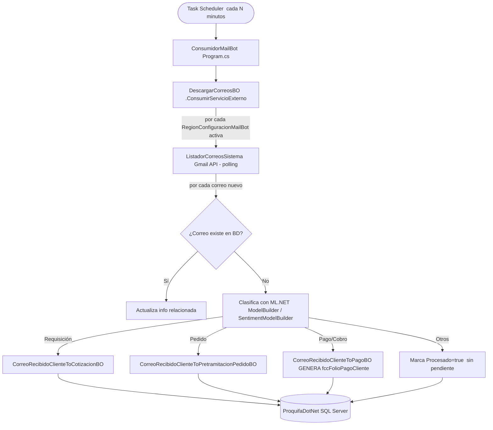
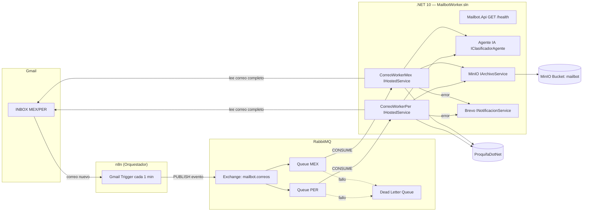
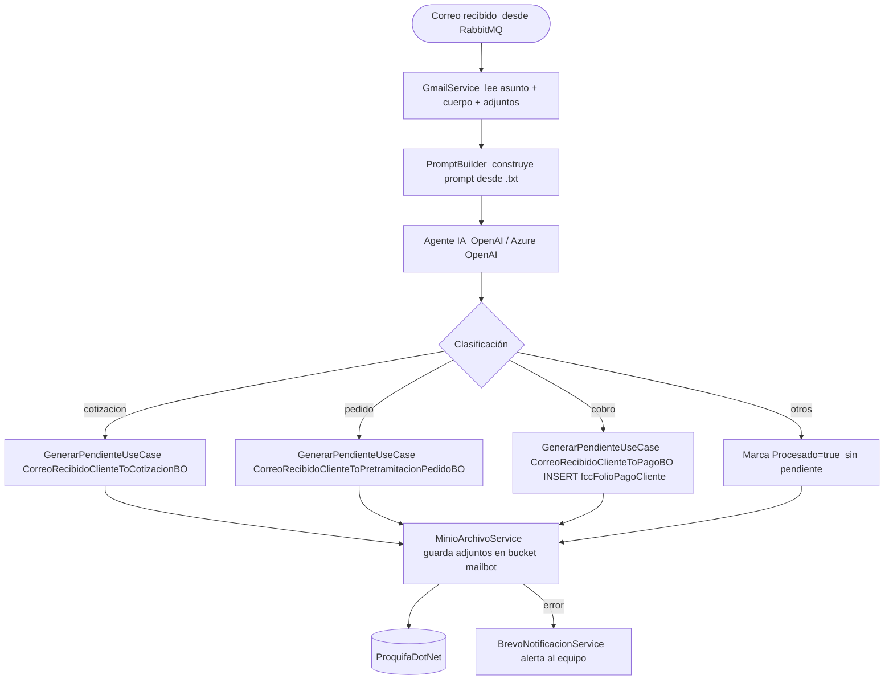

# TPSC-RE-FU-008-Back — Análisis de Impacto Backend
**Requisito:** TPSC-RE-FU-008 — Buzón de Cobros  
**Propuesta:** Propuesta 1 — n8n + RabbitMQ + Worker .NET 10  
**Proyecto:** ProquifaDotNet + MailbotWorker.sln (nueva solución)  
**Rama:** develop-pack04  

---

## 1. Mailbot Actual — Estructura y Limitaciones

### 1.1 Proyecto actual

| Elemento | Detalle |
|----------|---------|
| **Proyecto** | `_Ejecutables\_Catalogo\ConsumidorMailBot` |
| **Framework** | .NET Framework 4.8 — aplicación de consola |
| **Ejecución** | Tarea de Windows (Task Scheduler) — corre a intervalos fijos |
| **Clasificador IA** | ML.NET 1.5.4 — modelos entrenados con archivos `.zip` locales |
| **Lectura de correos** | Gmail API v1 (OAuth2) — polling por región (`RegionConfiguracionMailBot`) |
| **Dependencias** | `Logic.Pqf.Catalogos`, `Logic.Pqf.Logistica` |

### 1.2 Flujo actual



### 1.3 Archivos clave del Mailbot actual

| Archivo | Responsabilidad |
|---------|-----------------|
| `ConsumidorMailBot\Program.cs` | Punto de entrada — construye modelos ML y lanza `DescargarCorreosBO` |
| `ConsumidorMailBot\Library\DescargarCorreosBO.cs` | Orquestador principal — itera configuraciones por región, clasifica y persiste |
| `ConsumidorMailBot\Library\ListadorCorreosSistema.cs` | Interfaz con Gmail API — polling de inbox por región |
| `ConsumidorMailBot\ML\ModelBuilder.cs` | Construye modelo ML.NET de clasificación de documentos |
| `ConsumidorMailBot\ML\SentimentModelBuilder.cs` | Construye modelo ML.NET de clasificación por sentimiento |
| `Logic.Pqf.Logistica\L11.MailBot\Procesos\GeneradorProcesoMailBotBO.cs` | Switch de clasificación: Requisición / Pedido / Pago → enruta al BO correspondiente |
| `Logic.Pqf.Logistica\L11.MailBot\Procesos\Pagos\CorreoRecibidoClienteToPagoBO.cs` | Genera `fccFolioPagoCliente` al clasificar como Cobro |

### 1.4 Limitaciones del Mailbot actual

| # | Limitación | Impacto |
|:-:|-----------|---------|
| L1 | Polling fijo (Task Scheduler) — latencia de minutos entre recepción y clasificación | Correos de cobro urgentes se atienden tarde |
| L2 | ML.NET 1.5.4 con modelos `.zip` estáticos — reentrenamiento manual y costoso | Modelo no mejora con nuevos correos sin intervención |
| L3 | Switch evalúa `ClasificacionCorreoRecibido` (nombre display) — frágil ante cambios de catálogo | Bug latente: renombrar "Pago" en BD rompe el switch |
| L4 | `case "Pago"` vacío en `GeneradorProcesoMailBotBO` — el correo queda marcado como procesado sin generar pendiente correctamente | FU-008 Regla 1 no cumplida en la rama actual |
| L5 | Sin integración con MinIO para adjuntos | Archivos del correo no persisten en almacenamiento externo |
| L6 | Sin integración con Brevo para notificaciones de error | Errores del Mailbot solo en log local |
| L7 | Clasificador no lee adjuntos (PDF/imagen) para extracción de datos | El Gestor captura todo manualmente en Validar Cobro |

---

## 2. Propuesta 1 — Nueva Solución `MailbotWorker.sln` (.NET 10)

### 2.1 Motivación del rediseño

| Cambio | Mailbot Actual | Propuesta 1 |
|--------|---------------|-------------|
| Activación | Task Scheduler (polling) | n8n + RabbitMQ (evento por correo nuevo) |
| Clasificador | ML.NET estático | Agente IA (OpenAI / Azure OpenAI) |
| Lectura adjuntos | Solo asunto + cuerpo | Asunto + cuerpo + **archivos adjuntos** |
| Almacenamiento adjuntos | Sin MinIO | **Integración MinIO** |
| Notificaciones error | Log local | **Integración Brevo** |
| Escalabilidad | Proceso único | Workers paralelos por región |

### 2.2 Arquitectura de la solución nueva



### 2.3 Estructura de la solución

```
MailbotWorker.sln
│
├── Mailbot.Worker
│     Program.cs                         ← Host builder, DI, configuración
│     Workers/
│       CorreoWorkerMex.cs               ← IHostedService: consume queue MEX
│       CorreoWorkerPer.cs               ← IHostedService: consume queue PER
│
├── Mailbot.Api
│     Program.cs                         ← Minimal API (.NET 10)
│     Endpoints/
│       HealthEndpoints.cs               ← GET /health, GET /metrics
│       ReentrenamientoEndpoints.cs      ← POST /reentrenamiento/trigger
│
├── Mailbot.Application
│     UseCases/
│       ProcesarCorreoUseCase.cs         ← orquesta clasificación y persistencia
│       GenerarPendienteUseCase.cs       ← crea pendiente según clasificación
│     DTOs/
│       EventoCorreoDto.cs               ← payload del mensaje RabbitMQ
│       ResultadoClasificacionDto.cs     ← respuesta del Agente IA
│
├── Mailbot.Domain
│     Entities/
│       CorreoRecibido.cs
│       ClasificacionCorreo.cs
│       EventoCorreo.cs
│     Interfaces/
│       IClasificadorAgente.cs           ← contrato Agente IA
│       ICorreoRepository.cs
│       IArchivoService.cs               ← contrato MinIO
│       INotificacionService.cs          ← contrato Brevo
│       IEventoQueue.cs                  ← contrato RabbitMQ
│
├── Mailbot.Infrastructure
│     Gmail/
│       GmailService.cs                  ← lee correo completo vía Gmail API
│     RabbitMQ/
│       RabbitMQConsumer.cs              ← consume cola por región
│       RabbitMQConfig.cs               ← exchange, queues, bindings
│     IA/
│       OpenAIClasificadorAgente.cs      ← implementa IClasificadorAgente
│       PromptBuilder.cs                 ← construye prompts desde archivos .txt
│     Prompts/
│       clasificacion_correo.txt         ← prompt editable sin recompilar
│       extraccion_cobro.txt
│       extraccion_pedido.txt
│       extraccion_cotizacion.txt
│     MinIO/
│       MinioArchivoService.cs           ← implementa IArchivoService
│     Brevo/
│       BrevoNotificacionService.cs      ← implementa INotificacionService
│     Persistence/
│       ProquifaDbContext.cs             ← EF Core Scaffold ProquifaDotNet
│       Repositories/
│         CorreoRepository.cs
│         PendienteRepository.cs
│
└── Mailbot.Tests
      Unit/
        ProcesarCorreoUseCaseTests.cs
        ClasificadorAgenteTests.cs
      Integration/
        RabbitMQConsumerTests.cs
        ProquifaDbContextTests.cs
```

---

## 3. Agente IA — Clasificación y Extracción

### 3.1 Flujo de clasificación



### 3.2 Diseño del Agente IA

| Aspecto | Decisión de diseño |
|---------|-------------------|
| **Proveedor** | OpenAI / Azure OpenAI — definir según costo y privacidad (ver GAP-01) |
| **Inputs del prompt** | Asunto del correo + cuerpo (texto plano) + texto extraído de adjuntos (PDF/imagen) |
| **Outputs esperados** | `{ clasificacion: "cobro|pedido|cotizacion|otros", confianza: 0.0-1.0, datos_extraidos: {...} }` |
| **Prompts** | Archivos `.txt` editables en `Mailbot.Infrastructure\Prompts\` — sin recompilar |
| **Extensibilidad** | Agregar nueva clasificación = agregar archivo `.txt` de prompt + case en `GenerarPendienteUseCase` |
| **Entrenamiento** | No requerido para LLM (zero/few-shot). Requiere ajuste de prompts con correos reales de PROQUIFA |
| **Log de clasificaciones** | `MailbotClasificacionLog` — registra clasificación IA, confianza, tokens usados y corrección manual |

---

## 4. Impacto en ProquifaDotNet (Framework 4.8)

### 4.1 Cambios requeridos en `Logic.Pqf.Logistica` (L11)

#### GAP-01 — `GeneradorProcesoMailBotBO`: `case "Pago"` vacío y switch frágil
**Archivo:** `Logic.Pqf.Logistica\L11.MailBot\Procesos\GeneradorProcesoMailBotBO.cs`  
**Impacto:** L3, L4 — El switch evalúa nombre display y el case de cobro no genera pendiente.  
**Cambio requerido:**

```csharp
// Antes — frágil, case "Pago" vacío
switch (catClasificacionCorreoRecibido.ClasificacionCorreoRecibido)
{
    case "Requisición": ...
    case "Pedido": ...
    case "Pago":
        Logger.Debug("...");   // sin lógica — FU-008 no cumplido
        break;
}

// Después — evalúa Clave (técnica), conecta cobro a CorreoRecibidoClienteToPagoBO
switch (catClasificacionCorreoRecibido.Clave?.Trim().ToLowerInvariant())
{
    case ClasificacionCorreoRecibidoConstants.Requisicion:
        var generadorA = new CorreoRecibidoClienteToCotizacionBO(usuario.IdUsuario);
        generadorA.Process(correoRecibidoCliente);
        break;
    case ClasificacionCorreoRecibidoConstants.Pedido:
        var generadorB = new CorreoRecibidoClienteToPretramitacionPedidoBO(usuario.IdUsuario);
        generadorB.Process(correoRecibidoCliente);
        break;
    case ClasificacionCorreoRecibidoConstants.Cobro:   // antes: "Pago" vacío
        var generadorC = new CorreoRecibidoClienteToPagoBO();
        generadorC.Process(input, context);
        break;
    default:
        Logger.Debug("Clasificación sin proceso asignado");
        break;
}
```

#### GAP-02 — Crear `ClasificacionCorreoRecibidoConstants.cs`
**Archivo nuevo:** `Logic.Pqf.Logistica\L11.MailBot\Constantes\ClasificacionCorreoRecibidoConstants.cs`

```csharp
namespace Logic.Pqf.Logistica.L11.MailBot.Constantes
{
    public static class ClasificacionCorreoRecibidoConstants
    {
        public const string Requisicion = "requisicion";
        public const string Pedido      = "pedido";
        public const string Cobro       = "cobro";   // antes: Pago = "pago" — actualizar tras script BD
        public const string Otros       = "otros";
    }
}
```

#### GAP-03 — Crear `CorreoRecibidoClienteBuzonCobrosBO` (listado paginado del Buzón)
**Archivo nuevo:** `Logic.Pqf.Logistica\L11.MailBot\Procesos\Cobros\CorreoRecibidoClienteBuzonCobrosBO.cs`

```csharp
public QueryResult<vCorreoRecibidoBuzonCobros> Lista(QueryInfo info, Guid idUsuarioCobrador, Guid idRegion)
{
    // Filtra por clasificación cobro + cobrador del usuario logueado + región + Activo
    // Patrón equivalente al Buzón de Requisiciones y Buzón de Pedidos (D3)
}
```

#### GAP-04 — Crear `BuzonCobrosController`
**Archivo nuevo:** `WebApi.Logistica\Controllers\Procesos\Mailbot\BuzonCobrosController.cs`

```csharp
[HttpPost]
[Route("BuzonCobros")]
public HttpResponseMessage Lista([FromBody] QueryInfo info)
{
    return TryExecute(() =>
    {
        var usuario      = ObtenerUsuarioAutenticado();
        var idCobrador   = usuario.IdUsuario;   // del token
        var idRegion     = usuario.IdRegion;    // del token — segregación MEX/PER
        var bo           = new CorreoRecibidoClienteBuzonCobrosBO();
        var result       = bo.Lista(info, idCobrador, idRegion);
        return result != null
            ? Request.CreateResponse(HttpStatusCode.OK, result)
            : Request.CreateResponse(HttpStatusCode.NoContent);
    });
}
```

### 4.2 Cambios requeridos en Base de Datos

| # | Objeto | Cambio | Prioridad |
|:-:|--------|--------|:---------:|
| 1 | `catClasificacionCorreoRecibido` | Renombrar `Clave='pago'` → `'cobro'`, `ClasificacionCorreoRecibido='Pago'` → `'Cobro'` | 🔴 Alta |
| 2 | `catProceso` | INSERT proceso `'Cobros'` con `Clave='cobros'` | 🔴 Alta |
| 3 | `MailbotEventoCorreo` | CREATE TABLE nueva — trazabilidad de eventos RabbitMQ | 🔴 Alta |
| 4 | `MailbotClasificacionLog` | CREATE TABLE nueva — auditoría clasificaciones IA | 🔴 Alta |

### 4.3 Scaffold EF Core para `MailbotWorker.sln`

```bash
dotnet ef dbcontext scaffold \
  "Server=RYNL010;Database=ProquifaDotNet;..." \
  Microsoft.EntityFrameworkCore.SqlServer \
  --output-dir Persistence/Entities \
  --context ProquifaDbContext \
  --tables \
    RegionConfiguracionMailBot \
    CorreoRecibido \
    CorreoRecibidoContenido \
    CorreoRecibidoCliente \
    CorreoRecibidoEstatus \
    ArchivoCorreoRecibido \
    catClasificacionCorreoRecibido \
    catProceso \
    catDominioCorreoRecibidoPendiente \
    fccFolioPagoCliente \
    Region \
    MailbotEventoCorreo \
    MailbotClasificacionLog \
  --no-onconfiguring \
  --force
```

---

## 5. Integración MinIO

**Propósito:** Guardar los archivos adjuntos del correo (PDF, imágenes de comprobante) en MinIO para consulta desde Validar Cobro y el Buzón.

| Aspecto | Detalle |
|---------|---------|
| **Bucket** | `mailbot` — subcarpeta por región (`mex/`, `per/`) |
| **Cuándo se guarda** | Al procesar el correo en el Worker — antes de persistir en BD |
| **Referencia en BD** | `ArchivoCorreoRecibido.UrlArchivo` almacena la ruta del objeto en MinIO |
| **Interfaz** | `IArchivoService` — implementado por `MinioArchivoService` en `Mailbot.Infrastructure` |
| **Patrón existente** | Seguir el patrón de `Logic.Pqf.Catalogos.Archivos.buckets` del proyecto actual |

---

## 6. Integración Brevo

**Propósito:** Enviar alertas por correo al equipo de operaciones cuando el Worker falla al procesar un correo (mensaje en DLQ o excepción no controlada).

| Aspecto | Detalle |
|---------|---------|
| **Cuándo se envía** | Al mover mensaje a DLQ o al capturar excepción en el Worker |
| **Destinatarios** | Equipo de operaciones / TechLead — configurable en `appsettings.json` |
| **Contenido** | IdGmail, región, error, número de intentos, timestamp |
| **Interfaz** | `INotificacionService` — implementado por `BrevoNotificacionService` |
| **Configuración** | API key de Brevo gestionada vía secret manager — no en `appsettings.json` |

---

## 7. Resumen de archivos a modificar / crear

### En `ProquifaDotNet` (Framework 4.8)

|  #  | Archivo                                                                                 | Tipo                                |
| :-: | --------------------------------------------------------------------------------------- | ----------------------------------- |
|  1  | `Logic.Pqf.Logistica\L11.MailBot\Constantes\ClasificacionCorreoRecibidoConstants.cs`    | **Nuevo**                           |
|  2  | `Logic.Pqf.Logistica\L11.MailBot\Procesos\GeneradorProcesoMailBotBO.cs`                 | **Modificar** — refactorizar switch |
|  3  | `Logic.Pqf.Logistica\L11.MailBot\Procesos\Cobros\CorreoRecibidoClienteBuzonCobrosBO.cs` | **Nuevo**                           |
|  4  | `WebApi.Logistica\Controllers\Procesos\Mailbot\BuzonCobrosController.cs`                | **Nuevo**                           |
|  5  | `Scripts\R16\FU-008_CatalogosCobros.sql`                                                | **Nuevo** — script BD               |

### Nueva solución `MailbotWorker.sln` (.NET 10)

| # | Proyecto / Archivo | Tipo |
|:-:|-------------------|------|
| 6 | `MailbotWorker.sln` | **Nuevo** — solución completa |
| 7 | `Mailbot.Worker\Workers\CorreoWorkerMex.cs` | **Nuevo** |
| 8 | `Mailbot.Worker\Workers\CorreoWorkerPer.cs` | **Nuevo** |
| 9 | `Mailbot.Api\Endpoints\HealthEndpoints.cs` | **Nuevo** |
| 10 | `Mailbot.Application\UseCases\ProcesarCorreoUseCase.cs` | **Nuevo** |
| 11 | `Mailbot.Application\UseCases\GenerarPendienteUseCase.cs` | **Nuevo** |
| 12 | `Mailbot.Infrastructure\Gmail\GmailService.cs` | **Nuevo** |
| 13 | `Mailbot.Infrastructure\RabbitMQ\RabbitMQConsumer.cs` | **Nuevo** |
| 14 | `Mailbot.Infrastructure\IA\OpenAIClasificadorAgente.cs` | **Nuevo** |
| 15 | `Mailbot.Infrastructure\MinIO\MinioArchivoService.cs` | **Nuevo** |
| 16 | `Mailbot.Infrastructure\Brevo\BrevoNotificacionService.cs` | **Nuevo** |
| 17 | `Mailbot.Infrastructure\Persistence\ProquifaDbContext.cs` | **Nuevo** — scaffold |

---

## 8. Archivos del Mailbot actual que NO requieren cambio

| Archivo | Motivo |
|---------|--------|
| `ConsumidorMailBot\Library\ListadorCorreosSistema.cs` | El Worker nuevo usa Gmail API directamente con `GmailService.cs` |
| `ConsumidorMailBot\ML\ModelBuilder.cs` | Reemplazado por Agente IA en la nueva solución |
| `CorreoRecibidoBO.cs` / `CorreoRecibidoEstatusBO.cs` | Sin cambios — referenciados por nueva implementación |
| `CorreoRecibidoTransaccionBO.cs` | Sin cambios — lógica de spam y desactivación no aplica a FU-008 |

---

## 9. Pendientes / Decisiones abiertas

| # | Pendiente | Responsable |
|:-:|-----------|-------------|
| P1 | Definir proveedor IA: OpenAI vs Azure OpenAI vs modelo propio (costo, privacidad, SLA) | TechLead / Arquitectura |
| P2 | Confirmar Opción A (renombrar Pago→Cobro) o Opción B (INSERT nueva clasificación) en `catClasificacionCorreoRecibido` | Product Owner |
| P3 | Confirmar correos reales de PROQUIFA disponibles para ajuste de prompts del Agente IA | PROQUIFA / Product Owner |
| P4 | Confirmar licencia n8n: self-hosted (gratis) vs cloud (costo) | Infraestructura / IT |
| P5 | Confirmar cuentas Gmail por región (MEX / PER) para el nuevo Worker | IT / PROQUIFA |
| P6 | Definir bucket MinIO y política de retención de adjuntos del Mailbot | TechLead / Infraestructura |
| P7 | Confirmar comportamiento para correos clasificados como cobro sin cliente identificable | Product Owner |

---

## 10. Criterios de aceptación técnica

- [ ] `GeneradorProcesoMailBotBO` evalúa `Clave` (no nombre display) usando `ClasificacionCorreoRecibidoConstants`
- [ ] `case ClasificacionCorreoRecibidoConstants.Cobro` invoca `CorreoRecibidoClienteToPagoBO` y genera `fccFolioPagoCliente`
- [ ] `POST /BuzonCobros` retorna listado paginado filtrado por cobrador e `IdRegion` del usuario logueado
- [ ] La región y el cobrador se extraen del token — no se aceptan como parámetros externos
- [ ] El Worker nuevo consume colas RabbitMQ MEX y PER de forma independiente
- [ ] El Agente IA clasifica correctamente por asunto, cuerpo y adjuntos (cotización / pedido / cobro / otros)
- [ ] Los adjuntos del correo se guardan en MinIO antes de persistir en BD
- [ ] Los errores del Worker envían alerta vía Brevo al equipo de operaciones
- [ ] `MailbotEventoCorreo` registra cada evento procesado con estado y reintentos
- [ ] `MailbotClasificacionLog` registra cada clasificación del Agente IA con confianza y tokens usados
- [ ] Correos MEX no aparecen en buzón PER y viceversa (segregación por región)
- [ ] La solución `MailbotWorker.sln` compila en .NET 10 sin errores
- [ ] `ProquifaDotNet` (Framework 4.8) compila sin errores tras los cambios en L11
- [ ] PR aprobado por líder técnico
